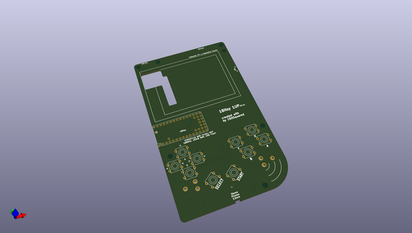
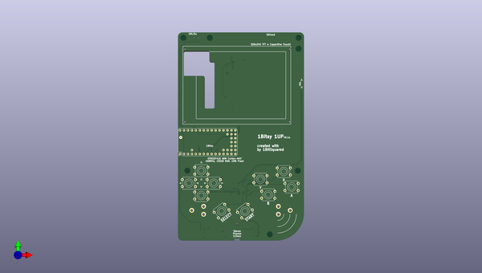
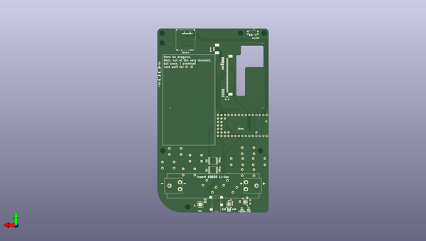

# 1bitsy_1up
 
## summary 
* id: 1bitsy_1bitsy_1up_1bitsy_1up
* user: 1bitsy
* name: 1bitsy_1up
* board: 1bitsy_1up
* repo: https://github.com/1Bitsy/1bitsy-1up
* src_file_repo_kicad_pcb: hardware/v0.2/1bitsy-1up.kicad_pcb
* src_file_repo_kicad_pcb_link: https://github.com/1Bitsy/1bitsy-1up/tree/master/hardware/v0.2/1bitsy-1up.kicad_pcb

* src_file_repo_sch: hardware/v0.2/1bitsy-1up.sch
* src_file_repo_sch_link: https://github.com/1Bitsy/1bitsy-1up/tree/master/hardware/v0.2/1bitsy-1up.sch

## schematic  
  
[schematic (pdf)](working_schematic.pdf)  

## pcb  
 
  
  
  
[board (pdf)](working.pdf)  

## working_bom
| Id | Designator | Footprint | Quantity | Designation | Supplier and ref |  | None | 
| --- | --- | --- | --- | --- | --- | --- | --- | 
| 1 | P1 | PAD_MILL-MAX_0906 | 1 | PogoPin |  |  | [''] | 
| 2 | SW1 | Tact_Switch_Top_TH_7.8MM_Snap | 1 | UP |  |  | [''] | 
| 3 | SW2 | Tact_Switch_Top_TH_7.8MM_Snap | 1 | Y |  |  | [''] | 
| 4 | SW3 | Tact_Switch_Top_TH_7.8MM_Snap | 1 | LEFT |  |  | [''] | 
| 5 | SW4 | Tact_Switch_Top_TH_7.8MM_Snap | 1 | RIGHT |  |  | [''] | 
| 6 | SW5 | Tact_Switch_Top_TH_7.8MM_Snap | 1 | X |  |  | [''] | 
| 7 | SW6 | Tact_Switch_Top_TH_7.8MM_Snap | 1 | A |  |  | [''] | 
| 8 | SW7 | Tact_Switch_Top_TH_7.8MM_Snap | 1 | SELECT |  |  | [''] | 
| 9 | SW8 | Tact_Switch_Top_TH_7.8MM_Snap | 1 | DOWN |  |  | [''] | 
| 10 | SW9 | Tact_Switch_Top_TH_7.8MM_Snap | 1 | B |  |  | [''] | 
| 11 | SW10 | Tact_Switch_Top_TH_7.8MM_Snap | 1 | START |  |  | [''] | 
| 12 | U1 | 1bitsy-sl-1xx-xx-19 | 1 | 1bitsy-complete-concise |  |  | [''] | 
| 13 | REF**,REF**,REF**,REF**,REF**,REF**,REF** | MountingHole_3-5mm | 7 | MountingHole_3-5mm |  |  | [''] | 
| 14 | REF** | ER-TFT028-4-mechanical | 1 | ER-TFT028-4-mechanical |  |  | [''] | 
| 15 | C1 | C_0805 | 1 | 10u |  |  | [''] | 
| 16 | C2,C3,C10,C11,C12 | C_0402 | 5 | 100n |  |  | [''] | 
| 17 | C4,C5,C6,C7,C9 | C_0402 | 5 | 1u |  |  | [''] | 
| 18 | C8 | C_0402 | 1 | 2u2 |  |  | [''] | 
| 19 | CON1 | SCHA4B0419 | 1 | pkl_Micro_SD |  |  | [''] | 
| 20 | D1 | D_0603 | 1 | YEL |  |  | [''] | 
| 21 | D2 | D_0603 | 1 | GRN |  |  | [''] | 
| 22 | J1,J2,J3,J4 | J_0402 | 4 | pkl_jumper |  |  | [''] | 
| 23 | J6 | J_0602 | 1 | Jumper_Dual |  |  | [''] | 
| 24 | J7 | SJ2-35853B-SMT | 1 | pkl_JACK_3C1S |  |  | [''] | 
| 25 | Q1 | SOT-23 | 1 | NMOS |  |  | [''] | 
| 26 | R1,R2,R3,R4 | R_0603 | 4 | 10E |  |  | [''] | 
| 27 | R5,R8,R9,R12,R13,R16,R17,R21,R22,R23,R25 | R_0402 | 11 | 10k |  |  | [''] | 
| 28 | R6,R7,R10,R11 | R_Array_Convex_4x0402 | 4 | 10k |  |  | [''] | 
| 29 | R14,R15 | R_0402 | 2 | 50E |  |  | [''] | 
| 30 | R18 | R_0402 | 1 | 0E |  |  | [''] | 
| 31 | R19 | R_0402 | 1 | 590E |  |  | [''] | 
| 32 | R20 | R_0402 | 1 | 1k1 |  |  | [''] | 
| 33 | SW11 | SW_SPDT_PCM12 | 1 | pkl_SWITCH-SPDT |  |  | [''] | 
| 34 | SW12,SW13 | Tact_Switch_Side_B3U-3000P | 2 | ~ |  |  | [''] | 
| 35 | U2 | ER-CON50HT | 1 | lcd_50pin_logic |  |  | [''] | 
| 36 | U3 | ER-CON06HB | 1 | lcd_cap_touch_buydisplay |  |  | [''] | 
| 37 | U4,U5 | TSSOP-16_4.4x5mm_Pitch0.65mm | 2 | 74HC165 |  |  | [''] | 
| 38 | U6 | QFN-16-1EP_3x3mm_Pitch0.5mm | 1 | BQ24075 |  |  | [''] | 
| 39 | U7 | QFN-16-1EP_3x3mm_Pitch0.5mm | 1 | TPA6135A2 |  |  | [''] | 
| 40 | U8 | QFN-16-1EP_4x4mm_Pitch0.65mm | 1 | MCP4661-103E/ML |  |  | [''] | 
| 41 | BT1 | BATTERY_CLIP_18650 | 1 | Battery_Cell |  |  | [''] | 
| 42 | R24 | R_0402 | 1 | 4k7 |  |  | [''] | 

## positions
### top
| # Ref     Val                      Package                             PosX       PosY       Rot  Side | 
| --- | 
| P1        PogoPin                  PAD_MILL-MAX_0906                31.8000   -97.6000    0.0000  top | 
| REF**     MountingHole_3-5mm       MountingHole_3-5mm              107.5000   -33.5000    0.0000  top | 
| REF**     MountingHole_3-5mm       MountingHole_3-5mm               33.5000   -33.5000    0.0000  top | 
| REF**     MountingHole_3-5mm       MountingHole_3-5mm              107.5000   -40.5000    0.0000  top | 
| REF**     MountingHole_3-5mm       MountingHole_3-5mm               50.5000   -33.5000    0.0000  top | 
| REF**     MountingHole_3-5mm       MountingHole_3-5mm               89.0000  -160.0000    0.0000  top | 
| REF**     MountingHole_3-5mm       MountingHole_3-5mm              107.0000  -119.0000    0.0000  top | 
| REF**     MountingHole_3-5mm       MountingHole_3-5mm               36.0000  -119.0000    0.0000  top | 
| REF**     ER-TFT028-4-mechanical   ER-TFT028-4-mechanical           70.5000   -64.0000  -90.0000  top | 
| SW1       UP                       Tact_Switch_Top_TH_7.8MM_Snap    45.0000  -119.0000  180.0000  top | 
| SW2       Y                        Tact_Switch_Top_TH_7.8MM_Snap    83.0000  -124.5000  180.0000  top | 
| SW3       LEFT                     Tact_Switch_Top_TH_7.8MM_Snap    37.0000  -127.0000  180.0000  top | 
| SW4       RIGHT                    Tact_Switch_Top_TH_7.8MM_Snap    53.0000  -127.0000  180.0000  top | 
| SW5       X                        Tact_Switch_Top_TH_7.8MM_Snap    98.0000  -119.5000  180.0000  top | 
| SW6       A                        Tact_Switch_Top_TH_7.8MM_Snap   103.0000  -129.5000    0.0000  top | 
| SW7       SELECT                   Tact_Switch_Top_TH_7.8MM_Snap    58.0000  -145.0000   37.0000  top | 
| SW8       DOWN                     Tact_Switch_Top_TH_7.8MM_Snap    45.0000  -135.0000    0.0000  top | 
| SW9       B                        Tact_Switch_Top_TH_7.8MM_Snap    88.0000  -134.5000    0.0000  top | 
| SW10      START                    Tact_Switch_Top_TH_7.8MM_Snap    73.0000  -145.0000   37.0000  top | 
| U1        1bitsy-complete-concise  1bitsy-sl-1xx-xx-19              31.3210  -108.2531   90.0000  top | 
| ## End | 

### bottom
| BT1       Battery_Cell              BATTERY_CLIP_18650              70.5000  -144.5000    0.0000  bottom | 
| --- | 
| C1        10u                       C_0805                          63.7750   -56.0500  180.0000  bottom | 
| C2        100n                      C_0402                          63.3000   -58.5000  180.0000  bottom | 
| C3        100n                      C_0402                          63.3000   -57.5000  180.0000  bottom | 
| C4        1u                        C_0402                          75.7000  -154.6000  -90.0000  bottom | 
| C5        1u                        C_0402                          76.7000  -154.6000  -90.0000  bottom | 
| C6        1u                        C_0402                          56.4000  -158.3000   90.0000  bottom | 
| C7        1u                        C_0402                          59.0000  -155.4000  180.0000  bottom | 
| C8        2u2                       C_0402                          56.4000  -156.4000  -90.0000  bottom | 
| C9        1u                        C_0402                          57.5000  -160.6000    0.0000  bottom | 
| C10       100n                      C_0402                          65.4000  -131.2000   90.0000  bottom | 
| C11       100n                      C_0402                          65.4000  -124.4000   90.0000  bottom | 
| C12       100n                      C_0402                          83.8000  -159.0000   90.0000  bottom | 
| CON1      pkl_Micro_SD              SCHA4B0419                      90.5000   -45.8000    0.0000  bottom | 
| D1        YEL                       D_0603                          44.6000  -162.0000    0.0000  bottom | 
| D2        GRN                       D_0603                          49.5000  -162.0000  180.0000  bottom | 
| J1        pkl_jumper                J_0402                          63.3000   -54.6000  180.0000  bottom | 
| J2        pkl_jumper                J_0402                          63.3000   -53.5000  180.0000  bottom | 
| J3        pkl_jumper                J_0402                          63.3000   -52.4000  180.0000  bottom | 
| J4        pkl_jumper                J_0402                          63.3000   -51.3000  180.0000  bottom | 
| J6        Jumper_Dual               J_0602                          58.8000  -161.7000    0.0000  bottom | 
| J7        pkl_JACK_3C1S             SJ2-35853B-SMT                  68.0000  -158.0000   90.0000  bottom | 
| Q1        NMOS                      SOT-23                          60.2000   -80.7000   90.0000  bottom | 
| R1        10E                       R_0603                          63.2000   -79.2000    0.0000  bottom | 
| R2        10E                       R_0603                          63.2000   -77.7000    0.0000  bottom | 
| R3        10E                       R_0603                          63.2000   -76.2000    0.0000  bottom | 
| R4        10E                       R_0603                          63.2000   -74.7000    0.0000  bottom | 
| R5        10k                       R_0402                          63.3000   -59.5000  180.0000  bottom | 
| R6        10k                       R_Array_Convex_4x0402           75.2000  -133.3000   90.0000  bottom | 
| R7        10k                       R_Array_Convex_4x0402           65.8000  -133.3000  -90.0000  bottom | 
| R8        10k                       R_0402                          72.2000   -46.3000   90.0000  bottom | 
| R9        10k                       R_0402                          72.2000   -44.4000  -90.0000  bottom | 
| R10       10k                       R_Array_Convex_4x0402           75.2000  -126.5000   90.0000  bottom | 
| R11       10k                       R_Array_Convex_4x0402           65.8000  -126.5000  -90.0000  bottom | 
| R12       10k                       R_0402                          45.6000  -152.9000  180.0000  bottom | 
| R13       10k                       R_0402                          57.5000  -154.9000  -90.0000  bottom | 
| R14       50E                       R_0402                          75.7000  -156.5000   90.0000  bottom | 
| R15       50E                       R_0402                          76.7000  -156.5000   90.0000  bottom | 
| R16       10k                       R_0402                          44.6000  -160.7000    0.0000  bottom | 
| R17       10k                       R_0402                          45.6000  -153.9000  180.0000  bottom | 
| R18       0E                        R_0402                          43.5000  -157.5000  -90.0000  bottom | 
| R19       590E                      R_0402                          43.5000  -155.1000   90.0000  bottom | 
| R20       1k1                       R_0402                          45.6000  -159.1000  180.0000  bottom | 
| R21       10k                       R_0402                          49.5000  -160.7000  180.0000  bottom | 
| R22       10k                       R_0402                          48.6000  -153.9000    0.0000  bottom | 
| R23       10k                       R_0402                          60.1000  -160.6000    0.0000  bottom | 
| R24       4k7                       R_0402                          50.9000  -155.5000    0.0000  bottom | 
| R25       10k                       R_0402                          50.9000  -156.5000  180.0000  bottom | 
| SW11      pkl_SWITCH-SPDT           SW_SPDT_PCM12                   41.5000   -33.0000    0.0000  bottom | 
| SW12      ~                         Tact_Switch_Side_B3U-3000P     109.5000   -60.2500    0.0000  bottom | 
| SW13      ~                         Tact_Switch_Side_B3U-3000P     109.5000   -65.7500    0.0000  bottom | 
| U2        lcd_50pin_logic           ER-CON50HT                      57.8000   -64.0000   90.0000  bottom | 
| U3        lcd_cap_touch_buydisplay  ER-CON06HB                      67.5000   -44.8000   90.0000  bottom | 
| U4        74HC165                   TSSOP-16_4.4x5mm_Pitch0.65mm    70.5000  -133.3000  180.0000  bottom | 
| U5        74HC165                   TSSOP-16_4.4x5mm_Pitch0.65mm    70.5000  -126.5000  180.0000  bottom | 
| U6        BQ24075                   QFN-16-1EP_3x3mm_Pitch0.5mm     47.0000  -156.5000  -90.0000  bottom | 
| U7        TPA6135A2                 QFN-16-1EP_3x3mm_Pitch0.5mm     59.0000  -158.0000  180.0000  bottom | 
| U8        MCP4661-103E/ML           QFN-16-1EP_4x4mm_Pitch0.65mm    79.9000  -158.2000   90.0000  bottom | 
| ## End | 

