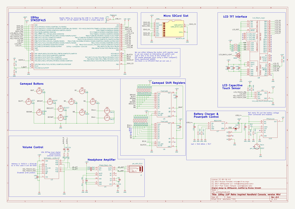
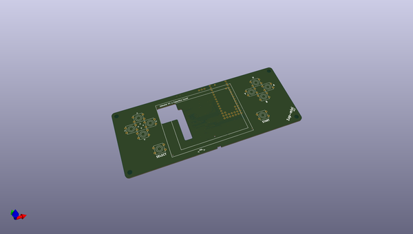
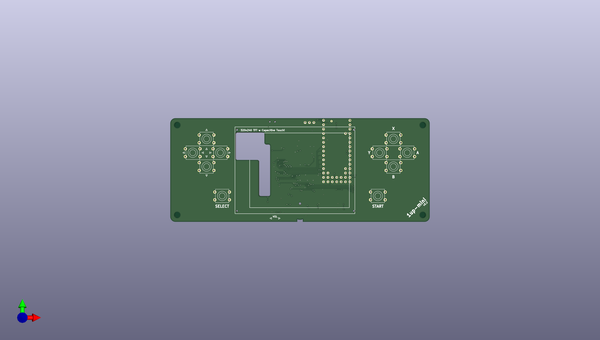
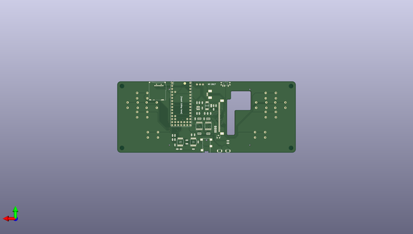

# 1bitsy_1up
 
## summary 
* id: 1bitsy_1bitsy_1up_1up_mini
* user: 1bitsy
* name: 1bitsy_1up
* board: 1up_mini
* repo: https://github.com/1Bitsy/1bitsy-1up
* src_file_repo_kicad_pcb: hardware/contrib/1up-mini/1up-mini.kicad_pcb
* src_file_repo_kicad_pcb_link: https://github.com/1Bitsy/1bitsy-1up/tree/master/hardware/contrib/1up-mini/1up-mini.kicad_pcb

* src_file_repo_sch: hardware/contrib/1up-mini/1up-mini.sch
* src_file_repo_sch_link: https://github.com/1Bitsy/1bitsy-1up/tree/master/hardware/contrib/1up-mini/1up-mini.sch
* full details link: https://github.com/oomlout/oomlout_oomp_project_bot_v_2/tree/main/projects/1bitsy_1bitsy_1up_1up_mini/current_version/working  

## schematic  
  
[schematic (pdf)](working_schematic.pdf)  

## pcb  
 
  
  
  
[board (pdf)](working.pdf)  

## working_bom
| Id | Designator | Footprint | Quantity | Designation | Supplier and ref |  | None | 
| --- | --- | --- | --- | --- | --- | --- | --- | 
| 1 | REF**,REF**,REF**,REF** | MountingHole_3-5mm | 4 | MountingHole_3-5mm |  |  | [''] | 
| 2 | SW2 | Tact_Switch_Top_TH_7.8MM_Snap | 1 | LEFT |  |  | [''] | 
| 3 | SW3 | Tact_Switch_Top_TH_7.8MM_Snap | 1 | UP |  |  | [''] | 
| 4 | SW4 | Tact_Switch_Top_TH_7.8MM_Snap | 1 | DOWN |  |  | [''] | 
| 5 | SW5 | Tact_Switch_Top_TH_7.8MM_Snap | 1 | RIGHT |  |  | [''] | 
| 6 | SW6 | Tact_Switch_Top_TH_7.8MM_Snap | 1 | SELECT |  |  | [''] | 
| 7 | SW7 | Tact_Switch_Top_TH_7.8MM_Snap | 1 | START |  |  | [''] | 
| 8 | SW8 | Tact_Switch_Top_TH_7.8MM_Snap | 1 | X |  |  | [''] | 
| 9 | SW9 | Tact_Switch_Top_TH_7.8MM_Snap | 1 | Y |  |  | [''] | 
| 10 | SW10 | Tact_Switch_Top_TH_7.8MM_Snap | 1 | B |  |  | [''] | 
| 11 | SW11 | Tact_Switch_Top_TH_7.8MM_Snap | 1 | A |  |  | [''] | 
| 12 | REF** | ER-TFT028-4-mechanical | 1 | ER-TFT028-4-mechanical |  |  | [''] | 
| 13 | U3 | TSSOP-14_4.4x5mm_Pitch0.65mm | 1 | MCP4661-103E/ST |  |  | [''] | 
| 14 | C28 | C_0805 | 1 | 10u |  |  | [''] | 
| 15 | CON1 | SCHA4B0419 | 1 | pkl_Micro_SD |  |  | [''] | 
| 16 | D2 | D_0603 | 1 | YEL |  |  | [''] | 
| 17 | J3 | SJ2-35853B-SMT | 1 | pkl_JACK_3C1S |  |  | [''] | 
| 18 | Q1 | SOT-23 | 1 | NMOS |  |  | [''] | 
| 19 | R20,R21,R22,R23 | R_0603 | 4 | 10E |  |  | [''] | 
| 20 | SW12,SW13 | Tact_Switch_Side_B3U-3000P | 2 | ~ |  |  | [''] | 
| 21 | SW14 | SW_SPDT_PCM12 | 1 | pkl_SWITCH-SPDT |  |  | [''] | 
| 22 | U5,U6 | TSSOP-16_4.4x5mm_Pitch0.65mm | 2 | 74HC165 |  |  | [''] | 
| 23 | U8 | ER-CON50HT | 1 | lcd_50pin_logic |  |  | [''] | 
| 24 | U9 | ER-CON06HB | 1 | lcd_cap_touch_buydisplay |  |  | [''] | 
| 25 | C19,C26,C27,C29,C30 | C_0603 | 5 | 100n |  |  | [''] | 
| 26 | C20,C21,C24,C25,C31,C32,C33 | C_0603 | 7 | 1u |  |  | [''] | 
| 27 | C22,C23 | C_0603 | 2 | 2u2 |  |  | [''] | 
| 28 | R6 | R_0603 | 1 | 4k7 |  |  | [''] | 
| 29 | R7,R10,R16,R19,R25,R26,R30 | R_0603 | 7 | 10k |  |  | [''] | 
| 30 | R8,R9 | R_0603 | 2 | 50E |  |  | [''] | 
| 31 | R11 | R_0603 | 1 | 49k |  |  | [''] | 
| 32 | R12,R13,R14,R15 | R_Array_Concave_4x0603 | 4 | 10k |  |  | [''] | 
| 33 | R17,R18 | R_0603 | 2 | 2k7 |  |  | [''] | 
| 34 | R24 | R_0603 | 1 | 1k |  |  | [''] | 
| 35 | U10 | TSSOP-8_4.4x3mm_Pitch0.65mm | 1 | TPS2111A |  |  | [''] | 
| 36 | U4 | TSSOP-14_4.4x5mm_Pitch0.65mm | 1 | TPA6139A2-PW |  |  | [''] | 
| 37 | U7 | SOT-23-6 | 1 | BQ21040 |  |  | [''] | 
| 38 | P1 | PAD_MILL-MAX_0906 | 1 | PogoPin |  |  | [''] | 
| 39 | U2 | 1bitsy-sl-1xx-xx-19 | 1 | 1bitsy-complete-concise |  |  | [''] | 
| 40 | P2,P3,P4 | Pin_Header_Straight_Round_1x01 | 3 | CONN_01X01 |  |  | [''] | 

## bom_schematic
| Ref | Qnty | Value | Cmp name | Footprint | Description | Vendor | DNP | 
| --- | --- | --- | --- | --- | --- | --- | --- | 
| C19, C26, C27, C29, C30 | 5 | 100n | pkl_C_Small | pkl_dipol:C_0603 |  |  |  | 
| C20, C21, C24, C25, C31, C32, C33 | 7 | 1u | pkl_C_Small | pkl_dipol:C_0603 |  |  |  | 
| C22, C23 | 2 | 2u2 | pkl_C_Small | pkl_dipol:C_0603 |  |  |  | 
| C28 | 1 | 10u | pkl_C | pkl_dipol:C_0805 |  |  |  | 
| CON1 | 1 | pkl_Micro_SD | pkl_Micro_SD | pkl_misc:SCHA4B0419 |  |  |  | 
| D2 | 1 | YEL | pkl_LED | pkl_dipol:D_0603 |  |  |  | 
| J3 | 1 | pkl_JACK_3C1S | pkl_JACK_3C1S | pkl_connectors:SJ2-35853B-SMT |  |  |  | 
| P1 | 1 | PogoPin | PAD_SMD | pkl_pads:PAD_MILL-MAX_0906 |  |  |  | 
| P2, P3, P4 | 3 | CONN_01X01 | CONN_01X01 | pkl_pin_headers:Pin_Header_Straight_Round_1x01 |  |  |  | 
| Q1 | 1 | NMOS | pkl_Q_NMOS_BD_GSD | TO_SOT_Packages_SMD:SOT-23 |  |  |  | 
| R6 | 1 | 4k7 | pkl_R_Small | pkl_dipol:R_0603 |  |  |  | 
| R7, R10, R16, R19, R25, R26, R30 | 7 | 10k | pkl_R_Small | pkl_dipol:R_0603 |  |  |  | 
| R8, R9 | 2 | 50E | pkl_R_Small | pkl_dipol:R_0603 |  |  |  | 
| R11 | 1 | 49k | pkl_R_Small | pkl_dipol:R_0603 |  |  |  | 
| R12, R13, R14, R15 | 4 | 10k | pkl_R4_Small | pkl_dipol:R_Array_Concave_4x0603 |  |  |  | 
| R17, R18 | 2 | 2k7 | pkl_R_Small | pkl_dipol:R_0603 |  |  |  | 
| R20, R21, R22, R23 | 4 | 10E | pkl_R_Small | pkl_dipol:R_0603 |  |  |  | 
| R24 | 1 | 1k | pkl_R_Small | pkl_dipol:R_0603 |  |  |  | 
| SW2 | 1 | LEFT | TACT | pkl_buttons_switches:Tact_Switch_Top_TH_7.8MM_Snap |  |  |  | 
| SW3 | 1 | UP | TACT | pkl_buttons_switches:Tact_Switch_Top_TH_7.8MM_Snap |  |  |  | 
| SW4 | 1 | DOWN | TACT | pkl_buttons_switches:Tact_Switch_Top_TH_7.8MM_Snap |  |  |  | 
| SW5 | 1 | RIGHT | TACT | pkl_buttons_switches:Tact_Switch_Top_TH_7.8MM_Snap |  |  |  | 
| SW6 | 1 | SELECT | TACT | pkl_buttons_switches:Tact_Switch_Top_TH_7.8MM_Snap |  |  |  | 
| SW7 | 1 | START | TACT | pkl_buttons_switches:Tact_Switch_Top_TH_7.8MM_Snap |  |  |  | 
| SW8 | 1 | X | TACT | pkl_buttons_switches:Tact_Switch_Top_TH_7.8MM_Snap |  |  |  | 
| SW9 | 1 | Y | TACT | pkl_buttons_switches:Tact_Switch_Top_TH_7.8MM_Snap |  |  |  | 
| SW10 | 1 | B | TACT | pkl_buttons_switches:Tact_Switch_Top_TH_7.8MM_Snap |  |  |  | 
| SW11 | 1 | A | TACT | pkl_buttons_switches:Tact_Switch_Top_TH_7.8MM_Snap |  |  |  | 
| SW12, SW13 | 2 | ~ | TACT | pkl_buttons_switches:Tact_Switch_Side_B3U-3000P |  |  |  | 
| SW14 | 1 | pkl_SWITCH-SPDT | pkl_SWITCH-SPDT | pkl_buttons_switches:SW_SPDT_PCM12 |  |  |  | 
| U2 | 1 | 1bitsy-complete-concise | 1bitsy-complete-concise | 1bitsy:1bitsy-sl-1xx-xx-19 |  |  |  | 
| U3 | 1 | MCP4661-103E/ST | MCP4661-ST | Housings_SSOP:TSSOP-14_4.4x5mm_Pitch0.65mm |  |  |  | 
| U4 | 1 | TPA6139A2-PW | TPA6139A2-PW | Housings_SSOP:TSSOP-14_4.4x5mm_Pitch0.65mm |  |  |  | 
| U5, U6 | 2 | 74HC165 | 74HC165 | pkl_housings_sop:TSSOP-16_4.4x5mm_Pitch0.65mm |  |  |  | 
| U7 | 1 | BQ21040 | BQ21040 | pkl_housings_sot:SOT-23-6 |  |  |  | 
| U8 | 1 | lcd_50pin_logic | lcd_50pin_logic | pkl_connectors:ER-CON50HT |  |  |  | 
| U9 | 1 | lcd_cap_touch_buydisplay | LCD_CAP_TOUCH | pkl_connectors:ER-CON06HB |  |  |  | 
| U10 | 1 | TPS2111A | TPS2111A | Housings_SSOP:TSSOP-8_4.4x3mm_Pitch0.65mm |  |  |  | 

## mounting_holes
| x | y | package | value | ref | size | 
| --- | --- | --- | --- | --- | --- | 
| 0.0 | 52.0 | MountingHole_3-5mm | MountingHole_3-5mm | REF** | m3 | 
| 0.0 | 0.0 | MountingHole_3-5mm | MountingHole_3-5mm | REF** | m3 | 
| 142.0 | 52.0 | MountingHole_3-5mm | MountingHole_3-5mm | REF** | m3 | 
| 142.0 | 0.0 | MountingHole_3-5mm | MountingHole_3-5mm | REF** | m3 | 

