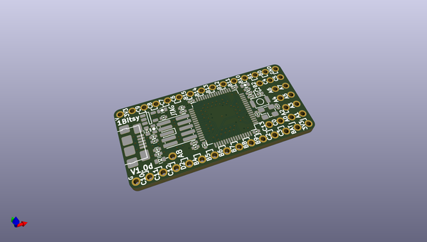
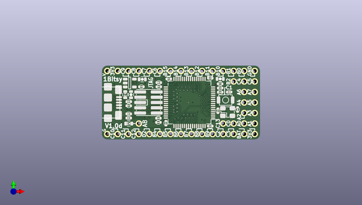
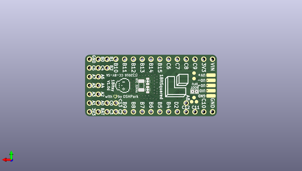

# 1bitsy_hardware
 
## summary 
* id: 1bitsy_1bitsy_hardware_1bitsy_rr
* user: 1bitsy
* name: 1bitsy_hardware
* board: 1bitsy_rr
* repo: https://github.com/1Bitsy/1bitsy-hardware
* src_file_repo_kicad_pcb: 1bitsy/v1.0d/1bitsy-rr.kicad_pcb
* src_file_repo_kicad_pcb_link: https://github.com/1Bitsy/1bitsy-hardware/tree/master/1bitsy/v1.0d/1bitsy-rr.kicad_pcb

* src_file_repo_sch: 1bitsy/v1.0c/1bitsy.sch
* src_file_repo_sch_link: https://github.com/1Bitsy/1bitsy-hardware/tree/master/1bitsy/v1.0c/1bitsy.sch

## pcb  
 
  
  
  
[board (pdf)](working.pdf)  

## working_bom
| Id | Designator | Footprint | Quantity | Designation | Supplier and ref |  | None | 
| --- | --- | --- | --- | --- | --- | --- | --- | 
| 1 | C1,C5,C13 | C_0603 | 3 | 4u7 |  |  | [''] | 
| 2 | C2,C15 | C_0402 | 2 | 1u |  |  | [''] | 
| 3 | C3 | C_0402 | 1 | 470p |  |  | [''] | 
| 4 | C4,C10,C11,C12,C14,C18 | C_0402 | 6 | 100n |  |  | [''] | 
| 5 | C8,C9 | C_0402 | 2 | 10p |  |  | [''] | 
| 6 | C16,C17 | C_0402 | 2 | 2u2 |  |  | [''] | 
| 7 | D1 | D_0603 | 1 | >100mA |  |  | [''] | 
| 8 | L1 | L_0402 | 1 | Ferr |  |  | [''] | 
| 9 | LED1 | D_0603 | 1 | ORA |  |  | [''] | 
| 10 | P1,P2,P3,P4,P5,P6,P7,P8,P9,P10,P11,P12,P13,P14,P15,P16,P17,P18,P19,P20,P21,P22,P23,P25,P26,P27,P28,P29,P30,P31,P32,P33,P34,P35,P36,P37,P38,P39,P40,P41,P42,P53,P54,P55 | Pin_Header_Straight_Round_1x01 | 44 | CONN_01X01 |  |  | [''] | 
| 11 | P24 | Connector_USB_Micro_B_SMD | 1 | USB_OTG |  |  | [''] | 
| 12 | R1,R2,R3,R5 | R_0402 | 4 | 10k |  |  | [''] | 
| 13 | R4 | R_0402 | 1 | 300 |  |  | [''] | 
| 14 | U1 | SOT-23-5 | 1 | VREG_3V3 |  |  | [''] | 
| 15 | U2 | LQFP-64_10x10mm_Pitch0.5mm | 1 | STM32F415RGT |  |  | [''] | 
| 16 | X2 | ABM8 | 1 | 25MHz |  |  | [''] | 
| 17 | X3 | FTSH-105-XX-X-DV | 1 | JTAG-10 |  |  | [''] | 
| 18 | SW1 | Tact_Switch_Top_B3U-1000P | 1 | TACT_G |  |  | [''] | 
| 19 | REF**,REF**,REF**,REF**,REF**,REF**,REF**,REF**,REF**,REF**,REF**,REF**,REF**,REF**,REF**,REF**,REF** | via0305 | 17 | via0305 |  |  | [''] | 
| 20 | C6,C7 | C_0603 | 2 | 10p |  |  | [''] | 
| 21 | J1 | J_0603 | 1 | BOOT |  |  | [''] | 
| 22 | X1 | ABS07 | 1 | 32.768kHz |  |  | [''] | 
| 23 | P43,P44,P45,P46,P47 | POGO_PAD_SMD_R_1x1 | 5 | TP |  |  | [''] | 
| 24 | P48,P49,P50,P51,P52 | PAD_SMD_1x2.65 | 5 | CONN_01X01 |  |  | [''] | 
| 25 | REF** | 1bitsy_silk_025grid | 1 | 1bitsy_copper_025grid |  |  | [''] | 
| 26 | REF** | heart_mask_015grid | 1 | heart_mask_010grid |  |  | [''] | 
| 27 | REF** | 1b2_Logo_SilkS_6.5mm | 1 | 1b2_Logo_SilkS_6.5mm |  |  | [''] | 

## positions
### top
| # Ref | Val | Package | PosX | PosY | Rot | Side | 
| --- | --- | --- | --- | --- | --- | --- | 
| C1 | 4u7 | C_0603 | 107.33 | -43.82 | -90.0 | top | 
| C2 | 1u | C_0402 | 128.83 | -42.22 | 0.0 | top | 
| C3 | 470p | C_0402 | 109.83 | -41.92 | 0.0 | top | 
| C4 | 100n | C_0402 | 128.83 | -43.22 | 0.0 | top | 
| C5 | 4u7 | C_0603 | 128.83 | -40.02 | 0.0 | top | 
| C8 | 10p | C_0402 | 128.28 | -47.72 | -90.0 | top | 
| C9 | 10p | C_0402 | 133.03 | -47.42 | 90.0 | top | 
| C10 | 100n | C_0402 | 126.43 | -39.82 | 0.0 | top | 
| C11 | 100n | C_0402 | 116.43 | -40.02 | 180.0 | top | 
| C12 | 100n | C_0402 | 115.73 | -50.72 | -90.0 | top | 
| C13 | 4u7 | C_0603 | 110.03 | -40.12 | 0.0 | top | 
| C14 | 100n | C_0402 | 126.43 | -51.42 | 0.0 | top | 
| C15 | 1u | C_0402 | 106.78 | -46.52 | 180.0 | top | 
| C16 | 2u2 | C_0402 | 113.93 | -50.52 | 180.0 | top | 
| C17 | 2u2 | C_0402 | 114.03 | -41.92 | 180.0 | top | 
| C18 | 100n | C_0402 | 113.93 | -49.52 | 180.0 | top | 
| D1 | >100mA | D_0603 | 105.93 | -43.82 | -90.0 | top | 
| L1 | Ferr | L_0402 | 128.83 | -41.22 | 0.0 | top | 
| LED1 | ORA | D_0603 | 106.78 | -50.82 | 180.0 | top | 
| P1 | CONN_01X01 | Pin_Header_Straight_Round_1x01 | 134.62 | -50.8 | 180.0 | top | 
| P2 | CONN_01X01 | Pin_Header_Straight_Round_1x01 | 137.16 | -50.8 | 180.0 | top | 
| P3 | CONN_01X01 | Pin_Header_Straight_Round_1x01 | 134.62 | -48.26 | 180.0 | top | 
| P4 | CONN_01X01 | Pin_Header_Straight_Round_1x01 | 137.16 | -48.26 | 180.0 | top | 
| P5 | CONN_01X01 | Pin_Header_Straight_Round_1x01 | 134.62 | -45.72 | 180.0 | top | 
| P6 | CONN_01X01 | Pin_Header_Straight_Round_1x01 | 137.16 | -45.72 | 0.0 | top | 
| P7 | CONN_01X01 | Pin_Header_Straight_Round_1x01 | 134.62 | -43.18 | 180.0 | top | 
| P8 | CONN_01X01 | Pin_Header_Straight_Round_1x01 | 137.16 | -43.18 | 180.0 | top | 
| P9 | CONN_01X01 | Pin_Header_Straight_Round_1x01 | 109.22 | -50.8 | 0.0 | top | 
| P10 | CONN_01X01 | Pin_Header_Straight_Round_1x01 | 132.08 | -50.8 | 0.0 | top | 
| P11 | CONN_01X01 | Pin_Header_Straight_Round_1x01 | 111.76 | -53.34 | 0.0 | top | 
| P12 | CONN_01X01 | Pin_Header_Straight_Round_1x01 | 129.54 | -53.34 | 0.0 | top | 
| P13 | CONN_01X01 | Pin_Header_Straight_Round_1x01 | 132.08 | -53.34 | 180.0 | top | 
| P14 | CONN_01X01 | Pin_Header_Straight_Round_1x01 | 134.62 | -40.64 | 0.0 | top | 
| P15 | CONN_01X01 | Pin_Header_Straight_Round_1x01 | 137.16 | -40.64 | 180.0 | top | 
| P16 | CONN_01X01 | Pin_Header_Straight_Round_1x01 | 114.3 | -38.1 | 0.0 | top | 
| P17 | CONN_01X01 | Pin_Header_Straight_Round_1x01 | 111.76 | -38.1 | 0.0 | top | 
| P18 | CONN_01X01 | Pin_Header_Straight_Round_1x01 | 109.22 | -38.1 | 0.0 | top | 
| P19 | CONN_01X01 | Pin_Header_Straight_Round_1x01 | 106.68 | -38.1 | 0.0 | top | 
| P20 | CONN_01X01 | Pin_Header_Straight_Round_1x01 | 104.13 | -53.34 | 0.0 | top | 
| P21 | CONN_01X01 | Pin_Header_Straight_Round_1x01 | 106.68 | -53.34 | 180.0 | top | 
| P22 | CONN_01X01 | Pin_Header_Straight_Round_1x01 | 109.22 | -53.34 | 0.0 | top | 
| P23 | CONN_01X01 | Pin_Header_Straight_Round_1x01 | 129.54 | -50.8 | 0.0 | top | 
| P24 | USB_OTG | Connector_USB_Micro_B_SMD | 101.755 | -45.72 | 180.0 | top | 
| P25 | CONN_01X01 | Pin_Header_Straight_Round_1x01 | 134.62 | -38.1 | 0.0 | top | 
| P26 | CONN_01X01 | Pin_Header_Straight_Round_1x01 | 132.08 | -38.1 | 0.0 | top | 
| P27 | CONN_01X01 | Pin_Header_Straight_Round_1x01 | 132.08 | -40.64 | 0.0 | top | 
| P28 | CONN_01X01 | Pin_Header_Straight_Round_1x01 | 114.3 | -53.34 | 0.0 | top | 
| P29 | CONN_01X01 | Pin_Header_Straight_Round_1x01 | 116.84 | -53.34 | 180.0 | top | 
| P30 | CONN_01X01 | Pin_Header_Straight_Round_1x01 | 119.38 | -53.34 | 180.0 | top | 
| P31 | CONN_01X01 | Pin_Header_Straight_Round_1x01 | 121.92 | -53.34 | 180.0 | top | 
| P32 | CONN_01X01 | Pin_Header_Straight_Round_1x01 | 124.46 | -53.34 | 180.0 | top | 
| P33 | CONN_01X01 | Pin_Header_Straight_Round_1x01 | 127.0 | -53.34 | 0.0 | top | 
| P34 | CONN_01X01 | Pin_Header_Straight_Round_1x01 | 129.54 | -38.1 | 180.0 | top | 
| P35 | CONN_01X01 | Pin_Header_Straight_Round_1x01 | 127.0 | -38.1 | 0.0 | top | 
| P36 | CONN_01X01 | Pin_Header_Straight_Round_1x01 | 124.46 | -38.1 | 0.0 | top | 
| P37 | CONN_01X01 | Pin_Header_Straight_Round_1x01 | 121.92 | -38.1 | 0.0 | top | 
| P38 | CONN_01X01 | Pin_Header_Straight_Round_1x01 | 119.38 | -38.1 | 0.0 | top | 
| P39 | CONN_01X01 | Pin_Header_Straight_Round_1x01 | 116.84 | -38.1 | 180.0 | top | 
| P40 | CONN_01X01 | Pin_Header_Straight_Round_1x01 | 101.6 | -38.1 | 0.0 | top | 
| P41 | CONN_01X01 | Pin_Header_Straight_Round_1x01 | 101.6 | -53.34 | 0.0 | top | 
| P42 | CONN_01X01 | Pin_Header_Straight_Round_1x01 | 104.14 | -38.1 | 0.0 | top | 
| P53 | CONN_01X01 | Pin_Header_Straight_Round_1x01 | 134.62 | -53.34 | 0.0 | top | 
| P54 | CONN_01X01 | Pin_Header_Straight_Round_1x01 | 137.16 | -53.34 | 0.0 | top | 
| P55 | CONN_01X01 | Pin_Header_Straight_Round_1x01 | 137.16 | -38.1 | 0.0 | top | 
| R1 | 10k | R_0402 | 106.78 | -45.52 | 0.0 | top | 
| R2 | 10k | R_0402 | 114.03 | -40.92 | 180.0 | top | 
| R3 | 10k | R_0402 | 106.78 | -48.47 | 180.0 | top | 
| R4 | 300 | R_0402 | 106.78 | -49.47 | 0.0 | top | 
| R5 | 10k | R_0402 | 131.0 | -43.2 | 180.0 | top | 
| REF** | via0305 | via0305 | 105.0798 | -50.5206 | 0.0 | top | 
| REF** | via0305 | via0305 | 103.23 | -41.22 | 0.0 | top | 
| REF** | via0305 | via0305 | 119.33 | -44.47 | 0.0 | top | 
| REF** | via0305 | via0305 | 122.18 | -45.72 | 0.0 | top | 
| REF** | via0305 | via0305 | 122.33 | -43.27 | 0.0 | top | 
| REF** | via0305 | via0305 | 102.83 | -51.02 | 0.0 | top | 
| REF** | via0305 | via0305 | 110.73 | -41.12 | 0.0 | top | 
| REF** | via0305 | via0305 | 126.9238 | -50.3428 | 0.0 | top | 
| REF** | via0305 | via0305 | 119.23 | -45.37 | 0.0 | top | 
| REF** | via0305 | via0305 | 135.89 | -39.37 | 0.0 | top | 
| REF** | via0305 | via0305 | 124.4 | -49.9 | 0.0 | top | 
| REF** | via0305 | via0305 | 123.43 | -48.02 | 0.0 | top | 
| REF** | via0305 | via0305 | 126.18 | -47.12 | 0.0 | top | 
| REF** | via0305 | via0305 | 130.23 | -48.02 | 0.0 | top | 
| REF** | via0305 | via0305 | 112.6998 | -50.2666 | 0.0 | top | 
| REF** | via0305 | via0305 | 130.08 | -41.02 | 0.0 | top | 
| REF** | via0305 | via0305 | 115.35 | -40.75 | 0.0 | top | 
| SW1 | TACT_G | Tact_Switch_Top_B3U-1000P | 130.13 | -45.12 | -90.0 | top | 
| U1 | VREG_3V3 | SOT-23-5 | 107.03 | -41.02 | 180.0 | top | 
| U2 | STM32F415RGT | LQFP-64_10x10mm_Pitch0.5mm | 121.43 | -45.72 | 180.0 | top | 
| X2 | 25MHz | ABM8 | 130.63 | -48.02 | 0.0 | top | 
| X3 | JTAG-10 | FTSH-105-XX-X-DV | 111.53 | -45.72 | 90.0 | top | 

### bottom
| # Ref | Val | Package | PosX | PosY | Rot | Side | 
| --- | --- | --- | --- | --- | --- | --- | 
| C6 | 10p | C_0603 | 120.33 | -46.92 | -90.0 | bottom | 
| C7 | 10p | C_0603 | 120.33 | -44.52 | 90.0 | bottom | 
| J1 | BOOT | J_0603 | 106.78 | -47.47 | 0.0 | bottom | 
| P43 | TP | POGO_PAD_SMD_R_1x1 | 106.93 | -42.12 | 0.0 | bottom | 
| P44 | TP | POGO_PAD_SMD_R_1x1 | 106.93 | -43.72 | 0.0 | bottom | 
| P45 | TP | POGO_PAD_SMD_R_1x1 | 106.23 | -50.42 | 0.0 | bottom | 
| P46 | TP | POGO_PAD_SMD_R_1x1 | 107.63 | -50.42 | 0.0 | bottom | 
| P47 | TP | POGO_PAD_SMD_R_1x1 | 106.93 | -49.22 | 0.0 | bottom | 
| P48 | CONN_01X01 | PAD_SMD_1x2.65 | 102.03 | -42.72 | 0.0 | bottom | 
| P49 | CONN_01X01 | PAD_SMD_1x2.65 | 102.03 | -44.22 | 0.0 | bottom | 
| P50 | CONN_01X01 | PAD_SMD_1x2.65 | 102.03 | -45.72 | 0.0 | bottom | 
| P51 | CONN_01X01 | PAD_SMD_1x2.65 | 102.03 | -47.22 | 0.0 | bottom | 
| P52 | CONN_01X01 | PAD_SMD_1x2.65 | 102.03 | -48.72 | 0.0 | bottom | 
| REF** | 1bitsy_copper_025grid | 1bitsy_silk_025grid | 127.0508 | -45.72 | -90.0 | bottom | 
| REF** | heart_mask_010grid | heart_mask_015grid | 129.6718 | -48.8696 | 180.0 | bottom | 
| REF** | 1b2_Logo_SilkS_6.5mm | 1b2_Logo_SilkS_6.5mm | 111.93 | -45.72 | -90.0 | bottom | 
| X1 | 32.768kHz | ABS07 | 122.18 | -45.72 | -90.0 | bottom | 

