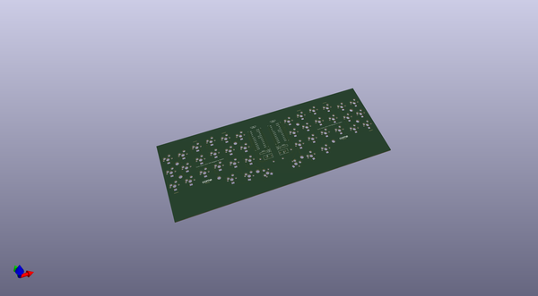
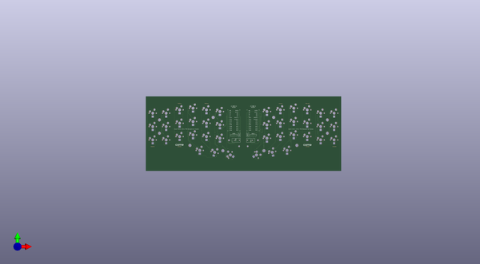
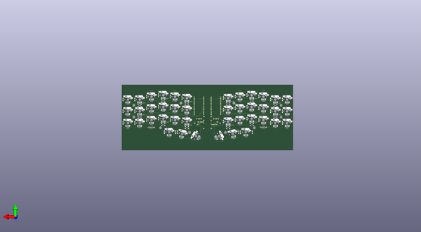

# crkbd
 
## summary 
* id: 50an6xy06r6n_crkbd_corne_cherry
* user: 50an6xy06r6n
* name: crkbd
* board: corne_cherry
* repo: https://github.com/50an6xy06r6n/crkbd
* src_file_repo_kicad_pcb: corne-cherry/pcb/corne-cherry.kicad_pcb
* src_file_repo_kicad_pcb_link: https://github.com/50an6xy06r6n/crkbd/tree/master/corne-cherry/pcb/corne-cherry.kicad_pcb

* src_file_repo_sch: corne-cherry/pcb/corne-cherry.sch
* src_file_repo_sch_link: https://github.com/50an6xy06r6n/crkbd/tree/master/corne-cherry/pcb/corne-cherry.sch

## schematic  
  
[schematic (pdf)](working_schematic.pdf)  

## pcb  
 
  
  
  
[board (pdf)](working.pdf)  

## working_bom
| Id | Designator | Footprint | Quantity | Designation | Supplier and ref |  | None | 
| --- | --- | --- | --- | --- | --- | --- | --- | 
| 1 | J1,J3 | MJ-4PP-9_1side | 2 | MJ-4PP-9 |  |  | [''] | 
| 2 | J2,J4 | OLED_1side | 2 | OLED |  |  | [''] | 
| 3 | RSW1,RSW2 | ResetSW_1side | 2 | SW_PUSH |  |  | [''] | 
| 4 | SW2,SW3,SW4,SW5,SW7,SW8,SW9,SW10,SW11,SW12,SW13,SW14,SW15,SW16,SW17,SW18,SW19,SW20,SW37,SW38,SW39,SW40,SW41,SW25,SW26,SW28,SW24,SW29,SW35,SW36,SW22,SW23,SW30,SW31,SW32,SW33,SW34,SW1,SW6,SW27 | CherryMX_Hotswap | 40 | SW_PUSH |  |  | [''] | 
| 5 | SW21,SW42 | CherryMX_Hotswap_1.5u | 2 | SW_PUSH |  |  | [''] | 
| 6 | U1,U2 | ProMicro_v3 | 2 | ProMicro |  |  | [''] | 
| 7 | REF**,REF**,REF**,REF**,REF**,REF**,REF**,REF** | Breakaway_Tabs | 8 | Breakaway_Tabs |  |  | [''] | 
| 8 | G***,G***,G***,G*** | corne-logo-horizontal | 4 | LOGO |  |  | [''] | 
| 9 | D1,D2,D3,D4,D5,D6,D7,D8,D9,D10,D11,D12,D13,D14,D15,D16,D17,D18,D19,D20,D21,D23,D24,D25,D27,D28,D29,D30,D31,D32,D33,D34,D35,D36,D37,D38,D39,D40,D41,D42,D22,D26 | D3_SMD_v2 | 42 | D |  |  | [''] | 
| 10 | LED7,LED8,LED9,LED10,LED11,LED12,LED13,LED14,LED15,LED16,LED17,LED18,LED19,LED20,LED21,LED22,LED24,LED27,LED43,LED44,LED45,LED46,LED47,LED48,LED49,LED50,LED51,LED52,LED53,LED25,LED26,LED23,LED34,LED35,LED36,LED37,LED38,LED39,LED40,LED41,LED42,LED54 | YS-SK6812MINI-E | 42 | YS-SK6812MINI-E |  |  | [''] | 
| 11 | LED1,LED2,LED3,LED5,LED6,LED28,LED29,LED30,LED31,LED32,LED33,LED4 | LED_WS2812B_PLCC4_5.0x5.0mm_P3.2mm | 12 | WS2812B |  |  | [''] | 

## bom_schematic
no data

## positions
### top
| # Ref | Val | Package | PosX | PosY | Rot | Side | 
| --- | --- | --- | --- | --- | --- | --- | 
| G*** | LOGO | corne-logo-horizontal | -108.597 | 14.26 | 0.0 | top | 
| G*** | LOGO | corne-logo-horizontal | 71.913 | 14.11 | 0.0 | top | 
| J1 | MJ-4PP-9 | MJ-4PP-9_1side | -22.73 | 20.858 | -90.0 | top | 
| J2 | OLED | OLED_1side | -35.916 | 28.122 | 0.0 | top | 
| J3 | MJ-4PP-9 | MJ-4PP-9_1side | -14.327 | 20.88 | 90.0 | top | 
| J4 | OLED | OLED_1side | -8.687 | 28.13 | 0.0 | top | 
| REF** | Breakaway_Tabs | Breakaway_Tabs | -108.6277 | 73.281 | 0.0 | top | 
| REF** | Breakaway_Tabs | Breakaway_Tabs | -70.657 | 73.277 | 0.0 | top | 
| REF** | Breakaway_Tabs | Breakaway_Tabs | -146.702 | 11.974 | 0.0 | top | 
| REF** | Breakaway_Tabs | Breakaway_Tabs | -108.741 | 11.972 | 0.0 | top | 
| RSW1 | SW_PUSH | ResetSW_1side | -24.44 | 28.619 | -90.0 | top | 
| RSW2 | SW_PUSH | ResetSW_1side | -12.56 | 28.628 | -90.0 | top | 
| SW1 | SW_PUSH | CherryMX_Hotswap | -146.757 | 59.37 | 0.0 | top | 
| SW2 | SW_PUSH | CherryMX_Hotswap | -127.757 | 59.37 | 0.0 | top | 
| SW3 | SW_PUSH | CherryMX_Hotswap | -108.757 | 64.12 | 0.0 | top | 
| SW4 | SW_PUSH | CherryMX_Hotswap | -89.757 | 66.495 | 0.0 | top | 
| SW5 | SW_PUSH | CherryMX_Hotswap | -70.757 | 64.12 | 0.0 | top | 
| SW6 | SW_PUSH | CherryMX_Hotswap | -51.757 | 61.745 | 0.0 | top | 
| SW7 | SW_PUSH | CherryMX_Hotswap | -146.757 | 40.37 | 0.0 | top | 
| SW8 | SW_PUSH | CherryMX_Hotswap | -127.757 | 40.37 | 0.0 | top | 
| SW9 | SW_PUSH | CherryMX_Hotswap | -108.757 | 45.12 | 0.0 | top | 
| SW10 | SW_PUSH | CherryMX_Hotswap | -89.757 | 47.495 | 0.0 | top | 
| SW11 | SW_PUSH | CherryMX_Hotswap | -70.757 | 45.12 | 0.0 | top | 
| SW12 | SW_PUSH | CherryMX_Hotswap | -51.757 | 42.745 | 0.0 | top | 
| SW13 | SW_PUSH | CherryMX_Hotswap | -146.757 | 21.37 | 0.0 | top | 
| SW14 | SW_PUSH | CherryMX_Hotswap | -127.757 | 21.37 | 0.0 | top | 
| SW15 | SW_PUSH | CherryMX_Hotswap | -108.757 | 26.12 | 0.0 | top | 
| SW16 | SW_PUSH | CherryMX_Hotswap | -89.757 | 28.495 | 0.0 | top | 
| SW17 | SW_PUSH | CherryMX_Hotswap | -70.757 | 26.12 | 0.0 | top | 
| SW18 | SW_PUSH | CherryMX_Hotswap | -51.757 | 23.745 | 0.0 | top | 
| SW19 | SW_PUSH | CherryMX_Hotswap | -80.257 | 6.495 | 0.0 | top | 
| SW20 | SW_PUSH | CherryMX_Hotswap | -59.257 | 3.745 | -15.0 | top | 
| SW21 | SW_PUSH | CherryMX_Hotswap_1.5u | -37.007 | -0.005 | 60.0 | top | 
| SW22 | SW_PUSH | CherryMX_Hotswap | 109.75 | 59.375 | 0.0 | top | 
| SW23 | SW_PUSH | CherryMX_Hotswap | 90.75 | 59.375 | 0.0 | top | 
| SW24 | SW_PUSH | CherryMX_Hotswap | 71.75 | 64.125 | 0.0 | top | 
| SW25 | SW_PUSH | CherryMX_Hotswap | 52.75 | 66.5 | 0.0 | top | 
| SW26 | SW_PUSH | CherryMX_Hotswap | 33.75 | 64.125 | 0.0 | top | 
| SW27 | SW_PUSH | CherryMX_Hotswap | 14.743 | 61.745 | 0.0 | top | 
| SW28 | SW_PUSH | CherryMX_Hotswap | 109.75 | 40.375 | 0.0 | top | 
| SW29 | SW_PUSH | CherryMX_Hotswap | 90.75 | 40.375 | 0.0 | top | 
| SW30 | SW_PUSH | CherryMX_Hotswap | 71.75 | 45.125 | 0.0 | top | 
| SW31 | SW_PUSH | CherryMX_Hotswap | 52.75 | 47.5 | 0.0 | top | 
| SW32 | SW_PUSH | CherryMX_Hotswap | 33.75 | 45.125 | 0.0 | top | 
| SW33 | SW_PUSH | CherryMX_Hotswap | 14.75 | 42.75 | 0.0 | top | 
| SW34 | SW_PUSH | CherryMX_Hotswap | 109.75 | 21.375 | 0.0 | top | 
| SW35 | SW_PUSH | CherryMX_Hotswap | 90.75 | 21.375 | 0.0 | top | 
| SW36 | SW_PUSH | CherryMX_Hotswap | 71.75 | 26.125 | 0.0 | top | 
| SW37 | SW_PUSH | CherryMX_Hotswap | 52.75 | 28.5 | 0.0 | top | 
| SW38 | SW_PUSH | CherryMX_Hotswap | 33.75 | 26.125 | 0.0 | top | 
| SW39 | SW_PUSH | CherryMX_Hotswap | 14.75 | 23.75 | 0.0 | top | 
| SW40 | SW_PUSH | CherryMX_Hotswap | 43.25 | 6.5 | 0.0 | top | 
| SW41 | SW_PUSH | CherryMX_Hotswap | 22.25 | 3.75 | 15.0 | top | 
| SW42 | SW_PUSH | CherryMX_Hotswap_1.5u | 0.0 | 0.0 | -60.0 | top | 
| U1 | ProMicro | ProMicro_v3 | -32.052 | 48.73 | 0.0 | top | 
| U2 | ProMicro | ProMicro_v3 | -4.877 | 48.76 | 0.0 | top | 

### bottom
| # Ref | Val | Package | PosX | PosY | Rot | Side | 
| --- | --- | --- | --- | --- | --- | --- | 
| D1 | D | D3_SMD_v2 | -139.13 | 59.3731 | 90.0 | bottom | 
| D2 | D | D3_SMD_v2 | -120.13 | 59.37 | 90.0 | bottom | 
| D3 | D | D3_SMD_v2 | -101.157 | 64.37 | 90.0 | bottom | 
| D4 | D | D3_SMD_v2 | -82.157 | 66.495 | 90.0 | bottom | 
| D5 | D | D3_SMD_v2 | -63.157 | 64.12 | 90.0 | bottom | 
| D6 | D | D3_SMD_v2 | -44.157 | 61.745 | 90.0 | bottom | 
| D7 | D | D3_SMD_v2 | -139.13 | 40.3731 | 90.0 | bottom | 
| D8 | D | D3_SMD_v2 | -120.13 | 40.37 | 90.0 | bottom | 
| D9 | D | D3_SMD_v2 | -101.157 | 45.12 | 90.0 | bottom | 
| D10 | D | D3_SMD_v2 | -82.157 | 47.495 | 90.0 | bottom | 
| D11 | D | D3_SMD_v2 | -63.157 | 45.12 | 90.0 | bottom | 
| D12 | D | D3_SMD_v2 | -44.157 | 42.745 | 90.0 | bottom | 
| D13 | D | D3_SMD_v2 | -139.13 | 21.3731 | 90.0 | bottom | 
| D14 | D | D3_SMD_v2 | -120.13 | 21.37 | 90.0 | bottom | 
| D15 | D | D3_SMD_v2 | -101.157 | 26.12 | 90.0 | bottom | 
| D16 | D | D3_SMD_v2 | -82.157 | 28.495 | 90.0 | bottom | 
| D17 | D | D3_SMD_v2 | -63.157 | 26.12 | 90.0 | bottom | 
| D18 | D | D3_SMD_v2 | -44.157 | 23.745 | 90.0 | bottom | 
| D19 | D | D3_SMD_v2 | -90.707 | 6.38 | 90.0 | bottom | 
| D20 | D | D3_SMD_v2 | -71.7 | 6.385 | 90.0 | bottom | 
| D21 | D | D3_SMD_v2 | -68.857 | 6.385 | 90.0 | bottom | 
| D22 | D | D3_SMD_v2 | 117.35 | 59.375 | 90.0 | bottom | 
| D23 | D | D3_SMD_v2 | 98.35 | 59.375 | 90.0 | bottom | 
| D24 | D | D3_SMD_v2 | 79.35 | 64.125 | 90.0 | bottom | 
| D25 | D | D3_SMD_v2 | 60.35 | 66.5 | 90.0 | bottom | 
| D26 | D | D3_SMD_v2 | 41.35 | 64.125 | 90.0 | bottom | 
| D27 | D | D3_SMD_v2 | 22.343 | 61.745 | 90.0 | bottom | 
| D28 | D | D3_SMD_v2 | 117.35 | 40.525 | 90.0 | bottom | 
| D29 | D | D3_SMD_v2 | 98.35 | 40.375 | 90.0 | bottom | 
| D30 | D | D3_SMD_v2 | 79.35 | 45.125 | 90.0 | bottom | 
| D31 | D | D3_SMD_v2 | 60.35 | 47.5 | 90.0 | bottom | 
| D32 | D | D3_SMD_v2 | 41.35 | 45.125 | 90.0 | bottom | 
| D33 | D | D3_SMD_v2 | 22.343 | 42.745 | 90.0 | bottom | 
| D34 | D | D3_SMD_v2 | 117.35 | 21.375 | 90.0 | bottom | 
| D35 | D | D3_SMD_v2 | 98.35 | 21.375 | 90.0 | bottom | 
| D36 | D | D3_SMD_v2 | 79.35 | 26.125 | 90.0 | bottom | 
| D37 | D | D3_SMD_v2 | 60.35 | 28.5 | 90.0 | bottom | 
| D38 | D | D3_SMD_v2 | 41.35 | 26.125 | 90.0 | bottom | 
| D39 | D | D3_SMD_v2 | 22.343 | 23.745 | 90.0 | bottom | 
| D40 | D | D3_SMD_v2 | 50.85 | 6.515 | 90.0 | bottom | 
| D41 | D | D3_SMD_v2 | 32.8 | 6.5 | 90.0 | bottom | 
| D42 | D | D3_SMD_v2 | 29.95 | 6.5 | 90.0 | bottom | 
| G*** | LOGO | corne-logo-horizontal | -108.827 | 14.26 | 180.0 | bottom | 
| G*** | LOGO | corne-logo-horizontal | 71.703 | 14.11 | 180.0 | bottom | 
| LED1 | WS2812B | LED_WS2812B_PLCC4_5.0x5.0mm_P3.2mm | -127.757 | 49.87 | 180.0 | bottom | 
| LED2 | WS2812B | LED_WS2812B_PLCC4_5.0x5.0mm_P3.2mm | -89.757 | 56.995 | 180.0 | bottom | 
| LED3 | WS2812B | LED_WS2812B_PLCC4_5.0x5.0mm_P3.2mm | -51.757 | 52.245 | 180.0 | bottom | 
| LED4 | WS2812B | LED_WS2812B_PLCC4_5.0x5.0mm_P3.2mm | -127.757 | 30.87 | 180.0 | bottom | 
| LED5 | WS2812B | LED_WS2812B_PLCC4_5.0x5.0mm_P3.2mm | -89.757 | 18.995 | 180.0 | bottom | 
| LED6 | WS2812B | LED_WS2812B_PLCC4_5.0x5.0mm_P3.2mm | -51.757 | 14.245 | 180.0 | bottom | 
| LED7 | YS-SK6812MINI-E | YS-SK6812MINI-E | -146.757 | 54.62 | 0.0 | bottom | 
| LED8 | YS-SK6812MINI-E | YS-SK6812MINI-E | -127.757 | 54.62 | 0.0 | bottom | 
| LED9 | YS-SK6812MINI-E | YS-SK6812MINI-E | -108.757 | 59.37 | 0.0 | bottom | 
| LED10 | YS-SK6812MINI-E | YS-SK6812MINI-E | -89.757 | 61.745 | 0.0 | bottom | 
| LED11 | YS-SK6812MINI-E | YS-SK6812MINI-E | -70.757 | 59.37 | 0.0 | bottom | 
| LED12 | YS-SK6812MINI-E | YS-SK6812MINI-E | -51.757 | 56.995 | 0.0 | bottom | 
| LED13 | YS-SK6812MINI-E | YS-SK6812MINI-E | -146.757 | 35.62 | 0.0 | bottom | 
| LED14 | YS-SK6812MINI-E | YS-SK6812MINI-E | -127.757 | 35.62 | 0.0 | bottom | 
| LED15 | YS-SK6812MINI-E | YS-SK6812MINI-E | -108.757 | 40.37 | 0.0 | bottom | 
| LED16 | YS-SK6812MINI-E | YS-SK6812MINI-E | -89.757 | 42.745 | 0.0 | bottom | 
| LED17 | YS-SK6812MINI-E | YS-SK6812MINI-E | -70.757 | 40.37 | 0.0 | bottom | 
| LED18 | YS-SK6812MINI-E | YS-SK6812MINI-E | -51.757 | 37.995 | 0.0 | bottom | 
| LED19 | YS-SK6812MINI-E | YS-SK6812MINI-E | -146.757 | 16.62 | 0.0 | bottom | 
| LED20 | YS-SK6812MINI-E | YS-SK6812MINI-E | -127.757 | 16.62 | 0.0 | bottom | 
| LED21 | YS-SK6812MINI-E | YS-SK6812MINI-E | -108.757 | 21.37 | 0.0 | bottom | 
| LED22 | YS-SK6812MINI-E | YS-SK6812MINI-E | -89.757 | 23.745 | 0.0 | bottom | 
| LED23 | YS-SK6812MINI-E | YS-SK6812MINI-E | -70.757 | 21.37 | 0.0 | bottom | 
| LED24 | YS-SK6812MINI-E | YS-SK6812MINI-E | -51.757 | 18.995 | 0.0 | bottom | 
| LED25 | YS-SK6812MINI-E | YS-SK6812MINI-E | -80.257 | 1.745 | 0.0 | bottom | 
| LED26 | YS-SK6812MINI-E | YS-SK6812MINI-E | -60.4864 | -0.8431 | -15.0 | bottom | 
| LED27 | YS-SK6812MINI-E | YS-SK6812MINI-E | -32.8934 | -2.38 | 60.0 | bottom | 
| LED28 | WS2812B | LED_WS2812B_PLCC4_5.0x5.0mm_P3.2mm | 90.743 | 49.87 | 180.0 | bottom | 
| LED29 | WS2812B | LED_WS2812B_PLCC4_5.0x5.0mm_P3.2mm | 52.743 | 56.995 | 180.0 | bottom | 
| LED30 | WS2812B | LED_WS2812B_PLCC4_5.0x5.0mm_P3.2mm | 14.743 | 52.245 | 180.0 | bottom | 
| LED31 | WS2812B | LED_WS2812B_PLCC4_5.0x5.0mm_P3.2mm | 90.743 | 30.87 | 180.0 | bottom | 
| LED32 | WS2812B | LED_WS2812B_PLCC4_5.0x5.0mm_P3.2mm | 52.743 | 18.995 | 180.0 | bottom | 
| LED33 | WS2812B | LED_WS2812B_PLCC4_5.0x5.0mm_P3.2mm | 14.743 | 14.245 | 180.0 | bottom | 
| LED34 | YS-SK6812MINI-E | YS-SK6812MINI-E | 109.743 | 54.62 | 0.0 | bottom | 
| LED35 | YS-SK6812MINI-E | YS-SK6812MINI-E | 90.743 | 54.62 | 0.0 | bottom | 
| LED36 | YS-SK6812MINI-E | YS-SK6812MINI-E | 71.743 | 59.37 | 0.0 | bottom | 
| LED37 | YS-SK6812MINI-E | YS-SK6812MINI-E | 52.743 | 61.745 | 0.0 | bottom | 
| LED38 | YS-SK6812MINI-E | YS-SK6812MINI-E | 33.743 | 59.37 | 0.0 | bottom | 
| LED39 | YS-SK6812MINI-E | YS-SK6812MINI-E | 14.743 | 56.995 | 0.0 | bottom | 
| LED40 | YS-SK6812MINI-E | YS-SK6812MINI-E | 109.743 | 35.62 | 0.0 | bottom | 
| LED41 | YS-SK6812MINI-E | YS-SK6812MINI-E | 90.743 | 35.62 | 0.0 | bottom | 
| LED42 | YS-SK6812MINI-E | YS-SK6812MINI-E | 71.743 | 40.37 | 0.0 | bottom | 
| LED43 | YS-SK6812MINI-E | YS-SK6812MINI-E | 52.743 | 42.745 | 0.0 | bottom | 
| LED44 | YS-SK6812MINI-E | YS-SK6812MINI-E | 33.743 | 40.37 | 0.0 | bottom | 
| LED45 | YS-SK6812MINI-E | YS-SK6812MINI-E | 14.743 | 37.995 | 0.0 | bottom | 
| LED46 | YS-SK6812MINI-E | YS-SK6812MINI-E | 109.743 | 16.62 | 0.0 | bottom | 
| LED47 | YS-SK6812MINI-E | YS-SK6812MINI-E | 90.743 | 16.62 | 0.0 | bottom | 
| LED48 | YS-SK6812MINI-E | YS-SK6812MINI-E | 71.743 | 21.37 | 0.0 | bottom | 
| LED49 | YS-SK6812MINI-E | YS-SK6812MINI-E | 52.743 | 23.745 | 0.0 | bottom | 
| LED50 | YS-SK6812MINI-E | YS-SK6812MINI-E | 33.743 | 21.37 | 0.0 | bottom | 
| LED51 | YS-SK6812MINI-E | YS-SK6812MINI-E | 14.743 | 18.995 | 0.0 | bottom | 
| LED52 | YS-SK6812MINI-E | YS-SK6812MINI-E | 43.243 | 1.745 | 0.0 | bottom | 
| LED53 | YS-SK6812MINI-E | YS-SK6812MINI-E | 23.4794 | -0.8381 | 15.0 | bottom | 
| LED54 | YS-SK6812MINI-E | YS-SK6812MINI-E | -4.1136 | -2.375 | -60.0 | bottom | 
| REF** | Breakaway_Tabs | Breakaway_Tabs | 109.791 | 11.967 | 180.0 | bottom | 
| REF** | Breakaway_Tabs | Breakaway_Tabs | 33.873 | 73.265 | 180.0 | bottom | 
| REF** | Breakaway_Tabs | Breakaway_Tabs | 71.785 | 73.28 | 180.0 | bottom | 
| REF** | Breakaway_Tabs | Breakaway_Tabs | 71.877 | 11.957 | 180.0 | bottom | 

