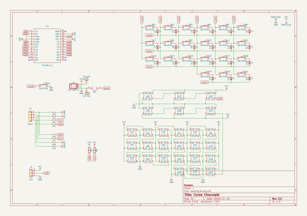
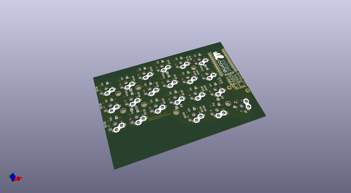
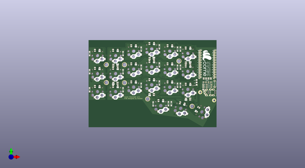
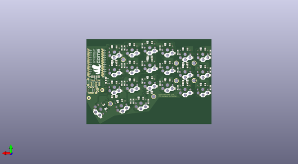

# crkbd
 
## summary 
* id: 50an6xy06r6n_crkbd_corne_chocolate
* user: 50an6xy06r6n
* name: crkbd
* board: corne_chocolate
* repo: https://github.com/50an6xy06r6n/crkbd
* src_file_repo_kicad_pcb: corne-chocolate/pcb/corne-chocolate.kicad_pcb
* src_file_repo_kicad_pcb_link: https://github.com/50an6xy06r6n/crkbd/tree/master/corne-chocolate/pcb/corne-chocolate.kicad_pcb

* src_file_repo_sch: corne-chocolate/pcb/corne-chocolate.sch
* src_file_repo_sch_link: https://github.com/50an6xy06r6n/crkbd/tree/master/corne-chocolate/pcb/corne-chocolate.sch

## schematic  
  
[schematic (pdf)](working_schematic.pdf)  

## pcb  
 
  
  
  
[board (pdf)](working.pdf)  

## working_bom
| Id | Designator | Footprint | Quantity | Designation | Supplier and ref |  | None | 
| --- | --- | --- | --- | --- | --- | --- | --- | 
| 1 | D1,D2,D3,D4,D5,D6,D7,D8,D9,D10,D11,D12,D13,D14,D15,D16,D17,D18,D19,D20,D21 | D3_SMD | 21 | D |  |  | [''] | 
| 2 | L1,L2,L3,L4,L5,L6,L7,L8,L9,L10,L11,L12,L13,L14,L15,L16,L17,L18,L19,L20,L21 | SK6812MINI_rev | 21 | SK6812MINI |  |  | [''] | 
| 3 | SW1,SW2,SW3,SW4,SW5,SW6,SW7,SW8,SW9,SW10,SW11,SW12,SW13,SW14,SW15,SW16,SW17,SW18,SW19,SW20 | Choc_Hotswap | 20 | SW_PUSH |  |  | [''] | 
| 4 | JP2,JP3,JP4,JP5,JP6,JP7,JP8,JP9 | Jumper | 8 |   |  |  | [''] | 
| 5 | U1 | ProMicro_v2 | 1 | ProMicro |  |  | [''] | 
| 6 | J3 | StripLED_rev | 1 | LED |  |  | [''] | 
| 7 | data | JPC2 | 1 |   |  |  | [''] | 
| 8 | OLED | OLED | 1 | OLED |  |  | [''] | 
| 9 | TRRS | MJ-4PP-9 | 1 | MJ-4PP-9 |  |  | [''] | 
| 10 | RSW1 | ResetSW | 1 | Reset |  |  | [''] | 
| 11 | L23,L24,L26,L27,L22,L25 | SK6812MINI_underglow_rev | 6 | SK6812MINI |  |  | [''] | 
| 12 | G***,G*** | corne | 2 | LOGO |  |  | [''] | 
| 13 | SW21 | Choc_Hotswap_1.5u | 1 | SW_PUSH |  |  | [''] | 
| 14 | R2,R1 | R | 2 | R |  |  | [''] | 
| 15 | P1,P2 | 1pin_conn | 2 | i2c-pin |  |  | [''] | 

## bom_schematic
| Ref | Qnty | Value | Cmp name | Footprint | Description | Vendor | DNP | 
| --- | --- | --- | --- | --- | --- | --- | --- | 
| D1, D2, D3, D4, D5, D6, D7, D8, D9, D10, D11, D12, D13, D14, D15, D16, D17, D18, D19, D20, D21 | 21 | D | D | kbd:D3_TH_SMD | Diode |  |  | 
| J1 | 1 | MJ-4PP-9 | MJ-4PP-9-kbd | kbd:MJ-4PP-9 |  |  |  | 
| J2 | 1 | OLED | Conn_01x04 | kbd:OLED | Generic connector, single row, 01x04, script generated (kicad-library-utils/schlib/autogen/connector/) |  |  | 
| J3 | 1 | LED | Conn_01x03 | kbd:StripLED_rev | Generic connector, single row, 01x03, script generated (kicad-library-utils/schlib/autogen/connector/) |  |  | 
| JP1 | 1 |  | Jumper-Device | kbd:JPC2 |  |  |  | 
| JP2, JP3, JP4, JP5, JP6, JP7, JP8, JP9 | 8 |  | Jumper_NO_Small-Device | kbd:Jumper |  |  |  | 
| L1, L2, L3, L4, L5, L6, L7, L8, L9, L10, L11, L12, L13, L14, L15, L16, L17, L18, L19, L20, L21 | 21 | SK6812MINI | SK6812MINI-kbd | kbd:SK6812MINI_rev |  |  |  | 
| L22, L23, L24, L25, L26, L27 | 6 | SK6812MINI | SK6812MINI-kbd | kbd:SK6812MINI_underglow |  |  |  | 
| P1, P2 | 2 | i2c-pin | Conn_01x01 | kbd:1pin_conn | Generic connector, single row, 01x01, script generated (kicad-library-utils/schlib/autogen/connector/) |  |  | 
| R1, R2 | 2 | R | R | kbd:R | Resistor |  |  | 
| RSW1 | 1 | SW_PUSH | SW_PUSH-kbd | kbd:ResetSW |  |  |  | 
| SW1, SW2, SW3, SW4, SW5, SW6, SW7, SW8, SW9, SW10, SW11, SW12, SW13, SW14, SW15, SW16, SW17, SW18, SW19, SW20 | 20 | SW_PUSH | SW_PUSH-kbd | kbd:MX_ALPS_PG1350_noLed |  |  |  | 
| SW21 | 1 | SW_PUSH | SW_PUSH-kbd | kbd:MX_ALPS_PG1350_noLed_1.75u |  |  |  | 
| U1 | 1 | ProMicro | ProMicro-kbd | kbd:ProMicro_v2 |  |  |  | 

## positions
### top
| # Ref | Val | Package | PosX | PosY | Rot | Side | 
| --- | --- | --- | --- | --- | --- | --- | 
| D1 | D | D3_SMD | -132.75 | -7.125 | -90.0 | top | 
| D2 | D | D3_SMD | -97.75 | -7.125 | -90.0 | top | 
| D3 | D | D3_SMD | -78.75 | -2.375 | -90.0 | top | 
| D4 | D | D3_SMD | -59.75 | 0.0 | -90.0 | top | 
| D5 | D | D3_SMD | -40.75 | -2.375 | -90.0 | top | 
| D6 | D | D3_SMD | -37.75 | -2.375 | -90.0 | top | 
| D7 | D | D3_SMD | -132.75 | -26.125 | -90.0 | top | 
| D8 | D | D3_SMD | -97.75 | -26.125 | -90.0 | top | 
| D9 | D | D3_SMD | -78.75 | -21.375 | -90.0 | top | 
| D10 | D | D3_SMD | -59.75 | -19.0 | -90.0 | top | 
| D11 | D | D3_SMD | -40.75 | -21.375 | -90.0 | top | 
| D12 | D | D3_SMD | -37.75 | -21.375 | -90.0 | top | 
| D13 | D | D3_SMD | -132.75 | -45.125 | -90.0 | top | 
| D14 | D | D3_SMD | -97.75 | -45.125 | -90.0 | top | 
| D15 | D | D3_SMD | -78.75 | -40.375 | -90.0 | top | 
| D16 | D | D3_SMD | -59.75 | -38.0 | -90.0 | top | 
| D17 | D | D3_SMD | -40.75 | -40.375 | -90.0 | top | 
| D18 | D | D3_SMD | -37.75 | -40.375 | -90.0 | top | 
| D19 | D | D3_SMD | -66.25 | -60.0 | -90.0 | top | 
| D20 | D | D3_SMD | -50.25 | -59.75 | -90.0 | top | 
| D21 | D | D3_SMD | -47.25 | -59.75 | -90.0 | top | 
| G*** | LOGO | corne | -10.05 | -17.225 | -90.0 | top | 
| J3 | LED | StripLED_rev | -20.75 | -39.9 | 180.0 | top | 
| JP2 | _ | Jumper | -5.875 | -33.25 | -90.0 | top | 
| JP3 | _ | Jumper | -8.375 | -33.25 | -90.0 | top | 
| JP4 | _ | Jumper | -10.875 | -33.25 | -90.0 | top | 
| JP5 | _ | Jumper | -13.375 | -33.25 | -90.0 | top | 
| L1 | SK6812MINI | SK6812MINI_rev | -124.75 | -3.625 | 0.0 | top | 
| L2 | SK6812MINI | SK6812MINI_rev | -105.75 | -3.625 | 0.0 | top | 
| L3 | SK6812MINI | SK6812MINI_rev | -86.75 | 1.125 | 0.0 | top | 
| L4 | SK6812MINI | SK6812MINI_rev | -67.75 | 3.5 | 0.0 | top | 
| L5 | SK6812MINI | SK6812MINI_rev | -48.75 | 1.125 | 0.0 | top | 
| L6 | SK6812MINI | SK6812MINI_rev | -29.75 | -1.25 | 0.0 | top | 
| L7 | SK6812MINI | SK6812MINI_rev | -124.75 | -22.625 | 0.0 | top | 
| L8 | SK6812MINI | SK6812MINI_rev | -105.75 | -22.625 | 0.0 | top | 
| L9 | SK6812MINI | SK6812MINI_rev | -86.75 | -17.875 | 0.0 | top | 
| L10 | SK6812MINI | SK6812MINI_rev | -67.75 | -15.5 | 0.0 | top | 
| L11 | SK6812MINI | SK6812MINI_rev | -48.75 | -17.875 | 0.0 | top | 
| L12 | SK6812MINI | SK6812MINI_rev | -29.75 | -20.25 | 0.0 | top | 
| L13 | SK6812MINI | SK6812MINI_rev | -124.75 | -41.625 | 0.0 | top | 
| L14 | SK6812MINI | SK6812MINI_rev | -105.75 | -41.625 | 0.0 | top | 
| L15 | SK6812MINI | SK6812MINI_rev | -86.75 | -36.875 | 0.0 | top | 
| L16 | SK6812MINI | SK6812MINI_rev | -67.75 | -34.5 | 0.0 | top | 
| L17 | SK6812MINI | SK6812MINI_rev | -48.75 | -36.875 | 0.0 | top | 
| L18 | SK6812MINI | SK6812MINI_rev | -29.75 | -39.25 | 0.0 | top | 
| L19 | SK6812MINI | SK6812MINI_rev | -58.25 | -56.5 | 0.0 | top | 
| L20 | SK6812MINI | SK6812MINI_rev | -35.75 | -59.5 | -15.0 | top | 
| L21 | SK6812MINI | SK6812MINI_rev | -19.75 | -65.75 | -120.0 | top | 
| L22 | SK6812MINI | SK6812MINI_underglow_rev | -105.75 | -19.25 | 0.0 | top | 
| L23 | SK6812MINI | SK6812MINI_underglow_rev | -67.73 | -12.16 | 0.0 | top | 
| L24 | SK6812MINI | SK6812MINI_underglow_rev | -29.78 | -16.88 | 0.0 | top | 
| L25 | SK6812MINI | SK6812MINI_underglow_rev | -105.75 | -38.24 | 180.0 | top | 
| L26 | SK6812MINI | SK6812MINI_underglow_rev | -67.76 | -50.17 | 180.0 | top | 
| L27 | SK6812MINI | SK6812MINI_underglow_rev | -29.74 | -54.92 | 180.0 | top | 
| OLED | OLED | OLED | -13.45 | -37.3 | 0.0 | top | 
| P1 | i2c-pin | 1pin_conn | -13.75 | -40.0 | 0.0 | top | 
| P2 | i2c-pin | 1pin_conn | -13.75 | -42.3 | 0.0 | top | 
| R1 | R | R | -7.75 | -40.0 | 180.0 | top | 
| R2 | R | R | -7.75 | -42.3 | 180.0 | top | 
| RSW1 | Reset | ResetSW | -1.85 | -39.0 | 90.0 | top | 
| SW1 | SW_PUSH | Choc_Hotswap | -124.75 | -9.125 | 180.0 | top | 
| SW2 | SW_PUSH | Choc_Hotswap | -105.75 | -9.125 | 180.0 | top | 
| SW3 | SW_PUSH | Choc_Hotswap | -86.75 | -4.375 | 180.0 | top | 
| SW4 | SW_PUSH | Choc_Hotswap | -67.75 | -2.0 | 180.0 | top | 
| SW5 | SW_PUSH | Choc_Hotswap | -48.75 | -4.375 | 180.0 | top | 
| SW6 | SW_PUSH | Choc_Hotswap | -29.75 | -6.75 | 180.0 | top | 
| SW7 | SW_PUSH | Choc_Hotswap | -124.75 | -28.125 | 180.0 | top | 
| SW8 | SW_PUSH | Choc_Hotswap | -105.75 | -28.125 | 180.0 | top | 
| SW9 | SW_PUSH | Choc_Hotswap | -86.75 | -23.375 | 180.0 | top | 
| SW10 | SW_PUSH | Choc_Hotswap | -67.75 | -21.0 | 180.0 | top | 
| SW11 | SW_PUSH | Choc_Hotswap | -48.75 | -23.375 | 180.0 | top | 
| SW12 | SW_PUSH | Choc_Hotswap | -29.75 | -25.75 | 180.0 | top | 
| SW13 | SW_PUSH | Choc_Hotswap | -124.75 | -47.125 | 180.0 | top | 
| SW14 | SW_PUSH | Choc_Hotswap | -105.75 | -47.125 | 180.0 | top | 
| SW15 | SW_PUSH | Choc_Hotswap | -86.75 | -42.375 | 180.0 | top | 
| SW16 | SW_PUSH | Choc_Hotswap | -67.75 | -40.0 | 180.0 | top | 
| SW17 | SW_PUSH | Choc_Hotswap | -48.75 | -42.375 | 180.0 | top | 
| SW18 | SW_PUSH | Choc_Hotswap | -29.75 | -44.75 | 180.0 | top | 
| SW19 | SW_PUSH | Choc_Hotswap | -58.25 | -62.0 | 180.0 | top | 
| SW20 | SW_PUSH | Choc_Hotswap | -37.25 | -64.75 | 165.0 | top | 
| SW21 | SW_PUSH | Choc_Hotswap_1.5u | -15.0 | -68.5 | -120.0 | top | 
| TRRS | MJ-4PP-9 | MJ-4PP-9 | -0.05 | -48.7 | -90.0 | top | 
| U1 | ProMicro | ProMicro_v2 | -9.0 | -18.25 | 0.0 | top | 
| data | _ | JPC2 | -13.65 | -44.8 | 0.0 | top | 

### bottom
| # Ref | Val | Package | PosX | PosY | Rot | Side | 
| --- | --- | --- | --- | --- | --- | --- | 
| G*** | LOGO | corne | -10.725 | -17.05 | 90.0 | bottom | 
| JP6 | _ | Jumper | -5.875 | -33.25 | -90.0 | bottom | 
| JP7 | _ | Jumper | -8.375 | -33.25 | -90.0 | bottom | 
| JP8 | _ | Jumper | -10.875 | -33.25 | -90.0 | bottom | 
| JP9 | _ | Jumper | -13.375 | -33.25 | -90.0 | bottom | 

