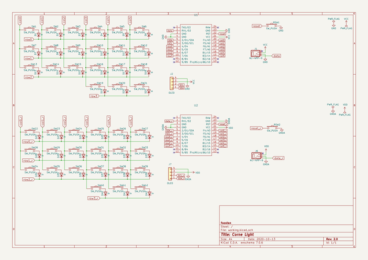
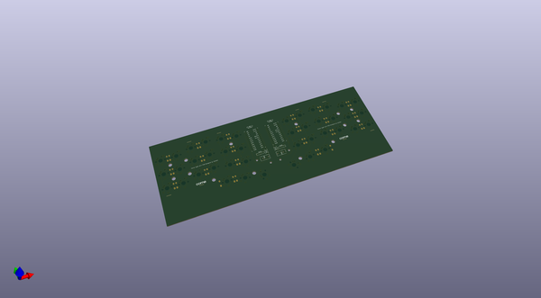
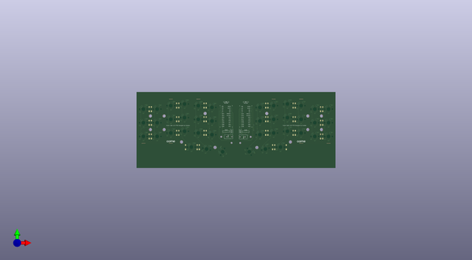
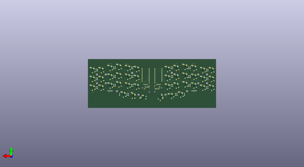

# crkbd
 
## summary 
* id: 50an6xy06r6n_crkbd_corne_light
* user: 50an6xy06r6n
* name: crkbd
* board: corne_light
* repo: https://github.com/50an6xy06r6n/crkbd
* src_file_repo_kicad_pcb: corne-light/pcb/corne-light.kicad_pcb
* src_file_repo_kicad_pcb_link: https://github.com/50an6xy06r6n/crkbd/tree/master/corne-light/pcb/corne-light.kicad_pcb

* src_file_repo_sch: corne-light/pcb/corne-light.sch
* src_file_repo_sch_link: https://github.com/50an6xy06r6n/crkbd/tree/master/corne-light/pcb/corne-light.sch

## schematic  
  
[schematic (pdf)](working_schematic.pdf)  

## pcb  
 
  
  
  
[board (pdf)](working.pdf)  

## working_bom
| Id | Designator | Footprint | Quantity | Designation | Supplier and ref |  | None | 
| --- | --- | --- | --- | --- | --- | --- | --- | 
| 1 | J1,J6 | MJ-4PP-9_1side | 2 | MJ-4PP-9 |  |  | [''] | 
| 2 | RSW2,RSW1 | ResetSW_1side | 2 | SW_PUSH |  |  | [''] | 
| 3 | SW22,SW23,SW24,SW25,SW26,SW27,SW28,SW29,SW30,SW31,SW32,SW33,SW34,SW35,SW36,SW37,SW38,SW40,SW41,SW39,SW6,SW5,SW4,SW3,SW2,SW18,SW13,SW20,SW19,SW17,SW16,SW15,SW14,SW12,SW11,SW10,SW9,SW8,SW7,SW1 | keyswitch_cherrymx_alps_choc12_1u | 40 | SW_PUSH |  |  | [''] | 
| 4 | U1,U2 | ProMicro_v3 | 2 | ProMicro |  |  | [''] | 
| 5 | SW21,SW42 | keyswitch_cherrymx_alps_choc12_1.5u | 2 | SW_PUSH |  |  | [''] | 
| 6 | J2,J7 | OLED_1side | 2 | OLED |  |  | [''] | 
| 7 | J5,J5,J5,J5,J5,J5,J5,J5 | Breakaway_Tabs | 8 | Breakaway_Tabs |  |  | [''] | 
| 8 | G***,G***,G***,G*** | corne-logo-horizontal | 4 | LOGO |  |  | [''] | 
| 9 | D34,D36,D37,D38,D39,D40,D41,D42,D22,D23,D24,D25,D26,D27,D28,D29,D30,D31,D32,D14,D8,D2,D33,D21,D20,D19,D18,D17,D16,D15,D13,D12,D11,D10,D9,D7,D6,D5,D4,D3,D1,D35 | D3_TH_SMD_v2 | 42 | D |  |  | [''] | 

## bom_schematic
| Ref | Qnty | Value | Cmp name | Footprint | Description | Vendor | DNP | 
| --- | --- | --- | --- | --- | --- | --- | --- | 
| D1, D2, D3, D4, D5, D6, D7, D8, D9, D10, D11, D12, D13, D14, D15, D16, D17, D18, D19, D20, D21, D22, D23, D24, D25, D26, D27, D28, D29, D30, D31, D32, D33, D34, D35, D36, D37, D38, D39, D40, D41, D42 | 42 | D | D | kbd:D3_TH | Diode |  |  | 
| J1, J6 | 2 | MJ-4PP-9 | MJ-4PP-9-kbd | kbd:MJ-4PP-9_1side |  |  |  | 
| J2, J7 | 2 | OLED | Conn_01x04 | kbd:OLED_1side | Generic connector, single row, 01x04, script generated (kicad-library-utils/schlib/autogen/connector/) |  |  | 
| RSW1, RSW2 | 2 | SW_PUSH | SW_PUSH-kbd | kbd:ResetSW_1side |  |  |  | 
| SW1, SW2, SW3, SW4, SW5, SW6, SW7, SW8, SW9, SW10, SW11, SW12, SW13, SW14, SW15, SW16, SW17, SW18, SW19, SW20, SW22, SW23, SW24, SW25, SW26, SW27, SW28, SW29, SW30, SW31, SW32, SW33, SW34, SW35, SW36, SW37, SW38, SW39, SW40, SW41 | 40 | SW_PUSH | SW_PUSH-kbd | kbd:CherryMX_ChocV2_1u |  |  |  | 
| SW21, SW42 | 2 | SW_PUSH | SW_PUSH-kbd | kbd:CherryMX_ChocV2_1.5u |  |  |  | 
| U1, U2 | 2 | ProMicro | ProMicro-kbd | kbd:ProMicro_v3 |  |  |  | 

## positions
### top
| # Ref | Val | Package | PosX | PosY | Rot | Side | 
| --- | --- | --- | --- | --- | --- | --- | 
| G*** | LOGO | corne-logo-horizontal | 166.158 | 0.6755 | 0.0 | top | 
| G*** | LOGO | corne-logo-horizontal | -14.622 | 0.7555 | 0.0 | top | 
| J1 | MJ-4PP-9 | MJ-4PP-9_1side | 71.375 | 7.2535 | -90.0 | top | 
| J2 | OLED | OLED_1side | 58.189 | 14.5175 | 0.0 | top | 
| J5 | Breakaway_Tabs | Breakaway_Tabs | 165.988 | -1.7045 | 0.0 | top | 
| J5 | Breakaway_Tabs | Breakaway_Tabs | 203.988 | -1.7045 | 0.0 | top | 
| J5 | Breakaway_Tabs | Breakaway_Tabs | 165.958 | 59.7155 | 0.0 | top | 
| J5 | Breakaway_Tabs | Breakaway_Tabs | 127.938 | 59.7055 | 0.0 | top | 
| J5 | Breakaway_Tabs | Breakaway_Tabs | 23.418 | 59.7155 | 0.0 | top | 
| J5 | Breakaway_Tabs | Breakaway_Tabs | -14.552 | 59.7155 | 0.0 | top | 
| J5 | Breakaway_Tabs | Breakaway_Tabs | -14.655 | -1.6945 | 0.0 | top | 
| J5 | Breakaway_Tabs | Breakaway_Tabs | -52.6432 | -1.6945 | 0.0 | top | 
| J6 | MJ-4PP-9 | MJ-4PP-9_1side | 79.7683 | 7.1201 | 90.0 | top | 
| J7 | OLED | OLED_1side | 85.418 | 14.3755 | 0.0 | top | 
| RSW1 | SW_PUSH | ResetSW_1side | 69.665 | 15.0145 | -90.0 | top | 
| RSW2 | SW_PUSH | ResetSW_1side | 81.5353 | 14.8681 | -90.0 | top | 
| SW1 | SW_PUSH | keyswitch_cherrymx_alps_choc12_1u | -52.652 | 45.7655 | 0.0 | top | 
| SW2 | SW_PUSH | keyswitch_cherrymx_alps_choc12_1u | -33.652 | 45.7655 | 0.0 | top | 
| SW3 | SW_PUSH | keyswitch_cherrymx_alps_choc12_1u | -14.652 | 50.5155 | 0.0 | top | 
| SW4 | SW_PUSH | keyswitch_cherrymx_alps_choc12_1u | 4.348 | 52.8905 | 0.0 | top | 
| SW5 | SW_PUSH | keyswitch_cherrymx_alps_choc12_1u | 23.348 | 50.5155 | 0.0 | top | 
| SW6 | SW_PUSH | keyswitch_cherrymx_alps_choc12_1u | 42.348 | 48.1405 | 0.0 | top | 
| SW7 | SW_PUSH | keyswitch_cherrymx_alps_choc12_1u | -52.652 | 26.7655 | 0.0 | top | 
| SW8 | SW_PUSH | keyswitch_cherrymx_alps_choc12_1u | -33.652 | 26.7655 | 0.0 | top | 
| SW9 | SW_PUSH | keyswitch_cherrymx_alps_choc12_1u | -14.652 | 31.5155 | 0.0 | top | 
| SW10 | SW_PUSH | keyswitch_cherrymx_alps_choc12_1u | 4.348 | 33.8905 | 0.0 | top | 
| SW11 | SW_PUSH | keyswitch_cherrymx_alps_choc12_1u | 23.348 | 31.5155 | 0.0 | top | 
| SW12 | SW_PUSH | keyswitch_cherrymx_alps_choc12_1u | 42.348 | 29.1405 | 0.0 | top | 
| SW13 | SW_PUSH | keyswitch_cherrymx_alps_choc12_1u | -52.652 | 7.7655 | 0.0 | top | 
| SW14 | SW_PUSH | keyswitch_cherrymx_alps_choc12_1u | -33.652 | 7.7655 | 0.0 | top | 
| SW15 | SW_PUSH | keyswitch_cherrymx_alps_choc12_1u | -14.652 | 12.5155 | 0.0 | top | 
| SW16 | SW_PUSH | keyswitch_cherrymx_alps_choc12_1u | 4.348 | 14.8905 | 0.0 | top | 
| SW17 | SW_PUSH | keyswitch_cherrymx_alps_choc12_1u | 23.348 | 12.5155 | 0.0 | top | 
| SW18 | SW_PUSH | keyswitch_cherrymx_alps_choc12_1u | 42.348 | 10.1405 | 0.0 | top | 
| SW19 | SW_PUSH | keyswitch_cherrymx_alps_choc12_1u | 13.848 | -7.1095 | 0.0 | top | 
| SW20 | SW_PUSH | keyswitch_cherrymx_alps_choc12_1u | 34.848 | -9.8595 | -15.0 | top | 
| SW21 | SW_PUSH | keyswitch_cherrymx_alps_choc12_1.5u | 57.098 | -13.6095 | 60.0 | top | 
| SW22 | SW_PUSH | keyswitch_cherrymx_alps_choc12_1u | 203.8453 | 45.7651 | 0.0 | top | 
| SW23 | SW_PUSH | keyswitch_cherrymx_alps_choc12_1u | 184.8453 | 45.7651 | 0.0 | top | 
| SW24 | SW_PUSH | keyswitch_cherrymx_alps_choc12_1u | 165.8453 | 50.5151 | 0.0 | top | 
| SW25 | SW_PUSH | keyswitch_cherrymx_alps_choc12_1u | 146.8453 | 52.8901 | 0.0 | top | 
| SW26 | SW_PUSH | keyswitch_cherrymx_alps_choc12_1u | 127.8453 | 50.5151 | 0.0 | top | 
| SW27 | SW_PUSH | keyswitch_cherrymx_alps_choc12_1u | 108.8453 | 48.1401 | 0.0 | top | 
| SW28 | SW_PUSH | keyswitch_cherrymx_alps_choc12_1u | 203.8453 | 26.7651 | 0.0 | top | 
| SW29 | SW_PUSH | keyswitch_cherrymx_alps_choc12_1u | 184.8453 | 26.7651 | 0.0 | top | 
| SW30 | SW_PUSH | keyswitch_cherrymx_alps_choc12_1u | 165.8453 | 31.5151 | 0.0 | top | 
| SW31 | SW_PUSH | keyswitch_cherrymx_alps_choc12_1u | 146.8453 | 33.8901 | 0.0 | top | 
| SW32 | SW_PUSH | keyswitch_cherrymx_alps_choc12_1u | 127.8453 | 31.5151 | 0.0 | top | 
| SW33 | SW_PUSH | keyswitch_cherrymx_alps_choc12_1u | 108.8453 | 29.1401 | 0.0 | top | 
| SW34 | SW_PUSH | keyswitch_cherrymx_alps_choc12_1u | 203.8453 | 7.7651 | 0.0 | top | 
| SW35 | SW_PUSH | keyswitch_cherrymx_alps_choc12_1u | 184.8453 | 7.7651 | 0.0 | top | 
| SW36 | SW_PUSH | keyswitch_cherrymx_alps_choc12_1u | 165.8453 | 12.5151 | 0.0 | top | 
| SW37 | SW_PUSH | keyswitch_cherrymx_alps_choc12_1u | 146.8453 | 14.8901 | 0.0 | top | 
| SW38 | SW_PUSH | keyswitch_cherrymx_alps_choc12_1u | 127.8453 | 12.5151 | 0.0 | top | 
| SW39 | SW_PUSH | keyswitch_cherrymx_alps_choc12_1u | 108.8453 | 10.1401 | 0.0 | top | 
| SW40 | SW_PUSH | keyswitch_cherrymx_alps_choc12_1u | 137.3453 | -7.1099 | 0.0 | top | 
| SW41 | SW_PUSH | keyswitch_cherrymx_alps_choc12_1u | 116.3453 | -9.8599 | 15.0 | top | 
| SW42 | SW_PUSH | keyswitch_cherrymx_alps_choc12_1.5u | 94.0953 | -13.6099 | -60.0 | top | 
| U1 | ProMicro | ProMicro_v3 | 62.053 | 35.1255 | 0.0 | top | 
| U2 | ProMicro | ProMicro_v3 | 89.2233 | 34.9991 | 0.0 | top | 

### bottom
| # Ref | Val | Package | PosX | PosY | Rot | Side | 
| --- | --- | --- | --- | --- | --- | --- | 
| D1 | D | D3_TH_SMD_v2 | -44.652 | 45.7686 | 90.0 | bottom | 
| D2 | D | D3_TH_SMD_v2 | -41.652 | 45.7655 | 90.0 | bottom | 
| D3 | D | D3_TH_SMD_v2 | -6.652 | 50.7655 | 90.0 | bottom | 
| D4 | D | D3_TH_SMD_v2 | -3.652 | 50.7705 | 90.0 | bottom | 
| D5 | D | D3_TH_SMD_v2 | 31.348 | 50.7655 | 90.0 | bottom | 
| D6 | D | D3_TH_SMD_v2 | 34.348 | 50.7655 | 90.0 | bottom | 
| D7 | D | D3_TH_SMD_v2 | -44.652 | 26.7686 | 90.0 | bottom | 
| D8 | D | D3_TH_SMD_v2 | -41.652 | 26.7655 | 90.0 | bottom | 
| D9 | D | D3_TH_SMD_v2 | -6.652 | 31.7655 | 90.0 | bottom | 
| D10 | D | D3_TH_SMD_v2 | -3.652 | 31.7705 | 90.0 | bottom | 
| D11 | D | D3_TH_SMD_v2 | 31.348 | 31.7655 | 90.0 | bottom | 
| D12 | D | D3_TH_SMD_v2 | 34.348 | 31.7655 | 90.0 | bottom | 
| D13 | D | D3_TH_SMD_v2 | -44.652 | 7.7686 | 90.0 | bottom | 
| D14 | D | D3_TH_SMD_v2 | -41.652 | 7.7655 | 90.0 | bottom | 
| D15 | D | D3_TH_SMD_v2 | -6.652 | 12.7655 | 90.0 | bottom | 
| D16 | D | D3_TH_SMD_v2 | -3.652 | 12.7705 | 90.0 | bottom | 
| D17 | D | D3_TH_SMD_v2 | 31.348 | 12.7655 | 90.0 | bottom | 
| D18 | D | D3_TH_SMD_v2 | 34.348 | 12.7655 | 90.0 | bottom | 
| D19 | D | D3_TH_SMD_v2 | 5.668 | -7.2245 | 90.0 | bottom | 
| D20 | D | D3_TH_SMD_v2 | 21.848 | -7.2195 | 90.0 | bottom | 
| D21 | D | D3_TH_SMD_v2 | 24.848 | -7.2195 | 90.0 | bottom | 
| D22 | D | D3_TH_SMD_v2 | 195.8453 | 45.7651 | 90.0 | bottom | 
| D23 | D | D3_TH_SMD_v2 | 192.8453 | 45.7651 | 90.0 | bottom | 
| D24 | D | D3_TH_SMD_v2 | 157.8453 | 50.7651 | 90.0 | bottom | 
| D25 | D | D3_TH_SMD_v2 | 154.8453 | 50.7701 | 90.0 | bottom | 
| D26 | D | D3_TH_SMD_v2 | 119.8453 | 50.7651 | 90.0 | bottom | 
| D27 | D | D3_TH_SMD_v2 | 116.8453 | 50.7651 | 90.0 | bottom | 
| D28 | D | D3_TH_SMD_v2 | 195.8453 | 26.7651 | 90.0 | bottom | 
| D29 | D | D3_TH_SMD_v2 | 192.8453 | 26.7651 | 90.0 | bottom | 
| D30 | D | D3_TH_SMD_v2 | 157.8453 | 31.7651 | 90.0 | bottom | 
| D31 | D | D3_TH_SMD_v2 | 154.8453 | 31.7701 | 90.0 | bottom | 
| D32 | D | D3_TH_SMD_v2 | 119.8453 | 31.7651 | 90.0 | bottom | 
| D33 | D | D3_TH_SMD_v2 | 116.8453 | 31.7651 | 90.0 | bottom | 
| D34 | D | D3_TH_SMD_v2 | 195.8453 | 7.7651 | 90.0 | bottom | 
| D35 | D | D3_TH_SMD_v2 | 192.8453 | 7.7651 | 90.0 | bottom | 
| D36 | D | D3_TH_SMD_v2 | 157.8453 | 12.7651 | 90.0 | bottom | 
| D37 | D | D3_TH_SMD_v2 | 154.8453 | 12.7701 | 90.0 | bottom | 
| D38 | D | D3_TH_SMD_v2 | 119.8453 | 12.7651 | 90.0 | bottom | 
| D39 | D | D3_TH_SMD_v2 | 116.8453 | 12.7651 | 90.0 | bottom | 
| D40 | D | D3_TH_SMD_v2 | 145.3453 | -7.2449 | 90.0 | bottom | 
| D41 | D | D3_TH_SMD_v2 | 129.3553 | -7.2299 | 90.0 | bottom | 
| D42 | D | D3_TH_SMD_v2 | 126.3553 | -7.2299 | 90.0 | bottom | 
| G*** | LOGO | corne-logo-horizontal | -14.852 | 0.7555 | 180.0 | bottom | 
| G*** | LOGO | corne-logo-horizontal | 165.928 | 0.6755 | 180.0 | bottom | 

