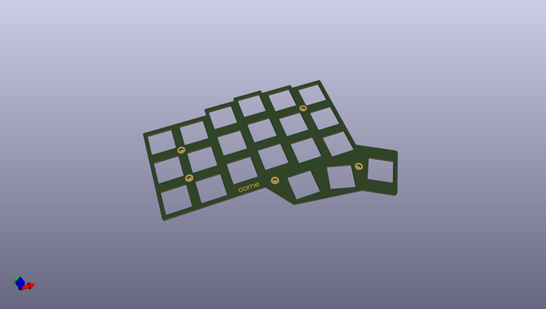
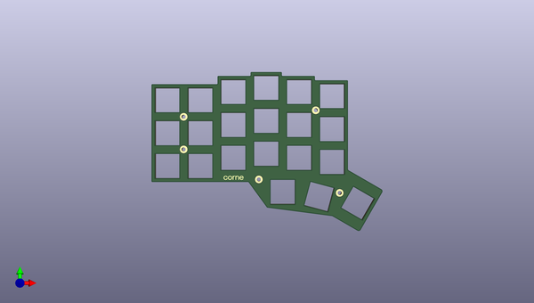
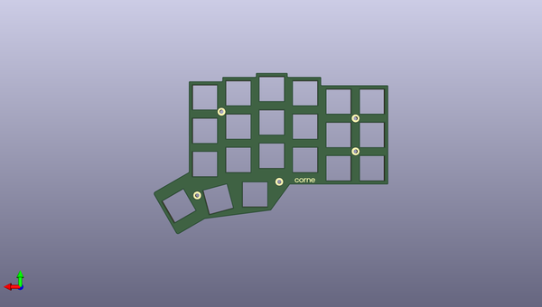

# crkbd
 
## summary 
* id: 50an6xy06r6n_crkbd_corne_top_plate
* user: 50an6xy06r6n
* name: crkbd
* board: corne_top_plate
* repo: https://github.com/50an6xy06r6n/crkbd
* src_file_repo_kicad_pcb: plates/pcb/top/corne-top-plate.kicad_pcb
* src_file_repo_kicad_pcb_link: https://github.com/50an6xy06r6n/crkbd/tree/master/plates/pcb/top/corne-top-plate.kicad_pcb

* src_file_repo_sch: plates/pcb/top/corne-top-plate.sch
* src_file_repo_sch_link: https://github.com/50an6xy06r6n/crkbd/tree/master/plates/pcb/top/corne-top-plate.sch

## schematic  
  
[schematic (pdf)](working_schematic.pdf)  

## pcb  
 
  
  
  
[board (pdf)](working.pdf)  

## working_bom
| Id | Designator | Footprint | Quantity | Designation | Supplier and ref |  | None | 
| --- | --- | --- | --- | --- | --- | --- | --- | 
| 1 | ,,,, | M2_Hole_TH | 5 |  |  |  | [''] | 
| 2 | SW2,SW2,SW2,SW2,SW2,SW2,SW2,SW2,SW2,SW2,SW2,SW2,SW2,SW2,SW2,SW2,SW2,SW2,SW2,SW2,SW2 | SW_Hole | 21 | KEY_SWITCH |  |  | [''] | 
| 3 | G***,G*** | corne-logo-horizontal-mask | 2 | LOGO |  |  | [''] | 

## bom_schematic
no data

## positions
### top
| # Ref | Val | Package | PosX | PosY | Rot | Side | 
| --- | --- | --- | --- | --- | --- | --- | 
| nan | nan | M2_Hole_TH | -94.5 | -21.05 | 0.0 | top | 
| nan | nan | M2_Hole_TH | -94.5 | -39.8 | 0.0 | top | 
| nan | nan | M2_Hole_TH | -18.5 | -17.3 | 0.0 | top | 
| nan | nan | M2_Hole_TH | -51.25 | -57.05 | 0.0 | top | 
| nan | nan | M2_Hole_TH | -4.75 | -64.8 | 0.0 | top | 
| G*** | LOGO | corne-logo-horizontal-mask | -65.665 | -56.225 | 0.0 | top | 
| SW2 | KEY_SWITCH | SW_Hole | -103.99 | -11.425 | 0.0 | top | 
| SW2 | KEY_SWITCH | SW_Hole | -103.99 | -30.425 | 0.0 | top | 
| SW2 | KEY_SWITCH | SW_Hole | -103.99 | -49.425 | 0.0 | top | 
| SW2 | KEY_SWITCH | SW_Hole | -84.99 | -11.425 | 0.0 | top | 
| SW2 | KEY_SWITCH | SW_Hole | -84.99 | -49.425 | 0.0 | top | 
| SW2 | KEY_SWITCH | SW_Hole | -84.99 | -30.425 | 0.0 | top | 
| SW2 | KEY_SWITCH | SW_Hole | -65.99 | -6.675 | 0.0 | top | 
| SW2 | KEY_SWITCH | SW_Hole | -65.99 | -44.675 | 0.0 | top | 
| SW2 | KEY_SWITCH | SW_Hole | -65.99 | -25.675 | 0.0 | top | 
| SW2 | KEY_SWITCH | SW_Hole | -46.99 | -4.3 | 0.0 | top | 
| SW2 | KEY_SWITCH | SW_Hole | -46.99 | -42.3 | 0.0 | top | 
| SW2 | KEY_SWITCH | SW_Hole | -46.99 | -23.3 | 0.0 | top | 
| SW2 | KEY_SWITCH | SW_Hole | -27.99 | -44.675 | 0.0 | top | 
| SW2 | KEY_SWITCH | SW_Hole | -27.99 | -6.675 | 0.0 | top | 
| SW2 | KEY_SWITCH | SW_Hole | -27.99 | -25.675 | 0.0 | top | 
| SW2 | KEY_SWITCH | SW_Hole | -8.99 | -28.05 | 0.0 | top | 
| SW2 | KEY_SWITCH | SW_Hole | -8.99 | -9.05 | 0.0 | top | 
| SW2 | KEY_SWITCH | SW_Hole | -8.99 | -47.05 | 0.0 | top | 
| SW2 | KEY_SWITCH | SW_Hole | -37.47 | -64.335 | 0.0 | top | 
| SW2 | KEY_SWITCH | SW_Hole | -16.508 | -67.044 | -15.0 | top | 
| SW2 | KEY_SWITCH | SW_Hole | 5.75 | -70.785 | -30.0 | top | 

### bottom
| # Ref | Val | Package | PosX | PosY | Rot | Side | 
| --- | --- | --- | --- | --- | --- | --- | 
| G*** | LOGO | corne-logo-horizontal-mask | -65.915 | -56.275 | 180.0 | bottom | 

