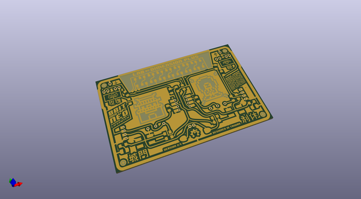
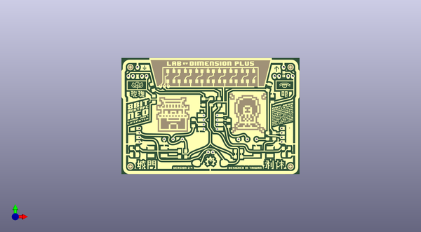
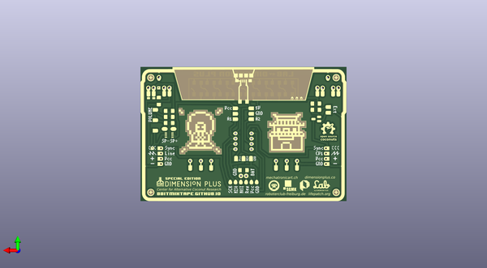

# 8bit_mixtape_neo
 
## summary 
* id: 8bitmixtape_8bit_mixtape_neo_8bitmixtapeneo_hk
* user: 8bitmixtape
* name: 8bit_mixtape_neo
* board: 8bitmixtapeneo_hk
* repo: https://github.com/8BitMixtape/8Bit-Mixtape-NEO
* src_file_repo_kicad_pcb: boards/8Bit-Mixtape-NEO_v1/ShenzhenReady/kicad_8bitMixtapeNEO_HK/8BitMixtapeNEO_HK.kicad_pcb
* src_file_repo_kicad_pcb_link: https://github.com/8BitMixtape/8Bit-Mixtape-NEO/tree/master/boards/8Bit-Mixtape-NEO_v1/ShenzhenReady/kicad_8bitMixtapeNEO_HK/8BitMixtapeNEO_HK.kicad_pcb

* src_file_repo_sch: boards/8Bit-Mixtape-NEO_v1/ShenzhenReady/kicad_8bitMixtapeNEO_HK/8BitMixtapeNEO_HK.sch
* src_file_repo_sch_link: https://github.com/8BitMixtape/8Bit-Mixtape-NEO/tree/master/boards/8Bit-Mixtape-NEO_v1/ShenzhenReady/kicad_8bitMixtapeNEO_HK/8BitMixtapeNEO_HK.sch

## schematic  
  
[schematic (pdf)](working_schematic.pdf)  

## pcb  
 
  
  
  
[board (pdf)](working.pdf)  

## working_bom
| Id | Designator | Footprint | Quantity | Designation | Supplier and ref |  | None | 
| --- | --- | --- | --- | --- | --- | --- | --- | 
| 1 | G*** | kicad_8BitMixtape_HK_fCu_inv | 1 | LOGO |  |  | [''] | 
| 2 | G*** | kicad_8BitMixtape_HK_fMask_inv | 1 | LOGO |  |  | [''] | 
| 3 | ,,,,,,,,,,,,,,, | Loch10 | 16 |  |  |  | [''] | 
| 4 | ,,,,,,,,, | Loch12 | 10 |  |  |  | [''] | 
| 5 | ,,,,,,, | Loch08 | 8 |  |  |  | [''] | 
| 6 | G*** | kicad_8BitMixtape_HK_bCu_inv | 1 | LOGO |  |  | [''] | 
| 7 | G*** | kicad_8BitMixtape_HK_bMask_inv | 1 | LOGO |  |  | [''] | 
| 8 | G*** | kicad_8BitMixtape_HK_bSilk_inv | 1 | LOGO |  |  | [''] | 

## bom_schematic
no data

## positions
### top
| # Ref | Val | Package | PosX | PosY | Rot | Side | 
| --- | --- | --- | --- | --- | --- | --- | 
| nan | nan | Loch12 | 53.99 | -39.85 | 0.0 | top | 
| nan | nan | Loch12 | 56.49 | -39.85 | 0.0 | top | 
| nan | nan | Loch10 | 107.59 | -75.16 | 0.0 | top | 
| nan | nan | Loch10 | 112.53 | -75.18 | 0.0 | top | 
| nan | nan | Loch10 | 117.68 | -75.15 | 0.0 | top | 
| nan | nan | Loch10 | 66.32 | -75.14 | 0.0 | top | 
| nan | nan | Loch10 | 71.25 | -75.15 | 0.0 | top | 
| nan | nan | Loch10 | 76.43 | -75.16 | 0.0 | top | 
| nan | nan | Loch10 | 93.3 | -82.39 | 0.0 | top | 
| nan | nan | Loch10 | 90.76 | -82.39 | 0.0 | top | 
| nan | nan | Loch10 | 95.85 | -61.86 | 0.0 | top | 
| nan | nan | Loch10 | 95.86 | -64.38 | 0.0 | top | 
| nan | nan | Loch10 | 95.84 | -66.93 | 0.0 | top | 
| nan | nan | Loch10 | 95.86 | -69.44 | 0.0 | top | 
| nan | nan | Loch10 | 88.28 | -61.87 | 0.0 | top | 
| nan | nan | Loch10 | 88.26 | -64.4 | 0.0 | top | 
| nan | nan | Loch10 | 88.28 | -66.92 | 0.0 | top | 
| nan | nan | Loch10 | 88.27 | -69.45 | 0.0 | top | 
| nan | nan | Loch12 | 48.93 | -39.85 | 0.0 | top | 
| nan | nan | Loch12 | 46.41 | -39.85 | 0.0 | top | 
| nan | nan | Loch12 | 51.45 | -34.78 | 0.0 | top | 
| nan | nan | Loch12 | 137.78 | -39.83 | 0.0 | top | 
| nan | nan | Loch12 | 135.26 | -39.86 | 0.0 | top | 
| nan | nan | Loch12 | 130.2 | -39.85 | 0.0 | top | 
| nan | nan | Loch12 | 127.68 | -39.85 | 0.0 | top | 
| nan | nan | Loch12 | 132.73 | -34.77 | 0.0 | top | 
| nan | nan | Loch08 | 131.68 | -69.06 | 0.0 | top | 
| nan | nan | Loch08 | 131.68 | -71.58 | 0.0 | top | 
| nan | nan | Loch08 | 131.69 | -74.11 | 0.0 | top | 
| nan | nan | Loch08 | 131.67 | -76.64 | 0.0 | top | 
| nan | nan | Loch08 | 52.46 | -69.07 | 0.0 | top | 
| nan | nan | Loch08 | 52.45 | -71.58 | 0.0 | top | 
| nan | nan | Loch08 | 52.45 | -74.12 | 0.0 | top | 
| nan | nan | Loch08 | 52.45 | -76.65 | 0.0 | top | 
| G*** | LOGO | kicad_8BitMixtape_HK_fMask_inv | 92.05 | -62.16 | 0.0 | top | 
| G*** | LOGO | kicad_8BitMixtape_HK_fCu_inv | 92.05 | -62.17 | 0.0 | top | 
| G*** | LOGO | kicad_8BitMixtape_HK_bCu_inv | 92.06 | -62.19 | 0.0 | top | 
| G*** | LOGO | kicad_8BitMixtape_HK_bMask_inv | 92.05 | -62.2 | 0.0 | top | 
| G*** | LOGO | kicad_8BitMixtape_HK_bSilk_inv | 91.94 | -62.06 | 0.0 | top | 

### bottom
no data
