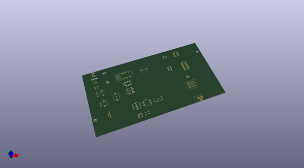
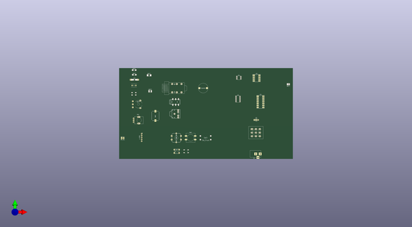

# diy_cad_mixtapefootprints
 
## summary 
* id: 8bitmixtape_diy_cad_mixtapefootprints_diy_cad_mixtape
* user: 8bitmixtape
* name: diy_cad_mixtapefootprints
* board: diy_cad_mixtape
* repo: https://github.com/8BitMixtape/DIY-CAD_MixtapeFootprints
* src_file_repo_kicad_pcb: Kicad_MixtapeBarebone/DIY-CAD_Mixtape.kicad_pcb
* src_file_repo_kicad_pcb_link: https://github.com/8BitMixtape/DIY-CAD_MixtapeFootprints/tree/master/Kicad_MixtapeBarebone/DIY-CAD_Mixtape.kicad_pcb

* src_file_repo_sch: KiCAD/DIY-CAD_Mixtape.sch
* src_file_repo_sch_link: https://github.com/8BitMixtape/DIY-CAD_MixtapeFootprints/tree/master/KiCAD/DIY-CAD_Mixtape.sch

## schematic  
  
[schematic (pdf)](working_schematic.pdf)  

## pcb  
 
  
  
  
[board (pdf)](working.pdf)  

## working_bom
| Id | Designator | Footprint | Quantity | Designation | Supplier and ref |  | None | 
| --- | --- | --- | --- | --- | --- | --- | --- | 
| 1 | J2 | AUDIO-JACK-3.5mm_SMD | 1 |  |  |  | [''] | 
| 2 | LS1 | BUZZER | 1 | Speaker |  |  | [''] | 
| 3 | J-USB1 | Socket_Strip_USB | 1 | CONN_01X05 |  |  | [''] | 
| 4 | SW2 | SW_PUSH-12mm_3D | 1 | SW_Push |  |  | [''] | 
| 5 | R3 | Resistor_SMD+THTuniversal | 1 | 22K |  |  | [''] | 
| 6 | RV1 | Mixtape_Pot_Alps_RK09K_Horizontal | 1 | POT 10K lin |  |  | [''] | 
| 7 |  | Mixtape_NEO_WS2812B | 1 | NEO |  |  | [''] | 
| 8 | C1 | Capacitor | 1 | 100nF |  |  | [''] | 
| 9 | BT1 | Bat_connector+- | 1 | Battery_Cell |  |  | [''] | 
| 10 | REF** | C_1206_mixtapeStyle | 1 | C_1206_HandSoldering |  |  | [''] | 
| 11 | SW3 | TACTILE-SMD-12MM | 1 | SW_Push |  |  | [''] | 
| 12 | >NAME | TACTILE-SWITCH-SMD | 1 | >VALUE |  |  | [''] | 
| 13 | U1 | SOIC-8_3.9x4.9mm_Pitch1.27mm | 1 | ATTINY85-20PU |  |  | [''] | 
| 14 | U2 | DIP-8_W7.62mm_Socket_LongPads | 1 | ATTINY85-20SU |  |  | [''] | 
| 15 | U3 | DIP-14_W7.62mm_Socket_LongPads | 1 | 4011 |  |  | [''] | 
| 16 | U3 | SOIC-14_3.9x8.7mm_Pitch1.27mm | 1 | 4011 |  |  | [''] | 
| 17 | J9 | 9V_BARREL_JACK | 1 | BARREL_JACK |  |  | [''] | 
| 18 | D2 | Stomp_LED-Ring_DUAL | 1 | LED_Dual_AAC |  |  | [''] | 
| 19 | REF** | LED_PLCC_2835 | 1 | LED_PLCC_2835 |  |  | [''] | 
| 20 | REF** | C_1210_HandSoldering | 1 | C_1210_HandSoldering |  |  | [''] | 
| 21 | REF** | R_1206_HandSoldering | 1 | R_1206_HandSoldering |  |  | [''] | 
| 22 | REF** | Potentiometer_wheel | 1 | Potentiometer_wheel |  |  | [''] | 
| 23 | REF** | LED_PLCC-2 | 1 | LED_PLCC-2 |  |  | [''] | 

## bom_schematic
| Ref | Qnty | Value | Cmp name | Footprint | Description | Vendor | DNP | 
| --- | --- | --- | --- | --- | --- | --- | --- | 
| U1 | 1 | ATTINY85-20PU | ATTINY85-20PU | Housings_DIP:DIP-8_W7.62mm |  |  |  | 
| U2 | 1 | ATTINY85-20SU | ATTINY85-20SU | Housings_SOIC:SOIC-8_3.9x4.9mm_Pitch1.27mm |  |  |  | 
| U3 | 1 | 4011 | 4011 | Housings_DIP:DIP-14_W7.62mm_Socket_LongPads |  |  |  | 

## positions
### top
| # Ref | Val | Package | PosX | PosY | Rot | Side | 
| --- | --- | --- | --- | --- | --- | --- | 
| nan | NEO | Mixtape_NEO_WS2812B | 46.98 | -54.51 | 0.0 | top | 
| >NAME | >VALUE | TACTILE-SWITCH-SMD | 117.52 | -132.41 | 0.0 | top | 
| BT1 | Battery_Cell | Bat_connector+- | 30.52 | -114.57 | 0.0 | top | 
| C1 | 100nF | Capacitor | 44.58 | -43.14 | 0.0 | top | 
| D2 | LED_Dual_AAC | Stomp_LED-Ring_DUAL | 209.65 | -89.91 | 0.0 | top | 
| J-USB1 | CONN_01X05 | Socket_Strip_USB | 57.4 | -108.59 | 0.0 | top | 
| J2 | nan | AUDIO-JACK-3.5mm_SMD | 96.97 | -65.55 | 0.0 | top | 
| J9 | BARREL_JACK | 9V_BARREL_JACK | 217.42 | -135.98 | 0.0 | top | 
| LS1 | Speaker | BUZZER | 140.49 | -46.75 | 0.0 | top | 
| R3 | 22K | Resistor_SMD+THTuniversal | 47.64 | -35.41 | 0.0 | top | 
| REF** | C_1206_HandSoldering | C_1206_mixtapeStyle | 47.49 | -28.69 | 0.0 | top | 
| REF** | LED_PLCC_2835 | LED_PLCC_2835 | 255.73 | -41.47 | 0.0 | top | 
| REF** | C_1210_HandSoldering | C_1210_HandSoldering | 67.49 | -29.39 | 0.0 | top | 
| REF** | R_1206_HandSoldering | R_1206_HandSoldering | 47.3 | -22.31 | 0.0 | top | 
| REF** | Potentiometer_wheel | Potentiometer_wheel | 53.07 | -68.71 | 0.0 | top | 
| REF** | LED_PLCC-2 | LED_PLCC-2 | 68.93 | -51.06 | 0.0 | top | 
| RV1 | POT_10K_lin | Mixtape_Pot_Alps_RK09K_Horizontal | 46.55 | -92.8 | 0.0 | top | 
| SW2 | SW_Push | SW_PUSH-12mm_3D | 123.59 | -114.13 | 0.0 | top | 
| SW3 | SW_Push | TACTILE-SMD-12MM | 143.69 | -114.12 | 0.0 | top | 
| U1 | ATTINY85-20PU | SOIC-8_3.9x4.9mm_Pitch1.27mm | 188.64 | -32.745 | 0.0 | top | 
| U2 | ATTINY85-20SU | DIP-8_W7.62mm_Socket_LongPads | 208.79 | -29.36 | 0.0 | top | 
| U3 | 4011 | DIP-14_W7.62mm_Socket_LongPads | 214.1 | -57.75 | 0.0 | top | 
| U3 | 4011 | SOIC-14_3.9x8.7mm_Pitch1.27mm | 187.51 | -61.59 | 0.0 | top | 

### bottom
no data
