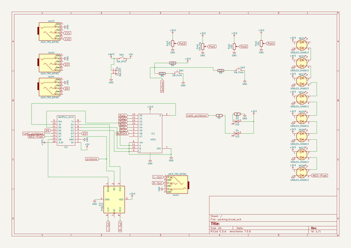
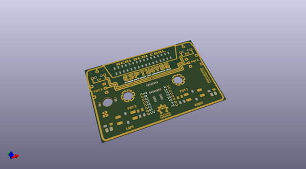
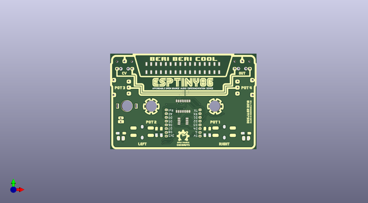
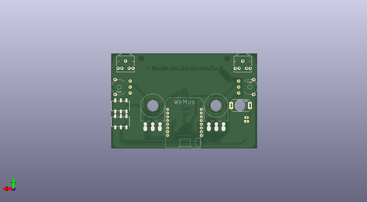

# esptiny86_mixtapepcb
 
## summary 
* id: 8bitmixtape_esptiny86_mixtapepcb_esptiny86_mixtape_version2
* user: 8bitmixtape
* name: esptiny86_mixtapepcb
* board: esptiny86_mixtape_version2
* repo: https://github.com/8BitMixtape/ESPTINY86_MixtapePCB
* src_file_repo_kicad_pcb: KiCAD/ESPTINY86_Mixtape_version2.kicad_pcb
* src_file_repo_kicad_pcb_link: https://github.com/8BitMixtape/ESPTINY86_MixtapePCB/tree/master/KiCAD/ESPTINY86_Mixtape_version2.kicad_pcb

* src_file_repo_sch: KiCAD/ESPTINY86_Mixtape_version2.sch
* src_file_repo_sch_link: https://github.com/8BitMixtape/ESPTINY86_MixtapePCB/tree/master/KiCAD/ESPTINY86_Mixtape_version2.sch

## schematic  
  
[schematic (pdf)](working_schematic.pdf)  

## pcb  
 
  
  
  
[board (pdf)](working.pdf)  

## working_bom
| Id | Designator | Footprint | Quantity | Designation | Supplier and ref |  | None | 
| --- | --- | --- | --- | --- | --- | --- | --- | 
| 1 | D1,D2 | TopLED_2835 | 2 | LED |  |  | [''] | 
| 2 | IC1 | 4xxx_SOIC-16W_Pitch1.27mm | 1 | 4051 |  |  | [''] | 
| 3 | IC2 | SOIC-8_3.9x4.9mm_Pitch1.27mm | 1 | DAC7513_DCN |  |  | [''] | 
| 4 | J1 | Bat_connector+- | 1 | Bat_EXT |  |  | [''] | 
| 5 | NEO1,NEO2,NEO3,NEO4,NEO5,NEO6,NEO7,NEO8 | Mixtape_NEO_WS2812B | 8 | LED_SK6813 |  |  | [''] | 
| 6 | Pot1 | Potentiometer_backPads_noHole | 1 | 10k_big |  |  | [''] | 
| 7 | Pot2 | Potentiometer_backPads_noHole | 1 | 10k |  |  | [''] | 
| 8 | R1,R2 | R_1206_Mixtape | 2 | R |  |  | [''] | 
| 9 | R3,R3 | R_1206_Mixtape | 2 | 22k |  |  | [''] | 
| 10 | R4,R5 | R_1206_Mixtape | 2 | 10k |  |  | [''] | 
| 11 | SW2,SW3 | SW_PUSH-8mm_SMD | 2 | SW_Push |  |  | [''] | 
| 12 |  | MixtapeEdge | 1 |  |  |  | [''] | 
| 13 |  | ESPTINY_logo | 1 |  |  |  | [''] | 
| 14 | Coconut | Coconut_Logo_small_Mask | 1 | LOGO |  |  | [''] | 
| 15 | Jack4,Jack2 | AUDIO-JACK-3.5mm_SMD_noHole | 2 | JACK_TRS_6PINS |  |  | [''] | 
| 16 | Pot3 | Potentiometer_wheel_inv | 1 | 10k |  |  | [''] | 
| 17 | Pot4 | Potentiometer_wheel | 1 | 10k |  |  | [''] | 
| 18 | U1 | WeMOS_ESP | 1 | WeMos_mini |  |  | [''] | 

## bom_schematic
| Ref | Qnty | Value | Cmp name | Footprint | Description | Vendor | DNP | 
| --- | --- | --- | --- | --- | --- | --- | --- | 
| D1, D2 | 2 | LED | LED | ESPTINY86_MixtapePCB:TopLED_2835 |  |  |  | 
| IC1 | 1 | 4051 | 4051 | ESPTINY86_MixtapePCB:4xxx_SOIC-16W_Pitch1.27mm |  |  |  | 
| IC2 | 1 | PT8211 | PT8211 |  |  |  |  | 
| J1 | 1 | Bat_EXT | CONN_01X02 | ESPTINY86_MixtapePCB:Bat_connector+- |  |  |  | 
| Jack1, Jack3 | 2 | JACK_TRS_6PINS | JACK_TRS_6PINS | ESPTINY86_MixtapePCB:AUDIO-Jack_3.5mm_5Pin |  |  |  | 
| Jack2, Jack4 | 2 | JACK_TRS_6PINS | JACK_TRS_6PINS | ESPTINY86_MixtapePCB:AUDIO-JACK-3.5mm_SMD |  |  |  | 
| NEO1, NEO2, NEO3, NEO4, NEO5, NEO6, NEO7, NEO8 | 8 | LED_SK6813 | LED_Dual_ACAC | ESPTINY86_MixtapePCB:Mixtape_NEO_WS2812B |  |  |  | 
| Pot1 | 1 | 10k_big | POT | ESPTINY86_MixtapePCB:Potentiometer_Piher_T16L_Single_Horizontal_MountLS |  |  |  | 
| Pot2 | 1 | 10k | POT | ESPTINY86_MixtapePCB:Potentiometer_Piher_T16L_Single_Horizontal_MountLS |  |  |  | 
| Pot3, Pot4 | 2 | 10k | POT | ESPTINY86_MixtapePCB:Potentiometer_wheel |  |  |  | 
| R1, R2 | 2 | R | R | ESPTINY86_MixtapePCB:R_1206_Mixtape |  |  |  | 
| R3 | 1 | 22k | R | ESPTINY86_MixtapePCB:R_1206_Mixtape |  |  |  | 
| R4, R5 | 2 | 10k | R | ESPTINY86_MixtapePCB:R_1206_Mixtape |  |  |  | 
| SW1 | 1 | SW_SPST | SW_SPST | ESPTINY86_MixtapePCB:Push_SWITCH_hole |  |  |  | 
| SW2, SW3 | 2 | SW_Push | SW_Push | ESPTINY86_MixtapePCB:SW_PUSH-12mm_3D |  |  |  | 
| U1 | 1 | WeMos_mini | WeMos_mini | ESPTINY86_MixtapePCB:WeMOS_ESP | WeMos D1 mini |  |  | 

## positions
### top
| # Ref | Val | Package | PosX | PosY | Rot | Side | 
| --- | --- | --- | --- | --- | --- | --- | 
| nan | nan | MixtapeEdge | 89.0 | -55.9 | 0.0 | top | 
| nan | nan | ESPTINY_logo | 89.281 | -62.484 | 0.0 | top | 
| Coconut | LOGO | Coconut_Logo_small_Mask | 88.9635 | -96.4565 | 90.0 | top | 
| D1 | LED | TopLED_2835 | 131.5325 | -98.044 | 180.0 | top | 
| D2 | LED | TopLED_2835 | 46.6725 | -98.044 | 0.0 | top | 
| IC1 | 4051 | 4xxx_SOIC-16W_Pitch1.27mm | 88.9 | -76.2 | 90.0 | top | 
| IC2 | DAC7513_DCN | SOIC-8_3.9x4.9mm_Pitch1.27mm | 88.9 | -86.36 | 0.0 | top | 
| J1 | Bat_EXT | Bat_connector+- | 46.736 | -86.868 | 90.0 | top | 
| NEO1 | LED_SK6813 | Mixtape_NEO_WS2812B | 111.76 | -50.3155 | 90.0 | top | 
| NEO2 | LED_SK6813 | Mixtape_NEO_WS2812B | 105.1814 | -50.3155 | 90.0 | top | 
| NEO3 | LED_SK6813 | Mixtape_NEO_WS2812B | 98.6029 | -50.3155 | 90.0 | top | 
| NEO4 | LED_SK6813 | Mixtape_NEO_WS2812B | 92.0243 | -50.3155 | 90.0 | top | 
| NEO5 | LED_SK6813 | Mixtape_NEO_WS2812B | 85.4457 | -50.3155 | 90.0 | top | 
| NEO6 | LED_SK6813 | Mixtape_NEO_WS2812B | 78.8671 | -50.3155 | 90.0 | top | 
| NEO7 | LED_SK6813 | Mixtape_NEO_WS2812B | 72.2886 | -50.3155 | 90.0 | top | 
| NEO8 | LED_SK6813 | Mixtape_NEO_WS2812B | 65.71 | -50.3155 | 90.0 | top | 
| Pot1 | 10k_big | Potentiometer_backPads_noHole | 115.49 | -86.2 | 90.0 | top | 
| Pot2 | 10k | Potentiometer_backPads_noHole | 72.31 | -86.2 | 90.0 | top | 
| R1 | R | R_1206_Mixtape | 131.54 | -94.5515 | 180.0 | top | 
| R2 | R | R_1206_Mixtape | 46.863 | -94.5515 | 180.0 | top | 
| R3 | 22k | R_1206_Mixtape | 106.934 | -93.694 | -90.0 | top | 
| R3 | 22k | R_1206_Mixtape | 103.632 | -93.694 | -90.0 | top | 
| R4 | 10k | R_1206_Mixtape | 74.168 | -93.694 | -90.0 | top | 
| R5 | 10k | R_1206_Mixtape | 70.866 | -93.694 | -90.0 | top | 
| SW2 | SW_Push | SW_PUSH-8mm_SMD | 61.2267 | -93.726 | 0.0 | top | 
| SW3 | SW_Push | SW_PUSH-8mm_SMD | 116.8527 | -93.726 | 0.0 | top | 

### bottom
| # Ref | Val | Package | PosX | PosY | Rot | Side | 
| --- | --- | --- | --- | --- | --- | --- | 
| Jack2 | JACK_TRS_6PINS | AUDIO-JACK-3.5mm_SMD_noHole | 138.43 | -76.3905 | 180.0 | bottom | 
| Jack4 | JACK_TRS_6PINS | AUDIO-JACK-3.5mm_SMD_noHole | 138.43 | -87.1855 | 180.0 | bottom | 
| Pot3 | 10k | Potentiometer_wheel_inv | 44.45 | -63.5 | 180.0 | bottom | 
| Pot4 | 10k | Potentiometer_wheel | 133.35 | -63.5 | 0.0 | bottom | 
| U1 | WeMos_mini | WeMOS_ESP | 88.9 | -88.9 | 180.0 | bottom | 

