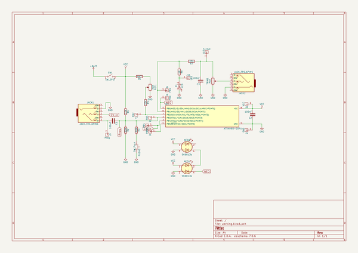
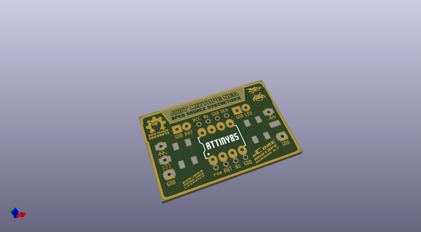
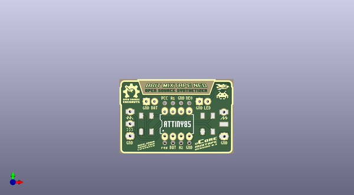
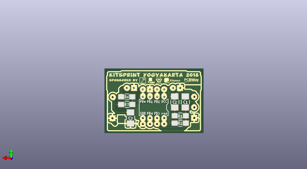

# mcore_mixtape
 
## summary 
* id: 8bitmixtape_mcore_mixtape_mixtape_barebone
* user: 8bitmixtape
* name: mcore_mixtape
* board: mixtape_barebone
* repo: https://github.com/8BitMixtape/mCore_Mixtape
* src_file_repo_kicad_pcb: Kicad/Mixtape_Barebone.kicad_pcb
* src_file_repo_kicad_pcb_link: https://github.com/8BitMixtape/mCore_Mixtape/tree/master/Kicad/Mixtape_Barebone.kicad_pcb

* src_file_repo_sch: Kicad/Mixtape_Barebone.sch
* src_file_repo_sch_link: https://github.com/8BitMixtape/mCore_Mixtape/tree/master/Kicad/Mixtape_Barebone.sch

## schematic  
  
[schematic (pdf)](working_schematic.pdf)  

## pcb  
 
  
  
  
[board (pdf)](working.pdf)  

## working_bom
| Id | Designator | Footprint | Quantity | Designation | Supplier and ref |  | None | 
| --- | --- | --- | --- | --- | --- | --- | --- | 
| 1 | IC1 | Attiny_DIP-8_W7.62mm | 1 | ATTINY85-20PU |  |  | [''] | 
| 2 | J1 | Loch_mixtape_seltsam | 1 | PB5 |  |  | [''] | 
| 3 | J2 | Loch_mixtape_seltsam | 1 | PB3 |  |  | [''] | 
| 4 | J3 | Loch_mixtape_seltsam | 1 | PB4 |  |  | [''] | 
| 5 | J4,J4 | Loch_mixtape_seltsam | 2 | GND |  |  | [''] | 
| 6 | J5 | Loch_mixtape_seltsam | 1 | PB0 |  |  | [''] | 
| 7 | J7 | Loch_mixtape_seltsam | 1 | PB2 |  |  | [''] | 
| 8 | J8 | Loch_mixtape_seltsam | 1 | VCC |  |  | [''] | 
| 9 | J4,J4,J4,J4 | GND_Loch_mixtape | 4 | GND |  |  | [''] | 
| 10 | J9 | Loch_mixtape | 1 | Prog |  |  | [''] | 
| 11 | J10 | Loch_mixtape | 1 | S-Out |  |  | [''] | 
| 12 | J11 | Loch_mixtape | 1 | LED |  |  | [''] | 
| 13 |  | MicroMixtape_edge | 1 |  |  |  | [''] | 
| 14 | J3 | Loch_mixtape | 1 | PB4 |  |  | [''] | 
| 15 | D1 | TOP_led_footprint | 1 | LED |  |  | [''] | 
| 16 | NEO1,NEO2 | Mixtape_NEO_WS2812B | 2 | SK6813b |  |  | [''] | 
| 17 | JACK2,JACK1 | AUDIO-JACK-3.5mm_SMD_noPrint | 2 | JACK_TRS_6PINS |  |  | [''] | 
| 18 | J8 | Loch_mixtape | 1 | VCC |  |  | [''] | 
| 19 | C1,C2,C3 | C_1210_MixtapeStyle | 3 | 100nF |  |  | [''] | 
| 20 | R1,R2 | R_1206_Mixtape | 2 | 22K |  |  | [''] | 
| 21 | R6 | R_1206_Mixtape | 1 | 1K |  |  | [''] | 
| 22 | R7 | R_1206_Mixtape | 1 | 330 |  |  | [''] | 

## bom_schematic
| Ref | Qnty | Value | Cmp name | Footprint | Description | Vendor | DNP | 
| --- | --- | --- | --- | --- | --- | --- | --- | 
| C1, C2, C3 | 3 | 100nF | C | 8BitMixtape_mCore:C_1210_MixtapeStyle |  |  |  | 
| D1 | 1 | LED | LED | 8BitMixtape_mCore:TOP_led_footprint |  |  |  | 
| IC1 | 1 | ATTINY85-20PU | ATTINY85-20PU | 8BitMixtape_mCore:Attiny_DIP-8_W7.62mm |  |  |  | 
| J1 | 1 | PB5 | CONN_01X01 | 8BitMixtape_mCore:Loch_mixtape |  |  |  | 
| J2 | 1 | PB3 | CONN_01X01 | 8BitMixtape_mCore:Loch_mixtape |  |  |  | 
| J3 | 1 | PB4 | CONN_01X01 | 8BitMixtape_mCore:Loch_mixtape |  |  |  | 
| J4 | 1 | GND | CONN_01X01 | 8BitMixtape_mCore:Loch_mixtape |  |  |  | 
| J5 | 1 | PB0 | CONN_01X01 | 8BitMixtape_mCore:Loch_mixtape |  |  |  | 
| J6 | 1 | PB1 | CONN_01X01 | 8BitMixtape_mCore:Loch_mixtape |  |  |  | 
| J7 | 1 | PB2 | CONN_01X01 | 8BitMixtape_mCore:Loch_mixtape |  |  |  | 
| J8 | 1 | VCC | CONN_01X01 | 8BitMixtape_mCore:Loch_mixtape |  |  |  | 
| J9 | 1 | Prog | CONN_01X01 | 8BitMixtape_mCore:Loch_mixtape |  |  |  | 
| J10 | 1 | S-Out | CONN_01X01 | 8BitMixtape_mCore:Loch_mixtape |  |  |  | 
| J11 | 1 | LED | CONN_01X01 | 8BitMixtape_mCore:Loch_mixtape |  |  |  | 
| JACK1, JACK2 | 2 | JACK_TRS_6PINS | JACK_TRS_6PINS | 8BitMixtape_mCore:AUDIO-JACK-3.5mm_SMD_noPrint |  |  |  | 
| NEO1, NEO2 | 2 | SK6813b | LED_Dual_ACAC | 8BitMixtape_mCore:Mixtape_NEO_WS2812B |  |  |  | 
| POT1 | 1 | POT | POT | 8BitMixtape_DIY-CAD:Mixtape_Pot_Alps |  |  |  | 
| PUSH1 | 1 | SW_Push | SW_Push | 8BitMixtape_DIY-CAD:TACTILE-PTH_6mm |  |  |  | 
| R1, R2, R3, R4 | 4 | 22K | R | 8BitMixtape_mCore:R_1206_Mixtape |  |  |  | 
| R5 | 1 | 4K7 | R | 8BitMixtape_mCore:R_1206_Mixtape |  |  |  | 
| R6 | 1 | 1K | R | 8BitMixtape_mCore:R_1206_Mixtape |  |  |  | 
| R7 | 1 | 330 | R | 8BitMixtape_mCore:R_1206_Mixtape |  |  |  | 
| SW1 | 1 | SW_SPST | SW_SPST | 8BitMixtape_DIY-CAD:Push_SWITCH-Rect |  |  |  | 
| TRIM1 | 1 | POT | POT |  |  |  |  | 

## positions
### top
| # Ref | Val | Package | PosX | PosY | Rot | Side | 
| --- | --- | --- | --- | --- | --- | --- | 
| nan | nan | MicroMixtape_edge | 86.995 | -52.07 | 0.0 | top | 
| D1 | LED | TOP_led_footprint | 101.219 | -50.673 | 0.0 | top | 
| IC1 | ATTINY85-20PU | Attiny_DIP-8_W7.62mm | 83.185 | -64.77 | 90.0 | top | 
| J1 | PB5 | Loch_mixtape_seltsam | 83.185 | -66.929 | 0.0 | top | 
| J2 | PB3 | Loch_mixtape_seltsam | 85.725 | -66.929 | 0.0 | top | 
| J3 | PB4 | Loch_mixtape_seltsam | 88.265 | -66.929 | 0.0 | top | 
| J3 | PB4 | Loch_mixtape | 72.39 | -57.15 | 0.0 | top | 
| J4 | GND | Loch_mixtape_seltsam | 90.805 | -66.929 | 0.0 | top | 
| J4 | GND | GND_Loch_mixtape | 72.39 | -64.77 | 0.0 | top | 
| J4 | GND | GND_Loch_mixtape | 101.727 | -64.897 | 0.0 | top | 
| J4 | GND | GND_Loch_mixtape | 93.98 | -53.975 | 0.0 | top | 
| J4 | GND | Loch_mixtape_seltsam | 88.265 | -54.483 | 0.0 | top | 
| J4 | GND | GND_Loch_mixtape | 77.47 | -53.975 | 0.0 | top | 
| J5 | PB0 | Loch_mixtape_seltsam | 90.805 | -54.483 | 0.0 | top | 
| J7 | PB2 | Loch_mixtape_seltsam | 85.725 | -54.483 | 0.0 | top | 
| J8 | VCC | Loch_mixtape_seltsam | 83.185 | -54.483 | 0.0 | top | 
| J8 | VCC | Loch_mixtape | 80.01 | -53.975 | 0.0 | top | 
| J9 | Prog | Loch_mixtape | 72.39 | -60.96 | 0.0 | top | 
| J10 | S-Out | Loch_mixtape | 101.6 | -57.277 | 0.0 | top | 
| J11 | LED | Loch_mixtape | 96.52 | -53.975 | 0.0 | top | 
| JACK1 | JACK_TRS_6PINS | AUDIO-JACK-3.5mm_SMD_noPrint | 68.58 | -67.31 | 90.0 | top | 
| JACK2 | JACK_TRS_6PINS | AUDIO-JACK-3.5mm_SMD_noPrint | 105.41 | -67.437 | 90.0 | top | 
| NEO1 | SK6813b | Mixtape_NEO_WS2812B | 77.419 | -60.92 | -90.0 | top | 
| NEO2 | SK6813b | Mixtape_NEO_WS2812B | 96.571 | -60.92 | -90.0 | top | 

### bottom
| # Ref | Val | Package | PosX | PosY | Rot | Side | 
| --- | --- | --- | --- | --- | --- | --- | 
| C1 | 100nF | C_1210_MixtapeStyle | 75.565 | -59.023 | 90.0 | bottom | 
| C2 | 100nF | C_1210_MixtapeStyle | 79.375 | -59.023 | -90.0 | bottom | 
| C3 | 100nF | C_1210_MixtapeStyle | 95.25 | -64.802 | 90.0 | bottom | 
| R1 | 22K | R_1206_Mixtape | 77.375 | -64.008 | 180.0 | bottom | 
| R2 | 22K | R_1206_Mixtape | 77.375 | -66.675 | 0.0 | bottom | 
| R6 | 1K | R_1206_Mixtape | 96.615 | -57.15 | 0.0 | bottom | 
| R7 | 330 | R_1206_Mixtape | 96.615 | -59.944 | 180.0 | bottom | 

