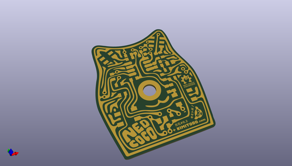
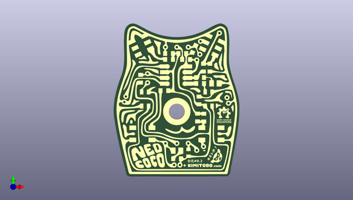
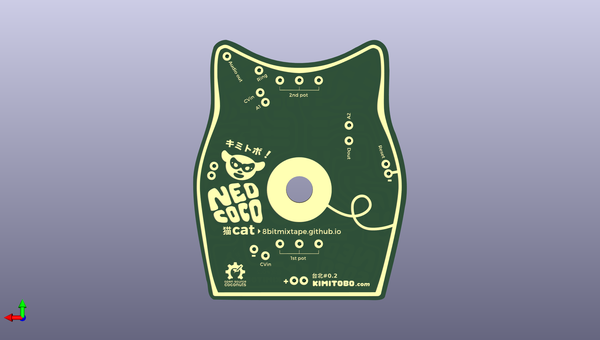

# neocococat
 
## summary 
* id: 8bitmixtape_neocococat_pcb
* user: 8bitmixtape
* name: neocococat
* board: pcb
* repo: https://github.com/8BitMixtape/Neocococat
* src_file_repo_kicad_pcb: Kicad/PCB.kicad_pcb
* src_file_repo_kicad_pcb_link: https://github.com/8BitMixtape/Neocococat/tree/master/Kicad/PCB.kicad_pcb

* src_file_repo_sch: Kicad/PCB.sch
* src_file_repo_sch_link: https://github.com/8BitMixtape/Neocococat/tree/master/Kicad/PCB.sch

## schematic  
  
[schematic (pdf)](working_schematic.pdf)  

## pcb  
 
  
  
  
[board (pdf)](working.pdf)  

## working_bom
| Id | Designator | Footprint | Quantity | Designation | Supplier and ref |  | None | 
| --- | --- | --- | --- | --- | --- | --- | --- | 
| 1 | G*** | Neocococat_Front_copper_1 | 1 | LOGO |  |  | [''] | 
| 2 | G*** | Neocococat_Back_copper_mirror | 1 | LOGO |  |  | [''] | 
| 3 | G*** | Neocococat_Frontmask | 1 | LOGO |  |  | [''] | 
| 4 | G*** | Neocococat_Backmask | 1 | LOGO |  |  | [''] | 
| 5 | REF**,REF**,REF**,REF**,REF**,REF**,REF**,REF**,REF**,REF**,REF**,REF**,REF**,REF**,REF**,REF**,REF**,REF**,REF**,REF** | Cococat_hole_1x01 | 20 | Hole_1mm |  |  | [''] | 

## bom_schematic
no data

## positions
### top
| # Ref | Val | Package | PosX | PosY | Rot | Side | 
| --- | --- | --- | --- | --- | --- | --- | 
| G*** | LOGO | Neocococat_Front_copper_1 | 88.56 | -108.09 | 0.0 | top | 
| G*** | LOGO | Neocococat_Back_copper_mirror | 88.56 | -108.09 | 0.0 | top | 
| G*** | LOGO | Neocococat_Frontmask | 88.56 | -108.07 | 0.0 | top | 
| G*** | LOGO | Neocococat_Backmask | 88.66 | -108.13 | 0.0 | top | 
| REF** | Hole_1mm | Cococat_hole_1x01 | 83.72 | -84.93 | 0.0 | top | 
| REF** | Hole_1mm | Cococat_hole_1x01 | 88.72 | -84.93 | 0.0 | top | 
| REF** | Hole_1mm | Cococat_hole_1x01 | 93.72 | -84.94 | 0.0 | top | 
| REF** | Hole_1mm | Cococat_hole_1x01 | 99.09 | -82.37 | 0.0 | top | 
| REF** | Hole_1mm | Cococat_hole_1x01 | 107.35 | -78.76 | 0.0 | top | 
| REF** | Hole_1mm | Cococat_hole_1x01 | 98.78 | -88.07 | 0.0 | top | 
| REF** | Hole_1mm | Cococat_hole_1x01 | 97.44 | -90.57 | 0.0 | top | 
| REF** | Hole_1mm | Cococat_hole_1x01 | 75.91 | -96.53 | 0.0 | top | 
| REF** | Hole_1mm | Cococat_hole_1x01 | 75.92 | -100.51 | 0.0 | top | 
| REF** | Hole_1mm | Cococat_hole_1x01 | 66.42 | -106.53 | 0.0 | top | 
| REF** | Hole_1mm | Cococat_hole_1x01 | 65.76 | -108.99 | 0.0 | top | 
| REF** | Hole_1mm | Cococat_hole_1x01 | 110.66 | -107.03 | 0.0 | top | 
| REF** | Hole_1mm | Cococat_hole_1x01 | 111.33 | -109.48 | 0.0 | top | 
| REF** | Hole_1mm | Cococat_hole_1x01 | 83.71 | -127.07 | 0.0 | top | 
| REF** | Hole_1mm | Cococat_hole_1x01 | 88.72 | -127.09 | 0.0 | top | 
| REF** | Hole_1mm | Cococat_hole_1x01 | 93.71 | -127.07 | 0.0 | top | 
| REF** | Hole_1mm | Cococat_hole_1x01 | 97.43 | -130.14 | 0.0 | top | 
| REF** | Hole_1mm | Cococat_hole_1x01 | 100.39 | -128.47 | 0.0 | top | 
| REF** | Hole_1mm | Cococat_hole_1x01 | 87.53 | -136.56 | 0.0 | top | 
| REF** | Hole_1mm | Cococat_hole_1x01 | 90.07 | -136.56 | 0.0 | top | 

### bottom
no data
