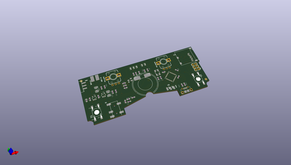
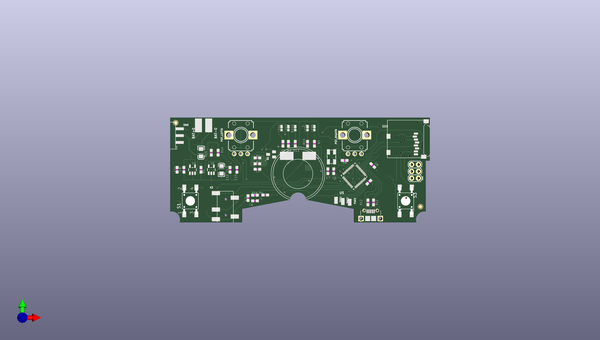
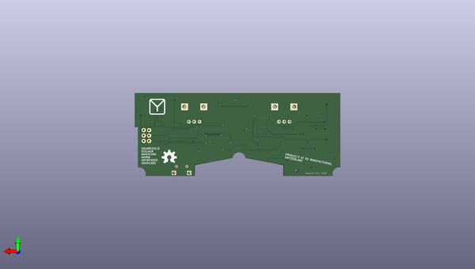

# nextleveledition
 
## summary 
* id: 8bitmixtape_nextleveledition_mixtape
* user: 8bitmixtape
* name: nextleveledition
* board: mixtape
* repo: https://github.com/8BitMixtape/NextLevelEdition

* src_file_repo_sch: 
* src_file_repo_sch_link: https://github.com/8BitMixtape/NextLevelEdition/tree/master/

## schematic  
  
[schematic (pdf)](working_schematic.pdf)  

## pcb  
 
  
  
  
[board (pdf)](working.pdf)  

## working_bom
| Id | Designator | Footprint | Quantity | Designation | Supplier and ref |  | None | 
| --- | --- | --- | --- | --- | --- | --- | --- | 
| 1 | R12,R11 | 0603-RES | 2 | 22 |  |  | [''] | 
| 2 | R6 | 0603-RES | 1 | 10K |  |  | [''] | 
| 3 | LED3 | LED-0603 | 1 | Green |  |  | [''] | 
| 4 | S1 | TASTER-9314_SMD | 1 | Left |  |  | [''] | 
| 5 | BAT+0,BAT-0 | SMD2,54-5,08 | 2 |  |  |  | [''] | 
| 6 | C12,C2,C6,C8,C11,C3 | 0603-CAP | 6 | 1uF |  |  | [''] | 
| 7 | SD0 | MICROSD | 1 | MICROSD |  |  | [''] | 
| 8 | U1 | SOT23-5 | 1 | MCP73831 |  |  | [''] | 
| 9 | U$4 | FUNNEL_LOGO_BOTTOM_V2 | 1 | FIO_LOGOV2 |  |  | [''] | 
| 10 | X1 | USB_B_SMD | 1 | USB_B_SMD |  |  | [''] | 
| 11 | C9 | 0603-CAP | 1 | 4.7uF |  |  | [''] | 
| 12 | C1,C13 | EIA3216 | 2 | 10uF |  |  | [''] | 
| 13 | R16,R13,R4,R10,R3,R7 | 0603-RES | 6 | 330 |  |  | [''] | 
| 14 | R2,R1 | 0603-RES | 2 | 33 |  |  | [''] | 
| 15 | PAD2,PAD3,PAD1 | SMD1,27-2,54 | 3 | WIREPADSMD1,27-254 |  |  | [''] | 
| 16 | Y2 | CRYSTAL-SMD-5X3 | 1 | 8MHz |  |  | [''] | 
| 17 | R9 | 0603-RES | 1 | 470 |  |  | [''] | 
| 18 | LED5,LED1 | LED-0603 | 2 | Yellow |  |  | [''] | 
| 19 | R14,R15 | 0603-RES | 2 | 10k |  |  | [''] | 
| 20 | C7,C5 | 0603-CAP | 2 | 22pF |  |  | [''] | 
| 21 | U$2,U$1 | FIDUCIAL_1MM | 2 | FIDUCIAL |  |  | [''] | 
| 22 | Q1 | SOT23 | 1 | BSS123 |  |  | [''] | 
| 23 | SW0 | SWITCH_SMD | 1 | SWITCH_SMD |  |  | [''] | 
| 24 | POT_RIGHT0,POT_LEFT0 | EVUF | 2 | EVUF2A |  |  | [''] | 
| 25 | U5 | QFN-44-NOPAD_1_1 | 1 | ATMEGA32U4 |  |  | [''] | 
| 26 | LED2 | LED-0603 | 1 | Blue |  |  | [''] | 
| 27 | C14,C4 | 0603-CAP | 2 | 0.1uF |  |  | [''] | 
| 28 | JP4 | 2X3 | 1 | AVR_SPI |  |  | [''] | 
| 29 | R5 | 0603-RES | 1 | 2K |  |  | [''] | 
| 30 | X2 | PJ-327A | 1 | PJ-327A |  |  | [''] | 
| 31 | U6 | SOT23-5 | 1 | MIC5219-3.3 |  |  | [''] | 
| 32 | LED4 | LED-0603 | 1 | Red |  |  | [''] | 
| 33 | SPEAKER0 | PS603 | 1 | PS603SPK |  |  | [''] | 
| 34 | S3 | TASTER-9314_SMD | 1 | Right |  |  | [''] | 
| 35 | LOGO1 | OSHW-LOGO-L | 1 | OSHW-LOGOL |  |  | [''] | 

## bom_schematic
| Ref | Qnty | Value | Cmp name | Footprint | Description | Vendor | DNP | 
| --- | --- | --- | --- | --- | --- | --- | --- | 
| BAT+0 | 1 | SMD5 | SMD5 | working:SMD2,54-5,08 |  |  |  | 
| BAT-0 | 1 | SMD5 | SMD5 | working:SMD2,54-5,08 |  |  |  | 
| C1, C13 | 2 | 10uF | CAP_POL1206 | working:EIA3216 |  |  |  | 
| C2, C3, C6, C8, C11, C12 | 6 | 1uF | CAP0603-CAP | working:0603-CAP |  |  |  | 
| C4, C14 | 2 | 0.1uF | CAP0603-CAP | working:0603-CAP |  |  |  | 
| C5, C7 | 2 | 22pF | CAP0603-CAP | working:0603-CAP |  |  |  | 
| C9 | 1 | 4.7uF | CAP0603-CAP | working:0603-CAP |  |  |  | 
| JP4 | 1 | AVR_SPI_PRG_6PTH | AVR_SPI_PRG_6PTH | working:2X3 |  |  |  | 
| LED1, LED5 | 2 | Yellow | LED0603 | working:LED-0603 |  |  |  | 
| LED2 | 1 | Blue | LED0603 | working:LED-0603 |  |  |  | 
| LED3 | 1 | Green | LED0603 | working:LED-0603 |  |  |  | 
| LED4 | 1 | Red | LED0603 | working:LED-0603 |  |  |  | 
| LOGO1 | 1 | OSHW-LOGOL | OSHW-LOGOL | working:OSHW-LOGO-L |  |  |  | 
| PAD1, PAD2, PAD3 | 3 | WIREPADSMD1,27-254 | WIREPADSMD1,27-254 | working:SMD1,27-2,54 |  |  |  | 
| POT_LEFT0 | 1 | EVUA | EVUA | working:EVUF |  |  |  | 
| POT_RIGHT0 | 1 | EVUA | EVUA | working:EVUF |  |  |  | 
| Q1 | 1 | BSS123 | BSS123 | working:SOT23 |  |  |  | 
| R1, R2 | 2 | 33 | RESISTOR0603-RES | working:0603-RES |  |  |  | 
| R3, R4, R7, R10, R13, R16 | 6 | 330 | RESISTOR0603-RES | working:0603-RES |  |  |  | 
| R5 | 1 | 2K | RESISTOR0603-RES | working:0603-RES |  |  |  | 
| R6 | 1 | 10K | RESISTOR0603-RES | working:0603-RES |  |  |  | 
| R9 | 1 | 470 | RESISTOR0603-RES | working:0603-RES |  |  |  | 
| R11, R12 | 2 | 22 | RESISTOR0603-RES | working:0603-RES |  |  |  | 
| R14, R15 | 2 | 10k | RESISTOR0603-RES | working:0603-RES |  |  |  | 
| S1 | 1 | Left | TASTER-9314_SMD | working:TASTER-9314_SMD |  |  |  | 
| S3 | 1 | Right | TASTER-9314_SMD | working:TASTER-9314_SMD |  |  |  | 
| SD0 | 1 | MICROSD | MICROSD | working:MICROSD |  |  |  | 
| SPEAKER0 | 1 | PS603SPK | PS603SPK | working:PS603 |  |  |  | 
| SW0 | 1 | SWITCH_SMD | SWITCH_SMD | working:SWITCH_SMD |  |  |  | 
| U1 | 1 | MCP73831 | MCP73831 | working:SOT23-5 |  |  |  | 
| U5 | 1 | ATMEGA32U41:1 | ATMEGA32U41{colon}1 | working:QFN-44-NOPAD_1_1 |  |  |  | 
| U6 | 1 | V_REG_LDOSMD | V_REG_LDOSMD | working:SOT23-5 |  |  |  | 
| U$1, U$2 | 2 | FIDUCIAL | FIDUCIAL | working:FIDUCIAL_1MM |  |  |  | 
| X1 | 1 | USB_B_SMD | USB_B_SMD | working:USB_B_SMD |  |  |  | 
| X2 | 1 | PJ-327A | PJ-327A | working:PJ-327A |  |  |  | 
| Y2 | 1 | 8MHz | CRYSTAL5X3 | working:CRYSTAL-SMD-5X3 |  |  |  | 

## positions
### top
| # Ref | Val | Package | PosX | PosY | Rot | Side | 
| --- | --- | --- | --- | --- | --- | --- | 
| BAT+0 | nan | SMD2,54-5,08 | 110.7686 | -88.4044 | 0.0 | top | 
| BAT-0 | nan | SMD2,54-5,08 | 114.5786 | -88.4044 | 0.0 | top | 
| C1 | 10uF | EIA3216 | 111.7211 | -98.5644 | -90.0 | top | 
| C2 | 1uF | 0603-CAP | 129.1836 | -115.4554 | 90.0 | top | 
| C3 | 1uF | 0603-CAP | 132.6761 | -104.7094 | 180.0 | top | 
| C4 | 0.1uF | 0603-CAP | 174.0861 | -109.5494 | -135.0 | top | 
| C5 | 22pF | 0603-CAP | 161.0211 | -105.4544 | -90.0 | top | 
| C6 | 1uF | 0603-CAP | 131.7871 | -116.4714 | 0.0 | top | 
| C7 | 22pF | 0603-CAP | 158.8621 | -105.4544 | -90.0 | top | 
| C8 | 1uF | 0603-CAP | 175.5311 | -103.3194 | 135.0 | top | 
| C9 | 4.7uF | 0603-CAP | 105.3711 | -104.9144 | -90.0 | top | 
| C11 | 1uF | 0603-CAP | 102.8311 | -104.9144 | 90.0 | top | 
| C12 | 1uF | 0603-CAP | 122.5161 | -104.9144 | -90.0 | top | 
| C13 | 10uF | EIA3216 | 119.3411 | -104.9144 | 90.0 | top | 
| C14 | 0.1uF | 0603-CAP | 125.0561 | -104.9144 | 90.0 | top | 
| JP4 | AVR_SPI | 2X3 | 192.5011 | -108.0644 | 90.0 | top | 
| LED1 | Yellow | LED-0603 | 141.6611 | -89.4124 | 0.0 | top | 
| LED2 | Blue | LED-0603 | 144.2011 | -89.4124 | 0.0 | top | 
| LED3 | Green | LED-0603 | 146.7411 | -89.4124 | 0.0 | top | 
| LED4 | Red | LED-0603 | 151.3131 | -89.4124 | 0.0 | top | 
| LED5 | Yellow | LED-0603 | 153.8531 | -89.4124 | 0.0 | top | 
| PAD1 | WIREPADSMD1,27-254 | SMD1,27-2,54 | 161.8861 | -116.2829 | 0.0 | top | 
| PAD2 | WIREPADSMD1,27-254 | SMD1,27-2,54 | 164.4261 | -116.7254 | 0.0 | top | 
| PAD3 | WIREPADSMD1,27-254 | SMD1,27-2,54 | 166.9661 | -116.9794 | 0.0 | top | 
| POT_LEFT0 | EVUF2A | EVUF | 126.5511 | -92.0044 | 0.0 | top | 
| POT_RIGHT0 | EVUF2A | EVUF | 168.8311 | -92.0044 | 0.0 | top | 
| Q1 | BSS123 | SOT23 | 137.7561 | -99.1994 | 90.0 | top | 
| R1 | 33 | 0603-RES | 132.6761 | -100.4994 | 0.0 | top | 
| R2 | 33 | 0603-RES | 132.6761 | -102.6919 | 0.0 | top | 
| R3 | 330 | 0603-RES | 144.2011 | -95.2544 | -90.0 | top | 
| R4 | 330 | 0603-RES | 135.5971 | -114.3124 | 0.0 | top | 
| R5 | 2K | 0603-RES | 111.7211 | -104.9144 | -90.0 | top | 
| R6 | 10K | 0603-RES | 165.0931 | -101.4474 | 180.0 | top | 
| R7 | 330 | 0603-RES | 153.8531 | -95.2544 | 90.0 | top | 
| R9 | 470 | 0603-RES | 142.1691 | -95.2544 | 90.0 | top | 
| R10 | 330 | 0603-RES | 151.3131 | -95.2544 | 90.0 | top | 
| R11 | 22 | 0603-RES | 175.8256 | -117.0589 | -90.0 | top | 
| R12 | 22 | 0603-RES | 173.7381 | -117.0589 | -90.0 | top | 
| R13 | 330 | 0603-RES | 146.7411 | -95.2544 | -90.0 | top | 
| R14 | 10k | 0603-RES | 118.0711 | -98.5644 | 90.0 | top | 
| R15 | 10k | 0603-RES | 115.5311 | -98.5644 | -90.0 | top | 
| R16 | 330 | 0603-RES | 131.7871 | -114.3759 | 0.0 | top | 
| S1 | Left | TASTER-9314_SMD | 107.7511 | -116.5044 | 90.0 | top | 
| S3 | Right | TASTER-9314_SMD | 187.7511 | -116.5044 | -90.0 | top | 
| SD0 | MICROSD | MICROSD | 180.9361 | -100.4694 | 90.0 | top | 
| SPEAKER0 | PS603SPK | PS603 | 147.7511 | -106.4694 | 180.0 | top | 
| SW0 | SWITCH_SMD | SWITCH_SMD | 103.7836 | -92.2144 | 0.0 | top | 
| U$1 | FIDUCIAL | FIDUCIAL_1MM | 102.3231 | -87.3884 | 0.0 | top | 
| U$2 | FIDUCIAL | FIDUCIAL_1MM | 193.2551 | -118.6304 | 0.0 | top | 
| U$4 | FIO_LOGOV2 | FUNNEL_LOGO_BOTTOM_V2 | 186.1431 | -91.9604 | 0.0 | top | 
| U1 | MCP73831 | SOT23-5 | 108.5461 | -104.9144 | 0.0 | top | 
| U5 | ATMEGA32U4 | QFN-44-NOPAD_1_1 | 168.6961 | -107.3194 | -138.0 | top | 
| U6 | MIC5219-3.3 | SOT23-5 | 115.5311 | -104.9144 | 0.0 | top | 
| X1 | USB_B_SMD | USB_B_SMD | 174.7511 | -120.3764 | 0.0 | top | 
| X2 | PJ-327A | PJ-327A | 120.7511 | -124.9044 | 90.0 | top | 
| Y2 | 8MHz | CRYSTAL-SMD-5X3 | 160.2111 | -100.1044 | -90.0 | top | 

### bottom
| # Ref | Val | Package | PosX | PosY | Rot | Side | 
| --- | --- | --- | --- | --- | --- | --- | 
| LOGO1 | OSHW-LOGOL | OSHW-LOGO-L | 180.5271 | -115.7524 | 180.0 | bottom | 

