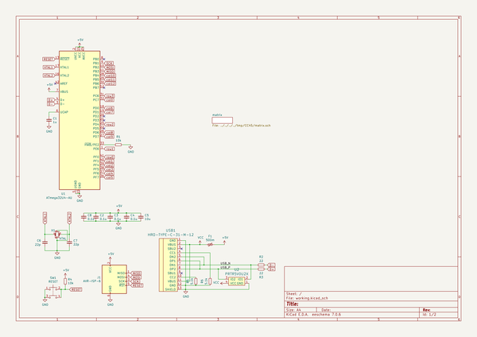
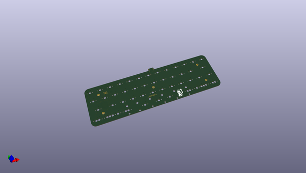
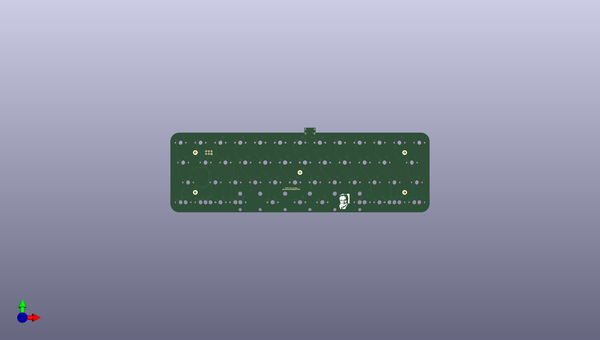
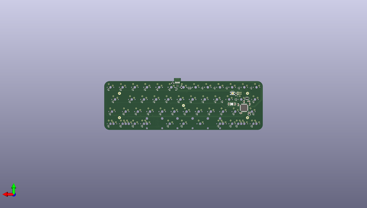

# cc45
 
## summary 
* id: aaarsene_cc45_cc45
* user: aaarsene
* name: cc45
* board: cc45
* repo: https://github.com/aaarsene/CC45
* src_file_repo_kicad_pcb: CC45.kicad_pcb
* src_file_repo_kicad_pcb_link: https://github.com/aaarsene/CC45/tree/master/CC45.kicad_pcb

* src_file_repo_sch: CC45.sch
* src_file_repo_sch_link: https://github.com/aaarsene/CC45/tree/master/CC45.sch
* full details link: https://github.com/oomlout/oomlout_oomp_project_bot_v_2/tree/main/projects/aaarsene_cc45_cc45/current_version/working  

## schematic  
  
[schematic (pdf)](working_schematic.pdf) 

## pcb  
 
  
  
  
[board (pdf)](working.pdf)  

## working_bom
| Id | Designator | Footprint | Quantity | Designation | Supplier and ref |  | None | 
| --- | --- | --- | --- | --- | --- | --- | --- | 
| 1 | SW2 | MX_19mm-1U-NoLED | 1 | K00 |  |  | [''] | 
| 2 | SW4 | MX_19mm-1U-NoLED | 1 | K02 |  |  | [''] | 
| 3 | SW5 | MX_19mm-1U-NoLED | 1 | K03 |  |  | [''] | 
| 4 | SW6 | MX_19mm-1U-NoLED | 1 | K04 |  |  | [''] | 
| 5 | SW7 | MX_19mm-1U-NoLED | 1 | K05 |  |  | [''] | 
| 6 | SW8 | MX_19mm-1U-NoLED | 1 | K06 |  |  | [''] | 
| 7 | SW9 | MX_19mm-1U-NoLED | 1 | K07 |  |  | [''] | 
| 8 | SW10 | MX_19mm-1U-NoLED | 1 | K08 |  |  | [''] | 
| 9 | SW11 | MX_19mm-1U-NoLED | 1 | K09 |  |  | [''] | 
| 10 | SW12 | MX_19mm-1U-NoLED | 1 | K0A |  |  | [''] | 
| 11 | SW13 | MX_19mm-1U-NoLED | 1 | K0B |  |  | [''] | 
| 12 | SW14 | MX_19mm-1U-NoLED | 1 | K0C |  |  | [''] | 
| 13 | SW16 | MX_19mm-1U-NoLED | 1 | K11 |  |  | [''] | 
| 14 | SW17 | MX_19mm-1U-NoLED | 1 | K12 |  |  | [''] | 
| 15 | SW18 | MX_19mm-1U-NoLED | 1 | K13 |  |  | [''] | 
| 16 | SW19 | MX_19mm-1U-NoLED | 1 | K14 |  |  | [''] | 
| 17 | SW20 | MX_19mm-1U-NoLED | 1 | K15 |  |  | [''] | 
| 18 | SW22 | MX_19mm-1U-NoLED | 1 | K17 |  |  | [''] | 
| 19 | SW23 | MX_19mm-1U-NoLED | 1 | K18 |  |  | [''] | 
| 20 | SW25 | MX_19mm-1U-NoLED | 1 | K1A |  |  | [''] | 
| 21 | SW26 | MX_19mm-1.75U-NoLED | 1 | K1B |  |  | [''] | 
| 22 | SW27 | MX_19mm-1.75U-NoLED | 1 | K20 |  |  | [''] | 
| 23 | SW29 | MX_19mm-1U-NoLED | 1 | K22 |  |  | [''] | 
| 24 | SW30 | MX_19mm-1U-NoLED | 1 | K23 |  |  | [''] | 
| 25 | SW31 | MX_19mm-1U-NoLED | 1 | K24 |  |  | [''] | 
| 26 | SW34 | MX_19mm-1U-NoLED | 1 | K27 |  |  | [''] | 
| 27 | SW35 | MX_19mm-1U-NoLED | 1 | K28 |  |  | [''] | 
| 28 | SW36 | MX_19mm-1U-NoLED | 1 | K29 |  |  | [''] | 
| 29 | SW37 | MX_19mm-1U-NoLED | 1 | K2A |  |  | [''] | 
| 30 | SW38 | MX_19mm-1.25U-NoLED | 1 | K2B |  |  | [''] | 
| 31 | SW24 | MX_19mm-1U-NoLED | 1 | K19 |  |  | [''] | 
| 32 | SW21 | MX_19mm-1U-NoLED | 1 | K16 |  |  | [''] | 
| 33 | SW33 | MX_19mm-1U-NoLED | 1 | K26 |  |  | [''] | 
| 34 | SW32 | MX_19mm-1U-NoLED | 1 | K25 |  |  | [''] | 
| 35 | SW39 | MX_19mm-1U-NoLED | 1 | K30 |  |  | [''] | 
| 36 | SW40,SW40 | MX_19mm-1U-NoLED | 2 | K31 |  |  | [''] | 
| 37 | SW42 | MX_19mm-1U-NoLED | 1 | K33 |  |  | [''] | 
| 38 | SW45 | MX_19mm-1U-NoLED | 1 | K38 |  |  | [''] | 
| 39 | SW41 | MX_19mm-1U-NoLED | 1 | K32 |  |  | [''] | 
| 40 | SW43 | MX_19mm-2.25U-ReversedStabilizers-NoLED | 1 | K34 |  |  | [''] | 
| 41 | SW46 | MX_19mm-1U-NoLED | 1 | K39 |  |  | [''] | 
| 42 | SW48 | MX_19mm-1U-NoLED | 1 | K3B |  |  | [''] | 
| 43 | SW44 | MX_19mm-2.75U-ReversedStabilizers-NoLED | 1 | K36 |  |  | [''] | 
| 44 | SW47,SW47 | MX_19mm-1U-NoLED | 2 | K3A |  |  | [''] | 
| 45 | SW15 | MX_19mm-1.25U-NoLED | 1 | K10 |  |  | [''] | 
| 46 | G*** | cc | 1 | LOGO |  |  | [''] | 
| 47 | SW3 | MX_19mm-1U-NoLED | 1 | K01 |  |  | [''] | 
| 48 | SW39 | MX_19mm-1.5U-NoLED | 1 | K30 |  |  | [''] | 
| 49 | SW42 | MX_19mm-1.5U-NoLED | 1 | K33 |  |  | [''] | 
| 50 | SW45 | MX_19mm-1.5U-NoLED | 1 | K38 |  |  | [''] | 
| 51 | SW48 | MX_19mm-1.5U-NoLED | 1 | K3B |  |  | [''] | 
| 52 | SW40 | MX_19mm-1.5U-NoLED | 1 | K31 |  |  | [''] | 
| 53 | SW47 | MX_19mm-1.5U-NoLED | 1 | K3A |  |  | [''] | 
| 54 | SW43 | MX_19mm-7U-ReversedStabilizers-NoLED | 1 | K34 |  |  | [''] | 
| 55 | SW28 | MX_19mm-1U-NoLED | 1 | K21 |  |  | [''] | 
| 56 | C1 | C_1206_3216Metric_Pad1.42x1.75mm_HandSolder | 1 | 1u |  |  | [''] | 
| 57 | D1,D2,D3,D4,D5,D6,D7,D8,D9,D10,D11,D12,D14,D16,D17,D18,D20,D21,D22,D23,D24,D25,D26,D27,D28,D29,D30,D31,D32,D33,D34,D35,D36,D37,D38,D39,D40,D41,D42,D43,D44,D46,D47,D19,D13,D15,D45 | D_SOD-323_HandSoldering | 47 | D |  |  | [''] | 
| 58 | R4,R1 | R_1206_3216Metric_Pad1.42x1.75mm_HandSolder | 2 | 10k |  |  | [''] | 
| 59 | USB1 | HRO-TYPE-C-31-M-12-HandSoldering | 1 | HRO-TYPE-C-31-M-12 |  |  | [''] | 
| 60 | SW1 | SKQG-1155865 | 1 | RESET |  |  | [''] | 
| 61 | R3,R2 | R_1206_3216Metric_Pad1.42x1.75mm_HandSolder | 2 | 22 |  |  | [''] | 
| 62 | C7,C6 | C_1206_3216Metric_Pad1.42x1.75mm_HandSolder | 2 | 22p |  |  | [''] | 
| 63 | X1 | Crystal_SMD_3225-4Pin_3.2x2.5mm_HandSoldering | 1 | XTAL |  |  | [''] | 
| 64 | C4,C8,C3,C2 | C_1206_3216Metric_Pad1.42x1.75mm_HandSolder | 4 | 0.1u |  |  | [''] | 
| 65 | F1 | Fuse_1206_3216Metric_Pad1.42x1.75mm_HandSolder | 1 | 500m |  |  | [''] | 
| 66 | R5,R6 | R_1206_3216Metric_Pad1.42x1.75mm_HandSolder | 2 | 5.1k |  |  | [''] | 
| 67 | U2 | SOT143B | 1 | PRTR5V0U2X |  |  | [''] | 
| 68 | U1 | TQFP-44_10x10mm_P0.8mm | 1 | ATmega32U4-AU |  |  | [''] | 
| 69 | C5 | C_1206_3216Metric_Pad1.42x1.75mm_HandSolder | 1 | 10u |  |  | [''] | 

## bom_schematic
| Ref | Qnty | Value | Cmp name | Footprint | Description | Vendor | DNP | 
| --- | --- | --- | --- | --- | --- | --- | --- | 
| C1 | 1 | 1u | C_Small | Capacitor_SMD:C_1206_3216Metric_Pad1.42x1.75mm_HandSolder | Unpolarized capacitor, small symbol |  |  | 
| C2, C3, C4, C8 | 4 | 0.1u | C_Small | Capacitor_SMD:C_1206_3216Metric_Pad1.42x1.75mm_HandSolder | Unpolarized capacitor, small symbol |  |  | 
| C5 | 1 | 10u | C_Small | Capacitor_SMD:C_1206_3216Metric_Pad1.42x1.75mm_HandSolder | Unpolarized capacitor, small symbol |  |  | 
| C6, C7 | 2 | 22p | C_Small | Capacitor_SMD:C_1206_3216Metric_Pad1.42x1.75mm_HandSolder | Unpolarized capacitor, small symbol |  |  | 
| F1 | 1 | 500m | Polyfuse_Small | Fuse:Fuse_1206_3216Metric_Pad1.42x1.75mm_HandSolder | Resettable fuse, polymeric positive temperature coefficient, small symbol |  |  | 
| J1 | 1 | AVR-ISP-6 | AVR-ISP-6 | random-keyboard-parts:Reset_Pretty-Mask | Atmel 6-pin ISP connector |  |  | 
| R1, R4 | 2 | 10k | R_Small | Resistor_SMD:R_1206_3216Metric_Pad1.42x1.75mm_HandSolder | Resistor, small symbol |  |  | 
| R2, R3 | 2 | 22 | R_Small | Resistor_SMD:R_1206_3216Metric_Pad1.42x1.75mm_HandSolder | Resistor, small symbol |  |  | 
| R5, R6 | 2 | 5.1k | R_Small | Resistor_SMD:R_1206_3216Metric_Pad1.42x1.75mm_HandSolder | Resistor, small symbol |  |  | 
| SW1 | 1 | RESET | SW_Push_Dual | random-keyboard-parts:SKQG-1155865 | Push button switch, generic, symbol, four pins |  |  | 
| U1 | 1 | ATmega32U4-AU | ATmega32U4-AU-MCU_Microchip_ATmega | Package_QFP:TQFP-44_10x10mm_P0.8mm |  |  |  | 
| U2 | 1 | PRTR5V0U2X | PRTR5V0U2X-random-keyboard-parts | random-keyboard-parts:SOT143B |  |  |  | 
| USB1 | 1 | HRO-TYPE-C-31-M-12 | HRO-TYPE-C-31-M-12-Type-C | Type-C:HRO-TYPE-C-31-M-12-HandSoldering |  |  |  | 
| X1 | 1 | XTAL | Crystal_GND24_Small | Crystal:Crystal_SMD_3225-4Pin_3.2x2.5mm_HandSoldering | Four pin crystal, GND on pins 2 and 4, small symbol |  |  | 

