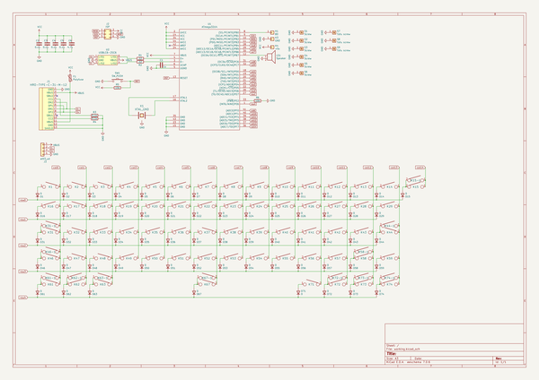
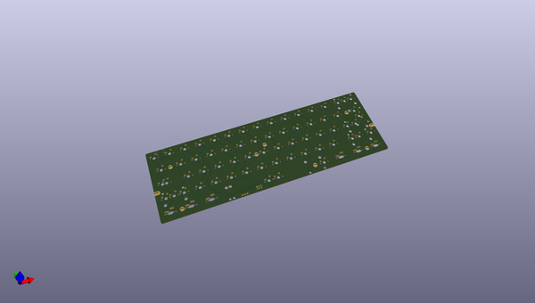
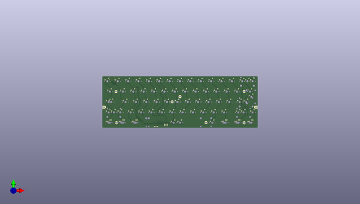
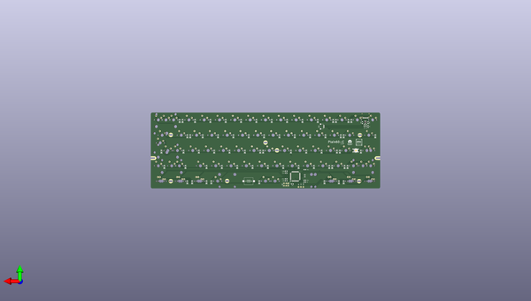

# plain60_c
 
## summary 
* id: aaarsene_plain60_c_plain60_c
* user: aaarsene
* name: plain60_c
* board: plain60_c
* repo: https://github.com/aaarsene/plain60-c
* src_file_repo_kicad_pcb: plain60-c.kicad_pcb
* src_file_repo_kicad_pcb_link: https://github.com/aaarsene/plain60-c/tree/master/plain60-c.kicad_pcb
* src_file_repo_kicad_sch: plain60-c.kicad_sch
* src_file_repo_kicad_sch_link: https://github.com/aaarsene/plain60-c/tree/master/plain60-c.kicad_sch

* src_file_repo_sch: 
* src_file_repo_sch_link: https://github.com/aaarsene/plain60-c/tree/master/
* full details link: https://github.com/oomlout/oomlout_oomp_project_bot_v_2/tree/main/projects/aaarsene_plain60_c_plain60_c/current_version/working  

## schematic  
  
[schematic (pdf)](working_schematic.pdf) 

## pcb  
 
  
  
  
[board (pdf)](working.pdf)  

## working_bom
| Id | Designator | Footprint | Quantity | Designation | Supplier and ref |  | None | 
| --- | --- | --- | --- | --- | --- | --- | --- | 
| 1 | K19,K20,K23,K24,K17,K22,K21,K18,K8,K10,K14,K5,K13,K12,K11,K9,K7,K6,K4,K2,K1,K3,K62-1,K53,K57,K54,K56,K52,K55,K15-1,K28,K48,K25,K36,K33,K59,K39,K27,K50,K34,K47,K43,K38,K35,K32,K40,K42,K41,K26,K37,K51,K73-1,K49 | CHERRY_PLATE_100H | 53 | KEYSW |  |  | [''] | 
| 2 | K16,K61-1,K29,K63-1,K72-1,K74-1 | CHERRY_PLATE_150H | 6 | KEYSW |  |  | [''] | 
| 3 | K15 | CHERRY_PCB_200H | 1 | KEYSW |  |  | [''] | 
| 4 | K71,K31-1,K46-1,K74,K73,K63,K72,K61,K62 | CHERRY_PLATE_125H | 9 | KEYSW |  |  | [''] | 
| 5 | K58-1,K31 | CHERRY_PLATE_175H | 2 | KEYSW |  |  | [''] | 
| 6 | K44,K46 | CHERRY_PCB_225H | 2 | KEYSW |  |  | [''] | 
| 7 | S4,S5 | 10x5_7x2.5mm | 2 | Screw |  |  | [''] | 
| 8 | K58 | CHERRY_PCB_275H | 1 | KEYSW |  |  | [''] | 
| 9 | K67 | CHERRY_PCB_625H_F | 1 | KEYSW |  |  | [''] | 
| 10 | S8,S7,S9 | 5.5_5x2.5mm | 3 | Tofu screw |  |  | [''] | 
| 11 | S2,S1,S3,S6 | 5.5_5x2.5mm | 4 | Screw |  |  | [''] | 
| 12 | K67-1 | CHERRY_PCB_700H_F | 1 | KEYSW |  |  | [''] | 
| 13 | K44-1 | CHERRY_PCB_200H_V | 1 | KEYSW |  |  | [''] | 
| 14 | D73,D72,D71,D67,D63,D59,D58,D57,D56,D53,D51,D50,D27,D42,D18,D25,D41,D36,D31,D40,D37,D32,D34,D21,D26,D22,D24,D43,D38,D35,D48,D54,D44,D62,D39,D20,D28,D33,D23,D55,D52,D19,D10,D14,D9,D13,D11,D15,D17,D16,D12,D7,D3,D5,D8,D6,D4,D74,D49,D46,D29,D1,D47,D2,D61 | D_0805 | 65 | D |  |  | [''] | 
| 15 | U1 | ATMEGA32U4 | 1 | ATmega32U4 |  |  | [''] | 
| 16 | X1 | Resonator_SMD_muRata_CSTNExxV-3Pin-p1.2 | 1 | XTAL_GND |  |  | [''] | 
| 17 | SW1 | SW_SPST_TL3342 | 1 | SW_PUSH |  |  | [''] | 
| 18 | R6,R5 | R_0805 | 2 | 10k |  |  | [''] | 
| 19 | G*** | oshw | 1 | LOGO |  |  | [''] | 
| 20 | H4 | free_pin | 1 | +5v |  |  | [''] | 
| 21 | H1 | free_pin | 1 | B0 |  |  | [''] | 
| 22 | R1,R2 | R_0805 | 2 | 22 |  |  | [''] | 
| 23 | J1 | HRO-TYPE-C-31-M-12 | 1 | HRO-TYPE-C-31-M-12 |  |  | [''] | 
| 24 | C4,C5,C2,C3 | C_0805 | 4 | 0.1u |  |  | [''] | 
| 25 | F1 | R_0805 | 1 | Polyfuse |  |  | [''] | 
| 26 | C1 | C_0805 | 1 | 1u |  |  | [''] | 
| 27 | R4,R3 | R_0805 | 2 | 5.1k |  |  | [''] | 
| 28 | U2 | USBLC6-2SC6 | 1 | USBLC6-2SC6 |  |  | [''] | 
| 29 | H3 | free_pin | 1 | GND |  |  | [''] | 
| 30 | J2 | isp_standard | 1 | ISP |  |  | [''] | 
| 31 | G*** | logo_new | 1 | LOGO |  |  | [''] | 
| 32 | J3 | JST_SH_SM04B-SRSS-TB_1x04-1MP_P1.00mm_Horizontal | 1 | ai03_ud |  |  | [''] | 
| 33 | LS1 | speaker_AST1109MLTRQ | 1 | Speaker |  |  | [''] | 
| 34 | C6 | C_0805 | 1 | 4.7u |  |  | [''] | 

## bom_schematic
| Ref | Qnty | Value | Cmp name | Footprint | Description | Vendor | DNP | 
| --- | --- | --- | --- | --- | --- | --- | --- | 
| C1 | 1 | 1u | C | Keeb_components:C_0805 | Unpolarized capacitor |  |  | 
| C2, C3, C4, C5 | 4 | 0.1u | C | Keeb_components:C_0805 | Unpolarized capacitor |  |  | 
| C6 | 1 | 4.7u | C | Keeb_components:C_0805 | Unpolarized capacitor |  |  | 
| D1, D2, D3, D4, D5, D6, D7, D8, D9, D10, D11, D12, D13, D14, D15, D16, D17, D18, D19, D20, D21, D22, D23, D24, D25, D26, D27, D28, D29, D31, D32, D33, D34, D35, D36, D37, D38, D39, D40, D41, D42, D43, D44, D46, D47, D48, D49, D50, D51, D52, D53, D54, D55, D56, D57, D58, D59, D61, D62, D63, D67, D71, D72, D73, D74 | 65 | D | D | Keeb_components:D_0805 | Diode |  |  | 
| F1 | 1 | Polyfuse | Polyfuse | Keeb_components:R_0805 | Resettable fuse, polymeric positive temperature coefficient |  |  | 
| H1 | 1 | B0 | Conn_01x01 | footprints:free_pin | Generic connector, single row, 01x01, script generated (kicad-library-utils/schlib/autogen/connector/) |  |  | 
| H3 | 1 | GND | Conn_01x01 | footprints:free_pin | Generic connector, single row, 01x01, script generated (kicad-library-utils/schlib/autogen/connector/) |  |  | 
| H4 | 1 | +5v | Conn_01x01 | footprints:free_pin | Generic connector, single row, 01x01, script generated (kicad-library-utils/schlib/autogen/connector/) |  |  | 
| J1 | 1 | HRO-TYPE-C-31-M-12 | HRO-TYPE-C-31-M-12 | Keeb_components:HRO-TYPE-C-31-M-12 |  |  |  | 
| J2 | 1 | ISP | Conn_02x03_Odd_Even | Keeb_components:isp_standard | Generic connector, double row, 02x03, odd/even pin numbering scheme (row 1 odd numbers, row 2 even numbers), script generated (kicad-library-utils/schlib/autogen/connector/) |  |  | 
| J3 | 1 | ai03_ud | Conn_01x04 | Keeb_components:JST_SH_SM04B-SRSS-TB_1x04-1MP_P1.00mm_Horizontal | Generic connector, single row, 01x04, script generated (kicad-library-utils/schlib/autogen/connector/) |  |  | 
| K1, K2, K3, K4, K5, K6, K7, K8, K9, K10, K11, K12, K13, K14, K17, K18, K19, K20, K21, K22, K23, K24, K25, K26, K27, K28, K32, K33, K34, K35, K36, K37, K38, K39, K40, K41, K42, K43, K47, K48, K49, K50, K51, K52, K53, K54, K55, K56, K57, K59 | 50 | KEYSW | KEYSW | Keeb_switches:CHERRY_PLATE_100H |  |  |  | 
| K15 | 1 | KEYSW | KEYSW | Keeb_switches:CHERRY_PCB_200H |  |  |  | 
| K15-1 | 1 | KEYSW | KEYSW | Keeb_switches:CHERRY_PLATE_100H |  |  |  | 
| K16, K29 | 2 | KEYSW | KEYSW | Keeb_switches:CHERRY_PLATE_150H |  |  |  | 
| K31 | 1 | KEYSW | KEYSW | Keeb_switches:CHERRY_PLATE_175H |  |  |  | 
| K31-1 | 1 | KEYSW | KEYSW | Keeb_switches:CHERRY_PLATE_125H |  |  |  | 
| K44, K46 | 2 | KEYSW | KEYSW | Keeb_switches:CHERRY_PCB_225H |  |  |  | 
| K44-1 | 1 | KEYSW | KEYSW | Keeb_switches:CHERRY_PCB_200H_V |  |  |  | 
| K46-1 | 1 | KEYSW | KEYSW | Keeb_switches:CHERRY_PLATE_125H |  |  |  | 
| K58 | 1 | KEYSW | KEYSW | Keeb_switches:CHERRY_PCB_275H |  |  |  | 
| K58-1 | 1 | KEYSW | KEYSW | Keeb_switches:CHERRY_PLATE_175H |  |  |  | 
| K61, K62, K63, K71, K72, K73, K74 | 7 | KEYSW | KEYSW | Keeb_switches:CHERRY_PLATE_125H |  |  |  | 
| K61-1 | 1 | KEYSW | KEYSW | Keeb_switches:CHERRY_PLATE_150H |  |  |  | 
| K62-1 | 1 | KEYSW | KEYSW | Keeb_switches:CHERRY_PLATE_100H |  |  |  | 
| K63-1 | 1 | KEYSW | KEYSW | Keeb_switches:CHERRY_PLATE_150H |  |  |  | 
| K67 | 1 | KEYSW | KEYSW | Keeb_switches:CHERRY_PCB_625H_F |  |  |  | 
| K67-1 | 1 | KEYSW | KEYSW | Keeb_switches:CHERRY_PCB_700H_F |  |  |  | 
| K72-1 | 1 | KEYSW | KEYSW | Keeb_switches:CHERRY_PLATE_150H |  |  |  | 
| K73-1 | 1 | KEYSW | KEYSW | Keeb_switches:CHERRY_PLATE_100H |  |  |  | 
| K74-1 | 1 | KEYSW | KEYSW | Keeb_switches:CHERRY_PLATE_150H |  |  |  | 
| LS1 | 1 | Speaker | Speaker | Keeb_components:speaker_AST1109MLTRQ | Speaker |  |  | 
| R1, R2 | 2 | 22 | R | Keeb_components:R_0805 | Resistor |  |  | 
| R3, R4 | 2 | 5.1k | R | Keeb_components:R_0805 | Resistor |  |  | 
| R5, R6 | 2 | 10k | R | Keeb_components:R_0805 | Resistor |  |  | 
| S1, S2, S3, S6 | 4 | Screw | Screw_Terminal_01x01 | footprints:5.5_5x2.5mm | Generic screw terminal, single row, 01x01, script generated (kicad-library-utils/schlib/autogen/connector/) |  |  | 
| S4, S5 | 2 | Screw | Screw_Terminal_01x01 | footprints:10x5_7x2.5mm | Generic screw terminal, single row, 01x01, script generated (kicad-library-utils/schlib/autogen/connector/) |  |  | 
| S7, S8, S9 | 3 | Tofu screw | Screw_Terminal_01x01 | footprints:5.5_5x2.5mm | Generic screw terminal, single row, 01x01, script generated (kicad-library-utils/schlib/autogen/connector/) |  |  | 
| SW1 | 1 | SW_PUSH | SW_PUSH | Button_Switch_SMD:SW_SPST_TL3342 |  |  |  | 
| U1 | 1 | ATmega32U4 | ATmega32U4 | Keeb_components:ATMEGA32U4 |  |  |  | 
| U2 | 1 | USBLC6-2SC6 | USBLC6-2SC6 | Keeb_components:USBLC6-2SC6 |  |  |  | 
| X1 | 1 | XTAL_GND | XTAL_GND | Keeb_components:Resonator_SMD_muRata_CSTNExxV-3Pin-p1.2 |  |  |  | 

