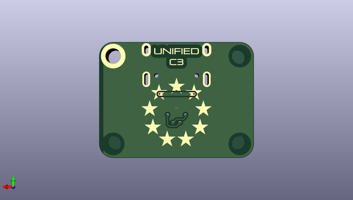

# unified_daughterboard
 
## summary 
* id: aaarsene_unified_daughterboard_unified_daughterboard
* user: aaarsene
* name: unified_daughterboard
* board: unified_daughterboard
* repo: https://github.com/aaarsene/Unified-Daughterboard
* src_file_repo_kicad_pcb: KiCad/C3/Unified-Daughterboard.kicad_pcb
* src_file_repo_kicad_pcb_link: https://github.com/aaarsene/Unified-Daughterboard/tree/master/KiCad/C3/Unified-Daughterboard.kicad_pcb

* src_file_repo_sch: KiCad/C3/Unified-Daughterboard.sch
* src_file_repo_sch_link: https://github.com/aaarsene/Unified-Daughterboard/tree/master/KiCad/C3/Unified-Daughterboard.sch
* full details link: https://github.com/oomlout/oomlout_oomp_project_bot_v_2/tree/main/projects/aaarsene_unified_daughterboard_unified_daughterboard/current_version/working  

## schematic  
  
[schematic (pdf)](working_schematic.pdf) 

## pcb  
 
  
  
  
[board (pdf)](working.pdf)  

## working_bom
| Id | Designator | Footprint | Quantity | Designation | Supplier and ref |  | None | 
| --- | --- | --- | --- | --- | --- | --- | --- | 
| 1 | J1 | TYPE-C-31-M-12 | 1 | TYPE-C-31-M12_13 |  |  | [''] | 
| 2 | J2 | JST-SR-4 | 1 | SM04B-SRSS-TB(LF)(SN) |  |  | [''] | 
| 3 | D1 | D_SOD-123_Bidirectional | 1 | SMF9.0CA |  |  | [''] | 
| 4 | F1 | Fuse_1206_3216Metric | 1 | ASMD1206-150 |  |  | [''] | 
| 5 | U1 | USON-10_2.5x1.0mm_P0.5mm | 1 | TPD4E05U06DQAR |  |  | [''] | 
| 6 | R2,R1 | R_0603 | 2 | 5.1k |  |  | [''] | 
| 7 | L1 | L_1206_3216Metric | 1 | 60R@100MHz |  |  | [''] | 
| 8 | G2 | Unified-Daughterboard-Name.pretty | 1 | Unified-Daughterboard-Name |  |  | [''] | 
| 9 | G1 | Unified-Daughterboard-Logo.pretty | 1 | Unified-Daughterboard-Logo |  |  | [''] | 

## bom_schematic
| Ref | Qnty | Value | Cmp name | Footprint | Description | Vendor | DNP | 
| --- | --- | --- | --- | --- | --- | --- | --- | 
| D1 | 1 | SMF9.0CA | D_TVS | acheron_Components:D_SOD-123_Bidirectional | Bidirectional transient-voltage-suppression diode |  |  | 
| F1 | 1 | ASMD1206-150 | Polyfuse | Fuse:Fuse_1206_3216Metric | Resettable fuse, polymeric positive temperature coefficient |  |  | 
| G1 | 1 | Unified-Daughterboard-Logo | MountingHole | Unified-Daughterboard-Logo:Unified-Daughterboard-Logo.pretty | Mounting Hole without connection |  |  | 
| G2 | 1 | Unified-Daughterboard-Name | MountingHole | Unified-Daughterboard-Logo:Unified-Daughterboard-Name.pretty | Mounting Hole without connection |  |  | 
| J1 | 1 | TYPE-C-31-M12_13 | TYPE-C-31-M12_13-acheronSymbols | acheron_Connectors:TYPE-C-31-M-12 |  |  |  | 
| J2 | 1 | SM04B-SRSS-TB(LF)(SN) | Conn_01x04 | random-keyboard-parts:JST-SR-4 | Generic connector, single row, 01x04, script generated (kicad-library-utils/schlib/autogen/connector/) |  |  | 
| L1 | 1 | 60R@100MHz | L_Core_Ferrite-Device | Inductor_SMD:L_1206_3216Metric |  |  |  | 
| MH1, MH2, MH3, MH4 | 4 | Mount-M2 | Conn_01x01 | random-keyboard-parts:Generic-Mounthole | Generic connector, single row, 01x01, script generated (kicad-library-utils/schlib/autogen/connector/) |  |  | 
| R1, R2 | 2 | 5.1k | R_Small | Resistors_SMD:R_0603 | Resistor, small symbol |  |  | 
| U1 | 1 | TPD4E05U06DQAR | TPD4E05U06DQAR-acheronSymbols | acheron_Components:USON-10_2.5x1.0mm_P0.5mm |  |  |  | 

