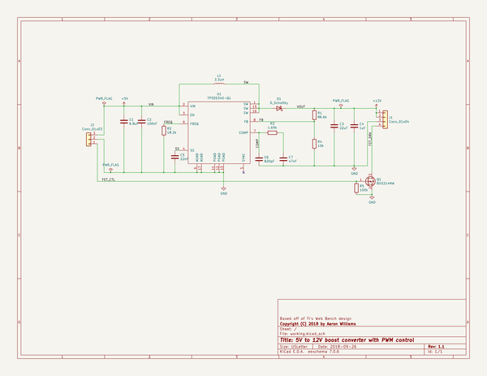
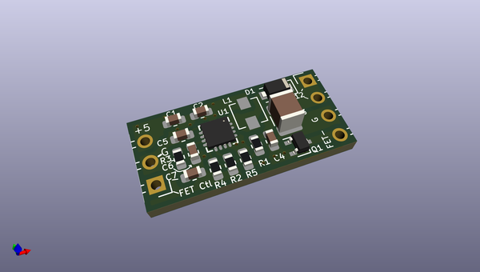
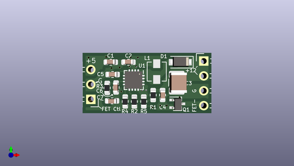
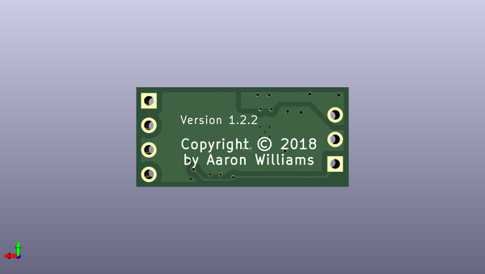

# 12v_boost_fan_control
 
## summary 
* id: aaronw2_12v_boost_fan_control_12v_booster
* user: aaronw2
* name: 12v_boost_fan_control
* board: 12v_booster
* repo: https://github.com/aaronw2/12v-Boost-Fan-Control
* src_file_repo_kicad_pcb: 12v-booster.kicad_pcb
* src_file_repo_kicad_pcb_link: https://github.com/aaronw2/12v-Boost-Fan-Control/tree/master/12v-booster.kicad_pcb

* src_file_repo_sch: 12v-booster.sch
* src_file_repo_sch_link: https://github.com/aaronw2/12v-Boost-Fan-Control/tree/master/12v-booster.sch
* full details link: https://github.com/oomlout/oomlout_oomp_project_bot_v_2/tree/main/projects/aaronw2_12v_boost_fan_control_12v_booster/current_version/working  

## schematic  
  
[schematic (pdf)](working_schematic.pdf)  

## pcb  
 
  
  
  
[board (pdf)](working.pdf)  

## working_bom
| Id | Designator | Footprint | Quantity | Designation | Supplier and ref |  | None | 
| --- | --- | --- | --- | --- | --- | --- | --- | 
| 1 | R1 | R_0603_1608Metric | 1 | 86.6k |  |  | [''] | 
| 2 | R2 | R_0603_1608Metric | 1 | 18.2k |  |  | [''] | 
| 3 | R3 | R_0603_1608Metric | 1 | 1.69k |  |  | [''] | 
| 4 | R4 | R_0603_1608Metric | 1 | 10k |  |  | [''] | 
| 5 | C3 | C_1210_3225Metric | 1 | 22uF |  |  | [''] | 
| 6 | C1 | C_0603_1608Metric | 1 | 6.8uF |  |  | [''] | 
| 7 | C2 | C_0603_1608Metric | 1 | 100nF |  |  | [''] | 
| 8 | C5 | C_0603_1608Metric | 1 | 22nF |  |  | [''] | 
| 9 | C6 | C_0603_1608Metric | 1 | 820pF |  |  | [''] | 
| 10 | C7 | C_0603_1608Metric | 1 | 47nF |  |  | [''] | 
| 11 | R5 | R_0603_1608Metric | 1 | 100k |  |  | [''] | 
| 12 | Q1 | SOT-323_SC-70 | 1 | BSS214NW |  |  | [''] | 
| 13 | U1 | QFN-16-1EP_3x3mm_P0.5mm_EP2.7x2.7mm_ThermalVias | 1 | TPS55340-Q1 |  |  | [''] | 
| 14 | D1 | D_SOD-123F | 1 | D_Schottky |  |  | [''] | 
| 15 | C4 | C_0603_1608Metric | 1 | 1uF |  |  | [''] | 
| 16 | J1 | PinHeader_1x04_P2.54mm_Horizontal | 1 | Conn_01x04 |  |  | [''] | 
| 17 | J2 | PinHeader_1x03_P2.54mm_Horizontal | 1 | Conn_01x03 |  |  | [''] | 
| 18 | L1 | L_Vishay_IHLP-1212 | 1 | 3.3uH |  |  | [''] | 

## bom_schematic
| Ref | Qnty | Value | Cmp name | Footprint | Description | Vendor | DNP | 
| --- | --- | --- | --- | --- | --- | --- | --- | 
| C1 | 1 | 6.8uF | C | Capacitor_SMD:C_0603_1608Metric | Unpolarized capacitor |  |  | 
| C2 | 1 | 100nF | C | Capacitor_SMD:C_0603_1608Metric | Unpolarized capacitor |  |  | 
| C3 | 1 | 22uF | C | Capacitor_SMD:C_1210_3225Metric | Unpolarized capacitor |  |  | 
| C4 | 1 | 1uF | C | Capacitor_SMD:C_0603_1608Metric | Unpolarized capacitor |  |  | 
| C5 | 1 | 22nF | C | Capacitor_SMD:C_0603_1608Metric | Unpolarized capacitor |  |  | 
| C6 | 1 | 820pF | C | Capacitor_SMD:C_0603_1608Metric | Unpolarized capacitor |  |  | 
| C7 | 1 | 47nF | C | Capacitor_SMD:C_0603_1608Metric | Unpolarized capacitor |  |  | 
| D1 | 1 | D_Schottky | D_Schottky | Diode_SMD:D_SOD-123F | Schottky diode |  |  | 
| J1 | 1 | Conn_01x04 | Conn_01x04 | Connector_PinHeader_2.54mm:PinHeader_1x04_P2.54mm_Horizontal | Generic connector, single row, 01x04, script generated (kicad-library-utils/schlib/autogen/connector/) |  |  | 
| J2 | 1 | Conn_01x03 | Conn_01x03 | Connector_PinHeader_2.54mm:PinHeader_1x03_P2.54mm_Horizontal | Generic connector, single row, 01x03, script generated (kicad-library-utils/schlib/autogen/connector/) |  |  | 
| L1 | 1 | 3.3uH | L | Aaron:L_Vishay_IHLP-1212 | Inductor |  |  | 
| Q1 | 1 | BSS214NW | BSS214NW | Package_TO_SOT_SMD:SOT-323_SC-70 | 20V Vds, 1.5A Id, N-Channel MOSFET, SOT-323 |  |  | 
| R1 | 1 | 86.6k | R | Resistor_SMD:R_0603_1608Metric | Resistor |  |  | 
| R2 | 1 | 18.2k | R | Resistor_SMD:R_0603_1608Metric | Resistor |  |  | 
| R3 | 1 | 1.69k | R | Resistor_SMD:R_0603_1608Metric | Resistor |  |  | 
| R4 | 1 | 10k | R | Resistor_SMD:R_0603_1608Metric | Resistor |  |  | 
| R5 | 1 | 100k | R | Resistor_SMD:R_0603_1608Metric | Resistor |  |  | 
| U1 | 1 | TPS55340-Q1 | TPS55340-Q1-texas | Aaron:QFN-16-1EP_3x3mm_P0.5mm_EP2.7x2.7mm_ThermalVias |  |  |  | 

