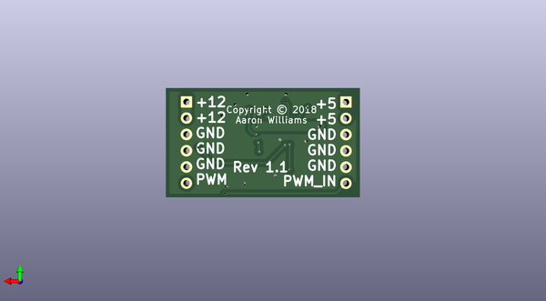

# 12v_booster_2
 
## summary 
* id: aaronw2_12v_booster_2_12v_booster_2
* user: aaronw2
* name: 12v_booster_2
* board: 12v_booster_2
* repo: https://github.com/aaronw2/12v-booster-2
* src_file_repo_kicad_pcb: 12v-booster-2.kicad_pcb
* src_file_repo_kicad_pcb_link: https://github.com/aaronw2/12v-booster-2/tree/master/12v-booster-2.kicad_pcb

* src_file_repo_sch: 12v-booster-2.sch
* src_file_repo_sch_link: https://github.com/aaronw2/12v-booster-2/tree/master/12v-booster-2.sch
* full details link: https://github.com/oomlout/oomlout_oomp_project_bot_v_2/tree/main/projects/aaronw2_12v_booster_2_12v_booster_2/current_version/working  

## schematic  
  
[schematic (pdf)](working_schematic.pdf) 

## pcb  
 
  
  
  
[board (pdf)](working.pdf)  

## working_bom
| Id | Designator | Footprint | Quantity | Designation | Supplier and ref |  | None | 
| --- | --- | --- | --- | --- | --- | --- | --- | 
| 1 | R4 | R_0603_1608Metric | 1 | 44.2K |  |  | [''] | 
| 2 | R3 | R_0603_1608Metric | 1 | 68.1K |  |  | [''] | 
| 3 | R2 | R_0603_1608Metric | 1 | 88.7K |  |  | [''] | 
| 4 | R1 | R_0603_1608Metric | 1 | 100K |  |  | [''] | 
| 5 | Q1 | SOT-323_SC-70 | 1 | BSS214NW |  |  | [''] | 
| 6 | C1,C10 | C_1206_3216Metric | 2 | 68uF |  |  | [''] | 
| 7 | C9,C7,C8 | C_0805_2012Metric | 3 | 22uF |  |  | [''] | 
| 8 | C4 | C_0603_1608Metric | 1 | 0.1uF |  |  | [''] | 
| 9 | C3 | C_0603_1608Metric | 1 | 680pF |  |  | [''] | 
| 10 | C2 | C_0603_1608Metric | 1 | 4.7uF |  |  | [''] | 
| 11 | Q2 | SOIC127P600X175-8N | 1 | Si4421DY |  |  | [''] | 
| 12 | L1 | L_Vishay_IHLP-2020 | 1 | 0.068uH |  |  | [''] | 
| 13 | R7 | R_0603_1608Metric | 1 | 80.6K |  |  | [''] | 
| 14 | R6 | R_0603_1608Metric | 1 | 732K |  |  | [''] | 
| 15 | J1,J2 | PinHeader_1x06_P2.54mm_Vertical | 2 | Conn_01x06 |  |  | [''] | 
| 16 | C5 | C_0603_1608Metric | 1 | 0.018uF |  |  | [''] | 
| 17 | R5 | R_0603_1608Metric | 1 | 162K |  |  | [''] | 
| 18 | C6 | C_0603_1608Metric | 1 | 3.3uF |  |  | [''] | 
| 19 | U1 | Texas_13_3.0x3.5mm_VQFN_Hotrod_Pitch_0.5mm | 1 | TPS611781RNW |  |  | [''] | 

## bom_schematic
| Ref | Qnty | Value | Cmp name | Footprint | Description | Vendor | DNP | 
| --- | --- | --- | --- | --- | --- | --- | --- | 
| C1, C10 | 2 | 68uF | C | Capacitor_SMD:C_1206_3216Metric | Unpolarized capacitor |  |  | 
| C2 | 1 | 4.7uF | C | Capacitor_SMD:C_0603_1608Metric | Unpolarized capacitor |  |  | 
| C3 | 1 | 680pF | C | Capacitor_SMD:C_0603_1608Metric | Unpolarized capacitor |  |  | 
| C4 | 1 | 0.1uF | C | Capacitor_SMD:C_0603_1608Metric | Unpolarized capacitor |  |  | 
| C5 | 1 | 0.018uF | C | Capacitor_SMD:C_0603_1608Metric | Unpolarized capacitor |  |  | 
| C6 | 1 | 3.3uF | C | Capacitor_SMD:C_0603_1608Metric | Unpolarized capacitor |  |  | 
| C7, C8, C9 | 3 | 22uF | C | Capacitor_SMD:C_0805_2012Metric | Unpolarized capacitor |  |  | 
| J1, J2 | 2 | Conn_01x06 | Conn_01x06 | Connector_PinHeader_2.54mm:PinHeader_1x06_P2.54mm_Vertical | Generic connector, single row, 01x06, script generated (kicad-library-utils/schlib/autogen/connector/) |  |  | 
| L1 | 1 | 0.068uH | L | Inductor_SMD:L_Vishay_IHLP-2020 | Inductor |  |  | 
| Q1 | 1 | BSS214NW | BSS214NW | Package_TO_SOT_SMD:SOT-323_SC-70 | 20V Vds, 1.5A Id, N-Channel MOSFET, SOT-323 |  |  | 
| Q2 | 1 | Si4421DY | Si4421DY-Aaron | Aaron:SOIC127P600X175-8N |  |  |  | 
| R1 | 1 | 100K | R | Resistor_SMD:R_0603_1608Metric | Resistor |  |  | 
| R2 | 1 | 88.7K | R | Resistor_SMD:R_0603_1608Metric | Resistor |  |  | 
| R3 | 1 | 68.1K | R | Resistor_SMD:R_0603_1608Metric | Resistor |  |  | 
| R4 | 1 | 44.2K | R | Resistor_SMD:R_0603_1608Metric | Resistor |  |  | 
| R5 | 1 | 162K | R | Resistor_SMD:R_0603_1608Metric | Resistor |  |  | 
| R6 | 1 | 732K | R | Resistor_SMD:R_0603_1608Metric | Resistor |  |  | 
| R7 | 1 | 80.6K | R | Resistor_SMD:R_0603_1608Metric | Resistor |  |  | 
| U1 | 1 | TPS611781RNW | TPS611781RNW-Aaron | Aaron:Texas_13_3.0x3.5mm_VQFN_Hotrod_Pitch_0.5mm |  |  |  | 

