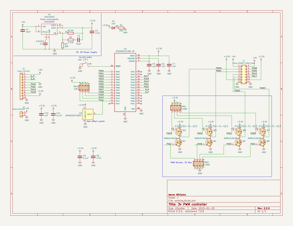

# 3v_pwm_controller
 
## summary 
* id: aaronw2_3v_pwm_controller_paw_controller
* user: aaronw2
* name: 3v_pwm_controller
* board: paw_controller
* repo: https://github.com/aaronw2/3v-pwm-controller
* src_file_repo_kicad_pcb: Paw-Controller.kicad_pcb
* src_file_repo_kicad_pcb_link: https://github.com/aaronw2/3v-pwm-controller/tree/master/Paw-Controller.kicad_pcb

* src_file_repo_sch: Paw-Controller.sch
* src_file_repo_sch_link: https://github.com/aaronw2/3v-pwm-controller/tree/master/Paw-Controller.sch
* full details link: https://github.com/oomlout/oomlout_oomp_project_bot_v_2/tree/main/projects/aaronw2_3v_pwm_controller_paw_controller/current_version/working  

## schematic  
  
[schematic (pdf)](working_schematic.pdf) 

## pcb  
 
  
  
  
[board (pdf)](working.pdf)  

## working_bom
| Id | Designator | Footprint | Quantity | Designation | Supplier and ref |  | None | 
| --- | --- | --- | --- | --- | --- | --- | --- | 
| 1 | RN1,RN2 | R_Array_Convex_4x0603 | 2 | 100K |  |  | [''] | 
| 2 | SW1 | SW_SPST_KMR2 | 1 | SW_SPST_KMR2 |  |  | [''] | 
| 3 | U3 | SOT-23 | 1 | DRV5032FCDBZT |  |  | [''] | 
| 4 | C9,C11 | C_0603_1608Metric | 2 | 0.1uF |  |  | [''] | 
| 5 | RN3 | R_Array_Convex_4x0603 | 1 | 10K |  |  | [''] | 
| 6 | C10,C6,C5,C7 | C_0603_1608Metric | 4 | 1uF |  |  | [''] | 
| 7 | R4 | R_0603_1608Metric | 1 | 330 |  |  | [''] | 
| 8 | D1 | LED_0603_1608Metric | 1 | LED |  |  | [''] | 
| 9 | U1 | TO-PMOD-7_TabPin4 | 1 | LMZ10503 |  |  | [''] | 
| 10 | R1 | R_0603_1608Metric | 1 | 82.5K |  |  | [''] | 
| 11 | R3 | R_0603_1608Metric | 1 | 30K |  |  | [''] | 
| 12 | C4 | C_0603_1608Metric | 1 | 0.022uF |  |  | [''] | 
| 13 | R2 | R_0603_1608Metric | 1 | 1.27K |  |  | [''] | 
| 14 | C3 | C_0603_1608Metric | 1 | 91pF |  |  | [''] | 
| 15 | U2 | QFN-32-1EP_5x5mm_P0.5mm_EP3.6x3.6mm | 1 | ATSAMD21E18A-AF |  |  | [''] | 
| 16 | Q2,Q1,Q3,Q8 | SOT-23 | 4 | DMN1019USN |  |  | [''] | 
| 17 | C2,C8 | C_0805_2012Metric | 2 | 47uF |  |  | [''] | 
| 18 | J3 | PinHeader_1x02_P2.54mm_Vertical | 1 | Conn_01x02 |  |  | [''] | 
| 19 | C1 | C_0805_2012Metric | 1 | 22uF |  |  | [''] | 
| 20 | Q4,Q5,Q6,Q7 | TSOP-6_1.65x3.05mm_P0.95mm | 4 | SI3407DV-T1-GE3 |  |  | [''] | 
| 21 | J1 | PinHeader_2x07_P2.54mm_Vertical | 1 | Conn_02x07_Odd_Even |  |  | [''] | 
| 22 | J2 | PinHeader_1x10_P2.54mm_Vertical | 1 | Conn_01x10 |  |  | [''] | 

## bom_schematic
| Ref | Qnty | Value | Cmp name | Footprint | Description | Vendor | DNP | 
| --- | --- | --- | --- | --- | --- | --- | --- | 
| C1 | 1 | 22uF | C | Capacitor_SMD:C_0805_2012Metric | Unpolarized capacitor |  |  | 
| C2, C8 | 2 | 47uF | C | Capacitor_SMD:C_0805_2012Metric | Unpolarized capacitor |  |  | 
| C3 | 1 | 91pF | C | Capacitor_SMD:C_0603_1608Metric | Unpolarized capacitor |  |  | 
| C4 | 1 | 0.022uF | C | Capacitor_SMD:C_0603_1608Metric | Unpolarized capacitor |  |  | 
| C5, C6, C7, C10 | 4 | 1uF | C | Capacitor_SMD:C_0603_1608Metric | Unpolarized capacitor |  |  | 
| C9, C11 | 2 | 0.1uF | C | Capacitor_SMD:C_0603_1608Metric | Unpolarized capacitor |  |  | 
| D1 | 1 | LED | LED | LED_SMD:LED_0603_1608Metric | Light emitting diode |  |  | 
| J1 | 1 | Conn_02x07_Odd_Even | Conn_02x07_Odd_Even | Connector_PinHeader_2.54mm:PinHeader_2x07_P2.54mm_Vertical | Generic connector, double row, 02x07, odd/even pin numbering scheme (row 1 odd numbers, row 2 even numbers), script generated (kicad-library-utils/schlib/autogen/connector/) |  |  | 
| J2 | 1 | Conn_01x10 | Conn_01x10 | Connector_PinHeader_2.54mm:PinHeader_1x10_P2.54mm_Vertical | Generic connector, single row, 01x10, script generated (kicad-library-utils/schlib/autogen/connector/) |  |  | 
| J3 | 1 | Conn_01x02 | Conn_01x02 | Connector_PinHeader_2.54mm:PinHeader_1x02_P2.54mm_Vertical | Generic connector, single row, 01x02, script generated (kicad-library-utils/schlib/autogen/connector/) |  |  | 
| Q1, Q2, Q3, Q8 | 4 | DMN1019USN | DMN1019USN-Aaron | Package_TO_SOT_SMD:SOT-23 |  |  |  | 
| Q4, Q5, Q6, Q7 | 4 | SI3407DV-T1-GE3 | SI3407DV-T1-GE3-Aaron | Package_SO:TSOP-6_1.65x3.05mm_P0.95mm |  |  |  | 
| R1 | 1 | 82.5K | R | Resistor_SMD:R_0603_1608Metric | Resistor |  |  | 
| R2 | 1 | 1.27K | R | Resistor_SMD:R_0603_1608Metric | Resistor |  |  | 
| R3 | 1 | 30K | R | Resistor_SMD:R_0603_1608Metric | Resistor |  |  | 
| R4 | 1 | 330 | R | Resistor_SMD:R_0603_1608Metric | Resistor |  |  | 
| RN1, RN2 | 2 | 100K | R_Pack04-device | Resistor_SMD:R_Array_Convex_4x0603 |  |  |  | 
| RN3 | 1 | 10K | R_Pack04-device | Resistor_SMD:R_Array_Convex_4x0603 |  |  |  | 
| SW1 | 1 | SW_SPST_KMR2 | SW_SPST_KMR2-switch_tact_smt | Aaron:SW_SPST_KMR2 |  |  |  | 
| U1 | 1 | LMZ10503 | LMZ10503-Aaron | Aaron:TO-PMOD-7_TabPin4 |  |  |  | 
| U2 | 1 | ATSAMD21E18A-AF | ATSAMD21E18A-AF-Aaron | Package_DFN_QFN:QFN-32-1EP_5x5mm_P0.5mm_EP3.6x3.6mm |  |  |  | 
| U3 | 1 | DRV5032FCDBZT | DRV5032FCDBZT-Aaron | Package_TO_SOT_SMD:SOT-23 |  |  |  | 

