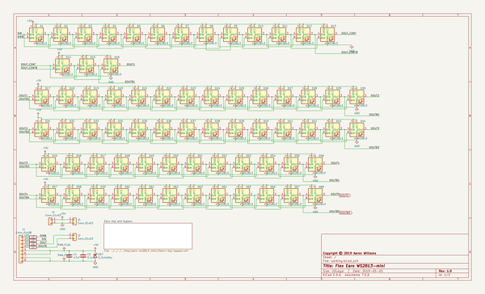
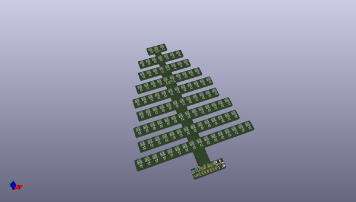
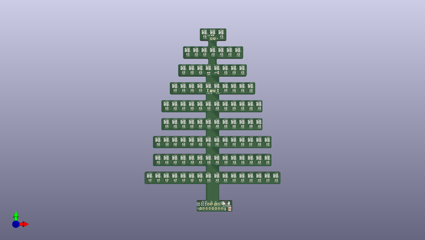
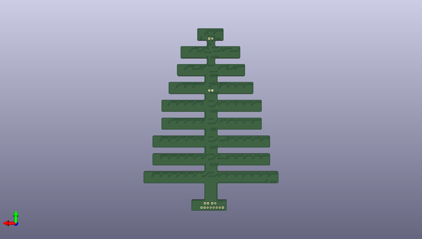

# ears_ws2813_mini
 
## summary 
* id: aaronw2_ears_ws2813_mini_ears_ws2813_mini
* user: aaronw2
* name: ears_ws2813_mini
* board: ears_ws2813_mini
* repo: https://github.com/aaronw2/ears-ws2813-mini
* src_file_repo_kicad_pcb: ears-ws2813-mini.kicad_pcb
* src_file_repo_kicad_pcb_link: https://github.com/aaronw2/ears-ws2813-mini/tree/master/ears-ws2813-mini.kicad_pcb

* src_file_repo_sch: ears-ws2813-mini.sch
* src_file_repo_sch_link: https://github.com/aaronw2/ears-ws2813-mini/tree/master/ears-ws2813-mini.sch
* full details link: https://github.com/oomlout/oomlout_oomp_project_bot_v_2/tree/main/projects/aaronw2_ears_ws2813_mini_ears_ws2813_mini/current_version/working  

## schematic  
  
[schematic (pdf)](working_schematic.pdf) 

## pcb  
 
  
  
  
[board (pdf)](working.pdf)  

## working_bom
| Id | Designator | Footprint | Quantity | Designation | Supplier and ref |  | None | 
| --- | --- | --- | --- | --- | --- | --- | --- | 
| 1 | D96,D95,D94,D93,D92,D91,D90,D89,D88,D87,D86,D85,D84,D83,D82,D81,D80,D78,D77,D76,D75,D74,D73,D72,D71,D70,D69,D68,D67,D66,D65,D64,D63,D62,D61,D60,D59,D58,D57,D56,D55,D54,D53,D52,D51,D50,D49,D48,D47,D46,D45,D44,D28,D27,D26,D25,D24,D23,D22,D21,D20,D19,D18,D17,D16,D15,D79,D14,D13,D12,D11,D10,D9,D8,D7,D31,D6,D30,D5,D4,D3,D2,D1,D43,D42,D41,D40,D39,D38,D37,D29,D36,D35,D34,D33,D32 | LED_WS2813-MINI | 96 | WS2813 |  |  | [''] | 
| 2 | C36,C35,C34,C33,C32,C31,C30,C29,C28,C27,C26,C25,C24,C23,C22,C21,C20,C19,C18,C17,C11,C98,C97,C96,C95,C94,C93,C92,C91,C90,C89,C88,C87,C86,C85,C84,C83,C82,C81,C80,C79,C73,C72,C71,C70,C69,C68,C67,C66,C65,C64,C63,C62,C61,C60,C59,C58,C57,C56,C55,C54,C53,C50,C49,C48,C47,C46,C45,C44,C43,C42,C41,C40,C39,C38,C37,C8,C13,C12,C7,C15,C14,C9,C4,C3,C78,C77,C76,C75,C74,C10,C5,C6,C16,C51,C52 | C_0603_1608Metric | 96 | 1uF |  |  | [''] | 
| 3 | J3,J5,J2,J4 | PinHeader_1x02_P2.54mm_Vertical | 4 | Conn_01x02 |  |  | [''] | 
| 4 | R1,R2,R4,R3 | R_0603_1608Metric | 4 | 22 |  |  | [''] | 
| 5 | J1 | PinHeader_1x08_P2.54mm_Vertical | 1 | Conn_01x08 |  |  | [''] | 
| 6 | C1 | C_1210_3225Metric | 1 | 47uF |  |  | [''] | 
| 7 | C2 | C_0603_1608Metric | 1 | 0.1uF |  |  | [''] | 
| 8 | D97 | D_2010_5025Metric | 1 | D_Schottky |  |  | [''] | 

## bom_schematic
| Ref | Qnty | Value | Cmp name | Footprint | Description | Vendor | DNP | 
| --- | --- | --- | --- | --- | --- | --- | --- | 
| C1 | 1 | 47uF | C | Capacitor_SMD:C_1210_3225Metric | Unpolarized capacitor |  |  | 
| C2 | 1 | 0.1uF | C | Capacitor_SMD:C_0603_1608Metric | Unpolarized capacitor |  |  | 
| D1, D2, D3, D4, D5, D6, D7, D8, D9, D10, D11, D12, D13, D14, D15, D16, D17, D18, D19, D20, D21, D22, D23, D24, D25, D26, D27, D28, D29, D30, D31, D32, D33, D34, D35, D36, D37, D38, D39, D40, D41, D42, D43, D44, D45, D46, D47, D48, D49, D50, D51, D52, D53, D54, D55, D56, D57, D58, D59, D60, D61, D62, D63, D64, D65, D66, D67, D68 | 68 | WS2813 | WS2813 | LED_WS2813-mini:LED_WS2813-MINI | RGB LED with integrated controller |  |  | 
| D97 | 1 | D_Schottky | D_Schottky | Diode_SMD:D_2010_5025Metric | Schottky diode |  |  | 
| J1 | 1 | Conn_01x08 | Conn_01x08 | Connector_PinHeader_2.54mm:PinHeader_1x08_P2.54mm_Vertical | Generic connector, single row, 01x08, script generated (kicad-library-utils/schlib/autogen/connector/) |  |  | 
| J2, J4, J5 | 3 | Conn_01x02 | Conn_01x02 | Connector_PinHeader_2.54mm:PinHeader_1x02_P2.54mm_Vertical | Generic connector, single row, 01x02, script generated (kicad-library-utils/schlib/autogen/connector/) |  |  | 
| R1, R2, R3, R4 | 4 | 22 | R | Resistor_SMD:R_0603_1608Metric | Resistor |  |  | 

