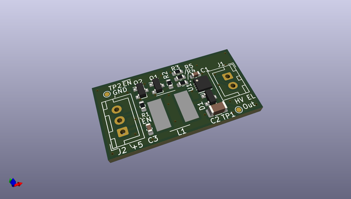
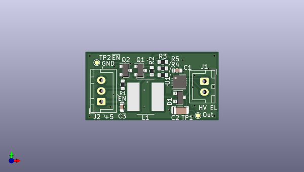
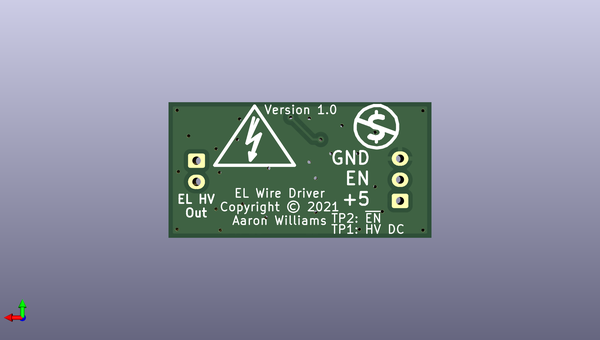

# el_driver_3
 
## summary 
* id: aaronw2_el_driver_3_el_4
* user: aaronw2
* name: el_driver_3
* board: el_4
* repo: https://github.com/aaronw2/el-driver-3
* src_file_repo_kicad_pcb: EL-4.kicad_pcb
* src_file_repo_kicad_pcb_link: https://github.com/aaronw2/el-driver-3/tree/main/EL-4.kicad_pcb

* src_file_repo_sch: EL-4.sch
* src_file_repo_sch_link: https://github.com/aaronw2/el-driver-3/tree/main/EL-4.sch
* full details link: https://github.com/oomlout/oomlout_oomp_project_bot_v_2/tree/main/projects/aaronw2_el_driver_3_el_4/current_version/working  

## schematic  
  
[schematic (pdf)](working_schematic.pdf)  

## pcb  
 
  
  
  
[board (pdf)](working.pdf)  

## working_bom
| Id | Designator | Footprint | Quantity | Designation | Supplier and ref |  | None | 
| --- | --- | --- | --- | --- | --- | --- | --- | 
| 1 | C1 | C_0603_1608Metric | 1 | 2.2uF |  |  | [''] | 
| 2 | C2 | C_1206_3216Metric | 1 | 0.015uF 250V |  |  | [''] | 
| 3 | D1 | SOT-23 | 1 | BAS20 |  |  | [''] | 
| 4 | J1 | JST_XH_B2B-XH-A_1x02_P2.50mm_Vertical | 1 | Conn_01x02 |  |  | [''] | 
| 5 | R1,R2 | R_0603_1608Metric | 2 | 1M |  |  | [''] | 
| 6 | R3 | R_0603_1608Metric | 1 | 309K |  |  | [''] | 
| 7 | R4 | R_0603_1608Metric | 1 | 1.69M |  |  | [''] | 
| 8 | U1 | DFN-8-1EP_3x3mm_P0.5mm_EP1.66x2.38mm | 1 | MIC4832 |  |  | [''] | 
| 9 | L1 | L_Bourns_SRN8040TA | 1 | 220uH |  |  | [''] | 
| 10 | J2 | JST_XH_B3B-XH-A_1x03_P2.50mm_Vertical | 1 | Conn_01x03 |  |  | [''] | 
| 11 | Q1,Q2 | SOT-23 | 2 | BSS138 |  |  | [''] | 
| 12 | R5 | R_0603_1608Metric | 1 | 1K |  |  | [''] | 
| 13 | C3 | C_0603_1608Metric | 1 | 10uF |  |  | [''] | 

## bom_schematic
no data

