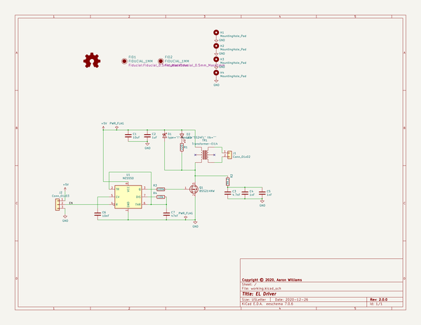
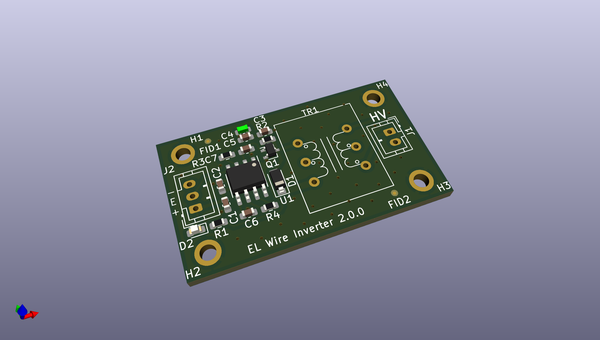
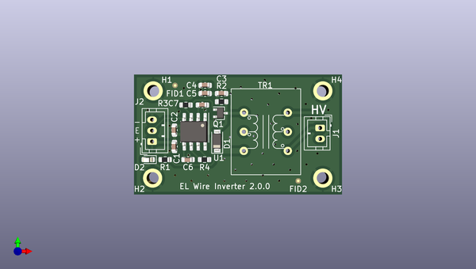
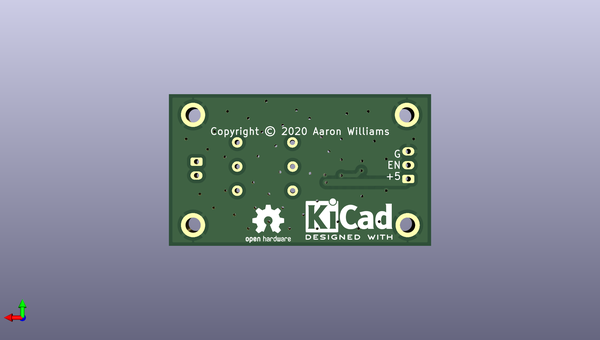

# el_driver
 
## summary 
* id: aaronw2_el_driver_el_driver
* user: aaronw2
* name: el_driver
* board: el_driver
* repo: https://github.com/aaronw2/el-driver
* src_file_repo_kicad_pcb: el-driver.kicad_pcb
* src_file_repo_kicad_pcb_link: https://github.com/aaronw2/el-driver/tree/main/el-driver.kicad_pcb

* src_file_repo_sch: el-driver.sch
* src_file_repo_sch_link: https://github.com/aaronw2/el-driver/tree/main/el-driver.sch
* full details link: https://github.com/oomlout/oomlout_oomp_project_bot_v_2/tree/main/projects/aaronw2_el_driver_el_driver/current_version/working  

## schematic  
  
[schematic (pdf)](working_schematic.pdf) 

## pcb  
 
  
  
  
[board (pdf)](working.pdf)  

## working_bom
| Id | Designator | Footprint | Quantity | Designation | Supplier and ref |  | None | 
| --- | --- | --- | --- | --- | --- | --- | --- | 
| 1 | C1 | C_0603_1608Metric | 1 | 10uF |  |  | [''] | 
| 2 | C2 | C_0603_1608Metric | 1 | 1uF |  |  | [''] | 
| 3 | C3 | C_0603_1608Metric | 1 | 4.7nF |  |  | [''] | 
| 4 | C5,C4 | C_0603_1608Metric | 2 | 1nF |  |  | [''] | 
| 5 | C6 | C_0603_1608Metric | 1 | 10nF |  |  | [''] | 
| 6 | C7 | C_0603_1608Metric | 1 | 47nF |  |  | [''] | 
| 7 | D1 | D_SOD-123 | 1 | SS24FL |  |  | [''] | 
| 8 | D2 | LED_0603_1608Metric | 1 | LED |  |  | [''] | 
| 9 | FID1,FID2 | Fiducial_0.5mm_Mask1mm | 2 | FIDUCIAL_1MM |  |  | [''] | 
| 10 | J1 | JST_PH_B2B-PH-K_1x02_P2.00mm_Vertical | 1 | Conn_01x02 |  |  | [''] | 
| 11 | J2 | JST_PH_B3B-PH-K_1x03_P2.00mm_Vertical | 1 | Conn_01x03 |  |  | [''] | 
| 12 | Q1 | SOT-323_SC-70 | 1 | BSS214NW |  |  | [''] | 
| 13 | R1 | R_0603_1608Metric | 1 | 220 |  |  | [''] | 
| 14 | R2 | R_0603_1608Metric | 1 | 39.2 |  |  | [''] | 
| 15 | R3 | R_0603_1608Metric | 1 | 100k |  |  | [''] | 
| 16 | R4 | R_0603_1608Metric | 1 | 10k |  |  | [''] | 
| 17 | TR1 | Transformer_42XL_EI-14 | 1 | Transformer-EI14 |  |  | [''] | 
| 18 | U1 | SOIC-8_3.9x4.9mm_P1.27mm | 1 | NE555D |  |  | [''] | 

## bom_schematic
| Ref | Qnty | Value | Cmp name | Footprint | Description | Vendor | DNP | 
| --- | --- | --- | --- | --- | --- | --- | --- | 
| C1 | 1 | 10uF | C | Capacitor_SMD:C_0603_1608Metric | Unpolarized capacitor |  |  | 
| C2 | 1 | 1uF | C | Capacitor_SMD:C_0603_1608Metric | Unpolarized capacitor |  |  | 
| C3 | 1 | 4.7nF | C | Capacitor_SMD:C_0603_1608Metric | Unpolarized capacitor |  |  | 
| C4, C5 | 2 | 1nF | C | Capacitor_SMD:C_0603_1608Metric | Unpolarized capacitor |  |  | 
| C6 | 1 | 10nF | C | Capacitor_SMD:C_0603_1608Metric | Unpolarized capacitor |  |  | 
| C7 | 1 | 47nF | C | Capacitor_SMD:C_0603_1608Metric | Unpolarized capacitor |  |  | 
| D1 | 1 | type="I" model="SS24FL" lib="" | SS24FL-Aaron | Diode_SMD:D_SOD-123 |  |  |  | 
| D2 | 1 | LED | LED | LED_SMD:LED_0603_1608Metric | Light emitting diode |  |  | 
| FID1, FID2 | 2 | FIDUCIAL_1MM | FIDUCIAL_1MM-fiducial | Fiducial:Fiducial_0.5mm_Mask1mm |  |  |  | 
| H1, H2, H3, H4 | 4 | MountingHole_Pad | MountingHole_Pad | MountingHole:MountingHole_2.2mm_M2_ISO7380_Pad | Mounting Hole with connection |  |  | 
| J1 | 1 | Conn_01x02 | Conn_01x02 | Connector_JST:JST_PH_B2B-PH-K_1x02_P2.00mm_Vertical | Generic connector, single row, 01x02, script generated (kicad-library-utils/schlib/autogen/connector/) |  |  | 
| J2 | 1 | Conn_01x03 | Conn_01x03 | Connector_JST:JST_PH_B3B-PH-K_1x03_P2.00mm_Vertical | Generic connector, single row, 01x03, script generated (kicad-library-utils/schlib/autogen/connector/) |  |  | 
| Q1 | 1 | BSS214NW | BSS214NW | Package_TO_SOT_SMD:SOT-323_SC-70 | 20V Vds, 1.5A Id, N-Channel MOSFET, SOT-323 |  |  | 
| R1 | 1 | 220 | R | Resistor_SMD:R_0603_1608Metric | Resistor |  |  | 
| R2 | 1 | 39.2 | R | Resistor_SMD:R_0603_1608Metric | Resistor |  |  | 
| R3 | 1 | 100k | R | Resistor_SMD:R_0603_1608Metric | Resistor |  |  | 
| R4 | 1 | 10k | R | Resistor_SMD:R_0603_1608Metric | Resistor |  |  | 
| TR1 | 1 | Transformer-EI14 | Transformer-EI14-Aaron | Aaron:Transformer_42XL_EI-14 |  |  |  | 
| U1 | 1 | NE555D | NE555D | Package_SO:SOIC-8_3.9x4.9mm_P1.27mm | Precision Timers, 555 compatible, SOIC-8 |  |  | 

