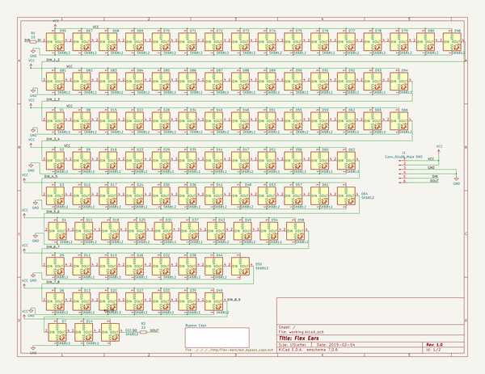
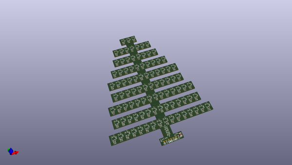
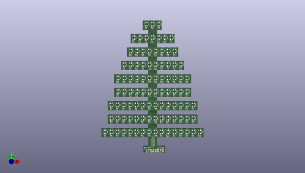
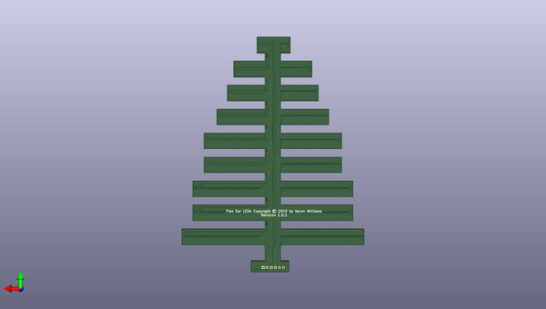

# flex_ears
 
## summary 
* id: aaronw2_flex_ears_ears
* user: aaronw2
* name: flex_ears
* board: ears
* repo: https://github.com/aaronw2/Flex-ears
* src_file_repo_kicad_pcb: Ears.kicad_pcb
* src_file_repo_kicad_pcb_link: https://github.com/aaronw2/Flex-ears/tree/master/Ears.kicad_pcb

* src_file_repo_sch: Ears.sch
* src_file_repo_sch_link: https://github.com/aaronw2/Flex-ears/tree/master/Ears.sch
* full details link: https://github.com/oomlout/oomlout_oomp_project_bot_v_2/tree/main/projects/aaronw2_flex_ears_ears/current_version/working  

## schematic  
  
[schematic (pdf)](working_schematic.pdf)  

## pcb  
 
  
  
  
[board (pdf)](working.pdf)  

## working_bom
| Id | Designator | Footprint | Quantity | Designation | Supplier and ref |  | None | 
| --- | --- | --- | --- | --- | --- | --- | --- | 
| 1 | C76,C78,C73,C92,C84,C88,C93,C74,C95,C94,C72,C82,C75,C81,C90,C87,C86,C98,C77,C80,C85,C52,C36,C43,C67,C35,C79,C14,C13,C6,C12,C20,C42,C41,C5,C7,C66,C60,C91,C45,C44,C22,C16,C83,C97,C96,C89,C38,C37,C40,C8,C9,C11,C59,C58,C10,C30,C24,C23,C3,C26,C19,C63,C62,C1,C4,C33,C32,C27,C29,C50,C49,C21,C2,C65,C64,C18,C17,C71,C39,C15,C55,C47,C46,C54,C53,C61,C51,C57,C56,C48,C100,C68,C69,C70,C99 | C_0603_1608Metric | 96 | 1uF |  |  | [''] | 
| 2 | C25 | C_0603_1608Metric | 1 | 10uF |  |  | [''] | 
| 3 | R1,R2 | R_0603_1608Metric | 2 | 22 |  |  | [''] | 
| 4 | J1 | Pin_Header_Angled_1x06_Pitch2.54mm | 1 | Conn_01x06_Male |  |  | [''] | 
| 5 | C28 | C_1210_3225Metric_Pad1.42x2.65mm_HandSolder | 1 | 100uF 10V |  |  | [''] | 
| 6 | D95,D70,D68,D67,D85,D94,D93,D92,D91,D90,D89,D88,D87,D86,D73,D84,D83,D82,D81,D80,D79,D78,D77,D76,D75,D74,D72,D60,D71,D69,D66,D65,D64,D63,D62,D49,D96,D59,D58,D57,D56,D55,D54,D53,D52,D51,D50,D61,D35,D47,D46,D45,D44,D43,D42,D41,D40,D39,D38,D37,D36,D2,D34,D33,D32,D31,D30,D29,D28,D27,D48,D26,D24,D12,D23,D22,D21,D20,D19,D18,D17,D16,D15,D14,D25,D11,D10,D9,D8,D7,D6,D5,D4,D3,D1,D13 | LED_SK6812MINI_PLCC4_3.5x3.5mm_P1.75mm | 96 | SK6812 |  |  | [''] | 

## bom_schematic
| Ref | Qnty | Value | Cmp name | Footprint | Description | Vendor | DNP | 
| --- | --- | --- | --- | --- | --- | --- | --- | 
| D1, D2, D3, D4, D5, D6, D7, D8, D9, D10, D11, D12, D13, D14, D15, D16, D17, D18, D19, D20, D21, D22, D23, D24, D25, D26, D27, D28, D29, D30, D31, D32, D33, D34, D35, D36, D37, D38, D39, D40, D41, D42, D43, D44, D45, D46, D47, D48, D49, D50, D51, D52, D53, D54, D55, D56, D57, D58, D59, D60, D61, D62, D63, D64, D65, D66, D67, D68, D69, D70, D71, D72, D73, D74, D75, D76, D77, D78, D79, D80, D81, D82, D83, D84, D85, D86, D87, D88, D89, D90, D91, D92, D93, D94, D95, D96 | 96 | SK6812 | SK6812 | LED_SMD:LED_SK6812MINI_PLCC4_3.5x3.5mm_P1.75mm | RGB LED with integrated controller |  |  | 
| J1 | 1 | Conn_01x06_Male DNS | Conn_01x06_Male-Connector | Pin_Headers:Pin_Header_Angled_1x06_Pitch2.54mm |  |  |  | 
| R1, R2 | 2 | 22 | R_Small | Resistor_SMD:R_0603_1608Metric | Resistor, small symbol |  |  | 

