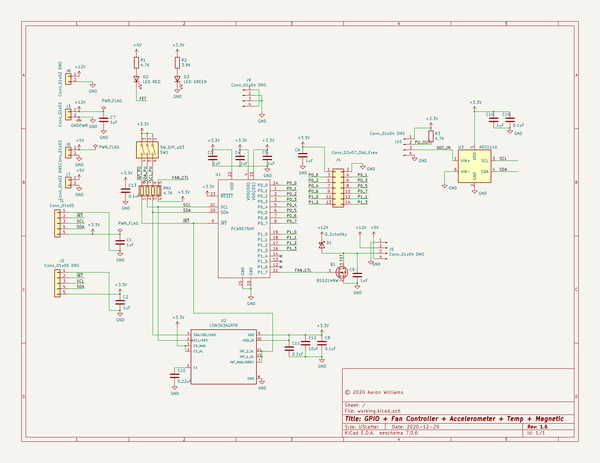
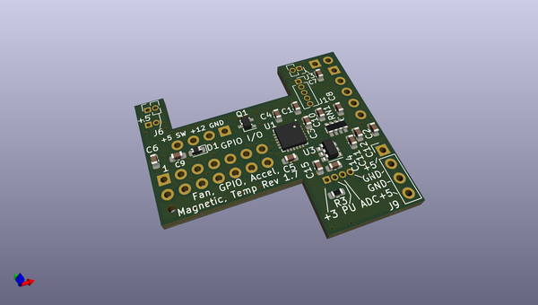
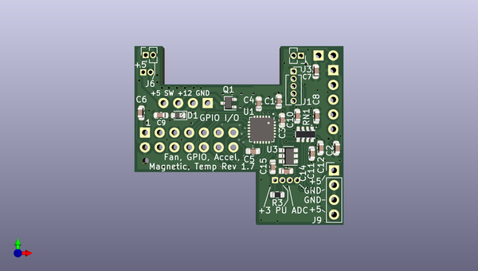
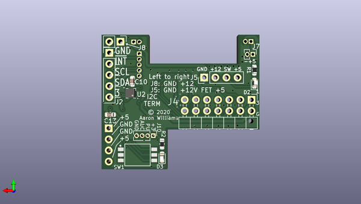

# led_controller_gpio
 
## summary 
* id: aaronw2_led_controller_gpio_gpio_fan
* user: aaronw2
* name: led_controller_gpio
* board: gpio_fan
* repo: https://github.com/aaronw2/led-controller-gpio
* src_file_repo_kicad_pcb: gpio-fan.kicad_pcb
* src_file_repo_kicad_pcb_link: https://github.com/aaronw2/led-controller-gpio/tree/master/gpio-fan.kicad_pcb

* src_file_repo_sch: gpio-fan.sch
* src_file_repo_sch_link: https://github.com/aaronw2/led-controller-gpio/tree/master/gpio-fan.sch
* full details link: https://github.com/oomlout/oomlout_oomp_project_bot_v_2/tree/main/projects/aaronw2_led_controller_gpio_gpio_fan/current_version/working  

## schematic  
  
[schematic (pdf)](working_schematic.pdf) 

## pcb  
 
  
  
  
[board (pdf)](working.pdf)  

## working_bom
| Id | Designator | Footprint | Quantity | Designation | Supplier and ref |  | None | 
| --- | --- | --- | --- | --- | --- | --- | --- | 
| 1 | C5,C6,C3,C4,C2,C7,C1,C9,C14 | C_0603_1608Metric | 9 | 1uF |  |  | [''] | 
| 2 | J1 | PinSocket_1x05_P1.27mm_Vertical | 1 | Conn_01x05 |  |  | [''] | 
| 3 | Q1 | SOT-323_SC-70 | 1 | BSS214NW |  |  | [''] | 
| 4 | U1 | Texas_S-PVQFN-N24_EP2.1x2.1mm | 1 | PCA9575HF |  |  | [''] | 
| 5 | J3,J6 | PinSocket_1x02_P1.27mm_Vertical | 2 | Conn_01x02 |  |  | [''] | 
| 6 | RN1 | R_Array_Convex_4x0603 | 1 | 4.7K |  |  | [''] | 
| 7 | D1 | D_0603_1608Metric | 1 | D_Schottky |  |  | [''] | 
| 8 | C10 | C_0603_1608Metric | 1 | 0.01uF |  |  | [''] | 
| 9 | C11,C8,C15,C13 | C_0603_1608Metric | 4 | 0.1uF |  |  | [''] | 
| 10 | C12 | C_0603_1608Metric | 1 | 10uF |  |  | [''] | 
| 11 | J9,J5 | PinHeader_1x04_P2.54mm_Vertical | 2 | Conn_01x04 DNS |  |  | [''] | 
| 12 | U3 | SOT-23-6 | 1 | ADS1110 |  |  | [''] | 
| 13 | R3 | R_0603_1608Metric | 1 | 4.7K |  |  | [''] | 
| 14 | J2 | PinHeader_1x05_P2.54mm_Vertical | 1 | Conn_01x05 DNS |  |  | [''] | 
| 15 | J4 | PinHeader_2x07_P2.54mm_Horizontal | 1 | Conn_02x07_Odd_Even |  |  | [''] | 
| 16 | J7 | PinHeader_1x02_P1.27mm_Vertical | 1 | Conn_01x02 DNS |  |  | [''] | 
| 17 | SW1 | SW_DIP_SPSTx03_Slide_Wurth_416131160803_8.89x4.98mm_W2.65mm_P1.27mm | 1 | SW_DIP_x03 |  |  | [''] | 
| 18 | J8 | PinHeader_1x02_P2.54mm_Vertical | 1 | Conn_01x02 DNS |  |  | [''] | 
| 19 | D2 | LED_0603_1608Metric | 1 | LED RED |  |  | [''] | 
| 20 | R1 | R_0603_1608Metric | 1 | 1K |  |  | [''] | 
| 21 | D3 | LED_0603_1608Metric | 1 | LED GREEN |  |  | [''] | 
| 22 | R2 | R_0603_1608Metric | 1 | 100 |  |  | [''] | 
| 23 | C10 | C_0603_1608Metric | 1 | 0.22uF |  |  | [''] | 
| 24 | U2 | LGA-12_2x2mm_P0.5mm | 1 | LSM303AGRTR |  |  | [''] | 
| 25 | J10 | PinHeader_1x04_P1.27mm_Vertical | 1 | Conn_01x04 DNS |  |  | [''] | 

## bom_schematic
| Ref | Qnty | Value | Cmp name | Footprint | Description | Vendor | DNP | 
| --- | --- | --- | --- | --- | --- | --- | --- | 
| C1, C2, C3, C4, C5, C6, C7, C9, C14 | 9 | 1uF | C | Capacitor_SMD:C_0603_1608Metric | Unpolarized capacitor |  |  | 
| C8, C11, C13, C15 | 4 | 0.1uF | C | Capacitor_SMD:C_0603_1608Metric | Unpolarized capacitor |  |  | 
| C10 | 1 | 0.22uF | C | Capacitor_SMD:C_0603_1608Metric | Unpolarized capacitor |  |  | 
| C12 | 1 | 10uF | C | Capacitor_SMD:C_0603_1608Metric | Unpolarized capacitor |  |  | 
| D1 | 1 | D_Schottky | D_Schottky | Diode_SMD:D_0603_1608Metric | Schottky diode |  |  | 
| D2 | 1 | LED RED | LED | LED_SMD:LED_0603_1608Metric | Light emitting diode |  |  | 
| D3 | 1 | LED GREEN | LED | LED_SMD:LED_0603_1608Metric | Light emitting diode |  |  | 
| J1 | 1 | Conn_01x05 | Conn_01x05 | Connector_PinSocket_1.27mm:PinSocket_1x05_P1.27mm_Vertical | Generic connector, single row, 01x05, script generated (kicad-library-utils/schlib/autogen/connector/) |  |  | 
| J2 | 1 | Conn_01x05 DNS | Conn_01x05 | Connector_PinHeader_2.54mm:PinHeader_1x05_P2.54mm_Vertical | Generic connector, single row, 01x05, script generated (kicad-library-utils/schlib/autogen/connector/) |  |  | 
| J3, J6 | 2 | Conn_01x02 | Conn_01x02 | Connector_PinSocket_1.27mm:PinSocket_1x02_P1.27mm_Vertical | Generic connector, single row, 01x02, script generated (kicad-library-utils/schlib/autogen/connector/) |  |  | 
| J4 | 1 | Conn_02x07_Odd_Even | Conn_02x07_Odd_Even | Connector_PinHeader_2.54mm:PinHeader_2x07_P2.54mm_Horizontal | Generic connector, double row, 02x07, odd/even pin numbering scheme (row 1 odd numbers, row 2 even numbers), script generated (kicad-library-utils/schlib/autogen/connector/) |  |  | 
| J5, J9 | 2 | Conn_01x04 DNS | Conn_01x04_Male-Connector | Connector_PinHeader_2.54mm:PinHeader_1x04_P2.54mm_Vertical |  |  |  | 
| J7 | 1 | Conn_01x02 DNS | Conn_01x02 | Connector_PinHeader_1.27mm:PinHeader_1x02_P1.27mm_Vertical | Generic connector, single row, 01x02, script generated (kicad-library-utils/schlib/autogen/connector/) |  |  | 
| J8 | 1 | Conn_01x02 DNS | Conn_01x02 | Connector_PinHeader_2.54mm:PinHeader_1x02_P2.54mm_Vertical | Generic connector, single row, 01x02, script generated (kicad-library-utils/schlib/autogen/connector/) |  |  | 
| J10 | 1 | Conn_01x04 DNS | Conn_01x04_Male-Connector | Connector_PinHeader_1.27mm:PinHeader_1x04_P1.27mm_Vertical |  |  |  | 
| Q1 | 1 | BSS214NW | BSS214NW | Package_TO_SOT_SMD:SOT-323_SC-70 | 20V Vds, 1.5A Id, N-Channel MOSFET, SOT-323 |  |  | 
| R1, R3 | 2 | 4.7K | R | Resistor_SMD:R_0603_1608Metric | Resistor |  |  | 
| R2 | 1 | 3.9K | R | Resistor_SMD:R_0603_1608Metric | Resistor |  |  | 
| RN1 | 1 | 4.7K | R_Pack04 | Resistor_SMD:R_Array_Convex_4x0603 | 4 resistor network, parallel topology |  |  | 
| SW1 | 1 | SW_DIP_x03 | SW_DIP_x03 | Aaron:SW_DIP_SPSTx03_Slide_Wurth_416131160803_8.89x4.98mm_W2.65mm_P1.27mm | 3x DIP Switch, Single Pole Single Throw (SPST) switch, small symbol |  |  | 
| U1 | 1 | PCA9575HF | PCA9575HF-Aaron | Package_DFN_QFN:Texas_S-PVQFN-N24_EP2.1x2.1mm |  |  |  | 
| U2 | 1 | LSM303AGRTR | LSM303AGRTR-Aaron | Package_LGA:LGA-12_2x2mm_P0.5mm |  |  |  | 
| U3 | 1 | ADS1110 | ADS1110 | Package_TO_SOT_SMD:SOT-23-6 | 16 Bit Analog to Digital converter with on board reference |  |  | 

