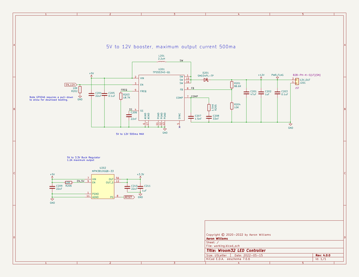
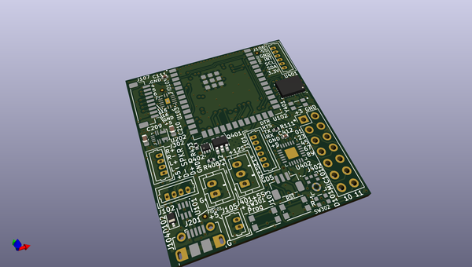
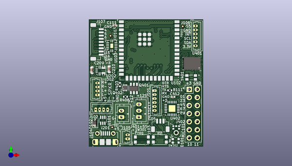
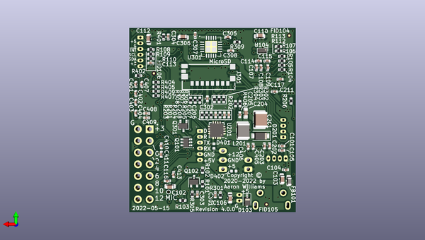

# led_controller_v4
 
## summary 
* id: aaronw2_led_controller_v4_led_controller_wrover32
* user: aaronw2
* name: led_controller_v4
* board: led_controller_wrover32
* repo: https://github.com/aaronw2/led-controller-v4
* src_file_repo_kicad_pcb: led-controller-wrover32.kicad_pcb
* src_file_repo_kicad_pcb_link: https://github.com/aaronw2/led-controller-v4/tree/main/led-controller-wrover32.kicad_pcb
* src_file_repo_kicad_sch: 12v-booster.kicad_sch
* src_file_repo_kicad_sch_link: https://github.com/aaronw2/led-controller-v4/tree/main/12v-booster.kicad_sch

* src_file_repo_sch: 
* src_file_repo_sch_link: https://github.com/aaronw2/led-controller-v4/tree/main/
* full details link: https://github.com/oomlout/oomlout_oomp_project_bot_v_2/tree/main/projects/aaronw2_led_controller_v4_led_controller_wrover32/current_version/working  

## schematic  
  
[schematic (pdf)](working_schematic.pdf) 

## pcb  
 
  
  
  
[board (pdf)](working.pdf)  

## working_bom
| Id | Designator | Footprint | Quantity | Designation | Supplier and ref |  | None | 
| --- | --- | --- | --- | --- | --- | --- | --- | 
| 1 | FID103,FID101,FID102,FID104,FID106,FID105 | Fiducial_0.5mm_Mask1mm | 6 | Fiducial |  |  | [''] | 
| 2 | U401 | LGA-28_5.2x3.8mm_P0.5mm | 1 | BNO085 |  |  | [''] | 
| 3 | J104 | USB_Micro-B_Molex-105017-0001 | 1 | USB_B_Micro |  |  | [''] | 
| 4 | C111,C412,C205,C403,C308,C409,C305,C301,C108,C402,C406,C304,C116,C411,C203,C407,C404,C413,C307,C107,C104 | C_0402_1005Metric | 21 | 0.1uF |  |  | [''] | 
| 5 | U101 | SOT-323-6L | 1 | USBUF02W6 |  |  | [''] | 
| 6 | D102,D103 | D_SOD-323 | 2 | UDD32C12L01 |  |  | [''] | 
| 7 | U402 | HWQFN-24_EP_4x4_Pitch0.5mm | 1 | PCA9575HF |  |  | [''] | 
| 8 | SW302,SW301 | SW_Push_1P1T_NO_CK_KMR2 | 2 | KMR2 |  |  | [''] | 
| 9 | J101,J106 | Molex_PicoBlade_53047-0610_1x06_P1.25mm_Vertical | 2 | Molex PicoBlade 6-pin |  |  | [''] | 
| 10 | J107 | JST_SH_BM09B-SRSS-TB_1x09-1MP_P1.00mm_Vertical | 1 | 5V_LOGIC |  |  | [''] | 
| 11 | R408,R111,R403,R307,R305,R202,R206,R409,R401,R301,R308,R407,R303,R402,R302,R204,R406,R304,R306,R309 | R_0402_1005Metric | 20 | 10K |  |  | [''] | 
| 12 | MIC101 | Knowles_LGA-6_3.5x2.65mm | 1 | SPH0645LM4H-B |  |  | [''] | 
| 13 | J105 | Molex_PicoBlade_53047-0210_1x02_P1.25mm_Vertical | 1 | POWER IN |  |  | [''] | 
| 14 | J402 | PinHeader_2x07_P2.54mm_Vertical | 1 | GPIO_CONN |  |  | [''] | 
| 15 | Q402 | SOT-563 | 1 | EM6K7T2R |  |  | [''] | 
| 16 | U102 | ESP32-S3-WROOM-2-N32R8V | 1 | ESP32-S3-WROOM-2-N32R8V |  |  | [''] | 
| 17 | U202 | Monolithic_QFN-12-2.5x3.0mm_P0.4mm | 1 | MPM3810GQB-33 |  |  | [''] | 
| 18 | J103 | JST_SH_BM03B-SRSS-TB_1x03-1MP_P1.00mm_Vertical | 1 | STATUS OUT |  |  | [''] | 
| 19 | Q401 | SOT-23-6 | 1 | SIL2301-TP |  |  | [''] | 
| 20 | C210,C209,C204,C110 | C_0603_1608Metric | 4 | 22uF |  |  | [''] | 
| 21 | J201 | JST_PH_B2B-PH-K_1x02_P2.00mm_Vertical | 1 | 12V_OUT |  |  | [''] | 
| 22 | J102,J302 | Molex_PicoBlade_53047-0410_1x04_P1.25mm_Vertical | 2 | Molex PicoBlade 4-pin |  |  | [''] | 
| 23 | U103 | SOT-762-1 | 1 | NTS0104BQ,115 |  |  | [''] | 
| 24 | D101 | LED_WS2812_2020 | 1 | WS2812_2020 |  |  | [''] | 
| 25 | J401 | JST_PH_B3B-PH-K_1x03_P2.00mm_Vertical | 1 | Fan PWM |  |  | [''] | 
| 26 | Y401 | OSC_OM-7604-C7 | 1 | OM-7604-C7 |  |  | [''] | 
| 27 | C103,C102,C306,C112,C106 | C_0603_1608Metric | 5 | 10uF |  |  | [''] | 
| 28 | C207 | C_0402_1005Metric | 1 | 1.5nF |  |  | [''] | 
| 29 | C408,C302,C113,C410,C114,C401,C117,C115,C105,C303,C405,C211,C101,C202,C109 | C_0402_1005Metric | 15 | 1uF |  |  | [''] | 
| 30 | R103,R113,R112,R107,R106,R104,R105 | R_0402_1005Metric | 7 | 33 |  |  | [''] | 
| 31 | D201 | D_SOD-123F | 1 | SMD34PL-TP |  |  | [''] | 
| 32 | R405,R102,R101,R404,R108 | R_0402_1005Metric | 5 | 4.7K |  |  | [''] | 
| 33 | D402,D401 | D_0402_1005Metric | 2 | CDBQR0230R-HF |  |  | [''] | 
| 34 | R109,R110 | R_0402_1005Metric | 2 | 2.2K |  |  | [''] | 
| 35 | R203 | R_0402_1005Metric | 1 | 18.7K |  |  | [''] | 
| 36 | C206 | C_0402_1005Metric | 1 | 22nF |  |  | [''] | 
| 37 | U104 | Texas_DSBGA-8_0.9x1.9mm_Layout2x4_P0.5mm | 1 | TCA9406ZYPR |  |  | [''] | 
| 38 | U201 | QFN-16-1EP_3x3mm_P0.5mm_EP2.7x2.7mm_ThermalVias | 1 | TPS55340-Q1 |  |  | [''] | 
| 39 | Q301,Q102 | SOT-323_SC-70 | 2 | BSS138 |  |  | [''] | 
| 40 | C201 | C_1210_3225Metric | 1 | 47uF |  |  | [''] | 
| 41 | Q101 | SOT-363_SC-70-6 | 1 | UMH3N |  |  | [''] | 
| 42 | C208 | C_0402_1005Metric | 1 | 33nF |  |  | [''] | 
| 43 | R205 | R_0402_1005Metric | 1 | 1.54K |  |  | [''] | 
| 44 | R201 | R_0402_1005Metric | 1 | 86.6K |  |  | [''] | 
| 45 | J301 | microSD_HC_Molex_047571-0001 | 1 | Micro_SD_Card |  |  | [''] | 
| 46 | L201 | L_1210_3225Metric | 1 | 2.2uH |  |  | [''] | 
| 47 | U301 | LFCSP-20-1EP_4x4mm_P0.5mm_EP2.6x2.6mm | 1 | SSM2518CPZ |  |  | [''] | 
| 48 | FB101 | L_0603_1608Metric | 1 | 2A 300 ohm@100MHz |  |  | [''] | 

## bom_schematic
| Ref | Qnty | Value | Cmp name | Footprint | Description | Vendor | DNP | 
| --- | --- | --- | --- | --- | --- | --- | --- | 
| C201 | 1 | 47uF | C | Capacitor_SMD:C_1210_3225Metric | Unpolarized capacitor |  |  | 
| C202, C211 | 2 | 1uF | C | Capacitor_SMD:C_0402_1005Metric | Unpolarized capacitor |  |  | 
| C203, C205 | 2 | 0.1uF | C | Capacitor_SMD:C_0402_1005Metric | Unpolarized capacitor |  |  | 
| C204, C209, C210 | 3 | 22uF | C | Capacitor_SMD:C_0603_1608Metric | Unpolarized capacitor |  |  | 
| C206 | 1 | 22nF | C | Capacitor_SMD:C_0402_1005Metric | Unpolarized capacitor |  |  | 
| C207 | 1 | 1.5nF | C | Capacitor_SMD:C_0402_1005Metric | Unpolarized capacitor |  |  | 
| C208 | 1 | 33nF | C | Capacitor_SMD:C_0402_1005Metric | Unpolarized capacitor |  |  | 
| D201 | 1 | SMD34PL-TP | D_Schottky | Diode_SMD:D_SOD-123F | Schottky diode |  |  | 
| J201 | 1 | 12V_OUT | Conn_01x02 | Connector_JST:JST_PH_B2B-PH-K_1x02_P2.00mm_Vertical | Generic connector, single row, 01x02, script generated (kicad-library-utils/schlib/autogen/connector/) |  |  | 
| L201 | 1 | 2.2uH | L | Inductor_SMD:L_1210_3225Metric | Inductor |  |  | 
| R201 | 1 | 86.6K | R | Resistor_SMD:R_0402_1005Metric | Resistor |  |  | 
| R202, R204, R206 | 3 | 10K | R | Resistor_SMD:R_0402_1005Metric | Resistor |  |  | 
| R203 | 1 | 18.7K | R | Resistor_SMD:R_0402_1005Metric | Resistor |  |  | 
| R205 | 1 | 1.54K | R | Resistor_SMD:R_0402_1005Metric | Resistor |  |  | 
| U201 | 1 | TPS55340-Q1 | TPS55340-Q1-texas-12v-booster-rescue | Aaron:QFN-16-1EP_3x3mm_P0.5mm_EP2.7x2.7mm_ThermalVias |  |  |  | 
| U202 | 1 | MPM3810GQB-33 | MPM3810GQB-33 | Package_DFN_QFN:Monolithic_QFN-12-2.5x3.0mm_P0.4mm | 6V, 1.2V, 1.2A peak simple module with integrated inductor |  |  | 

