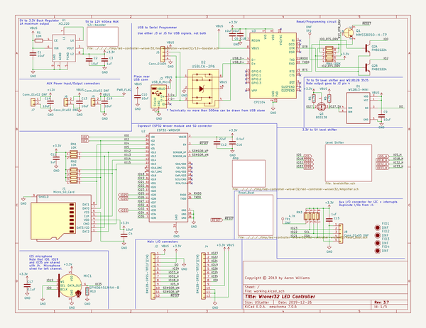
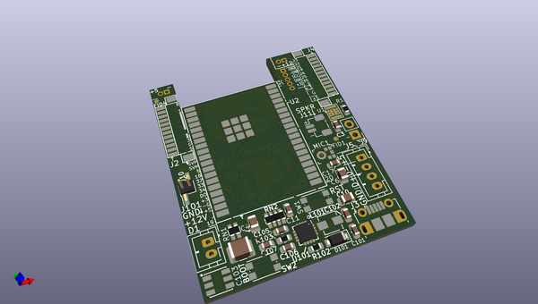
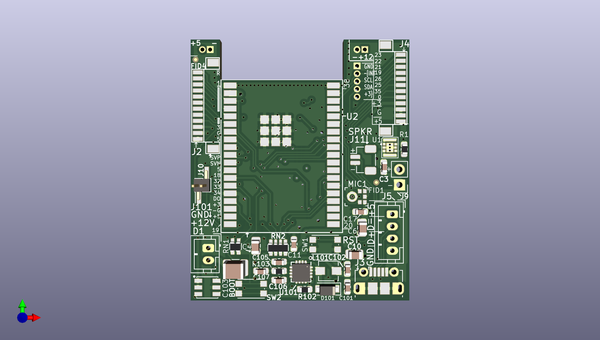
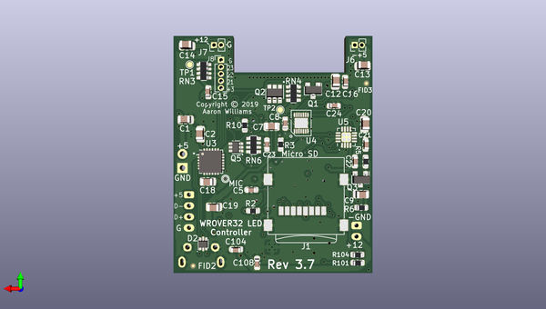

# led_controller_wrover32
 
## summary 
* id: aaronw2_led_controller_wrover32_led_controller_wrover32
* user: aaronw2
* name: led_controller_wrover32
* board: led_controller_wrover32
* repo: https://github.com/aaronw2/led-controller-wrover32
* src_file_repo_kicad_pcb: led-controller-wrover32.kicad_pcb
* src_file_repo_kicad_pcb_link: https://github.com/aaronw2/led-controller-wrover32/tree/master/led-controller-wrover32.kicad_pcb

* src_file_repo_sch: 
* src_file_repo_sch_link: https://github.com/aaronw2/led-controller-wrover32/tree/master/
* full details link: https://github.com/oomlout/oomlout_oomp_project_bot_v_2/tree/main/projects/aaronw2_led_controller_wrover32_led_controller_wrover32/current_version/working  

## schematic  
  
[schematic (pdf)](working_schematic.pdf) 

## pcb  
 
  
  
  
[board (pdf)](working.pdf)  

## working_bom
| Id | Designator | Footprint | Quantity | Designation | Supplier and ref |  | None | 
| --- | --- | --- | --- | --- | --- | --- | --- | 
| 1 | RN2 | R_Array_Convex_4x0603 | 1 | 10K |  |  | [''] | 
| 2 | RN1 | R_Array_Convex_2x0603 | 1 | 10K |  |  | [''] | 
| 3 | J2,J4 | BM12B-SRSS-TB | 2 | BM12B-SRSS-TBT(LF)(SN) |  |  | [''] | 
| 4 | U1 | CL-2025-02 | 1 | XCL220 |  |  | [''] | 
| 5 | J3 | USB_Micro-B_Molex-105017-0001 | 1 | USB_B_Micro |  |  | [''] | 
| 6 | C11,C3,C15,C104 | C_0603_1608Metric | 4 | 1uF |  |  | [''] | 
| 7 | C6,C10,C4,C14,C9,C1,C13,C2,C20,C7,C18,C19 | C_0805_2012Metric | 12 | 10uF |  |  | [''] | 
| 8 | R103 | R_0603_1608Metric | 1 | 1.62K |  |  | [''] | 
| 9 | R102 | R_0603_1608Metric | 1 | 18.7K |  |  | [''] | 
| 10 | C107 | C_0603_1608Metric | 1 | 47nF |  |  | [''] | 
| 11 | C106 | C_0603_1608Metric | 1 | 820pF |  |  | [''] | 
| 12 | C101 | C_0603_1608Metric | 1 | 22uF |  |  | [''] | 
| 13 | U101 | QFN-16-1EP_3x3mm_P0.5mm_EP2.7x2.7mm_ThermalVias | 1 | TPS55340-Q1 |  |  | [''] | 
| 14 | L101 | L_Vishay_IHLP-1212 | 1 | 3.3uH |  |  | [''] | 
| 15 | C105,C23 | C_0603_1608Metric | 2 | 22nF |  |  | [''] | 
| 16 | C102,C17,C108,C21,C22,C16,C5,C8,C24 | C_0603_1608Metric | 9 | 0.1uF |  |  | [''] | 
| 17 | J5 | JST_PH_B4B-PH-K_1x04_P2.00mm_Vertical | 1 | Conn_01x04 |  |  | [''] | 
| 18 | J9 | PinHeader_1x02_P2.54mm_Vertical | 1 | Conn_01x02 DNF |  |  | [''] | 
| 19 | R1,R3,R104 | R_0603_1608Metric | 3 | 10K |  |  | [''] | 
| 20 | D1 | LED_WS2813-MINI-2 | 1 | WS2813-MINI |  |  | [''] | 
| 21 | FID4,FID1,FID2,FID3 | Fiducial_0.5mm_Mask1mm | 4 | DNF |  |  | [''] | 
| 22 | MIC1 | SPH0645LM4H-B | 1 | SPH0645LM4H-B |  |  | [''] | 
| 23 | SW1,SW2 | SW_SPST_KMR2 | 2 | SW_SPST_KMR2 |  |  | [''] | 
| 24 | D101 | D_SOD-123F | 1 | D_Schottky |  |  | [''] | 
| 25 | J101 | JST_PH_B2B-PH-K_1x02_P2.00mm_Vertical | 1 | Conn_01x02 |  |  | [''] | 
| 26 | J11 | JST_SH_BM02B-SRSS-TB_1x02-1MP_P1.00mm_Vertical | 1 | Conn_01x02 |  |  | [''] | 
| 27 | C103 | C_1210_3225Metric | 1 | 47uF |  |  | [''] | 
| 28 | J10 | PinHeader_1x02_P1.27mm_Vertical_SMD_Pin1Left | 1 | Conn_01x02 DNF |  |  | [''] | 
| 29 | U2 | ESP32-WROOVER | 1 | ESP32-WROVER |  |  | [''] | 
| 30 | R6,R5 | R_0603_1608Metric | 2 | 4.7K |  |  | [''] | 
| 31 | R10 | R_0603_1608Metric | 1 | 100K |  |  | [''] | 
| 32 | RN3 | R_Array_Convex_4x0603 | 1 | 4.7K |  |  | [''] | 
| 33 | D2 | SOT-666 | 1 | USBLC6-2P6 |  |  | [''] | 
| 34 | C12 | C_0805_2012Metric | 1 | 22uF |  |  | [''] | 
| 35 | J1 | microSD_HC_Wuerth_693072010801 | 1 | Micro_SD_Card |  |  | [''] | 
| 36 | R101 | R_0603_1608Metric | 1 | 86.6K |  |  | [''] | 
| 37 | J6,J7 | PinHeader_1x02_P1.27mm_Vertical | 2 | Conn_01x02 DNF |  |  | [''] | 
| 38 | J8 | PinHeader_1x05_P1.27mm_Vertical | 1 | Conn_01x05 DNF |  |  | [''] | 
| 39 | U5 | VQFN-16-1EP_3x3mm_P0.5mm_EP1.68x1.68mm | 1 | MAX98357A |  |  | [''] | 
| 40 | Q3 | SOT-23 | 1 | BSS138 |  |  | [''] | 
| 41 | Q1 | SOT-23 | 1 | MMSS8050-H-TP |  |  | [''] | 
| 42 | Q5 | SOT-363_SC-70-6 | 1 | BSS138DW-7-F |  |  | [''] | 
| 43 | RN6,RN4 | R_Array_Convex_4x0603 | 2 | 100K |  |  | [''] | 
| 44 | R2 | R_0603_1608Metric | 1 | 470 |  |  | [''] | 
| 45 | U4 | TDFN-14_3x3mm_P0.4mm_EP1.78x2.35mm | 1 | MAX3379EETD |  |  | [''] | 
| 46 | Q2 | SOT-23-6 | 1 | FMB2222A |  |  | [''] | 
| 47 | U3 | QFN-24-1EP_4x4mm_P0.5mm_EP2.6x2.6mm | 1 | CP2104 |  |  | [''] | 

## bom_schematic
| Ref | Qnty | Value | Cmp name | Footprint | Description | Vendor | DNP | 
| --- | --- | --- | --- | --- | --- | --- | --- | 
| C1, C2, C4, C6, C9, C10, C13, C14, C18, C19 | 10 | 10uF | C | Capacitor_SMD:C_0805_2012Metric | Unpolarized capacitor |  |  | 
| C3, C11, C15 | 3 | 1uF | C | Capacitor_SMD:C_0603_1608Metric | Unpolarized capacitor |  |  | 
| C12 | 1 | 22uF | C | Capacitor_SMD:C_0805_2012Metric | Unpolarized capacitor |  |  | 
| C16, C17 | 2 | 0.1uF | C | Capacitor_SMD:C_0603_1608Metric | Unpolarized capacitor |  |  | 
| D1 | 1 | WS2813-MINI | WS2813-MINI-WS2813-mini | LED_WS2813-mini:LED_WS2813-MINI-2 |  |  |  | 
| D2 | 1 | USBLC6-2P6 | USBLC6-2SC6-dk_TVS-Diodes | Package_TO_SOT_SMD:SOT-666 |  |  |  | 
| FID1, FID2, FID3, FID4 | 4 | DNF | FIDUCIAL_1MM-fiducial | Fiducial:Fiducial_0.5mm_Mask1mm |  |  |  | 
| J1 | 1 | Micro_SD_Card | Micro_SD_Card-Connector | Aaron:microSD_HC_Wuerth_693072010801 |  |  |  | 
| J2, J4 | 2 | BM12B-SRSS-TBT(LF)(SN) | Conn_01x12 | Connectors_JST-BM12B-SURS-TF:BM12B-SRSS-TB | Generic connector, single row, 01x12, script generated (kicad-library-utils/schlib/autogen/connector/) |  |  | 
| J3 | 1 | USB_B_Micro | USB_B_Micro-Connector | Aaron:USB_Micro-B_Molex-105017-0001 |  |  |  | 
| J5 | 1 | Conn_01x04 | Conn_01x04 | Connector_JST:JST_PH_B4B-PH-K_1x04_P2.00mm_Vertical | Generic connector, single row, 01x04, script generated (kicad-library-utils/schlib/autogen/connector/) |  |  | 
| J6, J7 | 2 | Conn_01x02 DNF | Conn_01x02 | Connector_PinHeader_1.27mm:PinHeader_1x02_P1.27mm_Vertical | Generic connector, single row, 01x02, script generated (kicad-library-utils/schlib/autogen/connector/) |  |  | 
| J8 | 1 | Conn_01x05 DNF | Conn_01x05-Connector-led-controller-wrover32-rescue | Connector_PinHeader_1.27mm:PinHeader_1x05_P1.27mm_Vertical |  |  |  | 
| J9 | 1 | Conn_01x02 DNF | Conn_01x02 | Connector_PinHeader_2.54mm:PinHeader_1x02_P2.54mm_Vertical | Generic connector, single row, 01x02, script generated (kicad-library-utils/schlib/autogen/connector/) |  |  | 
| MIC1 | 1 | SPH0645LM4H-B | SPH0645LM4H-B-dk_Microphones | Aaron:SPH0645LM4H-B |  |  |  | 
| Q1 | 1 | MMSS8050-H-TP | MMSS8050-H-TP-dk_Transistors-Bipolar-BJT-Single | Package_TO_SOT_SMD:SOT-23 |  |  |  | 
| Q2 | 1 | FMB2222A | FMB2222A-Aaron | Package_TO_SOT_SMD:SOT-23-6 |  |  |  | 
| Q3 | 1 | BSS138 | BSS138 | Package_TO_SOT_SMD:SOT-23 | 50V Vds, 0.22A Id, N-Channel MOSFET, SOT-23 |  |  | 
| R1 | 1 | 10K | R | Resistor_SMD:R_0603_1608Metric | Resistor |  |  | 
| R5, R6 | 2 | 4.7K | R | Resistor_SMD:R_0603_1608Metric | Resistor |  |  | 
| R10 | 1 | 100K | R | Resistor_SMD:R_0603_1608Metric | Resistor |  |  | 
| RN1 | 1 | 10K | R_Pack02 | Resistor_SMD:R_Array_Convex_2x0603 | 2 resistor network, parallel topology |  |  | 
| RN2 | 1 | 10K | R_Pack04 | Resistor_SMD:R_Array_Convex_4x0603 | 4 resistor network, parallel topology |  |  | 
| RN3 | 1 | 4.7K | R_Pack04 | Resistor_SMD:R_Array_Convex_4x0603 | 4 resistor network, parallel topology |  |  | 
| RN4 | 1 | 100K | R_Pack04 | Resistor_SMD:R_Array_Convex_4x0603 | 4 resistor network, parallel topology |  |  | 
| TP1, TP2 | 2 | DNF | TestPoint | TestPoint:TestPoint_Pad_D1.0mm | test point |  |  | 
| U1 | 1 | XCL220 | XCL21X-Torex_Semiconductor | Torex_Semi:CL-2025-02 |  |  |  | 
| U2 | 1 | ESP32-WROVER | ESP32-WROVER-I-ESP32-WROVER-I | ESP32:ESP32-WROOVER |  |  |  | 
| U3 | 1 | CP2104 | CP2104-Interface_USB | Package_DFN_QFN:QFN-24-1EP_4x4mm_P0.5mm_EP2.6x2.6mm |  |  |  | 

