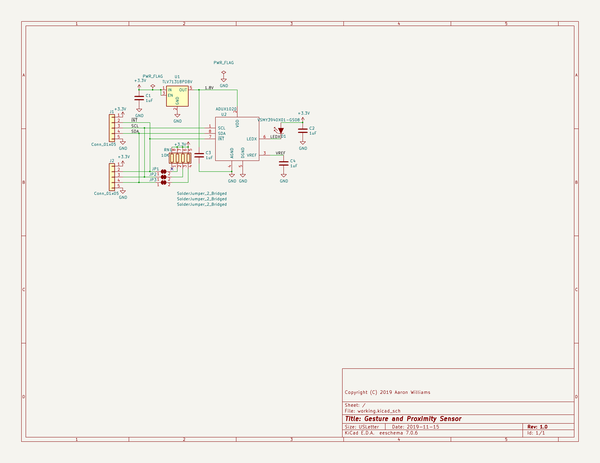

# light_sensor
 
## summary 
* id: aaronw2_light_sensor_light_sensor
* user: aaronw2
* name: light_sensor
* board: light_sensor
* repo: https://github.com/aaronw2/light-sensor
* src_file_repo_kicad_pcb: light-sensor.kicad_pcb
* src_file_repo_kicad_pcb_link: https://github.com/aaronw2/light-sensor/tree/master/light-sensor.kicad_pcb

* src_file_repo_sch: light-sensor.sch
* src_file_repo_sch_link: https://github.com/aaronw2/light-sensor/tree/master/light-sensor.sch
* full details link: https://github.com/oomlout/oomlout_oomp_project_bot_v_2/tree/main/projects/aaronw2_light_sensor_light_sensor/current_version/working  

## schematic  
  
[schematic (pdf)](working_schematic.pdf)  

## pcb  
 
  
  
  
[board (pdf)](working.pdf)  

## working_bom
| Id | Designator | Footprint | Quantity | Designation | Supplier and ref |  | None | 
| --- | --- | --- | --- | --- | --- | --- | --- | 
| 1 | C1,C2,C3,C4 | C_0603_1608Metric | 4 | 1uF |  |  | [''] | 
| 2 | D1 | LED_PLCC-2 | 1 | VSMY3940X01-GS08 |  |  | [''] | 
| 3 | U1 | SOT-23-5 | 1 | TLV71318PDBV |  |  | [''] | 
| 4 | U2 | LFCSP-8-1EP_3x2mm_P0.5mm_EP1.6x1.65mm | 1 | ADUX1020 |  |  | [''] | 
| 5 | J2,J1 | PinHeader_1x05_P1.27mm_Vertical | 2 | Conn_01x05 |  |  | [''] | 
| 6 | RN1 | R_Array_Convex_4x0603 | 1 | 10K |  |  | [''] | 

## bom_schematic
| Ref | Qnty | Value | Cmp name | Footprint | Description | Vendor | DNP | 
| --- | --- | --- | --- | --- | --- | --- | --- | 
| C1, C2, C3, C4 | 4 | 1uF | C | Capacitor_SMD:C_0603_1608Metric | Unpolarized capacitor |  |  | 
| D1 | 1 | VSMY3940X01-GS08 | VSMY3940X01-GS08-Aaron | Aaron:LED_PLCC-2 |  |  |  | 
| J1, J2 | 2 | Conn_01x05 | Conn_01x05 | Connector_PinHeader_1.27mm:PinHeader_1x05_P1.27mm_Vertical | Generic connector, single row, 01x05, script generated (kicad-library-utils/schlib/autogen/connector/) |  |  | 
| JP1, JP2, JP3 | 3 | SolderJumper_2_Bridged | SolderJumper_2_Bridged | Jumper:SolderJumper-2_P1.3mm_Bridged_RoundedPad1.0x1.5mm | Solder Jumper, 2-pole, closed/bridged |  |  | 
| RN1 | 1 | 10K | R_Pack04 | Resistor_SMD:R_Array_Convex_4x0603 | 4 resistor network, parallel topology |  |  | 
| U1 | 1 | TLV71318PDBV | TLV71318PDBV-Regulator_Linear | Package_TO_SOT_SMD:SOT-23-5 |  |  |  | 
| U2 | 1 | ADUX1020 | ADUX1020-Aaron | Aaron:LFCSP-8-1EP_3x2mm_P0.5mm_EP1.6x1.65mm |  |  |  | 

