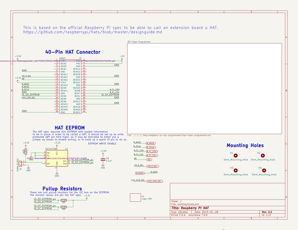
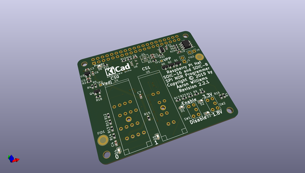
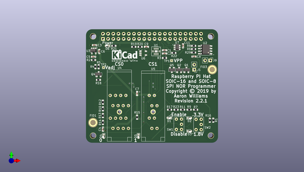
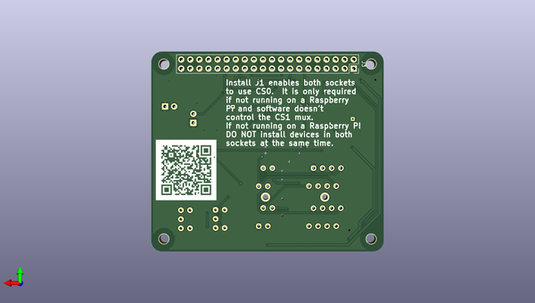

# raspberry_pi_spi_programmer2
 
## summary 
* id: aaronw2_raspberry_pi_spi_programmer2_raspberry_spi_flash2
* user: aaronw2
* name: raspberry_pi_spi_programmer2
* board: raspberry_spi_flash2
* repo: https://github.com/aaronw2/raspberry-pi-spi-programmer2
* src_file_repo_kicad_pcb: raspberry-spi-flash2.kicad_pcb
* src_file_repo_kicad_pcb_link: https://github.com/aaronw2/raspberry-pi-spi-programmer2/tree/master/raspberry-spi-flash2.kicad_pcb

* src_file_repo_sch: raspberry-spi-flash2.sch
* src_file_repo_sch_link: https://github.com/aaronw2/raspberry-pi-spi-programmer2/tree/master/raspberry-spi-flash2.sch
* full details link: https://github.com/oomlout/oomlout_oomp_project_bot_v_2/tree/main/projects/aaronw2_raspberry_pi_spi_programmer2_raspberry_spi_flash2/current_version/working  

## schematic  
  
[schematic (pdf)](working_schematic.pdf) 

## pcb  
 
  
  
  
[board (pdf)](working.pdf)  

## working_bom
| Id | Designator | Footprint | Quantity | Designation | Supplier and ref |  | None | 
| --- | --- | --- | --- | --- | --- | --- | --- | 
| 1 | H1,H2,H3,H4 | NPTH_3mm_ID | 4 | 3mm_Mounting_Hole |  |  | [''] | 
| 2 | J9 | PinHeader_1x02_P2.54mm_Vertical | 1 | CONN_01X02 |  |  | [''] | 
| 3 | R5 | R_0603_1608Metric | 1 | 13.3K |  |  | [''] | 
| 4 | R16,R29,R22 | R_0603_1608Metric | 3 | 10K |  |  | [''] | 
| 5 | R14,R10,R13,R12,R15,R23 | R_0603_1608Metric | 6 | 4.75K |  |  | [''] | 
| 6 | R18,R7 | R_0603_1608Metric | 2 | 100K |  |  | [''] | 
| 7 | R17,R9,R11,R20,R19 | R_0603_1608Metric | 5 | 560 |  |  | [''] | 
| 8 | R4 | R_0603_1608Metric | 1 | 20K |  |  | [''] | 
| 9 | R3 | R_0603_1608Metric | 1 | 1K |  |  | [''] | 
| 10 | R2 | R_0603_1608Metric | 1 | 25K |  |  | [''] | 
| 11 | R1 | R_0603_1608Metric | 1 | 1M |  |  | [''] | 
| 12 | U3 | SOT-23-5 | 1 | AP2127K-ADJ |  |  | [''] | 
| 13 | Q4,Q1,Q2,Q5 | SOT-23 | 4 | BSS138 |  |  | [''] | 
| 14 | D1,D2,D3,D5,D6,D4 | LED_0603_1608Metric | 6 | LED |  |  | [''] | 
| 15 | FID1,FID3 | Fiducial_Modern_CopperTop | 2 | FIDUCIAL_1MM |  |  | [''] | 
| 16 | C7,C1,C4,C2,C8,C11,C9 | C_0603_1608Metric | 7 | 0.1uF |  |  | [''] | 
| 17 | C5 | C_0603_1608Metric | 1 | 1000pF |  |  | [''] | 
| 18 | C6,C3 | C_0603_1608Metric | 2 | 4.7uF |  |  | [''] | 
| 19 | SW1,SW2 | SW_STDP_CF-LD-1DC | 2 | SW_SPDT |  |  | [''] | 
| 20 | U4 | 216-7224-55-1902 | 1 | MX25L25735 |  |  | [''] | 
| 21 | U5 | 208-7391-55-1902 | 1 | AT25SF081-SSHD-X |  |  | [''] | 
| 22 | R8,R6 | R_0603_1608Metric | 2 | 3.9K |  |  | [''] | 
| 23 | U2 | SOIC-8_3.9x4.9mm_P1.27mm | 1 | CAT24C32 |  |  | [''] | 
| 24 | R21 | R_0603_1608Metric | 1 | 330 |  |  | [''] | 
| 25 | U7 | SOT-23-6 | 1 | SN74AUP1T157 |  |  | [''] | 
| 26 | J1 | PinHeader_1x02_P2.54mm_Vertical | 1 | Conn_01x02 |  |  | [''] | 
| 27 | U1 | DQFN-14-1EP_2.5x3mm_EP2.2x1.7mm_Thermal | 1 | FXL5T244BQX |  |  | [''] | 
| 28 | U6 | SOT-753 | 1 | SN74LVC1G04DBVR |  |  | [''] | 
| 29 | J3 | PinSocket_2x20_P2.54mm_Vertical | 1 | 40HAT |  |  | [''] | 
| 30 | A1 | LOGO-raspberry-pi-spi-programmer2 | 1 | Logo-URL |  |  | [''] | 

## bom_schematic
| Ref | Qnty | Value | Cmp name | Footprint | Description | Vendor | DNP | 
| --- | --- | --- | --- | --- | --- | --- | --- | 
| A1 | 1 | Logo-URL | Logo-URL-Aaron | Aaron:LOGO-raspberry-pi-spi-programmer2 |  |  |  | 
| C8 | 1 | 0.1uF | C | Capacitor_SMD:C_0603_1608Metric | Unpolarized capacitor |  |  | 
| H1, H2, H3, H4 | 4 | 3mm_Mounting_Hole | Mounting_Hole-Mechanical | project_footprints:NPTH_3mm_ID |  |  |  | 
| J3 | 1 | 40HAT | OX40HAT-raspberrypi_hat | Connector_PinSocket_2.54mm:PinSocket_2x20_P2.54mm_Vertical |  |  |  | 
| J9 | 1 | CONN_01X02 | Conn_01x02 | Connector_PinHeader_2.54mm:PinHeader_1x02_P2.54mm_Vertical | Generic connector, single row, 01x02, script generated (kicad-library-utils/schlib/autogen/connector/) |  |  | 
| R6, R8 | 2 | 3.9K | R | Resistor_SMD:R_0603_1608Metric | Resistor |  |  | 
| R29 | 1 | 10K | R | Resistor_SMD:R_0603_1608Metric | Resistor |  |  | 
| U2 | 1 | CAT24C32 | CAT24C32-raspberrypi_hat | Package_SO:SOIC-8_3.9x4.9mm_P1.27mm |  |  |  | 

