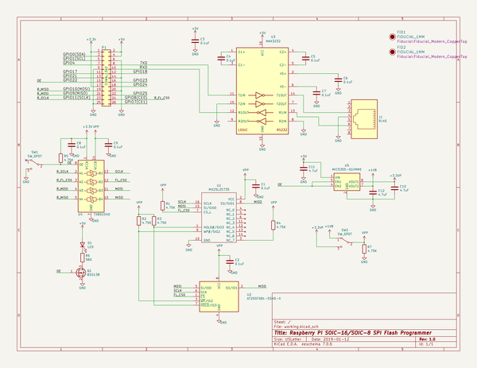
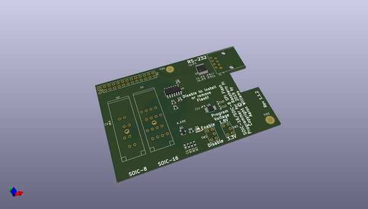
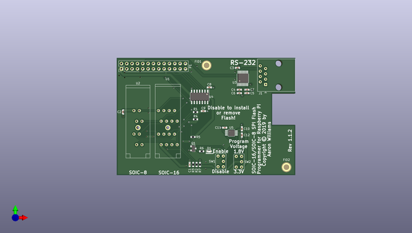
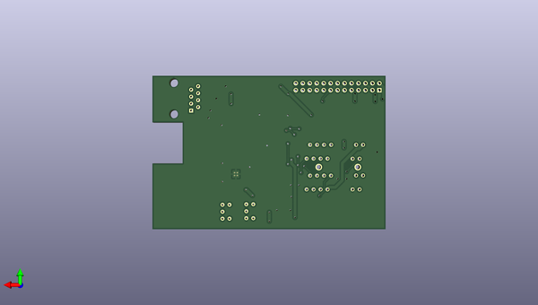

# raspberry_pi_spi_programmer
 
## summary 
* id: aaronw2_raspberry_pi_spi_programmer_raspberry_spi_flash
* user: aaronw2
* name: raspberry_pi_spi_programmer
* board: raspberry_spi_flash
* repo: https://github.com/aaronw2/raspberry-pi-spi-programmer
* src_file_repo_kicad_pcb: raspberry-spi-flash.kicad_pcb
* src_file_repo_kicad_pcb_link: https://github.com/aaronw2/raspberry-pi-spi-programmer/tree/master/raspberry-spi-flash.kicad_pcb

* src_file_repo_sch: raspberry-spi-flash.sch
* src_file_repo_sch_link: https://github.com/aaronw2/raspberry-pi-spi-programmer/tree/master/raspberry-spi-flash.sch
* full details link: https://github.com/oomlout/oomlout_oomp_project_bot_v_2/tree/main/projects/aaronw2_raspberry_pi_spi_programmer_raspberry_spi_flash/current_version/working  

## schematic  
  
[schematic (pdf)](working_schematic.pdf)  

## pcb  
 
  
  
  
[board (pdf)](working.pdf)  

## working_bom
| Id | Designator | Footprint | Quantity | Designation | Supplier and ref |  | None | 
| --- | --- | --- | --- | --- | --- | --- | --- | 
| 1 | P1 | PinHeader_2x13_P2.54mm_Vertical | 1 | CONN_13X2 |  |  | [''] | 
| 2 | R5,R4,R3,R7,R1,R2 | R_0603_1608Metric | 6 | 4.75K |  |  | [''] | 
| 3 | U4 | SOIC-14_3.9x8.7mm_P1.27mm | 1 | TXB0104D |  |  | [''] | 
| 4 | C8,C9,C2,C1,C3,C4,C5,C6,C7 | C_0603_1608Metric | 9 | 0.1uF |  |  | [''] | 
| 5 | SW1,SW2 | SW_STDP_CF-LD-1DC | 2 | SW_SPDT |  |  | [''] | 
| 6 | C12,C10,C11 | C_0603_1608Metric | 3 | 4.7uF |  |  | [''] | 
| 7 | R6 | R_0603_1608Metric | 1 | 560 |  |  | [''] | 
| 8 | D1 | LED_0603_1608Metric | 1 | LED |  |  | [''] | 
| 9 | U5 | MSOP-8-1EP_3x3mm_P0.65mm_EP2.54x2.8mm_ThermalVias | 1 | MIC5355-SGYMME |  |  | [''] | 
| 10 | Q1 | SOT-23 | 1 | BSS138 |  |  | [''] | 
| 11 | U2 | 208-7391-55-1902 | 1 | AT25SF081-SSHD-X |  |  | [''] | 
| 12 | U1 | 216-7224-55-1902 | 1 | MX25L25735 |  |  | [''] | 
| 13 | FID1,FID2 | Fiducial_Modern_CopperTop | 2 | FIDUCIAL_1MM |  |  | [''] | 
| 14 | U3 | TSSOP-16_4.4x5mm_P0.65mm | 1 | MAX3232 |  |  | [''] | 
| 15 | J1 | RJ45_Amphenol_54602-x08_Horizontal | 1 | RJ45 |  |  | [''] | 

## bom_schematic
| Ref | Qnty | Value | Cmp name | Footprint | Description | Vendor | DNP | 
| --- | --- | --- | --- | --- | --- | --- | --- | 
| C1, C2, C3, C4, C5, C6, C7, C8, C9 | 9 | 0.1uF | C-device | Capacitor_SMD:C_0603_1608Metric |  |  |  | 
| C10, C11, C12 | 3 | 4.7uF | C-device | Capacitor_SMD:C_0603_1608Metric |  |  |  | 
| D1 | 1 | LED | LED | LED_SMD:LED_0603_1608Metric | Light emitting diode |  |  | 
| FID1, FID2 | 2 | FIDUCIAL_1MM | FIDUCIAL_1MM-fiducial | Fiducial:Fiducial_Modern_CopperTop |  |  |  | 
| J1 | 1 | RJ45 | RJ45 | Connector_RJ:RJ45_Amphenol_54602-x08_Horizontal | RJ connector, 8P8C (8 positions 8 connected) |  |  | 
| P1 | 1 | CONN_13X2 | Conn_02x13_Odd_Even | Connector_PinHeader_2.54mm:PinHeader_2x13_P2.54mm_Vertical | Generic connector, double row, 02x13, odd/even pin numbering scheme (row 1 odd numbers, row 2 even numbers), script generated (kicad-library-utils/schlib/autogen/connector/) |  |  | 
| Q1 | 1 | BSS138 | BSS138 | Package_TO_SOT_SMD:SOT-23 | 50V Vds, 0.22A Id, N-Channel MOSFET, SOT-23 |  |  | 
| R1, R2, R3, R4, R5, R7 | 6 | 4.75K | R-device | Resistor_SMD:R_0603_1608Metric |  |  |  | 
| R6 | 1 | 560 | R | Resistor_SMD:R_0603_1608Metric | Resistor |  |  | 
| SW1, SW2 | 2 | SW_SPDT | SW_SPDT | Aaron:SW_STDP_CF-LD-1DC | Switch, single pole double throw |  |  | 
| U1 | 1 | MX25L25735 | MX25L25735-Aaron | Aaron:216-7224-55-1902 |  |  |  | 
| U2 | 1 | AT25SF081-SSHD-X | AT25SF081-SSHD-X-Memory_Flash | Aaron:208-7391-55-1902 |  |  |  | 
| U3 | 1 | MAX3232 | MAX3232-interface | Package_SO:TSSOP-16_4.4x5mm_P0.65mm |  |  |  | 
| U4 | 1 | TXB0104D | TXB0104D-Logic_LevelTranslator | Package_SO:SOIC-14_3.9x8.7mm_P1.27mm |  |  |  | 
| U5 | 1 | MIC5355-SGYMME | MIC5355-SGYMME | Package_SO:MSOP-8-1EP_3x3mm_P0.65mm_EP2.54x2.8mm_ThermalVias | Dual 500mA μCap Low Dropout Micropower Linear Regulator, 3.3V/1.8V, MSOP-8 |  |  | 

