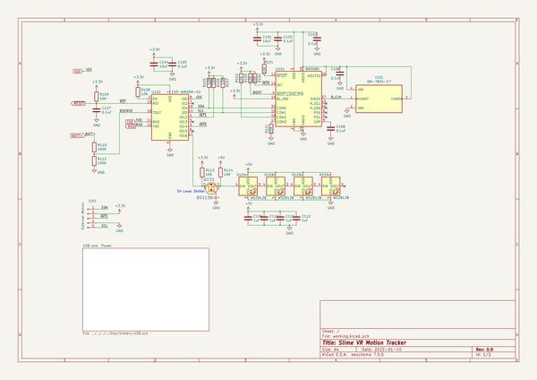
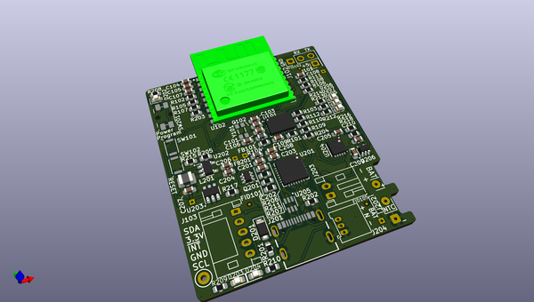
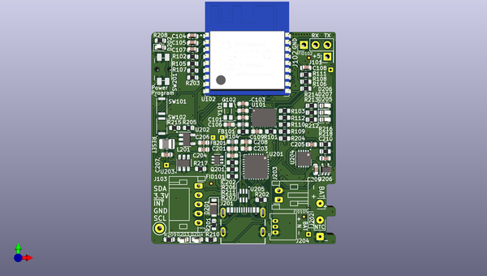
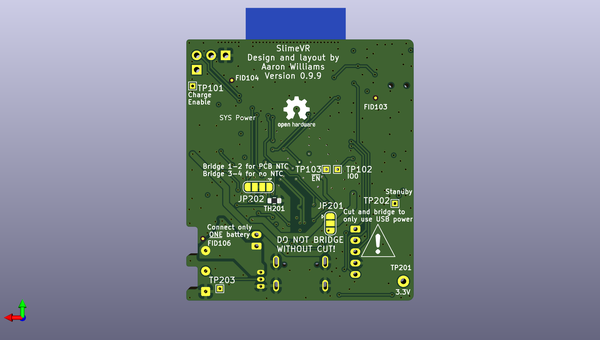

# slimevr
 
## summary 
* id: aaronw2_slimevr_slimevr
* user: aaronw2
* name: slimevr
* board: slimevr
* repo: https://github.com/aaronw2/slimevr
* src_file_repo_kicad_pcb: slimevr.kicad_pcb
* src_file_repo_kicad_pcb_link: https://github.com/aaronw2/slimevr/tree/main/slimevr.kicad_pcb
* src_file_repo_kicad_sch: Charger.kicad_sch
* src_file_repo_kicad_sch_link: https://github.com/aaronw2/slimevr/tree/main/Charger.kicad_sch

* src_file_repo_sch: 
* src_file_repo_sch_link: https://github.com/aaronw2/slimevr/tree/main/
* full details link: https://github.com/oomlout/oomlout_oomp_project_bot_v_2/tree/main/projects/aaronw2_slimevr_slimevr/current_version/working  

## schematic  
  
[schematic (pdf)](working_schematic.pdf)  

## pcb  
 
  
  
  
[board (pdf)](working.pdf)  

## working_bom
| Id | Designator | Footprint | Quantity | Designation | Supplier and ref |  | None | 
| --- | --- | --- | --- | --- | --- | --- | --- | 
| 1 | C105,C109,C106,C203,C206,C108,C202,C210,C103,C102,C107 | C_0603_1608Metric | 11 | 0.1uF |  |  | [''] | 
| 2 | R104,R107,R112,R103,R218,R111,R204,R205,R217,R102,R101,R203,R105 | R_0603_1608Metric | 13 | 10K |  |  | [''] | 
| 3 | L201 | L_1008_2520Metric | 1 | 1.5uH |  |  | [''] | 
| 4 | U101 | LGA-28_5.2x3.8mm_P0.5mm | 1 | BNO085 |  |  | [''] | 
| 5 | R206 | R_0603_1608Metric | 1 | 47.5K |  |  | [''] | 
| 6 | D207,D204 | LED_0603_1608Metric | 2 | Red |  |  | [''] | 
| 7 | R208,R210,R209 | R_0603_1608Metric | 3 | 470 |  |  | [''] | 
| 8 | R213,R216,R207,R212,R214 | R_0603_1608Metric | 5 | 1K |  |  | [''] | 
| 9 | C209,C201,C208,C205 | C_0603_1608Metric | 4 | 4.7uF 10V |  |  | [''] | 
| 10 | J201 | GCT_USB4105-GF-A | 1 | USB_C_Receptacle_USB2.0_GCT |  |  | [''] | 
| 11 | R215 | R_0603_1608Metric | 1 | 39K |  |  | [''] | 
| 12 | U203 | TSOT-23-6 | 1 | MAX16054AZTT |  |  | [''] | 
| 13 | C207,C204,C104,C101 | C_0603_1608Metric | 4 | 10uF 10V |  |  | [''] | 
| 14 | U102 | ESP-WROOM-02 | 1 | ESP-WROOM-02 |  |  | [''] | 
| 15 | FB201,FB101 | L_0603_1608Metric | 2 | LI0603E470R-10 |  |  | [''] | 
| 16 | R201,R202 | R_0603_1608Metric | 2 | 5.1K |  |  | [''] | 
| 17 | J204 | Molex_PicoBlade_53048-0310_1x03_P1.25mm_Horizontal | 1 | BAT w/THERM |  |  | [''] | 
| 18 | D205,D203 | LED_0603_1608Metric | 2 | Blue |  |  | [''] | 
| 19 | U206 | SOT-353_SC-70-5 | 1 | NC7SP38P5X |  |  | [''] | 
| 20 | R109,R110,R106,R108 | R_0603_1608Metric | 4 | 4.7K |  |  | [''] | 
| 21 | U204 | DFN-10-1EP_3x3mm_P0.5mm_EP1.55x2.48mm | 1 | MCP73837 |  |  | [''] | 
| 22 | U202 | TSOT-23-5 | 1 | RT5750XXGJ5 |  |  | [''] | 
| 23 | Q201 | SOT-363_SC-70-6 | 1 | UMH3N |  |  | [''] | 
| 24 | R211 | R_0603_1608Metric | 1 | 22.1K |  |  | [''] | 
| 25 | J103 | JST_PH_S5B-PH-K_1x05_P2.00mm_Horizontal | 1 | External Motion |  |  | [''] | 
| 26 | J203 | JST_PH_S2B-PH-K_1x02_P2.00mm_Horizontal | 1 | BAT_NO_THERM |  |  | [''] | 
| 27 | D202,D206 | LED_0603_1608Metric | 2 | Green |  |  | [''] | 
| 28 | U201 | QFN-28-1EP_5x5mm_P0.5mm_EP3.35x3.35mm | 1 | CP2102N-Axx-xQFN28 |  |  | [''] | 
| 29 | SW201 | Panasonic_EVQPUL_EVQPUC | 1 | Power |  |  | [''] | 
| 30 | D201 | D_SOD-123F | 1 | DSS12UTR |  |  | [''] | 
| 31 | U205 | SOT-323-6L | 1 | USBUF02W6 |  |  | [''] | 
| 32 | Y101 | OSC_OM-7604-C7 | 1 | OM-7604-C7 |  |  | [''] | 

## bom_schematic
| Ref | Qnty | Value | Cmp name | Footprint | Description | Vendor | DNP | 
| --- | --- | --- | --- | --- | --- | --- | --- | 
| C101, C104 | 2 | 10uF | C | Capacitor_SMD:C_0603_1608Metric | Unpolarized capacitor |  |  | 
| C102, C103, C105, C106, C107, C108 | 6 | 0.1uF | C | Capacitor_SMD:C_0603_1608Metric | Unpolarized capacitor |  |  | 
| C109, C110, C111, C112 | 4 | 1uF | C | Capacitor_SMD:C_0603_1608Metric | Unpolarized capacitor |  |  | 
| D101, D102, D103, D104 | 4 | WS2812B | WS2812B | LED_SMD:LED_WS2812B_PLCC4_5.0x5.0mm_P3.2mm | RGB LED with integrated controller |  |  | 
| J101 | 1 | External Motion | Conn_01x05_Male-Connector | Connector_JST:JST_PH_S5B-PH-K_1x05_P2.00mm_Horizontal |  |  |  | 
| Q101 | 1 | BSS138 | BSS138-dk_Transistors-FETs-MOSFETs-Single | Package_TO_SOT_SMD:SOT-23 |  |  |  | 
| R101, R102, R103, R104, R105, R106, R107, R108, R109, R111, R113, R114 | 12 | 10K | R | Resistor_SMD:R_0603_1608Metric | Resistor |  |  | 
| R110 | 1 | 400K | R | Resistor_SMD:R_0603_1608Metric | Resistor |  |  | 
| R112 | 1 | 100K | R | Resistor_SMD:R_0603_1608Metric | Resistor |  |  | 
| U101 | 1 | BNO080 | BNO080-Aaron | Package_LGA:LGA-28_5.2x3.8mm_P0.5mm |  |  |  | 
| U102 | 1 | ESP-WROOM-02 | ESP-WROOM-02 | RF_Module:ESP-WROOM-02 | Wi-Fi Module, ESP8266EX SoC, 32-bit, 802.11b/g/n, WPA/WPA2, 2.7-3.6V, SMD |  |  | 
| Y101 | 1 | OM-7604-C7 | OM-7604-C7-Aaron | Aaron:OSC_OM-7604-C7 |  |  |  | 

