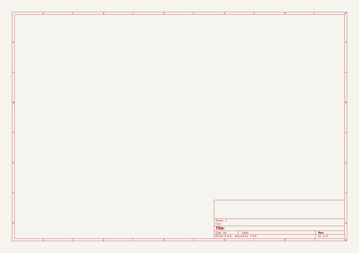

# slimevr
 
## summary 
* id: aaronw2_slimevr_slimevr_motion
* user: aaronw2
* name: slimevr
* board: slimevr_motion
* repo: https://github.com/aaronw2/slimevr
* src_file_repo_kicad_pcb: SlimeVR-Motion/SlimeVR-Motion.kicad_pcb
* src_file_repo_kicad_pcb_link: https://github.com/aaronw2/slimevr/tree/main/SlimeVR-Motion/SlimeVR-Motion.kicad_pcb
* src_file_repo_kicad_sch: SlimeVR-Motion/SlimeVR-Motion.kicad_sch
* src_file_repo_kicad_sch_link: https://github.com/aaronw2/slimevr/tree/main/SlimeVR-Motion/SlimeVR-Motion.kicad_sch

* src_file_repo_sch: 
* src_file_repo_sch_link: https://github.com/aaronw2/slimevr/tree/main/
* full details link: https://github.com/oomlout/oomlout_oomp_project_bot_v_2/tree/main/projects/aaronw2_slimevr_slimevr_motion/current_version/working  

## schematic  
  
[schematic (pdf)](working_schematic.pdf)  

## pcb  
 
  
  
  
[board (pdf)](working.pdf)  

## working_bom
| Id | Designator | Footprint | Quantity | Designation | Supplier and ref |  | None | 
| --- | --- | --- | --- | --- | --- | --- | --- | 
| 1 | R301 | R_0603_1608Metric | 1 | 330 |  |  | [''] | 
| 2 | C303,C304,C302,C305 | C_0603_1608Metric | 4 | 0.1uF |  |  | [''] | 
| 3 | U301 | LGA-28_5.2x3.8mm_P0.5mm | 1 | BNO085 |  |  | [''] | 
| 4 | J301 | JST_PH_S5B-PH-K_1x05_P2.00mm_Horizontal | 1 | External Motion |  |  | [''] | 
| 5 | R303,R304,R305,R302,R310 | R_0603_1608Metric | 5 | 10K |  |  | [''] | 
| 6 | D302 | LED_0603_1608Metric | 1 | Green |  |  | [''] | 
| 7 | R306,R309,R307,R308 | R_0603_1608Metric | 4 | 2.2K |  |  | [''] | 
| 8 | D301 | D_SOD-123F | 1 | DSS12UTR |  |  | [''] | 
| 9 | C301 | C_0603_1608Metric | 1 | 10uF 10V |  |  | [''] | 
| 10 | Y301 | OSC_OM-7604-C7 | 1 | OM-7604-C7 |  |  | [''] | 

## bom_schematic
| Ref | Qnty | Value | Cmp name | Footprint | Description | Vendor | DNP | 
| --- | --- | --- | --- | --- | --- | --- | --- | 
| C301 | 1 | 10uF 10V | C | Capacitor_SMD:C_0603_1608Metric | Unpolarized capacitor |  |  | 
| C302, C303, C304, C305 | 4 | 0.1uF | C | Capacitor_SMD:C_0603_1608Metric | Unpolarized capacitor |  |  | 
| D301 | 1 | DSS12UTR | D_Schottky | Diode_SMD:D_SOD-123F | Schottky diode |  |  | 
| D302 | 1 | Green | LED | LED_SMD:LED_0603_1608Metric | Light emitting diode |  |  | 
| J301 | 1 | External Motion | Conn_01x05_Male | Connector_JST:JST_PH_S5B-PH-K_1x05_P2.00mm_Horizontal | Generic connector, single row, 01x05, script generated (kicad-library-utils/schlib/autogen/connector/) |  |  | 
| R301 | 1 | 330 | R | Resistor_SMD:R_0603_1608Metric | Resistor |  |  | 
| R302, R303, R304, R305, R310 | 5 | 10K | R | Resistor_SMD:R_0603_1608Metric | Resistor |  |  | 
| R306, R307, R308, R309 | 4 | 2.2K | R | Resistor_SMD:R_0603_1608Metric | Resistor |  |  | 
| U301 | 1 | BNO085 | BNO080 | Package_LGA:LGA-28_5.2x3.8mm_P0.5mm | Intelligent 9-axis absolute orientation sensor, LGA-28 |  |  | 
| Y301 | 1 | OM-7604-C7 | OM-7604-C7 | Aaron:OSC_OM-7604-C7 |  |  |  | 

