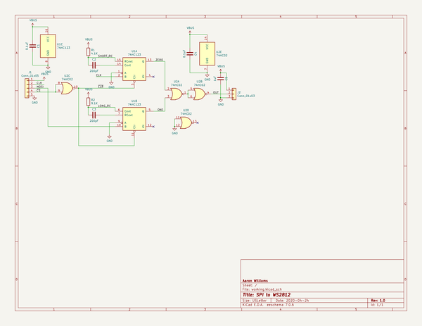
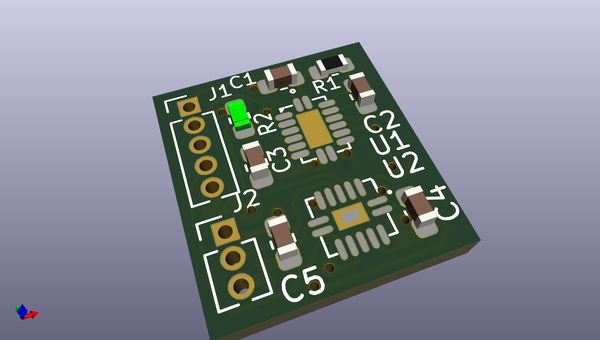
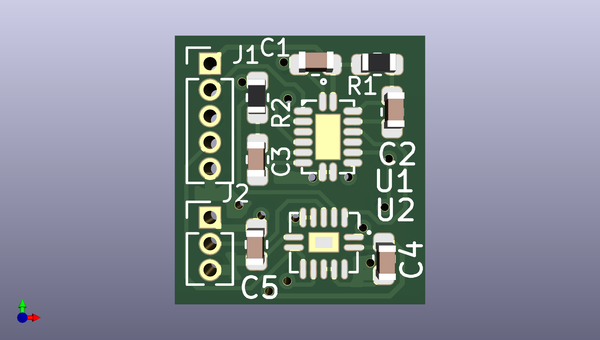
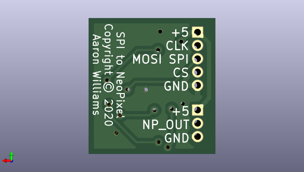

# spi_to_neopixel
 
## summary 
* id: aaronw2_spi_to_neopixel_spi_to_neopixel
* user: aaronw2
* name: spi_to_neopixel
* board: spi_to_neopixel
* repo: https://github.com/aaronw2/spi_to_neopixel
* src_file_repo_kicad_pcb: spi_to_neopixel.kicad_pcb
* src_file_repo_kicad_pcb_link: https://github.com/aaronw2/spi_to_neopixel/tree/master/spi_to_neopixel.kicad_pcb

* src_file_repo_sch: spi_to_neopixel.sch
* src_file_repo_sch_link: https://github.com/aaronw2/spi_to_neopixel/tree/master/spi_to_neopixel.sch
* full details link: https://github.com/oomlout/oomlout_oomp_project_bot_v_2/tree/main/projects/aaronw2_spi_to_neopixel_spi_to_neopixel/current_version/working  

## schematic  
  
[schematic (pdf)](working_schematic.pdf) 

## pcb  
 
  
  
  
[board (pdf)](working.pdf)  

## working_bom
| Id | Designator | Footprint | Quantity | Designation | Supplier and ref |  | None | 
| --- | --- | --- | --- | --- | --- | --- | --- | 
| 1 | C1,C4 | C_0603_1608Metric | 2 | 0.1uF |  |  | [''] | 
| 2 | C3,C2 | C_0603_1608Metric | 2 | 200pF |  |  | [''] | 
| 3 | C5 | C_0603_1608Metric | 1 | 1uF |  |  | [''] | 
| 4 | R1 | R_0603_1608Metric | 1 | 4.1K |  |  | [''] | 
| 5 | R2 | R_0603_1608Metric | 1 | 9.1K |  |  | [''] | 
| 6 | U1 | SOT-763-1 | 1 | 74HC123 |  |  | [''] | 
| 7 | U2 | SOT-762-1 | 1 | 74HC02 |  |  | [''] | 
| 8 | J1 | PinHeader_1x05_P1.27mm_Vertical | 1 | Conn_01x05 |  |  | [''] | 
| 9 | J2 | PinHeader_1x03_P1.27mm_Vertical | 1 | Conn_01x03 |  |  | [''] | 

## bom_schematic
| Ref | Qnty | Value | Cmp name | Footprint | Description | Vendor | DNP | 
| --- | --- | --- | --- | --- | --- | --- | --- | 
| C1, C4 | 2 | 0.1uF | C | Capacitor_SMD:C_0603_1608Metric | Unpolarized capacitor |  |  | 
| C2, C3 | 2 | 200pF | C | Capacitor_SMD:C_0603_1608Metric | Unpolarized capacitor |  |  | 
| C5 | 1 | 1uF | C | Capacitor_SMD:C_0603_1608Metric | Unpolarized capacitor |  |  | 
| J1 | 1 | Conn_01x05 | Conn_01x05 | Connector_PinHeader_1.27mm:PinHeader_1x05_P1.27mm_Vertical | Generic connector, single row, 01x05, script generated (kicad-library-utils/schlib/autogen/connector/) |  |  | 
| J2 | 1 | Conn_01x03 | Conn_01x03 | Connector_PinHeader_1.27mm:PinHeader_1x03_P1.27mm_Vertical | Generic connector, single row, 01x03, script generated (kicad-library-utils/schlib/autogen/connector/) |  |  | 
| R1 | 1 | 4.1K | R | Resistor_SMD:R_0603_1608Metric | Resistor |  |  | 
| R2 | 1 | 9.1K | R | Resistor_SMD:R_0603_1608Metric | Resistor |  |  | 
| U1 | 1 | 74HC123 | 74HC123-74xx | Aaron:SOT-763-1 |  |  |  | 
| U2 | 1 | 74HC02 | 74HC02 | Aaron:SOT-762-1 | quad 2-input NOR gate |  |  | 

