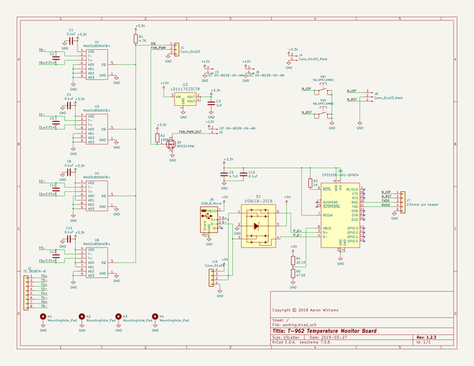
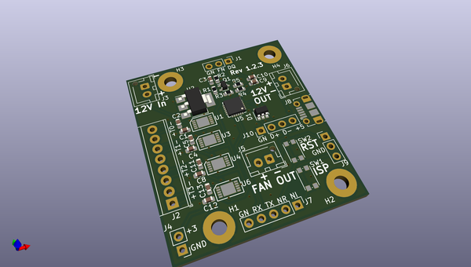
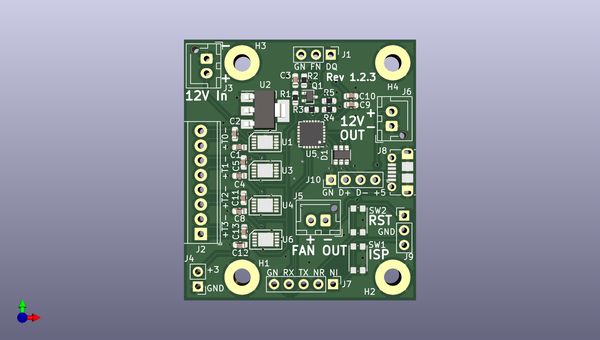
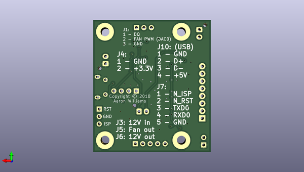

# t_962_temp_fan
 
## summary 
* id: aaronw2_t_962_temp_fan_t962
* user: aaronw2
* name: t_962_temp_fan
* board: t962
* repo: https://github.com/aaronw2/T-962-Temp-Fan
* src_file_repo_kicad_pcb: t962.kicad_pcb
* src_file_repo_kicad_pcb_link: https://github.com/aaronw2/T-962-Temp-Fan/tree/master/t962.kicad_pcb

* src_file_repo_sch: t962.sch
* src_file_repo_sch_link: https://github.com/aaronw2/T-962-Temp-Fan/tree/master/t962.sch
* full details link: https://github.com/oomlout/oomlout_oomp_project_bot_v_2/tree/main/projects/aaronw2_t_962_temp_fan_t962/current_version/working  

## schematic  
  
[schematic (pdf)](working_schematic.pdf) 

## pcb  
 
  
  
  
[board (pdf)](working.pdf)  

## working_bom
| Id | Designator | Footprint | Quantity | Designation | Supplier and ref |  | None | 
| --- | --- | --- | --- | --- | --- | --- | --- | 
| 1 | Q1 | SOT-323_SC-70 | 1 | BSS214NW |  |  | [''] | 
| 2 | C1,C8,C12,C10,C4 | C_0603_1608Metric | 5 | 0.1uF |  |  | [''] | 
| 3 | C9 | C_0603_1608Metric | 1 | 4.7uF |  |  | [''] | 
| 4 | C3 | C_0603_1608Metric | 1 | 1uF |  |  | [''] | 
| 5 | C2,C13,C11,C5 | C_0603_1608Metric | 4 | 0.01uF |  |  | [''] | 
| 6 | U4,U3,U1,U6 | TDFN-10_3x4mm_P0.5mm | 4 | MAX31850KATB+ |  |  | [''] | 
| 7 | R2 | R_0603_1608Metric | 1 | 100K |  |  | [''] | 
| 8 | J7 | PinHeader_1x05_P2.54mm_Vertical | 1 | 2.54mm pin header |  |  | [''] | 
| 9 | J10 | PinHeader_1x04_P2.54mm_Vertical | 1 | Conn_01x04 |  |  | [''] | 
| 10 | J5,J3,J6 | JST_XH_B02B-XH-AM_1x02_P2.50mm_Vertical | 3 | JST XH-B02B-XH-AM |  |  | [''] | 
| 11 | SW1,SW2 | SW_SPST_KMR2 | 2 | SW_SPST_KMR2 |  |  | [''] | 
| 12 | R3 | R_0603_1608Metric | 1 | 1K |  |  | [''] | 
| 13 | R1 | R_0603_1608Metric | 1 | 4.7K |  |  | [''] | 
| 14 | J8 | USB_Micro-B_Molex-105017-0001 | 1 | USB_B_Micro |  |  | [''] | 
| 15 | U5 | QFN-24-1EP_4x4mm_Pitch0.5mm_rounded_corners | 1 | CP2102N-A01-QFN24 |  |  | [''] | 
| 16 | J1 | PinHeader_1x03_P2.54mm_Vertical | 1 | Conn_01x03 |  |  | [''] | 
| 17 | R4 | R_0603_1608Metric | 1 | 22.1K |  |  | [''] | 
| 18 | R5 | R_0603_1608Metric | 1 | 47.5K |  |  | [''] | 
| 19 | J2 | TerminalBlock_TE_282834-8_1x08_P2.54mm_Horizontal | 1 | TE 282834-8 |  |  | [''] | 
| 20 | U2 | SOT-223 | 1 | LD1117S33CTR |  |  | [''] | 
| 21 | J4 | PinHeader_1x02_P2.54mm_Vertical | 1 | Conn_01x02_Male |  |  | [''] | 
| 22 | D1 | SOT-23-6 | 1 | USBLC6-2SC6 |  |  | [''] | 
| 23 | J9 | PinHeader_1x03_P2.54mm_Vertical | 1 | Conn_01x03_Male |  |  | [''] | 

## bom_schematic
| Ref | Qnty | Value | Cmp name | Footprint | Description | Vendor | DNP | 
| --- | --- | --- | --- | --- | --- | --- | --- | 
| C1, C4, C8, C10, C12 | 5 | 0.1uF | C | Capacitor_SMD:C_0603_1608Metric | Unpolarized capacitor |  |  | 
| C2, C5, C11, C13 | 4 | 0.01uF | C | Capacitor_SMD:C_0603_1608Metric | Unpolarized capacitor |  |  | 
| C3 | 1 | 1uF | C | Capacitor_SMD:C_0603_1608Metric | Unpolarized capacitor |  |  | 
| C9 | 1 | 4.7uF | C | Capacitor_SMD:C_0603_1608Metric | Unpolarized capacitor |  |  | 
| D1 | 1 | USBLC6-2SC6 | USBLC6-2SC6-dk_TVS-Diodes | Package_TO_SOT_SMD:SOT-23-6 |  |  |  | 
| H1, H2, H3, H4 | 4 | MountingHole_Pad | MountingHole_Pad | MountingHole:MountingHole_3mm_Pad | Mounting Hole with connection |  |  | 
| J1 | 1 | Conn_01x03 | Conn_01x03 | Connector_PinHeader_2.54mm:PinHeader_1x03_P2.54mm_Vertical | Generic connector, single row, 01x03, script generated (kicad-library-utils/schlib/autogen/connector/) |  |  | 
| J2 | 1 | TE 282834-8 | Conn_01x08 | TerminalBlock_TE-Connectivity:TerminalBlock_TE_282834-8_1x08_P2.54mm_Horizontal | Generic connector, single row, 01x08, script generated (kicad-library-utils/schlib/autogen/connector/) |  |  | 
| J3, J5, J6 | 3 | JST XH-B02B-XH-AM | Conn_01x02_Male-Connector | Connector_JST:JST_XH_B02B-XH-AM_1x02_P2.50mm_Vertical |  |  |  | 
| J4 | 1 | Conn_01x02_Male | Conn_01x02_Male-Connector | Connector_PinHeader_2.54mm:PinHeader_1x02_P2.54mm_Vertical |  |  |  | 
| J7 | 1 | 2.54mm pin header | Conn_01x05 | Connector_PinHeader_2.54mm:PinHeader_1x05_P2.54mm_Vertical | Generic connector, single row, 01x05, script generated (kicad-library-utils/schlib/autogen/connector/) |  |  | 
| J8 | 1 | USB_B_Micro | USB_B_Micro-Connector | Aaron:USB_Micro-B_Molex-105017-0001 |  |  |  | 
| J9 | 1 | Conn_01x03_Male | Conn_01x03_Male-Connector | Connector_PinHeader_2.54mm:PinHeader_1x03_P2.54mm_Vertical |  |  |  | 
| J10 | 1 | Conn_01x04 | Conn_01x04 | Connector_PinHeader_2.54mm:PinHeader_1x04_P2.54mm_Vertical | Generic connector, single row, 01x04, script generated (kicad-library-utils/schlib/autogen/connector/) |  |  | 
| Q1 | 1 | BSS214NW | BSS214NW | Package_TO_SOT_SMD:SOT-323_SC-70 | 20V Vds, 1.5A Id, N-Channel MOSFET, SOT-323 |  |  | 
| R1 | 1 | 4.7K | R | Resistor_SMD:R_0603_1608Metric | Resistor |  |  | 
| R2 | 1 | 100K | R | Resistor_SMD:R_0603_1608Metric | Resistor |  |  | 
| R3 | 1 | 1K | R | Resistor_SMD:R_0603_1608Metric | Resistor |  |  | 
| R4 | 1 | 22.1K | R | Resistor_SMD:R_0603_1608Metric | Resistor |  |  | 
| R5 | 1 | 47.5K | R | Resistor_SMD:R_0603_1608Metric | Resistor |  |  | 
| SW1, SW2 | 2 | SW_SPST_KMR2 | SW_SPST_KMR2-switch_tact_smt | Aaron:SW_SPST_KMR2 |  |  |  | 
| U1, U3, U4, U6 | 4 | MAX31850KATB+ | MAX31850KATB+-Aaron | Aaron:TDFN-10_3x4mm_P0.5mm |  |  |  | 
| U2 | 1 | LD1117S33CTR | LD1117S33CTR-dk_PMIC-Voltage-Regulators-Linear | Package_TO_SOT_SMD:SOT-223 |  |  |  | 
| U5 | 1 | CP2102N-A01-QFN24 | CP2102N-A01-QFN24-cp2102n-a01-qfn24 | Aaron:QFN-24-1EP_4x4mm_Pitch0.5mm_rounded_corners |  |  |  | 

