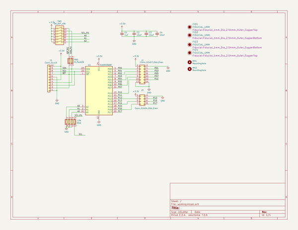
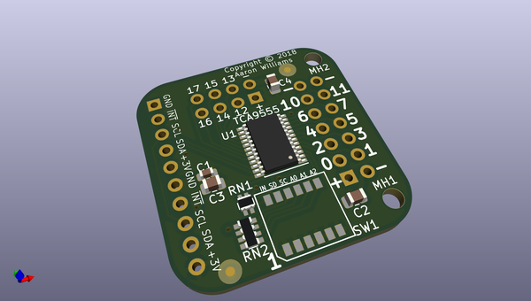
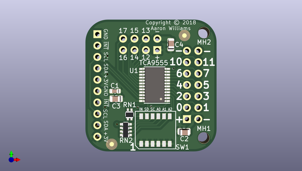
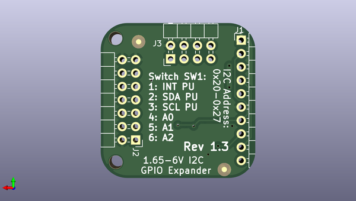

# tca9555a_i2c_gpio_expander
 
## summary 
* id: aaronw2_tca9555a_i2c_gpio_expander_gpio_expander
* user: aaronw2
* name: tca9555a_i2c_gpio_expander
* board: gpio_expander
* repo: https://github.com/aaronw2/tca9555a-i2c-gpio-expander
* src_file_repo_kicad_pcb: gpio-expander.kicad_pcb
* src_file_repo_kicad_pcb_link: https://github.com/aaronw2/tca9555a-i2c-gpio-expander/tree/master/gpio-expander.kicad_pcb

* src_file_repo_sch: gpio-expander.sch
* src_file_repo_sch_link: https://github.com/aaronw2/tca9555a-i2c-gpio-expander/tree/master/gpio-expander.sch
* full details link: https://github.com/oomlout/oomlout_oomp_project_bot_v_2/tree/main/projects/aaronw2_tca9555a_i2c_gpio_expander_gpio_expander/current_version/working  

## schematic  
  
[schematic (pdf)](working_schematic.pdf) 

## pcb  
 
  
  
  
[board (pdf)](working.pdf)  

## working_bom
| Id | Designator | Footprint | Quantity | Designation | Supplier and ref |  | None | 
| --- | --- | --- | --- | --- | --- | --- | --- | 
| 1 | RN2 | R_Array_Convex_4x0603 | 1 | 10k |  |  | [''] | 
| 2 | SW1 | SW_DIP_SPSTx06_Slide_GrayHill_97C06_W4.5mm_P1.27mm | 1 | SW_DIP_x06 |  |  | [''] | 
| 3 | C2,C4,C3 | C_0805_2012Metric | 3 | 10uF |  |  | [''] | 
| 4 | C1 | C_0603_1608Metric | 1 | 1uF |  |  | [''] | 
| 5 | RN1 | R_Array_Concave_2x0603 | 1 | R_Pack02 |  |  | [''] | 
| 6 | U1 | TSSOP-24_4.4x7.8mm_P0.65mm | 1 | TCA9555DBT |  |  | [''] | 
| 7 | J2 | Pin_Header_Angled_2x07_Pitch2.54mm | 1 | Conn_02x07_Odd_Even |  |  | [''] | 
| 8 | J3 | Pin_Header_Angled_2x04_Pitch2.54mm | 1 | Conn_02x04_Odd_Even |  |  | [''] | 
| 9 | J1 | Pin_Header_Angled_1x10_Pitch2.54mm | 1 | Conn_01x10 |  |  | [''] | 

## bom_schematic
| Ref | Qnty | Value | Cmp name | Footprint | Description | Vendor | DNP | 
| --- | --- | --- | --- | --- | --- | --- | --- | 
| C1 | 1 | 1uF | C_Small | Capacitor_SMD:C_0603_1608Metric | Unpolarized capacitor, small symbol |  |  | 
| C2, C3, C4 | 3 | 10uF | C_Small | Capacitor_SMD:C_0805_2012Metric | Unpolarized capacitor, small symbol |  |  | 
| FID1, FID4 | 2 | FIDUCIAL_1MM | FIDUCIAL_1MM-fiducial | Fiducial:Fiducial_1mm_Dia_2.54mm_Outer_CopperTop |  |  |  | 
| FID2, FID3 | 2 | FIDUCIAL_1MM | FIDUCIAL_1MM-fiducial | Fiducial:Fiducial_1mm_Dia_2.54mm_Outer_CopperBottom |  |  |  | 
| J1 | 1 | Conn_01x10 | Conn_01x10 | Pin_Headers:Pin_Header_Angled_1x10_Pitch2.54mm | Generic connector, single row, 01x10, script generated (kicad-library-utils/schlib/autogen/connector/) |  |  | 
| J2 | 1 | Conn_02x07_Odd_Even | Conn_02x07_Odd_Even | Pin_Headers:Pin_Header_Angled_2x07_Pitch2.54mm | Generic connector, double row, 02x07, odd/even pin numbering scheme (row 1 odd numbers, row 2 even numbers), script generated (kicad-library-utils/schlib/autogen/connector/) |  |  | 
| J3 | 1 | Conn_02x04_Odd_Even | Conn_02x04_Odd_Even-Connector | Pin_Headers:Pin_Header_Angled_2x04_Pitch2.54mm |  |  |  | 
| MH1, MH2 | 2 | MountingHole | MountingHole | MountingHole:MountingHole_2.5mm | Mounting Hole without connection |  |  | 
| RN1 | 1 | R_Pack02 | R_Pack02-device | Resistor_SMD:R_Array_Concave_2x0603 |  |  |  | 
| RN2 | 1 | 10k | R_Pack04 | Resistor_SMD:R_Array_Convex_4x0603 | 4 resistor network, parallel topology |  |  | 
| SW1 | 1 | SW_DIP_x06 | SW_DIP_x06 | Aaron:SW_DIP_SPSTx06_Slide_GrayHill_97C06_W4.5mm_P1.27mm | 6x DIP Switch, Single Pole Single Throw (SPST) switch, small symbol |  |  | 
| U1 | 1 | TCA9555DBT | TCA9555DBT | Package_SO:TSSOP-24_4.4x7.8mm_P0.65mm | 16-bit I/O expander, I2C and SMBus interface, interrupts, w/ pull-ups, SSOP-24 |  |  | 

