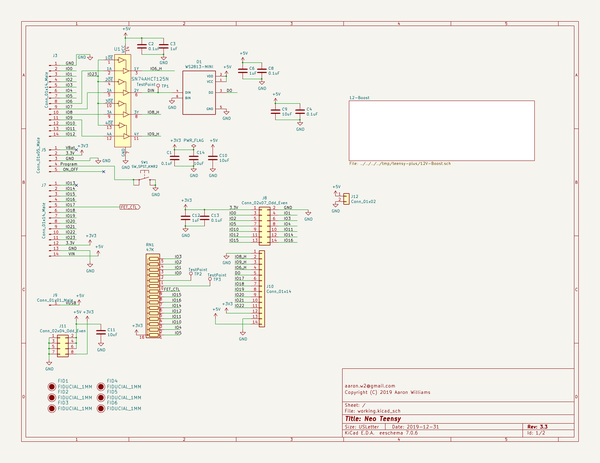
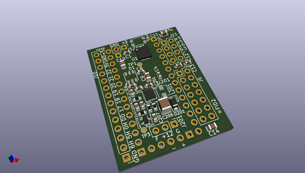
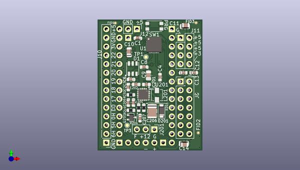
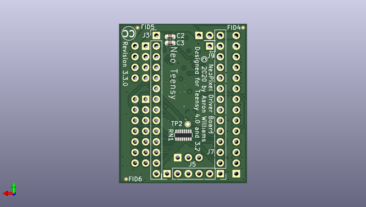

# teensy_plus
 
## summary 
* id: aaronw2_teensy_plus_neo_teensy
* user: aaronw2
* name: teensy_plus
* board: neo_teensy
* repo: https://github.com/aaronw2/teensy-plus
* src_file_repo_kicad_pcb: neo-teensy.kicad_pcb
* src_file_repo_kicad_pcb_link: https://github.com/aaronw2/teensy-plus/tree/master/neo-teensy.kicad_pcb

* src_file_repo_sch: 
* src_file_repo_sch_link: https://github.com/aaronw2/teensy-plus/tree/master/
* full details link: https://github.com/oomlout/oomlout_oomp_project_bot_v_2/tree/main/projects/aaronw2_teensy_plus_neo_teensy/current_version/working  

## schematic  
  
[schematic (pdf)](working_schematic.pdf) 

## pcb  
 
  
  
  
[board (pdf)](working.pdf)  

## working_bom
| Id | Designator | Footprint | Quantity | Designation | Supplier and ref |  | None | 
| --- | --- | --- | --- | --- | --- | --- | --- | 
| 1 | C13,C202,C1,C4,C8,C2 | C_0603_1608Metric | 6 | 0.1uF |  |  | [''] | 
| 2 | J8 | PinHeader_2x07_P2.54mm_Vertical | 1 | Conn_02x07_Odd_Even |  |  | [''] | 
| 3 | J11 | PinHeader_2x04_P2.54mm_Vertical | 1 | Conn_02x04_Odd_Even |  |  | [''] | 
| 4 | J10 | PinHeader_1x14_P2.54mm_Vertical | 1 | Conn_01x14 |  |  | [''] | 
| 5 | D1 | LED_WS2813-MINI-2 | 1 | WS2813-MINI |  |  | [''] | 
| 6 | J12 | PinHeader_1x02_P2.54mm_Vertical | 1 | Conn_01x02 |  |  | [''] | 
| 7 | FID1,FID2,FID3,FID6,FID4,FID5 | Fiducial_0.5mm_Mask1mm | 6 | FIDUCIAL_1MM |  |  | [''] | 
| 8 | C12,C207,C6,C3 | C_0603_1608Metric | 4 | 1uF |  |  | [''] | 
| 9 | C10,C14,C9,C11 | C_0805_2012Metric | 4 | 10uF |  |  | [''] | 
| 10 | U1 | Texas_S-PVQFN-N14 | 1 | SN74AHCT125N |  |  | [''] | 
| 11 | C201 | C_0603_1608Metric | 1 | 22uF |  |  | [''] | 
| 12 | C203 | C_0603_1608Metric | 1 | 22nF |  |  | [''] | 
| 13 | C205 | C_0603_1608Metric | 1 | 47nF |  |  | [''] | 
| 14 | D201 | D_SOD-123F | 1 | SS24FL |  |  | [''] | 
| 15 | L201 | L_Vishay_IHLP-1212 | 1 | 3.3uH |  |  | [''] | 
| 16 | Q201 | SOT-323_SC-70 | 1 | BSS214NW |  |  | [''] | 
| 17 | R202 | R_0603_1608Metric | 1 | 1.62k |  |  | [''] | 
| 18 | R203 | R_0603_1608Metric | 1 | 86.6k |  |  | [''] | 
| 19 | R204 | R_0603_1608Metric | 1 | 10k |  |  | [''] | 
| 20 | U201 | QFN-16-1EP_3x3mm_P0.5mm_EP2.7x2.7mm_ThermalVias | 1 | TPS55340-Q1 |  |  | [''] | 
| 21 | R201 | R_0603_1608Metric | 1 | 18.7K |  |  | [''] | 
| 22 | J201 | PinHeader_1x03_P2.54mm_Vertical | 1 | Conn_01x03 |  |  | [''] | 
| 23 | C204 | C_0603_1608Metric | 1 | 820pF |  |  | [''] | 
| 24 | C206 | C_1210_3225Metric | 1 | 47uF |  |  | [''] | 
| 25 | SW1 | SW_SPST_KMR2 | 1 | SW_SPST_KMR2 |  |  | [''] | 
| 26 | J5 | PinHeader_1x05_P2.54mm_Vertical | 1 | Conn_01x05_Male |  |  | [''] | 
| 27 | J3,J7 | PinHeader_1x14_P2.54mm_Vertical | 2 | Conn_01x14_Male |  |  | [''] | 
| 28 | J9 | PinHeader_1x01_P2.54mm_Vertical | 1 | Conn_01x01_Male |  |  | [''] | 
| 29 | RN1 | R_Array_Convex_8x0602 | 1 | 100K |  |  | [''] | 

## bom_schematic
| Ref | Qnty | Value | Cmp name | Footprint | Description | Vendor | DNP | 
| --- | --- | --- | --- | --- | --- | --- | --- | 
| C1, C2, C4, C8, C13 | 5 | 0.1uF | C | Capacitor_SMD:C_0603_1608Metric | Unpolarized capacitor |  |  | 
| C3, C6, C12 | 3 | 1uF | C | Capacitor_SMD:C_0603_1608Metric | Unpolarized capacitor |  |  | 
| C9, C10, C11, C14 | 4 | 10uF | C | Capacitor_SMD:C_0805_2012Metric | Unpolarized capacitor |  |  | 
| D1 | 1 | WS2813-MINI | WS2813-MINI-WS2813-mini | LED_WS2813-mini:LED_WS2813-MINI-2 |  |  |  | 
| FID1, FID2, FID3, FID4, FID5, FID6 | 6 | FIDUCIAL_1MM | FIDUCIAL_1MM-fiducial | Fiducial:Fiducial_0.5mm_Mask1mm |  |  |  | 
| J3, J7 | 2 | Conn_01x14_Male | Conn_01x14_Male-Connector | Connector_PinHeader_2.54mm:PinHeader_1x14_P2.54mm_Vertical |  |  |  | 
| J5 | 1 | Conn_01x05_Male | Conn_01x05_Male-Connector | Connector_PinHeader_2.54mm:PinHeader_1x05_P2.54mm_Vertical |  |  |  | 
| J8 | 1 | Conn_02x07_Odd_Even | Conn_02x07_Odd_Even | Connector_PinHeader_2.54mm:PinHeader_2x07_P2.54mm_Vertical | Generic connector, double row, 02x07, odd/even pin numbering scheme (row 1 odd numbers, row 2 even numbers), script generated (kicad-library-utils/schlib/autogen/connector/) |  |  | 
| J9 | 1 | Conn_01x01_Male | Conn_01x01_Male-Connector | Connector_PinHeader_2.54mm:PinHeader_1x01_P2.54mm_Vertical |  |  |  | 
| J10 | 1 | Conn_01x14 | Conn_01x14 | Connector_PinHeader_2.54mm:PinHeader_1x14_P2.54mm_Vertical | Generic connector, single row, 01x14, script generated (kicad-library-utils/schlib/autogen/connector/) |  |  | 
| J11 | 1 | Conn_02x04_Odd_Even | Conn_02x04_Odd_Even | Connector_PinHeader_2.54mm:PinHeader_2x04_P2.54mm_Vertical | Generic connector, double row, 02x04, odd/even pin numbering scheme (row 1 odd numbers, row 2 even numbers), script generated (kicad-library-utils/schlib/autogen/connector/) |  |  | 
| J12 | 1 | Conn_01x02 | Conn_01x02 | Connector_PinHeader_2.54mm:PinHeader_1x02_P2.54mm_Vertical | Generic connector, single row, 01x02, script generated (kicad-library-utils/schlib/autogen/connector/) |  |  | 
| RN1 | 1 | 47K | R_Network15-Aaron | Resistor_SMD:R_Array_Convex_8x0602 |  |  |  | 
| SW1 | 1 | SW_SPST_KMR2 | SW_SPST_KMR2-switch_tact_smt | Aaron:SW_SPST_KMR2 |  |  |  | 
| TP1, TP2, TP3 | 3 | TestPoint | TestPoint | TestPoint:TestPoint_Pad_D1.0mm | test point |  |  | 
| U1 | 1 | SN74AHCT125N | SN74AHCT125N-dk_Logic-Buffers-Drivers-Receivers-Transceivers | Package_DFN_QFN:Texas_S-PVQFN-N14 |  |  |  | 

