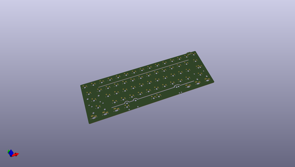
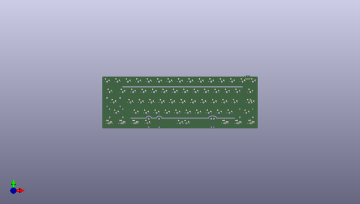
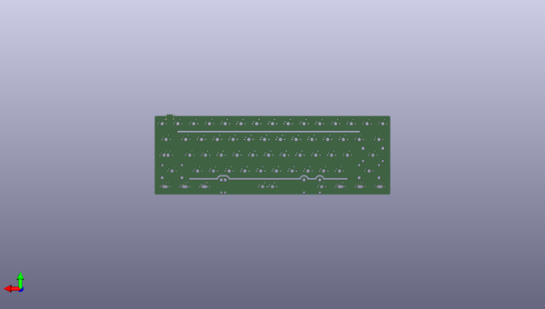

# alioth
 
## summary 
* id: acheronproject_alioth_alioth
* user: acheronproject
* name: alioth
* board: alioth
* repo: https://github.com/AcheronProject/Alioth
* src_file_repo_kicad_pcb: kicad_files/alioth.kicad_pcb
* src_file_repo_kicad_pcb_link: https://github.com/AcheronProject/Alioth/tree/master/kicad_files/alioth.kicad_pcb

* src_file_repo_sch: 
* src_file_repo_sch_link: https://github.com/AcheronProject/Alioth/tree/master/

## pcb  
 
  
  
  
[board (pdf)](working.pdf)  

## working_bom
| Id | Designator | Footprint | Quantity | Designation | Supplier and ref |  | None | 
| --- | --- | --- | --- | --- | --- | --- | --- | 
| 1 | SW62 | MX125 | 1 | RCTRL |  |  | [''] | 
| 2 | D23,D8,D54,D2,D21,D36,D37,D5,D51,D25,D34,D9,D40,D13,D32,D4,D22,D59,D16,D62,D26,D60,D53,D43,D55,D19,D27,D58,D38,D35,D17,D24,D33,D52,D44,D12,D31,D6,D39,D1,D46,D45,D61,D48,D18,D7,D28,D15,D29,D20,D11,D14,D41,D30,D3,D49,D56,D57,D47,D10,D50,D42 | D_SOD-123 | 62 | 1N4148W |  |  | [''] | 
| 3 | SW69 | MX150 | 1 | RCTRL |  |  | [''] | 
| 4 | SW13 | MX100 | 1 | PLUS |  |  | [''] | 
| 5 | SW22 | MX100 | 1 | Y |  |  | [''] | 
| 6 | SW37 | MX100 | 1 | J |  |  | [''] | 
| 7 | SW1 | MX100 | 1 | ESC |  |  | [''] | 
| 8 | SW45 | MX100 | 1 | Z |  |  | [''] | 
| 9 | SW21 | MX100 | 1 | T |  |  | [''] | 
| 10 | SW59 | MX125 | 1 | RALT |  |  | [''] | 
| 11 | SW5 | MX100 | 1 | 4 |  |  | [''] | 
| 12 | SW65 | MX150 | 1 | LALT |  |  | [''] | 
| 13 | SW32 | MX100 | 1 | S |  |  | [''] | 
| 14 | SW36 | MX100 | 1 | H |  |  | [''] | 
| 15 | SW31 | MX100 | 1 | A |  |  | [''] | 
| 16 | SW28 | MX100 | 1 | RBRKT |  |  | [''] | 
| 17 | SW24 | MX100 | 1 | I |  |  | [''] | 
| 18 | SW55 | MX125 | 1 | LCTRL |  |  | [''] | 
| 19 | SW4 | MX100 | 1 | 3 |  |  | [''] | 
| 20 | SW7 | MX100 | 1 | 6 |  |  | [''] | 
| 21 | SW38 | MX100 | 1 | K |  |  | [''] | 
| 22 | SW18 | MX100 | 1 | W |  |  | [''] | 
| 23 | SW46 | MX100 | 1 | X |  |  | [''] | 
| 24 | SW27 | MX100 | 1 | LBRKT |  |  | [''] | 
| 25 | SW42 | MX225R | 1 | ENTER |  |  | [''] | 
| 26 | SW50 | MX100 | 1 | M |  |  | [''] | 
| 27 | SW57 | MX125 | 1 | LALT |  |  | [''] | 
| 28 | SW35 | MX100 | 1 | G |  |  | [''] | 
| 29 | SW8 | MX100 | 1 | 7 |  |  | [''] | 
| 30 | SW56 | MX125 | 1 | LWIN |  |  | [''] | 
| 31 | SW3 | MX100 | 1 | 2 |  |  | [''] | 
| 32 | SW19 | MX100 | 1 | E |  |  | [''] | 
| 33 | SW67 | MX150 | 1 | RALT |  |  | [''] | 
| 34 | SW14 | MX100 | 1 | LBKSP |  |  | [''] | 
| 35 | SW61 | MX125 | 1 | FN |  |  | [''] | 
| 36 | SW63 | MX150 | 1 | LCTRL |  |  | [''] | 
| 37 | SW?B1 | MX100 | 1 | B |  |  | [''] | 
| 38 | SW58 | MX625R | 1 | SPACE |  |  | [''] | 
| 39 | SW52 | MX100 | 1 | DOT |  |  | [''] | 
| 40 | SW30 | MX175 | 1 | CAPS |  |  | [''] | 
| 41 | SW39 | MX100 | 1 | L |  |  | [''] | 
| 42 | SW20 | MX100 | 1 | R |  |  | [''] | 
| 43 | SW49 | MX100 | 1 | N |  |  | [''] | 
| 44 | SW68 | MX100 | 1 | RWIN |  |  | [''] | 
| 45 | J1 | TYPE-C-31-M-12 | 1 | TYPE-C-31-M12_13 |  |  | [''] | 
| 46 | SW41 | MX100 | 1 | APOST |  |  | [''] | 
| 47 | SW12 | MX100 | 1 | MINUS |  |  | [''] | 
| 48 | SW54 | MX275 | 1 | RSHFT |  |  | [''] | 
| 49 | SW11 | MX100 | 1 | 0 |  |  | [''] | 
| 50 | SW51 | MX100 | 1 | COMMA |  |  | [''] | 
| 51 | SW9 | MX100 | 1 | 8 |  |  | [''] | 
| 52 | SW34 | MX100 | 1 | F |  |  | [''] | 
| 53 | SW6 | MX100 | 1 | 5 |  |  | [''] | 
| 54 | SW40 | MX100 | 1 | QUOTE |  |  | [''] | 
| 55 | SW33 | MX100 | 1 | D |  |  | [''] | 
| 56 | SW43 | MX125 | 1 | STEPPED |  |  | [''] | 
| 57 | SW48 | MX100 | 1 | V |  |  | [''] | 
| 58 | SW15 | MX100 | 1 | RBKSP |  |  | [''] | 
| 59 | SW47 | MX100 | 1 | C |  |  | [''] | 
| 60 | SW60 | MX125 | 1 | RWIN |  |  | [''] | 
| 61 | SW23 | MX100 | 1 | U |  |  | [''] | 
| 62 | SW53 | MX100 | 1 | SLASH |  |  | [''] | 
| 63 | SW16 | MX150 | 1 | TAB |  |  | [''] | 
| 64 | SW10 | MX100 | 1 | 9 |  |  | [''] | 
| 65 | SW25 | MX100 | 1 | O |  |  | [''] | 
| 66 | SW26 | MX100 | 1 | P |  |  | [''] | 
| 67 | SW64 | MX100 | 1 | LWIN |  |  | [''] | 
| 68 | SW2 | MX100 | 1 | 1 |  |  | [''] | 
| 69 | SW44 | MX225 | 1 | LSHFT |  |  | [''] | 
| 70 | SW66 | MX700R | 1 | SPACE |  |  | [''] | 
| 71 | SW17 | MX100 | 1 | Q |  |  | [''] | 
| 72 | SW29 | MX150 | 1 | BKSLSH |  |  | [''] | 

## positions
### top
| # Ref | Val | Package | PosX | PosY | Rot | Side | 
| --- | --- | --- | --- | --- | --- | --- | 
| D1 | 1N4148W | D_SOD-123 | 164.6 | 40.8375 | 0.0 | top | 
| D2 | 1N4148W | D_SOD-123 | 147.05 | 37.4875 | 0.0 | top | 
| D3 | 1N4148W | D_SOD-123 | 158.75 | 40.8375 | 0.0 | top | 
| D4 | 1N4148W | D_SOD-123 | 135.35 | 40.8375 | 0.0 | top | 
| D5 | 1N4148W | D_SOD-123 | 152.9 | 44.1875 | 0.0 | top | 
| D6 | 1N4148W | D_SOD-123 | 182.15 | 44.1875 | 0.0 | top | 
| D7 | 1N4148W | D_SOD-123 | 164.6 | 44.1875 | 0.0 | top | 
| D8 | 1N4148W | D_SOD-123 | 147.05 | 40.8375 | 0.0 | top | 
| D9 | 1N4148W | D_SOD-123 | 141.2 | 37.4875 | 0.0 | top | 
| D10 | 1N4148W | D_SOD-123 | 245.62 | 104.6375 | 0.0 | top | 
| D11 | 1N4148W | D_SOD-123 | 135.35 | 37.4875 | 0.0 | top | 
| D12 | 1N4148W | D_SOD-123 | 176.3 | 44.1875 | 0.0 | top | 
| D13 | 1N4148W | D_SOD-123 | 158.75 | 37.4875 | 0.0 | top | 
| D14 | 1N4148W | D_SOD-123 | 141.2 | 44.1875 | 0.0 | top | 
| D15 | 1N4148W | D_SOD-123 | 239.77 | 104.6375 | 0.0 | top | 
| D16 | 1N4148W | D_SOD-123 | 170.45 | 37.4875 | 0.0 | top | 
| D17 | 1N4148W | D_SOD-123 | 152.9 | 40.8375 | 0.0 | top | 
| D18 | 1N4148W | D_SOD-123 | 129.5 | 44.1875 | 0.0 | top | 
| D19 | 1N4148W | D_SOD-123 | 129.5 | 40.8375 | 0.0 | top | 
| D20 | 1N4148W | D_SOD-123 | 239.77 | 101.2875 | 0.0 | top | 
| D21 | 1N4148W | D_SOD-123 | 164.6 | 37.4875 | 0.0 | top | 
| D22 | 1N4148W | D_SOD-123 | 152.9 | 37.4875 | 0.0 | top | 
| D23 | 1N4148W | D_SOD-123 | 135.35 | 44.1875 | 0.0 | top | 
| D24 | 1N4148W | D_SOD-123 | 141.2 | 40.8375 | 0.0 | top | 
| D25 | 1N4148W | D_SOD-123 | 158.75 | 44.1875 | 0.0 | top | 
| D26 | 1N4148W | D_SOD-123 | 147.05 | 44.1875 | 0.0 | top | 
| D27 | 1N4148W | D_SOD-123 | 129.5 | 37.4875 | 0.0 | top | 
| D28 | 1N4148W | D_SOD-123 | 170.45 | 44.1875 | 0.0 | top | 
| D29 | 1N4148W | D_SOD-123 | 170.45 | 40.8375 | 0.0 | top | 
| D30 | 1N4148W | D_SOD-123 | 421.775 | -85.3687 | 0.0 | top | 
| D31 | 1N4148W | D_SOD-123 | 410.075 | -85.3687 | 0.0 | top | 
| D32 | 1N4148W | D_SOD-123 | 410.075 | -88.7188 | 0.0 | top | 
| D33 | 1N4148W | D_SOD-123 | 415.925 | -85.3687 | 0.0 | top | 
| D34 | 1N4148W | D_SOD-123 | 421.775 | -92.0687 | 0.0 | top | 
| D35 | 1N4148W | D_SOD-123 | 415.925 | -88.7188 | 0.0 | top | 
| D36 | 1N4148W | D_SOD-123 | 433.475 | -85.3687 | 0.0 | top | 
| D37 | 1N4148W | D_SOD-123 | 410.075 | -92.0687 | 0.0 | top | 
| D38 | 1N4148W | D_SOD-123 | 427.625 | -85.3687 | 0.0 | top | 
| D39 | 1N4148W | D_SOD-123 | 421.775 | -88.7188 | 0.0 | top | 
| D40 | 1N4148W | D_SOD-123 | 427.625 | -92.0687 | 0.0 | top | 
| D41 | 1N4148W | D_SOD-123 | 415.925 | -92.0687 | 0.0 | top | 
| D42 | 1N4148W | D_SOD-123 | 427.625 | -88.7188 | 0.0 | top | 
| D43 | 1N4148W | D_SOD-123 | 288.425 | 5.1187 | 0.0 | top | 
| D44 | 1N4148W | D_SOD-123 | 276.725 | 1.7687 | 0.0 | top | 
| D45 | 1N4148W | D_SOD-123 | 294.275 | 1.7687 | 0.0 | top | 
| D46 | 1N4148W | D_SOD-123 | 276.725 | 5.1187 | 0.0 | top | 
| D47 | 1N4148W | D_SOD-123 | 294.275 | 5.1187 | 0.0 | top | 
| D48 | 1N4148W | D_SOD-123 | 300.125 | 5.1187 | 0.0 | top | 
| D49 | 1N4148W | D_SOD-123 | 270.875 | 1.7687 | 0.0 | top | 
| D50 | 1N4148W | D_SOD-123 | 311.175 | 7.0187 | 0.0 | top | 
| D51 | 1N4148W | D_SOD-123 | 270.875 | 5.1187 | 0.0 | top | 
| D52 | 1N4148W | D_SOD-123 | 288.425 | 1.7687 | 0.0 | top | 
| D53 | 1N4148W | D_SOD-123 | 282.575 | 1.7687 | 0.0 | top | 
| D54 | 1N4148W | D_SOD-123 | 282.575 | 5.1187 | 0.0 | top | 
| D55 | 1N4148W | D_SOD-123 | 164.6 | -190.1437 | 0.0 | top | 
| D56 | 1N4148W | D_SOD-123 | 170.45 | -190.1437 | 0.0 | top | 
| D57 | 1N4148W | D_SOD-123 | 164.6 | -193.4937 | 0.0 | top | 
| D58 | 1N4148W | D_SOD-123 | 164.6 | -196.8438 | 0.0 | top | 
| D59 | 1N4148W | D_SOD-123 | 212.225 | -184.4125 | 0.0 | top | 
| D60 | 1N4148W | D_SOD-123 | 218.075 | -184.4125 | 0.0 | top | 
| D61 | 1N4148W | D_SOD-123 | 189.51 | -169.9938 | 0.0 | top | 
| D62 | 1N4148W | D_SOD-123 | 212.225 | -187.7625 | 0.0 | top | 
| J1 | TYPE-C-31-M12_13 | TYPE-C-31-M-12 | 269.375 | -24.1375 | 180.0 | top | 
| SW1 | ESC | MX100 | 278.9 | -28.2188 | 0.0 | top | 
| SW2 | 1 | MX100 | 259.85 | -28.2188 | 0.0 | top | 
| SW3 | 2 | MX100 | 240.8 | -28.2188 | 0.0 | top | 
| SW4 | 3 | MX100 | 221.75 | -28.2188 | 0.0 | top | 
| SW5 | 4 | MX100 | 202.7 | -28.2188 | 0.0 | top | 
| SW6 | 5 | MX100 | 183.65 | -28.2188 | 0.0 | top | 
| SW7 | 6 | MX100 | 164.6 | -28.2188 | 0.0 | top | 
| SW8 | 7 | MX100 | 145.55 | -28.2188 | 0.0 | top | 
| SW9 | 8 | MX100 | 126.5 | -28.2188 | 0.0 | top | 
| SW10 | 9 | MX100 | 107.45 | -28.2188 | 0.0 | top | 
| SW11 | 0 | MX100 | 88.4 | -28.2188 | 0.0 | top | 
| SW12 | MINUS | MX100 | 69.35 | -28.2188 | 0.0 | top | 
| SW13 | PLUS | MX100 | 50.3 | -28.2188 | 0.0 | top | 
| SW14 | LBKSP | MX100 | 31.25 | -28.2188 | 0.0 | top | 
| SW15 | RBKSP | MX100 | 12.2 | -28.2188 | 0.0 | top | 
| SW16 | TAB | MX150 | 274.1375 | -47.2687 | 0.0 | top | 
| SW17 | Q | MX100 | 250.325 | -47.2687 | 0.0 | top | 
| SW18 | W | MX100 | 231.275 | -47.2687 | 0.0 | top | 
| SW19 | E | MX100 | 212.225 | -47.2687 | 0.0 | top | 
| SW20 | R | MX100 | 193.175 | -47.2687 | 0.0 | top | 
| SW21 | T | MX100 | 174.125 | -47.2687 | 0.0 | top | 
| SW22 | Y | MX100 | 155.075 | -47.2687 | 0.0 | top | 
| SW23 | U | MX100 | 136.025 | -47.2687 | 0.0 | top | 
| SW24 | I | MX100 | 116.975 | -47.2687 | 0.0 | top | 
| SW25 | O | MX100 | 97.925 | -47.2687 | 0.0 | top | 
| SW26 | P | MX100 | 78.875 | -47.2687 | 0.0 | top | 
| SW27 | LBRKT | MX100 | 59.825 | -47.2687 | 0.0 | top | 
| SW28 | RBRKT | MX100 | 40.775 | -47.2687 | 0.0 | top | 
| SW29 | BKSLSH | MX150 | 16.9625 | -47.2687 | 0.0 | top | 
| SW30 | CAPS | MX175 | 271.7562 | -66.3187 | 0.0 | top | 
| SW31 | A | MX100 | 245.5625 | -66.3187 | 0.0 | top | 
| SW32 | S | MX100 | 226.5125 | -66.3187 | 0.0 | top | 
| SW33 | D | MX100 | 207.4625 | -66.3187 | 0.0 | top | 
| SW34 | F | MX100 | 188.4125 | -66.3187 | 0.0 | top | 
| SW35 | G | MX100 | 169.3625 | -66.3187 | 0.0 | top | 
| SW36 | H | MX100 | 150.3125 | -66.3187 | 0.0 | top | 
| SW37 | J | MX100 | 131.2625 | -66.3187 | 0.0 | top | 
| SW38 | K | MX100 | 112.2125 | -66.3187 | 0.0 | top | 
| SW39 | L | MX100 | 93.1625 | -66.3187 | 0.0 | top | 
| SW40 | QUOTE | MX100 | 74.1125 | -66.3187 | 0.0 | top | 
| SW41 | APOST | MX100 | 55.0625 | -66.3187 | 0.0 | top | 
| SW42 | ENTER | MX225R | 24.1062 | -66.3187 | 0.0 | top | 
| SW43 | STEPPED | MX125 | 276.5188 | -66.3187 | 0.0 | top | 
| SW44 | LSHFT | MX225 | 266.9937 | -85.3687 | 0.0 | top | 
| SW45 | Z | MX100 | 236.0375 | -85.3687 | 0.0 | top | 
| SW46 | X | MX100 | 216.9875 | -85.3687 | 0.0 | top | 
| SW47 | C | MX100 | 197.9375 | -85.3687 | 0.0 | top | 
| SW48 | V | MX100 | 178.8875 | -85.3687 | 0.0 | top | 
| SW49 | N | MX100 | 140.7875 | -85.3687 | 0.0 | top | 
| SW50 | M | MX100 | 121.7375 | -85.3687 | 0.0 | top | 
| SW51 | COMMA | MX100 | 102.6875 | -85.3687 | 0.0 | top | 
| SW52 | DOT | MX100 | 83.6375 | -85.3687 | 0.0 | top | 
| SW53 | SLASH | MX100 | 64.5875 | -85.3687 | 0.0 | top | 
| SW54 | RSHFT | MX275 | 28.8687 | -85.3687 | 0.0 | top | 
| SW55 | LCTRL | MX125 | 276.5188 | -104.4187 | 0.0 | top | 
| SW56 | LWIN | MX125 | 252.7062 | -104.4187 | 0.0 | top | 
| SW57 | LALT | MX125 | 228.8937 | -104.4187 | 0.0 | top | 
| SW58 | SPACE | MX625R | 157.4562 | -104.4187 | 0.0 | top | 
| SW59 | RALT | MX125 | 86.0187 | -104.4187 | 0.0 | top | 
| SW60 | RWIN | MX125 | 62.2062 | -104.4187 | 0.0 | top | 
| SW61 | FN | MX125 | 38.3937 | -104.4187 | 0.0 | top | 
| SW62 | RCTRL | MX125 | 14.5812 | -104.4187 | 0.0 | top | 
| SW63 | LCTRL | MX150 | 274.1375 | -104.4187 | 0.0 | top | 
| SW64 | LWIN | MX100 | 250.325 | -104.4187 | 0.0 | top | 
| SW65 | LALT | MX150 | 226.5125 | -104.4187 | 0.0 | top | 
| SW66 | SPACE | MX700R | 145.55 | -104.4187 | 0.0 | top | 
| SW67 | RALT | MX150 | 64.5875 | -104.4187 | 0.0 | top | 
| SW68 | RWIN | MX100 | 40.775 | -104.4187 | 0.0 | top | 
| SW69 | RCTRL | MX150 | 16.9625 | -104.4187 | 0.0 | top | 
| SW?B1 | B | MX100 | 159.8375 | -85.3687 | 0.0 | top | 

### bottom
no data
