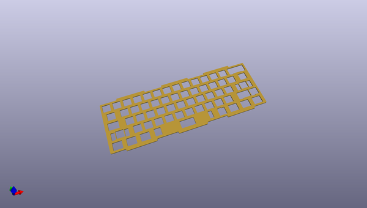
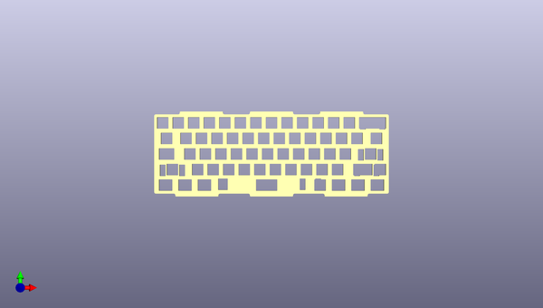
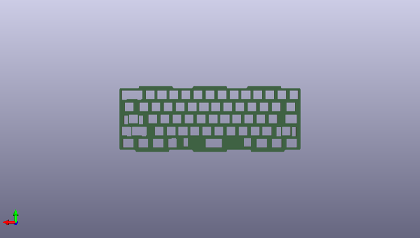

# alioth
 
## summary 
* id: acheronproject_alioth_polaris_ansi_plate
* user: acheronproject
* name: alioth
* board: polaris_ansi_plate
* repo: https://github.com/AcheronProject/Alioth
* src_file_repo_kicad_pcb: polaris_plates/polaris_ansi_plate.kicad_pcb
* src_file_repo_kicad_pcb_link: https://github.com/AcheronProject/Alioth/tree/master/polaris_plates/polaris_ansi_plate.kicad_pcb

* src_file_repo_sch: 
* src_file_repo_sch_link: https://github.com/AcheronProject/Alioth/tree/master/

## pcb  
 
  
  
  
[board (pdf)](working.pdf)  

## working_bom
| Id | Designator | Footprint | Quantity | Designation | Supplier and ref |  | None | 
| --- | --- | --- | --- | --- | --- | --- | --- | 
| 1 | REF**,REF**,REF**,REF**,REF**,REF**,REF**,REF**,REF**,REF**,REF**,REF**,REF**,REF**,REF**,REF**,REF**,REF**,REF**,REF**,REF**,REF**,REF**,REF**,REF**,REF**,REF**,REF**,REF**,REF**,REF**,REF**,REF**,REF**,REF**,REF**,REF**,REF**,REF**,REF**,REF**,REF**,REF**,REF**,REF**,REF** | MX100 | 46 | MX100 |  |  | [''] | 
| 2 | REF**,REF** | MX150 | 2 | MX150 |  |  | [''] | 
| 3 | REF**,REF** | MX225 | 2 | MX225 |  |  | [''] | 

## positions
### top
| # Ref | Val | Package | PosX | PosY | Rot | Side | 
| --- | --- | --- | --- | --- | --- | --- | 
| REF** | MX100 | MX100 | 96.8567 | -45.3 | 0.0 | top | 
| REF** | MX100 | MX100 | 249.2567 | -45.3 | 0.0 | top | 
| REF** | MX100 | MX100 | 101.6192 | -102.45 | 0.0 | top | 
| REF** | MX100 | MX100 | 58.7567 | -45.3 | 0.0 | top | 
| REF** | MX100 | MX100 | 49.2317 | -64.35 | 0.0 | top | 
| REF** | MX100 | MX100 | 106.3817 | -64.35 | 0.0 | top | 
| REF** | MX100 | MX100 | 139.7192 | -102.45 | 0.0 | top | 
| REF** | MX100 | MX100 | 163.5317 | -64.35 | 0.0 | top | 
| REF** | MX100 | MX100 | 92.0943 | -83.4 | 0.0 | top | 
| REF** | MX100 | MX100 | 158.7692 | -102.45 | 0.0 | top | 
| REF** | MX100 | MX100 | 230.2067 | -45.3 | 0.0 | top | 
| REF** | MX100 | MX100 | 234.9692 | -102.45 | 0.0 | top | 
| REF** | MX100 | MX100 | 206.3942 | -83.4 | 0.0 | top | 
| REF** | MX100 | MX100 | 120.6692 | -102.45 | 0.0 | top | 
| REF** | MX150 | MX150 | 25.4192 | -64.35 | 0.0 | top | 
| REF** | MX150 | MX150 | 282.5942 | -64.35 | 0.0 | top | 
| REF** | MX100 | MX100 | 258.7817 | -64.35 | 0.0 | top | 
| REF** | MX100 | MX100 | 177.8192 | -102.45 | 0.0 | top | 
| REF** | MX100 | MX100 | 82.5692 | -102.45 | 0.0 | top | 
| REF** | MX100 | MX100 | 77.8067 | -45.3 | 0.0 | top | 
| REF** | MX100 | MX100 | 196.8692 | -102.45 | 0.0 | top | 
| REF** | MX100 | MX100 | 201.6317 | -64.35 | 0.0 | top | 
| REF** | MX100 | MX100 | 192.1068 | -45.3 | 0.0 | top | 
| REF** | MX100 | MX100 | 182.5817 | -64.35 | 0.0 | top | 
| REF** | MX100 | MX100 | 211.1567 | -45.3 | 0.0 | top | 
| REF** | MX100 | MX100 | 125.4317 | -64.35 | 0.0 | top | 
| REF** | MX100 | MX100 | 63.5192 | -102.45 | 0.0 | top | 
| REF** | MX100 | MX100 | 215.9192 | -102.45 | 0.0 | top | 
| REF** | MX100 | MX100 | 39.7067 | -45.3 | 0.0 | top | 
| REF** | MX225 | MX225 | 275.4505 | -83.4 | 0.0 | top | 
| REF** | MX100 | MX100 | 154.0067 | -45.3 | 0.0 | top | 
| REF** | MX100 | MX100 | 144.4818 | -64.35 | 0.0 | top | 
| REF** | MX100 | MX100 | 53.9943 | -83.4 | 0.0 | top | 
| REF** | MX225 | MX225 | 32.563 | -102.45 | 0.0 | top | 
| REF** | MX100 | MX100 | 68.2818 | -64.35 | 0.0 | top | 
| REF** | MX100 | MX100 | 73.0442 | -83.4 | 0.0 | top | 
| REF** | MX100 | MX100 | 220.6817 | -64.35 | 0.0 | top | 
| REF** | MX100 | MX100 | 87.3317 | -64.35 | 0.0 | top | 
| REF** | MX100 | MX100 | 244.4942 | -83.4 | 0.0 | top | 
| REF** | MX100 | MX100 | 134.9567 | -45.3 | 0.0 | top | 
| REF** | MX100 | MX100 | 168.2943 | -83.4 | 0.0 | top | 
| REF** | MX100 | MX100 | 149.2442 | -83.4 | 0.0 | top | 
| REF** | MX100 | MX100 | 173.0567 | -45.3 | 0.0 | top | 
| REF** | MX100 | MX100 | 187.3442 | -83.4 | 0.0 | top | 
| REF** | MX100 | MX100 | 225.4442 | -83.4 | 0.0 | top | 
| REF** | MX100 | MX100 | 115.9067 | -45.3 | 0.0 | top | 
| REF** | MX100 | MX100 | 239.7317 | -64.35 | 0.0 | top | 
| REF** | MX100 | MX100 | 130.1942 | -83.4 | 0.0 | top | 
| REF** | MX100 | MX100 | 111.1442 | -83.4 | 0.0 | top | 
| REF** | MX100 | MX100 | 20.6567 | -45.3 | 0.0 | top | 

### bottom
no data
