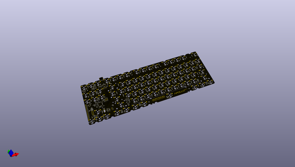
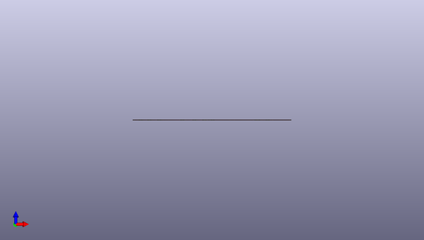

# apollo87h
 
## summary 
* id: acheronproject_apollo87h_apollo87h
* user: acheronproject
* name: apollo87h
* board: apollo87h
* repo: https://github.com/AcheronProject/Apollo87H
* src_file_repo_kicad_pcb: kicad_files/apollo87h.kicad_pcb
* src_file_repo_kicad_pcb_link: https://github.com/AcheronProject/Apollo87H/tree/main/kicad_files/apollo87h.kicad_pcb
* src_file_repo_kicad_sch: kicad_files/apollo87h.kicad_sch
* src_file_repo_kicad_sch_link: https://github.com/AcheronProject/Apollo87H/tree/main/kicad_files/apollo87h.kicad_sch

* src_file_repo_sch: 
* src_file_repo_sch_link: https://github.com/AcheronProject/Apollo87H/tree/main/

## pcb  
 
  
  
  
[board (pdf)](working.pdf)  

## working_bom
| Id | Designator | Footprint | Quantity | Designation | Supplier and ref |  | None | 
| --- | --- | --- | --- | --- | --- | --- | --- | 
| 1 | R67,R76,R28,R23,R30,R43,R63,R41,R78,R20,R31,R45,R54,R60,R77,R14,R92,R39,R61,R21,R58,R42,R34,R81,R66,R27,R56,R37,R59,R18,R36,R19,R51,R69,R32,R65,R35,R17,R73,R85,R84,R13,R75,R91,R22,R95,R48,R82,R74,R98,R44,R50,R64,R94,R57,R33,R93,R38,R96,R24,R40,R55,R88,R86,R89,R83,R49,R25,R29,R90,R72,R53,R47,R70,R46,R68,R71,R52,R16,R80,R99,R26,R97,R62,R87,R79,R15 | R_0402_1005Metric_1 | 87 | 5.1R |  |  | [''] | 
| 2 | F1 | Fuse_1812_4532Metric | 1 | mSMD110-16V |  |  | [''] | 
| 3 | D20,D84,D31,D1,D18,D27,D38,D30,D4,D75,D39,D37,D21,D3,D52,D8,D64,D58,D10,D7,D28,D59,D25,D5,D14,D82,D15,D87,D73,D16,D80,D57,D88,D76,D33,D46,D69,D11,D29,D67,D32,D83,D72,D49,D9,D54,D65,D89,D60,D74,D19,D34,D86,D17,D47,D12,D56,D78,D77,D79,D24,D26,D23,D40,D71,D62,D66,D53,D22,D42,D50,D45,D85,D55,D51,D48,D44,D41,D6,D63,D13,D36,D61,D43,D81,D35,D70,D68 | D_SOD-123 | 88 | 1N4148W |  |  | [''] | 
| 4 | SW50,SW8,SW20,SW14,SW72,SW3,SW66,SW53,SW12,SW9,SW77,SW62,SW13,SW24,SW36,SW63,SW47,SW57,SW69,SW67,SW54,SW11,SW56,SW34,SW21,SW60,SW71,SW87,SW44,SW2,SW33,SW61,SW19,SW32,SW73,SW10,SW39,SW40,SW7,SW86,SW45,SW51,SW75,SW59,SW26,SW29,SW46,SW58,SW41,SW4,SW6,SW23,SW43,SW88,SW37,SW42,SW68,SW74,SW30,SW18,SW15,SW16,SW55,SW70,SW22,SW27,SW28,SW5,SW49,SW25,SW38,SW17 | MX100H | 72 | CPG151101S11 |  |  | [''] | 
| 5 | D166,D116,D145,D159,D126,D92,D109,D91,D157,D104,D136,D94,D122,D135,D132,D103,D119,D134,D167,D96,D152,D121,D107,D101,D138,D112,D99,D141,D105,D113,D162,D168,D163,D111,D95,D172,D97,D155,D114,D173,D106,D108,D175,D128,D127,D93,D154,D149,D133,D151,D129,D160,D153,D176,D144,D137,D100,D139,D124,D171,D143,D164,D150,D174,D148,D169,D117,D130,D90,D146,D165,D98,D147,D156,D140,D161,D115,D110,D123,D170,D102,D118,D158,D131,D120,D125,D142 | SK6812MINI_3535_6028_3.2x2.8mm_Round | 87 | SK6812MINI-E |  |  | [''] | 
| 6 | C21,C42,C79,C64,C56,C31,C46,C53,C91,C93,C59,C94,C78,C62,C99,C27,C23,C69,C49,C51,C101,C50,C87,C33,C103,C70,C83,C100,C80,C45,C76,C54,C96,C57,C30,C97,C43,C74,C77,C24,C32,C44,C63,C92,C81,C37,C28,C68,C36,C39,C82,C26,C89,C61,C71,C47,C58,C34,C72,C29,C52,C55,C105,C98,C75,C88,C65,C104,C85,C90,C48,C19,C40,C41,C60,C67,C20,C66,C22,C25,C73,C95,C38,C102,C86,C84,C35 | C_0402_1005Metric_1 | 87 | 100n |  |  | [''] | 
| 7 | SW52 | MX175H | 1 | CPG151101S11 |  |  | [''] | 
| 8 | C2 | C_0805_2012Metric | 1 | 10u |  |  | [''] | 
| 9 | SW79,SW80,SW78,SW83,SW82 | MX125H | 5 | CPG151101S11 |  |  | [''] | 
| 10 | C13 | CP_EIA-3216-10_Kemet-I_Pad1.58x1.35mm_HandSolder | 1 | 10u |  |  | [''] | 
| 11 | C16,C11 | C_0402_1005Metric | 2 | 4.7u |  |  | [''] | 
| 12 | FB2,FB1 | L_0805_2012Metric | 2 | CBW201209U121T |  |  | [''] | 
| 13 | C18,C17,C1,C3 | C_0805_2012Metric | 4 | 100n |  |  | [''] | 
| 14 | U3 | TSSOP-8_4.4x3mm_P0.65mm | 1 | BL24C256A-SFRC |  |  | [''] | 
| 15 | SW81 | MX625HR | 1 | CPG151101S11 |  |  | [''] | 
| 16 | C7,C8,C14,C15,C6 | C_0402_1005Metric | 5 | 100n |  |  | [''] | 
| 17 | SW64 | MX225HR | 1 | CPG151101S11 |  |  | [''] | 
| 18 | SW1 | K2-1187SQ-A4SW-06 | 1 | K2-1187SQ-A4SW-06 |  |  | [''] | 
| 19 | C9,C10 | C_0402_1005Metric | 2 | 15p |  |  | [''] | 
| 20 | R3 | R_0805_2012Metric | 1 | 100R |  |  | [''] | 
| 21 | U5 | SOT-23-6 | 1 | TXS0101DBVR |  |  | [''] | 
| 22 | J3,J2 | SM04B-SRSS-TB(LF)(SN)_mounting-reliefs | 2 | SM04B-SRSS-TB(LF)(SN) |  |  | [''] | 
| 23 | U4 | LQFP-64_10x10mm_P0.5mm | 1 | STM32F401RCT6 |  |  | [''] | 
| 24 | R12 | R_0805_2012Metric | 1 | 10k |  |  | [''] | 
| 25 | C12 | C_0402_1005Metric | 1 | 10n |  |  | [''] | 
| 26 | Y1 | Crystal_SMD_3225-4Pin_3.2x2.5mm | 1 | TAXM8M4RFDCET2T |  |  | [''] | 
| 27 | SW35,SW48 | MX150H | 2 | CPG151101S11 |  |  | [''] | 
| 28 | R11 | R_0402_1005Metric | 1 | 1.5k |  |  | [''] | 
| 29 | R9,R10 | R_0402_1005Metric | 2 | 4.7k |  |  | [''] | 
| 30 | U2 | SOT-23 | 1 | MCP1700T-3302E/TT |  |  | [''] | 
| 31 | SW31 | MX200H | 1 | CPG151101S11 |  |  | [''] | 
| 32 | C4,C5 | C_0805_2012Metric | 2 | 1u |  |  | [''] | 
| 33 | D2 | D_SOD-123 | 1 | RB060M-60TR |  |  | [''] | 
| 34 | R8 | R_0805_2012Metric | 1 | 10k |  |  | [''] | 
| 35 | SW65 | MX225H | 1 | CPG151101S11 |  |  | [''] | 
| 36 | R7,R6 | R_0805_2012Metric | 2 | 100k |  |  | [''] | 
| 37 | R5 | R_0805_2012Metric | 1 | 1M |  |  | [''] | 
| 38 | SW76 | MX275H | 1 | CPG151101S11 |  |  | [''] | 
| 39 | R4 | R_0805_2012Metric | 1 | 330k |  |  | [''] | 
| 40 | Q1 | SOT-23 | 1 | DTC123JKAT146 |  |  | [''] | 
| 41 | H2,H5,H1,H6,H7,H8,H4,H3 | 9774035243R | 8 | 9774035243R |  |  | [''] | 
| 42 | U1 | SOT-23-6 | 1 | USBLC6-2SC6 |  |  | [''] | 
| 43 | R2,R1 | R_0805_2012Metric | 2 | 5.1k |  |  | [''] | 
| 44 | J1 | TYPE-C-31-M-12 | 1 | TYPE-C-31-M12 |  |  | [''] | 

## bom_schematic
| Ref | Qnty | Value | Cmp name | Footprint | Description | Vendor | DNP | 
| --- | --- | --- | --- | --- | --- | --- | --- | 
| C1, C3, C17, C18 | 4 | 100n | C | Capacitor_SMD:C_0805_2012Metric | Unpolarized capacitor |  |  | 
| C2 | 1 | 10u | C_Small | Capacitor_SMD:C_0805_2012Metric | Unpolarized capacitor, small symbol |  |  | 
| C4, C5 | 2 | 1u | C | Capacitor_SMD:C_0805_2012Metric | Unpolarized capacitor |  |  | 
| C6, C7, C8, C14, C15 | 5 | 100n | C_Small | Capacitor_SMD:C_0402_1005Metric | Unpolarized capacitor, small symbol |  |  | 
| C9, C10 | 2 | 15p | C_Small | Capacitor_SMD:C_0402_1005Metric | Unpolarized capacitor, small symbol |  |  | 
| C11, C16 | 2 | 4.7u | C_Small | Capacitor_SMD:C_0402_1005Metric | Unpolarized capacitor, small symbol |  |  | 
| C12 | 1 | 10n | C_Small | Capacitor_SMD:C_0402_1005Metric | Unpolarized capacitor, small symbol |  |  | 
| C13 | 1 | 10u | CP1 | acheron_Components:CP_EIA-3216-10_Kemet-I_Pad1.58x1.35mm_HandSolder | Polarized capacitor, US symbol |  |  | 
| C19, C20, C21, C22, C23, C24, C25, C26, C27, C28, C29, C30, C31, C32, C33, C34, C35, C36, C37, C38, C39, C40, C41, C42, C43, C44, C45, C46, C47, C48, C49, C50, C51, C52, C53, C54, C55, C56, C57, C58, C59, C60, C61, C62, C63, C64, C65, C66, C67, C68, C69, C70, C71, C72, C73, C74, C75, C76, C77, C78, C79, C80, C81, C82, C83, C84, C85, C86, C87, C88, C89, C90, C91, C92, C93, C94, C95, C96, C97, C98, C99, C100, C101, C102, C103, C104, C105 | 87 | 100n | C_Small | apollo87h_kicad_library:C_0402_1005Metric_1 | Unpolarized capacitor, small symbol |  |  | 
| D1, D3, D4, D5, D6, D7, D8, D9, D10, D11, D12, D13, D14, D15, D16, D17, D18, D19, D20, D21, D22, D23, D24, D25, D26, D27, D28, D29, D30, D31, D32, D33, D34, D35, D36, D37, D38, D39, D40, D41, D42, D43, D44, D45, D46, D47, D48, D49, D50, D51, D52, D53, D54, D55, D56, D57, D58, D59, D60, D61, D62, D63, D64, D65, D66, D67, D68, D69, D70, D71, D72, D73, D74, D75, D76, D77, D78, D79, D80, D81, D82, D83, D84, D85, D86, D87, D88, D89 | 88 | 1N4148W | D | acheron_Components:D_SOD-123 | Diode |  |  | 
| D2 | 1 | RB060M-60TR | D_Schottky | acheron_Components:D_SOD-123 | Schottky diode |  |  | 
| D90, D91, D92, D93, D94, D95, D96, D97, D98, D99, D100, D101, D102, D103, D104, D105, D106, D107, D108, D109, D110, D111, D112, D113, D114, D115, D116, D117, D118, D119, D120, D121, D122, D123, D124, D125, D126, D127, D128, D129, D130, D131, D132, D133, D134, D135, D136, D137, D138, D139, D140, D141, D142, D143, D144, D145, D146, D147, D148, D149, D150, D151, D152, D153, D154, D155, D156, D157, D158, D159, D160, D161, D162, D163, D164, D165, D166, D167, D168, D169, D170, D171, D172, D173, D174, D175, D176 | 87 | SK6812MINI-E | SK6812MINI-E | acheron_Components:SK6812MINI_3535_6028_3.2x2.8mm_Round |  |  |  | 
| F1 | 1 | mSMD110-16V | Fuse | Fuse:Fuse_1812_4532Metric | Fuse |  |  | 
| FB1, FB2 | 2 | CBW201209U121T | Ferrite_Bead_Small | Inductor_SMD:L_0805_2012Metric | Ferrite bead, small symbol |  |  | 
| H1, H2, H3, H4, H5, H6, H7, H8 | 8 | 9774035243R | MountingHole | acheron_Hardware:9774035243R | Mounting Hole without connection |  |  | 
| J1 | 1 | TYPE-C-31-M12 | USB_C_16_pin | acheron_Connectors:TYPE-C-31-M-12 | 16-pin USB type C (USB 2.0) connector |  |  | 
| J2, J3 | 2 | SM04B-SRSS-TB(LF)(SN) | Conn_01x04_MountingPin | acheron_Connectors:SM04B-SRSS-TB(LF)(SN)_mounting-reliefs | Generic connectable mounting pin connector, single row, 01x04, script generated (kicad-library-utils/schlib/autogen/connector/) |  |  | 
| Q1 | 1 | DTC123JKAT146 | DTC123J | Package_TO_SOT_SMD:SOT-23 |  |  |  | 
| R1, R2 | 2 | 5.1k | R_Small | Resistor_SMD:R_0805_2012Metric | Resistor, small symbol |  |  | 
| R3 | 1 | 100R | R_Small | Resistor_SMD:R_0805_2012Metric | Resistor, small symbol |  |  | 
| R4 | 1 | 330k | R_Small | Resistor_SMD:R_0805_2012Metric | Resistor, small symbol |  |  | 
| R5 | 1 | 1M | R_Small | Resistor_SMD:R_0805_2012Metric | Resistor, small symbol |  |  | 
| R6, R7 | 2 | 100k | R | Resistor_SMD:R_0805_2012Metric | Resistor |  |  | 
| R8 | 1 | 10k | R_Small | Resistor_SMD:R_0805_2012Metric | Resistor, small symbol |  |  | 
| R9, R10 | 2 | 4.7k | R_Small | Resistor_SMD:R_0402_1005Metric | Resistor, small symbol |  |  | 
| R11 | 1 | 1.5k | R_Small | acheron_Components:R_0402_1005Metric | Resistor, small symbol |  |  | 
| R12 | 1 | 10k | R_Small | apollo87h_kicad_library:R_0805_2012Metric | Resistor, small symbol |  |  | 
| R13, R14, R15, R16, R17, R18, R19, R20, R21, R22, R23, R24, R25, R26, R27, R28, R29, R30, R31, R32, R33, R34, R35, R36, R37, R38, R39, R40, R41, R42, R43, R44, R45, R46, R47, R48, R49, R50, R51, R52, R53, R54, R55, R56, R57, R58, R59, R60, R61, R62, R63, R64, R65, R66, R67, R68, R69, R70, R71, R72, R73, R74, R75, R76, R77, R78, R79, R80, R81, R82, R83, R84, R85, R86, R87, R88, R89, R90, R91, R92, R93, R94, R95, R96, R97, R98, R99 | 87 | 5.1R | R_Small | apollo87h_kicad_library:R_0402_1005Metric_1 | Resistor, small symbol |  |  | 
| SW1 | 1 | K2-1187SQ-A4SW-06 | SW_SPST | acheron_Hardware:K2-1187SQ-A4SW-06 | Single Pole Single Throw (SPST) switch |  |  | 
| SW2, SW3, SW4, SW5, SW6, SW7, SW8, SW9, SW10, SW11, SW12, SW13, SW14, SW15, SW16, SW17, SW18, SW19, SW20, SW21, SW22, SW23, SW24, SW25, SW26, SW27, SW28, SW29, SW30, SW32, SW33, SW34, SW36, SW37, SW38, SW39, SW40, SW41, SW42, SW43, SW44, SW45, SW46, SW47, SW49, SW50, SW51, SW53, SW54, SW55, SW56, SW57, SW58, SW59, SW60, SW61, SW62, SW63, SW66, SW67, SW68, SW69, SW70, SW71, SW72, SW73, SW74, SW75, SW77, SW86, SW87, SW88 | 72 | CPG151101S11 | Mechanical_Switch | acheron_MXH:MX100H | Keyboard mechanical switch |  |  | 
| SW31 | 1 | CPG151101S11 | Mechanical_Switch | acheron_MXH:MX200H | Keyboard mechanical switch |  |  | 
| SW35, SW48 | 2 | CPG151101S11 | Mechanical_Switch | acheron_MXH:MX150H | Keyboard mechanical switch |  |  | 
| SW52 | 1 | CPG151101S11 | Mechanical_Switch | acheron_MXH:MX175H | Keyboard mechanical switch |  |  | 
| SW64 | 1 | CPG151101S11 | Mechanical_Switch | acheron_MXH:MX225HR | Keyboard mechanical switch |  |  | 
| SW65 | 1 | CPG151101S11 | Mechanical_Switch | acheron_MXH:MX225H | Keyboard mechanical switch |  |  | 
| SW76 | 1 | CPG151101S11 | Mechanical_Switch | acheron_MXH:MX275H | Keyboard mechanical switch |  |  | 
| SW78, SW79, SW80, SW82, SW83 | 5 | CPG151101S11 | Mechanical_Switch | acheron_MXH:MX125H | Keyboard mechanical switch |  |  | 
| SW81 | 1 | CPG151101S11 | Mechanical_Switch | acheron_MXH:MX625HR | Keyboard mechanical switch |  |  | 
| U1 | 1 | USBLC6-2SC6 | USBLC6-2SC6 | acheron_Components:SOT-23-6 | Very low capacitance ESD protection diode, 2 data-line, SOT-23-6 |  |  | 
| U2 | 1 | MCP1700T-3302E/TT | MCP1700-3302E_SOT23 | Package_TO_SOT_SMD:SOT-23 | 250mA Low Quiscent Current LDO, 3.3V output, SOT-23 |  |  | 
| U3 | 1 | BL24C256A-SFRC | 24LC256 | acheron_Components:TSSOP-8_4.4x3mm_P0.65mm | I2C Serial EEPROM, 256Kb, DIP-8/SOIC-8/TSSOP-8/DFN-8 |  |  | 
| U4 | 1 | STM32F401RCT6 | STM32F401-LQFP64 | acheron_Components:LQFP-64_10x10mm_P0.5mm | 32-bit 256kBytes flash ARM Cortex-M4  microcontroller |  |  | 
| U5 | 1 | TXS0101DBVR | TXS0101 | acheron_Components:SOT-23-6 | 1-bit bidirectional level shifting voltage level translator |  |  | 
| Y1 | 1 | TAXM8M4RFDCET2T | Crystal_GND24 | acheron_Components:Crystal_SMD_3225-4Pin_3.2x2.5mm | Four pin crystal, GND on pins 2 and 4 |  |  | 

## positions
### top
| # Ref | Val | Package | PosX | PosY | Rot | Side | 
| --- | --- | --- | --- | --- | --- | --- | 
| C1 | 100n | C_0805_2012Metric | -231.8004 | -71.6 | 0.0 | top | 
| C2 | 10u | C_0805_2012Metric | -229.8004 | -87.8 | 90.0 | top | 
| C3 | 100n | C_0805_2012Metric | -323.2004 | -53.8 | 0.0 | top | 
| C4 | 1u | C_0805_2012Metric | -289.6 | -12.4875 | 90.0 | top | 
| C5 | 1u | C_0805_2012Metric | -306.8004 | -11.2 | -90.0 | top | 
| C6 | 100n | C_0402_1005Metric | -306.2004 | -55.825 | 0.0 | top | 
| C7 | 100n | C_0402_1005Metric | -307.8004 | -58.0 | 180.0 | top | 
| C8 | 100n | C_0402_1005Metric | -291.6004 | -57.0 | 0.0 | top | 
| C9 | 15p | C_0402_1005Metric | -315.317 | -60.096 | -90.0 | top | 
| C10 | 15p | C_0402_1005Metric | -310.2398 | -61.27 | 90.0 | top | 
| C11 | 4.7u | C_0402_1005Metric | -309.0004 | -65.473 | -90.0 | top | 
| C12 | 10n | C_0402_1005Metric | -307.7504 | -65.473 | -90.0 | top | 
| C13 | 10u | CP_EIA-3216-10_Kemet-I_Pad1.58x1.35mm_HandSolder | -286.813 | -55.6325 | -90.0 | top | 
| C14 | 100n | C_0402_1005Metric | -302.3254 | -71.05 | 0.0 | top | 
| C15 | 100n | C_0402_1005Metric | -292.1254 | -70.45 | 90.0 | top | 
| C16 | 4.7u | C_0402_1005Metric | -295.2004 | -71.8 | 90.0 | top | 
| C17 | 100n | C_0805_2012Metric | -326.9894 | -11.0556 | -90.0 | top | 
| C18 | 100n | C_0805_2012Metric | -331.6004 | -14.4375 | 0.0 | top | 
| C19 | 100n | C_0402_1005Metric_1 | 4.8121 | -4.35 | -90.0 | top | 
| C20 | 100n | C_0402_1005Metric_1 | -33.2879 | -4.35 | -90.0 | top | 
| C21 | 100n | C_0402_1005Metric_1 | -52.3379 | -4.35 | -90.0 | top | 
| C22 | 100n | C_0402_1005Metric_1 | -71.3879 | -4.35 | -90.0 | top | 
| C23 | 100n | C_0402_1005Metric_1 | -90.4379 | -4.35 | -90.0 | top | 
| C24 | 100n | C_0402_1005Metric_1 | -119.0129 | -4.35 | -90.0 | top | 
| C25 | 100n | C_0402_1005Metric_1 | -138.0629 | -4.35 | -90.0 | top | 
| C26 | 100n | C_0402_1005Metric_1 | -157.1129 | -4.35 | -90.0 | top | 
| C27 | 100n | C_0402_1005Metric_1 | -176.1629 | -4.35 | -90.0 | top | 
| C28 | 100n | C_0402_1005Metric_1 | -204.7379 | -4.35 | -90.0 | top | 
| C29 | 100n | C_0402_1005Metric_1 | -223.7879 | -4.35 | -90.0 | top | 
| C30 | 100n | C_0402_1005Metric_1 | -242.8379 | -4.35 | -90.0 | top | 
| C31 | 100n | C_0402_1005Metric_1 | -261.8879 | -4.35 | -90.0 | top | 
| C32 | 100n | C_0402_1005Metric_1 | -285.7004 | -4.35 | -90.0 | top | 
| C33 | 100n | C_0402_1005Metric_1 | -304.7504 | -4.35 | -90.0 | top | 
| C34 | 100n | C_0402_1005Metric_1 | -323.8004 | -4.35 | -90.0 | top | 
| C35 | 100n | C_0402_1005Metric_1 | -4.6714 | -29.72 | -90.0 | top | 
| C36 | 100n | C_0402_1005Metric_1 | -23.7214 | -29.72 | -90.0 | top | 
| C37 | 100n | C_0402_1005Metric_1 | -42.7714 | -29.72 | -90.0 | top | 
| C38 | 100n | C_0402_1005Metric_1 | -61.8214 | -29.72 | -90.0 | top | 
| C39 | 100n | C_0402_1005Metric_1 | -80.8714 | -29.72 | -90.0 | top | 
| C40 | 100n | C_0402_1005Metric_1 | -99.9214 | -29.72 | -90.0 | top | 
| C41 | 100n | C_0402_1005Metric_1 | -118.9714 | -29.72 | -90.0 | top | 
| C42 | 100n | C_0402_1005Metric_1 | -138.0214 | -29.72 | -90.0 | top | 
| C43 | 100n | C_0402_1005Metric_1 | -157.0714 | -29.72 | -90.0 | top | 
| C44 | 100n | C_0402_1005Metric_1 | -176.1214 | -29.72 | -90.0 | top | 
| C45 | 100n | C_0402_1005Metric_1 | -195.1714 | -29.72 | -90.0 | top | 
| C46 | 100n | C_0402_1005Metric_1 | -214.2214 | -29.72 | -90.0 | top | 
| C47 | 100n | C_0402_1005Metric_1 | -233.2714 | -29.72 | -90.0 | top | 
| C48 | 100n | C_0402_1005Metric_1 | -261.8464 | -29.72 | -90.0 | top | 
| C49 | 100n | C_0402_1005Metric_1 | -295.1839 | -29.72 | -90.0 | top | 
| C50 | 100n | C_0402_1005Metric_1 | -314.2339 | -29.72 | -90.0 | top | 
| C51 | 100n | C_0402_1005Metric_1 | -321.8339 | -29.72 | -90.0 | top | 
| C52 | 100n | C_0402_1005Metric_1 | 0.0496 | -47.2125 | -90.0 | top | 
| C53 | 100n | C_0402_1005Metric_1 | -23.7629 | -47.2125 | -90.0 | top | 
| C54 | 100n | C_0402_1005Metric_1 | -42.8129 | -47.2125 | -90.0 | top | 
| C55 | 100n | C_0402_1005Metric_1 | -61.8629 | -47.2125 | -90.0 | top | 
| C56 | 100n | C_0402_1005Metric_1 | -80.9129 | -47.2125 | -90.0 | top | 
| C57 | 100n | C_0402_1005Metric_1 | -99.9629 | -47.2125 | -90.0 | top | 
| C58 | 100n | C_0402_1005Metric_1 | -119.0129 | -47.2125 | -90.0 | top | 
| C59 | 100n | C_0402_1005Metric_1 | -138.0629 | -47.2125 | -90.0 | top | 
| C60 | 100n | C_0402_1005Metric_1 | -157.1129 | -47.2125 | -90.0 | top | 
| C61 | 100n | C_0402_1005Metric_1 | -176.1629 | -47.2125 | -90.0 | top | 
| C62 | 100n | C_0402_1005Metric_1 | -195.2129 | -47.2125 | -90.0 | top | 
| C63 | 100n | C_0402_1005Metric_1 | -214.2629 | -47.2125 | -90.0 | top | 
| C64 | 100n | C_0402_1005Metric_1 | -233.3129 | -47.2125 | -90.0 | top | 
| C65 | 100n | C_0402_1005Metric_1 | -257.1254 | -47.2125 | -90.0 | top | 
| C66 | 100n | C_0402_1005Metric_1 | -285.7004 | -47.2125 | -90.0 | top | 
| C67 | 100n | C_0402_1005Metric_1 | -304.7504 | -47.2125 | -90.0 | top | 
| C68 | 100n | C_0402_1005Metric_1 | -323.8004 | -47.2125 | -90.0 | top | 
| C69 | 100n | C_0402_1005Metric_1 | -11.8151 | -67.82 | -90.0 | top | 
| C70 | 100n | C_0402_1005Metric_1 | -38.0089 | -67.82 | -90.0 | top | 
| C71 | 100n | C_0402_1005Metric_1 | -57.0589 | -67.82 | -90.0 | top | 
| C72 | 100n | C_0402_1005Metric_1 | -76.1089 | -67.82 | -90.0 | top | 
| C73 | 100n | C_0402_1005Metric_1 | -95.1589 | -67.82 | -90.0 | top | 
| C74 | 100n | C_0402_1005Metric_1 | -114.2089 | -67.82 | -90.0 | top | 
| C75 | 100n | C_0402_1005Metric_1 | -133.2589 | -67.82 | -90.0 | top | 
| C76 | 100n | C_0402_1005Metric_1 | -152.3089 | -67.82 | -90.0 | top | 
| C77 | 100n | C_0402_1005Metric_1 | -171.3589 | -67.82 | -90.0 | top | 
| C78 | 100n | C_0402_1005Metric_1 | -190.4089 | -67.82 | -90.0 | top | 
| C79 | 100n | C_0402_1005Metric_1 | -209.4589 | -67.82 | -90.0 | top | 
| C80 | 100n | C_0402_1005Metric_1 | -228.5089 | -67.82 | -90.0 | top | 
| C81 | 100n | C_0402_1005Metric_1 | -259.4651 | -67.82 | -90.0 | top | 
| C82 | 100n | C_0402_1005Metric_1 | -7.0941 | -85.3125 | -90.0 | top | 
| C83 | 100n | C_0402_1005Metric_1 | -38.0504 | -85.3125 | -90.0 | top | 
| C84 | 100n | C_0402_1005Metric_1 | -57.1004 | -85.3125 | -90.0 | top | 
| C85 | 100n | C_0402_1005Metric_1 | -76.1504 | -85.3125 | -90.0 | top | 
| C86 | 100n | C_0402_1005Metric_1 | -95.2004 | -85.3125 | -90.0 | top | 
| C87 | 100n | C_0402_1005Metric_1 | -114.2504 | -85.3125 | -90.0 | top | 
| C88 | 100n | C_0402_1005Metric_1 | -133.3004 | -85.3125 | -90.0 | top | 
| C89 | 100n | C_0402_1005Metric_1 | -152.3504 | -85.3125 | -90.0 | top | 
| C90 | 100n | C_0402_1005Metric_1 | -171.4004 | -85.3125 | -90.0 | top | 
| C91 | 100n | C_0402_1005Metric_1 | -190.4504 | -85.3125 | -90.0 | top | 
| C92 | 100n | C_0402_1005Metric_1 | -209.5004 | -85.3125 | -90.0 | top | 
| C93 | 100n | C_0402_1005Metric_1 | -245.2191 | -86.28 | -90.0 | top | 
| C94 | 100n | C_0402_1005Metric_1 | -312.7629 | -89.2125 | -90.0 | top | 
| C95 | 100n | C_0402_1005Metric_1 | -7.0526 | -105.92 | 90.0 | top | 
| C96 | 100n | C_0402_1005Metric_1 | -30.8651 | -105.92 | 90.0 | top | 
| C97 | 100n | C_0402_1005Metric_1 | -54.6776 | -105.92 | 90.0 | top | 
| C98 | 100n | C_0402_1005Metric_1 | -126.1151 | -105.92 | 90.0 | top | 
| C99 | 100n | C_0402_1005Metric_1 | -197.6004 | -104.2 | 90.0 | top | 
| C100 | 100n | C_0402_1005Metric_1 | -221.3651 | -105.92 | 90.0 | top | 
| C101 | 100n | C_0402_1005Metric_1 | -245.1776 | -105.92 | 90.0 | top | 
| C102 | 100n | C_0402_1005Metric_1 | -268.9901 | -105.92 | 90.0 | top | 
| C103 | 100n | C_0402_1005Metric_1 | -295.0004 | -104.4 | 90.0 | top | 
| C104 | 100n | C_0402_1005Metric_1 | -316.6151 | -102.3481 | 90.0 | top | 
| C105 | 100n | C_0402_1005Metric_1 | -333.2839 | -103.5387 | 90.0 | top | 
| D1 | 1N41 | D_SOD-123 | -225.6004 | -75.6 | 90.0 | top | 
| D2 | RB06 | D_SOD-123 | -304.2 | -11.8 | 90.0 | top | 
| D3 | 1N41 | D_SOD-123 | -9.525 | -1.1906 | 90.0 | top | 
| D4 | 1N41 | D_SOD-123 | -27.3844 | -1.1906 | 90.0 | top | 
| D5 | 1N41 | D_SOD-123 | -46.4344 | -1.1906 | 90.0 | top | 
| D6 | 1N41 | D_SOD-123 | -65.4844 | -1.1906 | 90.0 | top | 
| D7 | 1N41 | D_SOD-123 | -84.5344 | -1.1906 | 90.0 | top | 
| D8 | 1N41 | D_SOD-123 | -111.9187 | 2.3813 | 90.0 | top | 
| D9 | 1N41 | D_SOD-123 | -132.1594 | -1.1906 | 90.0 | top | 
| D10 | 1N41 | D_SOD-123 | -151.2094 | -1.1906 | 90.0 | top | 
| D11 | 1N41 | D_SOD-123 | -170.2594 | -1.1906 | 90.0 | top | 
| D12 | 1N41 | D_SOD-123 | -198.8348 | 0.0 | 90.0 | top | 
| D13 | 1N41 | D_SOD-123 | -217.8844 | -1.1906 | 90.0 | top | 
| D14 | 1N41 | D_SOD-123 | -236.9344 | -1.1906 | 90.0 | top | 
| D15 | 1N41 | D_SOD-123 | -255.9844 | -1.1906 | 90.0 | top | 
| D16 | 1N41 | D_SOD-123 | -298.6005 | -1.9219 | 90.0 | top | 
| D17 | 1N41 | D_SOD-123 | -301.2286 | -1.9219 | 90.0 | top | 
| D18 | 1N41 | D_SOD-123 | -317.8969 | 0.0 | 90.0 | top | 
| D19 | 1N41 | D_SOD-123 | -8.0005 | -25.6 | 90.0 | top | 
| D20 | 1N41 | D_SOD-123 | -10.7161 | -25.6 | 90.0 | top | 
| D21 | 1N41 | D_SOD-123 | -27.3844 | -25.0031 | 90.0 | top | 
| D22 | 1N41 | D_SOD-123 | -46.4344 | -25.0031 | 90.0 | top | 
| D23 | 1N41 | D_SOD-123 | -65.4844 | -25.0031 | 90.0 | top | 
| D24 | 1N41 | D_SOD-123 | -84.5349 | -25.0031 | 90.0 | top | 
| D25 | 1N41 | D_SOD-123 | -103.5849 | -25.0031 | 90.0 | top | 
| D26 | 1N41 | D_SOD-123 | -122.6344 | -25.0031 | 90.0 | top | 
| D27 | 1N41 | D_SOD-123 | -141.6849 | -25.0031 | 90.0 | top | 
| D28 | 1N41 | D_SOD-123 | -160.7344 | -25.0031 | 90.0 | top | 
| D29 | 1N41 | D_SOD-123 | -179.7844 | -25.0031 | 90.0 | top | 
| D30 | 1N41 | D_SOD-123 | -198.8344 | -25.0031 | 90.0 | top | 
| D31 | 1N41 | D_SOD-123 | -217.8844 | -25.0031 | 90.0 | top | 
| D32 | 1N41 | D_SOD-123 | -239.4113 | -22.3819 | 90.0 | top | 
| D33 | 1N41 | D_SOD-123 | -298.6005 | -25.6 | 90.0 | top | 
| D34 | 1N41 | D_SOD-123 | -301.2287 | -25.6 | 90.0 | top | 
| D35 | 1N41 | D_SOD-123 | -317.8969 | -25.0031 | 90.0 | top | 
| D36 | 1N41 | D_SOD-123 | -14.288 | -44.0531 | 90.0 | top | 
| D37 | 1N41 | D_SOD-123 | -17.8599 | -44.0531 | 90.0 | top | 
| D38 | 1N41 | D_SOD-123 | -36.9094 | -44.0531 | 90.0 | top | 
| D39 | 1N41 | D_SOD-123 | -55.9594 | -44.0531 | 90.0 | top | 
| D40 | 1N41 | D_SOD-123 | -75.0094 | -44.0531 | 90.0 | top | 
| D41 | 1N41 | D_SOD-123 | -94.0594 | -44.0531 | 90.0 | top | 
| D42 | 1N41 | D_SOD-123 | -113.1094 | -44.0531 | 90.0 | top | 
| D43 | 1N41 | D_SOD-123 | -132.1594 | -44.0531 | 90.0 | top | 
| D44 | 1N41 | D_SOD-123 | -151.2094 | -44.0531 | 90.0 | top | 
| D45 | 1N41 | D_SOD-123 | -170.2594 | -44.0531 | 90.0 | top | 
| D46 | 1N41 | D_SOD-123 | -189.3094 | -44.0531 | 90.0 | top | 
| D47 | 1N41 | D_SOD-123 | -208.3594 | -44.0531 | 90.0 | top | 
| D48 | 1N41 | D_SOD-123 | -227.4094 | -44.0531 | 90.0 | top | 
| D49 | 1N41 | D_SOD-123 | -250.0317 | -44.0531 | 90.0 | top | 
| D50 | 1N41 | D_SOD-123 | -298.16 | -44.8069 | 90.0 | top | 
| D51 | 1N41 | D_SOD-123 | -300.9131 | -44.8069 | 90.0 | top | 
| D52 | 1N41 | D_SOD-123 | -319.088 | -45.4 | 90.0 | top | 
| D53 | 1N41 | D_SOD-123 | -16.6692 | -63.1031 | 90.0 | top | 
| D54 | 1N41 | D_SOD-123 | -22.6224 | -63.1031 | 90.0 | top | 
| D55 | 1N41 | D_SOD-123 | -41.6724 | -63.1031 | 90.0 | top | 
| D56 | 1N41 | D_SOD-123 | -60.7224 | -63.1031 | 90.0 | top | 
| D57 | 1N41 | D_SOD-123 | -79.7724 | -63.1031 | 90.0 | top | 
| D58 | 1N41 | D_SOD-123 | -98.8224 | -63.1031 | 90.0 | top | 
| D59 | 1N41 | D_SOD-123 | -117.8724 | -63.1031 | 90.0 | top | 
| D60 | 1N41 | D_SOD-123 | -136.9224 | -63.1031 | 90.0 | top | 
| D61 | 1N41 | D_SOD-123 | -155.9724 | -63.1031 | 90.0 | top | 
| D62 | 1N41 | D_SOD-123 | -175.0224 | -63.1031 | 90.0 | top | 
| D63 | 1N41 | D_SOD-123 | -194.0724 | -63.1031 | 90.0 | top | 
| D64 | 1N41 | D_SOD-123 | -213.1224 | -63.1031 | 90.0 | top | 
| D65 | 1N41 | D_SOD-123 | -236.0004 | -60.6 | -90.0 | top | 
| D66 | 1N41 | D_SOD-123 | -30.217 | -82.8 | 90.0 | top | 
| D67 | 1N41 | D_SOD-123 | -32.8171 | -82.8 | 90.0 | top | 
| D68 | 1N41 | D_SOD-123 | -51.1974 | -82.2262 | 90.0 | top | 
| D69 | 1N41 | D_SOD-123 | -70.2474 | -82.2262 | 90.0 | top | 
| D70 | 1N41 | D_SOD-123 | -89.2974 | -82.2262 | 90.0 | top | 
| D71 | 1N41 | D_SOD-123 | -108.3474 | -82.2262 | 90.0 | top | 
| D72 | 1N41 | D_SOD-123 | -127.3974 | -82.2262 | 90.0 | top | 
| D73 | 1N41 | D_SOD-123 | -146.4474 | -82.2262 | 90.0 | top | 
| D74 | 1N41 | D_SOD-123 | -165.4974 | -82.2262 | 90.0 | top | 
| D75 | 1N41 | D_SOD-123 | -184.763 | -81.2425 | 90.0 | top | 
| D76 | 1N41 | D_SOD-123 | -203.5974 | -82.2262 | 90.0 | top | 
| D77 | 1N41 | D_SOD-123 | -268.7999 | -76.3995 | 90.0 | top | 
| D78 | 1N41 | D_SOD-123 | -298.8473 | -83.3437 | 90.0 | top | 
| D79 | 1N41 | D_SOD-123 | -11.9066 | -98.8219 | 90.0 | top | 
| D80 | 1N41 | D_SOD-123 | -15.2 | -98.8219 | 90.0 | top | 
| D81 | 1N41 | D_SOD-123 | -38.1005 | -100.0125 | 90.0 | top | 
| D82 | 1N41 | D_SOD-123 | -130.6004 | -101.4 | 90.0 | top | 
| D83 | 1N41 | D_SOD-123 | -202.7245 | -99.4125 | 90.0 | top | 
| D84 | 1N41 | D_SOD-123 | -205.2004 | -99.3875 | 90.0 | top | 
| D85 | 1N41 | D_SOD-123 | -251.1067 | -102.3481 | 90.0 | top | 
| D86 | 1N41 | D_SOD-123 | -253.7067 | -102.3481 | 90.0 | top | 
| D87 | 1N41 | D_SOD-123 | -298.8004 | -99.4 | 90.0 | top | 
| D88 | 1N41 | D_SOD-123 | -318.017 | -89.973 | -90.0 | top | 
| D89 | 1N41 | D_SOD-123 | -320.817 | -89.973 | -90.0 | top | 
| D90 | SK68 | SK6812MINI_3535_6028_3.2x2.8mm_Round | 0.0 | -5.08 | 180.0 | top | 
| D91 | SK68 | SK6812MINI_3535_6028_3.2x2.8mm_Round | -38.1 | -5.08 | 180.0 | top | 
| D92 | SK68 | SK6812MINI_3535_6028_3.2x2.8mm_Round | -57.15 | -5.08 | 180.0 | top | 
| D93 | SK68 | SK6812MINI_3535_6028_3.2x2.8mm_Round | -76.2 | -5.08 | 180.0 | top | 
| D94 | SK68 | SK6812MINI_3535_6028_3.2x2.8mm_Round | -95.25 | -5.08 | 180.0 | top | 
| D95 | SK68 | SK6812MINI_3535_6028_3.2x2.8mm_Round | -123.825 | -5.08 | 180.0 | top | 
| D96 | SK68 | SK6812MINI_3535_6028_3.2x2.8mm_Round | -142.875 | -5.08 | 180.0 | top | 
| D97 | SK68 | SK6812MINI_3535_6028_3.2x2.8mm_Round | -161.925 | -5.08 | 180.0 | top | 
| D98 | SK68 | SK6812MINI_3535_6028_3.2x2.8mm_Round | -180.975 | -5.08 | 180.0 | top | 
| D99 | SK68 | SK6812MINI_3535_6028_3.2x2.8mm_Round | -209.55 | -5.08 | 180.0 | top | 
| D100 | SK68 | SK6812MINI_3535_6028_3.2x2.8mm_Round | -228.6 | -5.08 | 180.0 | top | 
| D101 | SK68 | SK6812MINI_3535_6028_3.2x2.8mm_Round | -247.6505 | -5.08 | 180.0 | top | 
| D102 | SK68 | SK6812MINI_3535_6028_3.2x2.8mm_Round | -266.7 | -5.08 | 180.0 | top | 
| D103 | SK68 | SK6812MINI_3535_6028_3.2x2.8mm_Round | -290.513 | -5.08 | 180.0 | top | 
| D104 | SK68 | SK6812MINI_3535_6028_3.2x2.8mm_Round | -309.563 | -5.08 | 180.0 | top | 
| D105 | SK68 | SK6812MINI_3535_6028_3.2x2.8mm_Round | -328.613 | -5.08 | 180.0 | top | 
| D106 | SK68 | SK6812MINI_3535_6028_3.2x2.8mm_Round | -0.0005 | -28.8925 | 0.0 | top | 
| D107 | SK68 | SK6812MINI_3535_6028_3.2x2.8mm_Round | -19.0505 | -28.8925 | 0.0 | top | 
| D108 | SK68 | SK6812MINI_3535_6028_3.2x2.8mm_Round | -38.1005 | -28.8925 | 0.0 | top | 
| D109 | SK68 | SK6812MINI_3535_6028_3.2x2.8mm_Round | -57.1505 | -28.8925 | 0.0 | top | 
| D110 | SK68 | SK6812MINI_3535_6028_3.2x2.8mm_Round | -76.2005 | -28.8925 | 0.0 | top | 
| D111 | SK68 | SK6812MINI_3535_6028_3.2x2.8mm_Round | -95.2505 | -28.8925 | 0.0 | top | 
| D112 | SK68 | SK6812MINI_3535_6028_3.2x2.8mm_Round | -114.3005 | -28.8925 | 0.0 | top | 
| D113 | SK68 | SK6812MINI_3535_6028_3.2x2.8mm_Round | -133.3505 | -28.8925 | 0.0 | top | 
| D114 | SK68 | SK6812MINI_3535_6028_3.2x2.8mm_Round | -152.4005 | -28.8925 | 0.0 | top | 
| D115 | SK68 | SK6812MINI_3535_6028_3.2x2.8mm_Round | -171.4505 | -28.8925 | 0.0 | top | 
| D116 | SK68 | SK6812MINI_3535_6028_3.2x2.8mm_Round | -190.5005 | -28.8925 | 0.0 | top | 
| D117 | SK68 | SK6812MINI_3535_6028_3.2x2.8mm_Round | -209.5505 | -28.8925 | 0.0 | top | 
| D118 | SK68 | SK6812MINI_3535_6028_3.2x2.8mm_Round | -228.6005 | -28.8925 | 0.0 | top | 
| D119 | SK68 | SK6812MINI_3535_6028_3.2x2.8mm_Round | -257.1755 | -28.8925 | 0.0 | top | 
| D120 | SK68 | SK6812MINI_3535_6028_3.2x2.8mm_Round | -290.513 | -28.8925 | 0.0 | top | 
| D121 | SK68 | SK6812MINI_3535_6028_3.2x2.8mm_Round | -309.563 | -28.8925 | 0.0 | top | 
| D122 | SK68 | SK6812MINI_3535_6028_3.2x2.8mm_Round | -328.613 | -28.8925 | 180.0 | top | 
| D123 | SK68 | SK6812MINI_3535_6028_3.2x2.8mm_Round | -4.763 | -47.9425 | 180.0 | top | 
| D124 | SK68 | SK6812MINI_3535_6028_3.2x2.8mm_Round | -28.5755 | -47.9425 | 180.0 | top | 
| D125 | SK68 | SK6812MINI_3535_6028_3.2x2.8mm_Round | -47.6255 | -47.9425 | 180.0 | top | 
| D126 | SK68 | SK6812MINI_3535_6028_3.2x2.8mm_Round | -66.6755 | -47.9425 | 180.0 | top | 
| D127 | SK68 | SK6812MINI_3535_6028_3.2x2.8mm_Round | -85.7255 | -47.9425 | 180.0 | top | 
| D128 | SK68 | SK6812MINI_3535_6028_3.2x2.8mm_Round | -104.7755 | -47.9425 | 180.0 | top | 
| D129 | SK68 | SK6812MINI_3535_6028_3.2x2.8mm_Round | -123.8255 | -47.9425 | 180.0 | top | 
| D130 | SK68 | SK6812MINI_3535_6028_3.2x2.8mm_Round | -142.8755 | -47.9425 | 180.0 | top | 
| D131 | SK68 | SK6812MINI_3535_6028_3.2x2.8mm_Round | -161.9255 | -47.9425 | 180.0 | top | 
| D132 | SK68 | SK6812MINI_3535_6028_3.2x2.8mm_Round | -180.9755 | -47.9425 | 180.0 | top | 
| D133 | SK68 | SK6812MINI_3535_6028_3.2x2.8mm_Round | -200.0255 | -47.9425 | 180.0 | top | 
| D134 | SK68 | SK6812MINI_3535_6028_3.2x2.8mm_Round | -219.0755 | -47.9425 | 180.0 | top | 
| D135 | SK68 | SK6812MINI_3535_6028_3.2x2.8mm_Round | -238.1255 | -47.9425 | 180.0 | top | 
| D136 | SK68 | SK6812MINI_3535_6028_3.2x2.8mm_Round | -261.938 | -47.9425 | 180.0 | top | 
| D137 | SK68 | SK6812MINI_3535_6028_3.2x2.8mm_Round | -290.513 | -47.9425 | 180.0 | top | 
| D138 | SK68 | SK6812MINI_3535_6028_3.2x2.8mm_Round | -309.563 | -47.9425 | 180.0 | top | 
| D139 | SK68 | SK6812MINI_3535_6028_3.2x2.8mm_Round | -328.613 | -47.9425 | 180.0 | top | 
| D140 | SK68 | SK6812MINI_3535_6028_3.2x2.8mm_Round | -7.1442 | -66.9925 | 0.0 | top | 
| D141 | SK68 | SK6812MINI_3535_6028_3.2x2.8mm_Round | -33.338 | -66.9925 | 0.0 | top | 
| D142 | SK68 | SK6812MINI_3535_6028_3.2x2.8mm_Round | -52.388 | -66.9925 | 0.0 | top | 
| D143 | SK68 | SK6812MINI_3535_6028_3.2x2.8mm_Round | -71.438 | -66.9925 | 0.0 | top | 
| D144 | SK68 | SK6812MINI_3535_6028_3.2x2.8mm_Round | -90.488 | -66.9925 | 0.0 | top | 
| D145 | SK68 | SK6812MINI_3535_6028_3.2x2.8mm_Round | -109.538 | -66.9925 | 0.0 | top | 
| D146 | SK68 | SK6812MINI_3535_6028_3.2x2.8mm_Round | -128.588 | -66.9925 | 0.0 | top | 
| D147 | SK68 | SK6812MINI_3535_6028_3.2x2.8mm_Round | -147.638 | -66.9925 | 0.0 | top | 
| D148 | SK68 | SK6812MINI_3535_6028_3.2x2.8mm_Round | -166.688 | -66.9925 | 0.0 | top | 
| D149 | SK68 | SK6812MINI_3535_6028_3.2x2.8mm_Round | -185.738 | -66.9925 | 0.0 | top | 
| D150 | SK68 | SK6812MINI_3535_6028_3.2x2.8mm_Round | -204.788 | -66.9925 | 0.0 | top | 
| D151 | SK68 | SK6812MINI_3535_6028_3.2x2.8mm_Round | -223.838 | -66.9925 | 0.0 | top | 
| D152 | SK68 | SK6812MINI_3535_6028_3.2x2.8mm_Round | -254.7942 | -66.9925 | 0.0 | top | 
| D153 | SK68 | SK6812MINI_3535_6028_3.2x2.8mm_Round | -11.9067 | -86.0425 | 180.0 | top | 
| D154 | SK68 | SK6812MINI_3535_6028_3.2x2.8mm_Round | -42.863 | -86.0425 | 180.0 | top | 
| D155 | SK68 | SK6812MINI_3535_6028_3.2x2.8mm_Round | -61.913 | -86.0425 | 180.0 | top | 
| D156 | SK68 | SK6812MINI_3535_6028_3.2x2.8mm_Round | -80.963 | -86.0425 | 180.0 | top | 
| D157 | SK68 | SK6812MINI_3535_6028_3.2x2.8mm_Round | -100.013 | -86.0425 | 180.0 | top | 
| D158 | SK68 | SK6812MINI_3535_6028_3.2x2.8mm_Round | -119.063 | -86.0425 | 180.0 | top | 
| D159 | SK68 | SK6812MINI_3535_6028_3.2x2.8mm_Round | -138.113 | -86.0425 | 180.0 | top | 
| D160 | SK68 | SK6812MINI_3535_6028_3.2x2.8mm_Round | -157.163 | -86.0425 | 180.0 | top | 
| D161 | SK68 | SK6812MINI_3535_6028_3.2x2.8mm_Round | -176.213 | -86.0425 | 180.0 | top | 
| D162 | SK68 | SK6812MINI_3535_6028_3.2x2.8mm_Round | -195.263 | -86.0425 | 180.0 | top | 
| D163 | SK68 | SK6812MINI_3535_6028_3.2x2.8mm_Round | -214.313 | -86.0425 | 180.0 | top | 
| D164 | SK68 | SK6812MINI_3535_6028_3.2x2.8mm_Round | -250.0317 | -86.0425 | 180.0 | top | 
| D165 | SK68 | SK6812MINI_3535_6028_3.2x2.8mm_Round | -309.563 | -86.0425 | 0.0 | top | 
| D166 | SK68 | SK6812MINI_3535_6028_3.2x2.8mm_Round | -2.3817 | -105.0925 | 0.0 | top | 
| D167 | SK68 | SK6812MINI_3535_6028_3.2x2.8mm_Round | -26.1943 | -105.0925 | 0.0 | top | 
| D168 | SK68 | SK6812MINI_3535_6028_3.2x2.8mm_Round | -50.0067 | -105.0925 | 0.0 | top | 
| D169 | SK68 | SK6812MINI_3535_6028_3.2x2.8mm_Round | -121.4442 | -105.0925 | 0.0 | top | 
| D170 | SK68 | SK6812MINI_3535_6028_3.2x2.8mm_Round | -192.8817 | -105.0925 | 0.0 | top | 
| D171 | SK68 | SK6812MINI_3535_6028_3.2x2.8mm_Round | -216.6942 | -105.0925 | 0.0 | top | 
| D172 | SK68 | SK6812MINI_3535_6028_3.2x2.8mm_Round | -240.5067 | -105.0925 | 0.0 | top | 
| D173 | SK68 | SK6812MINI_3535_6028_3.2x2.8mm_Round | -264.3193 | -105.0925 | 0.0 | top | 
| D174 | SK68 | SK6812MINI_3535_6028_3.2x2.8mm_Round | -290.513 | -105.0925 | 0.0 | top | 
| D175 | SK68 | SK6812MINI_3535_6028_3.2x2.8mm_Round | -309.563 | -105.0925 | 0.0 | top | 
| D176 | SK68 | SK6812MINI_3535_6028_3.2x2.8mm_Round | -328.613 | -105.0925 | 0.0 | top | 
| F1 | mSMD | Fuse_1812_4532Metric | -284.5504 | -12.35 | 180.0 | top | 
| FB1 | CBW2 | L_0805_2012Metric | -194.0 | 0.889 | 90.0 | top | 
| FB2 | CBW2 | L_0805_2012Metric | -266.4 | -10.6528 | 0.0 | top | 
| J2 | SM04 | SM04B-SRSS-TB(LF)(SN)_mounting-reliefs | -276.2 | -15.0 | 180.0 | top | 
| J3 | SM04 | SM04B-SRSS-TB(LF)(SN)_mounting-reliefs | -279.992 | -85.073 | -90.0 | top | 
| Q1 | DTC1 | SOT-23 | -229.2004 | -74.8 | 90.0 | top | 
| R3 | 100R | R_0805_2012Metric | -232.6004 | -74.8 | 90.0 | top | 
| R4 | 330k | R_0805_2012Metric | -225.8004 | -80.2 | -90.0 | top | 
| R5 | 1M | R_0805_2012Metric | -232.2004 | -87.8 | 90.0 | top | 
| R6 | 100k | R_0805_2012Metric | -300.6004 | -14.0 | 0.0 | top | 
| R7 | 100k | R_0805_2012Metric | -309.2 | -11.2 | -90.0 | top | 
| R8 | 10k | R_0805_2012Metric | -325.613 | -90.1425 | -90.0 | top | 
| R9 | 4.7k | R_0402_1005Metric | -302.5557 | -53.7746 | 180.0 | top | 
| R10 | 4.7k | R_0402_1005Metric | -306.1657 | -53.7746 | 0.0 | top | 
| R11 | 1.5k | R_0402_1005Metric | -289.0004 | -60.0 | 180.0 | top | 
| R12 | 10k | R_0805_2012Metric | -333.9894 | -11.2556 | 90.0 | top | 
| R13 | 5.1R | R_0402_1005Metric_1 | 6.4121 | -4.35 | -90.0 | top | 
| R14 | 5.1R | R_0402_1005Metric_1 | -31.6879 | -4.35 | -90.0 | top | 
| R15 | 5.1R | R_0402_1005Metric_1 | -50.7379 | -4.35 | -90.0 | top | 
| R16 | 5.1R | R_0402_1005Metric_1 | -69.7879 | -4.35 | -90.0 | top | 
| R17 | 5.1R | R_0402_1005Metric_1 | -88.8379 | -4.35 | -90.0 | top | 
| R18 | 5.1R | R_0402_1005Metric_1 | -117.4129 | -4.35 | -90.0 | top | 
| R19 | 5.1R | R_0402_1005Metric_1 | -136.4629 | -4.35 | -90.0 | top | 
| R20 | 5.1R | R_0402_1005Metric_1 | -155.5129 | -4.35 | -90.0 | top | 
| R21 | 5.1R | R_0402_1005Metric_1 | -174.5629 | -4.35 | -90.0 | top | 
| R22 | 5.1R | R_0402_1005Metric_1 | -203.1379 | -4.35 | -90.0 | top | 
| R23 | 5.1R | R_0402_1005Metric_1 | -222.1879 | -4.35 | -90.0 | top | 
| R24 | 5.1R | R_0402_1005Metric_1 | -241.2379 | -4.35 | -90.0 | top | 
| R25 | 5.1R | R_0402_1005Metric_1 | -260.2879 | -4.35 | -90.0 | top | 
| R26 | 5.1R | R_0402_1005Metric_1 | -284.1004 | -4.35 | -90.0 | top | 
| R27 | 5.1R | R_0402_1005Metric_1 | -303.1504 | -4.35 | -90.0 | top | 
| R28 | 5.1R | R_0402_1005Metric_1 | -322.2004 | -4.35 | -90.0 | top | 
| R29 | 5.1R | R_0402_1005Metric_1 | -6.2714 | -29.72 | -90.0 | top | 
| R30 | 5.1R | R_0402_1005Metric_1 | -25.3214 | -29.72 | -90.0 | top | 
| R31 | 5.1R | R_0402_1005Metric_1 | -44.3714 | -29.72 | -90.0 | top | 
| R32 | 5.1R | R_0402_1005Metric_1 | -63.4214 | -29.72 | -90.0 | top | 
| R33 | 5.1R | R_0402_1005Metric_1 | -82.4714 | -29.72 | -90.0 | top | 
| R34 | 5.1R | R_0402_1005Metric_1 | -101.5214 | -29.72 | -90.0 | top | 
| R35 | 5.1R | R_0402_1005Metric_1 | -120.5714 | -29.72 | -90.0 | top | 
| R36 | 5.1R | R_0402_1005Metric_1 | -139.6214 | -29.72 | -90.0 | top | 
| R37 | 5.1R | R_0402_1005Metric_1 | -158.6714 | -29.72 | -90.0 | top | 
| R38 | 5.1R | R_0402_1005Metric_1 | -177.7214 | -29.72 | -90.0 | top | 
| R39 | 5.1R | R_0402_1005Metric_1 | -196.7714 | -29.72 | -90.0 | top | 
| R40 | 5.1R | R_0402_1005Metric_1 | -215.8214 | -29.72 | -90.0 | top | 
| R41 | 5.1R | R_0402_1005Metric_1 | -234.8714 | -29.72 | -90.0 | top | 
| R42 | 5.1R | R_0402_1005Metric_1 | -263.4464 | -29.72 | -90.0 | top | 
| R43 | 5.1R | R_0402_1005Metric_1 | -296.7839 | -29.72 | -90.0 | top | 
| R44 | 5.1R | R_0402_1005Metric_1 | -315.8339 | -29.72 | -90.0 | top | 
| R45 | 5.1R | R_0402_1005Metric_1 | -323.4339 | -29.72 | -90.0 | top | 
| R46 | 5.1R | R_0402_1005Metric_1 | 1.6496 | -47.2125 | -90.0 | top | 
| R47 | 5.1R | R_0402_1005Metric_1 | -22.1629 | -47.2125 | -90.0 | top | 
| R48 | 5.1R | R_0402_1005Metric_1 | -41.2129 | -47.2125 | -90.0 | top | 
| R49 | 5.1R | R_0402_1005Metric_1 | -60.2629 | -47.2125 | -90.0 | top | 
| R50 | 5.1R | R_0402_1005Metric_1 | -79.3129 | -47.2125 | -90.0 | top | 
| R51 | 5.1R | R_0402_1005Metric_1 | -98.3629 | -47.2125 | -90.0 | top | 
| R52 | 5.1R | R_0402_1005Metric_1 | -117.4129 | -47.2125 | -90.0 | top | 
| R53 | 5.1R | R_0402_1005Metric_1 | -136.4629 | -47.2125 | -90.0 | top | 
| R54 | 5.1R | R_0402_1005Metric_1 | -155.5129 | -47.2125 | -90.0 | top | 
| R55 | 5.1R | R_0402_1005Metric_1 | -174.5629 | -47.2125 | -90.0 | top | 
| R56 | 5.1R | R_0402_1005Metric_1 | -193.6129 | -47.2125 | -90.0 | top | 
| R57 | 5.1R | R_0402_1005Metric_1 | -212.6629 | -47.2125 | -90.0 | top | 
| R58 | 5.1R | R_0402_1005Metric_1 | -231.7129 | -47.2125 | -90.0 | top | 
| R59 | 5.1R | R_0402_1005Metric_1 | -255.5254 | -47.2125 | -90.0 | top | 
| R60 | 5.1R | R_0402_1005Metric_1 | -284.1004 | -47.2125 | -90.0 | top | 
| R61 | 5.1R | R_0402_1005Metric_1 | -303.1504 | -47.2125 | -90.0 | top | 
| R62 | 5.1R | R_0402_1005Metric_1 | -322.2004 | -47.2125 | -90.0 | top | 
| R63 | 5.1R | R_0402_1005Metric_1 | -13.4151 | -67.82 | -90.0 | top | 
| R64 | 5.1R | R_0402_1005Metric_1 | -39.6089 | -67.82 | -90.0 | top | 
| R65 | 5.1R | R_0402_1005Metric_1 | -58.6589 | -67.82 | -90.0 | top | 
| R66 | 5.1R | R_0402_1005Metric_1 | -77.7089 | -67.82 | -90.0 | top | 
| R67 | 5.1R | R_0402_1005Metric_1 | -96.7589 | -67.82 | -90.0 | top | 
| R68 | 5.1R | R_0402_1005Metric_1 | -115.8089 | -67.82 | -90.0 | top | 
| R69 | 5.1R | R_0402_1005Metric_1 | -134.8589 | -67.82 | -90.0 | top | 
| R70 | 5.1R | R_0402_1005Metric_1 | -153.9089 | -67.82 | -90.0 | top | 
| R71 | 5.1R | R_0402_1005Metric_1 | -172.9589 | -67.82 | -90.0 | top | 
| R72 | 5.1R | R_0402_1005Metric_1 | -192.0089 | -67.82 | -90.0 | top | 
| R73 | 5.1R | R_0402_1005Metric_1 | -211.0589 | -67.82 | -90.0 | top | 
| R74 | 5.1R | R_0402_1005Metric_1 | -230.1089 | -67.82 | -90.0 | top | 
| R75 | 5.1R | R_0402_1005Metric_1 | -261.0651 | -67.82 | -90.0 | top | 
| R76 | 5.1R | R_0402_1005Metric_1 | -5.4941 | -85.3125 | -90.0 | top | 
| R77 | 5.1R | R_0402_1005Metric_1 | -36.4504 | -85.3125 | -90.0 | top | 
| R78 | 5.1R | R_0402_1005Metric_1 | -55.5004 | -85.3125 | -90.0 | top | 
| R79 | 5.1R | R_0402_1005Metric_1 | -74.5504 | -85.3125 | -90.0 | top | 
| R80 | 5.1R | R_0402_1005Metric_1 | -93.6004 | -85.3125 | -90.0 | top | 
| R81 | 5.1R | R_0402_1005Metric_1 | -112.6504 | -85.3125 | -90.0 | top | 
| R82 | 5.1R | R_0402_1005Metric_1 | -131.7004 | -85.3125 | -90.0 | top | 
| R83 | 5.1R | R_0402_1005Metric_1 | -150.7504 | -85.3125 | -90.0 | top | 
| R84 | 5.1R | R_0402_1005Metric_1 | -169.8004 | -85.3125 | -90.0 | top | 
| R85 | 5.1R | R_0402_1005Metric_1 | -188.8504 | -85.3125 | -90.0 | top | 
| R86 | 5.1R | R_0402_1005Metric_1 | -207.9004 | -85.3125 | -90.0 | top | 
| R87 | 5.1R | R_0402_1005Metric_1 | -243.6191 | -86.28 | -90.0 | top | 
| R88 | 5.1R | R_0402_1005Metric_1 | -314.3629 | -89.2125 | -90.0 | top | 
| R89 | 5.1R | R_0402_1005Metric_1 | -8.6526 | -105.92 | 90.0 | top | 
| R90 | 5.1R | R_0402_1005Metric_1 | -32.4651 | -105.92 | 90.0 | top | 
| R91 | 5.1R | R_0402_1005Metric_1 | -56.2776 | -105.92 | 90.0 | top | 
| R92 | 5.1R | R_0402_1005Metric_1 | -127.7151 | -105.92 | 90.0 | top | 
| R93 | 5.1R | R_0402_1005Metric_1 | -199.2004 | -104.2 | 90.0 | top | 
| R94 | 5.1R | R_0402_1005Metric_1 | -222.9651 | -105.92 | 90.0 | top | 
| R95 | 5.1R | R_0402_1005Metric_1 | -246.7776 | -105.92 | 90.0 | top | 
| R96 | 5.1R | R_0402_1005Metric_1 | -270.5901 | -105.9325 | 90.0 | top | 
| R97 | 5.1R | R_0402_1005Metric_1 | -296.6004 | -104.4 | 90.0 | top | 
| R98 | 5.1R | R_0402_1005Metric_1 | -318.2151 | -102.3481 | 90.0 | top | 
| R99 | 5.1R | R_0402_1005Metric_1 | -334.8839 | -103.5387 | 90.0 | top | 
| SW1 | K2-1 | K2-1187SQ-A4SW-06 | -230.2004 | -81.4 | 90.0 | top | 
| SW2 | CPG1 | MX100H | -0.0004 | 0.0 | 0.0 | top | 
| SW3 | CPG1 | MX100H | -38.1004 | 0.0 | 0.0 | top | 
| SW4 | CPG1 | MX100H | -57.1504 | 0.0 | 0.0 | top | 
| SW5 | CPG1 | MX100H | -76.2004 | 0.0 | 0.0 | top | 
| SW6 | CPG1 | MX100H | -95.2505 | 0.0 | 0.0 | top | 
| SW7 | CPG1 | MX100H | -123.8254 | 0.0 | 0.0 | top | 
| SW8 | CPG1 | MX100H | -142.8754 | 0.0 | 0.0 | top | 
| SW9 | CPG1 | MX100H | -161.9254 | 0.0 | 0.0 | top | 
| SW10 | CPG1 | MX100H | -180.9754 | 0.0 | 0.0 | top | 
| SW11 | CPG1 | MX100H | -209.5504 | 0.0 | 0.0 | top | 
| SW12 | CPG1 | MX100H | -228.6004 | 0.0 | 0.0 | top | 
| SW13 | CPG1 | MX100H | -247.6504 | 0.0 | 0.0 | top | 
| SW14 | CPG1 | MX100H | -266.7004 | 0.0 | 0.0 | top | 
| SW15 | CPG1 | MX100H | -290.513 | 0.0 | 0.0 | top | 
| SW16 | CPG1 | MX100H | -309.563 | 0.0 | 0.0 | top | 
| SW17 | CPG1 | MX100H | -328.613 | 0.0 | 0.0 | top | 
| SW18 | CPG1 | MX100H | -0.0005 | -23.8125 | 0.0 | top | 
| SW19 | CPG1 | MX100H | -19.0505 | -23.8125 | 0.0 | top | 
| SW20 | CPG1 | MX100H | -38.1005 | -23.8125 | 0.0 | top | 
| SW21 | CPG1 | MX100H | -57.1505 | -23.8125 | 0.0 | top | 
| SW22 | CPG1 | MX100H | -76.2005 | -23.8125 | 0.0 | top | 
| SW23 | CPG1 | MX100H | -95.2504 | -23.8125 | 0.0 | top | 
| SW24 | CPG1 | MX100H | -114.3005 | -23.8125 | 0.0 | top | 
| SW25 | CPG1 | MX100H | -133.3505 | -23.8125 | 0.0 | top | 
| SW26 | CPG1 | MX100H | -152.4005 | -23.8125 | 0.0 | top | 
| SW27 | CPG1 | MX100H | -171.4505 | -23.8125 | 0.0 | top | 
| SW28 | CPG1 | MX100H | -190.5005 | -23.8125 | 0.0 | top | 
| SW29 | CPG1 | MX100H | -209.5505 | -23.8125 | 0.0 | top | 
| SW30 | CPG1 | MX100H | -228.6005 | -23.8125 | 0.0 | top | 
| SW31 | CPG1 | MX200H | -257.1755 | -23.8125 | 0.0 | top | 
| SW32 | CPG1 | MX100H | -290.513 | -23.8125 | 0.0 | top | 
| SW33 | CPG1 | MX100H | -309.563 | -23.8125 | 0.0 | top | 
| SW34 | CPG1 | MX100H | -328.613 | -23.8125 | 0.0 | top | 
| SW35 | CPG1 | MX150H | -4.763 | -42.8625 | 0.0 | top | 
| SW36 | CPG1 | MX100H | -28.5755 | -42.8625 | 0.0 | top | 
| SW37 | CPG1 | MX100H | -47.6255 | -42.8625 | 0.0 | top | 
| SW38 | CPG1 | MX100H | -66.6755 | -42.8625 | 0.0 | top | 
| SW39 | CPG1 | MX100H | -85.7255 | -42.8625 | 0.0 | top | 
| SW40 | CPG1 | MX100H | -104.7755 | -42.8625 | 0.0 | top | 
| SW41 | CPG1 | MX100H | -123.8255 | -42.8625 | 0.0 | top | 
| SW42 | CPG1 | MX100H | -142.8755 | -42.8625 | 0.0 | top | 
| SW43 | CPG1 | MX100H | -161.9255 | -42.8625 | 0.0 | top | 
| SW44 | CPG1 | MX100H | -180.9755 | -42.8625 | 0.0 | top | 
| SW45 | CPG1 | MX100H | -200.0255 | -42.8625 | 0.0 | top | 
| SW46 | CPG1 | MX100H | -219.0755 | -42.8625 | 0.0 | top | 
| SW47 | CPG1 | MX100H | -238.1255 | -42.8625 | 0.0 | top | 
| SW48 | CPG1 | MX150H | -261.938 | -42.8625 | 0.0 | top | 
| SW49 | CPG1 | MX100H | -290.513 | -42.8625 | 0.0 | top | 
| SW50 | CPG1 | MX100H | -309.563 | -42.8625 | 0.0 | top | 
| SW51 | CPG1 | MX100H | -328.613 | -42.8625 | 0.0 | top | 
| SW52 | CPG1 | MX175H | -7.1442 | -61.9125 | 0.0 | top | 
| SW53 | CPG1 | MX100H | -33.338 | -61.9125 | 0.0 | top | 
| SW54 | CPG1 | MX100H | -52.388 | -61.9125 | 0.0 | top | 
| SW55 | CPG1 | MX100H | -71.438 | -61.9125 | 0.0 | top | 
| SW56 | CPG1 | MX100H | -90.488 | -61.9125 | 0.0 | top | 
| SW57 | CPG1 | MX100H | -109.538 | -61.9125 | 0.0 | top | 
| SW58 | CPG1 | MX100H | -128.588 | -61.9125 | 0.0 | top | 
| SW59 | CPG1 | MX100H | -147.638 | -61.9125 | 0.0 | top | 
| SW60 | CPG1 | MX100H | -166.688 | -61.9125 | 0.0 | top | 
| SW61 | CPG1 | MX100H | -185.738 | -61.9125 | 0.0 | top | 
| SW62 | CPG1 | MX100H | -204.788 | -61.9125 | 0.0 | top | 
| SW63 | CPG1 | MX100H | -223.838 | -61.9125 | 0.0 | top | 
| SW64 | CPG1 | MX225HR | -254.7942 | -61.9125 | 0.0 | top | 
| SW65 | CPG1 | MX225H | -11.9067 | -80.9625 | 0.0 | top | 
| SW66 | CPG1 | MX100H | -42.863 | -80.9625 | 0.0 | top | 
| SW67 | CPG1 | MX100H | -61.913 | -80.9625 | 0.0 | top | 
| SW68 | CPG1 | MX100H | -80.963 | -80.9625 | 0.0 | top | 
| SW69 | CPG1 | MX100H | -100.013 | -80.9625 | 0.0 | top | 
| SW70 | CPG1 | MX100H | -119.063 | -80.9625 | 0.0 | top | 
| SW71 | CPG1 | MX100H | -138.113 | -80.9625 | 0.0 | top | 
| SW72 | CPG1 | MX100H | -157.163 | -80.9625 | 0.0 | top | 
| SW73 | CPG1 | MX100H | -176.213 | -80.9625 | 0.0 | top | 
| SW74 | CPG1 | MX100H | -195.263 | -80.9625 | 0.0 | top | 
| SW75 | CPG1 | MX100H | -214.313 | -80.9625 | 0.0 | top | 
| SW76 | CPG1 | MX275H | -250.0317 | -80.9625 | 0.0 | top | 
| SW77 | CPG1 | MX100H | -309.563 | -80.9625 | 0.0 | top | 
| SW78 | CPG1 | MX125H | -2.3817 | -100.0125 | 0.0 | top | 
| SW79 | CPG1 | MX125H | -26.1943 | -100.0125 | 0.0 | top | 
| SW80 | CPG1 | MX125H | -50.0067 | -100.0125 | 0.0 | top | 
| SW81 | CPG1 | MX625HR | -121.4442 | -100.0125 | 0.0 | top | 
| SW82 | CPG1 | MX125H | -192.8817 | -100.0125 | 0.0 | top | 
| SW83 | CPG1 | MX125H | -216.6942 | -100.0125 | 0.0 | top | 
| SW84 | CPG1 | MX125H | -240.5067 | -100.0125 | 0.0 | top | 
| SW85 | CPG1 | MX125H | -264.3193 | -100.0125 | 0.0 | top | 
| SW86 | CPG1 | MX100H | -290.513 | -100.0125 | 0.0 | top | 
| SW87 | CPG1 | MX100H | -309.563 | -100.0125 | 0.0 | top | 
| SW88 | CPG1 | MX100H | -328.613 | -100.0125 | 0.0 | top | 
| U2 | MCP1 | SOT-23 | -300.4 | -10.8 | -90.0 | top | 
| U3 | BL24 | TSSOP-8_4.4x3mm_P0.65mm | -325.2004 | -57.2 | 0.0 | top | 
| U4 | STM3 | LQFP-64_10x10mm_P0.5mm | -299.0004 | -63.0 | 0.0 | top | 
| U5 | TXS0 | SOT-23-6 | -330.6004 | -11.0375 | 180.0 | top | 
| Y1 | TAXM | Crystal_SMD_3225-4Pin_3.2x2.5mm | -312.817 | -61.223 | -90.0 | top | 

### bottom
| # Ref | Val | Package | PosX | PosY | Rot | Side | 
| --- | --- | --- | --- | --- | --- | --- | 
| H1 | 9774035243R | 9774035243R | -195.2629 | -6.0 | 180.0 | bottom | 
| H2 | 9774035243R | 9774035243R | -109.5379 | -6.0 | 180.0 | bottom | 
| H3 | 9774035243R | 9774035243R | -16.6635 | -5.8925 | 180.0 | bottom | 
| H4 | 9774035243R | 9774035243R | 2.9995 | -51.8125 | 180.0 | bottom | 
| H5 | 9774035243R | 9774035243R | -65.4062 | -99.3775 | 180.0 | bottom | 
| H6 | 9774035243R | 9774035243R | -179.4822 | -99.3775 | 180.0 | bottom | 
| H7 | 9774035243R | 9774035243R | -328.613 | -71.4375 | 180.0 | bottom | 
| H8 | 9774035243R | 9774035243R | -321.613 | -11.9063 | 180.0 | bottom | 
| J1 | TYPE-C-31-M12 | TYPE-C-31-M-12 | -278.606 | 8.1222 | 0.0 | bottom | 
| R1 | 5.1k | R_0805_2012Metric | -282.0004 | -2.1928 | 90.0 | bottom | 
| R2 | 5.1k | R_0805_2012Metric | -275.0 | 1.0 | 90.0 | bottom | 
| U1 | USBLC6-2SC6 | SOT-23-6 | -278.606 | -0.3778 | 90.0 | bottom | 

