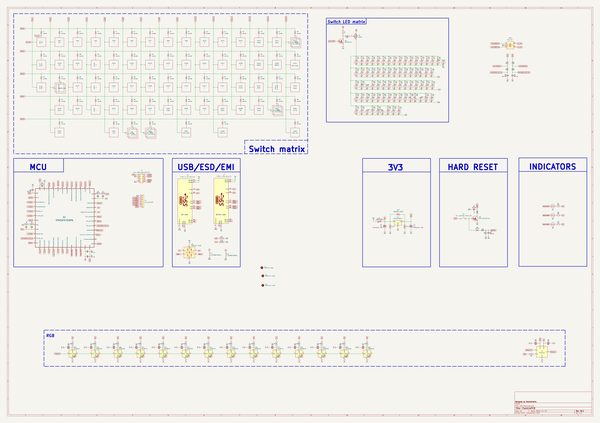
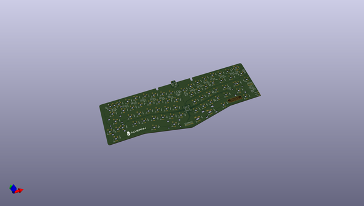
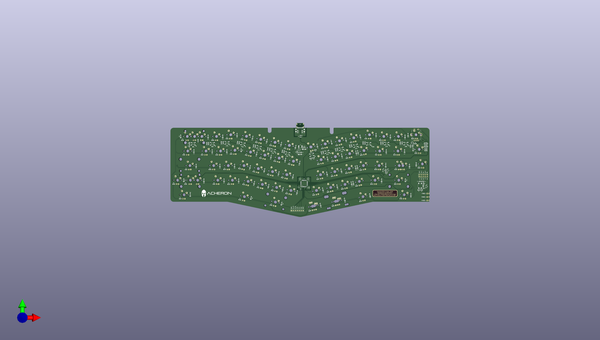
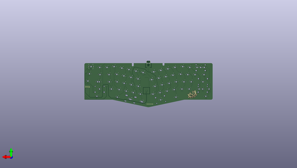

# cheshire
 
## summary 
* id: acheronproject_cheshire_cheshire
* user: acheronproject
* name: cheshire
* board: cheshire
* repo: https://github.com/AcheronProject/Cheshire
* src_file_repo_kicad_pcb: kicadFiles/cheshire.kicad_pcb
* src_file_repo_kicad_pcb_link: https://github.com/AcheronProject/Cheshire/tree/master/kicadFiles/cheshire.kicad_pcb
* src_file_repo_kicad_sch: kicadFiles/cheshire.kicad_sch
* src_file_repo_kicad_sch_link: https://github.com/AcheronProject/Cheshire/tree/master/kicadFiles/cheshire.kicad_sch

* src_file_repo_sch: 
* src_file_repo_sch_link: https://github.com/AcheronProject/Cheshire/tree/master/

## schematic  
  
[schematic (pdf)](working_schematic.pdf)  

## pcb  
 
  
  
  
[board (pdf)](working.pdf)  

## working_bom
| Id | Designator | Footprint | Quantity | Designation | Supplier and ref |  | None | 
| --- | --- | --- | --- | --- | --- | --- | --- | 
| 1 | LED72,LED73,LED74,LED24,LED6,LED23,LED62,LED8,LED70,LED26,LED47,LED34,LED45,LED2,LED30,LED40,LED43,LED59,LED21,LED36,LED28,LED1,LED9,LED4,LED48,LED56,LED54,LED33,LED14,LED29,LED38,LED5,LED37,LED69,LED71,LED63,LED51,LED42,LED60,LED10,LED35,LED58,LED41,LED3,LED13,LED12,LED66,LED64,LED32,LED15,LED19,LED67,LED57,LED49,LED22,LED68,LED20,LED7,LED50,LED61,LED18,LED31,LED25,LED44,LED65,LED52,LED53,LED27,LED17,LED39,LED55,LED46,LED11,LED16 | LED_THT_2.54mm | 74 | LED |  |  | [''] | 
| 2 | L1,L2 | L_1206_3216Metric_Pad1.42x1.75mm_HandSolder | 2 | 120R@100MHz |  |  | [''] | 
| 3 | R31,R50,R36,R9,R24,R67,R27,R61,R62,R57,R14,R34,R7,R71,R8,R56,R43,R59,R55,R33,R12,R17,R20,R63,R30,R45,R44,R60,R22,R25,R37,R49,R4,R29,R15,R11,R41,R6,R18,R53,R3,R35,R26,R23,R64,R52,R10,R28,R51,R40,R54,R16,R69,R46,R42,R32,R66,R39,R19,R48,R47,R38,R13,R5,R21,R70 | R_0805_2012Metric | 66 | 420 |  |  | [''] | 
| 4 | C11,C1,C2,C3 | C_0402_1005Metric | 4 | 100n |  |  | [''] | 
| 5 | D24,D63,D55,D34,D40,D2,D30,D49,D48,D26,D60,D66,D39,D15,D7,D32,D20,D50,D64,D42,D22,D27,D35,D62,D4,D9,D56,D16,D1,D51,D14,D3,D19,D43,D33,D17,D54,D10,D21,D8,D41,D13,D29,D6,D57,D47,D38,D45,D65,D23,D28,D12,D11,D5,D46,D58,D61,D31,D25,D18,D37,D53,D36,D52 | D_SOD-123 | 64 | 1N4148W |  |  | [''] | 
| 6 | D81,D72,D78,D76,D69,D74,D71,D75,D70,D77,D73,D86,D79,D80 | LED_WS2812B_5.0x5.0mm_P3.2mm | 14 | WS2812C |  |  | [''] | 
| 7 | C7,C6 | CP_EIA-3216-10_Kemet-I_Pad1.58x1.35mm_HandSolder | 2 | 1u |  |  | [''] | 
| 8 | R73,R74 | R_0805_2012Metric | 2 | 100k |  |  | [''] | 
| 9 | F1 | Fuse_1812_4532Metric | 1 | mSMD110-16V |  |  | [''] | 
| 10 | R93,R94,R99,R95,R92 | R_0805_2012Metric | 5 | 10k |  |  | [''] | 
| 11 | R80,R81,R79 | R_0805_2012Metric | 3 | 420R |  |  | [''] | 
| 12 | C26,C21,C22,C19,C13,C20,C24,C14,C23,C16,C18,C25,C17,C32,C27,C5,C15 | C_0805_2012Metric | 17 | 100n |  |  | [''] | 
| 13 | R96,R89,R84,R90,R65,R85,R58,R88,R86,R68,R91,R83,R87,R82 | R_0805_2012Metric | 14 | 5R |  |  | [''] | 
| 14 | U4 | SOT-23-6 | 1 | TXS0101 |  |  | [''] | 
| 15 | R2,R72 | R_0805_2012Metric | 2 | 100R |  |  | [''] | 
| 16 | Q1 | SOT-23 | 1 | AO3401A |  |  | [''] | 
| 17 | R1 | R_0805_2012Metric | 1 | 1k |  |  | [''] | 
| 18 | D44,D59,D68 | D_SOD-123 | 3 | 1N4148W |  |  | [''] | 
| 19 | SW72 | ALPS_EC11E | 1 | EC11ECx |  |  | [''] | 
| 20 | C8 | C_0402_1005Metric | 1 | 1u |  |  | [''] | 
| 21 | R78,R77 | R_0805_2012Metric | 2 | 5.1k |  |  | [''] | 
| 22 | C10 | C_0805_2012Metric | 1 | 10u |  |  | [''] | 
| 23 | Q2,Q3 | SOT-23 | 2 | DTC123JKAT146 |  |  | [''] | 
| 24 | U2 | SOT-23 | 1 | MCP1700T-3302E/TT |  |  | [''] | 
| 25 | D67 | D_SOD-123 | 1 | RB060M-60TR |  |  | [''] | 
| 26 | C9 | C_0402_1005Metric | 1 | 10n |  |  | [''] | 
| 27 | C29,C28 | C_0805_2012Metric | 2 | 10n |  |  | [''] | 
| 28 | J2,J3 | TYPE-C-31-M-12 | 2 | TYPE-C-31-M12_13 |  |  | [''] | 
| 29 | S1 | K2-1187SQ-A4SW-06 | 1 | K2-1187SQ-A4SW-06 |  |  | [''] | 
| 30 | U3 | SOT-23-6 | 1 | USBLC6-2SC6 |  |  | [''] | 
| 31 | U1 | LQFP-48_7x7mm_P0.5mm | 1 | STM32F072CBT6 |  |  | [''] | 
| 32 | C4,C12 | C_0402_1005Metric | 2 | 4.7u |  |  | [''] | 
| 33 | R75 | R_0805_2012Metric | 1 | 330k |  |  | [''] | 
| 34 | R76 | R_0805_2012Metric | 1 | 1M |  |  | [''] | 

## bom_schematic
| Ref | Qnty | Value | Cmp name | Footprint | Description | Vendor | DNP | 
| --- | --- | --- | --- | --- | --- | --- | --- | 
| C1, C2, C3, C11 | 4 | 100n | C_Small | Capacitor_SMD:C_0402_1005Metric | Unpolarized capacitor, small symbol |  |  | 
| C4, C12 | 2 | 4.7u | C_Small | Capacitor_SMD:C_0402_1005Metric | Unpolarized capacitor, small symbol |  |  | 
| C5, C13, C14, C15, C16, C17, C18, C19, C20, C21, C22, C23, C24, C25, C26, C27, C32 | 17 | 100n | C | Capacitor_SMD:C_0805_2012Metric | Unpolarized capacitor |  |  | 
| C6, C7 | 2 | 1u | CP1 | acheron_Components:CP_EIA-3216-10_Kemet-I_Pad1.58x1.35mm_HandSolder | Polarized capacitor, US symbol |  |  | 
| C8 | 1 | 1u | C_Small | Capacitor_SMD:C_0402_1005Metric | Unpolarized capacitor, small symbol |  |  | 
| C9 | 1 | 10n | C_Small | Capacitor_SMD:C_0402_1005Metric | Unpolarized capacitor, small symbol |  |  | 
| C10 | 1 | 10u | C_Small | Capacitor_SMD:C_0805_2012Metric | Unpolarized capacitor, small symbol |  |  | 
| C28, C29 | 2 | 10n | C_Small | Capacitor_SMD:C_0805_2012Metric | Unpolarized capacitor, small symbol |  |  | 
| D1, D2, D3, D4, D5, D6, D7, D8, D9, D10, D11, D12, D13, D14, D15, D16, D17, D18, D19, D20, D21, D22, D23, D24, D25, D26, D27, D28, D29, D30, D31, D32, D33, D34, D35, D36, D37, D38, D39, D40, D41, D42, D43, D45, D46, D47, D48, D49, D50, D51, D52, D53, D54, D55, D56, D57, D58, D60, D61, D62, D63, D64, D65, D66 | 64 | 1N4148W | D | Acheron Components:D_SOD-123 | Diode |  |  | 
| D44, D59, D68 | 3 | 1N4148W | D | acheron_Components:D_SOD-123 | Diode |  |  | 
| D67 | 1 | RB060M-60TR | D_Schottky | acheron_Components:D_SOD-123 | Schottky diode |  |  | 
| D69, D70, D71, D72, D73, D74, D75, D76, D77, D78, D79, D80, D81, D86 | 14 | WS2812C | WS2812B | acheron_Components:LED_WS2812B_5.0x5.0mm_P3.2mm | RGB LED with integrated controller |  |  | 
| F1 | 1 | mSMD110-16V | Polyfuse | Fuse:Fuse_1812_4532Metric | Resettable fuse, polymeric positive temperature coefficient |  |  | 
| J2, J3 | 2 | TYPE-C-31-M12_13 | TYPE-C-31-M12_13 | acheron_Connectors:TYPE-C-31-M-12 |  |  |  | 
| L1, L2 | 2 | 120R@100MHz | L_Core_Ferrite | Inductor_SMD:L_1206_3216Metric_Pad1.42x1.75mm_HandSolder | Inductor with ferrite core |  |  | 
| LED1, LED2, LED3, LED4, LED5, LED6, LED7, LED8, LED9, LED10, LED11, LED12, LED13, LED14, LED15, LED16, LED17, LED18, LED19, LED20, LED21, LED22, LED23, LED24, LED25, LED26, LED27, LED28, LED29, LED30, LED31, LED32, LED33, LED34, LED35, LED36, LED37, LED38, LED39, LED40, LED41, LED42, LED43, LED44, LED45, LED46, LED47, LED48, LED49, LED50, LED51, LED52, LED53, LED54, LED55, LED56, LED57, LED58, LED59, LED60, LED61, LED62, LED63, LED64, LED65, LED66, LED67, LED68, LED69, LED70, LED71, LED72, LED73, LED74 | 74 | LED | LED | acheron_Components:LED_THT_2.54mm |  |  |  | 
| Q1 | 1 | AO3401A | AO3401A | Package_TO_SOT_SMD:SOT-23 | -4.0A Id, -30V Vds, P-Channel MOSFET, SOT-23 |  |  | 
| Q2, Q3 | 2 | DTC123JKAT146 | DTC123J | Package_TO_SOT_SMD:SOT-23 |  |  |  | 
| R1 | 1 | 1k | R | Resistor_SMD:R_0805_2012Metric | Resistor |  |  | 
| R2, R72 | 2 | 100R | R_Small | Resistor_SMD:R_0805_2012Metric | Resistor, small symbol |  |  | 
| R3, R4, R5, R6, R7, R8, R9, R10, R11, R12, R13, R14, R15, R16, R17, R18, R19, R20, R21, R22, R23, R24, R25, R26, R27, R28, R29, R30, R31, R32, R33, R34, R35, R36, R37, R38, R39, R40, R41, R42, R43, R44, R45, R46, R47, R48, R49, R50, R51, R52, R53, R54, R55, R56, R57, R59, R60, R61, R62, R63, R64, R66, R67, R69, R70, R71 | 66 | 420 | R_Small | Resistor_SMD:R_0805_2012Metric | Resistor, small symbol |  |  | 
| R58, R65, R68, R82, R83, R84, R85, R86, R87, R88, R89, R90, R91, R96 | 14 | 5R | R | Resistor_SMD:R_0805_2012Metric | Resistor |  |  | 
| R73, R74 | 2 | 100k | R | Resistor_SMD:R_0805_2012Metric | Resistor |  |  | 
| R75 | 1 | 330k | R_Small | Resistor_SMD:R_0805_2012Metric | Resistor, small symbol |  |  | 
| R76 | 1 | 1M | R_Small | Resistor_SMD:R_0805_2012Metric | Resistor, small symbol |  |  | 
| R77, R78 | 2 | 5.1k | R | Resistor_SMD:R_0805_2012Metric | Resistor |  |  | 
| R79, R80, R81 | 3 | 420R | R_Small | Resistor_SMD:R_0805_2012Metric | Resistor, small symbol |  |  | 
| R92, R93, R94, R95, R99 | 5 | 10k | R | Resistor_SMD:R_0805_2012Metric | Resistor |  |  | 
| S1 | 1 | K2-1187SQ-A4SW-06 | SW_SPST | acheron_Hardware:K2-1187SQ-A4SW-06 | Single Pole Single Throw (SPST) switch |  |  | 
| SW72 | 1 | EC11ECx | Rotary_Encoder_Switch | acheron_Hardware:ALPS_EC11E | Rotary encoder, dual channel, incremental quadrate outputs, with switch |  |  | 
| U1 | 1 | STM32F072CBT6 | STM32F072-LQFP48 | acheron_Components:LQFP-48_7x7mm_P0.5mm |  |  |  | 
| U2 | 1 | MCP1700T-3302E/TT | MCP1700-3302E_SOT23 | Package_TO_SOT_SMD:SOT-23 | 250mA Low Quiscent Current LDO, 3.3V output, SOT-23 |  |  | 
| U3 | 1 | USBLC6-2SC6 | USBLC6-2SC6 | acheron_Components:SOT-23-6 | Very low capacitance ESD protection diode, 2 data-line, SOT-23-6 |  |  | 
| U4 | 1 | TXS0101 | TXS0101 | acheron_Components:SOT-23-6 | 1-bit bidirectional level shifting voltage level translator |  |  | 

## positions
### top
| # Ref | Val | Package | PosX | PosY | Rot | Side | 
| --- | --- | --- | --- | --- | --- | --- | 
| C1 | 100n | C_0402_1005Metric | -152.654 | -68.326 | 180.0 | top | 
| C2 | 100n | C_0402_1005Metric | -150.5719 | -70.358 | -90.0 | top | 
| C3 | 100n | C_0402_1005Metric | -150.622 | -58.42 | -90.0 | top | 
| C4 | 4.7u | C_0402_1005Metric | -151.892 | -58.42 | -90.0 | top | 
| C5 | 100n | C_0805_2012Metric | 3.2482 | -72.1078 | 180.0 | top | 
| C6 | 1u | CP_EIA-3216-10_Kemet-I_Pad1.58x1.35mm_HandSolder | -146.1583 | -18.9391 | 0.0 | top | 
| C7 | 1u | CP_EIA-3216-10_Kemet-I_Pad1.58x1.35mm_HandSolder | -151.4138 | -25.6701 | 0.0 | top | 
| C8 | 1u | C_0402_1005Metric | -140.7849 | -69.469 | 0.0 | top | 
| C9 | 10n | C_0402_1005Metric | -140.7849 | -68.326 | 0.0 | top | 
| C10 | 10u | C_0805_2012Metric | 4.83 | -60.8546 | 0.0 | top | 
| C11 | 100n | C_0402_1005Metric | -141.351 | -58.674 | -90.0 | top | 
| C12 | 4.7u | C_0402_1005Metric | -140.208 | -58.674 | -90.0 | top | 
| C13 | 100n | C_0805_2012Metric | -1.2647 | -11.7539 | 180.0 | top | 
| C14 | 100n | C_0805_2012Metric | -7.6147 | -14.6749 | -90.0 | top | 
| C15 | 100n | C_0805_2012Metric | -18.4097 | -10.6109 | 90.0 | top | 
| C16 | 100n | C_0805_2012Metric | -43.4287 | -10.6109 | 90.0 | top | 
| C17 | 100n | C_0805_2012Metric | -84.0535 | -14.8313 | 102.0 | top | 
| C18 | 100n | C_0805_2012Metric | -102.6712 | -18.7739 | 102.0 | top | 
| C19 | 100n | C_0805_2012Metric | -121.163 | -22.7428 | 102.0 | top | 
| C20 | 100n | C_0805_2012Metric | -137.2944 | -30.8615 | 12.0 | top | 
| C21 | 100n | C_0805_2012Metric | -172.0614 | -22.7088 | 78.0 | top | 
| C22 | 100n | C_0805_2012Metric | -190.8193 | -18.7217 | 78.0 | top | 
| C23 | 100n | C_0805_2012Metric | -209.453 | -14.761 | 78.0 | top | 
| C24 | 100n | C_0805_2012Metric | -230.3228 | -10.325 | 78.0 | top | 
| C25 | 100n | C_0805_2012Metric | -251.337 | -10.094 | 90.0 | top | 
| C26 | 100n | C_0805_2012Metric | -270.387 | -11.2562 | 90.0 | top | 
| C27 | 100n | C_0805_2012Metric | -295.279 | -11.2562 | -90.0 | top | 
| C28 | 10n | C_0805_2012Metric | 11.43 | -19.177 | 90.0 | top | 
| C29 | 10n | C_0805_2012Metric | 13.589 | -19.177 | 90.0 | top | 
| C32 | 100n | C_0805_2012Metric | -66.806 | -11.2562 | 90.0 | top | 
| D1 | 1N4148W | D_SOD-123 | -10.7156 | 0.0 | 90.0 | top | 
| D2 | 1N4148W | D_SOD-123 | -14.6856 | -2.14 | 90.0 | top | 
| D3 | 1N4148W | D_SOD-123 | -33.7356 | -2.14 | 90.0 | top | 
| D4 | 1N4148W | D_SOD-123 | -52.3756 | 0.0 | 90.0 | top | 
| D5 | 1N4148W | D_SOD-123 | -73.0577 | -2.2272 | 102.0 | top | 
| D6 | 1N4148W | D_SOD-123 | -91.6915 | -6.1879 | 102.0 | top | 
| D7 | 1N4148W | D_SOD-123 | -110.3252 | -10.1486 | 102.0 | top | 
| D8 | 1N4148W | D_SOD-123 | -128.9589 | -14.1093 | 102.0 | top | 
| D9 | 1N4148W | D_SOD-123 | -157.1166 | -15.595 | 78.0 | top | 
| D10 | 1N4148W | D_SOD-123 | -175.7503 | -11.6342 | 78.0 | top | 
| D11 | 1N4148W | D_SOD-123 | -194.384 | -7.6735 | 78.0 | top | 
| D12 | 1N4148W | D_SOD-123 | -213.0177 | -3.7128 | 78.0 | top | 
| D13 | 1N4148W | D_SOD-123 | -233.3356 | 0.0 | 90.0 | top | 
| D14 | 1N4148W | D_SOD-123 | -251.9656 | -2.14 | 90.0 | top | 
| D15 | 1N4148W | D_SOD-123 | -271.0156 | -2.14 | 90.0 | top | 
| D16 | 1N4148W | D_SOD-123 | -4.1744 | -19.05 | 90.0 | top | 
| D17 | 1N4148W | D_SOD-123 | -15.2856 | -21.19 | 90.0 | top | 
| D18 | 1N4148W | D_SOD-123 | -39.0981 | -21.19 | 90.0 | top | 
| D19 | 1N4148W | D_SOD-123 | -76.0852 | -22.3434 | 102.0 | top | 
| D20 | 1N4148W | D_SOD-123 | -78.4139 | -22.8412 | 102.0 | top | 
| D21 | 1N4148W | D_SOD-123 | -97.0476 | -26.802 | 102.0 | top | 
| D22 | 1N4148W | D_SOD-123 | -115.6813 | -30.7627 | 102.0 | top | 
| D23 | 1N4148W | D_SOD-123 | -151.7605 | -36.209 | 78.0 | top | 
| D24 | 1N4148W | D_SOD-123 | -170.3942 | -32.2483 | 78.0 | top | 
| D25 | 1N4148W | D_SOD-123 | -189.0279 | -28.2876 | 78.0 | top | 
| D26 | 1N4148W | D_SOD-123 | -207.6616 | -24.3269 | 78.0 | top | 
| D27 | 1N4148W | D_SOD-123 | -227.9756 | -20.13 | 90.0 | top | 
| D28 | 1N4148W | D_SOD-123 | -246.6056 | -21.19 | 90.0 | top | 
| D29 | 1N4148W | D_SOD-123 | -265.6556 | -21.19 | 90.0 | top | 
| D30 | 1N4148W | D_SOD-123 | -289.4756 | -21.19 | 90.0 | top | 
| D31 | 1N4148W | D_SOD-123 | -0.1044 | -38.1 | 90.0 | top | 
| D32 | 1N4148W | D_SOD-123 | -8.8394 | -40.24 | 90.0 | top | 
| D33 | 1N4148W | D_SOD-123 | -39.7956 | -40.24 | 90.0 | top | 
| D34 | 1N4148W | D_SOD-123 | -76.7824 | -41.97 | 102.0 | top | 
| D35 | 1N4148W | D_SOD-123 | -79.1116 | -42.4651 | 102.0 | top | 
| D36 | 1N4148W | D_SOD-123 | -97.7453 | -46.4258 | 102.0 | top | 
| D37 | 1N4148W | D_SOD-123 | -116.379 | -50.3866 | 102.0 | top | 
| D38 | 1N4148W | D_SOD-123 | -160.3796 | -53.8526 | 78.0 | top | 
| D39 | 1N4148W | D_SOD-123 | -179.0133 | -49.8918 | 78.0 | top | 
| D40 | 1N4148W | D_SOD-123 | -197.647 | -45.9311 | 78.0 | top | 
| D41 | 1N4148W | D_SOD-123 | -216.2808 | -41.9704 | 78.0 | top | 
| D42 | 1N4148W | D_SOD-123 | -236.5956 | -40.24 | 90.0 | top | 
| D43 | 1N4148W | D_SOD-123 | -255.6456 | -40.24 | 90.0 | top | 
| D44 | 1N4148W | D_SOD-123 | -306.7344 | -2.14 | 90.0 | top | 
| D45 | 1N4148W | D_SOD-123 | -286.5956 | -40.24 | 90.0 | top | 
| D46 | 1N4148W | D_SOD-123 | -14.1956 | -59.29 | 90.0 | top | 
| D47 | 1N4148W | D_SOD-123 | -45.1456 | -59.29 | 90.0 | top | 
| D48 | 1N4148W | D_SOD-123 | -82.1385 | -62.5841 | 102.0 | top | 
| D49 | 1N4148W | D_SOD-123 | -84.4677 | -63.0792 | 102.0 | top | 
| D50 | 1N4148W | D_SOD-123 | -103.1014 | -67.0399 | 102.0 | top | 
| D51 | 1N4148W | D_SOD-123 | -121.7352 | -71.0006 | 102.0 | top | 
| D52 | 1N4148W | D_SOD-123 | -155.0235 | -74.4666 | 78.0 | top | 
| D53 | 1N4148W | D_SOD-123 | -173.6572 | -70.5059 | 78.0 | top | 
| D54 | 1N4148W | D_SOD-123 | -192.2909 | -66.5452 | 78.0 | top | 
| D55 | 1N4148W | D_SOD-123 | -210.9246 | -62.5845 | 78.0 | top | 
| D56 | 1N4148W | D_SOD-123 | -231.2356 | -59.29 | 90.0 | top | 
| D57 | 1N4148W | D_SOD-123 | -250.2856 | -59.29 | 90.0 | top | 
| D58 | 1N4148W | D_SOD-123 | -276.4806 | -59.29 | 90.0 | top | 
| D59 | 1N4148W | D_SOD-123 | -302.6744 | -59.29 | 90.0 | top | 
| D60 | 1N4148W | D_SOD-123 | -7.0456 | -78.34 | 90.0 | top | 
| D61 | 1N4148W | D_SOD-123 | -60.4612 | -78.6693 | 102.0 | top | 
| D62 | 1N4148W | D_SOD-123 | -93.3177 | -84.4359 | 102.0 | top | 
| D63 | 1N4148W | D_SOD-123 | -124.7621 | -91.1196 | 102.0 | top | 
| D64 | 1N4148W | D_SOD-123 | -175.3433 | -89.753 | 78.0 | top | 
| D65 | 1N4148W | D_SOD-123 | -215.1329 | -82.3828 | 78.0 | top | 
| D66 | 1N4148W | D_SOD-123 | -294.2312 | -78.388 | 90.0 | top | 
| D67 | RB060M-60TR | D_SOD-123 | -151.5408 | -23.1301 | 180.0 | top | 
| D68 | 1N4148W | D_SOD-123 | 9.271 | -68.4208 | -90.0 | top | 
| D69 | WS2812C | LED_WS2812B_5.0x5.0mm_P3.2mm | -13.495 | -11.684 | 0.0 | top | 
| D70 | WS2812C | LED_WS2812B_5.0x5.0mm_P3.2mm | -38.4981 | -11.665 | 0.0 | top | 
| D71 | WS2812C | LED_WS2812B_5.0x5.0mm_P3.2mm | -78.9821 | -14.4414 | 12.0 | top | 
| D72 | WS2812C | LED_WS2812B_5.0x5.0mm_P3.2mm | -97.6158 | -18.4022 | 12.0 | top | 
| D73 | WS2812C | LED_WS2812B_5.0x5.0mm_P3.2mm | -116.2495 | -22.3629 | 12.0 | top | 
| D74 | WS2812C | LED_WS2812B_5.0x5.0mm_P3.2mm | -136.1171 | -26.2455 | 12.0 | top | 
| D75 | WS2812C | LED_WS2812B_5.0x5.0mm_P3.2mm | -167.4968 | -24.3436 | -12.0 | top | 
| D76 | WS2812C | LED_WS2812B_5.0x5.0mm_P3.2mm | -186.1305 | -20.3829 | -12.0 | top | 
| D77 | WS2812C | LED_WS2812B_5.0x5.0mm_P3.2mm | -204.7642 | -16.4222 | -12.0 | top | 
| D78 | WS2812C | LED_WS2812B_5.0x5.0mm_P3.2mm | -225.7271 | -11.9664 | -12.0 | top | 
| D79 | WS2812C | LED_WS2812B_5.0x5.0mm_P3.2mm | -246.4325 | -10.7156 | 0.0 | top | 
| D80 | WS2812C | LED_WS2812B_5.0x5.0mm_P3.2mm | -265.4825 | -11.9062 | 0.0 | top | 
| D81 | WS2812C | LED_WS2812B_5.0x5.0mm_P3.2mm | -290.4856 | -11.9062 | 0.0 | top | 
| D86 | WS2812C | LED_WS2812B_5.0x5.0mm_P3.2mm | -61.9006 | -11.9062 | 0.0 | top | 
| F1 | mSMD110-16V | Fuse_1812_4532Metric | -150.9163 | -15.5445 | 0.0 | top | 
| H1 | Acheron_log | acheronLong | -260.1 | -76.327 | 0.0 | top | 
| H3 | Cheshire_La | cheshire_label_29x6mm | -40.71 | -76.75 | 0.0 | top | 
| J1 | Conn_ARM_JT | Conn_ARM_JTAG_SWD_10 | 9.1132 | -53.416 | 90.0 | top | 
| J2 | TYPE-C-31-M | TYPE-C-31-M-12 | -151.1488 | 8.343 | 180.0 | top | 
| J4 | Conn_01x09 | PinHeader_1x7_P2.54mm_Vertical | -154.9071 | -98.9036 | 90.0 | top | 
| L1 | 120R@100MHz | L_1206_3216Metric_Pad1.42x1.75mm_HandSolder | -156.6138 | 5.545 | 90.0 | top | 
| L2 | 120R@100MHz | L_1206_3216Metric_Pad1.42x1.75mm_HandSolder | -145.8188 | 5.418 | 90.0 | top | 
| LED1 | LED | LED_THT_2.54mm | 0.0 | -5.08 | 0.0 | top | 
| LED2 | LED | LED_THT_2.54mm | -23.02 | -7.22 | 0.0 | top | 
| LED3 | LED | LED_THT_2.54mm | -42.07 | -7.22 | 0.0 | top | 
| LED4 | LED | LED_THT_2.54mm | -60.71 | -5.08 | 0.0 | top | 
| LED5 | LED | LED_THT_2.54mm | -80.1538 | -8.929 | 12.0 | top | 
| LED6 | LED | LED_THT_2.54mm | -98.7875 | -12.8897 | 12.0 | top | 
| LED7 | LED | LED_THT_2.54mm | -117.4212 | -16.8504 | 12.0 | top | 
| LED8 | LED | LED_THT_2.54mm | -136.0549 | -20.8111 | 12.0 | top | 
| LED9 | LED | LED_THT_2.54mm | -166.3251 | -18.8311 | -12.0 | top | 
| LED10 | LED | LED_THT_2.54mm | -184.9588 | -14.8704 | -12.0 | top | 
| LED11 | LED | LED_THT_2.54mm | -203.5925 | -10.9097 | -12.0 | top | 
| LED12 | LED | LED_THT_2.54mm | -222.2262 | -6.949 | -12.0 | top | 
| LED13 | LED | LED_THT_2.54mm | -241.67 | -5.08 | 0.0 | top | 
| LED14 | LED | LED_THT_2.54mm | -279.35 | -7.22 | 0.0 | top | 
| LED15 | LED | LED_THT_2.54mm | -260.3 | -7.22 | 0.0 | top | 
| LED16 | LED | LED_THT_2.54mm | -288.875 | -7.22 | 0.0 | top | 
| LED17 | LED | LED_THT_2.54mm | -298.4 | -7.22 | 0.0 | top | 
| LED18 | LED | LED_THT_2.54mm | 4.16 | -24.13 | 0.0 | top | 
| LED19 | LED | LED_THT_2.54mm | -23.62 | -26.27 | 0.0 | top | 
| LED20 | LED | LED_THT_2.54mm | -47.43 | -26.27 | 0.0 | top | 
| LED21 | LED | LED_THT_2.54mm | -66.8762 | -25.5823 | 12.0 | top | 
| LED22 | LED | LED_THT_2.54mm | -85.5099 | -29.5431 | 12.0 | top | 
| LED23 | LED | LED_THT_2.54mm | -104.1436 | -33.5038 | 12.0 | top | 
| LED24 | LED | LED_THT_2.54mm | -122.7774 | -37.4645 | 12.0 | top | 
| LED25 | LED | LED_THT_2.54mm | -160.9689 | -39.4452 | -12.0 | top | 
| LED26 | LED | LED_THT_2.54mm | -179.6026 | -35.4845 | -12.0 | top | 
| LED27 | LED | LED_THT_2.54mm | -198.2363 | -31.5238 | -12.0 | top | 
| LED28 | LED | LED_THT_2.54mm | -216.8701 | -27.5631 | -12.0 | top | 
| LED29 | LED | LED_THT_2.54mm | -236.31 | -25.21 | 0.0 | top | 
| LED30 | LED | LED_THT_2.54mm | -254.94 | -26.27 | 0.0 | top | 
| LED31 | LED | LED_THT_2.54mm | -273.99 | -26.27 | 0.0 | top | 
| LED32 | LED | LED_THT_2.54mm | -297.81 | -26.27 | 0.0 | top | 
| LED33 | LED | LED_THT_2.54mm | 8.23 | -43.18 | 0.0 | top | 
| LED34 | LED | LED_THT_2.54mm | -17.1698 | -45.32 | 0.0 | top | 
| LED35 | LED | LED_THT_2.54mm | -21.9323 | -45.32 | 0.0 | top | 
| LED36 | LED | LED_THT_2.54mm | -48.13 | -45.32 | 0.0 | top | 
| LED37 | LED | LED_THT_2.54mm | -67.5744 | -45.2063 | 12.0 | top | 
| LED38 | LED | LED_THT_2.54mm | -86.2076 | -49.167 | 12.0 | top | 
| LED39 | LED | LED_THT_2.54mm | -104.8414 | -53.1277 | 12.0 | top | 
| LED40 | LED | LED_THT_2.54mm | -123.4751 | -57.0884 | 12.0 | top | 
| LED41 | LED | LED_THT_2.54mm | -169.5881 | -57.0887 | -12.0 | top | 
| LED42 | LED | LED_THT_2.54mm | -188.2218 | -53.128 | -12.0 | top | 
| LED43 | LED | LED_THT_2.54mm | -206.8555 | -49.1673 | -12.0 | top | 
| LED44 | LED | LED_THT_2.54mm | -225.4892 | -45.2066 | -12.0 | top | 
| LED45 | LED | LED_THT_2.54mm | -244.93 | -45.32 | 0.0 | top | 
| LED46 | LED | LED_THT_2.54mm | -263.98 | -45.32 | 0.0 | top | 
| LED47 | LED | LED_THT_2.54mm | -294.93 | -45.32 | 0.0 | top | 
| LED48 | LED | LED_THT_2.54mm | -22.53 | -64.37 | 0.0 | top | 
| LED49 | LED | LED_THT_2.54mm | -53.4862 | -64.37 | 0.0 | top | 
| LED50 | LED | LED_THT_2.54mm | -72.9238 | -65.819 | 12.0 | top | 
| LED51 | LED | LED_THT_2.54mm | -91.5575 | -69.7797 | 12.0 | top | 
| LED52 | LED | LED_THT_2.54mm | -110.1912 | -73.7404 | 12.0 | top | 
| LED53 | LED | LED_THT_2.54mm | -128.8249 | -77.7011 | 12.0 | top | 
| LED54 | LED | LED_THT_2.54mm | -164.2251 | -77.7011 | -12.0 | top | 
| LED55 | LED | LED_THT_2.54mm | -182.8588 | -73.7404 | -12.0 | top | 
| LED56 | LED | LED_THT_2.54mm | -201.4925 | -69.7797 | -12.0 | top | 
| LED57 | LED | LED_THT_2.54mm | -220.1262 | -65.819 | -12.0 | top | 
| LED58 | LED | LED_THT_2.54mm | -239.57 | -64.37 | 0.0 | top | 
| LED59 | LED | LED_THT_2.54mm | -258.62 | -64.37 | 0.0 | top | 
| LED60 | LED | LED_THT_2.54mm | -284.8138 | -64.37 | 0.0 | top | 
| LED61 | LED | LED_THT_2.54mm | -294.3388 | -64.37 | 0.0 | top | 
| LED62 | LED | LED_THT_2.54mm | -311.0075 | -64.37 | 0.0 | top | 
| LED63 | LED | LED_THT_2.54mm | -15.39 | -83.42 | 0.0 | top | 
| LED64 | LED | LED_THT_2.54mm | -68.1138 | -85.809 | 12.0 | top | 
| LED65 | LED | LED_THT_2.54mm | -101.3524 | -91.3372 | 12.0 | top | 
| LED66 | LED | LED_THT_2.54mm | -103.6983 | -91.8358 | -168.0 | top | 
| LED67 | LED | LED_THT_2.54mm | -131.6488 | -97.7769 | 12.0 | top | 
| LED68 | LED | LED_THT_2.54mm | -133.978 | -98.272 | -168.0 | top | 
| LED69 | LED | LED_THT_2.54mm | -184.5262 | -92.869 | -12.0 | top | 
| LED70 | LED | LED_THT_2.54mm | -224.9362 | -85.809 | -12.0 | top | 
| LED71 | LED | LED_THT_2.54mm | -302.5656 | -83.468 | 0.0 | top | 
| LED72 | LED | LED_THT_2.54mm | 15.51 | -76.62 | 180.0 | top | 
| LED73 | LED | LED_THT_2.54mm | 15.51 | -81.1285 | 180.0 | top | 
| LED74 | LED | LED_THT_2.54mm | 15.51 | -85.62 | 180.0 | top | 
| Q1 | AO3401A | SOT-23 | -36.8608 | -46.6615 | 0.0 | top | 
| Q2 | DTC123JKAT1 | SOT-23 | -42.7028 | -46.6615 | 0.0 | top | 
| Q3 | DTC123JKAT1 | SOT-23 | 13.5352 | -67.6628 | 0.0 | top | 
| R1 | 1k | R_0805_2012Metric | -39.0198 | -49.5825 | 180.0 | top | 
| R2 | 100R | R_0805_2012Metric | -39.7818 | -46.6615 | -90.0 | top | 
| R3 | 420 | R_0805_2012Metric | -4.7625 | -4.982 | 0.0 | top | 
| R4 | 420 | R_0805_2012Metric | -27.7825 | -7.22 | 0.0 | top | 
| R5 | 420 | R_0805_2012Metric | -46.8325 | -7.22 | 0.0 | top | 
| R6 | 420 | R_0805_2012Metric | -65.5995 | -5.08 | 0.0 | top | 
| R7 | 420 | R_0805_2012Metric | -84.8122 | -9.9192 | 12.0 | top | 
| R8 | 420 | R_0805_2012Metric | -103.4459 | -13.8799 | 12.0 | top | 
| R9 | 420 | R_0805_2012Metric | -122.0796 | -17.8406 | 12.0 | top | 
| R10 | 420 | R_0805_2012Metric | -131.4741 | -19.8375 | -168.0 | top | 
| R11 | 420 | R_0805_2012Metric | -171.0125 | -17.839 | -12.0 | top | 
| R12 | 420 | R_0805_2012Metric | -189.6462 | -13.8783 | -12.0 | top | 
| R13 | 420 | R_0805_2012Metric | -208.2509 | -9.9195 | -12.0 | top | 
| R14 | 420 | R_0805_2012Metric | -226.8846 | -5.9588 | -12.0 | top | 
| R15 | 420 | R_0805_2012Metric | -246.4325 | -5.08 | 0.0 | top | 
| R16 | 420 | R_0805_2012Metric | -284.1125 | -7.22 | -90.0 | top | 
| R17 | 420 | R_0805_2012Metric | -265.0625 | -7.22 | 0.0 | top | 
| R18 | 420 | R_0805_2012Metric | -304.3531 | -7.22 | 0.0 | top | 
| R19 | 420 | R_0805_2012Metric | -0.6025 | -24.13 | 0.0 | top | 
| R20 | 420 | R_0805_2012Metric | -28.3825 | -26.27 | 0.0 | top | 
| R21 | 420 | R_0805_2012Metric | -52.195 | -26.27 | 0.0 | top | 
| R22 | 420 | R_0805_2012Metric | -71.5346 | -26.5725 | 12.0 | top | 
| R23 | 420 | R_0805_2012Metric | -90.1684 | -30.5332 | 12.0 | top | 
| R24 | 420 | R_0805_2012Metric | -108.8021 | -34.494 | 12.0 | top | 
| R25 | 420 | R_0805_2012Metric | -127.4358 | -38.4547 | 12.0 | top | 
| R26 | 420 | R_0805_2012Metric | -165.6273 | -38.455 | -12.0 | top | 
| R27 | 420 | R_0805_2012Metric | -184.261 | -34.4943 | -12.0 | top | 
| R28 | 420 | R_0805_2012Metric | -202.8948 | -30.5336 | -12.0 | top | 
| R29 | 420 | R_0805_2012Metric | -221.5285 | -26.5729 | -12.0 | top | 
| R30 | 420 | R_0805_2012Metric | -241.0725 | -25.21 | 0.0 | top | 
| R31 | 420 | R_0805_2012Metric | -259.71 | -26.27 | 0.0 | top | 
| R32 | 420 | R_0805_2012Metric | -278.76 | -26.27 | 0.0 | top | 
| R33 | 420 | R_0805_2012Metric | -302.5725 | -26.27 | 0.0 | top | 
| R34 | 420 | R_0805_2012Metric | 3.4675 | -43.18 | 0.0 | top | 
| R35 | 420 | R_0805_2012Metric | -26.6948 | -45.32 | 0.0 | top | 
| R36 | 420 | R_0805_2012Metric | -52.8886 | -45.32 | 0.0 | top | 
| R37 | 420 | R_0805_2012Metric | -72.2328 | -46.1965 | 12.0 | top | 
| R38 | 420 | R_0805_2012Metric | -90.8665 | -50.1572 | 12.0 | top | 
| R39 | 420 | R_0805_2012Metric | -109.5002 | -54.1179 | 12.0 | top | 
| R40 | 420 | R_0805_2012Metric | -128.1339 | -58.0787 | 12.0 | top | 
| R41 | 420 | R_0805_2012Metric | -174.5537 | -56.0333 | -12.0 | top | 
| R42 | 420 | R_0805_2012Metric | -192.8802 | -52.1378 | -12.0 | top | 
| R43 | 420 | R_0805_2012Metric | -211.5139 | -48.1771 | -12.0 | top | 
| R44 | 420 | R_0805_2012Metric | -230.1476 | -44.2164 | -12.0 | top | 
| R45 | 420 | R_0805_2012Metric | -249.6862 | -45.32 | 0.0 | top | 
| R46 | 420 | R_0805_2012Metric | -268.7362 | -45.32 | 0.0 | top | 
| R47 | 420 | R_0805_2012Metric | -299.6925 | -45.4506 | 0.0 | top | 
| R48 | 420 | R_0805_2012Metric | -27.2925 | -64.37 | 0.0 | top | 
| R49 | 420 | R_0805_2012Metric | -58.2487 | -64.37 | 0.0 | top | 
| R50 | 420 | R_0805_2012Metric | -77.5889 | -66.8106 | 12.0 | top | 
| R51 | 420 | R_0805_2012Metric | -96.2226 | -70.7713 | 12.0 | top | 
| R52 | 420 | R_0805_2012Metric | -114.8563 | -74.732 | 12.0 | top | 
| R53 | 420 | R_0805_2012Metric | -133.4901 | -78.6927 | 12.0 | top | 
| R54 | 420 | R_0805_2012Metric | -168.8903 | -76.7126 | -12.0 | top | 
| R55 | 420 | R_0805_2012Metric | -187.5241 | -72.7519 | -12.0 | top | 
| R56 | 420 | R_0805_2012Metric | -206.1578 | -68.7912 | -12.0 | top | 
| R57 | 420 | R_0805_2012Metric | -224.7908 | -64.8275 | -12.0 | top | 
| R58 | 5R | R_0805_2012Metric | -20.8227 | -10.6109 | -90.0 | top | 
| R59 | 420 | R_0805_2012Metric | -244.3337 | -64.5826 | 0.0 | top | 
| R60 | 420 | R_0805_2012Metric | -263.3837 | -64.37 | 0.0 | top | 
| R61 | 420 | R_0805_2012Metric | -300.2931 | -64.37 | 0.0 | top | 
| R62 | 420 | R_0805_2012Metric | -315.7712 | -64.37 | 0.0 | top | 
| R63 | 420 | R_0805_2012Metric | -20.1487 | -83.42 | 0.0 | top | 
| R64 | 420 | R_0805_2012Metric | -72.7722 | -86.7992 | 12.0 | top | 
| R65 | 5R | R_0805_2012Metric | -45.9687 | -10.6109 | -90.0 | top | 
| R66 | 420 | R_0805_2012Metric | -108.3567 | -92.826 | 12.0 | top | 
| R67 | 420 | R_0805_2012Metric | -138.6365 | -99.2622 | 12.0 | top | 
| R68 | 5R | R_0805_2012Metric | -86.4138 | -15.333 | -78.0 | top | 
| R69 | 420 | R_0805_2012Metric | -189.1556 | -91.8807 | -12.0 | top | 
| R70 | 420 | R_0805_2012Metric | -229.8667 | -84.761 | -12.0 | top | 
| R71 | 420 | R_0805_2012Metric | -307.3281 | -83.468 | 0.0 | top | 
| R72 | 100R | R_0805_2012Metric | 6.9312 | -72.1078 | 180.0 | top | 
| R73 | 100k | R_0805_2012Metric | -145.9043 | -16.5261 | 0.0 | top | 
| R74 | 100k | R_0805_2012Metric | -155.0968 | -22.6221 | 90.0 | top | 
| R75 | 330k | R_0805_2012Metric | 9.271 | -63.8488 | 90.0 | top | 
| R76 | 1M | R_0805_2012Metric | 8.513 | -60.8546 | 0.0 | top | 
| R77 | 5.1k | R_0805_2012Metric | -154.2008 | 4.529 | 90.0 | top | 
| R78 | 5.1k | R_0805_2012Metric | -148.4938 | 4.529 | 90.0 | top | 
| R79 | 420R | R_0805_2012Metric | 10.176 | -76.62 | 180.0 | top | 
| R80 | 420R | R_0805_2012Metric | 10.176 | -81.1285 | 180.0 | top | 
| R81 | 420R | R_0805_2012Metric | 10.176 | -85.62 | 180.0 | top | 
| R82 | 5R | R_0805_2012Metric | -105.0315 | -19.2756 | -78.0 | top | 
| R83 | 5R | R_0805_2012Metric | -123.5233 | -23.2445 | -78.0 | top | 
| R84 | 5R | R_0805_2012Metric | -133.6919 | -30.0958 | 12.0 | top | 
| R85 | 5R | R_0805_2012Metric | -174.4139 | -22.1705 | -102.0 | top | 
| R86 | 5R | R_0805_2012Metric | -193.296 | -18.1569 | -102.0 | top | 
| R87 | 5R | R_0805_2012Metric | -211.8055 | -14.2226 | -102.0 | top | 
| R88 | 5R | R_0805_2012Metric | -232.6753 | -9.7866 | -102.0 | top | 
| R89 | 5R | R_0805_2012Metric | -253.75 | -10.0565 | -90.0 | top | 
| R90 | 5R | R_0805_2012Metric | -272.673 | -11.2187 | -90.0 | top | 
| R91 | 5R | R_0805_2012Metric | -295.279 | -14.8825 | -90.0 | top | 
| R92 | 10k | R_0805_2012Metric | 11.43 | -11.684 | 90.0 | top | 
| R93 | 10k | R_0805_2012Metric | 13.589 | -11.684 | 90.0 | top | 
| R94 | 10k | R_0805_2012Metric | 11.43 | -15.367 | 90.0 | top | 
| R95 | 10k | R_0805_2012Metric | 13.589 | -15.367 | 90.0 | top | 
| R96 | 5R | R_0805_2012Metric | -69.219 | -11.2187 | -90.0 | top | 
| R99 | 10k | R_0805_2012Metric | -5.2017 | -14.6749 | -90.0 | top | 
| S1 | K2-1187SQ-A | K2-1187SQ-A4SW-06 | 4.953 | -66.5158 | 90.0 | top | 
| SW1 | ESC | MX100 | 0.0 | 0.0 | 0.0 | top | 
| SW2 | GRV | MX100 | -23.02 | -2.14 | 0.0 | top | 
| SW3 | 1 | MX100 | -42.07 | -2.14 | 0.0 | top | 
| SW4 | 2 | MX100 | -60.71 | 0.0 | 0.0 | top | 
| SW5 | 3 | MX100 | -81.21 | -3.96 | 12.0 | top | 
| SW6 | 4 | MX100 | -99.8437 | -7.9207 | 12.0 | top | 
| SW7 | 5 | MX100 | -118.4774 | -11.8814 | 12.0 | top | 
| SW8 | 6 | MX100 | -137.1111 | -15.8421 | 12.0 | top | 
| SW9 | 7 | MX100 | -165.2689 | -13.8621 | -12.0 | top | 
| SW10 | 8 | MX100 | -183.9026 | -9.9014 | -12.0 | top | 
| SW11 | 9 | MX100 | -202.5363 | -5.9407 | -12.0 | top | 
| SW12 | 0 | MX100 | -221.17 | -1.98 | -12.0 | top | 
| SW13 | MINUS | MX100 | -241.67 | 0.0 | 0.0 | top | 
| SW14 | EQUAL | MX100 | -260.3 | -2.14 | 0.0 | top | 
| SW15 | 2U_BKSP | MX200 | -288.875 | -2.14 | 0.0 | top | 
| SW16 | 1U_RBKSP | MX100 | -279.35 | -2.14 | 0.0 | top | 
| SW17 | PGUP | MX100 | 4.16 | -19.05 | 0.0 | top | 
| SW18 | TAB | MX150 | -23.62 | -21.19 | 0.0 | top | 
| SW19 | Q | MX100 | -47.43 | -21.19 | 0.0 | top | 
| SW20 | W | MX100 | -67.93 | -20.61 | 12.0 | top | 
| SW21 | E | MX100 | -86.5637 | -24.5707 | 12.0 | top | 
| SW22 | R | MX100 | -105.1974 | -28.5314 | 12.0 | top | 
| SW23 | T | MX100 | -123.8311 | -32.4921 | 12.0 | top | 
| SW24 | Y | MX100 | -159.9089 | -34.4722 | -12.0 | top | 
| SW25 | U | MX100 | -178.5426 | -30.5114 | -12.0 | top | 
| SW26 | I | MX100 | -197.1763 | -26.5507 | -12.0 | top | 
| SW27 | O | MX100 | -215.81 | -22.59 | -12.0 | top | 
| SW28 | P | MX100 | -236.31 | -20.13 | 0.0 | top | 
| SW29 | LBRACE | MX100 | -254.94 | -21.19 | 0.0 | top | 
| SW30 | RBRACE | MX100 | -273.99 | -21.19 | 0.0 | top | 
| SW31 | BACK_SLASH | MX150 | -297.81 | -21.19 | 0.0 | top | 
| SW32 | PGDN | MX100 | 8.23 | -38.1 | 0.0 | top | 
| SW33 | FULL_CAPS | MX175 | -21.9323 | -40.24 | 0.0 | top | 
| SW34 | A | MX100 | -48.13 | -40.24 | 0.0 | top | 
| SW35 | S | MX100 | -68.63 | -40.24 | 12.0 | top | 
| SW36 | D | MX100 | -87.2637 | -44.2007 | 12.0 | top | 
| SW37 | F | MX100 | -105.8974 | -48.1614 | 12.0 | top | 
| SW38 | G | MX100 | -124.5311 | -52.1221 | 12.0 | top | 
| SW39 | H | MX100 | -168.5289 | -52.1221 | -12.0 | top | 
| SW40 | J | MX100 | -187.1626 | -48.1614 | -12.0 | top | 
| SW41 | K | MX100 | -205.7963 | -44.2007 | -12.0 | top | 
| SW42 | L | MX100 | -224.43 | -40.24 | -12.0 | top | 
| SW43 | COLON | MX100 | -244.93 | -40.24 | 0.0 | top | 
| SW44 | QUOTE | MX100 | -263.98 | -40.24 | 0.0 | top | 
| SW45 | 1U_LBKSP | MX100 | -298.4 | -2.14 | 0.0 | top | 
| SW46 | ENTER | MX225R | -294.93 | -40.24 | 0.0 | top | 
| SW47 | STEPPED_CAP | MX125 | -17.1698 | -40.24 | 0.0 | top | 
| SW48 | LSHIFT | MX225 | -22.53 | -59.29 | 0.0 | top | 
| SW49 | Z | MX100 | -53.48 | -59.29 | 0.0 | top | 
| SW50 | X | MX100 | -73.98 | -60.85 | 12.0 | top | 
| SW51 | C | MX100 | -92.6137 | -64.8107 | 12.0 | top | 
| SW52 | V | MX100 | -111.2474 | -68.7714 | 12.0 | top | 
| SW53 | B | MX100 | -129.8811 | -72.7322 | 12.0 | top | 
| SW54 | EXTRA | MX100 | -163.1689 | -72.7322 | -12.0 | top | 
| SW55 | N | MX100 | -181.8026 | -68.7714 | -12.0 | top | 
| SW56 | M | MX100 | -200.4363 | -64.8107 | -12.0 | top | 
| SW57 | COMMA | MX100 | -219.07 | -60.85 | -12.0 | top | 
| SW58 | DOT | MX100 | -239.57 | -59.29 | 0.0 | top | 
| SW59 | SLASH | MX100 | -258.62 | -59.29 | 0.0 | top | 
| SW60 | 2.75U_RSHIF | MX275 | -294.34 | -59.29 | 0.0 | top | 
| SW61 | 100_FN | MX100 | -311.0087 | -59.29 | 0.0 | top | 
| SW62 | 1.75U_RSHIF | MX175 | -284.815 | -59.29 | 0.0 | top | 
| SW63 | LCTRL | MX150 | -15.39 | -78.34 | 0.0 | top | 
| SW64 | LALT | MX150 | -69.17 | -80.84 | 12.0 | top | 
| SW65 | LEFT_SPACE | MX200R | -102.4085 | -86.3682 | 12.0 | top | 
| SW66 | LEFT_SPACE | MX125 | -132.705 | -92.8079 | 12.0 | top | 
| SW67 | RIGHT_SPACE | MX275R | -183.47 | -87.9 | -12.0 | top | 
| SW68 | RIGHT_ALT | MX150 | -223.88 | -80.84 | -12.0 | top | 
| SW69 | RIGHT_CTRL | MX150 | -302.5656 | -78.388 | 0.0 | top | 
| SW70 | LEFT_SPACE | MX225R | -104.7544 | -86.8668 | 12.0 | top | 
| SW71 | LEFT_SPACE | MX100 | -135.0342 | -93.303 | 12.0 | top | 
| SW72 | EC11ECx | ALPS_EC11E | 0.0 | 0.0 | 0.0 | top | 
| U1 | STM32F072CB | LQFP-48_7x7mm_P0.5mm | -145.9919 | -63.6197 | 90.0 | top | 
| U2 | MCP1700T-33 | SOT-23 | -152.1863 | -19.7355 | 0.0 | top | 
| U3 | USBLC6-2SC6 | SOT-23-6 | -150.6528 | -2.108 | -90.0 | top | 
| U4 | TXS0101 | SOT-23-6 | -5.2017 | -10.8649 | 180.0 | top | 

### bottom
| # Ref | Val | Package | PosX | PosY | Rot | Side | 
| --- | --- | --- | --- | --- | --- | --- | 
| H2 | Cheshire_Logo | cheshire_logo_plated_25x22mm | -266.4463 | -72.9257 | 180.0 | bottom | 
| J3 | TYPE-C-31-M12_13 | TYPE-C-31-M-12 | -151.1488 | 8.343 | 0.0 | bottom | 

