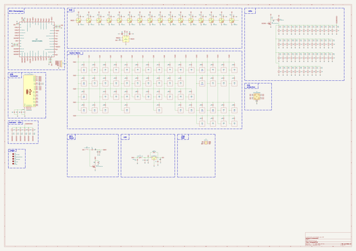
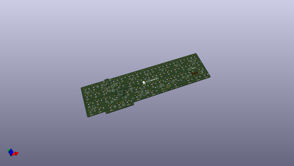
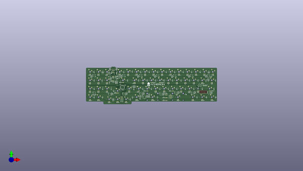
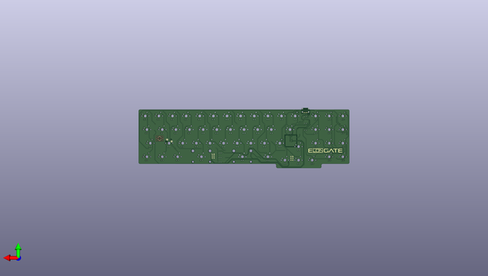

# elongate
 
## summary 
* id: acheronproject_elongate_elongate
* user: acheronproject
* name: elongate
* board: elongate
* repo: https://github.com/AcheronProject/Elongate
* src_file_repo_kicad_pcb: kicadFiles/elongate.kicad_pcb
* src_file_repo_kicad_pcb_link: https://github.com/AcheronProject/Elongate/tree/master/kicadFiles/elongate.kicad_pcb
* src_file_repo_kicad_sch: kicadFiles/elongate.kicad_sch
* src_file_repo_kicad_sch_link: https://github.com/AcheronProject/Elongate/tree/master/kicadFiles/elongate.kicad_sch

* src_file_repo_sch: 
* src_file_repo_sch_link: https://github.com/AcheronProject/Elongate/tree/master/

## schematic  
  
[schematic (pdf)](working_schematic.pdf)  

## pcb  
 
  
  
  
[board (pdf)](working.pdf)  

## working_bom
| Id | Designator | Footprint | Quantity | Designation | Supplier and ref |  | None | 
| --- | --- | --- | --- | --- | --- | --- | --- | 
| 1 | D44,D48,D60,D66,D47,D58,D28,D64,D67,D19,D51,D37,D23,D39,D40,D49,D53,D42,D43,D35,D52,D36,D33,D50,D38,D54,D41,D34,D31,D18,D65,D57,D61,D26,D62,D59,D30,D70,D17,D63,D46,D27,D45,D21,D55,D69,D20,D32,D25,D22,D56,D24,D68,D29,D71 | D_SOD-123 | 55 | 1N4148 |  |  | [''] | 
| 2 | R77,R76,R85 | R_SMD_1206 | 3 | 1M |  |  | [''] | 
| 3 | C28,C27,C32 | C_0805_2012Metric_Pad1.15x1.40mm_HandSolder | 3 | 100n |  |  | [''] | 
| 4 | R78,R79,R80,R81,R82,R83,R61,R35,R62,R60,R28,R38,R48,R25,R50,R37,R32,R54,R66,R63,R72,R40,R20,R58,R26,R36,R64,R73,R30,R39,R31,R42,R71,R56,R70,R27,R55,R51,R29,R49,R22,R69,R52,R44,R23,R59,R53,R24,R41,R68,R65,R43,R45,R19,R21,R33,R47,R57,R67,R46 | R_SMD_1206 | 60 | 470 |  |  | [''] | 
| 5 | C16,C13,C5,C3,C14,C2,C15,C7,C10,C6,C11,C9,C8,C4,C12,C1 | C_0805_2012Metric_Pad1.15x1.40mm_HandSolder | 16 | 1u |  |  | [''] | 
| 6 | D72 | D_SOD-123 | 1 | RB060M-60TR |  |  | [''] | 
| 7 | R87,R86 | R_SMD_1206 | 2 | 100k |  |  | [''] | 
| 8 | R2,R6,R1,R3,R9,R12,R5,R7,R15,R4,R10,R8,R13,R16,R14,R11 | R_SMD_1206 | 16 | 4.7 |  |  | [''] | 
| 9 | D12,D2,D1,D3,D16,D10,D4,D5,D9,D15,D13,D11,D7,D6,D8,D14 | LED_WS2812B_5.0x5.0mm_P3.2mm | 16 | WS2812C |  |  | [''] | 
| 10 | R88 | R_SMD_1206 | 1 | 100 |  |  | [''] | 
| 11 | R75,R74 | R_SMD_1206 | 2 | 5.1k |  |  | [''] | 
| 12 | C24 | C_0402_1005Metric | 1 | 10n |  |  | [''] | 
| 13 | J1 | USB_C_Receptacle_Wurth_Elektronik_632723x00011 | 1 | Wurth 632723300011 |  |  | [''] | 
| 14 | U3 | USON-10_2.5x1.0mm_P0.5mm | 1 | TPD4E05U06DQAR |  |  | [''] | 
| 15 | C31,C30 | CP_EIA-3216-10_Kemet-I_Pad1.58x1.35mm_HandSolder | 2 | 1u |  |  | [''] | 
| 16 | U2 | LQFP-48_7x7mm_P0.5mm | 1 | STM32F072CBT6 |  |  | [''] | 
| 17 | R84 | R_SMD_1206 | 1 | 330k |  |  | [''] | 
| 18 | C20,C26 | C_0402_1005Metric | 2 | 4.7u |  |  | [''] | 
| 19 | Q1 | SOT-23 | 1 | AO3401A |  |  | [''] | 
| 20 | Q2,Q3 | SOT-23 | 2 | DTC123JKAT146 |  |  | [''] | 
| 21 | C23 | C_0402_1005Metric | 1 | 1u |  |  | [''] | 
| 22 | C22,C21 | C_0805_2012Metric | 2 | 100n |  |  | [''] | 
| 23 | R18 | R_SMD_1206 | 1 | 100R |  |  | [''] | 
| 24 | F1 | Fuse_1812_4532Metric_Pad1.30x3.40mm_HandSolder | 1 | RF1338-000 |  |  | [''] | 
| 25 | R17,R34 | R_SMD_1206 | 2 | 10k |  |  | [''] | 
| 26 | C29 | C_0805_2012Metric_Pad1.15x1.40mm_HandSolder | 1 | 10u |  |  | [''] | 
| 27 | C25,C18,C17,C19 | C_0402_1005Metric | 4 | 100n |  |  | [''] | 
| 28 | U4 | SOT-23 | 1 | MCP1700T-3302E/TT |  |  | [''] | 
| 29 | D73 | D_SOD-123 | 1 | SMF6.0A |  |  | [''] | 
| 30 | U1 | SOT-23-6 | 1 | TXS0101 |  |  | [''] | 
| 31 | SW55 | smdPushBtn | 1 | K2-1187SQ-A4SW-06 |  |  | [''] | 

## bom_schematic
| Ref | Qnty | Value | Cmp name | Footprint | Description | Vendor | DNP | 
| --- | --- | --- | --- | --- | --- | --- | --- | 
| C1, C2, C3, C4, C5, C6, C7, C8, C9, C10, C11, C12, C13, C14, C15, C16 | 16 | 1u | C_Small | Capacitor_SMD:C_0805_2012Metric_Pad1.15x1.40mm_HandSolder | Unpolarized capacitor, small symbol |  |  | 
| C17, C18, C19, C25 | 4 | 100n | C_Small | Capacitor_SMD:C_0402_1005Metric | Unpolarized capacitor, small symbol |  |  | 
| C20, C26 | 2 | 4.7u | C_Small | Capacitor_SMD:C_0402_1005Metric | Unpolarized capacitor, small symbol |  |  | 
| C21, C22 | 2 | 100n | C | Capacitor_SMD:C_0805_2012Metric | Unpolarized capacitor |  |  | 
| C23 | 1 | 1u | C_Small | Capacitor_SMD:C_0402_1005Metric | Unpolarized capacitor, small symbol |  |  | 
| C24 | 1 | 10n | C_Small | Capacitor_SMD:C_0402_1005Metric | Unpolarized capacitor, small symbol |  |  | 
| C27, C28, C32 | 3 | 100n | C_Small | Capacitor_SMD:C_0805_2012Metric_Pad1.15x1.40mm_HandSolder | Unpolarized capacitor, small symbol |  |  | 
| C29 | 1 | 10u | C_Small | Capacitor_SMD:C_0805_2012Metric_Pad1.15x1.40mm_HandSolder | Unpolarized capacitor, small symbol |  |  | 
| C30, C31 | 2 | 1u | CP1_Small | acheron_Components:CP_EIA-3216-10_Kemet-I_Pad1.58x1.35mm_HandSolder | Polarized capacitor, small US symbol |  |  | 
| D1, D2, D3, D4, D5, D6, D7, D8, D9, D10, D11, D12, D13, D14, D15, D16 | 16 | WS2812C | WS2812B | acheron_Components:LED_WS2812B_5.0x5.0mm_P3.2mm | RGB LED with integrated controller |  |  | 
| D17, D18, D19, D20, D21, D22, D23, D24, D25, D26, D27, D28, D29, D30, D31, D32, D33, D34, D35, D36, D37, D38, D39, D40, D41, D42, D43, D44, D45, D46, D47, D48, D49, D50, D51, D52, D53, D54, D55, D56, D57, D58, D59, D60, D61, D62, D63, D64, D65, D66, D67, D68, D69, D70, D71 | 55 | 1N4148 | D | acheron_Components:D_SOD-123 | Diode |  |  | 
| D72 | 1 | RB060M-60TR | D_Schottky | acheron_Components:D_SOD-123 | Schottky diode |  |  | 
| D73 | 1 | SMF6.0A | Device:D_Schottky_1 | acheron_Components:D_SOD-123 | Schottky diode |  |  | 
| F1 | 1 | mSMD110-16V  | Polyfuse | Fuse:Fuse_1812_4532Metric_Pad1.30x3.40mm_HandSolder | Resettable fuse, polymeric positive temperature coefficient |  |  | 
| J1 | 1 | Wurth 632723300011 | USB_C_Receptacle | acheron_Connectors:USB_C_Receptacle_Wurth_Elektronik_632723x00011 | USB Full-Featured Type-C Receptacle connector |  |  | 
| Q1 | 1 | AO3401A | AO3401A | Package_TO_SOT_SMD:SOT-23 | -4.0A Id, -30V Vds, P-Channel MOSFET, SOT-23 |  |  | 
| Q2, Q3 | 2 | DTC123JKAT146 | DTC123J | Package_TO_SOT_SMD:SOT-23 | Digital NPN Transistor, 2k2/47k, SOT-23 |  |  | 
| R1, R2, R3, R4, R5, R6, R7, R8, R9, R10, R11, R12, R13, R14, R15, R16 | 16 | 4.7 | Device:R_Small_18 | acheron_Components:R_SMD_1206 | Resistor, small symbol |  |  | 
| R17, R34 | 2 | 10k | R_Small | acheron_Components:R_SMD_1206 | Resistor, small symbol |  |  | 
| R18 | 1 | 100R | Device:R_Small_6 | acheron_Components:R_SMD_1206 | Resistor, small symbol |  |  | 
| R19, R20, R21, R22, R23, R24, R25, R26, R27, R28, R29, R30, R31, R32, R33, R35, R36, R37, R38, R39, R40, R41, R42, R43, R44, R45, R46, R47, R48, R49, R50, R51, R52, R53, R54, R55, R56, R57, R58, R59, R60, R61, R62, R63, R64, R65, R66, R67, R68, R69, R70, R71, R72, R73, R78, R79, R80, R81, R82, R83 | 60 | 470 | R_Small | acheron_Components:R_SMD_1206 | Resistor, small symbol |  |  | 
| R74, R75 | 2 | 5.1k | Device:R_Small_2 | acheron_Components:R_SMD_1206 | Resistor, small symbol |  |  | 
| R76, R77, R85 | 3 | 1M | Device:R_Small_23 | acheron_Components:R_SMD_1206 | Resistor, small symbol |  |  | 
| R84 | 1 | 330k | Device:R_Small_25 | acheron_Components:R_SMD_1206 | Resistor, small symbol |  |  | 
| R86, R87 | 2 | 100k | Device:R_Small_5 | acheron_Components:R_SMD_1206 | Resistor, small symbol |  |  | 
| R88 | 1 | 100 | Device:R_Small_24 | acheron_Components:R_SMD_1206 | Resistor, small symbol |  |  | 
| SW55 | 1 | K2-1187SQ-A4SW-06 | SW_Push | acheron_Hardware:smdPushBtn | Push button switch, generic, two pins |  |  | 
| U1 | 1 | TXS0101 | TXS0101 | acheron_Components:SOT-23-6 | 1-bit bidirectional level shifting voltage level translator |  |  | 
| U2 | 1 | STM32F072CBT6 | STM32F072-LQFP48 | acheron_Components:LQFP-48_7x7mm_P0.5mm |  |  |  | 
| U3 | 1 | TPD4E05U06DQAR | TPD4E05U06DQAR | acheron_Components:USON-10_2.5x1.0mm_P0.5mm |  |  |  | 
| U4 | 1 | MCP1700T-3302E/TT | MCP1700-3302E_SOT23 | Package_TO_SOT_SMD:SOT-23 | 250mA Low Quiscent Current LDO, 3.3V output, SOT-23 |  |  | 

## positions
### top
| # Ref | Val | Package | PosX | PosY | Rot | Side | 
| --- | --- | --- | --- | --- | --- | --- | 
| C1 | 1u | C_0805_2012Metric_Pad1.15x1.40mm_HandSolder | -16.51 | -10.668 | -90.0 | top | 
| C2 | 1u | C_0805_2012Metric_Pad1.15x1.40mm_HandSolder | -54.737 | -10.795 | -90.0 | top | 
| C3 | 1u | C_0805_2012Metric_Pad1.15x1.40mm_HandSolder | -92.964 | -11.176 | -90.0 | top | 
| C4 | 1u | C_0805_2012Metric_Pad1.15x1.40mm_HandSolder | -131.191 | -11.049 | -90.0 | top | 
| C5 | 1u | C_0805_2012Metric_Pad1.15x1.40mm_HandSolder | -169.291 | -11.049 | -90.0 | top | 
| C6 | 1u | C_0805_2012Metric_Pad1.15x1.40mm_HandSolder | -207.391 | -10.795 | -90.0 | top | 
| C7 | 1u | C_0805_2012Metric_Pad1.15x1.40mm_HandSolder | -231.267 | -15.367 | -90.0 | top | 
| C8 | 1u | C_0805_2012Metric_Pad1.15x1.40mm_HandSolder | -274.066 | -10.922 | -90.0 | top | 
| C9 | 1u | C_0805_2012Metric_Pad1.15x1.40mm_HandSolder | -270.256 | -51.943 | 180.0 | top | 
| C10 | 1u | C_0805_2012Metric_Pad1.15x1.40mm_HandSolder | -224.79 | -49.53 | 90.0 | top | 
| C11 | 1u | C_0805_2012Metric_Pad1.15x1.40mm_HandSolder | -192.659 | -49.403 | 90.0 | top | 
| C12 | 1u | C_0805_2012Metric_Pad1.15x1.40mm_HandSolder | -154.559 | -49.276 | 90.0 | top | 
| C13 | 1u | C_0805_2012Metric_Pad1.15x1.40mm_HandSolder | -109.347 | -49.276 | 90.0 | top | 
| C14 | 1u | C_0805_2012Metric_Pad1.15x1.40mm_HandSolder | -75.946 | -46.99 | 90.0 | top | 
| C15 | 1u | C_0805_2012Metric_Pad1.15x1.40mm_HandSolder | -38.989 | -46.99 | 90.0 | top | 
| C16 | 1u | C_0805_2012Metric_Pad1.15x1.40mm_HandSolder | -2.032 | -47.498 | 90.0 | top | 
| C17 | 100n | C_0402_1005Metric | -209.931 | -37.846 | 0.0 | top | 
| C18 | 100n | C_0402_1005Metric | -206.629 | -41.402 | -90.0 | top | 
| C19 | 100n | C_0402_1005Metric | -207.645 | -29.591 | 90.0 | top | 
| C20 | 4.7u | C_0402_1005Metric | -208.915 | -29.591 | 90.0 | top | 
| C21 | 100n | C_0805_2012Metric | -10.5875 | -20.1458 | 180.0 | top | 
| C22 | 100n | C_0805_2012Metric | -3.3875 | -10.5458 | 0.0 | top | 
| C23 | 1u | C_0402_1005Metric | -201.5262 | -42.037 | 180.0 | top | 
| C24 | 10n | C_0402_1005Metric | -201.5262 | -40.894 | 180.0 | top | 
| C25 | 100n | C_0402_1005Metric | -197.993 | -30.607 | 0.0 | top | 
| C26 | 4.7u | C_0402_1005Metric | -197.993 | -29.464 | 0.0 | top | 
| C27 | 100n | C_0805_2012Metric_Pad1.15x1.40mm_HandSolder | -214.8205 | 6.6709 | -90.0 | top | 
| C28 | 100n | C_0805_2012Metric_Pad1.15x1.40mm_HandSolder | -232.9815 | 6.5439 | -90.0 | top | 
| C29 | 10u | C_0805_2012Metric_Pad1.15x1.40mm_HandSolder | -143.3512 | -50.8 | 0.0 | top | 
| C30 | 1u | CP_EIA-3216-10_Kemet-I_Pad1.58x1.35mm_HandSolder | -218.2749 | -11.7571 | -90.0 | top | 
| C31 | 1u | CP_EIA-3216-10_Kemet-I_Pad1.58x1.35mm_HandSolder | -216.8842 | -23.495 | 180.0 | top | 
| C32 | 100n | C_0805_2012Metric_Pad1.15x1.40mm_HandSolder | -163.449 | -60.452 | 90.0 | top | 
| D1 | WS2812C | LED_WS2812B_5.0x5.0mm_P3.2mm | -9.4562 | -9.0613 | 0.0 | top | 
| D2 | WS2812C | LED_WS2812B_5.0x5.0mm_P3.2mm | -47.625 | -8.6519 | 0.0 | top | 
| D3 | WS2812C | LED_WS2812B_5.0x5.0mm_P3.2mm | -85.725 | -8.6519 | 0.0 | top | 
| D4 | WS2812C | LED_WS2812B_5.0x5.0mm_P3.2mm | -123.825 | -8.6519 | 0.0 | top | 
| D5 | WS2812C | LED_WS2812B_5.0x5.0mm_P3.2mm | -161.925 | -8.3344 | 0.0 | top | 
| D6 | WS2812C | LED_WS2812B_5.0x5.0mm_P3.2mm | -200.025 | -8.3344 | 0.0 | top | 
| D7 | WS2812C | LED_WS2812B_5.0x5.0mm_P3.2mm | -232.1719 | -8.3344 | -90.0 | top | 
| D8 | WS2812C | LED_WS2812B_5.0x5.0mm_P3.2mm | -266.7 | -8.3344 | 0.0 | top | 
| D9 | WS2812C | LED_WS2812B_5.0x5.0mm_P3.2mm | -266.7 | -47.9425 | 180.0 | top | 
| D10 | WS2812C | LED_WS2812B_5.0x5.0mm_P3.2mm | -232.1719 | -50.3238 | 180.0 | top | 
| D11 | WS2812C | LED_WS2812B_5.0x5.0mm_P3.2mm | -200.025 | -50.3238 | 180.0 | top | 
| D12 | WS2812C | LED_WS2812B_5.0x5.0mm_P3.2mm | -161.925 | -50.0063 | 180.0 | top | 
| D13 | WS2812C | LED_WS2812B_5.0x5.0mm_P3.2mm | -116.6812 | -50.0063 | 180.0 | top | 
| D14 | WS2812C | LED_WS2812B_5.0x5.0mm_P3.2mm | -83.3437 | -47.625 | 180.0 | top | 
| D15 | WS2812C | LED_WS2812B_5.0x5.0mm_P3.2mm | -46.4344 | -47.625 | 180.0 | top | 
| D16 | WS2812C | LED_WS2812B_5.0x5.0mm_P3.2mm | -9.525 | -47.625 | 180.0 | top | 
| D17 | 1N4148 | D_SOD-123 | -8.255 | -0.0 | 90.0 | top | 
| D18 | 1N4148 | D_SOD-123 | -10.7156 | 0.0 | 90.0 | top | 
| D19 | 1N4148 | D_SOD-123 | -28.575 | 0.0 | 90.0 | top | 
| D20 | 1N4148 | D_SOD-123 | -47.625 | -0.0 | 90.0 | top | 
| D21 | 1N4148 | D_SOD-123 | -66.675 | -0.0 | 90.0 | top | 
| D22 | 1N4148 | D_SOD-123 | -85.725 | -0.0 | 90.0 | top | 
| D23 | 1N4148 | D_SOD-123 | -104.775 | 0.0 | 90.0 | top | 
| D24 | 1N4148 | D_SOD-123 | -123.825 | 0.0 | 90.0 | top | 
| D25 | 1N4148 | D_SOD-123 | -142.875 | -0.0 | 90.0 | top | 
| D26 | 1N4148 | D_SOD-123 | -161.925 | -0.0 | 90.0 | top | 
| D27 | 1N4148 | D_SOD-123 | -180.9909 | 1.0001 | 90.0 | top | 
| D28 | 1N4148 | D_SOD-123 | -200.025 | 0.0 | 90.0 | top | 
| D29 | 1N4148 | D_SOD-123 | -246.4594 | 0.0 | 90.0 | top | 
| D30 | 1N4148 | D_SOD-123 | -248.92 | 0.0 | 90.0 | top | 
| D31 | 1N4148 | D_SOD-123 | -266.7 | -0.0 | 90.0 | top | 
| D32 | 1N4148 | D_SOD-123 | 5.9531 | -19.05 | 90.0 | top | 
| D33 | 1N4148 | D_SOD-123 | -15.5875 | -19.05 | 90.0 | top | 
| D34 | 1N4148 | D_SOD-123 | -33.3375 | -19.05 | 90.0 | top | 
| D35 | 1N4148 | D_SOD-123 | -52.3875 | -19.05 | 90.0 | top | 
| D36 | 1N4148 | D_SOD-123 | -71.4375 | -19.05 | 90.0 | top | 
| D37 | 1N4148 | D_SOD-123 | -90.4875 | -19.05 | 90.0 | top | 
| D38 | 1N4148 | D_SOD-123 | -109.5375 | -19.05 | 90.0 | top | 
| D39 | 1N4148 | D_SOD-123 | -128.5875 | -19.05 | 90.0 | top | 
| D40 | 1N4148 | D_SOD-123 | -147.6375 | -19.05 | 90.0 | top | 
| D41 | 1N4148 | D_SOD-123 | -166.6875 | -19.05 | 90.0 | top | 
| D42 | 1N4148 | D_SOD-123 | -191.6906 | -19.05 | 90.0 | top | 
| D43 | 1N4148 | D_SOD-123 | -232.791 | -23.114 | 90.0 | top | 
| D44 | 1N4148 | D_SOD-123 | -248.92 | -19.05 | 90.0 | top | 
| D45 | 1N4148 | D_SOD-123 | -266.7 | -19.05 | 90.0 | top | 
| D46 | 1N4148 | D_SOD-123 | 2.3813 | -38.1 | 90.0 | top | 
| D47 | 1N4148 | D_SOD-123 | -23.8125 | -38.1 | 90.0 | top | 
| D48 | 1N4148 | D_SOD-123 | -42.8625 | -38.1 | 90.0 | top | 
| D49 | 1N4148 | D_SOD-123 | -61.9125 | -38.1 | 90.0 | top | 
| D50 | 1N4148 | D_SOD-123 | -80.9625 | -38.1 | 90.0 | top | 
| D51 | 1N4148 | D_SOD-123 | -100.0125 | -38.1 | 90.0 | top | 
| D52 | 1N4148 | D_SOD-123 | -119.0625 | -38.1 | 90.0 | top | 
| D53 | 1N4148 | D_SOD-123 | -138.1125 | -38.1 | 90.0 | top | 
| D54 | 1N4148 | D_SOD-123 | -157.1625 | -38.1 | 90.0 | top | 
| D55 | 1N4148 | D_SOD-123 | -177.419 | -38.862 | 90.0 | top | 
| D56 | 1N4148 | D_SOD-123 | 5.588 | -57.277 | 90.0 | top | 
| D57 | 1N4148 | D_SOD-123 | -14.2875 | -57.15 | 90.0 | top | 
| D58 | 1N4148 | D_SOD-123 | -35.7188 | -57.15 | 90.0 | top | 
| D59 | 1N4148 | D_SOD-123 | -61.341 | -51.308 | 180.0 | top | 
| D60 | 1N4148 | D_SOD-123 | -125.0156 | -57.15 | 90.0 | top | 
| D61 | 1N4148 | D_SOD-123 | -180.975 | -57.15 | 90.0 | top | 
| D62 | 1N4148 | D_SOD-123 | -185.7375 | -61.9125 | 90.0 | top | 
| D63 | 1N4148 | D_SOD-123 | -222.6469 | -61.9125 | 90.0 | top | 
| D64 | 1N4148 | D_SOD-123 | -225.0281 | -61.9125 | 90.0 | top | 
| D65 | 1N4148 | D_SOD-123 | -247.65 | -57.15 | 90.0 | top | 
| D66 | 1N4148 | D_SOD-123 | -266.7 | -57.15 | 90.0 | top | 
| D67 | 1N4148 | D_SOD-123 | -222.6469 | -42.8625 | 90.0 | top | 
| D68 | 1N4148 | D_SOD-123 | -228.6 | -38.1 | 90.0 | top | 
| D69 | 1N4148 | D_SOD-123 | -247.65 | -38.1 | 90.0 | top | 
| D70 | 1N4148 | D_SOD-123 | -266.7 | -38.1 | 90.0 | top | 
| D71 | 1N4148 | D_SOD-123 | -145.6372 | -54.61 | 90.0 | top | 
| D72 | RB060M- | D_SOD-123 | -217.043 | -21.082 | 0.0 | top | 
| D73 | SMF6.0A | D_SOD-123 | -210.7875 | -12.3458 | -90.0 | top | 
| F1 | RF1338- | Fuse_1812_4532Metric_Pad1.30x3.40mm_HandSolder | -214.7875 | -12.3458 | 90.0 | top | 
| J1 | Wurth_6 | USB_C_Receptacle_Wurth_Elektronik_632723x00011 | -223.8375 | 4.4169 | 180.0 | top | 
| Q1 | AO3401A | SOT-23 | -172.593 | -33.4375 | 0.0 | top | 
| Q2 | DTC123J | SOT-23 | -181.229 | -33.4375 | 0.0 | top | 
| Q3 | DTC123J | SOT-23 | -160.2422 | -54.864 | 180.0 | top | 
| R1 | 4.7 | R_SMD_1206 | -14.224 | -9.779 | 90.0 | top | 
| R2 | 4.7 | R_SMD_1206 | -52.451 | -9.906 | 90.0 | top | 
| R3 | 4.7 | R_SMD_1206 | -90.551 | -10.287 | 90.0 | top | 
| R4 | 4.7 | R_SMD_1206 | -128.778 | -10.16 | 90.0 | top | 
| R5 | 4.7 | R_SMD_1206 | -166.878 | -10.033 | 90.0 | top | 
| R6 | 4.7 | R_SMD_1206 | -204.978 | -9.779 | 90.0 | top | 
| R7 | 4.7 | R_SMD_1206 | -228.854 | -14.732 | 90.0 | top | 
| R8 | 4.7 | R_SMD_1206 | -271.653 | -9.779 | 90.0 | top | 
| R9 | 4.7 | R_SMD_1206 | -265.684 | -52.07 | 180.0 | top | 
| R10 | 4.7 | R_SMD_1206 | -227.33 | -49.911 | -90.0 | top | 
| R11 | 4.7 | R_SMD_1206 | -195.072 | -49.784 | -90.0 | top | 
| R12 | 4.7 | R_SMD_1206 | -156.972 | -49.53 | -90.0 | top | 
| R13 | 4.7 | R_SMD_1206 | -111.76 | -49.657 | -90.0 | top | 
| R14 | 4.7 | R_SMD_1206 | -78.359 | -47.244 | -90.0 | top | 
| R15 | 4.7 | R_SMD_1206 | -41.402 | -47.117 | -90.0 | top | 
| R16 | 4.7 | R_SMD_1206 | -4.445 | -46.99 | -90.0 | top | 
| R17 | 10k | R_SMD_1206 | -175.641 | -33.5645 | 90.0 | top | 
| R18 | 100R | R_SMD_1206 | -178.181 | -33.5645 | 90.0 | top | 
| R19 | 470 | R_SMD_1206 | -276.225 | -7.4613 | 180.0 | top | 
| R20 | 470 | R_SMD_1206 | -257.175 | -7.4613 | 180.0 | top | 
| R21 | 470 | R_SMD_1206 | -238.887 | -7.4613 | 180.0 | top | 
| R22 | 470 | R_SMD_1206 | -209.55 | -7.4613 | 180.0 | top | 
| R23 | 470 | R_SMD_1206 | -190.5 | -7.4613 | 180.0 | top | 
| R25 | 470 | R_SMD_1206 | -152.4 | -7.4613 | 180.0 | top | 
| R26 | 470 | R_SMD_1206 | -133.35 | -7.4613 | 180.0 | top | 
| R27 | 470 | R_SMD_1206 | -114.3 | -7.4613 | 180.0 | top | 
| R28 | 470 | R_SMD_1206 | -95.25 | -7.4613 | 180.0 | top | 
| R29 | 470 | R_SMD_1206 | -76.2 | -7.4613 | 180.0 | top | 
| R30 | 470 | R_SMD_1206 | -57.15 | -7.4613 | 180.0 | top | 
| R31 | 470 | R_SMD_1206 | -38.1 | -7.4613 | 180.0 | top | 
| R32 | 470 | R_SMD_1206 | -19.05 | -7.4613 | 180.0 | top | 
| R33 | 470 | R_SMD_1206 | 0.0 | -7.4613 | 180.0 | top | 
| R34 | 10k | R_SMD_1206 | -11.2875 | -17.7458 | 0.0 | top | 
| R35 | 470 | R_SMD_1206 | -276.225 | -26.5113 | 180.0 | top | 
| R36 | 470 | R_SMD_1206 | -257.175 | -26.5113 | 180.0 | top | 
| R37 | 470 | R_SMD_1206 | -238.125 | -26.5113 | 180.0 | top | 
| R38 | 470 | R_SMD_1206 | -207.899 | -24.13 | 0.0 | top | 
| R39 | 470 | R_SMD_1206 | -176.2125 | -26.5113 | 180.0 | top | 
| R40 | 470 | R_SMD_1206 | -157.1625 | -26.5113 | 180.0 | top | 
| R41 | 470 | R_SMD_1206 | -132.842 | -24.13 | 180.0 | top | 
| R42 | 470 | R_SMD_1206 | -113.665 | -24.13 | 180.0 | top | 
| R43 | 470 | R_SMD_1206 | -100.0125 | -26.5113 | 180.0 | top | 
| R44 | 470 | R_SMD_1206 | -80.9625 | -26.5113 | 180.0 | top | 
| R45 | 470 | R_SMD_1206 | -61.9125 | -26.5113 | 180.0 | top | 
| R46 | 470 | R_SMD_1206 | -42.8625 | -26.5113 | 180.0 | top | 
| R47 | 470 | R_SMD_1206 | -23.8125 | -26.5113 | 180.0 | top | 
| R48 | 470 | R_SMD_1206 | -2.3812 | -26.5113 | 180.0 | top | 
| R49 | 470 | R_SMD_1206 | -276.225 | -45.5613 | 180.0 | top | 
| R50 | 470 | R_SMD_1206 | -257.175 | -45.5613 | 180.0 | top | 
| R51 | 470 | R_SMD_1206 | -238.125 | -45.5613 | 180.0 | top | 
| R52 | 470 | R_SMD_1206 | -219.2972 | -48.006 | 0.0 | top | 
| R53 | 470 | R_SMD_1206 | -188.1187 | -45.5613 | 180.0 | top | 
| R54 | 470 | R_SMD_1206 | -168.148 | -45.5613 | 180.0 | top | 
| R55 | 470 | R_SMD_1206 | -153.5906 | -43.18 | 0.0 | top | 
| R56 | 470 | R_SMD_1206 | -128.5875 | -45.5613 | 180.0 | top | 
| R57 | 470 | R_SMD_1206 | -109.5375 | -45.5613 | 180.0 | top | 
| R58 | 470 | R_SMD_1206 | -96.4406 | -43.18 | 0.0 | top | 
| R59 | 470 | R_SMD_1206 | -71.4375 | -45.5613 | 180.0 | top | 
| R60 | 470 | R_SMD_1206 | -53.5781 | -45.5613 | 180.0 | top | 
| R61 | 470 | R_SMD_1206 | -33.3375 | -45.5613 | 180.0 | top | 
| R62 | 470 | R_SMD_1206 | -1.1906 | -42.8625 | 180.0 | top | 
| R63 | 470 | R_SMD_1206 | -276.225 | -64.6113 | 180.0 | top | 
| R64 | 470 | R_SMD_1206 | -257.175 | -64.6113 | 180.0 | top | 
| R65 | 470 | R_SMD_1206 | -233.3625 | -69.3738 | 180.0 | top | 
| R66 | 470 | R_SMD_1206 | -214.3125 | -69.3738 | 180.0 | top | 
| R67 | 470 | R_SMD_1206 | -195.2625 | -69.3738 | 180.0 | top | 
| R68 | 470 | R_SMD_1206 | -171.45 | -64.6113 | 180.0 | top | 
| R69 | 470 | R_SMD_1206 | -135.7312 | -64.6113 | 180.0 | top | 
| R70 | 470 | R_SMD_1206 | -78.5812 | -64.6113 | 180.0 | top | 
| R71 | 470 | R_SMD_1206 | -45.2437 | -64.6113 | 180.0 | top | 
| R72 | 470 | R_SMD_1206 | -23.8125 | -64.6113 | 180.0 | top | 
| R73 | 470 | R_SMD_1206 | -2.3812 | -64.6113 | 180.0 | top | 
| R74 | 5.1k | R_SMD_1206 | -216.5032 | -3.175 | 90.0 | top | 
| R75 | 5.1k | R_SMD_1206 | -232.3782 | -2.54 | 0.0 | top | 
| R76 | 1M | R_SMD_1206 | -217.1065 | 6.0359 | 90.0 | top | 
| R77 | 1M | R_SMD_1206 | -230.6955 | 5.9089 | 90.0 | top | 
| R78 | 470 | R_SMD_1206 | -227.6475 | -2.4731 | 90.0 | top | 
| R79 | 470 | R_SMD_1206 | -223.8375 | -13.0969 | 180.0 | top | 
| R80 | 470 | R_SMD_1206 | -223.8375 | -22.6219 | 0.0 | top | 
| R81 | 470 | R_SMD_1206 | -104.775 | -49.022 | 180.0 | top | 
| R82 | 470 | R_SMD_1206 | -110.7281 | -58.3406 | 0.0 | top | 
| R83 | 470 | R_SMD_1206 | -110.7281 | -64.7091 | 0.0 | top | 
| R84 | 330k | R_SMD_1206 | -148.1772 | -54.737 | -90.0 | top | 
| R85 | 1M | R_SMD_1206 | -143.0972 | -54.737 | -90.0 | top | 
| R86 | 100k | R_SMD_1206 | -217.17 | -25.908 | 180.0 | top | 
| R87 | 100k | R_SMD_1206 | -228.854 | -20.5201 | 90.0 | top | 
| R88 | 100 | R_SMD_1206 | -163.2902 | -55.499 | 90.0 | top | 
| SW55 | K2-1187 | smdPushBtn | -153.8652 | -57.023 | 180.0 | top | 
| U1 | TXS0101 | SOT-23-6 | -10.4875 | -14.5458 | 0.0 | top | 
| U2 | STM32F0 | LQFP-48_7x7mm_P0.5mm | -203.327 | -34.798 | 90.0 | top | 
| U3 | TPD4E05 | USON-10_2.5x1.0mm_P0.5mm | -221.6857 | -4.3673 | 0.0 | top | 
| U4 | MCP1700 | SOT-23 | -216.408 | -17.78 | 180.0 | top | 

### bottom
no data
