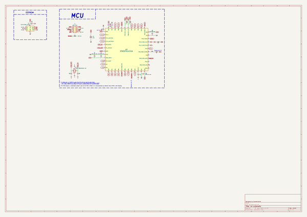
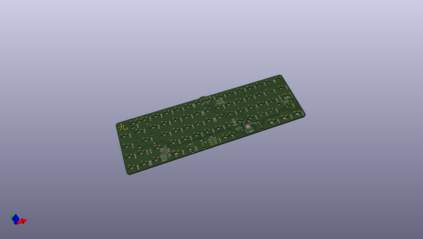
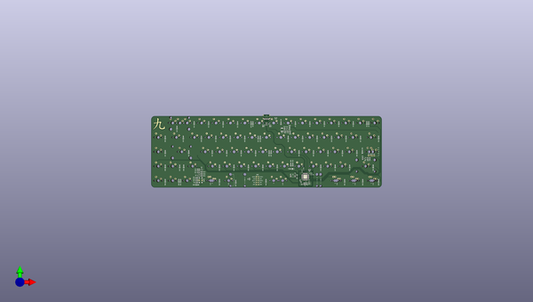
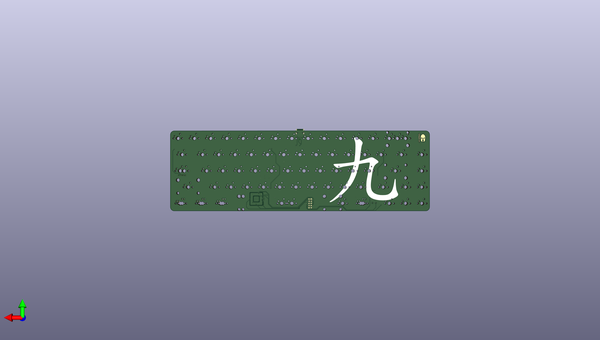

# jiu
 
## summary 
* id: acheronproject_jiu_jiu
* user: acheronproject
* name: jiu
* board: jiu
* repo: https://github.com/AcheronProject/Jiu
* src_file_repo_kicad_pcb: pcb_kicad_files/jiu.kicad_pcb
* src_file_repo_kicad_pcb_link: https://github.com/AcheronProject/Jiu/tree/master/pcb_kicad_files/jiu.kicad_pcb
* src_file_repo_kicad_sch: pcb_kicad_files/jiu.kicad_sch
* src_file_repo_kicad_sch_link: https://github.com/AcheronProject/Jiu/tree/master/pcb_kicad_files/jiu.kicad_sch

* src_file_repo_sch: 
* src_file_repo_sch_link: https://github.com/AcheronProject/Jiu/tree/master/

## schematic  
  
[schematic (pdf)](working_schematic.pdf)  

## pcb  
 
  
  
  
[board (pdf)](working.pdf)  

## working_bom
| Id | Designator | Footprint | Quantity | Designation | Supplier and ref |  | None | 
| --- | --- | --- | --- | --- | --- | --- | --- | 
| 1 | R16,R3,R12,R11,R8 | R_0805_2012Metric | 5 | 10k |  |  | [''] | 
| 2 | J2 | TYPE-C-31-M-12 | 1 | TYPE-C-31-M-12 |  |  | [''] | 
| 3 | D66,D61,D13,D27,D23,D51,D68,D57,D22,D35,D62,D4,D65,D49,D21,D58,D37,D46,D63,D59,D28,D6,D2,D47,D1,D33,D34,D26,D14,D24,D43,D42,D11,D41,D44,D19,D55,D29,D3,D52,D5,D48,D64,D8,D16,D39,D45,D50,D9,D17,D20,D32,D15,D7,D30,D18,D31,D54,D10,D25,D12,D53,D67,D56,D40,D60,D36,D38 | D_SOD-123 | 68 | 1N4148W |  |  | [''] | 
| 4 | SW75 | K2-1187SQ-A4SW-06 | 1 | K2-1187SQ-A4SW-06 |  |  | [''] | 
| 5 | R9 | R_0805_2012Metric | 1 | 330k |  |  | [''] | 
| 6 | R18,R17 | R_0805_2012Metric | 2 | 5.1k |  |  | [''] | 
| 7 | C7 | C_0402_1005Metric | 1 | 10n |  |  | [''] | 
| 8 | R4,R2,R1 | R_0402_1005Metric | 3 | 1.5k |  |  | [''] | 
| 9 | D69 | D_SOD-123 | 1 | RB060M-60 |  |  | [''] | 
| 10 | C9,C8 | C_0402_1005Metric | 2 | 16p |  |  | [''] | 
| 11 | C14,C15 | C_0805_2012Metric | 2 | 1u |  |  | [''] | 
| 12 | C6 | C_0402_1005Metric | 1 | 1u |  |  | [''] | 
| 13 | C5 | CP_EIA-3216-10_Kemet-I_Pad1.58x1.35mm_HandSolder | 1 | 10u |  |  | [''] | 
| 14 | R15,R7,R14 | R_0805_2012Metric | 3 | 100 |  |  | [''] | 
| 15 | R6 | R_0805_2012Metric | 1 | 1k |  |  | [''] | 
| 16 | C3,C2,C1,C10,C4 | C_0402_1005Metric | 5 | 100n |  |  | [''] | 
| 17 | U1 | TSSOP-8_4.4x3mm_P0.65mm | 1 | BL24C256A-SFRC |  |  | [''] | 
| 18 | R5 | R_0805_2012Metric | 1 | 0R |  |  | [''] | 
| 19 | R19,R20,R10 | R_0805_2012Metric | 3 | 1M |  |  | [''] | 
| 20 | F1 | Fuse_1812_4532 | 1 | mSMD110-16V |  |  | [''] | 
| 21 | Q2,Q3,Q1 | SOT-23 | 3 | 2N7002 |  |  | [''] | 
| 22 | U4 | SOT-23 | 1 | MCP1700T-3302E/TT |  |  | [''] | 
| 23 | U2 | STM_UFQFPN-48_LQFP-48-1EP_7x7mm_P0.5mm_HandSoldering_ThermalReliefs | 1 | STM32F411CEU6 |  |  | [''] | 
| 24 | C11 | C_0402_1005Metric | 1 | 4.7u |  |  | [''] | 
| 25 | R13 | R_0805_2012Metric | 1 | 100k |  |  | [''] | 
| 26 | U3 | SOT-23-6 | 1 | SRV05-4-P-T7 |  |  | [''] | 
| 27 | FB1 | L_0805_2012Metric | 1 | GZ2012D601TF |  |  | [''] | 
| 28 | C13 | C_0805_2012Metric | 1 | 100n |  |  | [''] | 
| 29 | C12 | C_0805_2012Metric | 1 | 10u |  |  | [''] | 
| 30 | Y1 | Crystal_SMD_3225-4Pin_3.2x2.5mm | 1 | 7325-0800A2010-00 |  |  | [''] | 

## bom_schematic
| Ref | Qnty | Value | Cmp name | Footprint | Description | Vendor | DNP | 
| --- | --- | --- | --- | --- | --- | --- | --- | 
| C1, C2, C3, C4, C10 | 5 | 100n | C_Small | Capacitor_SMD:C_0402_1005Metric | Unpolarized capacitor, small symbol |  |  | 
| C5 | 1 | 10u | CP1 | acheron_Components:CP_EIA-3216-10_Kemet-I_Pad1.58x1.35mm_HandSolder | Polarized capacitor, US symbol |  |  | 
| C6 | 1 | 1u | C_Small | Capacitor_SMD:C_0402_1005Metric | Unpolarized capacitor, small symbol |  |  | 
| C7 | 1 | 10n | C_Small | Capacitor_SMD:C_0402_1005Metric | Unpolarized capacitor, small symbol |  |  | 
| C8, C9 | 2 | 16p | C_Small | Capacitor_SMD:C_0402_1005Metric | Unpolarized capacitor, small symbol |  |  | 
| C11 | 1 | 4.7u | C_Small | Capacitor_SMD:C_0402_1005Metric | Unpolarized capacitor, small symbol |  |  | 
| C12 | 1 | 10u | C_Small | Capacitor_SMD:C_0805_2012Metric | Unpolarized capacitor, small symbol |  |  | 
| C13 | 1 | 100n | C_Small | Capacitor_SMD:C_0805_2012Metric | Unpolarized capacitor, small symbol |  |  | 
| C14, C15 | 2 | 1u | C_Small | Capacitor_SMD:C_0805_2012Metric | Unpolarized capacitor, small symbol |  |  | 
| D1, D2, D3, D4, D5, D6, D7, D8, D9, D10, D11, D12, D13, D14, D15, D16, D17, D18, D19, D20, D21, D22, D23, D24, D25, D26, D27, D28, D29, D30, D31, D32, D33, D34, D35, D36, D37, D38, D39, D40, D41, D42, D43, D44, D45, D46, D47, D48, D49, D50, D51, D52, D53, D54, D55, D56, D57, D58, D59, D60, D61, D62, D63, D64, D65, D66, D67, D68 | 68 | 1N4148W | D | acheron_Components:D_SOD-123 | Diode |  |  | 
| D69 | 1 | RB060M-60 | D | acheron_Components:D_SOD-123 | Diode |  |  | 
| F1 | 1 | mSMD110-16V | Polyfuse_Small | acheron_Components:Fuse_1812_4532 | Resettable fuse, polymeric positive temperature coefficient, small symbol |  |  | 
| FB1 | 1 | GZ2012D601TF | Ferrite_Bead | Inductor_SMD:L_0805_2012Metric | Ferrite bead |  |  | 
| J2 | 1 | TYPE-C-31-M-12 | TYPE-C-31-M12_13 | acheron_Connectors:TYPE-C-31-M-12 |  |  |  | 
| Q1, Q2, Q3 | 3 | 2N7002 | 2N7002 | Package_TO_SOT_SMD:SOT-23 | 0.115A Id, 60V Vds, N-Channel MOSFET, SOT-23 |  |  | 
| R1, R2, R4 | 3 | 1.5k | R_Small | Resistor_SMD:R_0402_1005Metric | Resistor, small symbol |  |  | 
| R3, R8, R11, R12, R16 | 5 | 10k | R_Small | Resistor_SMD:R_0805_2012Metric | Resistor, small symbol |  |  | 
| R5 | 1 | 0R | R_Small | Resistor_SMD:R_0805_2012Metric | Resistor, small symbol |  |  | 
| R6 | 1 | 1k | R_Small | Resistor_SMD:R_0805_2012Metric | Resistor, small symbol |  |  | 
| R7, R14, R15 | 3 | 100 | R_Small | Resistor_SMD:R_0805_2012Metric | Resistor, small symbol |  |  | 
| R9 | 1 | 330k | R_Small | Resistor_SMD:R_0805_2012Metric | Resistor, small symbol |  |  | 
| R10 | 1 | 1M | R_Small | Resistor_SMD:R_0805_2012Metric | Resistor, small symbol |  |  | 
| R13, R19, R20 | 3 | 100k | R_Small | Resistor_SMD:R_0805_2012Metric | Resistor, small symbol |  |  | 
| R17, R18 | 2 | 5.1k | R_Small | Resistor_SMD:R_0805_2012Metric |  |  |  | 
| SW75 | 1 | K2-1187SQ-A4SW-06 | SW_Push | acheron_Hardware:K2-1187SQ-A4SW-06 | Push button switch, generic, two pins |  |  | 
| U1 | 1 | BL24C256A-SFRC | 24LC256 | acheron_Components:TSSOP-8_4.4x3mm_P0.65mm | I2C Serial EEPROM, 256Kb, DIP-8/SOIC-8/TSSOP-8/DFN-8 |  |  | 
| U2 | 1 | STM32F411CEU6 | STM32F411-48 | acheron_Components:STM_UFQFPN-48_LQFP-48-1EP_7x7mm_P0.5mm_HandSoldering_ThermalReliefs | UFQFPN-48 Arm® Cortex®-M4 32bits MCU+FPU, 125 DMIPS, 512KB Flash,   128KB RAM, USB OTG FS, 11 TIMs, 1 ADC, 13 comm. interfaces |  |  | 
| U3 | 1 | SRV05-4-P-T7 | SRV05-4 | acheron_Components:SOT-23-6 | ESD Protection Diodes with Low Clamping Voltage, SOT-23-6 |  |  | 
| U4 | 1 | MCP1700T-3302E/TT | MCP1700-3302E_SOT23 | Package_TO_SOT_SMD:SOT-23 | 250mA Low Quiscent Current LDO, 3.3V output, SOT-23 |  |  | 
| Y1 | 1 | 7325-0800A2010-00 | Crystal_GND24 | acheron_Components:Crystal_SMD_3225-4Pin_3.2x2.5mm | Four pin crystal, GND on pins 2 and 4 |  |  | 

## positions
### top
| # Ref | Val | Package | PosX | PosY | Rot | Side | 
| --- | --- | --- | --- | --- | --- | --- | 
| C1 | 100n | C_0402_1005Metric | -105.15 | -67.5834 | 180.0 | top | 
| C2 | 100n | C_0402_1005Metric | -97.3 | -77.5334 | 180.0 | top | 
| C3 | 100n | C_0402_1005Metric | -98.6 | -74.9334 | 180.0 | top | 
| C4 | 100n | C_0402_1005Metric | -96.0 | -64.9334 | -90.0 | top | 
| C5 | 10u | CP_EIA-3216-10_Kemet-I_Pad1.58x1.35mm_HandSolder | -110.2 | -60.6 | 180.0 | top | 
| C6 | 1u | C_0402_1005Metric | -85.9 | -78.0134 | -90.0 | top | 
| C7 | 10n | C_0402_1005Metric | -87.4 | -78.0134 | -90.0 | top | 
| C8 | 16p | C_0402_1005Metric | -89.0 | -79.2634 | -90.0 | top | 
| C9 | 16p | C_0402_1005Metric | -95.2 | -80.7834 | -90.0 | top | 
| C10 | 100n | C_0402_1005Metric | -86.57 | -66.5834 | 180.0 | top | 
| C11 | 4.7u | C_0402_1005Metric | -84.1625 | -68.4 | 180.0 | top | 
| C12 | 10u | C_0805_2012Metric | -234.6095 | -76.499 | 180.0 | top | 
| C13 | 100n | C_0805_2012Metric | -232.4 | -61.0 | 180.0 | top | 
| C14 | 1u | C_0805_2012Metric | -118.9915 | -7.7818 | -90.0 | top | 
| C15 | 1u | C_0805_2012Metric | -114.6415 | -11.1022 | 180.0 | top | 
| D1 | 1N4148W | D_SOD-123 | -8.3344 | 0.0 | 90.0 | top | 
| D2 | 1N4148W | D_SOD-123 | -10.7156 | 0.0 | 90.0 | top | 
| D3 | 1N4148W | D_SOD-123 | -28.575 | 0.0 | 90.0 | top | 
| D4 | 1N4148W | D_SOD-123 | -47.625 | 0.0 | 90.0 | top | 
| D5 | 1N4148W | D_SOD-123 | -66.675 | 0.0 | 90.0 | top | 
| D6 | 1N4148W | D_SOD-123 | -85.725 | 0.0 | 90.0 | top | 
| D7 | 1N4148W | D_SOD-123 | -104.775 | 0.0 | 90.0 | top | 
| D8 | 1N4148W | D_SOD-123 | -123.825 | 0.0 | 90.0 | top | 
| D9 | 1N4148W | D_SOD-123 | -160.7344 | 0.0 | 90.0 | top | 
| D10 | 1N4148W | D_SOD-123 | -163.1156 | 0.0 | 90.0 | top | 
| D11 | 1N4148W | D_SOD-123 | -180.975 | 0.0 | 90.0 | top | 
| D12 | 1N4148W | D_SOD-123 | -200.025 | 0.0 | 90.0 | top | 
| D13 | 1N4148W | D_SOD-123 | -219.075 | 0.0 | 90.0 | top | 
| D14 | 1N4148W | D_SOD-123 | -238.125 | 0.0 | 90.0 | top | 
| D15 | 1N4148W | D_SOD-123 | -260.8 | -5.9334 | 90.0 | top | 
| D16 | 1N4148W | D_SOD-123 | 4.7625 | -19.05 | 90.0 | top | 
| D17 | 1N4148W | D_SOD-123 | -19.05 | -19.05 | 90.0 | top | 
| D18 | 1N4148W | D_SOD-123 | -38.1 | -19.05 | 90.0 | top | 
| D19 | 1N4148W | D_SOD-123 | -57.15 | -19.05 | 90.0 | top | 
| D20 | 1N4148W | D_SOD-123 | -76.2 | -19.05 | 90.0 | top | 
| D21 | 1N4148W | D_SOD-123 | -95.25 | -19.05 | 90.0 | top | 
| D22 | 1N4148W | D_SOD-123 | -114.3 | -19.05 | 90.0 | top | 
| D23 | 1N4148W | D_SOD-123 | -151.0 | -19.05 | 90.0 | top | 
| D24 | 1N4148W | D_SOD-123 | -153.8 | -19.05 | 90.0 | top | 
| D25 | 1N4148W | D_SOD-123 | -171.45 | -19.05 | 90.0 | top | 
| D26 | 1N4148W | D_SOD-123 | -190.6031 | -19.05 | 90.0 | top | 
| D27 | 1N4148W | D_SOD-123 | -209.55 | -19.05 | 90.0 | top | 
| D28 | 1N4148W | D_SOD-123 | -228.6 | -19.05 | 90.0 | top | 
| D29 | 1N4148W | D_SOD-123 | -252.4125 | -19.05 | 90.0 | top | 
| D30 | 1N4148W | D_SOD-123 | -276.225 | -19.05 | 90.0 | top | 
| D31 | 1N4148W | D_SOD-123 | -16.6687 | -38.1 | 90.0 | top | 
| D32 | 1N4148W | D_SOD-123 | -23.8125 | -38.1 | 90.0 | top | 
| D33 | 1N4148W | D_SOD-123 | -42.8625 | -38.1 | 90.0 | top | 
| D34 | 1N4148W | D_SOD-123 | -61.9125 | -38.1 | 90.0 | top | 
| D35 | 1N4148W | D_SOD-123 | -80.9625 | -38.1 | 90.0 | top | 
| D36 | 1N4148W | D_SOD-123 | -100.0125 | -38.1 | 90.0 | top | 
| D37 | 1N4148W | D_SOD-123 | -136.8 | -38.1 | 90.0 | top | 
| D38 | 1N4148W | D_SOD-123 | -139.4 | -38.1 | 90.0 | top | 
| D39 | 1N4148W | D_SOD-123 | -157.1625 | -38.1 | 90.0 | top | 
| D40 | 1N4148W | D_SOD-123 | -176.2125 | -38.1 | 90.0 | top | 
| D41 | 1N4148W | D_SOD-123 | -195.2625 | -38.1 | 90.0 | top | 
| D42 | 1N4148W | D_SOD-123 | -214.3125 | -38.1 | 90.0 | top | 
| D43 | 1N4148W | D_SOD-123 | -245.2687 | -38.1 | 90.0 | top | 
| D44 | 1N4148W | D_SOD-123 | -276.225 | -38.1 | 90.0 | top | 
| D45 | 1N4148W | D_SOD-123 | -2.3813 | -57.15 | 90.0 | top | 
| D46 | 1N4148W | D_SOD-123 | -33.3375 | -57.15 | 90.0 | top | 
| D47 | 1N4148W | D_SOD-123 | -52.3875 | -57.15 | 90.0 | top | 
| D48 | 1N4148W | D_SOD-123 | -71.4375 | -57.15 | 90.0 | top | 
| D49 | 1N4148W | D_SOD-123 | -108.2 | -54.7687 | 90.0 | top | 
| D50 | 1N4148W | D_SOD-123 | -110.8 | -54.7687 | 90.0 | top | 
| D51 | 1N4148W | D_SOD-123 | -128.6906 | -57.15 | 90.0 | top | 
| D52 | 1N4148W | D_SOD-123 | -147.6375 | -57.15 | 90.0 | top | 
| D53 | 1N4148W | D_SOD-123 | -166.6875 | -57.15 | 90.0 | top | 
| D54 | 1N4148W | D_SOD-123 | -185.7375 | -57.15 | 90.0 | top | 
| D55 | 1N4148W | D_SOD-123 | -204.7875 | -57.15 | 90.0 | top | 
| D56 | 1N4148W | D_SOD-123 | -251.8971 | -57.15 | 90.0 | top | 
| D57 | 1N4148W | D_SOD-123 | -257.175 | -57.15 | 90.0 | top | 
| D58 | 1N4148W | D_SOD-123 | -276.225 | -57.15 | 90.0 | top | 
| D59 | 1N4148W | D_SOD-123 | 4.7625 | -76.2 | 90.0 | top | 
| D60 | 1N4148W | D_SOD-123 | -16.1534 | -76.2 | 90.0 | top | 
| D61 | 1N4148W | D_SOD-123 | -39.9659 | -76.2 | 90.0 | top | 
| D62 | 1N4148W | D_SOD-123 | -143.5625 | -76.2 | 90.0 | top | 
| D63 | 1N4148W | D_SOD-123 | -204.7875 | -76.2 | 90.0 | top | 
| D64 | 1N4148W | D_SOD-123 | -255.9844 | -76.2 | 90.0 | top | 
| D65 | 1N4148W | D_SOD-123 | -258.3656 | -76.2 | 90.0 | top | 
| D66 | 1N4148W | D_SOD-123 | -276.225 | -76.2 | 90.0 | top | 
| D67 | 1N4148W | D_SOD-123 | -183.3562 | -77.3906 | 90.0 | top | 
| D68 | 1N4148W | D_SOD-123 | -233.8 | -81.6 | 0.0 | top | 
| D69 | RB060M-60 | D_SOD-123 | -112.4415 | -7.3022 | -90.0 | top | 
| F1 | mSMD110-16V | Fuse_1812_4532 | -122.4365 | -9.0868 | -90.0 | top | 
| FB1 | GZ2012D601TF | L_0805_2012Metric | -130.556 | 6.604 | 180.0 | top | 
| GR1 | Jiu_Plated_Logo | jiu_logo_15.9x15.0mm | -284.5594 | -1.1906 | 0.0 | top | 
| J1 | RESET_PINS | THT_reset_contacts | -229.6 | -75.6 | 180.0 | top | 
| J2 | TYPE-C-31-M-12 | TYPE-C-31-M-12 | -142.8925 | 4.42 | 180.0 | top | 
| LED1 | LED | LED_THT_2.54mm | -7.1437 | -43.18 | 180.0 | top | 
| LED2 | LED | LED_THT_2.54mm | -2.3813 | -43.18 | 0.0 | top | 
| Q1 | 2N7002 | SOT-23 | -12.9112 | -46.98 | 180.0 | top | 
| Q2 | 2N7002 | SOT-23 | -228.4 | -61.4 | 90.0 | top | 
| Q3 | 2N7002 | SOT-23 | -232.4 | -69.0 | 180.0 | top | 
| R1 | 1.5k | R_0402_1005Metric | -102.55 | -71.9334 | 180.0 | top | 
| R2 | 1.5k | R_0402_1005Metric | -102.55 | -69.9334 | 180.0 | top | 
| R3 | 10k | R_0805_2012Metric | -165.1625 | -74.0 | 90.0 | top | 
| R4 | 1.5k | R_0402_1005Metric | -93.8 | -61.7834 | 90.0 | top | 
| R5 | 0R | R_0805_2012Metric | -86.2795 | -62.0 | 180.0 | top | 
| R6 | 1k | R_0805_2012Metric | -16.3112 | -46.98 | -90.0 | top | 
| R7 | 100 | R_0805_2012Metric | -6.9112 | -46.98 | -90.0 | top | 
| R8 | 10k | R_0805_2012Metric | -9.5113 | -46.98 | 90.0 | top | 
| R9 | 330k | R_0805_2012Metric | -234.6095 | -78.899 | 180.0 | top | 
| R10 | 1M | R_0805_2012Metric | -234.6095 | -74.099 | 0.0 | top | 
| R11 | 10k | R_0805_2012Metric | -234.6 | -71.8 | 0.0 | top | 
| R12 | 10k | R_0805_2012Metric | -232.4 | -65.6 | 180.0 | top | 
| R13 | 100k | R_0805_2012Metric | -228.4 | -64.8 | 0.0 | top | 
| R14 | 100 | R_0805_2012Metric | -228.4 | -69.8 | 0.0 | top | 
| R15 | 100 | R_0805_2012Metric | -232.4 | -63.2 | 0.0 | top | 
| R16 | 10k | R_0805_2012Metric | -228.4 | -67.4 | 0.0 | top | 
| R17 | 5.1k | R_0805_2012Metric | -138.4 | -3.9575 | -90.0 | top | 
| R18 | 5.1k | R_0805_2012Metric | -147.5915 | -3.9791 | -90.0 | top | 
| R19 | 1M | R_0805_2012Metric | -118.4415 | -11.1022 | 0.0 | top | 
| R20 | 1M | R_0805_2012Metric | -111.65 | -11.8328 | -90.0 | top | 
| SW1 | 1U | MX100 | 0.0 | 0.0 | 0.0 | top | 
| SW2 | 1U | MX100 | -19.05 | 0.0 | 0.0 | top | 
| SW3 | 1U | MX100 | -38.1 | 0.0 | 0.0 | top | 
| SW4 | 1U | MX100 | -57.15 | 0.0 | 0.0 | top | 
| SW5 | 1U | MX100 | -76.2 | 0.0 | 0.0 | top | 
| SW6 | 1U | MX100 | -95.25 | 0.0 | 0.0 | top | 
| SW7 | 1U | MX100 | -114.3 | 0.0 | 0.0 | top | 
| SW8 | 1U | MX100 | -133.35 | 0.0 | 0.0 | top | 
| SW9 | 1U | MX100 | -152.4 | 0.0 | 0.0 | top | 
| SW10 | 1U | MX100 | -171.45 | 0.0 | 0.0 | top | 
| SW11 | 1U | MX100 | -190.5 | 0.0 | 0.0 | top | 
| SW12 | 1U | MX100 | -209.55 | 0.0 | 0.0 | top | 
| SW13 | 1U | MX100 | -228.6 | 0.0 | 0.0 | top | 
| SW14 | 1U | MX100 | -247.65 | 0.0 | 0.0 | top | 
| SW15 | 1U | MX100 | -266.7 | 0.0 | 0.0 | top | 
| SW16 | 2u | MX200 | -257.175 | 0.0 | 0.0 | top | 
| SW17 | 1.5U | MX150 | -4.7625 | -19.05 | 0.0 | top | 
| SW18 | 1U | MX100 | -28.575 | -19.05 | 0.0 | top | 
| SW19 | 1U | MX100 | -47.625 | -19.05 | 0.0 | top | 
| SW20 | 1U | MX100 | -66.675 | -19.05 | 0.0 | top | 
| SW21 | 1U | MX100 | -85.725 | -19.05 | 0.0 | top | 
| SW22 | 1U | MX100 | -104.775 | -19.05 | 0.0 | top | 
| SW23 | 1U | MX100 | -123.825 | -19.05 | 0.0 | top | 
| SW24 | 1U | MX100 | -142.875 | -19.05 | 0.0 | top | 
| SW25 | 1U | MX100 | -161.925 | -19.05 | 0.0 | top | 
| SW26 | 1U | MX100 | -180.975 | -19.05 | 0.0 | top | 
| SW27 | 1U | MX100 | -200.025 | -19.05 | 0.0 | top | 
| SW28 | 1U | MX100 | -219.075 | -19.05 | 0.0 | top | 
| SW29 | 1U | MX100 | -238.125 | -19.05 | 0.0 | top | 
| SW30 | 1.5U | MX150 | -261.9375 | -19.05 | 0.0 | top | 
| SW31 | 1U | MX100 | -285.75 | -19.05 | 0.0 | top | 
| SW32 | 1.75U | MX175 | -7.1437 | -38.1 | 0.0 | top | 
| SW33 | 1U | MX100 | -33.3375 | -38.1 | 0.0 | top | 
| SW34 | 1U | MX100 | -52.3875 | -38.1 | 0.0 | top | 
| SW35 | 1U | MX100 | -71.4375 | -38.1 | 0.0 | top | 
| SW36 | 1U | MX100 | -90.4875 | -38.1 | 0.0 | top | 
| SW37 | 1U | MX100 | -109.5375 | -38.1 | 0.0 | top | 
| SW38 | 1U | MX100 | -128.5875 | -38.1 | 0.0 | top | 
| SW39 | 1U | MX100 | -147.6375 | -38.1 | 0.0 | top | 
| SW40 | 1U | MX100 | -166.6875 | -38.1 | 0.0 | top | 
| SW41 | 1U | MX100 | -185.7375 | -38.1 | 0.0 | top | 
| SW42 | 1U | MX100 | -204.7875 | -38.1 | 0.0 | top | 
| SW43 | 1U | MX100 | -223.8375 | -38.1 | 0.0 | top | 
| SW44 | 2.25U | MX225 | -254.7937 | -38.1 | 0.0 | top | 
| SW45 | 1U | MX100 | -285.75 | -38.1 | 0.0 | top | 
| SW46 | 1.25U | MX125 | -2.3813 | -38.1 | 0.0 | top | 
| SW47 | 2.25U | MX225R | -11.9062 | -57.15 | 0.0 | top | 
| SW48 | 1U | MX100 | -42.8625 | -57.15 | 0.0 | top | 
| SW49 | 1U | MX100 | -61.9125 | -57.15 | 0.0 | top | 
| SW50 | 1U | MX100 | -80.9625 | -57.15 | 0.0 | top | 
| SW51 | 1U | MX100 | -100.0125 | -57.15 | 0.0 | top | 
| SW52 | 1U | MX100 | -119.0625 | -57.15 | 0.0 | top | 
| SW53 | 1U | MX100 | -138.1125 | -57.15 | 0.0 | top | 
| SW54 | 1U | MX100 | -157.1625 | -57.15 | 0.0 | top | 
| SW55 | 1U | MX100 | -176.2125 | -57.15 | 0.0 | top | 
| SW56 | 1U | MX100 | -195.2625 | -57.15 | 0.0 | top | 
| SW57 | 1U | MX100 | -214.3125 | -57.15 | 0.0 | top | 
| SW58 | 1.75U | MX175 | -240.5062 | -57.15 | 0.0 | top | 
| SW59 | 1U | MX100 | -266.7 | -57.15 | 0.0 | top | 
| SW60 | 1U | MX100 | -285.75 | -57.15 | 0.0 | top | 
| SW61 | 1.5U | MX150 | -4.7625 | -76.2 | 0.0 | top | 
| SW62 | 1U | MX100 | -28.575 | -76.2 | 0.0 | top | 
| SW63 | 1.5U | MX150 | -52.3875 | -76.2 | 0.0 | top | 
| SW64 | 7U | MX700R | -133.35 | -76.2 | 0.0 | top | 
| SW65 | 1.5U | MX150 | -214.3125 | -76.2 | 0.0 | top | 
| SW66 | 1U | MX100 | -247.65 | -76.2 | 0.0 | top | 
| SW67 | 1U | MX100 | -266.7 | -76.2 | 0.0 | top | 
| SW68 | 1U | MX100 | -285.75 | -76.2 | 0.0 | top | 
| SW69 | 1.25U | MX125 | -2.3813 | -76.2 | 0.0 | top | 
| SW70 | 1.25U | MX125 | -26.1937 | -76.2 | 0.0 | top | 
| SW71 | 1.25U | MX125 | -50.0062 | -76.2 | 0.0 | top | 
| SW72 | 6.25U | MX625R | -121.4437 | -76.2 | 0.0 | top | 
| SW73 | 1.25U | MX125 | -192.8812 | -76.2 | 0.0 | top | 
| SW74 | 1.25U | MX125 | -216.6937 | -76.2 | 0.0 | top | 
| SW75 | K2-1187SQ-A4SW- | K2-1187SQ-A4SW-06 | -229.6 | -75.6 | 90.0 | top | 
| U1 | BL24C256A-SFRC | TSSOP-8_4.4x3mm_P0.65mm | -108.15 | -70.2834 | 0.0 | top | 
| U2 | STM32F411CEU6 | STM_UFQFPN-48_LQFP-48-1EP_7x7mm_P0.5mm_HandSolde | -91.8 | -70.9334 | 90.0 | top | 
| U3 | SRV05-4-P-T7 | SOT-23-6 | -142.8925 | -1.4855 | 90.0 | top | 
| U4 | MCP1700T-3302E/ | SOT-23 | -115.85 | -7.8328 | 90.0 | top | 
| Y1 | 7325-0800A2010- | Crystal_SMD_3225-4Pin_3.2x2.5mm | -92.1125 | -80.1834 | 180.0 | top | 

### bottom
| # Ref | Val | Package | PosX | PosY | Rot | Side | 
| --- | --- | --- | --- | --- | --- | --- | 
| GR2 | Huge_Jiu_Logo | jiu_logo_80x75.6 | -217.5912 | -36.83 | 180.0 | bottom | 
| GR3 | Acheron_Plated_Logo | acheronShort_0.3x0.5in_Plated | -285.6405 | 0.4263 | 180.0 | bottom | 

