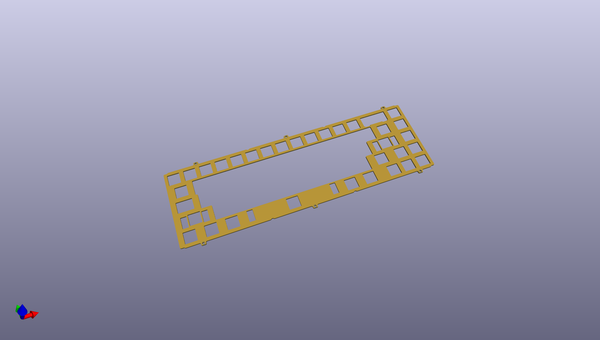
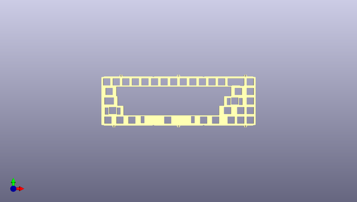
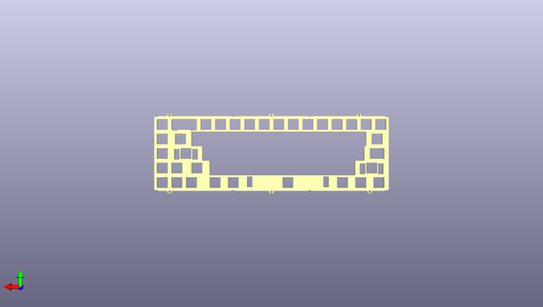

# kbd67mkii_plates
 
## summary 
* id: acheronproject_kbd67mkii_plates_kbd67mkii_iso_plate
* user: acheronproject
* name: kbd67mkii_plates
* board: kbd67mkii_iso_plate
* repo: https://github.com/AcheronProject/kbd67mkii_plates
* src_file_repo_kicad_pcb: kicad_files/kbd67mkii_ansi_half_plate.kicad_pcb
* src_file_repo_kicad_pcb_link: https://github.com/AcheronProject/kbd67mkii_plates/tree/master/kicad_files/kbd67mkii_ansi_half_plate.kicad_pcb

* src_file_repo_sch: 
* src_file_repo_sch_link: https://github.com/AcheronProject/kbd67mkii_plates/tree/master/

## pcb  
 
  
  
  
[board (pdf)](working.pdf)  

## working_bom
| Id | Designator | Footprint | Quantity | Designation | Supplier and ref |  | None | 
| --- | --- | --- | --- | --- | --- | --- | --- | 
| 1 | REF**,REF**,REF**,REF**,REF**,REF**,REF**,REF**,REF**,REF**,REF**,REF**,REF**,REF**,REF**,REF**,REF**,REF**,REF**,REF**,REF** | MX100 | 21 | MX100 |  |  | [''] | 
| 2 | REF**,REF**,REF**,REF**,REF** | MX125 | 5 | MX125 |  |  | [''] | 
| 3 | REF** | MX175 | 1 | MX175 |  |  | [''] | 
| 4 | REF**,REF** | MX150 | 2 | MX150 |  |  | [''] | 
| 5 | REF** | MX625 | 1 | MX625 |  |  | [''] | 
| 6 | REF**,REF** | MX225 | 2 | MX225 |  |  | [''] | 

## positions
### top
| # Ref | Val | Package | PosX | PosY | Rot | Side | 
| --- | --- | --- | --- | --- | --- | --- | 
| REF** | MX100 | MX100 | 122.1641 | -40.3059 | 0.0 | top | 
| REF** | MX100 | MX100 | 274.5641 | -40.3059 | 0.0 | top | 
| REF** | MX125 | MX125 | 262.6578 | -116.5059 | 0.0 | top | 
| REF** | MX100 | MX100 | 84.0641 | -40.3059 | 0.0 | top | 
| REF** | MX125 | MX125 | 48.3453 | -116.5059 | 0.0 | top | 
| REF** | MX100 | MX100 | 255.5141 | -40.3059 | 0.0 | top | 
| REF** | MX100 | MX100 | 331.7141 | -59.3559 | 0.0 | top | 
| REF** | MX175 | MX175 | 286.4703 | -97.4559 | 0.0 | top | 
| REF** | MX150 | MX150 | 50.7266 | -59.3559 | 0.0 | top | 
| REF** | MX100 | MX100 | 312.6641 | -116.5059 | 0.0 | top | 
| REF** | MX100 | MX100 | 331.7141 | -97.4559 | 0.0 | top | 
| REF** | MX100 | MX100 | 331.7141 | -78.4059 | 0.0 | top | 
| REF** | MX625 | MX625 | 167.4078 | -116.5059 | 180.0 | top | 
| REF** | MX100 | MX100 | 103.1141 | -40.3059 | 0.0 | top | 
| REF** | MX100 | MX100 | 217.4141 | -40.3059 | 0.0 | top | 
| REF** | MX100 | MX100 | 236.4641 | -40.3059 | 0.0 | top | 
| REF** | MX150 | MX150 | 307.9016 | -59.3559 | 0.0 | top | 
| REF** | MX100 | MX100 | 65.0141 | -40.3059 | 0.0 | top | 
| REF** | MX100 | MX100 | 179.3141 | -40.3059 | 0.0 | top | 
| REF** | MX100 | MX100 | 293.6141 | -116.5059 | 0.0 | top | 
| REF** | MX100 | MX100 | 331.7141 | -116.5059 | 0.0 | top | 
| REF** | MX125 | MX125 | 238.8453 | -116.5059 | 0.0 | top | 
| REF** | MX125 | MX125 | 95.9703 | -116.5059 | 0.0 | top | 
| REF** | MX125 | MX125 | 72.1578 | -116.5059 | 0.0 | top | 
| REF** | MX100 | MX100 | 160.2641 | -40.3059 | 0.0 | top | 
| REF** | MX100 | MX100 | 312.6641 | -97.4559 | 0.0 | top | 
| REF** | MX225 | MX225 | 57.8703 | -97.4559 | 0.0 | top | 
| REF** | MX100 | MX100 | 198.3641 | -40.3059 | 0.0 | top | 
| REF** | MX100 | MX100 | 331.7141 | -40.3059 | 0.0 | top | 
| REF** | MX225 | MX225 | 300.7578 | -78.4059 | 0.0 | top | 
| REF** | MX100 | MX100 | 141.2141 | -40.3059 | 0.0 | top | 
| REF** | MX100 | MX100 | 45.9641 | -40.3059 | 0.0 | top | 

### bottom
no data
