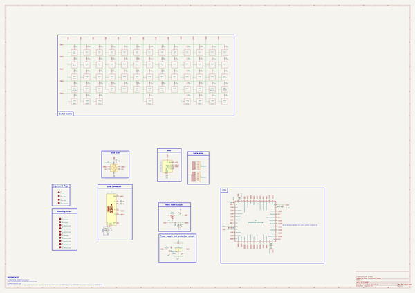
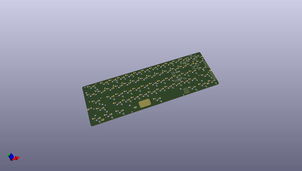
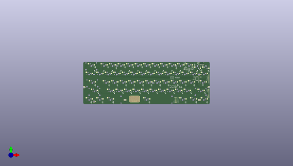
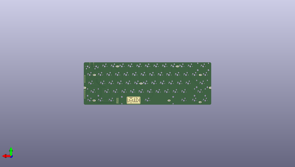

# keebspcb
 
## summary 
* id: acheronproject_keebspcb_keebspcb
* user: acheronproject
* name: keebspcb
* board: keebspcb
* repo: https://github.com/AcheronProject/KeebsPCB
* src_file_repo_kicad_pcb: kicadFiles/keebsPCB.kicad_pcb
* src_file_repo_kicad_pcb_link: https://github.com/AcheronProject/KeebsPCB/tree/master/kicadFiles/keebsPCB.kicad_pcb

* src_file_repo_sch: kicadFiles/keebsPCB.sch
* src_file_repo_sch_link: https://github.com/AcheronProject/KeebsPCB/tree/master/kicadFiles/keebsPCB.sch

## schematic  
  
[schematic (pdf)](working_schematic.pdf)  

## pcb  
 
  
  
  
[board (pdf)](working.pdf)  

## working_bom
| Id | Designator | Footprint | Quantity | Designation | Supplier and ref |  | None | 
| --- | --- | --- | --- | --- | --- | --- | --- | 
| 1 | J1 | TYPE-C-31-M-12 | 1 | TYPE-C-31-M12_13 |  |  | [''] | 
| 2 | CB1 | C_0402_1005Metric | 1 | 1uF |  |  | [''] | 
| 3 | CB3,CB5,CB8,CUSB1 | C_0402_1005Metric | 4 | 100n |  |  | [''] | 
| 4 | CB4,CB6 | C_0402_1005Metric | 2 | 4.7uF |  |  | [''] | 
| 5 | CB7 | C_0402_1005Metric | 1 | 100nF |  |  | [''] | 
| 6 | CRST1,CSI1 | C_0805_2012Metric_Pad1.15x1.40mm_HandSolder | 2 | 10u |  |  | [''] | 
| 7 | CRST2 | C_0805_2012Metric_Pad1.15x1.40mm_HandSolder | 1 | 4.7n |  |  | [''] | 
| 8 | CSH1 | C_0805_2012Metric | 1 | 4.7nF |  |  | [''] | 
| 9 | CSO1 | C_0805_2012Metric_Pad1.15x1.40mm_HandSolder | 1 | 1u |  |  | [''] | 
| 10 | D2,D3,D5,D6,D7,D8,D9,D10,D11,D12,D13,DRST1,D14,D15,D16,D17,D18,D19,D20,D21,D22,D23,D24,D25,D26,D28,D30,D31,D32,D33,D34,D35,D36,D37,D38,D39,D40,D41,D42,D43,D44,D45,D46,D47,D48,D49,D50,D52,D53,D54,D55,D56,D58,D59,D60,D57,D27,D1,D51,D29,D4,DS1 | D_SOD-123 | 62 | 1N4148 |  |  | [''] | 
| 11 | F1 | Fuse_1812_4532 | 1 | Polyfuse |  |  | [''] | 
| 12 | L2 | osh-logo | 1 | OSHLogo |  |  | [''] | 
| 13 | QRST1 | SOT-23 | 1 | DTC123J |  |  | [''] | 
| 14 | RCC1,RCC2 | R_0402_1005Metric | 2 | 5.1k |  |  | [''] | 
| 15 | RRST1 | R_SMD_1026 | 1 | 100k |  |  | [''] | 
| 16 | RSH1 | R_SMD_1026 | 1 | 1M |  |  | [''] | 
| 17 | SW3 | MX100H | 1 | 2 |  |  | [''] | 
| 18 | SW4 | MX100H | 1 | 3 |  |  | [''] | 
| 19 | SW5 | MX100H | 1 | 4 |  |  | [''] | 
| 20 | SW6 | MX100H | 1 | 5 |  |  | [''] | 
| 21 | SW7 | MX100H | 1 | 6 |  |  | [''] | 
| 22 | SW8 | MX100H | 1 | 7 |  |  | [''] | 
| 23 | SW9 | MX100H | 1 | 8 |  |  | [''] | 
| 24 | SW10 | MX100H | 1 | 9 |  |  | [''] | 
| 25 | SW11 | MX100H | 1 | 0 |  |  | [''] | 
| 26 | SW12 | MX100H | 1 | -_ |  |  | [''] | 
| 27 | SW13 | MX100H | 1 | =+ |  |  | [''] | 
| 28 | SWRST1 | smdPushBtn | 1 | SW_Push |  |  | [''] | 
| 29 | U1 | LQFP-48_7x7mm_P0.5mm | 1 | STM32F072-LQFP48 |  |  | [''] | 
| 30 | U2 | SOT-23-6 | 1 | USBLC6-2SC6 |  |  | [''] | 
| 31 | U3 | SOT-23 | 1 | MCP1700-3302E_SOT23 |  |  | [''] | 
| 32 | SW14 | MX200H | 1 | BKSP_200 |  |  | [''] | 
| 33 | SW16 | MX100H | 1 | Q |  |  | [''] | 
| 34 | SW17 | MX100H | 1 | W |  |  | [''] | 
| 35 | SW18 | MX100H | 1 | E |  |  | [''] | 
| 36 | SW19 | MX100H | 1 | R |  |  | [''] | 
| 37 | SW20 | MX100H | 1 | T |  |  | [''] | 
| 38 | SW21 | MX100H | 1 | Y |  |  | [''] | 
| 39 | SW22 | MX100H | 1 | U |  |  | [''] | 
| 40 | SW23 | MX100H | 1 | I |  |  | [''] | 
| 41 | SW24,SW38 | MX100H | 2 | L |  |  | [''] | 
| 42 | SW25 | MX100H | 1 | O |  |  | [''] | 
| 43 | SW26 | MX100H | 1 | P |  |  | [''] | 
| 44 | SW29 | MX175H | 1 | CAPS_175 |  |  | [''] | 
| 45 | SW30 | MX100H | 1 | A |  |  | [''] | 
| 46 | SW31 | MX100H | 1 | S |  |  | [''] | 
| 47 | SW32 | MX100H | 1 | D |  |  | [''] | 
| 48 | SW33 | MX100H | 1 | F |  |  | [''] | 
| 49 | SW34 | MX100H | 1 | G |  |  | [''] | 
| 50 | SW35 | MX100H | 1 | H |  |  | [''] | 
| 51 | SW36 | MX100H | 1 | J |  |  | [''] | 
| 52 | SW37 | MX100H | 1 | K |  |  | [''] | 
| 53 | SW39 | MX100H | 1 | :; |  |  | [''] | 
| 54 | SW40 | MX100H | 1 | ";;;
55;SW41" | MX225H | 1 | ['ENTER_225', '', '', ''] | 
| 56 | SW42 | MX225H | 1 | LSHIFT_225 |  |  | [''] | 
| 57 | SW43 | MX100H | 1 | Z |  |  | [''] | 
| 58 | SW44 | MX100H | 1 | X |  |  | [''] | 
| 59 | SW45 | MX100H | 1 | C |  |  | [''] | 
| 60 | SW46 | MX100H | 1 | V |  |  | [''] | 
| 61 | SW47 | MX100H | 1 | B |  |  | [''] | 
| 62 | SW48 | MX100H | 1 | N |  |  | [''] | 
| 63 | SW49 | MX100H | 1 | M |  |  | [''] | 
| 64 | SW50 | MX100H | 1 | <, |  |  | [''] | 
| 65 | SW51 | MX100H | 1 | .> |  |  | [''] | 
| 66 | SW52 | MX100H | 1 | ?/ |  |  | [''] | 
| 67 | SW54,SW56,SW58,SW60 | MX150H | 4 | MXSwitch |  |  | [''] | 
| 68 | SW55,SW59 | MX100H | 2 | MXSwitch |  |  | [''] | 
| 69 | SW57 | MX700HR | 1 | MXSwitch |  |  | [''] | 
| 70 | SW2 | MX100H | 1 | 1 |  |  | [''] | 
| 71 | SW28 | MX150H | 1 | ]} |  |  | [''] | 
| 72 | SW1 | MX100H | 1 | ESC |  |  | [''] | 
| 73 | SW15 | MX150H | 1 | TAB_150 |  |  | [''] | 
| 74 | SW27 | MX100H | 1 | [{ |  |  | [''] | 
| 75 | SW53 | MX275H | 1 | RSHIFT_275 |  |  | [''] | 
| 76 | L3 | keebsLabel | 1 | Keebs Label |  |  | [''] | 
| 77 | L4 | keebsLabelMask | 1 | Keebs Label Mask |  |  | [''] | 
| 78 | CB2 | C_0402_1005Metric | 1 | 10n |  |  | [''] | 
| 79 | DF1 | D_SOD-123 | 1 | RB060M-60TR |  |  | [''] | 
| 80 | J2 | Conn_ARM_JTAG_SWD_10 | 1 | Conn_ARM_JTAG_SWD_10 |  |  | [''] | 
| 81 | J3 | PinHeader_1x7_P2.54mm_Vertical | 1 | Conn_01x14 |  |  | [''] | 
| 82 | J4 | PinHeader_1x8_P2.54mm_Vertical | 1 | Conn_01x14 |  |  | [''] | 
| 83 | H6,H1 | halfSideHole | 2 | Half Side Hole  |  |  | [''] | 
| 84 | L1 | keebsLogo | 1 | Keebs Logo |  |  | [''] | 

## bom_schematic
| Ref | Qnty | Value | Cmp name | Footprint | Description | Vendor | DNP | 
| --- | --- | --- | --- | --- | --- | --- | --- | 
| CB1 | 1 | 1uF | C_Small | Capacitor_SMD:C_0402_1005Metric | Unpolarized capacitor, small symbol |  |  | 
| CB2 | 1 | 10n | C_Small | Capacitor_SMD:C_0402_1005Metric | Unpolarized capacitor, small symbol |  |  | 
| CB3, CB5, CB8 | 3 | 100n | C_Small | Capacitor_SMD:C_0402_1005Metric | Unpolarized capacitor, small symbol |  |  | 
| CB4, CB6 | 2 | 4.7uF | C_Small | Capacitor_SMD:C_0402_1005Metric | Unpolarized capacitor, small symbol |  |  | 
| CB7 | 1 | 100nF | C_Small | Capacitor_SMD:C_0402_1005Metric | Unpolarized capacitor, small symbol |  |  | 
| CRST1 | 1 | 10u | C_Small | Capacitor_SMD:C_0805_2012Metric_Pad1.15x1.40mm_HandSolder | Unpolarized capacitor, small symbol |  |  | 
| CRST2 | 1 | 4.7n | C_Small | Capacitor_SMD:C_0805_2012Metric_Pad1.15x1.40mm_HandSolder | Unpolarized capacitor, small symbol |  |  | 
| CSH1 | 1 | 4.7nF | C_Small | Capacitor_SMD:C_0805_2012Metric | Unpolarized capacitor, small symbol |  |  | 
| CSI1 | 1 | 10u | C_Small | Capacitor_SMD:C_0805_2012Metric_Pad1.15x1.40mm_HandSolder | Unpolarized capacitor, small symbol |  |  | 
| CSO1 | 1 | 1u | C_Small | Capacitor_SMD:C_0805_2012Metric_Pad1.15x1.40mm_HandSolder | Unpolarized capacitor, small symbol |  |  | 
| CUSB1 | 1 | 100n | C_Small | Capacitor_SMD:C_0402_1005Metric | Unpolarized capacitor, small symbol |  |  | 
| D1, D2, D3, D4, D5, D6, D7, D8, D9, D10, D11, D12, D13, D14, D15, D16, D17, D18, D19, D20, D21, D22, D23, D24, D25, D26, D27, D28, D29, D30, D31, D32, D33, D34, D35, D36, D37, D38, D39, D40, D41, D42, D43, D44, D45, D46, D47, D48, D49, D50, D51, D52, D53, D54, D55, D56, D57, D58, D59, D60 | 60 | 1N4148 | D | acheron_Components:D_SOD-123 | Diode |  |  | 
| DF1 | 1 | RB060M-60TR | D_Schottky | acheron_Components:D_SOD-123 | Schottky diode |  |  | 
| DRST1 | 1 | 1N4148 | D | acheron_Components:D_SOD-123 | Diode |  |  | 
| DS1 | 1 | 1N4148 | D | acheron_Components:D_SOD-123 | Diode |  |  | 
| F1 | 1 | Polyfuse | Polyfuse_Small | acheron_Components:Fuse_1812_4532 | Resettable fuse, polymeric positive temperature coefficient, small symbol |  |  | 
| H1, H6 | 2 | Half Side Hole  | MountingHole | acheron_MountingHoles:halfSideHole | Mounting Hole without connection |  |  | 
| H2 | 1 | Mounting Hole | MountingHole | acheron_MountingHoles:MoutingHole_Oval_7mm_5.0x2.5mm | Mounting Hole without connection |  |  | 
| H3, H5, H8, H10 | 4 | Oval Mounting Hole | MountingHole | acheron_MountingHoles:MoutingHole_Oval_BackOnly_7mm_5.0x2.5mm | Mounting Hole without connection |  |  | 
| H4, H7, H9 | 3 | Oval Mounting Hole | MountingHole | acheron_MountingHoles:MoutingHole_Oval_7mm_5.0x2.5mm | Mounting Hole without connection |  |  | 
| J1 | 1 | TYPE-C-31-M12_13 | TYPE-C-31-M12_13-acheronSymbols | acheron_Connectors:TYPE-C-31-M-12 |  |  |  | 
| J2 | 1 | Conn_ARM_JTAG_SWD_10 | Conn_ARM_JTAG_SWD_10 | acheron_Connectors:Conn_ARM_JTAG_SWD_10 | Cortex Debug Connector, standard ARM Cortex-M SWD and JTAG interface |  |  | 
| J3 | 1 | Conn_01x14 | Conn_01x07 | acheron_Connectors:PinHeader_1x7_P2.54mm_Vertical | Generic connector, single row, 01x07, script generated (kicad-library-utils/schlib/autogen/connector/) |  |  | 
| J4 | 1 | Conn_01x14 | Conn_01x08 | acheron_Connectors:PinHeader_1x8_P2.54mm_Vertical | Generic connector, single row, 01x08, script generated (kicad-library-utils/schlib/autogen/connector/) |  |  | 
| L1 | 1 | Keebs Logo | MountingHole | keebsLogo:keebsLogo | Mounting Hole without connection |  |  | 
| L2 | 1 | OSHLogo | MountingHole | oshLogo:osh-logo | Mounting Hole without connection |  |  | 
| L3 | 1 | Keebs Label | MountingHole | keebsLogo:keebsLabel | Mounting Hole without connection |  |  | 
| L4 | 1 | Keebs Label Mask | MountingHole | keebsLogo:keebsLabelMask | Mounting Hole without connection |  |  | 
| QRST1 | 1 | DTC123J | DTC123J | Package_TO_SOT_SMD:SOT-23 | Digital NPN Transistor, 2k2/47k, SOT-23 |  |  | 
| RCC1, RCC2 | 2 | 5.1k | R_Small | Resistor_SMD:R_0402_1005Metric | Resistor, small symbol |  |  | 
| RRST1 | 1 | 100k | R_Small | acheron_Components:R_SMD_1026 | Resistor, small symbol |  |  | 
| RSH1 | 1 | 1M | R_Small | acheron_Components:R_SMD_1026 | Resistor, small symbol |  |  | 
| SW1 | 1 | ESC | MXSwitch-acheronSymbols | acheron_MX:MX100H |  |  |  | 
| SW2 | 1 | 1 | MXSwitch-acheronSymbols | acheron_MX:MX100H |  |  |  | 
| SW3 | 1 | 2 | MXSwitch-acheronSymbols | acheron_MX:MX100H |  |  |  | 
| SW4 | 1 | 3 | MXSwitch-acheronSymbols | acheron_MX:MX100H |  |  |  | 
| SW5 | 1 | 4 | MXSwitch-acheronSymbols | acheron_MX:MX100H |  |  |  | 
| SW6 | 1 | 5 | MXSwitch-acheronSymbols | acheron_MX:MX100H |  |  |  | 
| SW7 | 1 | 6 | MXSwitch-acheronSymbols | acheron_MX:MX100H |  |  |  | 
| SW8 | 1 | 7 | MXSwitch-acheronSymbols | acheron_MX:MX100H |  |  |  | 
| SW9 | 1 | 8 | MXSwitch-acheronSymbols | acheron_MX:MX100H |  |  |  | 
| SW10 | 1 | 9 | MXSwitch-acheronSymbols | acheron_MX:MX100H |  |  |  | 
| SW11 | 1 | 0 | MXSwitch-acheronSymbols | acheron_MX:MX100H |  |  |  | 
| SW12 | 1 | -_ | MXSwitch-acheronSymbols | acheron_MX:MX100H |  |  |  | 
| SW13 | 1 | =+ | MXSwitch-acheronSymbols | acheron_MX:MX100H |  |  |  | 
| SW14 | 1 | BKSP_200 | MXSwitch-acheronSymbols | acheron_MX:MX200H |  |  |  | 
| SW15 | 1 | TAB_150 | MXSwitch-acheronSymbols | acheron_MX:MX150H |  |  |  | 
| SW16 | 1 | Q | MXSwitch-acheronSymbols | acheron_MX:MX100H |  |  |  | 
| SW17 | 1 | W | MXSwitch-acheronSymbols | acheron_MX:MX100H |  |  |  | 
| SW18 | 1 | E | MXSwitch-acheronSymbols | acheron_MX:MX100H |  |  |  | 
| SW19 | 1 | R | MXSwitch-acheronSymbols | acheron_MX:MX100H |  |  |  | 
| SW20 | 1 | T | MXSwitch-acheronSymbols | acheron_MX:MX100H |  |  |  | 
| SW21 | 1 | Y | MXSwitch-acheronSymbols | acheron_MX:MX100H |  |  |  | 
| SW22 | 1 | U | MXSwitch-acheronSymbols | acheron_MX:MX100H |  |  |  | 
| SW23 | 1 | I | MXSwitch-acheronSymbols | acheron_MX:MX100H |  |  |  | 
| SW24, SW38 | 2 | L | MXSwitch-acheronSymbols | acheron_MX:MX100H |  |  |  | 
| SW25 | 1 | O | MXSwitch-acheronSymbols | acheron_MX:MX100H |  |  |  | 
| SW26 | 1 | P | MXSwitch-acheronSymbols | acheron_MX:MX100H |  |  |  | 
| SW27 | 1 | [{ | MXSwitch-acheronSymbols | acheron_MX:MX100H |  |  |  | 
| SW28 | 1 | ]} | MXSwitch-acheronSymbols | acheron_MX:MX150H |  |  |  | 
| SW29 | 1 | CAPS_175 | MXSwitch-acheronSymbols | acheron_MX:MX175H |  |  |  | 
| SW30 | 1 | A | MXSwitch-acheronSymbols | acheron_MX:MX100H |  |  |  | 
| SW31 | 1 | S | MXSwitch-acheronSymbols | acheron_MX:MX100H |  |  |  | 
| SW32 | 1 | D | MXSwitch-acheronSymbols | acheron_MX:MX100H |  |  |  | 
| SW33 | 1 | F | MXSwitch-acheronSymbols | acheron_MX:MX100H |  |  |  | 
| SW34 | 1 | G | MXSwitch-acheronSymbols | acheron_MX:MX100H |  |  |  | 
| SW35 | 1 | H | MXSwitch-acheronSymbols | acheron_MX:MX100H |  |  |  | 
| SW36 | 1 | J | MXSwitch-acheronSymbols | acheron_MX:MX100H |  |  |  | 
| SW37 | 1 | K | MXSwitch-acheronSymbols | acheron_MX:MX100H |  |  |  | 
| SW39 | 1 | :; | MXSwitch-acheronSymbols | acheron_MX:MX100H |  |  |  | 
| SW40 | 1 | " | MXSwitch-acheronSymbols | acheron_MX:MX100H |  |  |  | 
| SW41 | 1 | ENTER_225 | MXSwitch-acheronSymbols | acheron_MX:MX225H |  |  |  | 
| SW42 | 1 | LSHIFT_225 | MXSwitch-acheronSymbols | acheron_MX:MX225H |  |  |  | 
| SW43 | 1 | Z | MXSwitch-acheronSymbols | acheron_MX:MX100H |  |  |  | 
| SW44 | 1 | X | MXSwitch-acheronSymbols | acheron_MX:MX100H |  |  |  | 
| SW45 | 1 | C | MXSwitch-acheronSymbols | acheron_MX:MX100H |  |  |  | 
| SW46 | 1 | V | MXSwitch-acheronSymbols | acheron_MX:MX100H |  |  |  | 
| SW47 | 1 | B | MXSwitch-acheronSymbols | acheron_MX:MX100H |  |  |  | 
| SW48 | 1 | N | MXSwitch-acheronSymbols | acheron_MX:MX100H |  |  |  | 
| SW49 | 1 | M | MXSwitch-acheronSymbols | acheron_MX:MX100H |  |  |  | 
| SW50 | 1 | <, | MXSwitch-acheronSymbols | acheron_MX:MX100H |  |  |  | 
| SW51 | 1 | .> | MXSwitch-acheronSymbols | acheron_MX:MX100H |  |  |  | 
| SW52 | 1 | ?/ | MXSwitch-acheronSymbols | acheron_MX:MX100H |  |  |  | 
| SW53 | 1 | RSHIFT_275 | MXSwitch-acheronSymbols | acheron_MX:MX275H |  |  |  | 
| SW54, SW56, SW58, SW60 | 4 | MXSwitch | MXSwitch-acheronSymbols | acheron_MX:MX150H |  |  |  | 
| SW55, SW59 | 2 | MXSwitch | MXSwitch-acheronSymbols | acheron_MX:MX100H |  |  |  | 
| SW57 | 1 | MXSwitch | MXSwitch-acheronSymbols | acheron_MX:MX700HR |  |  |  | 
| SWRST1 | 1 | SW_Push | SW_Push | acheron_Hardware:smdPushBtn | Push button switch, generic, two pins |  |  | 
| U1 | 1 | STM32F072-LQFP48 | STM32F072-LQFP48-acheronSymbols | acheron_Components:LQFP-48_7x7mm_P0.5mm |  |  |  | 
| U2 | 1 | USBLC6-2SC6 | USBLC6-2SC6-Power_Protection | acheron_Components:SOT-23-6 |  |  |  | 
| U3 | 1 | MCP1700-3302E_SOT23 | MCP1700-3302E_SOT23-Regulator_Linear | Package_TO_SOT_SMD:SOT-23 |  |  |  | 

## positions
### top
| # Ref | Val | Package | PosX | PosY | Rot | Side | 
| --- | --- | --- | --- | --- | --- | --- | 
| CB1 | 1uF | C_0402_1005Metric | 318.141 | -138.105 | -90.0 | top | 
| CB2 | 10n | C_0402_1005Metric | 319.284 | -138.105 | -90.0 | top | 
| CB3 | 100n | C_0402_1005Metric | 333.254 | -133.787 | 180.0 | top | 
| CB4 | 4.7uF | C_0402_1005Metric | 333.254 | -132.644 | 180.0 | top | 
| CB5 | 100n | C_0402_1005Metric | 329.444 | -143.439 | 90.0 | top | 
| CB6 | 4.7uF | C_0402_1005Metric | 330.587 | -143.439 | 90.0 | top | 
| CB7 | 100nF | C_0402_1005Metric | 320.173 | -133.66 | 0.0 | top | 
| CB8 | 100n | C_0402_1005Metric | 321.189 | -132.39 | 180.0 | top | 
| CRST1 | 10u | C_0805_2012Metric_Pad1.15x1.40mm_HandSolder | 279.66 | -155.123 | -90.0 | top | 
| CRST2 | 4.7n | C_0805_2012Metric_Pad1.15x1.40mm_HandSolder | 290.8995 | -156.2025 | -90.0 | top | 
| CSH1 | 4.7nF | C_0805_2012Metric | 327.9835 | -102.291 | 90.0 | top | 
| CSI1 | 10u | C_0805_2012Metric_Pad1.15x1.40mm_HandSolder | 303.663 | -116.5785 | -90.0 | top | 
| CSO1 | 1u | C_0805_2012Metric_Pad1.15x1.40mm_HandSolder | 297.694 | -115.626 | 90.0 | top | 
| CUSB1 | 100n | C_0402_1005Metric | 332.3015 | -116.9595 | 90.0 | top | 
| D1 | 1N4148 | D_SOD-123 | 318.014 | -115.6577 | 0.0 | top | 
| D2 | 1N4148 | D_SOD-123 | 320.3952 | -106.1328 | -90.0 | top | 
| D3 | 1N4148 | D_SOD-123 | 315.6327 | -110.8952 | 90.0 | top | 
| D4 | 1N4148 | D_SOD-123 | 298.329 | -101.783 | 180.0 | top | 
| D5 | 1N4148 | D_SOD-123 | 279.914 | -113.2765 | 90.0 | top | 
| D6 | 1N4148 | D_SOD-123 | 260.864 | -110.8952 | 90.0 | top | 
| D7 | 1N4148 | D_SOD-123 | 241.814 | -110.8952 | 90.0 | top | 
| D8 | 1N4148 | D_SOD-123 | 222.764 | -110.8952 | 90.0 | top | 
| D9 | 1N4148 | D_SOD-123 | 203.714 | -110.8952 | 90.0 | top | 
| D10 | 1N4148 | D_SOD-123 | 184.664 | -110.8952 | 90.0 | top | 
| D11 | 1N4148 | D_SOD-123 | 165.614 | -110.8952 | 90.0 | top | 
| D12 | 1N4148 | D_SOD-123 | 146.564 | -113.2765 | 90.0 | top | 
| D13 | 1N4148 | D_SOD-123 | 127.514 | -110.8952 | 90.0 | top | 
| D14 | 1N4148 | D_SOD-123 | 98.939 | -110.8952 | 90.0 | top | 
| D15 | 1N4148 | D_SOD-123 | 351.3515 | -120.4202 | -90.0 | top | 
| D16 | 1N4148 | D_SOD-123 | 327.539 | -120.4202 | -90.0 | top | 
| D17 | 1N4148 | D_SOD-123 | 308.489 | -120.4202 | -90.0 | top | 
| D18 | 1N4148 | D_SOD-123 | 289.439 | -120.4202 | -90.0 | top | 
| D19 | 1N4148 | D_SOD-123 | 270.389 | -120.4202 | -90.0 | top | 
| D20 | 1N4148 | D_SOD-123 | 251.339 | -120.4202 | -90.0 | top | 
| D21 | 1N4148 | D_SOD-123 | 232.289 | -120.4202 | -90.0 | top | 
| D22 | 1N4148 | D_SOD-123 | 213.239 | -120.4202 | -90.0 | top | 
| D23 | 1N4148 | D_SOD-123 | 194.189 | -120.4202 | -90.0 | top | 
| D24 | 1N4148 | D_SOD-123 | 175.139 | -120.4202 | -90.0 | top | 
| D25 | 1N4148 | D_SOD-123 | 156.089 | -120.4202 | -90.0 | top | 
| D26 | 1N4148 | D_SOD-123 | 137.039 | -120.4202 | -90.0 | top | 
| D27 | 1N4148 | D_SOD-123 | 117.989 | -120.4202 | -90.0 | top | 
| D28 | 1N4148 | D_SOD-123 | 96.5577 | -120.4202 | -90.0 | top | 
| D29 | 1N4148 | D_SOD-123 | 339.4452 | -151.3765 | 0.0 | top | 
| D30 | 1N4148 | D_SOD-123 | 320.3952 | -151.3765 | 90.0 | top | 
| D31 | 1N4148 | D_SOD-123 | 301.3452 | -151.3765 | 90.0 | top | 
| D32 | 1N4148 | D_SOD-123 | 282.2953 | -151.3765 | 90.0 | top | 
| D33 | 1N4148 | D_SOD-123 | 263.2452 | -151.3765 | 90.0 | top | 
| D34 | 1N4148 | D_SOD-123 | 244.1952 | -151.3765 | 90.0 | top | 
| D35 | 1N4148 | D_SOD-123 | 225.1452 | -151.3765 | 90.0 | top | 
| D36 | 1N4148 | D_SOD-123 | 206.0952 | -151.3765 | 90.0 | top | 
| D37 | 1N4148 | D_SOD-123 | 187.0452 | -151.3765 | 90.0 | top | 
| D38 | 1N4148 | D_SOD-123 | 167.9952 | -151.3765 | 90.0 | top | 
| D39 | 1N4148 | D_SOD-123 | 148.9452 | -151.3765 | 90.0 | top | 
| D40 | 1N4148 | D_SOD-123 | 129.8953 | -151.3765 | 90.0 | top | 
| D41 | 1N4148 | D_SOD-123 | 98.939 | -151.3765 | 90.0 | top | 
| D42 | 1N4148 | D_SOD-123 | 344.2077 | -168.0452 | 90.0 | top | 
| D43 | 1N4148 | D_SOD-123 | 313.2515 | -168.0452 | 90.0 | top | 
| D44 | 1N4148 | D_SOD-123 | 294.2015 | -168.0452 | 90.0 | top | 
| D45 | 1N4148 | D_SOD-123 | 275.1515 | -168.0452 | 90.0 | top | 
| D46 | 1N4148 | D_SOD-123 | 256.1015 | -168.0452 | 90.0 | top | 
| D47 | 1N4148 | D_SOD-123 | 237.0515 | -168.0452 | 90.0 | top | 
| D48 | 1N4148 | D_SOD-123 | 218.0015 | -168.0452 | 90.0 | top | 
| D49 | 1N4148 | D_SOD-123 | 198.9515 | -168.0452 | 90.0 | top | 
| D50 | 1N4148 | D_SOD-123 | 179.9015 | -168.0452 | 90.0 | top | 
| D51 | 1N4148 | D_SOD-123 | 160.8515 | -168.0452 | 90.0 | top | 
| D52 | 1N4148 | D_SOD-123 | 141.8015 | -168.0452 | 90.0 | top | 
| D53 | 1N4148 | D_SOD-123 | 106.0827 | -168.0452 | 90.0 | top | 
| D54 | 1N4148 | D_SOD-123 | 348.9702 | -189.4765 | 90.0 | top | 
| D55 | 1N4148 | D_SOD-123 | 325.1577 | -189.4765 | 90.0 | top | 
| D56 | 1N4148 | D_SOD-123 | 301.3452 | -189.4765 | 90.0 | top | 
| D57 | 1N4148 | D_SOD-123 | 220.3827 | -189.4765 | 90.0 | top | 
| D58 | 1N4148 | D_SOD-123 | 139.4202 | -189.4765 | 90.0 | top | 
| D59 | 1N4148 | D_SOD-123 | 115.6077 | -189.4765 | 90.0 | top | 
| D60 | 1N4148 | D_SOD-123 | 90.303 | -189.4765 | 90.0 | top | 
| DF1 | RB060M-60TR | D_SOD-123 | 306.203 | -115.626 | 90.0 | top | 
| DRST1 | 1N4148 | D_SOD-123 | 274.961 | -155.0595 | -90.0 | top | 
| DS1 | 1N4148 | D_SOD-123 | 300.742 | -112.07 | 0.0 | top | 
| F1 | Polyfuse | Fuse_1812_4532 | 310.902 | -115.499 | 0.0 | top | 
| J1 | TYPE-C-31-M12_13 | TYPE-C-31-M-12 | 337.064 | -106.7281 | 180.0 | top | 
| J2 | Conn_ARM_JTAG_SWD_10 | Conn_ARM_JTAG_SWD_10 | 279.914 | -184.714 | 180.0 | top | 
| J3 | Conn_01x14 | PinHeader_1x7_P2.54mm_Vertical | 352.431 | -136.454 | 0.0 | top | 
| J4 | Conn_01x14 | PinHeader_1x8_P2.54mm_Vertical | 352.431 | -166.426 | 0.0 | top | 
| L2 | OSHLogo | osh-logo | 277.089 | -134.7078 | 0.0 | top | 
| L3 | Keebs_Label | keebsLabel | 186.569 | -182.428 | 0.0 | top | 
| L4 | Keebs_Label_Mask | keebsLabelMask | 186.569 | -182.428 | 0.0 | top | 
| QRST1 | DTC123J | SOT-23 | 287.915 | -156.2025 | 0.0 | top | 
| RCC1 | 5.1k | R_0402_1005Metric | 339.096 | -108.5775 | 90.0 | top | 
| RCC2 | 5.1k | R_0402_1005Metric | 335.159 | -110.4825 | 90.0 | top | 
| RRST1 | 100k | R_SMD_1026 | 277.4375 | -155.0595 | 90.0 | top | 
| RSH1 | 1M | R_SMD_1026 | 330.2695 | -102.799 | -90.0 | top | 
| SW1 | ESC | MX100H | 346.589 | -108.514 | 180.0 | top | 
| SW2 | 1 | MX100H | 327.5389 | -108.514 | 180.0 | top | 
| SW3 | 2 | MX100H | 308.4888 | -108.514 | 0.0 | top | 
| SW4 | 3 | MX100H | 289.4388 | -108.514 | 0.0 | top | 
| SW5 | 4 | MX100H | 270.3887 | -108.514 | 0.0 | top | 
| SW6 | 5 | MX100H | 251.3386 | -108.514 | 0.0 | top | 
| SW7 | 6 | MX100H | 232.2885 | -108.514 | 0.0 | top | 
| SW8 | 7 | MX100H | 213.2384 | -108.514 | 0.0 | top | 
| SW9 | 8 | MX100H | 194.1884 | -108.514 | 0.0 | top | 
| SW10 | 9 | MX100H | 175.1383 | -108.514 | 0.0 | top | 
| SW11 | 0 | MX100H | 156.0882 | -108.514 | 0.0 | top | 
| SW12 | -_ | MX100H | 137.0381 | -108.514 | 0.0 | top | 
| SW13 | =+ | MX100H | 117.988 | -108.514 | 0.0 | top | 
| SW14 | BKSP_200 | MX200H | 89.4129 | -108.514 | 0.0 | top | 
| SW15 | TAB_150 | MX150H | 341.8265 | -127.564 | 0.0 | top | 
| SW16 | Q | MX100H | 318.0139 | -127.5641 | 0.0 | top | 
| SW17 | W | MX100H | 298.9638 | -127.5641 | 0.0 | top | 
| SW18 | E | MX100H | 279.9137 | -127.5641 | 0.0 | top | 
| SW19 | R | MX100H | 260.8636 | -127.5641 | 0.0 | top | 
| SW20 | T | MX100H | 241.8136 | -127.5641 | 0.0 | top | 
| SW21 | Y | MX100H | 222.7635 | -127.5641 | 0.0 | top | 
| SW22 | U | MX100H | 203.7134 | -127.5641 | 0.0 | top | 
| SW23 | I | MX100H | 184.6633 | -127.5641 | 0.0 | top | 
| SW24 | L | MX100H | 165.6132 | -127.5641 | 0.0 | top | 
| SW25 | O | MX100H | 146.5632 | -127.5641 | 0.0 | top | 
| SW26 | P | MX100H | 127.5131 | -127.5641 | 0.0 | top | 
| SW27 | [{ | MX100H | 108.463 | -127.5641 | 0.0 | top | 
| SW28 | ]} | MX150H | 84.6504 | -127.564 | 0.0 | top | 
| SW29 | CAPS_175 | MX175H | 339.4452 | -146.614 | 0.0 | top | 
| SW30 | A | MX100H | 313.2514 | -146.6142 | 0.0 | top | 
| SW31 | S | MX100H | 294.2013 | -146.6142 | 0.0 | top | 
| SW32 | D | MX100H | 275.1512 | -146.6142 | 0.0 | top | 
| SW33 | F | MX100H | 256.1011 | -146.6142 | 0.0 | top | 
| SW34 | G | MX100H | 237.051 | -146.6142 | 0.0 | top | 
| SW35 | H | MX100H | 218.001 | -146.6142 | 0.0 | top | 
| SW36 | J | MX100H | 198.9509 | -146.6142 | 0.0 | top | 
| SW37 | K | MX100H | 179.9008 | -146.6142 | 0.0 | top | 
| SW38 | L | MX100H | 160.8507 | -146.6142 | 0.0 | top | 
| SW39 | :; | MX100H | 141.8006 | -146.6142 | 0.0 | top | 
| SW40 | " | MX100H | 122.7506 | -146.6142 | 0.0 | top | 
| SW41 | ENTER_225 | MX225H | 91.7952 | -146.614 | 0.0 | top | 
| SW42 | LSHIFT_225 | MX225H | 334.6827 | -165.6642 | 0.0 | top | 
| SW43 | Z | MX100H | 303.7263 | -165.6642 | 0.0 | top | 
| SW44 | X | MX100H | 284.6762 | -165.6642 | 0.0 | top | 
| SW45 | C | MX100H | 265.6262 | -165.6642 | 0.0 | top | 
| SW46 | V | MX100H | 246.5761 | -165.6642 | 0.0 | top | 
| SW47 | B | MX100H | 227.526 | -165.6642 | 0.0 | top | 
| SW48 | N | MX100H | 208.4759 | -165.6642 | 0.0 | top | 
| SW49 | M | MX100H | 189.4258 | -165.6642 | 0.0 | top | 
| SW50 | <, | MX100H | 170.3758 | -165.6642 | 0.0 | top | 
| SW51 | .> | MX100H | 151.3257 | -165.6642 | 0.0 | top | 
| SW52 | ?/ | MX100H | 132.2756 | -165.6642 | 0.0 | top | 
| SW53 | RSHIFT_275 | MX275H | 96.5567 | -165.6642 | 0.0 | top | 
| SW54 | MXSwitch | MX150H | 341.8254 | -184.7143 | 0.0 | top | 
| SW55 | MXSwitch | MX100H | 318.013 | -184.7143 | 0.0 | top | 
| SW56 | MXSwitch | MX150H | 294.2006 | -184.7143 | 0.0 | top | 
| SW57 | MXSwitch | MX700HR | 213.2384 | -184.7143 | 0.0 | top | 
| SW58 | MXSwitch | MX150H | 132.2763 | -184.7143 | 0.0 | top | 
| SW59 | MXSwitch | MX100H | 108.4639 | -184.7143 | 0.0 | top | 
| SW60 | MXSwitch | MX150H | 84.6515 | -184.7143 | 0.0 | top | 
| SWRST | SW_Push | smdPushBtn | 269.3095 | -154.9325 | 0.0 | top | 
| U1 | STM32F072-LQFP48 | LQFP-48_7x7mm_P0.5mm | 326.3483 | -137.0891 | 0.0 | top | 
| U2 | USBLC6-2SC6 | SOT-23-6 | 336.556 | -117.023 | 90.0 | top | 
| U3 | MCP1700-3302E_SOT23 | SOT-23 | 300.615 | -115.499 | 180.0 | top | 

### bottom
| # Ref | Val | Package | PosX | PosY | Rot | Side | 
| --- | --- | --- | --- | --- | --- | --- | 
| H1 | Half_Side_Hole_ | halfSideHole | 354.729 | -156.134 | 180.0 | bottom | 
| H6 | Half_Side_Hole_ | halfSideHole | 71.739 | -156.1392 | 0.0 | bottom | 
| L1 | Keebs_Logo | keebsLogo | 244.1952 | -183.8953 | 180.0 | bottom | 

