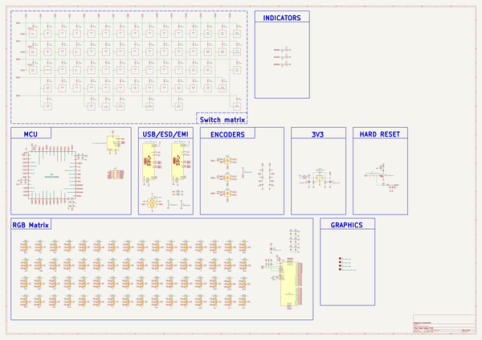
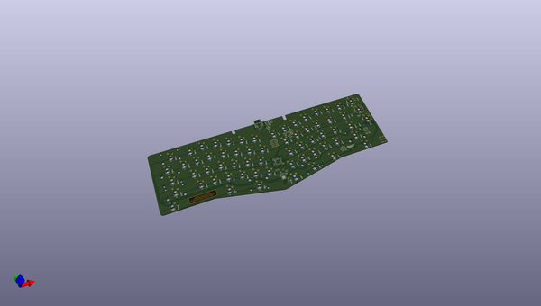
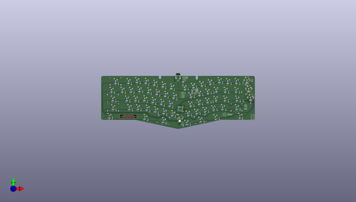
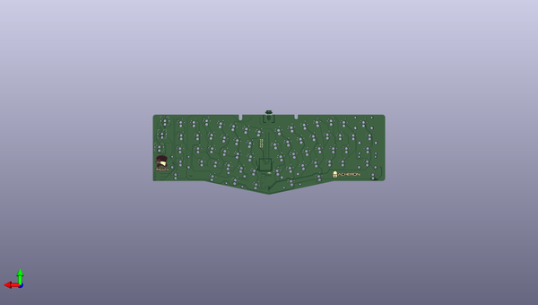

# madhatter
 
## summary 
* id: acheronproject_madhatter_mad_hatter
* user: acheronproject
* name: madhatter
* board: mad_hatter
* repo: https://github.com/AcheronProject/MadHatter
* src_file_repo_kicad_pcb: kicadFiles/mad-hatter.kicad_pcb
* src_file_repo_kicad_pcb_link: https://github.com/AcheronProject/MadHatter/tree/master/kicadFiles/mad-hatter.kicad_pcb
* src_file_repo_kicad_sch: kicadFiles/mad-hatter.kicad_sch
* src_file_repo_kicad_sch_link: https://github.com/AcheronProject/MadHatter/tree/master/kicadFiles/mad-hatter.kicad_sch

* src_file_repo_sch: 
* src_file_repo_sch_link: https://github.com/AcheronProject/MadHatter/tree/master/

## schematic  
  
[schematic (pdf)](working_schematic.pdf)  

## pcb  
 
  
  
  
[board (pdf)](working.pdf)  

## working_bom
| Id | Designator | Footprint | Quantity | Designation | Supplier and ref |  | None | 
| --- | --- | --- | --- | --- | --- | --- | --- | 
| 1 | SW2 | MX100 | 1 | GRV |  |  | [''] | 
| 2 | SW7 | MX100 | 1 | 5 |  |  | [''] | 
| 3 | SW8 | MX100 | 1 | 6 |  |  | [''] | 
| 4 | SW3 | MX100 | 1 | 1 |  |  | [''] | 
| 5 | SW4 | MX100 | 1 | 2 |  |  | [''] | 
| 6 | SW5 | MX100 | 1 | 3 |  |  | [''] | 
| 7 | SW1 | MX100 | 1 | ESC |  |  | [''] | 
| 8 | SW6 | MX100 | 1 | 4 |  |  | [''] | 
| 9 | SW9 | MX100 | 1 | 7 |  |  | [''] | 
| 10 | SW10 | MX100 | 1 | 8 |  |  | [''] | 
| 11 | SW11 | MX100 | 1 | 9 |  |  | [''] | 
| 12 | SW12 | MX100 | 1 | 0 |  |  | [''] | 
| 13 | SW13 | MX100 | 1 | MINUS |  |  | [''] | 
| 14 | SW14 | MX100 | 1 | EQUAL |  |  | [''] | 
| 15 | SW15 | MX200 | 1 | 2U BKSP |  |  | [''] | 
| 16 | SW16 | MX100 | 1 | PGUP |  |  | [''] | 
| 17 | SW17 | MX150 | 1 | TAB |  |  | [''] | 
| 18 | SW18 | MX100 | 1 | Q |  |  | [''] | 
| 19 | SW19 | MX100 | 1 | W |  |  | [''] | 
| 20 | SW20 | MX100 | 1 | E |  |  | [''] | 
| 21 | SW21 | MX100 | 1 | R |  |  | [''] | 
| 22 | SW22 | MX100 | 1 | T |  |  | [''] | 
| 23 | SW23 | MX100 | 1 | Y |  |  | [''] | 
| 24 | SW24 | MX100 | 1 | U |  |  | [''] | 
| 25 | SW25 | MX100 | 1 | I |  |  | [''] | 
| 26 | SW26 | MX100 | 1 | O |  |  | [''] | 
| 27 | SW27 | MX100 | 1 | P |  |  | [''] | 
| 28 | SW28 | MX100 | 1 | LBRACE |  |  | [''] | 
| 29 | SW29 | MX100 | 1 | RBRACE |  |  | [''] | 
| 30 | SW31 | MX100 | 1 | PGDN |  |  | [''] | 
| 31 | SW32 | MX175 | 1 | FULL CAPS |  |  | [''] | 
| 32 | SW33 | MX100 | 1 | A |  |  | [''] | 
| 33 | SW34 | MX100 | 1 | S |  |  | [''] | 
| 34 | SW35 | MX100 | 1 | D |  |  | [''] | 
| 35 | SW36 | MX100 | 1 | F |  |  | [''] | 
| 36 | SW37 | MX100 | 1 | G |  |  | [''] | 
| 37 | SW38 | MX100 | 1 | H |  |  | [''] | 
| 38 | SW40 | MX100 | 1 | K |  |  | [''] | 
| 39 | SW41 | MX100 | 1 | L |  |  | [''] | 
| 40 | SW42 | MX100 | 1 | COLON |  |  | [''] | 
| 41 | SW43 | MX100 | 1 | QUOTE |  |  | [''] | 
| 42 | SW44 | MX225R | 1 | ENTER |  |  | [''] | 
| 43 | SW45 | MX225 | 1 | LSHIFT |  |  | [''] | 
| 44 | SW46 | MX100 | 1 | Z |  |  | [''] | 
| 45 | SW47 | MX100 | 1 | X |  |  | [''] | 
| 46 | SW48 | MX100 | 1 | C |  |  | [''] | 
| 47 | SW49 | MX100 | 1 | V |  |  | [''] | 
| 48 | SW50 | MX100 | 1 | B |  |  | [''] | 
| 49 | SW51 | MX100 | 1 | EXTRA |  |  | [''] | 
| 50 | SW52 | MX100 | 1 | N |  |  | [''] | 
| 51 | SW53 | MX100 | 1 | M |  |  | [''] | 
| 52 | SW54 | MX100 | 1 | COMMA |  |  | [''] | 
| 53 | SW55 | MX100 | 1 | DOT |  |  | [''] | 
| 54 | SW56 | MX100 | 1 | SLASH |  |  | [''] | 
| 55 | SW57 | MX275 | 1 | 2.75U RSHIFT |  |  | [''] | 
| 56 | SW58 | MX150 | 1 | LCTRL |  |  | [''] | 
| 57 | SW59 | MX150 | 1 | LALT |  |  | [''] | 
| 58 | SW62 | MX275R | 1 | RIGHT SPACE |  |  | [''] | 
| 59 | SW63 | MX150 | 1 | RIGHT ALT |  |  | [''] | 
| 60 | SW64 | MX150 | 1 | RIGHT CTRL |  |  | [''] | 
| 61 | LED1,LED2,LED3 | LED_THT_2.54mm | 3 | LED |  |  | [''] | 
| 62 | SW61 | MX125 | 1 | LEFT SPACE |  |  | [''] | 
| 63 | SW60 | MX200R | 1 | LEFT SPACE |  |  | [''] | 
| 64 | SW30 | MX150 | 1 | BACK SLASH |  |  | [''] | 
| 65 | SW39 | MX100 | 1 | J |  |  | [''] | 
| 66 | L1,L2,L3 | L_1206_3216Metric_Pad1.42x1.75mm_HandSolder | 3 | 120R@100MHz |  |  | [''] | 
| 67 | C9,C3,C16,C4,C13,C5,C11 | C_0402_1005Metric | 7 | 100n |  |  | [''] | 
| 68 | D105,D124,D95,D94,D76,D77,D70,D80,D117,D100,D87,D83,D74,D114,D101,D107,D66,D104,D69,D73,D88,D78,D110,D81,D97,D128,D116,D121,D67,D106,D89,D120,D98,D102,D84,D103,D111,D90,D119,D93,D86,D79,D85,D96,D113,D71,D115,D109,D72,D91,D92,D127,D122,D108,D125,D99,D118,D68,D126,D82,D75,D112,D123 | LED_RGB_SMD_6028_2.8x3.5mm_Round | 63 | CP-6028SMDRGBC-CA |  |  | [''] | 
| 69 | D24,D61,D54,D34,D40,D2,D30,D48,D47,D26,D58,D64,D39,D15,D7,D32,D20,D49,D62,D42,D22,D27,D35,D60,D4,D9,D55,D16,D1,D50,D14,D3,D19,D43,D33,D17,D53,D10,D21,D8,D41,D13,D29,D6,D56,D46,D38,D44,D63,D23,D28,D12,D11,D5,D45,D57,D59,D31,D25,D18,D37,D52,D36,D51 | D_SOD-123 | 64 | 1N4148W |  |  | [''] | 
| 70 | C14,C12,C17,C18 | C_0402_1005Metric | 4 | 470n |  |  | [''] | 
| 71 | C2,C1 | CP_EIA-3216-10_Kemet-I_Pad1.58x1.35mm_HandSolder | 2 | 1u |  |  | [''] | 
| 72 | R7,R8 | R_0805_2012Metric | 2 | 100k |  |  | [''] | 
| 73 | F1 | Fuse_1812_4532Metric | 1 | mSMD110-16V |  |  | [''] | 
| 74 | R2,R3,R1 | R_0805_2012Metric | 3 | 420R |  |  | [''] | 
| 75 | U2 | QFN-48-1EP_6x6mm_P0.4mm_EP4.2x4.2mm | 1 | IS31FL3733-QF |  |  | [''] | 
| 76 | C19,C20,C21 | C_0805_2012Metric | 3 | 100n |  |  | [''] | 
| 77 | D130,D132,D133,D131 | D_SOD-123 | 4 | 1N4148W |  |  | [''] | 
| 78 | R12,R6,R13,R11,R10 | R_0805_2012Metric | 5 | 10k |  |  | [''] | 
| 79 | SW65,SW67,SW66 | ALPS_EC11E | 3 | EC11Ex |  |  | [''] | 
| 80 | C15 | CP_EIA-3216-10_Kemet-I_Pad1.58x1.35mm_HandSolder | 1 | 22u |  |  | [''] | 
| 81 | R5,R4 | R_0805_2012Metric | 2 | 1k |  |  | [''] | 
| 82 | C7 | C_0402_1005Metric | 1 | 1u |  |  | [''] | 
| 83 | J3 | PinHeader_2x06_P1.00mm_Vertical | 1 | EXTRA  |  |  | [''] | 
| 84 | R18,R17 | R_0805_2012Metric | 2 | 5.1k |  |  | [''] | 
| 85 | C22 | C_0805_2012Metric | 1 | 10u |  |  | [''] | 
| 86 | Q1 | SOT-23 | 1 | DTC123JKAT146 |  |  | [''] | 
| 87 | U4 | SOT-23 | 1 | MCP1700T-3302E/TT |  |  | [''] | 
| 88 | D129 | D_SOD-123 | 1 | RB060M-60TR |  |  | [''] | 
| 89 | C8 | C_0402_1005Metric | 1 | 10n |  |  | [''] | 
| 90 | J2 | Conn_ARM_JTAG_SWD_10 | 1 | Conn_ARM_JTAG_SWD_10 |  |  | [''] | 
| 91 | R14 | R_0805_2012Metric | 1 | 100R |  |  | [''] | 
| 92 | J1,J4 | TYPE-C-31-M-12 | 2 | TYPE-C-31-M12_13 |  |  | [''] | 
| 93 | D65 | LED_RGB_SMD_6028_2.8x3.5mm_Round | 1 | CP-6028SMDRGBC-CA |  |  | [''] | 
| 94 | S1 | K2-1187SQ-A4SW-06 | 1 | K2-1187SQ-A4SW-06 |  |  | [''] | 
| 95 | U1 | SOT-23-6 | 1 | USBLC6-2SC6 |  |  | [''] | 
| 96 | U3 | LQFP-48_7x7mm_P0.5mm | 1 | STM32F072CBT6 |  |  | [''] | 
| 97 | G2 | osh-logo | 1 | Mad Hatter Logo |  |  | [''] | 
| 98 | R9 | R_0805_2012Metric | 1 | 20k |  |  | [''] | 
| 99 | C6,C10 | C_0402_1005Metric | 2 | 4.7u |  |  | [''] | 
| 100 | R15 | R_0805_2012Metric | 1 | 330K |  |  | [''] | 
| 101 | G3 | mad_hatter_label | 1 | Mad Hatter label |  |  | [''] | 
| 102 | R16 | R_0805_2012Metric | 1 | 1M |  |  | [''] | 
| 103 | G1 | mad_hatter_logo-20x22 | 1 | Mad Hatter Logo |  |  | [''] | 
| 104 | G4 | acheronLong_40x12mm_Plated | 1 | Acheron Back Plated Logo |  |  | [''] | 

## bom_schematic
| Ref | Qnty | Value | Cmp name | Footprint | Description | Vendor | DNP | 
| --- | --- | --- | --- | --- | --- | --- | --- | 
| C1, C2 | 2 | 1u | CP1 | acheron_Components:CP_EIA-3216-10_Kemet-I_Pad1.58x1.35mm_HandSolder | Polarized capacitor, US symbol |  |  | 
| C3, C4, C5, C9, C11, C13, C16 | 7 | 100n | C_Small | Capacitor_SMD:C_0402_1005Metric | Unpolarized capacitor, small symbol |  |  | 
| C6, C10 | 2 | 4.7u | C_Small | Capacitor_SMD:C_0402_1005Metric | Unpolarized capacitor, small symbol |  |  | 
| C7 | 1 | 1u | C_Small | Capacitor_SMD:C_0402_1005Metric | Unpolarized capacitor, small symbol |  |  | 
| C8 | 1 | 10n | C_Small | Capacitor_SMD:C_0402_1005Metric | Unpolarized capacitor, small symbol |  |  | 
| C12, C14, C17, C18 | 4 | 470n | C_Small | Capacitor_SMD:C_0402_1005Metric | Unpolarized capacitor, small symbol |  |  | 
| C15 | 1 | 22u | CP1 | acheron_Components:CP_EIA-3216-10_Kemet-I_Pad1.58x1.35mm_HandSolder | Polarized capacitor, US symbol |  |  | 
| C19, C20, C21 | 3 | 100n | C_Small | Capacitor_SMD:C_0805_2012Metric | Unpolarized capacitor, small symbol |  |  | 
| C22 | 1 | 10u | C_Small | Capacitor_SMD:C_0805_2012Metric | Unpolarized capacitor, small symbol |  |  | 
| D1, D2, D3, D4, D5, D6, D7, D8, D9, D10, D11, D12, D13, D14, D15, D16, D17, D18, D19, D20, D21, D22, D23, D24, D25, D26, D27, D28, D29, D30, D31, D32, D33, D34, D35, D36, D37, D38, D39, D40, D41, D42, D43, D44, D45, D46, D47, D48, D49, D50, D51, D52, D53, D54, D55, D56, D57, D58, D59, D60, D61, D62, D63, D64 | 64 | 1N4148W | D | Acheron Components:D_SOD-123 | Diode |  |  | 
| D65 | 1 | CP-6028SMDRGBC-CA | LED_ARGB | Acheron Components:LED_RGB_SMD_6028_2.8x3.5mm_Round | RGB LED, anode/red/green/blue |  |  | 
| D66, D67, D68, D69, D70, D71, D72, D73, D74, D75, D76, D77, D78, D79, D80, D81, D82, D83, D84, D85, D86, D87, D88, D89, D90, D91, D92, D93, D94, D95, D96, D97, D98, D99, D100, D101, D102, D103, D104, D105, D106, D107, D108, D109, D110, D111, D112, D113, D114, D115, D116, D117, D118, D119, D120, D121, D122, D123, D124, D125, D126, D127, D128 | 63 | CP-6028SMDRGBC-CA | LED_ARGB | acheron_Components:LED_RGB_SMD_6028_2.8x3.5mm_Round | RGB LED, anode/red/green/blue |  |  | 
| D129 | 1 | RB060M-60TR | D_Schottky | acheron_Components:D_SOD-123 | Schottky diode |  |  | 
| D130, D131, D132, D133 | 4 | 1N4148W | D | acheron_Components:D_SOD-123 | Diode |  |  | 
| F1 | 1 | mSMD110-16V | Polyfuse | Fuse:Fuse_1812_4532Metric | Resettable fuse, polymeric positive temperature coefficient |  |  | 
| G1 | 1 | Mad Hatter Logo | MountingHole | Mad Hatter Graphics:mad_hatter_logo-20x22 | Mounting Hole without connection |  |  | 
| J1, J4 | 2 | TYPE-C-31-M12_13 | TYPE-C-31-M12_13 | acheron_Connectors:TYPE-C-31-M-12 |  |  |  | 
| J3 | 1 | EXTRA  | Conn_02x06_Counter_Clockwise | Connector_PinHeader_1.00mm:PinHeader_2x06_P1.00mm_Vertical | Generic connector, double row, 02x06, counter clockwise pin numbering scheme (similar to DIP packge numbering), script generated (kicad-library-utils/schlib/autogen/connector/) |  |  | 
| L1, L2, L3 | 3 | 120R@100MHz | L_Core_Ferrite | Inductor_SMD:L_1206_3216Metric_Pad1.42x1.75mm_HandSolder | Inductor with ferrite core |  |  | 
| LED1, LED2, LED3 | 3 | LED | LED | Acheron Components:LED_THT_2.54mm |  |  |  | 
| Q1 | 1 | DTC123JKAT146 | DTC123J | Package_TO_SOT_SMD:SOT-23 |  |  |  | 
| R1, R2, R3 | 3 | 420R | R_Small | Resistor_SMD:R_0805_2012Metric | Resistor, small symbol |  |  | 
| R4, R5 | 2 | 1k | R_Small | Resistor_SMD:R_0805_2012Metric | Resistor, small symbol |  |  | 
| R6, R10, R11, R12, R13 | 5 | 10k | R | Resistor_SMD:R_0805_2012Metric | Resistor |  |  | 
| R7, R8 | 2 | 100k | R | Resistor_SMD:R_0805_2012Metric | Resistor |  |  | 
| R9 | 1 | 20k | R_Small | Resistor_SMD:R_0805_2012Metric | Resistor, small symbol |  |  | 
| R14 | 1 | 100R | R_Small | Resistor_SMD:R_0805_2012Metric | Resistor, small symbol |  |  | 
| R15 | 1 | 330K | R_Small | Resistor_SMD:R_0805_2012Metric | Resistor, small symbol |  |  | 
| R16 | 1 | 1M | R_Small | Resistor_SMD:R_0805_2012Metric | Resistor, small symbol |  |  | 
| R17, R18 | 2 | 5.1k | R | Resistor_SMD:R_0805_2012Metric | Resistor |  |  | 
| S1 | 1 | K2-1187SQ-A4SW-06 | SW_SPST | acheron_Hardware:K2-1187SQ-A4SW-06 | Single Pole Single Throw (SPST) switch |  |  | 
| SW65, SW66, SW67 | 3 | EC11Ex | Rotary_Encoder_Switch_Chassis | Acheron Hardware:ALPS_EC11E | Rotary encoder, dual channel, incremental quadrate outputs, with switch |  |  | 
| U1 | 1 | USBLC6-2SC6 | USBLC6-2SC6 | acheron_Components:SOT-23-6 | Very low capacitance ESD protection diode, 2 data-line, SOT-23-6 |  |  | 
| U2 | 1 | IS31FL3733-QF | IS31FL3733-QF | acheron_Components:QFN-48-1EP_6x6mm_P0.4mm_EP4.2x4.2mm | 12x16 LED matrix driver with 8-bit PWM and breathing, QFN-48 |  |  | 
| U3 | 1 | STM32F072CBT6 | STM32F072-LQFP48 | acheron_Components:LQFP-48_7x7mm_P0.5mm |  |  |  | 
| U4 | 1 | MCP1700T-3302E/TT | MCP1700-3302E_SOT23 | Package_TO_SOT_SMD:SOT-23 | 250mA Low Quiscent Current LDO, 3.3V output, SOT-23 |  |  | 

## positions
### top
| # Ref | Val | Package | PosX | PosY | Rot | Side | 
| --- | --- | --- | --- | --- | --- | --- | 
| C1 | 1u | CP_EIA-3216-10_Kemet-I_Pad1.58x1.35mm_HandSolder | -132.9038 | 5.9856 | 90.0 | top | 
| C2 | 1u | CP_EIA-3216-10_Kemet-I_Pad1.58x1.35mm_HandSolder | -140.1708 | -3.3134 | 180.0 | top | 
| C3 | 100n | C_0402_1005Metric | -149.2939 | -57.5237 | 180.0 | top | 
| C4 | 100n | C_0402_1005Metric | -152.0879 | -60.3177 | 90.0 | top | 
| C5 | 100n | C_0402_1005Metric | -141.4199 | -59.1747 | -90.0 | top | 
| C6 | 4.7u | C_0402_1005Metric | -140.1499 | -59.1747 | -90.0 | top | 
| C7 | 1u | C_0402_1005Metric | -153.3579 | -64.5087 | 90.0 | top | 
| C8 | 10n | C_0402_1005Metric | -152.0879 | -64.5087 | 90.0 | top | 
| C9 | 100n | C_0402_1005Metric | -141.6739 | -68.199 | 180.0 | top | 
| C10 | 4.7u | C_0402_1005Metric | -141.6739 | -69.342 | 180.0 | top | 
| C11 | 100n | C_0402_1005Metric | -141.8079 | -82.1094 | 180.0 | top | 
| C12 | 470n | C_0402_1005Metric | -141.8079 | -80.8394 | 180.0 | top | 
| C13 | 100n | C_0402_1005Metric | -140.5149 | -93.5716 | 180.0 | top | 
| C14 | 470n | C_0402_1005Metric | -140.5149 | -92.3016 | 180.0 | top | 
| C15 | 22u | CP_EIA-3216-10_Kemet-I_Pad1.58x1.35mm_HandSolder | -140.0851 | -98.7464 | -90.0 | top | 
| C16 | 100n | C_0402_1005Metric | -143.8666 | -96.1683 | 90.0 | top | 
| C17 | 470n | C_0402_1005Metric | -142.5966 | -96.1683 | 90.0 | top | 
| C18 | 470n | C_0402_1005Metric | -144.3249 | -78.5856 | 0.0 | top | 
| C19 | 100n | C_0805_2012Metric | -1.524 | -63.4635 | -90.0 | top | 
| C20 | 100n | C_0805_2012Metric | -4.191 | -63.4635 | -90.0 | top | 
| C21 | 100n | C_0805_2012Metric | -120.6162 | -22.0023 | 102.0 | top | 
| C22 | 10u | C_0805_2012Metric | -107.8319 | -20.4535 | 102.0 | top | 
| D1 | 1N4148W | D_SOD-123 | -8.7325 | -5.08 | 90.0 | top | 
| D2 | 1N4148W | D_SOD-123 | -15.8762 | -7.22 | 90.0 | top | 
| D3 | 1N4148W | D_SOD-123 | -34.9262 | -7.22 | 90.0 | top | 
| D4 | 1N4148W | D_SOD-123 | -53.5662 | -5.08 | 90.0 | top | 
| D5 | 1N4148W | D_SOD-123 | -73.1662 | -7.4437 | 102.0 | top | 
| D6 | 1N4148W | D_SOD-123 | -91.7999 | -11.4044 | 102.0 | top | 
| D7 | 1N4148W | D_SOD-123 | -110.4336 | -15.3651 | 102.0 | top | 
| D8 | 1N4148W | D_SOD-123 | -129.0673 | -19.3259 | 102.0 | top | 
| D9 | 1N4148W | D_SOD-123 | -159.3374 | -20.3164 | 78.0 | top | 
| D10 | 1N4148W | D_SOD-123 | -177.9711 | -16.3557 | 78.0 | top | 
| D11 | 1N4148W | D_SOD-123 | -196.6048 | -12.395 | 78.0 | top | 
| D12 | 1N4148W | D_SOD-123 | -215.2385 | -8.4342 | 78.0 | top | 
| D13 | 1N4148W | D_SOD-123 | -234.5263 | -5.08 | 90.0 | top | 
| D14 | 1N4148W | D_SOD-123 | -253.5762 | -7.22 | 90.0 | top | 
| D15 | 1N4148W | D_SOD-123 | -282.1512 | -7.239 | 90.0 | top | 
| D16 | 1N4148W | D_SOD-123 | -11.8144 | -25.9652 | 90.0 | top | 
| D17 | 1N4148W | D_SOD-123 | -16.4762 | -25.9652 | 90.0 | top | 
| D18 | 1N4148W | D_SOD-123 | -40.2887 | -26.27 | 90.0 | top | 
| D19 | 1N4148W | D_SOD-123 | -72.6968 | -26.8167 | 102.0 | top | 
| D20 | 1N4148W | D_SOD-123 | -78.5199 | -28.0544 | 102.0 | top | 
| D21 | 1N4148W | D_SOD-123 | -97.1536 | -32.0151 | 102.0 | top | 
| D22 | 1N4148W | D_SOD-123 | -115.7873 | -35.9759 | 102.0 | top | 
| D23 | 1N4148W | D_SOD-123 | -153.9774 | -40.9264 | 78.0 | top | 
| D24 | 1N4148W | D_SOD-123 | -172.7664 | -36.9327 | 78.0 | top | 
| D25 | 1N4148W | D_SOD-123 | -191.2448 | -33.005 | 78.0 | top | 
| D26 | 1N4148W | D_SOD-123 | -209.8785 | -29.0443 | 78.0 | top | 
| D27 | 1N4148W | D_SOD-123 | -229.1663 | -25.21 | 90.0 | top | 
| D28 | 1N4148W | D_SOD-123 | -247.7962 | -26.27 | 90.0 | top | 
| D29 | 1N4148W | D_SOD-123 | -266.8462 | -26.27 | 90.0 | top | 
| D30 | 1N4148W | D_SOD-123 | -290.7669 | -26.27 | 90.0 | top | 
| D31 | 1N4148W | D_SOD-123 | -8.2425 | -44.8606 | 90.0 | top | 
| D32 | 1N4148W | D_SOD-123 | -14.7886 | -45.32 | 90.0 | top | 
| D33 | 1N4148W | D_SOD-123 | -40.9823 | -45.32 | 90.0 | top | 
| D34 | 1N4148W | D_SOD-123 | -74.5614 | -46.6942 | 102.0 | top | 
| D35 | 1N4148W | D_SOD-123 | -79.2199 | -47.6844 | 102.0 | top | 
| D36 | 1N4148W | D_SOD-123 | -97.8536 | -51.6451 | 102.0 | top | 
| D37 | 1N4148W | D_SOD-123 | -116.4873 | -55.6059 | 102.0 | top | 
| D38 | 1N4148W | D_SOD-123 | -162.5974 | -58.5764 | 78.0 | top | 
| D39 | 1N4148W | D_SOD-123 | -181.2311 | -54.6157 | 78.0 | top | 
| D40 | 1N4148W | D_SOD-123 | -199.9282 | -50.9531 | 78.0 | top | 
| D41 | 1N4148W | D_SOD-123 | -218.4985 | -46.6943 | 78.0 | top | 
| D42 | 1N4148W | D_SOD-123 | -237.7863 | -45.32 | 90.0 | top | 
| D43 | 1N4148W | D_SOD-123 | -256.8362 | -45.32 | 90.0 | top | 
| D44 | 1N4148W | D_SOD-123 | -287.7597 | -45.6248 | 90.0 | top | 
| D45 | 1N4148W | D_SOD-123 | -15.3862 | -64.37 | 90.0 | top | 
| D46 | 1N4148W | D_SOD-123 | -46.3425 | -64.37 | 90.0 | top | 
| D47 | 1N4148W | D_SOD-123 | -65.8728 | -64.6319 | 102.0 | top | 
| D48 | 1N4148W | D_SOD-123 | -84.5699 | -68.2944 | 102.0 | top | 
| D49 | 1N4148W | D_SOD-123 | -103.2036 | -72.2551 | 102.0 | top | 
| D50 | 1N4148W | D_SOD-123 | -121.8373 | -76.2159 | 102.0 | top | 
| D51 | 1N4148W | D_SOD-123 | -157.2374 | -79.1864 | 78.0 | top | 
| D52 | 1N4148W | D_SOD-123 | -175.8711 | -75.2257 | 78.0 | top | 
| D53 | 1N4148W | D_SOD-123 | -194.5048 | -71.265 | 78.0 | top | 
| D54 | 1N4148W | D_SOD-123 | -213.1385 | -67.3043 | 78.0 | top | 
| D55 | 1N4148W | D_SOD-123 | -232.4263 | -64.37 | 90.0 | top | 
| D56 | 1N4148W | D_SOD-123 | -251.4763 | -64.37 | 90.0 | top | 
| D57 | 1N4148W | D_SOD-123 | -287.195 | -64.37 | 90.0 | top | 
| D58 | 1N4148W | D_SOD-123 | -9.6571 | -83.42 | 90.0 | top | 
| D59 | 1N4148W | D_SOD-123 | -61.1262 | -84.3237 | 102.0 | top | 
| D60 | 1N4148W | D_SOD-123 | -94.309 | -89.8401 | 102.0 | top | 
| D61 | 1N4148W | D_SOD-123 | -124.6612 | -96.2916 | 102.0 | top | 
| D62 | 1N4148W | D_SOD-123 | -177.5385 | -94.3543 | 78.0 | top | 
| D63 | 1N4148W | D_SOD-123 | -217.9485 | -87.2942 | 78.0 | top | 
| D64 | 1N4148W | D_SOD-123 | -295.4218 | -83.468 | 90.0 | top | 
| D65 | CP-6028SMDRGBC-CA | LED_RGB_SMD_6028_2.8x3.5mm_Round | 4.16 | -24.13 | 180.0 | top | 
| D66 | CP-6028SMDRGBC-CA | LED_RGB_SMD_6028_2.8x3.5mm_Round | -0.0 | -5.08 | 180.0 | top | 
| D67 | CP-6028SMDRGBC-CA | LED_RGB_SMD_6028_2.8x3.5mm_Round | -23.02 | -7.22 | 180.0 | top | 
| D68 | CP-6028SMDRGBC-CA | LED_RGB_SMD_6028_2.8x3.5mm_Round | -42.07 | -7.22 | 180.0 | top | 
| D69 | CP-6028SMDRGBC-CA | LED_RGB_SMD_6028_2.8x3.5mm_Round | -60.71 | -5.08 | 180.0 | top | 
| D70 | CP-6028SMDRGBC-CA | LED_RGB_SMD_6028_2.8x3.5mm_Round | -80.1538 | -8.929 | -168.0 | top | 
| D71 | CP-6028SMDRGBC-CA | LED_RGB_SMD_6028_2.8x3.5mm_Round | -98.7875 | -12.8897 | -168.0 | top | 
| D72 | CP-6028SMDRGBC-CA | LED_RGB_SMD_6028_2.8x3.5mm_Round | -117.4212 | -16.8504 | -168.0 | top | 
| D73 | CP-6028SMDRGBC-CA | LED_RGB_SMD_6028_2.8x3.5mm_Round | -136.0549 | -20.8111 | -168.0 | top | 
| D74 | CP-6028SMDRGBC-CA | LED_RGB_SMD_6028_2.8x3.5mm_Round | -166.325 | -18.8311 | 168.0 | top | 
| D75 | CP-6028SMDRGBC-CA | LED_RGB_SMD_6028_2.8x3.5mm_Round | -184.9588 | -14.8704 | 168.0 | top | 
| D76 | CP-6028SMDRGBC-CA | LED_RGB_SMD_6028_2.8x3.5mm_Round | -203.5925 | -10.9097 | 168.0 | top | 
| D77 | CP-6028SMDRGBC-CA | LED_RGB_SMD_6028_2.8x3.5mm_Round | -222.2262 | -6.949 | 168.0 | top | 
| D78 | CP-6028SMDRGBC-CA | LED_RGB_SMD_6028_2.8x3.5mm_Round | -241.67 | -5.08 | 180.0 | top | 
| D79 | CP-6028SMDRGBC-CA | LED_RGB_SMD_6028_2.8x3.5mm_Round | -260.3 | -7.22 | 180.0 | top | 
| D80 | CP-6028SMDRGBC-CA | LED_RGB_SMD_6028_2.8x3.5mm_Round | -288.875 | -7.22 | 180.0 | top | 
| D81 | CP-6028SMDRGBC-CA | LED_RGB_SMD_6028_2.8x3.5mm_Round | -15.39 | -83.42 | 180.0 | top | 
| D82 | CP-6028SMDRGBC-CA | LED_RGB_SMD_6028_2.8x3.5mm_Round | 8.23 | -43.18 | 180.0 | top | 
| D83 | CP-6028SMDRGBC-CA | LED_RGB_SMD_6028_2.8x3.5mm_Round | -23.62 | -26.27 | 180.0 | top | 
| D84 | CP-6028SMDRGBC-CA | LED_RGB_SMD_6028_2.8x3.5mm_Round | -47.4325 | -26.27 | 180.0 | top | 
| D85 | CP-6028SMDRGBC-CA | LED_RGB_SMD_6028_2.8x3.5mm_Round | -66.8738 | -25.579 | -168.0 | top | 
| D86 | CP-6028SMDRGBC-CA | LED_RGB_SMD_6028_2.8x3.5mm_Round | -85.5075 | -29.5397 | -168.0 | top | 
| D87 | CP-6028SMDRGBC-CA | LED_RGB_SMD_6028_2.8x3.5mm_Round | -104.1412 | -33.5004 | -168.0 | top | 
| D88 | CP-6028SMDRGBC-CA | LED_RGB_SMD_6028_2.8x3.5mm_Round | -122.7749 | -37.4611 | -168.0 | top | 
| D89 | CP-6028SMDRGBC-CA | LED_RGB_SMD_6028_2.8x3.5mm_Round | -160.965 | -39.4411 | 168.0 | top | 
| D90 | CP-6028SMDRGBC-CA | LED_RGB_SMD_6028_2.8x3.5mm_Round | -179.5988 | -35.4804 | 168.0 | top | 
| D91 | CP-6028SMDRGBC-CA | LED_RGB_SMD_6028_2.8x3.5mm_Round | -198.2325 | -31.5197 | 168.0 | top | 
| D92 | CP-6028SMDRGBC-CA | LED_RGB_SMD_6028_2.8x3.5mm_Round | -216.8662 | -27.559 | 168.0 | top | 
| D93 | CP-6028SMDRGBC-CA | LED_RGB_SMD_6028_2.8x3.5mm_Round | -236.31 | -25.21 | 180.0 | top | 
| D94 | CP-6028SMDRGBC-CA | LED_RGB_SMD_6028_2.8x3.5mm_Round | -254.94 | -26.27 | 180.0 | top | 
| D95 | CP-6028SMDRGBC-CA | LED_RGB_SMD_6028_2.8x3.5mm_Round | -273.99 | -26.27 | 180.0 | top | 
| D96 | CP-6028SMDRGBC-CA | LED_RGB_SMD_6028_2.8x3.5mm_Round | -297.8025 | -26.27 | 180.0 | top | 
| D97 | CP-6028SMDRGBC-CA | LED_RGB_SMD_6028_2.8x3.5mm_Round | -131.6488 | -97.7769 | -168.0 | top | 
| D98 | CP-6028SMDRGBC-CA | LED_RGB_SMD_6028_2.8x3.5mm_Round | -101.369 | -91.3407 | -168.0 | top | 
| D99 | CP-6028SMDRGBC-CA | LED_RGB_SMD_6028_2.8x3.5mm_Round | -68.1138 | -85.809 | -168.0 | top | 
| D100 | CP-6028SMDRGBC-CA | LED_RGB_SMD_6028_2.8x3.5mm_Round | -21.9323 | -45.32 | 180.0 | top | 
| D101 | CP-6028SMDRGBC-CA | LED_RGB_SMD_6028_2.8x3.5mm_Round | -48.1261 | -45.32 | 180.0 | top | 
| D102 | CP-6028SMDRGBC-CA | LED_RGB_SMD_6028_2.8x3.5mm_Round | -67.5738 | -45.209 | -168.0 | top | 
| D103 | CP-6028SMDRGBC-CA | LED_RGB_SMD_6028_2.8x3.5mm_Round | -86.2075 | -49.1697 | -168.0 | top | 
| D104 | CP-6028SMDRGBC-CA | LED_RGB_SMD_6028_2.8x3.5mm_Round | -104.8412 | -53.1304 | -168.0 | top | 
| D105 | CP-6028SMDRGBC-CA | LED_RGB_SMD_6028_2.8x3.5mm_Round | -123.4749 | -57.0911 | -168.0 | top | 
| D106 | CP-6028SMDRGBC-CA | LED_RGB_SMD_6028_2.8x3.5mm_Round | -169.585 | -57.0911 | 168.0 | top | 
| D107 | CP-6028SMDRGBC-CA | LED_RGB_SMD_6028_2.8x3.5mm_Round | -188.2188 | -53.1304 | 168.0 | top | 
| D108 | CP-6028SMDRGBC-CA | LED_RGB_SMD_6028_2.8x3.5mm_Round | -206.8525 | -49.1697 | 168.0 | top | 
| D109 | CP-6028SMDRGBC-CA | LED_RGB_SMD_6028_2.8x3.5mm_Round | -225.4862 | -45.209 | 168.0 | top | 
| D110 | CP-6028SMDRGBC-CA | LED_RGB_SMD_6028_2.8x3.5mm_Round | -244.93 | -45.32 | 180.0 | top | 
| D111 | CP-6028SMDRGBC-CA | LED_RGB_SMD_6028_2.8x3.5mm_Round | -263.98 | -45.32 | 180.0 | top | 
| D112 | CP-6028SMDRGBC-CA | LED_RGB_SMD_6028_2.8x3.5mm_Round | -294.93 | -45.32 | 180.0 | top | 
| D113 | CP-6028SMDRGBC-CA | LED_RGB_SMD_6028_2.8x3.5mm_Round | -302.5656 | -83.468 | 180.0 | top | 
| D114 | CP-6028SMDRGBC-CA | LED_RGB_SMD_6028_2.8x3.5mm_Round | -224.9362 | -85.809 | 168.0 | top | 
| D115 | CP-6028SMDRGBC-CA | LED_RGB_SMD_6028_2.8x3.5mm_Round | -184.5262 | -92.869 | 168.0 | top | 
| D116 | CP-6028SMDRGBC-CA | LED_RGB_SMD_6028_2.8x3.5mm_Round | -22.53 | -64.37 | 180.0 | top | 
| D117 | CP-6028SMDRGBC-CA | LED_RGB_SMD_6028_2.8x3.5mm_Round | -53.4862 | -64.37 | 180.0 | top | 
| D118 | CP-6028SMDRGBC-CA | LED_RGB_SMD_6028_2.8x3.5mm_Round | -72.9238 | -65.819 | -168.0 | top | 
| D119 | CP-6028SMDRGBC-CA | LED_RGB_SMD_6028_2.8x3.5mm_Round | -91.5575 | -69.7797 | -168.0 | top | 
| D120 | CP-6028SMDRGBC-CA | LED_RGB_SMD_6028_2.8x3.5mm_Round | -110.1912 | -73.7404 | -168.0 | top | 
| D121 | CP-6028SMDRGBC-CA | LED_RGB_SMD_6028_2.8x3.5mm_Round | -128.8249 | -77.7011 | -168.0 | top | 
| D122 | CP-6028SMDRGBC-CA | LED_RGB_SMD_6028_2.8x3.5mm_Round | -164.225 | -77.7012 | 168.0 | top | 
| D123 | CP-6028SMDRGBC-CA | LED_RGB_SMD_6028_2.8x3.5mm_Round | -182.8588 | -73.7404 | 168.0 | top | 
| D124 | CP-6028SMDRGBC-CA | LED_RGB_SMD_6028_2.8x3.5mm_Round | -201.4925 | -69.7797 | 168.0 | top | 
| D125 | CP-6028SMDRGBC-CA | LED_RGB_SMD_6028_2.8x3.5mm_Round | -220.1262 | -65.819 | 168.0 | top | 
| D126 | CP-6028SMDRGBC-CA | LED_RGB_SMD_6028_2.8x3.5mm_Round | -239.57 | -64.37 | 180.0 | top | 
| D127 | CP-6028SMDRGBC-CA | LED_RGB_SMD_6028_2.8x3.5mm_Round | -258.62 | -64.37 | 180.0 | top | 
| D128 | CP-6028SMDRGBC-CA | LED_RGB_SMD_6028_2.8x3.5mm_Round | -294.3388 | -64.37 | 180.0 | top | 
| D129 | RB060M-60TR | D_SOD-123 | -136.2338 | 0.6516 | -90.0 | top | 
| D130 | 1N4148W | D_SOD-123 | -2.54 | -10.033 | 0.0 | top | 
| D131 | 1N4148W | D_SOD-123 | -1.143 | -30.226 | 0.0 | top | 
| D132 | 1N4148W | D_SOD-123 | 7.874 | -50.038 | 90.0 | top | 
| D133 | 1N4148W | D_SOD-123 | -111.1049 | -25.8233 | -78.0 | top | 
| F1 | mSMD110-16V | Fuse_1812_4532Metric | -138.2658 | 5.4776 | 0.0 | top | 
| G2 | Mad_Hatter_Logo | osh-logo | -42.9301 | -76.0134 | 0.0 | top | 
| G3 | Mad_Hatter_label | mad_hatter_label | -260.604 | -78.9432 | 0.0 | top | 
| J1 | TYPE-C-31-M12_13 | TYPE-C-31-M-12 | -151.1488 | 8.343 | 180.0 | top | 
| J2 | Conn_ARM_JTAG_SWD | Conn_ARM_JTAG_SWD_10 | -140.5309 | -32.7587 | 0.0 | top | 
| J3 | EXTRA_ | PinHeader_2x06_P1.00mm_Vertical | -154.257 | -76.2 | 90.0 | top | 
| L1 | 120R@100MHz | L_1206_3216Metric_Pad1.42x1.75mm_HandSolder | -156.6138 | 5.545 | 90.0 | top | 
| L2 | 120R@100MHz | L_1206_3216Metric_Pad1.42x1.75mm_HandSolder | 11.1711 | -1.3836 | 90.0 | top | 
| L3 | 120R@100MHz | L_1206_3216Metric_Pad1.42x1.75mm_HandSolder | -145.8188 | 5.418 | 90.0 | top | 
| LED1 | LED | LED_THT_2.54mm | 15.51 | -76.62 | 180.0 | top | 
| LED2 | LED | LED_THT_2.54mm | 15.51 | -81.1285 | 180.0 | top | 
| LED3 | LED | LED_THT_2.54mm | 15.51 | -85.62 | 180.0 | top | 
| Q1 | DTC123JKAT146 | SOT-23 | -114.378 | -31.1932 | -78.0 | top | 
| R1 | 420R | R_0805_2012Metric | 10.176 | -76.62 | 180.0 | top | 
| R2 | 420R | R_0805_2012Metric | 10.176 | -81.1285 | 180.0 | top | 
| R3 | 420R | R_0805_2012Metric | 10.176 | -85.62 | 180.0 | top | 
| R4 | 1k | R_0805_2012Metric | -147.4491 | -83.9055 | 0.0 | top | 
| R5 | 1k | R_0805_2012Metric | -148.7859 | -81.6195 | 0.0 | top | 
| R6 | 10k | R_0805_2012Metric | -151.1321 | -83.9055 | 0.0 | top | 
| R7 | 100k | R_0805_2012Metric | -130.3638 | 5.418 | 90.0 | top | 
| R8 | 100k | R_0805_2012Metric | -140.1708 | -5.8534 | 180.0 | top | 
| R9 | 20k | R_0805_2012Metric | -141.7361 | -85.4114 | 45.0 | top | 
| R10 | 10k | R_0805_2012Metric | -1.524 | -54.864 | -90.0 | top | 
| R11 | 10k | R_0805_2012Metric | -4.191 | -54.918 | -90.0 | top | 
| R12 | 10k | R_0805_2012Metric | -1.524 | -58.7645 | -90.0 | top | 
| R13 | 10k | R_0805_2012Metric | -4.191 | -58.7645 | -90.0 | top | 
| R14 | 100R | R_0805_2012Metric | -119.8505 | -25.6048 | 102.0 | top | 
| R15 | 330K | R_0805_2012Metric | -112.0555 | -21.3512 | 102.0 | top | 
| R16 | 1M | R_0805_2012Metric | -109.9437 | -20.9023 | 102.0 | top | 
| R17 | 5.1k | R_0805_2012Metric | -154.2008 | 4.529 | 90.0 | top | 
| R18 | 5.1k | R_0805_2012Metric | -148.4858 | 4.021 | 90.0 | top | 
| S1 | K2-1187SQ-A4SW-06 | K2-1187SQ-A4SW-06 | -115.7247 | -24.8577 | 102.0 | top | 
| SW1 | ESC | MX100 | 0.0 | 0.0 | 0.0 | top | 
| SW2 | GRV | MX100 | -23.02 | -2.14 | 0.0 | top | 
| SW3 | 1 | MX100 | -42.07 | -2.14 | 0.0 | top | 
| SW4 | 2 | MX100 | -60.71 | 0.0 | 0.0 | top | 
| SW5 | 3 | MX100 | -81.21 | -3.96 | 12.0 | top | 
| SW6 | 4 | MX100 | -99.8437 | -7.9207 | 12.0 | top | 
| SW7 | 5 | MX100 | -118.4774 | -11.8814 | 12.0 | top | 
| SW8 | 6 | MX100 | -137.1111 | -15.8421 | 12.0 | top | 
| SW9 | 7 | MX100 | -165.2689 | -13.8621 | -12.0 | top | 
| SW10 | 8 | MX100 | -183.9026 | -9.9014 | -12.0 | top | 
| SW11 | 9 | MX100 | -202.5363 | -5.9407 | -12.0 | top | 
| SW12 | 0 | MX100 | -221.17 | -1.98 | -12.0 | top | 
| SW13 | MINUS | MX100 | -241.67 | 0.0 | 0.0 | top | 
| SW14 | EQUAL | MX100 | -260.3 | -2.14 | 0.0 | top | 
| SW15 | 2U_BKSP | MX200 | -288.875 | -2.14 | 0.0 | top | 
| SW16 | PGUP | MX100 | 4.16 | -19.05 | 0.0 | top | 
| SW17 | TAB | MX150 | -23.62 | -21.19 | 0.0 | top | 
| SW18 | Q | MX100 | -47.43 | -21.19 | 0.0 | top | 
| SW19 | W | MX100 | -67.93 | -20.61 | 12.0 | top | 
| SW20 | E | MX100 | -86.5637 | -24.5707 | 12.0 | top | 
| SW21 | R | MX100 | -105.1974 | -28.5314 | 12.0 | top | 
| SW22 | T | MX100 | -123.8311 | -32.4921 | 12.0 | top | 
| SW23 | Y | MX100 | -159.9089 | -34.4722 | -12.0 | top | 
| SW24 | U | MX100 | -178.5426 | -30.5114 | -12.0 | top | 
| SW25 | I | MX100 | -197.1763 | -26.5507 | -12.0 | top | 
| SW26 | O | MX100 | -215.81 | -22.59 | -12.0 | top | 
| SW27 | P | MX100 | -236.31 | -20.13 | 0.0 | top | 
| SW28 | LBRACE | MX100 | -254.94 | -21.19 | 0.0 | top | 
| SW29 | RBRACE | MX100 | -273.99 | -21.19 | 0.0 | top | 
| SW30 | BACK_SLASH | MX150 | -297.81 | -21.19 | 0.0 | top | 
| SW31 | PGDN | MX100 | 8.23 | -38.1 | 0.0 | top | 
| SW32 | FULL_CAPS | MX175 | -21.9323 | -40.24 | 0.0 | top | 
| SW33 | A | MX100 | -48.13 | -40.24 | 0.0 | top | 
| SW34 | S | MX100 | -68.63 | -40.24 | 12.0 | top | 
| SW35 | D | MX100 | -87.2637 | -44.2007 | 12.0 | top | 
| SW36 | F | MX100 | -105.8974 | -48.1614 | 12.0 | top | 
| SW37 | G | MX100 | -124.5311 | -52.1221 | 12.0 | top | 
| SW38 | H | MX100 | -168.5289 | -52.1221 | -12.0 | top | 
| SW39 | J | MX100 | -187.1626 | -48.1614 | -12.0 | top | 
| SW40 | K | MX100 | -205.7963 | -44.2007 | -12.0 | top | 
| SW41 | L | MX100 | -224.43 | -40.24 | -12.0 | top | 
| SW42 | COLON | MX100 | -244.93 | -40.24 | 0.0 | top | 
| SW43 | QUOTE | MX100 | -263.98 | -40.24 | 0.0 | top | 
| SW44 | ENTER | MX225R | -294.93 | -40.24 | 0.0 | top | 
| SW45 | LSHIFT | MX225 | -22.53 | -59.29 | 0.0 | top | 
| SW46 | Z | MX100 | -53.48 | -59.29 | 0.0 | top | 
| SW47 | X | MX100 | -73.98 | -60.85 | 12.0 | top | 
| SW48 | C | MX100 | -92.6137 | -64.8107 | 12.0 | top | 
| SW49 | V | MX100 | -111.2474 | -68.7714 | 12.0 | top | 
| SW50 | B | MX100 | -129.8811 | -72.7322 | 12.0 | top | 
| SW51 | EXTRA | MX100 | -163.1689 | -72.7322 | -12.0 | top | 
| SW52 | N | MX100 | -181.8026 | -68.7714 | -12.0 | top | 
| SW53 | M | MX100 | -200.4363 | -64.8107 | -12.0 | top | 
| SW54 | COMMA | MX100 | -219.07 | -60.85 | -12.0 | top | 
| SW55 | DOT | MX100 | -239.57 | -59.29 | 0.0 | top | 
| SW56 | SLASH | MX100 | -258.62 | -59.29 | 0.0 | top | 
| SW57 | 2.75U_RSHIFT | MX275 | -294.34 | -59.29 | 0.0 | top | 
| SW58 | LCTRL | MX150 | -15.39 | -78.34 | 0.0 | top | 
| SW59 | LALT | MX150 | -69.17 | -80.84 | 12.0 | top | 
| SW60 | LEFT_SPACE | MX200R | -102.4085 | -86.3682 | 12.0 | top | 
| SW61 | LEFT_SPACE | MX125 | -132.705 | -92.8079 | 12.0 | top | 
| SW62 | RIGHT_SPACE | MX275R | -183.47 | -87.9 | -12.0 | top | 
| SW63 | RIGHT_ALT | MX150 | -223.88 | -80.84 | -12.0 | top | 
| SW64 | RIGHT_CTRL | MX150 | -302.5656 | -78.388 | 0.0 | top | 
| SW65 | EC11Ex | ALPS_EC11E | 0.0 | 0.0 | 0.0 | top | 
| SW66 | EC11Ex | ALPS_EC11E | 4.16 | -19.05 | 0.0 | top | 
| SW67 | EC11Ex | ALPS_EC11E | 8.23 | -38.1 | 0.0 | top | 
| U1 | USBLC6-2SC6 | SOT-23-6 | -151.1528 | -1.651 | -90.0 | top | 
| U2 | IS31FL3733-QF | QFN-48-1EP_6x6mm_P0.4mm_EP4.2x4.2mm | -147.5919 | -89.7326 | 0.0 | top | 
| U3 | STM32F072CBT6 | LQFP-48_7x7mm_P0.5mm | -145.9919 | -63.6197 | 0.0 | top | 
| U4 | MCP1700T-3302E/TT | SOT-23 | -139.5358 | 1.2866 | 0.0 | top | 

### bottom
| # Ref | Val | Package | PosX | PosY | Rot | Side | 
| --- | --- | --- | --- | --- | --- | --- | 
| G1 | Mad_Hatter_Logo | mad_hatter_logo-20x22 | 3.4468 | -61.5326 | 180.0 | bottom | 
| G4 | Acheron_Back_Plated_Logo | acheronLong_40x12mm_Plated | -263.9109 | -77.7106 | 180.0 | bottom | 
| J4 | TYPE-C-31-M12_13 | TYPE-C-31-M-12 | -151.1488 | 8.343 | 0.0 | bottom | 

