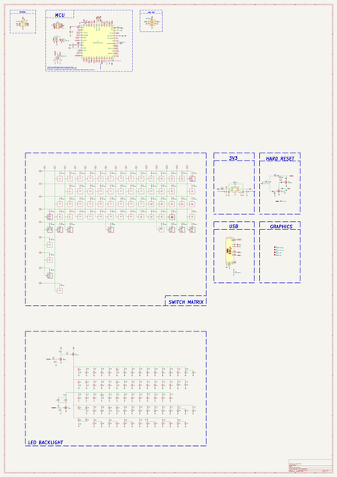

# raphael
 
## summary 
* id: acheronproject_raphael_raphael
* user: acheronproject
* name: raphael
* board: raphael
* repo: https://github.com/AcheronProject/Raphael
* src_file_repo_kicad_pcb: kicad_files/raphael.kicad_pcb
* src_file_repo_kicad_pcb_link: https://github.com/AcheronProject/Raphael/tree/main/kicad_files/raphael.kicad_pcb
* src_file_repo_kicad_sch: kicad_files/raphael.kicad_sch
* src_file_repo_kicad_sch_link: https://github.com/AcheronProject/Raphael/tree/main/kicad_files/raphael.kicad_sch

* src_file_repo_sch: 
* src_file_repo_sch_link: https://github.com/AcheronProject/Raphael/tree/main/

## schematic  
  
[schematic (pdf)](working_schematic.pdf)  

## working_bom
| Id | Designator | Footprint | Quantity | Designation | Supplier and ref |  | None | 
| --- | --- | --- | --- | --- | --- | --- | --- | 
| 1 | D11,D48,D53,D8,D1,D6,D27,D17,D42,D26,D22,D38,D43,D20,D56,D40,D50,D36,D29,D65,D35,D18,D16,D51,D55,D24,D45,D32,D47,D54,D28,D61,D14,D4,D46,D37,D62,D12,D9,D59,D19,D49,D10,D31,D13,D23,D25,D41,D58,D64,D7,D60,D33,D57,D3,D30,D66,D63,D15,D21,D5,D68,D52,D44,D34,D39,D67 | D_SOD-123 | 67 | 1N4148W |  |  | [''] | 
| 2 | Q2,Q3 | SOT-23 | 2 | 2N7002 |  |  | [''] | 
| 3 | C9,C6,C8,C7,C2,C15 | C_0402_1005Metric | 6 | 100n |  |  | [''] | 
| 4 | R63,R49,R37,R78,R83,R67,R52,R72,R33,R44,R40,R73,R81,R20,R26,R60,R31,R61,R25,R80,R85,R77,R53,R70,R66,R36,R46,R82,R55,R86,R71,R23,R35,R42,R21,R58,R47,R39,R27,R64,R74,R59,R54,R29,R30,R45,R28,R62,R24,R22,R56,R32,R51,R38,R48,R50,R41,R87,R34,R68,R57,R79,R65,R84,R69,R43 | R_0805_2012Metric | 66 | 1k |  |  | [''] | 
| 5 | J1 | SM04B-SRSS-TB(LF)(SN)_mounting-reliefs | 1 | A1001WR-S-04P |  |  | [''] | 
| 6 | C14,C13 | C_0402_1005Metric | 2 | 16p |  |  | [''] | 
| 7 | C12 | C_0402_1005Metric | 1 | 10n |  |  | [''] | 
| 8 | C10 | CP_EIA-3216-10_Kemet-I_Pad1.58x1.35mm_HandSolder | 1 | 10u |  |  | [''] | 
| 9 | R4,R5,R6 | R_0402_1005Metric | 3 | 100R |  |  | [''] | 
| 10 | R10,R9,R16,R3,R19 | R_0402_1005Metric | 5 | 10k |  |  | [''] | 
| 11 | U5 | STM_UFQFPN-48_LQFP-48-1EP_7x7mm_P0.5mm_HandSoldering_ThermalReliefs | 1 | STM32F411CEU6 |  |  | [''] | 
| 12 | C11,C16 | C_0402_1005Metric | 2 | 4.7u |  |  | [''] | 
| 13 | C3,C4 | C_0805_2012Metric | 2 | 1u |  |  | [''] | 
| 14 | R76 | R_0805_2012Metric | 1 | 10k |  |  | [''] | 
| 15 | FB1 | L_0805_2012Metric | 1 | GZ2012D601TF |  |  | [''] | 
| 16 | R12,R11 | R_0402_1005Metric | 2 | 4.7k |  |  | [''] | 
| 17 | J2 | TYPE-C-31-M-12 | 1 | TYPE-C-31-M-12 |  |  | [''] | 
| 18 | R15,R14 | R_0402_1005Metric | 2 | 5.1k |  |  | [''] | 
| 19 | R17,R18 | R_0402_1005Metric | 2 | 100 |  |  | [''] | 
| 20 | C5 | C_0805_2012Metric | 1 | 10n |  |  | [''] | 
| 21 | SW1 | K2-1187SQ-A4SW-06 | 1 | K2-1187SQ-A4SW-06 |  |  | [''] | 
| 22 | U2 | SOT-363_SC-70-6 | 1 | 2N7002DW |  |  | [''] | 
| 23 | D2 | D_SOD-123 | 1 | B5819W-SL |  |  | [''] | 
| 24 | R2 | R_0402_1005Metric | 1 | 1M |  |  | [''] | 
| 25 | C1 | C_0402_1005Metric | 1 | 10u |  |  | [''] | 
| 26 | U3 | SOT-23-5 | 1 | SGM2007-3.3XN5/TR |  |  | [''] | 
| 27 | R7,R8 | R_0805_2012Metric | 2 | 100k |  |  | [''] | 
| 28 | F1 | Fuse_1206_3216Metric | 1 | nSMD100-16V |  |  | [''] | 
| 29 | R13 | R_0402_1005Metric | 1 | 1.5k |  |  | [''] | 
| 30 | Q1 | SOT-23 | 1 | AO3401A |  |  | [''] | 
| 31 | U4 | TSSOP-8_4.4x3mm_P0.65mm | 1 | BL24C256A-SFRC |  |  | [''] | 
| 32 | Y1 | Crystal_SMD_3225-4Pin_3.2x2.5mm | 1 | 7325-0800A2010-00 |  |  | [''] | 
| 33 | R75 | R_0805_2012Metric | 1 | 100R |  |  | [''] | 
| 34 | U1 | SOT-23-6 | 1 | USBLC6-2SC6 |  |  | [''] | 
| 35 | R1 | R_0402_1005Metric | 1 | 330k |  |  | [''] | 

## bom_schematic
| Ref | Qnty | Value | Cmp name | Footprint | Description | Vendor | DNP | 
| --- | --- | --- | --- | --- | --- | --- | --- | 
| C1 | 1 | 10u | C_Small | Capacitor_SMD:C_0402_1005Metric | Unpolarized capacitor, small symbol |  |  | 
| C2, C6, C7, C8, C9, C15 | 6 | 100n | C_Small | Capacitor_SMD:C_0402_1005Metric | Unpolarized capacitor, small symbol |  |  | 
| C3, C4 | 2 | 1u | C | Capacitor_SMD:C_0805_2012Metric | Unpolarized capacitor |  |  | 
| C5 | 1 | 10n | C_Small | Capacitor_SMD:C_0805_2012Metric | Unpolarized capacitor, small symbol |  |  | 
| C10 | 1 | 10u | CP1 | acheron_Components:CP_EIA-3216-10_Kemet-I_Pad1.58x1.35mm_HandSolder | Polarized capacitor, US symbol |  |  | 
| C11, C16 | 2 | 4.7u | C_Small | Capacitor_SMD:C_0402_1005Metric | Unpolarized capacitor, small symbol |  |  | 
| C12 | 1 | 10n | C_Small | Capacitor_SMD:C_0402_1005Metric | Unpolarized capacitor, small symbol |  |  | 
| C13, C14 | 2 | 16p | C_Small | Capacitor_SMD:C_0402_1005Metric | Unpolarized capacitor, small symbol |  |  | 
| D1, D3, D4, D5, D6, D7, D8, D9, D10, D11, D12, D13, D14, D15, D16, D17, D18, D19, D20, D21, D22, D23, D24, D25, D26, D27, D28, D29, D30, D31, D32, D33, D34, D35, D36, D37, D38, D39, D40, D41, D42, D43, D44, D45, D46, D47, D48, D49, D50, D51, D52, D53, D54, D55, D56, D57, D58, D59, D60, D61, D62, D63, D64, D65, D66, D67, D68 | 67 | 1N4148W | D_Small | acheron_Components:D_SOD-123 | Diode, small symbol |  |  | 
| D2 | 1 | B5819W-SL | D_Schottky | acheron_Components:D_SOD-123 | Schottky diode |  |  | 
| F1 | 1 | nSMD100-16V | Fuse | Fuse:Fuse_1206_3216Metric | Fuse |  |  | 
| FB1 | 1 | GZ2012D601TF | Ferrite_Bead_Small | Inductor_SMD:L_0805_2012Metric | Ferrite bead, small symbol |  |  | 
| J1 | 1 | A1001WR-S-04P | Conn_01x04_MountingPin | acheron_Connectors:SM04B-SRSS-TB(LF)(SN)_mounting-reliefs | Generic connectable mounting pin connector, single row, 01x04, script generated (kicad-library-utils/schlib/autogen/connector/) |  |  | 
| J2 | 1 | TYPE-C-31-M-12 | TYPE-C-31-M12_13 | acheron_Connectors:TYPE-C-31-M-12 |  |  |  | 
| Q1 | 1 | AO3401A | AO3401A | Package_TO_SOT_SMD:SOT-23 | -4.0A Id, -30V Vds, P-Channel MOSFET, SOT-23 |  |  | 
| Q2, Q3 | 2 | 2N7002 | 2N7002 | Package_TO_SOT_SMD:SOT-23 | 0.115A Id, 60V Vds, N-Channel MOSFET, SOT-23 |  |  | 
| R1 | 1 | 330k | R_Small | Resistor_SMD:R_0402_1005Metric | Resistor, small symbol |  |  | 
| R2 | 1 | 1M | R_Small | Resistor_SMD:R_0402_1005Metric | Resistor, small symbol |  |  | 
| R3, R9, R10, R16, R19 | 5 | 10k | R_Small | Resistor_SMD:R_0402_1005Metric | Resistor, small symbol |  |  | 
| R4, R5, R6 | 3 | 100R | R_Small | Resistor_SMD:R_0402_1005Metric | Resistor, small symbol |  |  | 
| R7, R8 | 2 | 100k | R | Resistor_SMD:R_0805_2012Metric | Resistor |  |  | 
| R11, R12 | 2 | 4.7k | R_Small | Resistor_SMD:R_0402_1005Metric | Resistor, small symbol |  |  | 
| R13 | 1 | 1.5k | R_Small | Resistor_SMD:R_0402_1005Metric | Resistor, small symbol |  |  | 
| R14, R15 | 2 | 5.1k | R_Small | Resistor_SMD:R_0402_1005Metric | Resistor, small symbol |  |  | 
| R17, R18 | 2 | 100 | R_Small | Resistor_SMD:R_0402_1005Metric | Resistor, small symbol |  |  | 
| R20, R21, R22, R23, R24, R25, R26, R27, R28, R29, R30, R31, R32, R33, R34, R35, R36, R37, R38, R39, R40, R41, R42, R43, R44, R45, R46, R47, R48, R49, R50, R51, R52, R53, R54, R55, R56, R57, R58, R59, R60, R61, R62, R63, R64, R65, R66, R67, R68, R69, R70, R71, R72, R73, R74, R77, R78, R79, R80, R81, R82, R83, R84, R85, R86, R87 | 66 | 1k | R_Small | Resistor_SMD:R_0805_2012Metric | Resistor, small symbol |  |  | 
| R75 | 1 | 100R | R_Small | Resistor_SMD:R_0805_2012Metric | Resistor, small symbol |  |  | 
| R76 | 1 | 10k | R_Small | Resistor_SMD:R_0805_2012Metric | Resistor, small symbol |  |  | 
| SW1 | 1 | K2-1187SQ-A4SW-06 | SW_SPST | acheron_Hardware:K2-1187SQ-A4SW-06 | Single Pole Single Throw (SPST) switch |  |  | 
| U1 | 1 | USBLC6-2SC6 | USBLC6-2SC6 | acheron_Components:SOT-23-6 | Very low capacitance ESD protection diode, 2 data-line, SOT-23-6 |  |  | 
| U2 | 1 | 2N7002DW | 2N7002DW | acheron_Components:SOT-363_SC-70-6 | Dual N-channel enhancement mode MOSFET |  |  | 
| U3 | 1 | SGM2007-3.3XN5/TR | SGM2036 | acheron_Components:SOT-23-5 | 300mA, Low Power, Low Dropout Linear Regulators |  |  | 
| U4 | 1 | BL24C256A-SFRC | 24LC256 | acheron_Components:TSSOP-8_4.4x3mm_P0.65mm | I2C Serial EEPROM, 256Kb, DIP-8/SOIC-8/TSSOP-8/DFN-8 |  |  | 
| U5 | 1 | STM32F411CEU6 | STM32F411-48 | acheron_Components:STM_UFQFPN-48_LQFP-48-1EP_7x7mm_P0.5mm_HandSoldering_ThermalReliefs | UFQFPN-48 Arm® Cortex®-M4 32bits MCU+FPU, 125 DMIPS, 512KB Flash,   128KB RAM, USB OTG FS, 11 TIMs, 1 ADC, 13 comm. interfaces |  |  | 
| Y1 | 1 | 7325-0800A2010-00 | Crystal_GND24 | acheron_Components:Crystal_SMD_3225-4Pin_3.2x2.5mm | Four pin crystal, GND on pins 2 and 4 |  |  | 

## positions
### top
| # Ref | Val | Package | PosX | PosY | Rot | Side | 
| --- | --- | --- | --- | --- | --- | --- | 
| C1 | 10u | C_0402_1005Metric | -87.55 | -77.05 | 90.0 | top | 
| C2 | 100n | C_0402_1005Metric | -95.314 | -73.04 | 90.0 | top | 
| C3 | 1u | C_0805_2012Metric | -19.0545 | -11.1 | 180.0 | top | 
| C4 | 1u | C_0805_2012Metric | -64.1 | -9.4 | -90.0 | top | 
| C5 | 10n | C_0805_2012Metric | -63.3 | -6.0 | 0.0 | top | 
| C6 | 100n | C_0402_1005Metric | -41.3 | -27.4 | 180.0 | top | 
| C7 | 100n | C_0402_1005Metric | -25.7545 | -36.4 | 180.0 | top | 
| C8 | 100n | C_0402_1005Metric | -27.0545 | -33.8 | 180.0 | top | 
| C9 | 100n | C_0402_1005Metric | -24.2545 | -23.8 | -90.0 | top | 
| C10 | 10u | CP_EIA-3216-10_Kemet-I_Pad1.58x1.35mm_HandSolder | -13.6345 | -18.4175 | -90.0 | top | 
| C11 | 4.7u | C_0402_1005Metric | -14.4545 | -38.13 | -90.0 | top | 
| C12 | 10n | C_0402_1005Metric | -15.9545 | -38.13 | -90.0 | top | 
| C13 | 16p | C_0402_1005Metric | -17.4545 | -38.13 | -90.0 | top | 
| C14 | 16p | C_0402_1005Metric | -23.6545 | -39.65 | -90.0 | top | 
| C15 | 100n | C_0402_1005Metric | -14.6 | -25.6 | 180.0 | top | 
| C16 | 4.7u | C_0402_1005Metric | -13.6044 | -27.25 | 180.0 | top | 
| D1 | 1N4148W | D_SOD-123 | -85.0618 | -73.1437 | 90.0 | top | 
| D2 | B5819W-SL | D_SOD-123 | -61.5 | -10.0 | 90.0 | top | 
| D3 | 1N4148W | D_SOD-123 | -27.1844 | 0.0 | 90.0 | top | 
| D4 | 1N4148W | D_SOD-123 | -29.9844 | 0.0 | 90.0 | top | 
| D5 | 1N4148W | D_SOD-123 | -47.625 | -0.68 | 90.0 | top | 
| D6 | 1N4148W | D_SOD-123 | -66.675 | 0.0 | 90.0 | top | 
| D7 | 1N4148W | D_SOD-123 | -85.725 | 0.0 | 90.0 | top | 
| D8 | 1N4148W | D_SOD-123 | -104.775 | 0.0 | 90.0 | top | 
| D9 | 1N4148W | D_SOD-123 | -123.825 | 0.0 | 90.0 | top | 
| D10 | 1N4148W | D_SOD-123 | -142.875 | 0.0 | 90.0 | top | 
| D11 | 1N4148W | D_SOD-123 | -161.925 | 0.0 | 90.0 | top | 
| D12 | 1N4148W | D_SOD-123 | -180.975 | 0.0 | 90.0 | top | 
| D13 | 1N4148W | D_SOD-123 | -200.025 | 0.0 | 90.0 | top | 
| D14 | 1N4148W | D_SOD-123 | -219.1075 | -0.58 | 90.0 | top | 
| D15 | 1N4148W | D_SOD-123 | -239.425 | 0.0 | 90.0 | top | 
| D16 | 1N4148W | D_SOD-123 | -236.825 | 0.0 | 90.0 | top | 
| D17 | 1N4148W | D_SOD-123 | -55.85 | -19.05 | 90.0 | top | 
| D18 | 1N4148W | D_SOD-123 | -58.45 | -19.05 | 90.0 | top | 
| D19 | 1N4148W | D_SOD-123 | -76.2 | -19.05 | 90.0 | top | 
| D20 | 1N4148W | D_SOD-123 | -95.25 | -19.05 | 90.0 | top | 
| D21 | 1N4148W | D_SOD-123 | -114.3 | -19.05 | 90.0 | top | 
| D22 | 1N4148W | D_SOD-123 | -133.35 | -19.05 | 90.0 | top | 
| D23 | 1N4148W | D_SOD-123 | -152.4 | -19.05 | 90.0 | top | 
| D24 | 1N4148W | D_SOD-123 | -171.45 | -19.05 | 90.0 | top | 
| D25 | 1N4148W | D_SOD-123 | -190.5 | -19.05 | 90.0 | top | 
| D26 | 1N4148W | D_SOD-123 | -209.55 | -19.05 | 90.0 | top | 
| D27 | 1N4148W | D_SOD-123 | -228.6 | -19.05 | 90.0 | top | 
| D28 | 1N4148W | D_SOD-123 | -248.8406 | -19.05 | 90.0 | top | 
| D29 | 1N4148W | D_SOD-123 | -41.5625 | -38.1 | 90.0 | top | 
| D30 | 1N4148W | D_SOD-123 | -44.1625 | -38.1 | 90.0 | top | 
| D31 | 1N4148W | D_SOD-123 | -61.9125 | -38.1 | 90.0 | top | 
| D32 | 1N4148W | D_SOD-123 | -80.9625 | -38.1 | 90.0 | top | 
| D33 | 1N4148W | D_SOD-123 | -100.0125 | -38.1 | 90.0 | top | 
| D34 | 1N4148W | D_SOD-123 | -119.0625 | -38.1 | 90.0 | top | 
| D35 | 1N4148W | D_SOD-123 | -138.1125 | -38.1 | 90.0 | top | 
| D36 | 1N4148W | D_SOD-123 | -157.1625 | -38.1 | 90.0 | top | 
| D37 | 1N4148W | D_SOD-123 | -176.2125 | -38.1 | 90.0 | top | 
| D38 | 1N4148W | D_SOD-123 | -195.2625 | -38.1 | 90.0 | top | 
| D39 | 1N4148W | D_SOD-123 | -214.3125 | -38.1 | 90.0 | top | 
| D40 | 1N4148W | D_SOD-123 | -234.6625 | -38.1 | 90.0 | top | 
| D41 | 1N4148W | D_SOD-123 | -232.0625 | -38.1 | 90.0 | top | 
| D42 | 1N4148W | D_SOD-123 | -252.4125 | -25.0031 | 90.0 | top | 
| D43 | 1N4148W | D_SOD-123 | -34.6375 | -57.15 | 90.0 | top | 
| D44 | 1N4148W | D_SOD-123 | -32.0375 | -57.15 | 90.0 | top | 
| D45 | 1N4148W | D_SOD-123 | -51.0875 | -57.15 | 90.0 | top | 
| D46 | 1N4148W | D_SOD-123 | -53.6875 | -57.15 | 90.0 | top | 
| D47 | 1N4148W | D_SOD-123 | -89.1875 | -57.15 | 90.0 | top | 
| D48 | 1N4148W | D_SOD-123 | -91.7875 | -57.15 | 90.0 | top | 
| D49 | 1N4148W | D_SOD-123 | -109.5375 | -57.15 | 90.0 | top | 
| D50 | 1N4148W | D_SOD-123 | -128.5875 | -57.15 | 90.0 | top | 
| D51 | 1N4148W | D_SOD-123 | -147.6375 | -57.15 | 90.0 | top | 
| D52 | 1N4148W | D_SOD-123 | -166.6875 | -57.15 | 90.0 | top | 
| D53 | 1N4148W | D_SOD-123 | -185.7375 | -57.15 | 90.0 | top | 
| D54 | 1N4148W | D_SOD-123 | -204.7875 | -57.15 | 90.0 | top | 
| D55 | 1N4148W | D_SOD-123 | -230.9812 | -57.15 | 90.0 | top | 
| D56 | 1N4148W | D_SOD-123 | -227.4094 | -57.15 | 90.0 | top | 
| D57 | 1N4148W | D_SOD-123 | -14.1781 | -76.2 | 90.0 | top | 
| D58 | 1N4148W | D_SOD-123 | -16.7781 | -76.2 | 90.0 | top | 
| D59 | 1N4148W | D_SOD-123 | -39.2906 | -72.6281 | 90.0 | top | 
| D60 | 1N4148W | D_SOD-123 | -142.875 | -76.2 | 90.0 | top | 
| D61 | 1N4148W | D_SOD-123 | -184.5469 | -76.2 | 90.0 | top | 
| D62 | 1N4148W | D_SOD-123 | -202.4062 | -76.2 | 90.0 | top | 
| D63 | 1N4148W | D_SOD-123 | -227.4094 | -73.8187 | 90.0 | top | 
| D64 | 1N4148W | D_SOD-123 | -251.2219 | -73.8187 | 90.0 | top | 
| D65 | 1N4148W | D_SOD-123 | 4.7625 | -5.9531 | 90.0 | top | 
| D66 | 1N4148W | D_SOD-123 | 4.1829 | -22.2 | 90.0 | top | 
| D67 | 1N4148W | D_SOD-123 | 2.8 | -43.6 | 90.0 | top | 
| D68 | 1N4148W | D_SOD-123 | -35.1075 | -23.18 | 90.0 | top | 
| F1 | nSMD100-16V | Fuse_1206_3216Metric | -14.35 | -11.1 | 0.0 | top | 
| FB1 | GZ2012D601TF | L_0805_2012Metric | -17.3 | 5.4 | 180.0 | top | 
| J1 | A1001WR-S-04P | SM04B-SRSS-TB(LF)(SN)_mounting-reliefs | -23.8125 | -7.6 | -90.0 | top | 
| J2 | TYPE-C-31-M-12 | TYPE-C-31-M-12 | -9.05 | 1.88 | 180.0 | top | 
| LED1 | LED | LED_THT_2.54mm | 0.0 | -5.08 | 0.0 | top | 
| LED2 | LED | LED_THT_2.54mm | -95.25 | -5.08 | 0.0 | top | 
| LED3 | LED | LED_THT_2.54mm | -19.05 | -5.08 | 0.0 | top | 
| LED4 | LED | LED_THT_2.54mm | -38.1 | -5.08 | 0.0 | top | 
| LED5 | LED | LED_THT_2.54mm | -57.15 | -5.08 | 0.0 | top | 
| LED6 | LED | LED_THT_2.54mm | -76.2 | -5.08 | 0.0 | top | 
| LED7 | LED | LED_THT_2.54mm | -114.3 | -5.08 | 0.0 | top | 
| LED8 | LED | LED_THT_2.54mm | -133.35 | -5.08 | 0.0 | top | 
| LED9 | LED | LED_THT_2.54mm | -152.4 | -5.08 | 0.0 | top | 
| LED10 | LED | LED_THT_2.54mm | -171.45 | -5.08 | 0.0 | top | 
| LED11 | LED | LED_THT_2.54mm | -190.5 | -5.08 | 0.0 | top | 
| LED12 | LED | LED_THT_2.54mm | -209.55 | -5.08 | 0.0 | top | 
| LED13 | LED | LED_THT_2.54mm | -228.6 | -5.08 | 0.0 | top | 
| LED14 | LED | LED_THT_2.54mm | -247.65 | -5.08 | 0.0 | top | 
| LED15 | LED | LED_THT_2.54mm | -257.175 | -5.08 | 0.0 | top | 
| LED16 | LED | LED_THT_2.54mm | -266.7 | -5.08 | 0.0 | top | 
| LED17 | LED | LED_THT_2.54mm | -4.7625 | -24.13 | 0.0 | top | 
| LED18 | LED | LED_THT_2.54mm | -28.575 | -24.13 | 0.0 | top | 
| LED19 | LED | LED_THT_2.54mm | -104.775 | -24.13 | 0.0 | top | 
| LED20 | LED | LED_THT_2.54mm | -261.9375 | -24.13 | 0.0 | top | 
| LED21 | LED | LED_THT_2.54mm | -259.2387 | -28.575 | 90.0 | top | 
| LED22 | LED | LED_THT_2.54mm | -47.625 | -24.13 | 0.0 | top | 
| LED23 | LED | LED_THT_2.54mm | -66.675 | -24.13 | 0.0 | top | 
| LED24 | LED | LED_THT_2.54mm | -85.725 | -24.13 | 0.0 | top | 
| LED25 | LED | LED_THT_2.54mm | -123.825 | -24.13 | 0.0 | top | 
| LED26 | LED | LED_THT_2.54mm | -142.875 | -24.13 | 0.0 | top | 
| LED27 | LED | LED_THT_2.54mm | -161.925 | -24.13 | 0.0 | top | 
| LED28 | LED | LED_THT_2.54mm | -180.975 | -24.13 | 0.0 | top | 
| LED29 | LED | LED_THT_2.54mm | -200.025 | -24.13 | 0.0 | top | 
| LED30 | LED | LED_THT_2.54mm | -219.075 | -24.13 | 0.0 | top | 
| LED31 | LED | LED_THT_2.54mm | -238.125 | -24.13 | 0.0 | top | 
| LED32 | LED | LED_THT_2.54mm | -90.4875 | -43.18 | 0.0 | top | 
| LED33 | LED | LED_THT_2.54mm | -33.3375 | -43.18 | 0.0 | top | 
| LED34 | LED | LED_THT_2.54mm | -52.3875 | -43.18 | 0.0 | top | 
| LED35 | LED | LED_THT_2.54mm | -71.4375 | -43.18 | 0.0 | top | 
| LED36 | LED | LED_THT_2.54mm | -109.5375 | -43.18 | 0.0 | top | 
| LED37 | LED | LED_THT_2.54mm | -128.5875 | -43.18 | 0.0 | top | 
| LED38 | LED | LED_THT_2.54mm | -147.6375 | -43.18 | 0.0 | top | 
| LED39 | LED | LED_THT_2.54mm | -166.6875 | -43.18 | 0.0 | top | 
| LED40 | LED | LED_THT_2.54mm | -185.7375 | -43.18 | 0.0 | top | 
| LED41 | LED | LED_THT_2.54mm | -204.7875 | -43.18 | 0.0 | top | 
| LED42 | LED | LED_THT_2.54mm | -223.8375 | -43.18 | 0.0 | top | 
| LED43 | LED | LED_THT_2.54mm | -242.8875 | -43.18 | 0.0 | top | 
| LED44 | LED | LED_THT_2.54mm | -254.7937 | -43.18 | 0.0 | top | 
| LED45 | LED | LED_THT_2.54mm | -7.1437 | -43.18 | 180.0 | top | 
| LED46 | LED | LED_THT_2.54mm | -2.3813 | -43.18 | 0.0 | top | 
| LED47 | LED | LED_THT_2.54mm | -2.3813 | -62.23 | 0.0 | top | 
| LED48 | LED | LED_THT_2.54mm | -11.9062 | -62.23 | 0.0 | top | 
| LED49 | LED | LED_THT_2.54mm | -61.9125 | -62.23 | 0.0 | top | 
| LED50 | LED | LED_THT_2.54mm | -80.9625 | -62.23 | 0.0 | top | 
| LED51 | LED | LED_THT_2.54mm | -119.0625 | -62.23 | 0.0 | top | 
| LED52 | LED | LED_THT_2.54mm | -23.8125 | -62.23 | 0.0 | top | 
| LED53 | LED | LED_THT_2.54mm | -42.8625 | -62.23 | 0.0 | top | 
| LED54 | LED | LED_THT_2.54mm | -100.0125 | -62.23 | 0.0 | top | 
| LED55 | LED | LED_THT_2.54mm | -138.1125 | -62.23 | 0.0 | top | 
| LED56 | LED | LED_THT_2.54mm | -157.1625 | -62.23 | 0.0 | top | 
| LED57 | LED | LED_THT_2.54mm | -176.2125 | -62.23 | 0.0 | top | 
| LED58 | LED | LED_THT_2.54mm | -195.2625 | -62.23 | 0.0 | top | 
| LED59 | LED | LED_THT_2.54mm | -214.3125 | -62.23 | 0.0 | top | 
| LED60 | LED | LED_THT_2.54mm | -240.5062 | -62.23 | 0.0 | top | 
| LED61 | LED | LED_THT_2.54mm | -250.0312 | -62.23 | 0.0 | top | 
| LED62 | LED | LED_THT_2.54mm | -266.7 | -62.23 | 0.0 | top | 
| LED63 | LED | LED_THT_2.54mm | -2.3813 | -81.28 | 0.0 | top | 
| LED64 | LED | LED_THT_2.54mm | -4.7625 | -81.28 | 180.0 | top | 
| LED65 | LED | LED_THT_2.54mm | -26.1937 | -81.28 | 0.0 | top | 
| LED66 | LED | LED_THT_2.54mm | -28.575 | -81.28 | 180.0 | top | 
| LED67 | LED | LED_THT_2.54mm | -50.0062 | -81.28 | 0.0 | top | 
| LED68 | LED | LED_THT_2.54mm | -52.3875 | -81.28 | 180.0 | top | 
| LED69 | LED | LED_THT_2.54mm | -121.4437 | -81.28 | 0.0 | top | 
| LED70 | LED | LED_THT_2.54mm | -133.35 | -81.28 | 0.0 | top | 
| LED71 | LED | LED_THT_2.54mm | -192.8812 | -81.28 | 0.0 | top | 
| LED72 | LED | LED_THT_2.54mm | -214.3125 | -81.28 | 0.0 | top | 
| LED73 | LED | LED_THT_2.54mm | -216.6937 | -81.28 | 180.0 | top | 
| LED74 | LED | LED_THT_2.54mm | -238.125 | -81.28 | 0.0 | top | 
| LED75 | LED | LED_THT_2.54mm | -240.5062 | -81.28 | 180.0 | top | 
| LED76 | LED | LED_THT_2.54mm | -261.9375 | -81.28 | 0.0 | top | 
| LED77 | LED | LED_THT_2.54mm | -264.3187 | -81.28 | 180.0 | top | 
| Q1 | AO3401A | SOT-23 | -3.8 | -11.64 | 180.0 | top | 
| Q2 | 2N7002 | SOT-23 | 2.1375 | -11.64 | 0.0 | top | 
| Q3 | 2N7002 | SOT-23 | -7.0 | -47.6 | 0.0 | top | 
| R1 | 330k | R_0402_1005Metric | -84.35 | -77.05 | 90.0 | top | 
| R2 | 1M | R_0402_1005Metric | -85.95 | -77.05 | 90.0 | top | 
| R3 | 10k | R_0402_1005Metric | -89.15 | -77.05 | -90.0 | top | 
| R4 | 100R | R_0402_1005Metric | -92.4 | -73.05 | -90.0 | top | 
| R5 | 100R | R_0402_1005Metric | -93.814 | -73.04 | -90.0 | top | 
| R6 | 100R | R_0402_1005Metric | -82.75 | -71.65 | 90.0 | top | 
| R7 | 100k | R_0805_2012Metric | -54.0545 | -9.4 | 90.0 | top | 
| R8 | 100k | R_0805_2012Metric | -66.7 | -9.4 | -90.0 | top | 
| R9 | 10k | R_0402_1005Metric | -82.75 | -74.05 | 90.0 | top | 
| R10 | 10k | R_0402_1005Metric | -90.8 | -77.05 | -90.0 | top | 
| R11 | 4.7k | R_0402_1005Metric | -41.3045 | -30.8 | 180.0 | top | 
| R12 | 4.7k | R_0402_1005Metric | -41.3045 | -28.8 | 180.0 | top | 
| R13 | 1.5k | R_0402_1005Metric | -37.8 | -18.4 | 90.0 | top | 
| R14 | 5.1k | R_0402_1005Metric | -6.6 | -5.6 | 90.0 | top | 
| R15 | 5.1k | R_0402_1005Metric | -11.4 | -3.8 | -90.0 | top | 
| R16 | 10k | R_0402_1005Metric | -0.8 | -10.2 | 90.0 | top | 
| R17 | 100 | R_0402_1005Metric | -0.8 | -12.6 | -90.0 | top | 
| R18 | 100 | R_0402_1005Metric | 5.2 | -12.91 | 90.0 | top | 
| R19 | 10k | R_0402_1005Metric | 5.2 | -10.6 | -90.0 | top | 
| R20 | 1k | R_0805_2012Metric | -23.3075 | -2.58 | 0.0 | top | 
| R21 | 1k | R_0805_2012Metric | -42.97 | -5.08 | 0.0 | top | 
| R22 | 1k | R_0805_2012Metric | -67.9731 | -5.08 | 0.0 | top | 
| R23 | 1k | R_0805_2012Metric | -81.07 | -5.08 | 0.0 | top | 
| R24 | 1k | R_0805_2012Metric | -119.17 | -5.08 | 0.0 | top | 
| R25 | 1k | R_0805_2012Metric | -138.22 | -5.08 | 0.0 | top | 
| R26 | 1k | R_0805_2012Metric | -157.27 | -5.08 | 0.0 | top | 
| R27 | 1k | R_0805_2012Metric | -176.32 | -5.08 | 0.0 | top | 
| R28 | 1k | R_0805_2012Metric | -195.37 | -5.08 | 0.0 | top | 
| R29 | 1k | R_0805_2012Metric | -214.42 | -5.08 | 0.0 | top | 
| R30 | 1k | R_0805_2012Metric | -233.47 | -5.08 | 0.0 | top | 
| R31 | 1k | R_0805_2012Metric | -252.52 | -5.38 | -90.0 | top | 
| R32 | 1k | R_0805_2012Metric | -262.045 | -5.38 | -90.0 | top | 
| R33 | 1k | R_0805_2012Metric | -4.4 | -6.6 | -90.0 | top | 
| R34 | 1k | R_0805_2012Metric | -90.5075 | -5.08 | 0.0 | top | 
| R35 | 1k | R_0805_2012Metric | -52.495 | -24.13 | 0.0 | top | 
| R36 | 1k | R_0805_2012Metric | -71.545 | -24.13 | 0.0 | top | 
| R37 | 1k | R_0805_2012Metric | -90.595 | -24.13 | 0.0 | top | 
| R38 | 1k | R_0805_2012Metric | -128.695 | -24.13 | 0.0 | top | 
| R39 | 1k | R_0805_2012Metric | -147.745 | -24.13 | 0.0 | top | 
| R40 | 1k | R_0805_2012Metric | -166.795 | -24.13 | 0.0 | top | 
| R41 | 1k | R_0805_2012Metric | -185.845 | -24.13 | 0.0 | top | 
| R42 | 1k | R_0805_2012Metric | -204.895 | -24.13 | 0.0 | top | 
| R43 | 1k | R_0805_2012Metric | -223.945 | -24.13 | 0.0 | top | 
| R44 | 1k | R_0805_2012Metric | -242.995 | -24.13 | 0.0 | top | 
| R45 | 1k | R_0805_2012Metric | -257.1075 | -24.18 | 180.0 | top | 
| R46 | 1k | R_0805_2012Metric | -255.3075 | -28.58 | -90.0 | top | 
| R47 | 1k | R_0805_2012Metric | -0.1075 | -23.58 | 90.0 | top | 
| R48 | 1k | R_0805_2012Metric | -32.3075 | -23.98 | -90.0 | top | 
| R49 | 1k | R_0805_2012Metric | -99.9075 | -24.13 | 0.0 | top | 
| R50 | 1k | R_0805_2012Metric | -38.2075 | -43.18 | 0.0 | top | 
| R51 | 1k | R_0805_2012Metric | -57.2575 | -43.18 | 0.0 | top | 
| R52 | 1k | R_0805_2012Metric | -76.3075 | -43.18 | 0.0 | top | 
| R53 | 1k | R_0805_2012Metric | -114.4075 | -43.18 | 0.0 | top | 
| R54 | 1k | R_0805_2012Metric | -133.4575 | -43.18 | 0.0 | top | 
| R55 | 1k | R_0805_2012Metric | -152.5075 | -43.18 | 0.0 | top | 
| R56 | 1k | R_0805_2012Metric | -171.5575 | -43.18 | 0.0 | top | 
| R57 | 1k | R_0805_2012Metric | -190.6075 | -43.18 | 0.0 | top | 
| R58 | 1k | R_0805_2012Metric | -209.6575 | -43.18 | 0.0 | top | 
| R59 | 1k | R_0805_2012Metric | -228.7075 | -43.18 | 0.0 | top | 
| R60 | 1k | R_0805_2012Metric | -248.9481 | -43.18 | 0.0 | top | 
| R61 | 1k | R_0805_2012Metric | -260.2557 | -42.885 | 90.0 | top | 
| R62 | 1k | R_0805_2012Metric | -3.3075 | -47.58 | 90.0 | top | 
| R63 | 1k | R_0805_2012Metric | -85.5575 | -43.18 | 180.0 | top | 
| R64 | 1k | R_0805_2012Metric | -28.6825 | -62.23 | 0.0 | top | 
| R65 | 1k | R_0805_2012Metric | -47.7325 | -62.23 | 0.0 | top | 
| R66 | 1k | R_0805_2012Metric | -104.8825 | -62.23 | 0.0 | top | 
| R67 | 1k | R_0805_2012Metric | -123.9325 | -62.23 | 0.0 | top | 
| R68 | 1k | R_0805_2012Metric | -142.9825 | -62.23 | 0.0 | top | 
| R69 | 1k | R_0805_2012Metric | -162.0325 | -62.23 | 0.0 | top | 
| R70 | 1k | R_0805_2012Metric | -181.0825 | -62.23 | 0.0 | top | 
| R71 | 1k | R_0805_2012Metric | -200.1325 | -62.23 | 0.0 | top | 
| R72 | 1k | R_0805_2012Metric | -219.1825 | -62.23 | 0.0 | top | 
| R73 | 1k | R_0805_2012Metric | -254.9012 | -62.23 | 0.0 | top | 
| R74 | 1k | R_0805_2012Metric | -271.57 | -62.23 | 0.0 | top | 
| R75 | 100R | R_0805_2012Metric | -13.0 | -47.6 | -90.0 | top | 
| R76 | 10k | R_0805_2012Metric | -10.4 | -47.6 | 90.0 | top | 
| R77 | 1k | R_0805_2012Metric | -16.7763 | -62.23 | 180.0 | top | 
| R78 | 1k | R_0805_2012Metric | -57.2575 | -62.23 | 0.0 | top | 
| R79 | 1k | R_0805_2012Metric | -85.8325 | -62.23 | 0.0 | top | 
| R80 | 1k | R_0805_2012Metric | -20.3481 | -81.28 | 180.0 | top | 
| R81 | 1k | R_0805_2012Metric | -57.2575 | -81.28 | 0.0 | top | 
| R82 | 1k | R_0805_2012Metric | -138.22 | -81.28 | 0.0 | top | 
| R83 | 1k | R_0805_2012Metric | -197.7512 | -81.28 | 0.0 | top | 
| R84 | 1k | R_0805_2012Metric | -209.3075 | -81.28 | 0.0 | top | 
| R85 | 1k | R_0805_2012Metric | -245.3762 | -81.28 | 0.0 | top | 
| R86 | 1k | R_0805_2012Metric | -269.1887 | -81.28 | 0.0 | top | 
| R87 | 1k | R_0805_2012Metric | 3.4644 | -81.28 | 0.0 | top | 
| SW1 | K2-1187SQ-A4SW | K2-1187SQ-A4SW-06 | -91.1 | -68.8 | 0.0 | top | 
| SW2 | Mechanical_Swi | MX100 | -19.05 | 0.0 | 0.0 | top | 
| SW3 | Mechanical_Swi | MX100 | -38.1 | 0.0 | 0.0 | top | 
| SW4 | Mechanical_Swi | MX100 | -57.15 | 0.0 | 0.0 | top | 
| SW5 | Mechanical_Swi | MX100 | -76.2 | 0.0 | 0.0 | top | 
| SW6 | Mechanical_Swi | MX100 | -95.25 | 0.0 | 0.0 | top | 
| SW7 | Mechanical_Swi | MX100 | -114.3 | 0.0 | 0.0 | top | 
| SW8 | Mechanical_Swi | MX100 | -133.35 | 0.0 | 0.0 | top | 
| SW9 | Mechanical_Swi | MX100 | -152.4 | 0.0 | 0.0 | top | 
| SW10 | Mechanical_Swi | MX100 | -171.45 | 0.0 | 0.0 | top | 
| SW11 | Mechanical_Swi | MX100 | -190.5 | 0.0 | 0.0 | top | 
| SW12 | Mechanical_Swi | MX100 | -209.55 | 0.0 | 0.0 | top | 
| SW13 | Mechanical_Swi | MX100 | -228.6 | 0.0 | 0.0 | top | 
| SW14 | Mechanical_Swi | MX100 | -247.65 | 0.0 | 0.0 | top | 
| SW15 | Mechanical_Swi | MX100 | -266.7 | 0.0 | 0.0 | top | 
| SW16 | Mechanical_Swi | MX200 | -257.175 | 0.0 | 0.0 | top | 
| SW17 | Mechanical_Swi | MX100 | -47.625 | -19.05 | 0.0 | top | 
| SW18 | Mechanical_Swi | MX100 | -66.675 | -19.05 | 0.0 | top | 
| SW19 | Mechanical_Swi | MX100 | -85.725 | -19.05 | 0.0 | top | 
| SW20 | Mechanical_Swi | MX100 | -104.775 | -19.05 | 0.0 | top | 
| SW21 | Mechanical_Swi | MX100 | -123.825 | -19.05 | 0.0 | top | 
| SW22 | Mechanical_Swi | MX100 | -142.875 | -19.05 | 0.0 | top | 
| SW23 | Mechanical_Swi | MX100 | -161.925 | -19.05 | 0.0 | top | 
| SW24 | Mechanical_Swi | MX100 | -180.975 | -19.05 | 0.0 | top | 
| SW25 | Mechanical_Swi | MX100 | -200.025 | -19.05 | 0.0 | top | 
| SW26 | Mechanical_Swi | MX100 | -219.075 | -19.05 | 0.0 | top | 
| SW27 | Mechanical_Swi | MX100 | -238.125 | -19.05 | 0.0 | top | 
| SW28 | Mechanical_Swi | MX150 | -261.9375 | -19.05 | 0.0 | top | 
| SW29 | Mechanical_Swi | MX100 | -33.3375 | -38.1 | 0.0 | top | 
| SW30 | Mechanical_Swi | MX100 | -52.3875 | -38.1 | 0.0 | top | 
| SW31 | Mechanical_Swi | MX100 | -71.4375 | -38.1 | 0.0 | top | 
| SW32 | Mechanical_Swi | MX100 | -90.4875 | -38.1 | 0.0 | top | 
| SW33 | Mechanical_Swi | MX100 | -109.5375 | -38.1 | 0.0 | top | 
| SW34 | Mechanical_Swi | MX100 | -128.5875 | -38.1 | 0.0 | top | 
| SW35 | Mechanical_Swi | MX100 | -147.6375 | -38.1 | 0.0 | top | 
| SW36 | Mechanical_Swi | MX100 | -166.6875 | -38.1 | 0.0 | top | 
| SW37 | Mechanical_Swi | MX100 | -185.7375 | -38.1 | 0.0 | top | 
| SW38 | Mechanical_Swi | MX100 | -204.7875 | -38.1 | 0.0 | top | 
| SW39 | Mechanical_Swi | MX100 | -223.8375 | -38.1 | 0.0 | top | 
| SW40 | Mechanical_Swi | MX100 | -242.8875 | -38.1 | 0.0 | top | 
| SW41 | Mechanical_Swi | MX225R | -254.7937 | -38.1 | 0.0 | top | 
| SW42 | Mechanical_Swi | MX_ISOEnter_Horizontal | -264.3187 | -28.575 | 0.0 | top | 
| SW43 | Mechanical_Swi | MX225 | -11.9062 | -57.15 | 0.0 | top | 
| SW44 | Mechanical_Swi | MX100 | -23.8125 | -57.15 | 0.0 | top | 
| SW45 | Mechanical_Swi | MX100 | -42.8625 | -57.15 | 0.0 | top | 
| SW46 | Mechanical_Swi | MX100 | -61.9125 | -57.15 | 0.0 | top | 
| SW47 | Mechanical_Swi | MX100 | -80.9625 | -57.15 | 0.0 | top | 
| SW48 | Mechanical_Swi | MX100 | -100.0125 | -57.15 | 0.0 | top | 
| SW49 | Mechanical_Swi | MX100 | -119.0625 | -57.15 | 0.0 | top | 
| SW50 | Mechanical_Swi | MX100 | -138.1125 | -57.15 | 0.0 | top | 
| SW51 | Mechanical_Swi | MX100 | -157.1625 | -57.15 | 0.0 | top | 
| SW52 | Mechanical_Swi | MX100 | -176.2125 | -57.15 | 0.0 | top | 
| SW53 | Mechanical_Swi | MX100 | -195.2625 | -57.15 | 0.0 | top | 
| SW54 | Mechanical_Swi | MX100 | -214.3125 | -57.15 | 0.0 | top | 
| SW55 | Mechanical_Swi | MX275 | -250.0312 | -57.15 | 0.0 | top | 
| SW56 | Mechanical_Swi | MX100 | -266.7 | -57.15 | 0.0 | top | 
| SW57 | Mechanical_Swi | MX125 | -2.3813 | -57.15 | 0.0 | top | 
| SW58 | Mechanical_Swi | MX175 | -240.5062 | -57.15 | 0.0 | top | 
| SW59 | Mechanical_Swi | MX125 | -2.3813 | -76.2 | 0.0 | top | 
| SW60 | Mechanical_Swi | MX125 | -26.1937 | -76.2 | 0.0 | top | 
| SW61 | Mechanical_Swi | MX125 | -50.0062 | -76.2 | 0.0 | top | 
| SW62 | Mechanical_Swi | MX625R | -121.4437 | -76.2 | 0.0 | top | 
| SW63 | Mechanical_Swi | MX125 | -192.8812 | -76.2 | 0.0 | top | 
| SW64 | Mechanical_Swi | MX125 | -216.6937 | -76.2 | 0.0 | top | 
| SW65 | Mechanical_Swi | MX125 | -240.5062 | -76.2 | 0.0 | top | 
| SW66 | Mechanical_Swi | MX125 | -264.3187 | -76.2 | 0.0 | top | 
| SW67 | Mechanical_Swi | MX150 | -4.7625 | -76.2 | 0.0 | top | 
| SW68 | Mechanical_Swi | MX100 | -28.575 | -76.2 | 0.0 | top | 
| SW69 | Mechanical_Swi | MX150 | -52.3875 | -76.2 | 0.0 | top | 
| SW70 | Mechanical_Swi | MX700R | -133.35 | -76.2 | 0.0 | top | 
| SW71 | Mechanical_Swi | MX150 | -214.3125 | -76.2 | 0.0 | top | 
| SW72 | Mechanical_Swi | MX100 | -238.125 | -76.2 | 0.0 | top | 
| SW73 | Mechanical_Swi | MX150 | -261.9375 | -76.2 | 0.0 | top | 
| SW74 | Mechanical_Swi | MX100 | 0.0 | 0.0 | 0.0 | top | 
| SW75 | Mechanical_Swi | MX150 | -4.7625 | -19.05 | 0.0 | top | 
| SW76 | Mechanical_Swi | MX175 | -7.1437 | -38.1 | 0.0 | top | 
| SW77 | Mechanical_Swi | MX125 | -2.3813 | -38.1 | 0.0 | top | 
| SW78 | Mechanical_Swi | MX100 | -28.575 | -19.05 | 0.0 | top | 
| U1 | USBLC6-2SC6 | SOT-23-6 | -14.05 | -7.6 | 0.0 | top | 
| U2 | 2N7002DW | SOT-363_SC-70-6 | -88.4 | -73.6 | 180.0 | top | 
| U3 | SGM2007-3.3XN5 | SOT-23-5 | -57.9 | -9.4 | 180.0 | top | 
| U4 | BL24C256A-SFRC | TSSOP-8_4.4x3mm_P0.65mm | -46.9045 | -29.15 | 0.0 | top | 
| U5 | STM32F411CEU6 | STM_UFQFPN-48_LQFP-48-1EP_7x7mm_P0.5mm_HandSolde | -20.2545 | -29.8 | 90.0 | top | 
| Y1 | 7325-0800A2010 | Crystal_SMD_3225-4Pin_3.2x2.5mm | -20.567 | -39.05 | 180.0 | top | 

### bottom
no data
