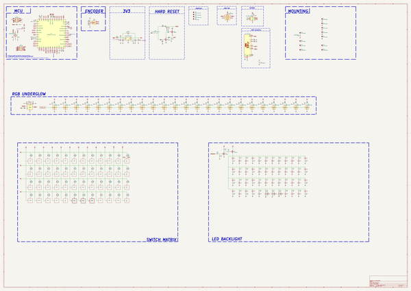
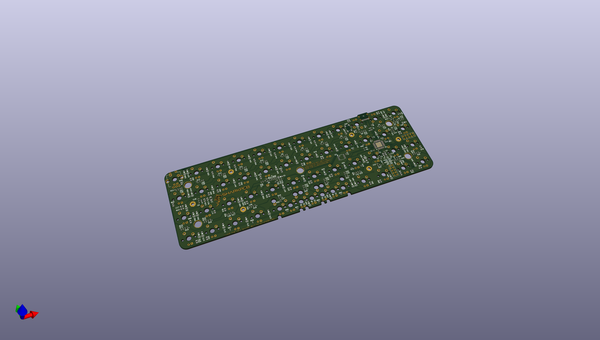

# sharkpcb
 
## summary 
* id: acheronproject_sharkpcb_shark
* user: acheronproject
* name: sharkpcb
* board: shark
* repo: https://github.com/AcheronProject/SharkPCB
* src_file_repo_kicad_pcb: kicad_files/shark.kicad_pcb
* src_file_repo_kicad_pcb_link: https://github.com/AcheronProject/SharkPCB/tree/main/kicad_files/shark.kicad_pcb
* src_file_repo_kicad_sch: kicad_files/shark.kicad_sch
* src_file_repo_kicad_sch_link: https://github.com/AcheronProject/SharkPCB/tree/main/kicad_files/shark.kicad_sch

* src_file_repo_sch: 
* src_file_repo_sch_link: https://github.com/AcheronProject/SharkPCB/tree/main/

## schematic  
  
[schematic (pdf)](working_schematic.pdf)  

## pcb  
 
  
  
  
[board (pdf)](working.pdf)  

## working_bom
| Id | Designator | Footprint | Quantity | Designation | Supplier and ref |  | None | 
| --- | --- | --- | --- | --- | --- | --- | --- | 
| 1 | R41,R14,R40,R7,R44 | R_0402_1005Metric | 5 | 10k |  |  | [''] | 
| 2 | D52,D35,D47,D48,D32,D60,D40,D39,D55,D50,D43,D49,D31,D44,D69,D63,D45,D61,D30,D67,D53,D62,D73,D56,D37,D42,D1,D70,D64,D58,D41,D68,D28,D72,D29,D36,D34,D74,D27,D66,D46,D38,D51,D57,D59,D54,D71,D33,D65 | D_SOD-123 | 49 | 1N4148W |  |  | [''] | 
| 3 | MH1,MH6,MH4,MH2,MH3,MH5 | MountingHole_2.5mm_Pad | 6 | MountingHole |  |  | [''] | 
| 4 | R34,R38,R26,R16,R39,R22,R20,R19,R29,R23,R28,R24,R18,R33,R35,R32,R36,R31,R21,R37,R25,R17,R30,R27 | R_0402_1005Metric | 24 | 5.1R |  |  | [''] | 
| 5 | R43,R42 | R_0402_1005Metric | 2 | 100 |  |  | [''] | 
| 6 | Y1 | Crystal_SMD_3225-4Pin_3.2x2.5mm | 1 | TAXM8M4RFDCET2T |  |  | [''] | 
| 7 | C33,C39,C28,C3,C44,C34,C19,C25,C15,C36,C22,C43,C20,C2,C13,C11,C24,C37,C38,C30,C23,C29,C5,C31,C41,C26,C27,C4,C1,C35,C21,C42,C40,C32 | C_0402_1005Metric | 34 | 100n |  |  | [''] | 
| 8 | R5 | R_0402_1005Metric | 1 | 330k |  |  | [''] | 
| 9 | R47,R89,R66,R62,R60,R54,R50,R51,R74,R48,R76,R65,R53,R88,R73,R72,R46,R91,R75,R52,R61,R77,R55,R80,R63,R45,R64,R59,R68,R81,R49,R92,R56,R71,R78,R90 | R_0805_2012Metric | 36 | 1k |  |  | [''] | 
| 10 | FB1,FB2 | L_0805_2012Metric | 2 | GZ2012D601TF |  |  | [''] | 
| 11 | D25,D18,D12,D13,D6,D23,D8,D14,D26,D20,D4,D22,D7,D9,D19,D17,D16,D10,D5,D11,D15,D21,D3,D24 | LED_WS2812_2020 | 24 | WS2812C-2020 |  |  | [''] | 
| 12 | C8,C7 | C_0402_1005Metric | 2 | 15p |  |  | [''] | 
| 13 | C12,C9 | C_0402_1005Metric | 2 | 4.7u |  |  | [''] | 
| 14 | R12,R13 | R_0805_2012Metric | 2 | 100k |  |  | [''] | 
| 15 | C16,C17 | C_0805_2012Metric | 2 | 1u |  |  | [''] | 
| 16 | R87,R70,R82,R85,R86,R67,R69,R79,R57,R84,R83,R58 | R_0402_1005Metric | 12 | 1k |  |  | [''] | 
| 17 | U1 | STM_UFQFPN-48_LQFP-48-1EP_7x7mm_P0.5mm_HandSoldering_ThermalReliefs | 1 | STM32F411CEU6 |  |  | [''] | 
| 18 | R2,R1 | R_0402_1005Metric | 2 | 4.7k |  |  | [''] | 
| 19 | R10,R9,R8 | R_0402_1005Metric | 3 | 100R |  |  | [''] | 
| 20 | D2 | D_SOD-123 | 1 | B5819W-SL |  |  | [''] | 
| 21 | H3,H4,H5,H1,H2 | shark_3mm_tht_mountinghole | 5 | MountingHole |  |  | [''] | 
| 22 | C18,C10 | C_0402_1005Metric | 2 | 10n |  |  | [''] | 
| 23 | Q3 | SOT-23 | 1 | AO3401A |  |  | [''] | 
| 24 | R15,R11 | R_0402_1005Metric | 2 | 5.1k |  |  | [''] | 
| 25 | C14 | C_0402_1005Metric | 1 | 10u |  |  | [''] | 
| 26 | Q2,Q1,Q4 | SOT-23 | 3 | 2N7002 |  |  | [''] | 
| 27 | U5 | SOT-563 | 1 | TXS0101DRLR |  |  | [''] | 
| 28 | U3 | SOIC-8 | 1 | AT24C256C-SSHL-T |  |  | [''] | 
| 29 | C6 | CP_EIA-3216-10_Kemet-I_Pad1.58x1.35mm_HandSolder | 1 | 10u |  |  | [''] | 
| 30 | R4 | R_0402_1005Metric | 1 | 1.5k |  |  | [''] | 
| 31 | U4 | SOT-23-5 | 1 | SGM2007-3.3XN5/TR |  |  | [''] | 
| 32 | SW2 | K2-1187SQ-A4SW-06 | 1 | K2-1187SQ-A4SW-06 |  |  | [''] | 
| 33 | U2 | SOT-23-6 | 1 | USBLC6-2SC6 |  |  | [''] | 
| 34 | R6 | R_0402_1005Metric | 1 | 1M |  |  | [''] | 
| 35 | R3 | R_0805_2012Metric | 1 | 10k |  |  | [''] | 
| 36 | J1 | TYPE-C-31-M-12 | 1 | TYPE-C-31-M12 |  |  | [''] | 
| 37 | F1 | Fuse_1206_3216Metric | 1 | nSMD100-16V |  |  | [''] | 

## bom_schematic
| Ref | Qnty | Value | Cmp name | Footprint | Description | Vendor | DNP | 
| --- | --- | --- | --- | --- | --- | --- | --- | 
| C1, C2, C3, C4, C5, C11, C13, C15, C19, C20, C21, C22, C23, C24, C25, C26, C27, C28, C29, C30, C31, C32, C33, C34, C35, C36, C37, C38, C39, C40, C41, C42, C43, C44 | 34 | 100n | C_Small | Capacitor_SMD:C_0402_1005Metric | Unpolarized capacitor, small symbol |  |  | 
| C6 | 1 | 10u | CP1 | acheron_Components:CP_EIA-3216-10_Kemet-I_Pad1.58x1.35mm_HandSolder | Polarized capacitor, US symbol |  |  | 
| C7, C8 | 2 | 15p | C_Small | Capacitor_SMD:C_0402_1005Metric | Unpolarized capacitor, small symbol |  |  | 
| C9, C12 | 2 | 4.7u | C_Small | Capacitor_SMD:C_0402_1005Metric | Unpolarized capacitor, small symbol |  |  | 
| C10, C18 | 2 | 10n | C_Small | Capacitor_SMD:C_0402_1005Metric | Unpolarized capacitor, small symbol |  |  | 
| C14 | 1 | 10u | C_Small | Capacitor_SMD:C_0402_1005Metric | Unpolarized capacitor, small symbol |  |  | 
| C16, C17 | 2 | 1u | C | Capacitor_SMD:C_0805_2012Metric | Unpolarized capacitor |  |  | 
| D1, D27, D28, D29, D30, D31, D32, D33, D34, D35, D36, D37, D38, D39, D40, D41, D42, D43, D44, D45, D46, D47, D48, D49, D50, D51, D52, D53, D54, D55, D56, D57, D58, D59, D60, D61, D62, D63, D64, D65, D66, D67, D68, D69, D70, D71, D72, D73, D74 | 49 | 1N4148W | D | acheron_Components:D_SOD-123 | Diode |  |  | 
| D2 | 1 | B5819W-SL | D_Schottky | acheron_Components:D_SOD-123 | Schottky diode |  |  | 
| D3, D4, D5, D6, D7, D8, D9, D10, D11, D12, D13, D14, D15, D16, D17, D18, D19, D20, D21, D22, D23, D24, D25, D26 | 24 | WS2812C-2020 | WS2812B-2020 | acheron_Components:LED_WS2812_2020 | Intelligent control RGB LED integrated light source, 3.5x3.5mm package |  |  | 
| F1 | 1 | nSMD100-16V | Fuse | Fuse:Fuse_1206_3216Metric | Fuse |  |  | 
| FB1, FB2 | 2 | GZ2012D601TF | Ferrite_Bead_Small | Inductor_SMD:L_0805_2012Metric | Ferrite bead, small symbol |  |  | 
| H1, H2, H3, H4, H5 | 5 | MountingHole | MountingHole_Pad | shark_library:shark_3mm_tht_mountinghole | Mounting Hole with connection |  |  | 
| J1 | 1 | TYPE-C-31-M12 | USB_C_16_pin | acheron_Connectors:TYPE-C-31-M-12 | 16-pin USB type C (USB 2.0) connector |  |  | 
| MH1, MH2, MH3, MH4, MH5, MH6 | 6 | MountingHole | MountingHole_Pad | shark_library:MountingHole_2.5mm_Pad | Mounting Hole with connection |  |  | 
| Q1, Q2, Q4 | 3 | 2N7002 | 2N7002 | Package_TO_SOT_SMD:SOT-23 | 0.115A Id, 60V Vds, N-Channel MOSFET, SOT-23 |  |  | 
| Q3 | 1 | AO3401A | AO3401A | Package_TO_SOT_SMD:SOT-23 | -4.0A Id, -30V Vds, P-Channel MOSFET, SOT-23 |  |  | 
| R1, R2 | 2 | 4.7k | R_Small | Resistor_SMD:R_0402_1005Metric | Resistor, small symbol |  |  | 
| R3 | 1 | 10k | R_Small | Resistor_SMD:R_0805_2012Metric | Resistor, small symbol |  |  | 
| R4 | 1 | 1.5k | R_Small | Resistor_SMD:R_0402_1005Metric | Resistor, small symbol |  |  | 
| R5 | 1 | 330k | R_Small | Resistor_SMD:R_0402_1005Metric | Resistor, small symbol |  |  | 
| R6 | 1 | 1M | R_Small | Resistor_SMD:R_0402_1005Metric | Resistor, small symbol |  |  | 
| R7, R14, R40, R41, R44 | 5 | 10k | R_Small | Resistor_SMD:R_0402_1005Metric | Resistor, small symbol |  |  | 
| R8, R9, R10 | 3 | 100R | R_Small | Resistor_SMD:R_0402_1005Metric | Resistor, small symbol |  |  | 
| R11, R15 | 2 | 5.1k | R_Small | Resistor_SMD:R_0402_1005Metric | Resistor, small symbol |  |  | 
| R12, R13 | 2 | 100k | R | Resistor_SMD:R_0805_2012Metric | Resistor |  |  | 
| R16, R17, R18, R19, R20, R21, R22, R23, R24, R25, R26, R27, R28, R29, R30, R31, R32, R33, R34, R35, R36, R37, R38, R39 | 24 | 5.1R | R_Small | Resistor_SMD:R_0402_1005Metric | Resistor, small symbol |  |  | 
| R42, R43 | 2 | 100 | R_Small | Resistor_SMD:R_0402_1005Metric | Resistor, small symbol |  |  | 
| R45, R46, R47, R48, R49, R50, R51, R52, R53, R54, R55, R56, R59, R60, R61, R62, R63, R64, R65, R66, R68, R71, R72, R73, R74, R75, R76, R77, R78, R80, R81, R88, R89, R90, R91, R92 | 36 | 1k | R_Small | Resistor_SMD:R_0805_2012Metric | Resistor, small symbol |  |  | 
| R57, R58, R67, R69, R70, R79, R82, R83, R84, R85, R86, R87 | 12 | 1k | R_Small | Resistor_SMD:R_0402_1005Metric | Resistor, small symbol |  |  | 
| SW2 | 1 | K2-1187SQ-A4SW-06 | SW_SPST | acheron_Hardware:K2-1187SQ-A4SW-06 | Single Pole Single Throw (SPST) switch |  |  | 
| U1 | 1 | STM32F411CEU6 | STM32F411-48 | acheron_Components:STM_UFQFPN-48_LQFP-48-1EP_7x7mm_P0.5mm_HandSoldering_ThermalReliefs | UFQFPN-48 Arm® Cortex®-M4 32bits MCU+FPU, 125 DMIPS, 512KB Flash,   128KB RAM, USB OTG FS, 11 TIMs, 1 ADC, 13 comm. interfaces |  |  | 
| U2 | 1 | USBLC6-2SC6 | USBLC6-2SC6 | acheron_Components:SOT-23-6 | Very low capacitance ESD protection diode, 2 data-line, SOT-23-6 |  |  | 
| U3 | 1 | AT24C256C-SSHL-T | 24LC256 | acheron_Components:SOIC-8 | I2C Serial EEPROM, 256Kb, DIP-8/SOIC-8/TSSOP-8/DFN-8 |  |  | 
| U4 | 1 | SGM2007-3.3XN5/TR | SGM2036 | acheron_Components:SOT-23-5 | 300mA, Low Power, Low Dropout Linear Regulators |  |  | 
| U5 | 1 | TXS0101DRLR | TXS0101 | acheron_Components:SOT-563 | 1-bit bidirectional level shifting voltage level translator |  |  | 
| Y1 | 1 | TAXM8M4RFDCET2T | Crystal_GND24 | acheron_Components:Crystal_SMD_3225-4Pin_3.2x2.5mm | Four pin crystal, GND on pins 2 and 4 |  |  | 

## mounting_holes
| x | y | package | value | ref | size | 
| --- | --- | --- | --- | --- | --- | 
| -9.475 | -9.475 | shark_3mm_tht_mountinghole | MountingHole | H1 | m3 | 
| -199.475 | -9.475 | shark_3mm_tht_mountinghole | MountingHole | H2 | m3 | 
| -104.5 | -28.5 | shark_3mm_tht_mountinghole | MountingHole | H3 | m3 | 
| -199.475 | -47.475 | shark_3mm_tht_mountinghole | MountingHole | H4 | m3 | 
| -9.475 | -47.475 | shark_3mm_tht_mountinghole | MountingHole | H5 | m3 | 

## positions
### top
| # Ref | Val | Package | PosX | PosY | Rot | Side | 
| --- | --- | --- | --- | --- | --- | --- | 
| C1 | 100n | C_0402_1005Metric | -35.5 | -31.7 | 0.0 | top | 
| C2 | 100n | C_0402_1005Metric | -33.2 | -41.525 | 90.0 | top | 
| C3 | 100n | C_0402_1005Metric | -31.91 | -33.78 | -90.0 | top | 
| C4 | 100n | C_0402_1005Metric | -32.67 | -21.7 | 90.0 | top | 
| C5 | 100n | C_0402_1005Metric | -34.6 | -39.775 | 90.0 | top | 
| C6 | 10u | CP_EIA-3216-10_Kemet-I_Pad1.58x1.35mm_HandSolder | -46.08 | -37.68 | -90.0 | top | 
| C7 | 15p | C_0402_1005Metric | -27.4 | -36.08 | 0.0 | top | 
| C8 | 15p | C_0402_1005Metric | -27.4 | -41.28 | 0.0 | top | 
| C9 | 4.7u | C_0402_1005Metric | -24.0 | -41.6 | 0.0 | top | 
| C10 | 10n | C_0402_1005Metric | -24.0 | -40.2 | 0.0 | top | 
| C11 | 100n | C_0402_1005Metric | -22.8875 | -23.6 | 0.0 | top | 
| C12 | 4.7u | C_0402_1005Metric | -22.05 | -25.8 | 180.0 | top | 
| C13 | 100n | C_0402_1005Metric | -60.5 | -26.8 | 90.0 | top | 
| C14 | 10u | C_0402_1005Metric | -129.5 | -28.87 | -90.0 | top | 
| C15 | 100n | C_0402_1005Metric | -139.9 | -28.2 | -90.0 | top | 
| C16 | 1u | C_0805_2012Metric | -189.5 | -28.2875 | -90.0 | top | 
| C17 | 1u | C_0805_2012Metric | -208.6 | -27.4 | 0.0 | top | 
| C18 | 10n | C_0402_1005Metric | -194.1 | -25.45 | 180.0 | top | 
| C19 | 100n | C_0402_1005Metric | -9.4 | -19.6 | 180.0 | top | 
| C20 | 100n | C_0402_1005Metric | -11.4 | -16.32 | -90.0 | top | 
| C21 | 100n | C_0402_1005Metric | 3.585 | -9.35 | -90.0 | top | 
| C22 | 100n | C_0402_1005Metric | -16.4 | -9.4 | -90.0 | top | 
| C23 | 100n | C_0402_1005Metric | -35.4 | -9.43 | -90.0 | top | 
| C24 | 100n | C_0402_1005Metric | -54.4 | -9.43 | -90.0 | top | 
| C25 | 100n | C_0402_1005Metric | -73.4 | -9.43 | -90.0 | top | 
| C26 | 100n | C_0402_1005Metric | -92.4 | -9.43 | -90.0 | top | 
| C27 | 100n | C_0402_1005Metric | -111.4 | -9.43 | -90.0 | top | 
| C28 | 100n | C_0402_1005Metric | -130.4 | -9.43 | -90.0 | top | 
| C29 | 100n | C_0402_1005Metric | -149.4 | -9.43 | -90.0 | top | 
| C30 | 100n | C_0402_1005Metric | -168.4 | -9.43 | -90.0 | top | 
| C31 | 100n | C_0402_1005Metric | -187.4 | -9.43 | -90.0 | top | 
| C32 | 100n | C_0402_1005Metric | -206.4 | -10.73 | -90.0 | top | 
| C33 | 100n | C_0402_1005Metric | -211.6 | -47.57 | 90.0 | top | 
| C34 | 100n | C_0402_1005Metric | -192.6 | -47.57 | 90.0 | top | 
| C35 | 100n | C_0402_1005Metric | -173.6 | -47.57 | 90.0 | top | 
| C36 | 100n | C_0402_1005Metric | -154.6 | -47.57 | 90.0 | top | 
| C37 | 100n | C_0402_1005Metric | -130.0 | -49.77 | 0.0 | top | 
| C38 | 100n | C_0402_1005Metric | -107.4 | -45.37 | 0.0 | top | 
| C39 | 100n | C_0402_1005Metric | -88.4 | -45.37 | 0.0 | top | 
| C40 | 100n | C_0402_1005Metric | -69.4 | -45.37 | 0.0 | top | 
| C41 | 100n | C_0402_1005Metric | -59.6 | -47.57 | 90.0 | top | 
| C42 | 100n | C_0402_1005Metric | -38.6 | -45.57 | 180.0 | top | 
| C43 | 100n | C_0402_1005Metric | -21.6 | -47.57 | 90.0 | top | 
| C44 | 100n | C_0402_1005Metric | -2.6 | -47.57 | 90.0 | top | 
| D1 | 1N4148W | D_SOD-123 | -122.9 | -28.87 | 0.0 | top | 
| D2 | B5819W-SL | D_SOD-123 | -205.2 | -28.8 | 90.0 | top | 
| D3 | WS2812C-2020 | LED_WS2812_2020 | 0.9 | -9.5 | 180.0 | top | 
| D4 | WS2812C-2020 | LED_WS2812_2020 | -19.0 | -9.5 | 180.0 | top | 
| D5 | WS2812C-2020 | LED_WS2812_2020 | -38.0 | -9.5 | 180.0 | top | 
| D6 | WS2812C-2020 | LED_WS2812_2020 | -57.0 | -9.5 | 180.0 | top | 
| D7 | WS2812C-2020 | LED_WS2812_2020 | -76.0 | -9.5 | 180.0 | top | 
| D8 | WS2812C-2020 | LED_WS2812_2020 | -95.0 | -9.5 | 180.0 | top | 
| D9 | WS2812C-2020 | LED_WS2812_2020 | -114.0 | -9.5 | 180.0 | top | 
| D10 | WS2812C-2020 | LED_WS2812_2020 | -133.035 | -9.5 | 180.0 | top | 
| D11 | WS2812C-2020 | LED_WS2812_2020 | -152.0 | -9.5 | 180.0 | top | 
| D12 | WS2812C-2020 | LED_WS2812_2020 | -171.0 | -9.5 | 180.0 | top | 
| D13 | WS2812C-2020 | LED_WS2812_2020 | -190.0 | -9.5 | 180.0 | top | 
| D14 | WS2812C-2020 | LED_WS2812_2020 | -209.0 | -10.8 | 180.0 | top | 
| D15 | WS2812C-2020 | LED_WS2812_2020 | -209.0 | -47.5 | 0.0 | top | 
| D16 | WS2812C-2020 | LED_WS2812_2020 | -190.0 | -47.5 | 0.0 | top | 
| D17 | WS2812C-2020 | LED_WS2812_2020 | -171.0 | -47.5 | 0.0 | top | 
| D18 | WS2812C-2020 | LED_WS2812_2020 | -152.0 | -47.5 | 0.0 | top | 
| D19 | WS2812C-2020 | LED_WS2812_2020 | -129.4375 | -47.5 | 0.0 | top | 
| D20 | WS2812C-2020 | LED_WS2812_2020 | -106.875 | -47.5 | 0.0 | top | 
| D21 | WS2812C-2020 | LED_WS2812_2020 | -87.875 | -47.5 | 0.0 | top | 
| D22 | WS2812C-2020 | LED_WS2812_2020 | -68.875 | -47.5 | 0.0 | top | 
| D23 | WS2812C-2020 | LED_WS2812_2020 | -57.0 | -47.5 | 0.0 | top | 
| D24 | WS2812C-2020 | LED_WS2812_2020 | -38.0 | -47.5 | 0.0 | top | 
| D25 | WS2812C-2020 | LED_WS2812_2020 | -19.0 | -47.5 | 0.0 | top | 
| D26 | WS2812C-2020 | LED_WS2812_2020 | 0.0 | -47.5 | 0.0 | top | 
| D27 | 1N4148W | D_SOD-123 | -8.2 | -0.08 | 90.0 | top | 
| D28 | 1N4148W | D_SOD-123 | -10.8 | -0.08 | 90.0 | top | 
| D29 | 1N4148W | D_SOD-123 | -64.9 | 0.0 | 90.0 | top | 
| D30 | 1N4148W | D_SOD-123 | -68.1 | 0.0 | 90.0 | top | 
| D31 | 1N4148W | D_SOD-123 | -85.5 | 0.0 | 90.0 | top | 
| D32 | 1N4148W | D_SOD-123 | -104.5 | 0.0 | 90.0 | top | 
| D33 | 1N4148W | D_SOD-123 | -123.5 | 0.0 | 90.0 | top | 
| D34 | 1N4148W | D_SOD-123 | -142.5 | 0.0 | 90.0 | top | 
| D35 | 1N4148W | D_SOD-123 | -161.5 | 0.0 | 90.0 | top | 
| D36 | 1N4148W | D_SOD-123 | -180.5 | 0.0 | 90.0 | top | 
| D37 | 1N4148W | D_SOD-123 | -197.0 | 3.6 | 90.0 | top | 
| D38 | 1N4148W | D_SOD-123 | -199.8 | 3.6 | 90.0 | top | 
| D39 | 1N4148W | D_SOD-123 | 4.4 | -13.2928 | 0.0 | top | 
| D40 | 1N4148W | D_SOD-123 | -25.8 | -15.2 | 90.0 | top | 
| D41 | 1N4148W | D_SOD-123 | -47.5 | -18.0 | 90.0 | top | 
| D42 | 1N4148W | D_SOD-123 | -66.5 | -19.0 | 90.0 | top | 
| D43 | 1N4148W | D_SOD-123 | -85.5 | -19.0 | 90.0 | top | 
| D44 | 1N4148W | D_SOD-123 | -104.5 | -19.0 | 90.0 | top | 
| D45 | 1N4148W | D_SOD-123 | -123.5 | -19.0 | 90.0 | top | 
| D46 | 1N4148W | D_SOD-123 | -142.5 | -19.0 | 90.0 | top | 
| D47 | 1N4148W | D_SOD-123 | -161.5 | -19.0 | 90.0 | top | 
| D48 | 1N4148W | D_SOD-123 | -180.5 | -19.0 | 90.0 | top | 
| D49 | 1N4148W | D_SOD-123 | -198.0875 | -19.0 | 90.0 | top | 
| D50 | 1N4148W | D_SOD-123 | -200.9 | -19.0 | 90.0 | top | 
| D51 | 1N4148W | D_SOD-123 | -7.4 | -37.6 | 90.0 | top | 
| D52 | 1N4148W | D_SOD-123 | -9.9 | -37.6 | 90.0 | top | 
| D53 | 1N4148W | D_SOD-123 | -48.68 | -38.0 | 90.0 | top | 
| D54 | 1N4148W | D_SOD-123 | -66.5 | -38.0 | 90.0 | top | 
| D55 | 1N4148W | D_SOD-123 | -85.5 | -38.0 | 90.0 | top | 
| D56 | 1N4148W | D_SOD-123 | -104.5 | -38.0 | 90.0 | top | 
| D57 | 1N4148W | D_SOD-123 | -123.5 | -38.0 | 90.0 | top | 
| D58 | 1N4148W | D_SOD-123 | -142.5 | -38.0 | 90.0 | top | 
| D59 | 1N4148W | D_SOD-123 | -160.1 | -38.0 | 90.0 | top | 
| D60 | 1N4148W | D_SOD-123 | -162.9 | -38.0 | 90.0 | top | 
| D61 | 1N4148W | D_SOD-123 | -198.0875 | -38.0 | 90.0 | top | 
| D62 | 1N4148W | D_SOD-123 | -200.9 | -38.0 | 90.0 | top | 
| D63 | 1N4148W | D_SOD-123 | -8.0875 | -57.0 | 90.0 | top | 
| D64 | 1N4148W | D_SOD-123 | -18.2 | -51.8 | -90.0 | top | 
| D65 | 1N4148W | D_SOD-123 | -33.2875 | -61.2 | 90.0 | top | 
| D66 | 1N4148W | D_SOD-123 | -64.875 | -57.0 | 90.0 | top | 
| D67 | 1N4148W | D_SOD-123 | -67.675 | -57.0 | 90.0 | top | 
| D68 | 1N4148W | D_SOD-123 | -89.6 | -61.0 | 90.0 | top | 
| D69 | 1N4148W | D_SOD-123 | -108.6 | -61.0 | 90.0 | top | 
| D70 | 1N4148W | D_SOD-123 | -142.5 | -57.0 | 90.0 | top | 
| D71 | 1N4148W | D_SOD-123 | -161.5 | -57.0 | 90.0 | top | 
| D72 | 1N4148W | D_SOD-123 | -180.5 | -55.8125 | 90.0 | top | 
| D73 | 1N4148W | D_SOD-123 | -198.0875 | -57.0 | 90.0 | top | 
| D74 | 1N4148W | D_SOD-123 | -200.9 | -57.0 | 90.0 | top | 
| F1 | nSMD100-16V | Fuse_1206_3216Metric | -184.1 | -28.7375 | -90.0 | top | 
| FB1 | GZ2012D601TF | L_0805_2012Metric | -38.9 | -5.6 | 90.0 | top | 
| FB2 | GZ2012D601TF | L_0805_2012Metric | -42.0 | -7.2 | -90.0 | top | 
| H1 | MountingHole | shark_3mm_tht_mountinghole | -9.475 | -9.475 | 0.0 | top | 
| H2 | MountingHole | shark_3mm_tht_mountinghole | -199.475 | -9.475 | 0.0 | top | 
| H3 | MountingHole | shark_3mm_tht_mountinghole | -104.5 | -28.5 | 0.0 | top | 
| H4 | MountingHole | shark_3mm_tht_mountinghole | -199.475 | -47.475 | 0.0 | top | 
| H5 | MountingHole | shark_3mm_tht_mountinghole | -9.475 | -47.475 | 0.0 | top | 
| J1 | TYPE-C-31-M1 | TYPE-C-31-M-12 | -28.5 | 1.475 | 180.0 | top | 
| LED1 | LED | LED_THT_2.54mm | 0.0 | -5.08 | 0.0 | top | 
| LED2 | LED | LED_THT_2.54mm | -57.0 | -5.08 | 0.0 | top | 
| LED3 | LED | LED_THT_2.54mm | -209.0 | -5.08 | 0.0 | top | 
| LED4 | LED | LED_THT_2.54mm | -19.0 | 5.08 | 0.0 | top | 
| LED5 | LED | LED_THT_2.54mm | -38.0 | 5.08 | 0.0 | top | 
| LED6 | LED | LED_THT_2.54mm | -76.0 | -5.08 | 0.0 | top | 
| LED7 | LED | LED_THT_2.54mm | -95.0 | -5.08 | 0.0 | top | 
| LED8 | LED | LED_THT_2.54mm | -114.0 | -5.08 | 0.0 | top | 
| LED9 | LED | LED_THT_2.54mm | -133.0 | -5.08 | 0.0 | top | 
| LED10 | LED | LED_THT_2.54mm | -152.0 | -5.08 | 0.0 | top | 
| LED11 | LED | LED_THT_2.54mm | -171.0 | -5.08 | 0.0 | top | 
| LED12 | LED | LED_THT_2.54mm | -190.0 | -5.08 | 0.0 | top | 
| LED13 | LED | LED_THT_2.54mm | 0.0 | -24.08 | 0.0 | top | 
| LED14 | LED | LED_THT_2.54mm | -57.0 | -24.08 | 0.0 | top | 
| LED15 | LED | LED_THT_2.54mm | -209.0 | -24.08 | 0.0 | top | 
| LED16 | LED | LED_THT_2.54mm | -19.0 | -24.08 | 0.0 | top | 
| LED17 | LED | LED_THT_2.54mm | -38.0 | -24.08 | 0.0 | top | 
| LED18 | LED | LED_THT_2.54mm | -76.0 | -24.08 | 0.0 | top | 
| LED19 | LED | LED_THT_2.54mm | -95.0 | -24.08 | 0.0 | top | 
| LED20 | LED | LED_THT_2.54mm | -114.0 | -24.08 | 0.0 | top | 
| LED21 | LED | LED_THT_2.54mm | -133.0 | -24.08 | 0.0 | top | 
| LED22 | LED | LED_THT_2.54mm | -152.0 | -24.08 | 0.0 | top | 
| LED23 | LED | LED_THT_2.54mm | -171.0 | -24.08 | 0.0 | top | 
| LED24 | LED | LED_THT_2.54mm | -190.0 | -24.08 | 0.0 | top | 
| LED25 | LED | LED_THT_2.54mm | 0.0 | -43.08 | 0.0 | top | 
| LED26 | LED | LED_THT_2.54mm | -57.0 | -43.08 | 0.0 | top | 
| LED27 | LED | LED_THT_2.54mm | -209.0 | -43.08 | 0.0 | top | 
| LED28 | LED | LED_THT_2.54mm | -19.0 | -43.08 | 0.0 | top | 
| LED29 | LED | LED_THT_2.54mm | -38.0 | -43.08 | 0.0 | top | 
| LED30 | LED | LED_THT_2.54mm | -76.0 | -43.08 | 0.0 | top | 
| LED31 | LED | LED_THT_2.54mm | -95.0 | -43.08 | 0.0 | top | 
| LED32 | LED | LED_THT_2.54mm | -114.0 | -43.08 | 0.0 | top | 
| LED33 | LED | LED_THT_2.54mm | -133.0 | -43.08 | 0.0 | top | 
| LED34 | LED | LED_THT_2.54mm | -152.0 | -43.08 | 0.0 | top | 
| LED35 | LED | LED_THT_2.54mm | -171.0 | -43.08 | 0.0 | top | 
| LED36 | LED | LED_THT_2.54mm | -190.0 | -43.08 | 0.0 | top | 
| LED37 | LED | LED_THT_2.54mm | 0.0 | -62.08 | 0.0 | top | 
| LED38 | LED | LED_THT_2.54mm | -38.0 | -62.08 | 0.0 | top | 
| LED39 | LED | LED_THT_2.54mm | -57.0 | -62.08 | 0.0 | top | 
| LED40 | LED | LED_THT_2.54mm | -209.0 | -62.08 | 0.0 | top | 
| LED41 | LED | LED_THT_2.54mm | -19.0 | -62.08 | 0.0 | top | 
| LED42 | LED | LED_THT_2.54mm | -76.0 | -62.08 | 0.0 | top | 
| LED43 | LED | LED_THT_2.54mm | -95.0 | -62.08 | 0.0 | top | 
| LED44 | LED | LED_THT_2.54mm | -85.5 | -62.08 | 0.0 | top | 
| LED45 | LED | LED_THT_2.54mm | -114.0 | -62.08 | 0.0 | top | 
| LED46 | LED | LED_THT_2.54mm | -104.5 | -62.08 | 0.0 | top | 
| LED47 | LED | LED_THT_2.54mm | -133.0 | -62.08 | 0.0 | top | 
| LED48 | LED | LED_THT_2.54mm | -123.5 | -62.08 | 0.0 | top | 
| LED49 | LED | LED_THT_2.54mm | -152.0 | -62.08 | 0.0 | top | 
| LED50 | LED | LED_THT_2.54mm | -171.0 | -62.08 | 0.0 | top | 
| LED51 | LED | LED_THT_2.54mm | -190.0 | -62.08 | 0.0 | top | 
| Q1 | 2N7002 | SOT-23 | -135.3 | -28.0 | 180.0 | top | 
| Q2 | 2N7002 | SOT-23 | -127.38 | -32.07 | 180.0 | top | 
| Q3 | AO3401A | SOT-23 | -4.6 | -5.2 | 90.0 | top | 
| Q4 | 2N7002 | SOT-23 | -4.038 | -9.3848 | 90.0 | top | 
| R1 | 4.7k | R_0402_1005Metric | -43.0875 | -28.65 | 0.0 | top | 
| R2 | 4.7k | R_0402_1005Metric | -43.0875 | -26.7 | 0.0 | top | 
| R3 | 10k | R_0805_2012Metric | -23.8 | -61.8 | -90.0 | top | 
| R4 | 1.5k | R_0402_1005Metric | -30.7 | -18.55 | -90.0 | top | 
| R5 | 330k | R_0402_1005Metric | -126.7 | -28.87 | -90.0 | top | 
| R6 | 1M | R_0402_1005Metric | -128.1 | -28.87 | -90.0 | top | 
| R7 | 10k | R_0402_1005Metric | -130.88 | -28.87 | -90.0 | top | 
| R8 | 100R | R_0402_1005Metric | -132.42 | -28.87 | 90.0 | top | 
| R9 | 100R | R_0402_1005Metric | -138.3 | -28.2 | 90.0 | top | 
| R10 | 100R | R_0402_1005Metric | -124.38 | -31.27 | 90.0 | top | 
| R11 | 5.1k | R_0402_1005Metric | -25.6 | -5.8 | 90.0 | top | 
| R12 | 100k | R_0805_2012Metric | -186.9 | -28.25 | -90.0 | top | 
| R13 | 100k | R_0805_2012Metric | -208.6 | -29.8 | 0.0 | top | 
| R14 | 10k | R_0402_1005Metric | -122.78 | -31.27 | -90.0 | top | 
| R15 | 5.1k | R_0402_1005Metric | -30.6 | -5.0 | -90.0 | top | 
| R16 | 5.1R | R_0402_1005Metric | 5.185 | -9.35 | -90.0 | top | 
| R17 | 5.1R | R_0402_1005Metric | -14.8 | -9.4 | -90.0 | top | 
| R18 | 5.1R | R_0402_1005Metric | -33.8 | -9.46 | -90.0 | top | 
| R19 | 5.1R | R_0402_1005Metric | -53.0 | -9.46 | -90.0 | top | 
| R20 | 5.1R | R_0402_1005Metric | -72.0 | -9.46 | -90.0 | top | 
| R21 | 5.1R | R_0402_1005Metric | -91.0 | -9.46 | -90.0 | top | 
| R22 | 5.1R | R_0402_1005Metric | -110.0 | -9.46 | -90.0 | top | 
| R23 | 5.1R | R_0402_1005Metric | -129.0 | -9.46 | -90.0 | top | 
| R24 | 5.1R | R_0402_1005Metric | -148.0 | -9.46 | -90.0 | top | 
| R25 | 5.1R | R_0402_1005Metric | -167.0 | -9.46 | -90.0 | top | 
| R26 | 5.1R | R_0402_1005Metric | -186.0 | -9.46 | -90.0 | top | 
| R27 | 5.1R | R_0402_1005Metric | -205.0 | -10.76 | -90.0 | top | 
| R28 | 5.1R | R_0402_1005Metric | -213.2 | -47.54 | 90.0 | top | 
| R29 | 5.1R | R_0402_1005Metric | -194.2 | -47.54 | 90.0 | top | 
| R30 | 5.1R | R_0402_1005Metric | -175.2 | -47.54 | 90.0 | top | 
| R31 | 5.1R | R_0402_1005Metric | -156.2 | -47.54 | 90.0 | top | 
| R32 | 5.1R | R_0402_1005Metric | -130.0 | -51.1025 | 0.0 | top | 
| R33 | 5.1R | R_0402_1005Metric | -107.4 | -43.74 | 0.0 | top | 
| R34 | 5.1R | R_0402_1005Metric | -88.4 | -43.94 | 0.0 | top | 
| R35 | 5.1R | R_0402_1005Metric | -69.4 | -43.74 | 0.0 | top | 
| R36 | 5.1R | R_0402_1005Metric | -61.2 | -47.54 | 90.0 | top | 
| R37 | 5.1R | R_0402_1005Metric | -34.09 | -47.28 | -90.0 | top | 
| R38 | 5.1R | R_0402_1005Metric | -23.2 | -47.54 | 90.0 | top | 
| R39 | 5.1R | R_0402_1005Metric | -4.2 | -47.54 | 90.0 | top | 
| R40 | 10k | R_0402_1005Metric | -11.4 | -18.52 | 90.0 | top | 
| R41 | 10k | R_0402_1005Metric | -1.4 | -8.5848 | 90.0 | top | 
| R42 | 100 | R_0402_1005Metric | -7.11 | -4.2 | -90.0 | top | 
| R43 | 100 | R_0402_1005Metric | -7.0 | -14.0 | 90.0 | top | 
| R44 | 10k | R_0402_1005Metric | -5.6 | -14.0 | 90.0 | top | 
| R45 | 1k | R_0805_2012Metric | -13.2 | 5.12 | 90.0 | top | 
| R46 | 1k | R_0805_2012Metric | -43.7 | 5.4 | 0.0 | top | 
| R47 | 1k | R_0805_2012Metric | -81.9375 | -5.08 | 90.0 | top | 
| R48 | 1k | R_0805_2012Metric | -100.9375 | -5.08 | -90.0 | top | 
| R49 | 1k | R_0805_2012Metric | -119.9375 | -5.08 | -90.0 | top | 
| R50 | 1k | R_0805_2012Metric | -138.9375 | -5.08 | -90.0 | top | 
| R51 | 1k | R_0805_2012Metric | -156.8 | -5.08 | -90.0 | top | 
| R52 | 1k | R_0805_2012Metric | -176.9375 | -5.08 | -90.0 | top | 
| R53 | 1k | R_0805_2012Metric | -195.9375 | -5.08 | -90.0 | top | 
| R54 | 1k | R_0805_2012Metric | 4.4 | -2.8 | 0.0 | top | 
| R55 | 1k | R_0805_2012Metric | -51.7 | -5.8 | 90.0 | top | 
| R56 | 1k | R_0805_2012Metric | -204.2 | -6.0 | -90.0 | top | 
| R57 | 1k | R_0402_1005Metric | -17.6 | -26.6 | 180.0 | top | 
| R58 | 1k | R_0402_1005Metric | -41.9 | -23.0 | -45.0 | top | 
| R59 | 1k | R_0805_2012Metric | -81.9375 | -23.75 | 0.0 | top | 
| R60 | 1k | R_0805_2012Metric | -100.9375 | -23.75 | -90.0 | top | 
| R61 | 1k | R_0805_2012Metric | -119.9375 | -23.75 | -90.0 | top | 
| R62 | 1k | R_0805_2012Metric | -138.9375 | -23.75 | -90.0 | top | 
| R63 | 1k | R_0805_2012Metric | -157.9375 | -23.75 | -90.0 | top | 
| R64 | 1k | R_0805_2012Metric | -176.9375 | -23.75 | -90.0 | top | 
| R65 | 1k | R_0805_2012Metric | -184.8 | -23.8 | -90.0 | top | 
| R66 | 1k | R_0805_2012Metric | -5.0 | -23.2928 | 180.0 | top | 
| R67 | 1k | R_0402_1005Metric | -52.5 | -24.2 | 0.0 | top | 
| R68 | 1k | R_0805_2012Metric | -214.9375 | -23.75 | -90.0 | top | 
| R69 | 1k | R_0402_1005Metric | -19.5 | -45.4 | 180.0 | top | 
| R70 | 1k | R_0402_1005Metric | -52.7566 | -42.6 | 90.0 | top | 
| R71 | 1k | R_0805_2012Metric | -80.6 | -42.6 | -90.0 | top | 
| R72 | 1k | R_0805_2012Metric | -99.6 | -42.6 | -90.0 | top | 
| R73 | 1k | R_0805_2012Metric | -118.2819 | -42.6 | -90.0 | top | 
| R74 | 1k | R_0805_2012Metric | -137.6 | -42.6 | -90.0 | top | 
| R75 | 1k | R_0805_2012Metric | -156.6 | -42.6 | -90.0 | top | 
| R76 | 1k | R_0805_2012Metric | -175.6 | -42.6 | -90.0 | top | 
| R77 | 1k | R_0805_2012Metric | -184.0625 | -41.5625 | -90.0 | top | 
| R78 | 1k | R_0805_2012Metric | 5.5 | -42.8 | -90.0 | top | 
| R79 | 1k | R_0402_1005Metric | -61.6 | -41.6875 | 180.0 | top | 
| R80 | 1k | R_0805_2012Metric | -204.6 | -43.4 | -90.0 | top | 
| R81 | 1k | R_0805_2012Metric | -13.6 | -62.1125 | 180.0 | top | 
| R82 | 1k | R_0402_1005Metric | -80.1 | -62.2 | 0.0 | top | 
| R83 | 1k | R_0402_1005Metric | -100.3 | -62.2 | 0.0 | top | 
| R84 | 1k | R_0402_1005Metric | -119.3 | -62.2 | 0.0 | top | 
| R85 | 1k | R_0402_1005Metric | -127.7 | -61.6 | 0.0 | top | 
| R86 | 1k | R_0402_1005Metric | -157.4 | -61.191 | -90.0 | top | 
| R87 | 1k | R_0402_1005Metric | -176.2 | -61.191 | -90.0 | top | 
| R88 | 1k | R_0805_2012Metric | -195.4625 | -61.8 | -90.0 | top | 
| R89 | 1k | R_0805_2012Metric | -5.2 | -62.1125 | 180.0 | top | 
| R90 | 1k | R_0805_2012Metric | -43.4 | -62.1125 | 90.0 | top | 
| R91 | 1k | R_0805_2012Metric | -52.7 | -61.0 | 90.0 | top | 
| R92 | 1k | R_0805_2012Metric | -203.775 | -61.8 | -90.0 | top | 
| SW2 | K2-1187SQ-A4 | K2-1187SQ-A4SW-06 | -47.4 | -1.4928 | 90.0 | top | 
| SW3 | MX_Switch | MX100 | 0.0 | 0.0 | 0.0 | top | 
| SW4 | MX_Switch | MX100 | -19.0 | 0.0 | 180.0 | top | 
| SW5 | MX_Switch | MX100 | -38.0 | 0.0 | 180.0 | top | 
| SW6 | MX_Switch | MX100 | -57.0 | 0.0 | 0.0 | top | 
| SW7 | MX_Switch | MX100 | -76.0 | 0.0 | 0.0 | top | 
| SW8 | MX_Switch | MX100 | -95.0 | 0.0 | 0.0 | top | 
| SW9 | MX_Switch | MX100 | -114.0 | 0.0 | 0.0 | top | 
| SW10 | MX_Switch | MX100 | -133.0 | 0.0 | 0.0 | top | 
| SW11 | MX_Switch | MX100 | -152.0 | 0.0 | 0.0 | top | 
| SW12 | MX_Switch | MX100 | -171.0 | 0.0 | 0.0 | top | 
| SW13 | MX_Switch | MX100 | -190.0 | 0.0 | 0.0 | top | 
| SW14 | MX_Switch | MX100 | -209.0 | 0.0 | 0.0 | top | 
| SW15 | MX_Switch | MX100 | 0.0 | -19.0 | 0.0 | top | 
| SW16 | MX_Switch | MX100 | -19.0 | -19.0 | 0.0 | top | 
| SW17 | MX_Switch | MX100 | -38.0 | -19.0 | 0.0 | top | 
| SW18 | MX_Switch | MX100 | -57.0 | -19.0 | 0.0 | top | 
| SW19 | MX_Switch | MX100 | -76.0 | -19.0 | 0.0 | top | 
| SW20 | MX_Switch | MX100 | -95.0 | -19.0 | 0.0 | top | 
| SW21 | MX_Switch | MX100 | -114.0 | -19.0 | 0.0 | top | 
| SW22 | MX_Switch | MX100 | -133.0 | -19.0 | 0.0 | top | 
| SW23 | MX_Switch | MX100 | -152.0 | -19.0 | 0.0 | top | 
| SW24 | MX_Switch | MX100 | -171.0 | -19.0 | 0.0 | top | 
| SW25 | MX_Switch | MX100 | -190.0 | -19.0 | 0.0 | top | 
| SW26 | MX_Switch | MX100 | -209.0 | -19.0 | 0.0 | top | 
| SW27 | MX_Switch | MX100 | 0.0 | -38.0 | 0.0 | top | 
| SW28 | MX_Switch | MX100 | -19.0 | -38.0 | 0.0 | top | 
| SW29 | MX_Switch | MX100 | -38.0 | -38.0 | 0.0 | top | 
| SW30 | MX_Switch | MX100 | -57.0 | -38.0 | 0.0 | top | 
| SW31 | MX_Switch | MX100 | -76.0 | -38.0 | 0.0 | top | 
| SW32 | MX_Switch | MX100 | -95.0 | -38.0 | 0.0 | top | 
| SW33 | MX_Switch | MX100 | -114.0 | -38.0 | 0.0 | top | 
| SW34 | MX_Switch | MX100 | -133.0 | -38.0 | 0.0 | top | 
| SW35 | MX_Switch | MX100 | -152.0 | -38.0 | 0.0 | top | 
| SW36 | MX_Switch | MX100 | -171.0 | -38.0 | 0.0 | top | 
| SW37 | MX_Switch | MX100 | -190.0 | -38.0 | 0.0 | top | 
| SW38 | MX_Switch | MX100 | -209.0 | -38.0 | 0.0 | top | 
| SW39 | MX_Switch | MX100 | 0.0 | -57.0 | 0.0 | top | 
| SW40 | MX_Switch | MX100 | -19.0 | -57.0 | 0.0 | top | 
| SW41 | MX_Switch | MX100 | -38.0 | -57.0 | 0.0 | top | 
| SW42 | MX_Switch | MX100 | -57.0 | -57.0 | 0.0 | top | 
| SW43 | MX_Switch | MX100 | -76.0 | -57.0 | 0.0 | top | 
| SW44 | MX_Switch | MX100 | -95.0 | -57.0 | 0.0 | top | 
| SW45 | MX_Switch | MX100 | -114.0 | -57.0 | 0.0 | top | 
| SW46 | MX_Switch | MX100 | -133.0 | -57.0 | 0.0 | top | 
| SW47 | MX_Switch | MX100 | -152.0 | -57.0 | 0.0 | top | 
| SW48 | MX_Switch | MX100 | -171.0 | -57.0 | 0.0 | top | 
| SW49 | MX_Switch | MX100 | -190.0 | -57.0 | 0.0 | top | 
| SW50 | MX_Switch | MX100 | -209.0 | -57.0 | 0.0 | top | 
| SW51 | MX_Switch | MX200R | -85.5 | -57.0 | 0.0 | top | 
| SW52 | MX_Switch | MX200R | -104.5 | -57.0 | 0.0 | top | 
| SW53 | MX_Switch | MX200R | -123.5 | -57.0 | 0.0 | top | 
| U1 | STM32F411CEU | STM_UFQFPN-48_LQFP-48-1EP_7x7mm_P0.5mm_HandSolde | -28.7 | -27.7 | 90.0 | top | 
| U2 | USBLC6-2SC6 | SOT-23-6 | -28.5 | -9.48 | 90.0 | top | 
| U3 | AT24C256C-SS | SOIC-8 | -65.6 | -28.5 | 0.0 | top | 
| U4 | SGM2007-3.3X | SOT-23-5 | -193.1 | -28.25 | 180.0 | top | 
| U5 | TXS0101DRLR | SOT-563 | -9.4 | -17.2 | 90.0 | top | 
| Y1 | TAXM8M4RFDCE | Crystal_SMD_3225-4Pin_3.2x2.5mm | -28.4 | -38.68 | 0.0 | top | 

### bottom
no data
