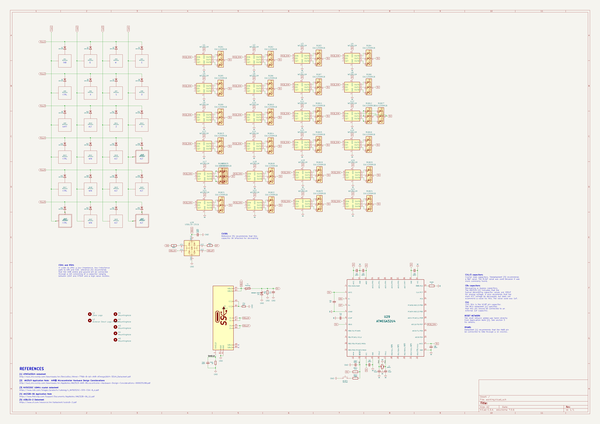
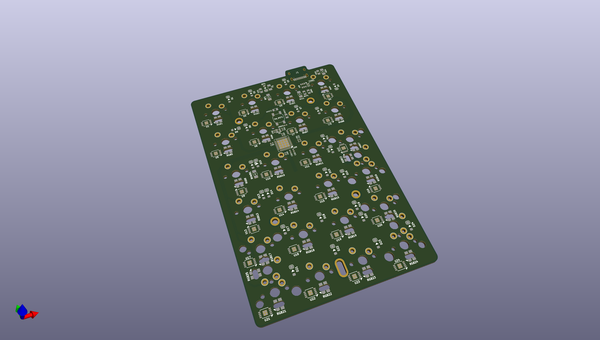
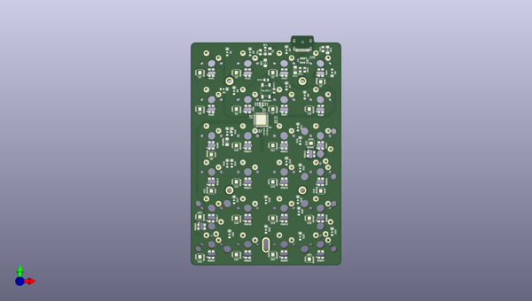
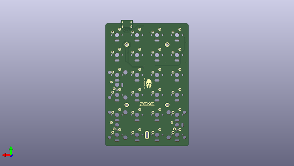

# zeke
 
## summary 
* id: acheronproject_zeke_zeke
* user: acheronproject
* name: zeke
* board: zeke
* repo: https://github.com/AcheronProject/Zeke
* src_file_repo_kicad_pcb: PCB Files/zeke.kicad_pcb
* src_file_repo_kicad_pcb_link: https://github.com/AcheronProject/Zeke/tree/master/PCB Files/zeke.kicad_pcb

* src_file_repo_sch: PCB Files/zeke.sch
* src_file_repo_sch_link: https://github.com/AcheronProject/Zeke/tree/master/PCB Files/zeke.sch

## schematic  
  
[schematic (pdf)](working_schematic.pdf)  

## pcb  
 
  
  
  
[board (pdf)](working.pdf)  

## working_bom
| Id | Designator | Footprint | Quantity | Designation | Supplier and ref |  | None | 
| --- | --- | --- | --- | --- | --- | --- | --- | 
| 1 | CB2,CB3,CB4,CB5,CB6,CRST1,CUSB1 | C_0402_1005Metric | 7 | 100nF |  |  | [''] | 
| 2 | CSH1 | C_0805_2012Metric_Pad1.15x1.40mm_HandSolder | 1 | 100nF |  |  | [''] | 
| 3 | CU1,CB1 | C_0402_1005Metric | 2 | 1uF |  |  | [''] | 
| 4 | D1,D2,D3,D4,D5,D6,D7,D8,D9,D10,D11,D12,D13,D14,D15,D16,D17,D18,D19,D21,D22,D23,D24,D20 | D_SOD-123 | 24 | 1N4148 |  |  | [''] | 
| 5 | J1 | TYPE-C-31-M-12 | 1 | USB_C |  |  | [''] | 
| 6 | RDM1,RDP1 | R_0805_2012Metric | 2 | 22 |  |  | [''] | 
| 7 | RF1 | R_SMD_1026 | 1 | 10k |  |  | [''] | 
| 8 | RHWB1 | R_SMD_1026 | 1 | 1k |  |  | [''] | 
| 9 | RRST2 | R_0805_2012Metric | 1 | 330R |  |  | [''] | 
| 10 | SW1,SW2,SW3,SW4,SW5,SW6,SW7,SW8,SW9,SW10,SW11,SW12,SW13,SW14,SW15,SW16,SW17,SW18,SW19,SW20,SW21,SW22,SW23,SW24 | MX100 | 24 | MXSwitch |  |  | [''] | 
| 11 | SW_RST1 | smdPushBtn | 1 | SW_Push |  |  | [''] | 
| 12 | U28 | SOT-23-6 | 1 | USBLC6-2SC6 |  |  | [''] | 
| 13 | RCC1 | R_SMD_1026 | 1 | 5.1k |  |  | [''] | 
| 14 | U29 | QFN-44-1EP_7x7mm_P0.5mm_EP5.2x5.2mm | 1 | ATMEGA32U4 |  |  | [''] | 
| 15 | H1,H2,H3,H4 | Mounting_Hole_2.5x04mm | 4 | MountingHole |  |  | [''] | 
| 16 | H5 | Mounting_Hole_Oval_2.5x8mm | 1 | MountingHole |  |  | [''] | 
| 17 | U1,U5,U12,U2,U3,U4,U6,U8,U9,U10,U11,U13,U14,U15,U16,U18,U19,U20,U21,U22,U23,U24,U7,U17 | MSOP-8-1EP_3x3mm_P0.65mm_EP1.68x1.88mm | 24 | WS2811M |  |  | [''] | 
| 18 | CX2,CX1 | C_0402_1005Metric | 2 | 8.2pF |  |  | [''] | 
| 19 | X1 | Crystal_SMD_2016-4Pin_2.0x1.6mm | 1 | 16MHz |  |  | [''] | 
| 20 | SW25 | MX200R | 1 | MXSwitch |  |  | [''] | 
| 21 | SW26,SW27 | MX200 | 2 | MXSwitch |  |  | [''] | 
| 22 | RRST1 | R_0805_2012Metric | 1 | 4.7k |  |  | [''] | 
| 23 | RGB12,RGB27,RGB2,RGB3,RGB4,RGB5,RGB6,RGB7,RGB8,RGB9,RGB10,RGB11,RGB13,RGB14,RGB15,RGB16,RGB18,RGB19,RGB20,RGB21,RGB22,RGB23,RGB24,RGB25,RGB17,RGB1 | E6C1209RGB | 26 | E6C1209RGB |  |  | [''] | 
| 24 | F1 | Fuse_1206_3216Metric | 1 | Polyfuse |  |  | [''] | 
| 25 | CF1 | C_0805_2012Metric_Pad1.15x1.40mm_HandSolder | 1 | 1u |  |  | [''] | 
| 26 | DF1 | D_SOD-123 | 1 | RB060M-60TR |  |  | [''] | 
| 27 | RSH1 | R_SMD_1026 | 1 | 1M |  |  | [''] | 
| 28 | L1 | zekeLogo | 1 | Zeke Logo |  |  | [''] | 
| 29 | L2 | acheronShort_0.3x0.5in_Plated | 1 | Acheron Short Logo Plated |  |  | [''] | 

## bom_schematic
| Ref | Qnty | Value | Cmp name | Footprint | Description | Vendor | DNP | 
| --- | --- | --- | --- | --- | --- | --- | --- | 
| CB1 | 1 | 1uF | C_Small | Capacitor_SMD:C_0402_1005Metric | Unpolarized capacitor, small symbol |  |  | 
| CB2, CB3, CB4, CB5, CB6 | 5 | 100nF | C_Small | Capacitor_SMD:C_0402_1005Metric | Unpolarized capacitor, small symbol |  |  | 
| CF1 | 1 | 1u | C_Small | Capacitor_SMD:C_0805_2012Metric_Pad1.15x1.40mm_HandSolder | Unpolarized capacitor, small symbol |  |  | 
| CRST1 | 1 | 100nF | C_Small | Capacitor_SMD:C_0402_1005Metric | Unpolarized capacitor, small symbol |  |  | 
| CSH1 | 1 | 100nF | C_Small | Capacitor_SMD:C_0805_2012Metric_Pad1.15x1.40mm_HandSolder | Unpolarized capacitor, small symbol |  |  | 
| CU1 | 1 | 1uF | C_Small | Capacitor_SMD:C_0402_1005Metric | Unpolarized capacitor, small symbol |  |  | 
| CUSB1 | 1 | 100nF | C_Small | Capacitor_SMD:C_0402_1005Metric | Unpolarized capacitor, small symbol |  |  | 
| CX1, CX2 | 2 | 8.2pF | C_Small | Capacitor_SMD:C_0402_1005Metric | Unpolarized capacitor, small symbol |  |  | 
| D1, D2, D3, D4, D5, D6, D7, D8, D9, D10, D11, D12, D13, D14, D15, D16, D17, D18, D19, D20, D21, D22, D23, D24 | 24 | 1N4148 | D | acheron_Components:D_SOD-123 | Diode |  |  | 
| DF1 | 1 | RB060M-60TR | D_Schottky | acheron_Components:D_SOD-123 | Schottky diode |  |  | 
| F1 | 1 | Polyfuse | Polyfuse | Fuse:Fuse_1206_3216Metric | Resettable fuse, polymeric positive temperature coefficient |  |  | 
| H1, H2, H3, H4 | 4 | MountingHole | MountingHole | acheron_MountingHoles:Mounting_Hole_2.5x04mm | Mounting Hole without connection |  |  | 
| H5 | 1 | MountingHole | MountingHole | acheron_MountingHoles:Mounting_Hole_Oval_2.5x8mm | Mounting Hole without connection |  |  | 
| J1 | 1 | USB_C | TYPE-C-31-M12_13-acheronSymbols | acheron_Connectors:TYPE-C-31-M-12 |  |  |  | 
| L1 | 1 | Zeke Logo | MountingHole | zekeGraphics:zekeLogo | Mounting Hole without connection |  |  | 
| L2 | 1 | Acheron Short Logo Plated | MountingHole | acheron_Logos:acheronShort_0.3x0.5in_Plated | Mounting Hole without connection |  |  | 
| RCC1 | 1 | 5.1k | R_Small | acheron_Components:R_SMD_1026 | Resistor, small symbol |  |  | 
| RDM1 | 1 | 22 | R | Resistor_SMD:R_0805_2012Metric | Resistor |  |  | 
| RDP1 | 1 | 22 | R | Resistor_SMD:R_0805_2012Metric | Resistor |  |  | 
| RF1 | 1 | 10k | R_Small | acheron_Components:R_SMD_1026 | Resistor, small symbol |  |  | 
| RGB1, RGB2, RGB3, RGB4, RGB5, RGB6, RGB7, RGB8, RGB9, RGB10, RGB11, RGB12, RGB13, RGB14, RGB15, RGB16, RGB17, RGB18, RGB19, RGB20, RGB21, RGB22, RGB23, RGB24, RGB25, RGB27 | 26 | E6C1209RGB | LED_GBRA-acheronSymbols | acheron_Components:E6C1209RGB |  |  |  | 
| RHWB1 | 1 | 1k | R | acheron_Components:R_SMD_1026 | Resistor |  |  | 
| RRST1 | 1 | 4.7k | R | Resistor_SMD:R_0805_2012Metric | Resistor |  |  | 
| RRST2 | 1 | 330R | R | Resistor_SMD:R_0805_2012Metric | Resistor |  |  | 
| RSH1 | 1 | 1M | R_Small | acheron_Components:R_SMD_1026 | Resistor, small symbol |  |  | 
| SW1, SW2, SW3, SW4, SW5, SW6, SW7, SW8, SW9, SW10, SW11, SW12, SW13, SW14, SW15, SW16, SW17, SW18, SW19, SW20, SW21, SW22, SW23, SW24 | 24 | MXSwitch | MXSwitch-acheronSymbols | acheron_MX:MX100 |  |  |  | 
| SW25 | 1 | MXSwitch | MXSwitch-acheronSymbols | acheron_MX:MX200R |  |  |  | 
| SW26, SW27 | 2 | MXSwitch | MXSwitch-acheronSymbols | acheron_MX:MX200 |  |  |  | 
| SW_RST1 | 1 | SW_Push | SW_Push | acheron_Hardware:smdPushBtn | Push button switch, generic, two pins |  |  | 
| U1, U2, U3, U4, U5, U6, U7, U8, U9, U10, U11, U12, U13, U14, U15, U16, U17, U18, U19, U20, U21, U22, U23, U24 | 24 | WS2811M | WS2811 | acheron_Components:MSOP-8-1EP_3x3mm_P0.65mm_EP1.68x1.88mm | 3-Channel 8-Bit PWM LED Driver, DIP-8/SOIC-8 |  |  | 
| U28 | 1 | USBLC6-2SC6 | USBLC6-2SC6-Power_Protection | acheron_Components:SOT-23-6 |  |  |  | 
| U29 | 1 | ATMEGA32U4 | ATMEGA32U4-acheronSymbols | acheron_Components:QFN-44-1EP_7x7mm_P0.5mm_EP5.2x5.2mm |  |  |  | 
| X1 | 1 | 16MHz | Crystal_GND24_Small | Crystal:Crystal_SMD_2016-4Pin_2.0x1.6mm | Four pin crystal, GND on pins 2 and 4, small symbol |  |  | 

## mounting_holes
| x | y | package | value | ref | size | 
| --- | --- | --- | --- | --- | --- | 
| 55.9596 | -55.9596 | Mounting_Hole_2.5x04mm | MountingHole | H1 | m3 | 
| 94.0598 | -55.9596 | Mounting_Hole_2.5x04mm | MountingHole | H2 | m3 | 
| 55.9596 | -113.1098 | Mounting_Hole_2.5x04mm | MountingHole | H3 | m3 | 
| 94.0598 | -113.1098 | Mounting_Hole_2.5x04mm | MountingHole | H4 | m3 | 
| 75.0097 | -141.685 | Mounting_Hole_Oval_2.5x8mm | MountingHole | H5 | m3 | 

## positions
### top
| # Ref | Val | Package | PosX | PosY | Rot | Side | 
| --- | --- | --- | --- | --- | --- | --- | 
| CB1 | 1uF | C_0402_1005Metric | 79.7087 | -77.1687 | -90.0 | top | 
| CB2 | 100nF | C_0402_1005Metric | 75.6447 | -81.4867 | -90.0 | top | 
| CB3 | 100nF | C_0402_1005Metric | 73.9937 | -81.4867 | 90.0 | top | 
| CB4 | 100nF | C_0402_1005Metric | 73.5111 | -71.0727 | -90.0 | top | 
| CB5 | 100nF | C_0402_1005Metric | 71.4537 | -81.9947 | -90.0 | top | 
| CB6 | 100nF | C_0402_1005Metric | 67.1357 | -74.1207 | 180.0 | top | 
| CF1 | 1u | C_0805_2012Metric_Pad1.15x1.40mm_HandSolder | 72.0887 | -40.8467 | -90.0 | top | 
| CRST1 | 100nF | C_0402_1005Metric | 76.9147 | -66.2467 | 0.0 | top | 
| CSH1 | 100nF | C_0805_2012Metric_Pad1.15x1.40mm_HandSolder | 104.7756 | -39.1957 | -90.0 | top | 
| CU1 | 1uF | C_0402_1005Metric | 80.7247 | -77.1687 | -90.0 | top | 
| CUSB1 | 100nF | C_0402_1005Metric | 96.5997 | -45.6727 | 90.0 | top | 
| CX1 | 8.2pF | C_0402_1005Metric | 74.6287 | -68.0723 | 90.0 | top | 
| CX2 | 8.2pF | C_0402_1005Metric | 70.5647 | -68.0723 | 90.0 | top | 
| D1 | 1N4148 | D_SOD-123 | 54.7691 | -40.7991 | -90.0 | top | 
| D2 | 1N4148 | D_SOD-123 | 66.6754 | -40.7991 | -90.0 | top | 
| D3 | 1N4148 | D_SOD-123 | 85.7255 | -39.6084 | -90.0 | top | 
| D4 | 1N4148 | D_SOD-123 | 109.5381 | -51.5147 | 90.0 | top | 
| D5 | 1N4148 | D_SOD-123 | 53.0387 | -60.1507 | 180.0 | top | 
| D6 | 1N4148 | D_SOD-123 | 58.341 | -61.0398 | -90.0 | top | 
| D7 | 1N4148 | D_SOD-123 | 85.7255 | -58.6585 | -90.0 | top | 
| D8 | 1N4148 | D_SOD-123 | 95.2505 | -63.421 | -90.0 | top | 
| D9 | 1N4148 | D_SOD-123 | 54.7691 | -82.4711 | -90.0 | top | 
| D10 | 1N4148 | D_SOD-123 | 57.1504 | -82.4711 | -90.0 | top | 
| D11 | 1N4148 | D_SOD-123 | 91.6786 | -80.0898 | -90.0 | top | 
| D12 | 1N4148 | D_SOD-123 | 92.8693 | -87.2336 | -90.0 | top | 
| D13 | 1N4148 | D_SOD-123 | 54.7691 | -99.1399 | -90.0 | top | 
| D14 | 1N4148 | D_SOD-123 | 57.1504 | -99.1399 | -90.0 | top | 
| D15 | 1N4148 | D_SOD-123 | 85.7255 | -97.9493 | -90.0 | top | 
| D16 | 1N4148 | D_SOD-123 | 92.8693 | -101.5212 | -90.0 | top | 
| D17 | 1N4148 | D_SOD-123 | 58.341 | -118.19 | -90.0 | top | 
| D18 | 1N4148 | D_SOD-123 | 75.0098 | -118.19 | -90.0 | top | 
| D19 | 1N4148 | D_SOD-123 | 91.6786 | -118.19 | -90.0 | top | 
| D20 | 1N4148 | D_SOD-123 | 92.1547 | -124.1432 | -90.0 | top | 
| D21 | 1N4148 | D_SOD-123 | 55.9597 | -136.0495 | -90.0 | top | 
| D22 | 1N4148 | D_SOD-123 | 75.0098 | -133.6682 | -90.0 | top | 
| D23 | 1N4148 | D_SOD-123 | 92.8693 | -137.2401 | -90.0 | top | 
| D24 | 1N4148 | D_SOD-123 | 109.5381 | -134.8588 | -90.0 | top | 
| DF1 | RB060M-60TR | D_SOD-123 | 74.6287 | -40.0847 | 90.0 | top | 
| F1 | Polyfuse | Fuse_1206_3216Metric | 77.0417 | -40.3387 | 90.0 | top | 
| H1 | MountingHole | Mounting_Hole_2.5x04mm | 55.9596 | -55.9596 | 0.0 | top | 
| H2 | MountingHole | Mounting_Hole_2.5x04mm | 94.0598 | -55.9596 | 0.0 | top | 
| H3 | MountingHole | Mounting_Hole_2.5x04mm | 55.9596 | -113.1098 | 0.0 | top | 
| H4 | MountingHole | Mounting_Hole_2.5x04mm | 94.0598 | -113.1098 | 0.0 | top | 
| H5 | MountingHole | Mounting_Hole_Oval_2.5x8mm | 75.0097 | -141.685 | 0.0 | top | 
| J1 | USB_C | TYPE-C-31-M-12 | 94.0598 | -40.4814 | 180.0 | top | 
| RCC1 | 5.1k | R_SMD_1026 | 90.2497 | -50.1177 | -90.0 | top | 
| RDM1 | 22 | R_0805_2012Metric | 95.2504 | -50.0065 | -90.0 | top | 
| RDP1 | 22 | R_0805_2012Metric | 92.8691 | -50.0065 | 90.0 | top | 
| RF1 | 10k | R_SMD_1026 | 74.6287 | -46.4347 | 90.0 | top | 
| RGB1 | E6C1209RGB | E6C1209RGB | 46.4347 | -51.5147 | 90.0 | top | 
| RGB2 | E6C1209RGB | E6C1209RGB | 65.4848 | -51.5147 | 90.0 | top | 
| RGB3 | E6C1209RGB | E6C1209RGB | 84.5348 | -51.5147 | 90.0 | top | 
| RGB4 | E6C1209RGB | E6C1209RGB | 103.5847 | -51.5147 | 90.0 | top | 
| RGB5 | E6C1209RGB | E6C1209RGB | 46.4347 | -70.5647 | 90.0 | top | 
| RGB6 | E6C1209RGB | E6C1209RGB | 65.4847 | -70.5648 | 90.0 | top | 
| RGB7 | E6C1209RGB | E6C1209RGB | 84.5348 | -70.5648 | 90.0 | top | 
| RGB8 | E6C1209RGB | E6C1209RGB | 103.5849 | -70.5648 | 90.0 | top | 
| RGB9 | E6C1209RGB | E6C1209RGB | 46.4347 | -89.6147 | 90.0 | top | 
| RGB10 | E6C1209RGB | E6C1209RGB | 65.4847 | -89.6147 | 90.0 | top | 
| RGB11 | E6C1209RGB | E6C1209RGB | 84.5348 | -89.6149 | 90.0 | top | 
| RGB12 | E6C1209RGB | E6C1209RGB | 98.5301 | -94.1359 | 0.0 | top | 
| RGB13 | E6C1209RGB | E6C1209RGB | 46.4347 | -108.665 | 90.0 | top | 
| RGB14 | E6C1209RGB | E6C1209RGB | 65.4848 | -108.665 | 90.0 | top | 
| RGB15 | E6C1209RGB | E6C1209RGB | 84.5348 | -108.665 | 90.0 | top | 
| RGB16 | E6C1209RGB | E6C1209RGB | 103.5849 | -108.665 | 90.0 | top | 
| RGB17 | E6C1209RGB | E6C1209RGB | 46.4347 | -127.715 | 90.0 | top | 
| RGB18 | E6C1209RGB | E6C1209RGB | 65.4848 | -127.715 | 90.0 | top | 
| RGB19 | E6C1209RGB | E6C1209RGB | 84.5347 | -127.7147 | 90.0 | top | 
| RGB20 | E6C1209RGB | E6C1209RGB | 103.5847 | -127.7147 | 90.0 | top | 
| RGB21 | E6C1209RGB | E6C1209RGB | 46.4347 | -146.7651 | 90.0 | top | 
| RGB22 | E6C1209RGB | E6C1209RGB | 65.4848 | -146.7651 | 90.0 | top | 
| RGB23 | E6C1209RGB | E6C1209RGB | 84.4077 | -146.7651 | 90.0 | top | 
| RGB24 | E6C1209RGB | E6C1209RGB | 103.5847 | -146.7647 | 90.0 | top | 
| RGB25 | E6C1209RGB | E6C1209RGB | 41.3547 | -132.1597 | 0.0 | top | 
| RGB27 | E6C1209RGB | E6C1209RGB | 103.5849 | -89.6149 | 90.0 | top | 
| RHWB1 | 1k | R_SMD_1026 | 54.6897 | -87.7097 | 90.0 | top | 
| RRST1 | 4.7k | R_0805_2012Metric | 79.2007 | -61.0398 | 90.0 | top | 
| RRST2 | 330R | R_0805_2012Metric | 75.1367 | -55.3247 | 180.0 | top | 
| RSH1 | 1M | R_SMD_1026 | 107.1568 | -39.6084 | 90.0 | top | 
| SW1 | MXSwitch | MX100 | 46.4346 | -46.4346 | 0.0 | top | 
| SW2 | MXSwitch | MX100 | 65.4847 | -46.4346 | 0.0 | top | 
| SW3 | MXSwitch | MX100 | 84.5347 | -46.4346 | 0.0 | top | 
| SW4 | MXSwitch | MX100 | 103.5848 | -46.4346 | 0.0 | top | 
| SW5 | MXSwitch | MX100 | 46.4346 | -65.4847 | 0.0 | top | 
| SW6 | MXSwitch | MX100 | 65.4847 | -65.4847 | 0.0 | top | 
| SW7 | MXSwitch | MX100 | 84.5347 | -65.4847 | 0.0 | top | 
| SW8 | MXSwitch | MX100 | 103.5848 | -65.4847 | 0.0 | top | 
| SW9 | MXSwitch | MX100 | 46.4346 | -84.5347 | 0.0 | top | 
| SW10 | MXSwitch | MX100 | 65.4847 | -84.5347 | 0.0 | top | 
| SW11 | MXSwitch | MX100 | 84.5347 | -84.5347 | 0.0 | top | 
| SW12 | MXSwitch | MX100 | 103.5848 | -84.5347 | 0.0 | top | 
| SW13 | MXSwitch | MX100 | 46.4346 | -103.5848 | 0.0 | top | 
| SW14 | MXSwitch | MX100 | 65.4847 | -103.5848 | 0.0 | top | 
| SW15 | MXSwitch | MX100 | 84.5347 | -103.5848 | 0.0 | top | 
| SW16 | MXSwitch | MX100 | 103.5848 | -103.5848 | 0.0 | top | 
| SW17 | MXSwitch | MX100 | 46.4346 | -122.6349 | 0.0 | top | 
| SW18 | MXSwitch | MX100 | 65.4847 | -122.6349 | 0.0 | top | 
| SW19 | MXSwitch | MX100 | 84.5347 | -122.6349 | 0.0 | top | 
| SW20 | MXSwitch | MX100 | 103.5848 | -122.6349 | 0.0 | top | 
| SW21 | MXSwitch | MX100 | 46.4346 | -141.685 | 0.0 | top | 
| SW22 | MXSwitch | MX100 | 65.4847 | -141.685 | 0.0 | top | 
| SW23 | MXSwitch | MX100 | 84.5347 | -141.685 | 0.0 | top | 
| SW24 | MXSwitch | MX100 | 103.5848 | -141.685 | 0.0 | top | 
| SW25 | MXSwitch | MX200R | 46.4346 | -132.1599 | -90.0 | top | 
| SW26 | MXSwitch | MX200 | 103.5848 | -132.1599 | -90.0 | top | 
| SW27 | MXSwitch | MX200 | 103.5848 | -94.0598 | -90.0 | top | 
| SW_RS | SW_Push | smdPushBtn | 75.0098 | -61.0398 | 90.0 | top | 
| U1 | WS2811M | MSOP-8-1EP_3x3mm_P0.65mm_EP1.68x1.88mm | 40.4814 | -51.562 | 180.0 | top | 
| U2 | WS2811M | MSOP-8-1EP_3x3mm_P0.65mm_EP1.68x1.88mm | 59.5316 | -51.5147 | 180.0 | top | 
| U3 | WS2811M | MSOP-8-1EP_3x3mm_P0.65mm_EP1.68x1.88mm | 78.5817 | -51.5147 | 180.0 | top | 
| U4 | WS2811M | MSOP-8-1EP_3x3mm_P0.65mm_EP1.68x1.88mm | 103.5849 | -56.2772 | 0.0 | top | 
| U5 | WS2811M | MSOP-8-1EP_3x3mm_P0.65mm_EP1.68x1.88mm | 40.4815 | -70.5648 | 180.0 | top | 
| U6 | WS2811M | MSOP-8-1EP_3x3mm_P0.65mm_EP1.68x1.88mm | 59.5316 | -70.5648 | 180.0 | top | 
| U7 | WS2811M | MSOP-8-1EP_3x3mm_P0.65mm_EP1.68x1.88mm | 78.5817 | -70.5648 | 180.0 | top | 
| U8 | WS2811M | MSOP-8-1EP_3x3mm_P0.65mm_EP1.68x1.88mm | 97.6318 | -70.5648 | 180.0 | top | 
| U9 | WS2811M | MSOP-8-1EP_3x3mm_P0.65mm_EP1.68x1.88mm | 46.4347 | -94.3774 | 0.0 | top | 
| U10 | WS2811M | MSOP-8-1EP_3x3mm_P0.65mm_EP1.68x1.88mm | 59.5316 | -89.6149 | 180.0 | top | 
| U11 | WS2811M | MSOP-8-1EP_3x3mm_P0.65mm_EP1.68x1.88mm | 78.5817 | -89.6149 | 180.0 | top | 
| U12 | WS2811M | MSOP-8-1EP_3x3mm_P0.65mm_EP1.68x1.88mm | 98.5427 | -88.4717 | 90.0 | top | 
| U13 | WS2811M | MSOP-8-1EP_3x3mm_P0.65mm_EP1.68x1.88mm | 46.4347 | -113.4275 | 0.0 | top | 
| U14 | WS2811M | MSOP-8-1EP_3x3mm_P0.65mm_EP1.68x1.88mm | 59.5316 | -108.665 | 180.0 | top | 
| U15 | WS2811M | MSOP-8-1EP_3x3mm_P0.65mm_EP1.68x1.88mm | 78.5817 | -108.665 | 180.0 | top | 
| U16 | WS2811M | MSOP-8-1EP_3x3mm_P0.65mm_EP1.68x1.88mm | 103.5849 | -113.4275 | 0.0 | top | 
| U17 | WS2811M | MSOP-8-1EP_3x3mm_P0.65mm_EP1.68x1.88mm | 40.4815 | -126.9907 | 180.0 | top | 
| U18 | WS2811M | MSOP-8-1EP_3x3mm_P0.65mm_EP1.68x1.88mm | 59.5316 | -127.715 | 180.0 | top | 
| U19 | WS2811M | MSOP-8-1EP_3x3mm_P0.65mm_EP1.68x1.88mm | 78.5817 | -127.715 | 180.0 | top | 
| U20 | WS2811M | MSOP-8-1EP_3x3mm_P0.65mm_EP1.68x1.88mm | 97.6318 | -127.715 | 180.0 | top | 
| U21 | WS2811M | MSOP-8-1EP_3x3mm_P0.65mm_EP1.68x1.88mm | 40.4815 | -147.9558 | 180.0 | top | 
| U22 | WS2811M | MSOP-8-1EP_3x3mm_P0.65mm_EP1.68x1.88mm | 59.5316 | -146.7651 | 180.0 | top | 
| U23 | WS2811M | MSOP-8-1EP_3x3mm_P0.65mm_EP1.68x1.88mm | 78.5817 | -146.7651 | 180.0 | top | 
| U24 | WS2811M | MSOP-8-1EP_3x3mm_P0.65mm_EP1.68x1.88mm | 97.6318 | -149.1464 | 180.0 | top | 
| U28 | USBLC6-2SC6 | SOT-23-6 | 94.0598 | -45.1647 | -90.0 | top | 
| U29 | ATMEGA32U4 | QFN-44-1EP_7x7mm_P0.5mm_EP5.2x5.2mm | 72.3744 | -76.2003 | 180.0 | top | 
| X1 | 16MHz | Crystal_SMD_2016-4Pin_2.0x1.6mm | 72.6031 | -68.0724 | 0.0 | top | 

### bottom
| # Ref | Val | Package | PosX | PosY | Rot | Side | 
| --- | --- | --- | --- | --- | --- | --- | 
| L1 | Zeke_Logo | zekeLogo | 75.1347 | -112.4747 | 180.0 | bottom | 
| L2 | Acheron_Short_Logo_Plated | acheronShort_0.3x0.5in_Plated | 74.3747 | -92.7897 | 180.0 | bottom | 

