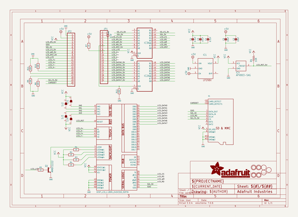
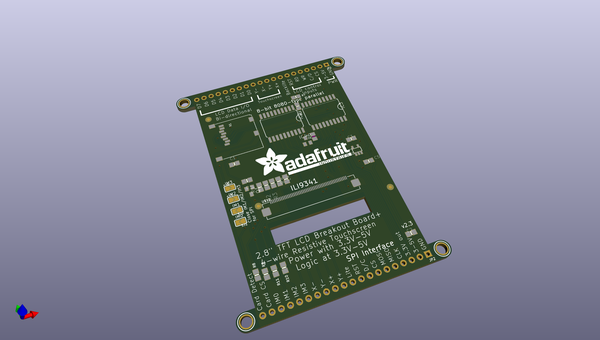
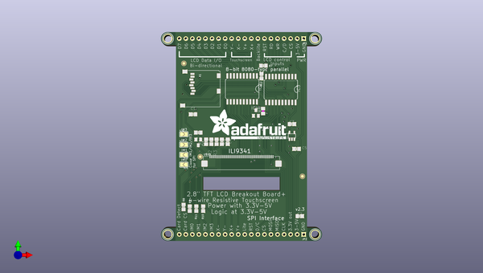
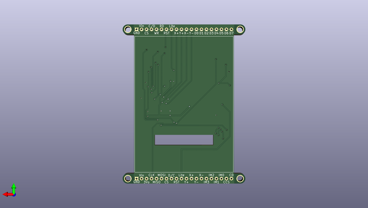

# 2_8_tft_breakout_pcb
 
## summary 
* id: adafruit_2_8_tft_breakout_pcb_adafruit_2_8_tft_breakout_v2
* user: adafruit
* name: 2_8_tft_breakout_pcb
* board: adafruit_2_8_tft_breakout_v2
* repo: https://github.com/adafruit/2.8-TFT-Breakout-PCB

* src_file_repo_sch: 
* src_file_repo_sch_link: https://github.com/adafruit/2.8-TFT-Breakout-PCB/tree/master/

## schematic  
  
[schematic (pdf)](working_schematic.pdf)  

## pcb  
 
  
  
  
[board (pdf)](working.pdf)  

## working_bom
| Id | Designator | Footprint | Quantity | Designation | Supplier and ref |  | None | 
| --- | --- | --- | --- | --- | --- | --- | --- | 
| 1 | C1,C4 | 0805-NO | 2 | 0.1uF |  |  | [''] | 
| 2 | U$19 | ADAFRUIT_TEXT_30MM | 1 |  |  |  | [''] | 
| 3 | R5,R7 | 0805-NO | 2 | 1K |  |  | [''] | 
| 4 | SJ2,SJ4,SJ3,SJ1 | SOLDERJUMPER_ARROW_NOPASTE | 4 |  |  |  | [''] | 
| 5 | X1 | MICROSD | 1 |  |  |  | [''] | 
| 6 | R6 | R0805 | 1 | 10K |  |  | [''] | 
| 7 | IC3,IC2 | SO20W | 2 | 74LVC245 |  |  | [''] | 
| 8 | JP1,JP2 | 1X20_ROUND | 2 |  |  |  | [''] | 
| 9 | U$7,U$17,U$16,U$15 | MOUNTINGHOLE_3.0_PLATEDTHIN | 4 | MOUNTINGHOLE3.0THIN |  |  | [''] | 
| 10 | R11,R9,R12,R10,R8 | 0805-NO | 5 | 10K |  |  | [''] | 
| 11 | R1,R4,R3,R2 | 0805-NO | 4 | 10 |  |  | [''] | 
| 12 | IC4 | SOT23 | 1 | APX803-SAG |  |  | [''] | 
| 13 | IC1 | SOT23-5L | 1 | MIC5225-3.3 |  |  | [''] | 
| 14 | C2,C3,C5 | 0805-NO | 3 | 10uF |  |  | [''] | 
| 15 | Q1 | SOT23-BEC | 1 | MMBT2222 |  |  | [''] | 
| 16 | U$11,U$23,U$9 | FIDUCIAL_1MM | 3 | FIDUCIAL |  |  | [''] | 
| 17 | U$10 | TFT_2.83IN_240X320_50PIN | 1 | DISP_LCD_1.28IN_240X320_50PIN |  |  | [''] | 

## bom_schematic
| Ref | Qnty | Value | Cmp name | Footprint | Description | Vendor | DNP | 
| --- | --- | --- | --- | --- | --- | --- | --- | 
| C1, C4 | 2 | 0.1uF | CAP_CERAMIC0805-NOOUTLINE | working:0805-NO |  |  |  | 
| C2, C3, C5 | 3 | 10uF | CAP_CERAMIC0805-NOOUTLINE | working:0805-NO |  |  |  | 
| IC1 | 1 | LP298XS | LP298XS | working:SOT23-5L |  |  |  | 
| IC2, IC3 | 2 | 74245DW | 74245DW | working:SO20W |  |  |  | 
| IC4 | 1 | APX803-SAG | AXP083-SAG | working:SOT23 |  |  |  | 
| JP1, JP2 | 2 | HEADER-1X20ROUND | HEADER-1X20ROUND | working:1X20_ROUND |  |  |  | 
| Q1 | 1 | MMBT2222 | -NPN-SOT23-BEC | working:SOT23-BEC |  |  |  | 
| R1, R2, R3, R4 | 4 | 10 | RESISTOR0805_NOOUTLINE | working:0805-NO |  |  |  | 
| R5, R7 | 2 | 1K | RESISTOR0805_NOOUTLINE | working:0805-NO |  |  |  | 
| R6 | 1 | 10K | R-US_R0805 | working:R0805 |  |  |  | 
| R8, R9, R10, R11, R12 | 5 | 10K | RESISTOR0805_NOOUTLINE | working:0805-NO |  |  |  | 
| SJ1, SJ2, SJ3, SJ4 | 4 | SOLDERJUMPER | SOLDERJUMPER | working:SOLDERJUMPER_ARROW_NOPASTE |  |  |  | 
| U$7, U$15, U$16, U$17 | 4 | MOUNTINGHOLE3.0THIN | MOUNTINGHOLE3.0THIN | working:MOUNTINGHOLE_3.0_PLATEDTHIN |  |  |  | 
| U$9, U$11, U$23 | 3 | FIDUCIAL | FIDUCIAL | working:FIDUCIAL_1MM |  |  |  | 
| U$10 | 1 | DISP_LCD_1.28IN_240X320_50PIN | DISP_LCD_1.28IN_240X320_50PIN | working:TFT_2.83IN_240X320_50PIN |  |  |  | 
| X1 | 1 | MICROSD | MICROSD | working:MICROSD |  |  |  | 

## mounting_holes
| x | y | package | value | ref | size | 
| --- | --- | --- | --- | --- | --- | 
| 119.9261 | -143.1036 | MOUNTINGHOLE_3.0_PLATEDTHIN | MOUNTINGHOLE3.0THIN | U$7 | m3 | 
| 177.0761 | -143.1036 | MOUNTINGHOLE_3.0_PLATEDTHIN | MOUNTINGHOLE3.0THIN | U$15 | m3 | 
| 119.9261 | -66.9036 | MOUNTINGHOLE_3.0_PLATEDTHIN | MOUNTINGHOLE3.0THIN | U$16 | m3 | 
| 177.0761 | -66.9036 | MOUNTINGHOLE_3.0_PLATEDTHIN | MOUNTINGHOLE3.0THIN | U$17 | m3 | 

## positions
### top
| # Ref | Val | Package | PosX | PosY | Rot | Side | 
| --- | --- | --- | --- | --- | --- | --- | 
| C1 | 0.1uF | 0805-NO | 129.7051 | -96.3676 | 180.0 | top | 
| C2 | 10uF | 0805-NO | 171.1071 | -135.9916 | 0.0 | top | 
| C3 | 10uF | 0805-NO | 168.0591 | -100.1776 | 0.0 | top | 
| C4 | 0.1uF | 0805-NO | 143.1671 | -107.0356 | -90.0 | top | 
| C5 | 10uF | 0805-NO | 169.8371 | -109.8296 | 180.0 | top | 
| IC1 | MIC5225-3.3 | SOT23-5L | 168.0591 | -104.7496 | 0.0 | top | 
| IC2 | 74LVC245 | SO20W | 148.7551 | -86.4616 | 180.0 | top | 
| IC3 | 74LVC245 | SO20W | 163.7411 | -86.7156 | 180.0 | top | 
| IC4 | APX803-SAG | SOT23 | 154.0891 | -95.8596 | 0.0 | top | 
| JP1 | nan | 1X20_ROUND | 148.5011 | -66.9036 | 180.0 | top | 
| JP2 | nan | 1X20_ROUND | 148.5011 | -143.1036 | 180.0 | top | 
| Q1 | MMBT2222 | SOT23-BEC | 131.7371 | -107.2896 | 180.0 | top | 
| R1 | 10 | 0805-NO | 134.7851 | -107.0356 | -90.0 | top | 
| R2 | 10 | 0805-NO | 136.8171 | -107.0356 | -90.0 | top | 
| R3 | 10 | 0805-NO | 138.8491 | -107.0356 | -90.0 | top | 
| R4 | 10 | 0805-NO | 140.8811 | -107.0356 | -90.0 | top | 
| R5 | 1K | 0805-NO | 131.7371 | -103.4796 | 0.0 | top | 
| R6 | 10K | R0805 | 156.8831 | -95.0976 | 90.0 | top | 
| R7 | 1K | 0805-NO | 157.0101 | -77.4446 | 0.0 | top | 
| R8 | 10K | 0805-NO | 126.0221 | -132.4356 | 90.0 | top | 
| R9 | 10K | 0805-NO | 128.4351 | -133.0706 | 90.0 | top | 
| R10 | 10K | 0805-NO | 133.6421 | -133.0706 | -90.0 | top | 
| R11 | 10K | 0805-NO | 130.9751 | -133.0706 | -90.0 | top | 
| R12 | 10K | 0805-NO | 156.2481 | -81.5086 | -90.0 | top | 
| SJ1 | nan | SOLDERJUMPER_ARROW_NOPASTE | 126.1491 | -115.9256 | 180.0 | top | 
| SJ2 | nan | SOLDERJUMPER_ARROW_NOPASTE | 126.1491 | -112.1156 | 180.0 | top | 
| SJ3 | nan | SOLDERJUMPER_ARROW_NOPASTE | 126.1491 | -108.1786 | 0.0 | top | 
| SJ4 | nan | SOLDERJUMPER_ARROW_NOPASTE | 126.1491 | -104.1146 | 0.0 | top | 
| U$7 | MOUNTINGHOLE3.0THIN | MOUNTINGHOLE_3.0_PLATEDTHIN | 119.9261 | -143.1036 | 0.0 | top | 
| U$9 | FIDUCIAL | FIDUCIAL_1MM | 172.1231 | -120.4976 | 0.0 | top | 
| U$11 | FIDUCIAL | FIDUCIAL_1MM | 126.1491 | -76.5556 | 0.0 | top | 
| U$15 | MOUNTINGHOLE3.0THIN | MOUNTINGHOLE_3.0_PLATEDTHIN | 177.0761 | -143.1036 | 0.0 | top | 
| U$16 | MOUNTINGHOLE3.0THIN | MOUNTINGHOLE_3.0_PLATEDTHIN | 119.9261 | -66.9036 | 0.0 | top | 
| U$17 | MOUNTINGHOLE3.0THIN | MOUNTINGHOLE_3.0_PLATEDTHIN | 177.0761 | -66.9036 | 0.0 | top | 
| U$19 | nan | ADAFRUIT_TEXT_30MM | 136.0551 | -106.0196 | 0.0 | top | 
| U$23 | FIDUCIAL | FIDUCIAL_1MM | 132.4991 | -112.8776 | 0.0 | top | 
| X1 | nan | MICROSD | 140.1191 | -79.3496 | -90.0 | top | 

### bottom
| # Ref | Val | Package | PosX | PosY | Rot | Side | 
| --- | --- | --- | --- | --- | --- | --- | 
| U$10 | DISP_LCD_1.28IN_240X320_50PIN | TFT_2.83IN_240X320_50PIN | 148.5011 | -102.4636 | 180.0 | bottom | 

