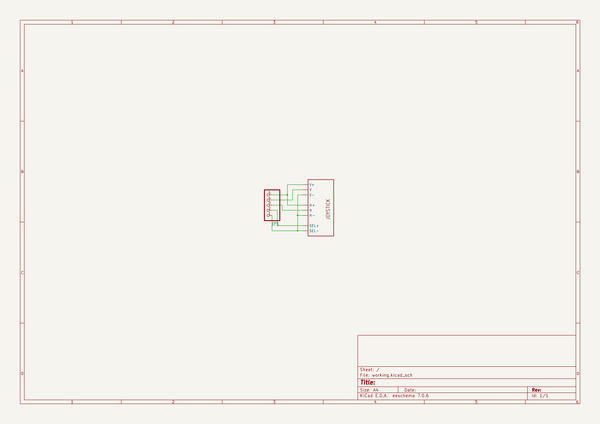
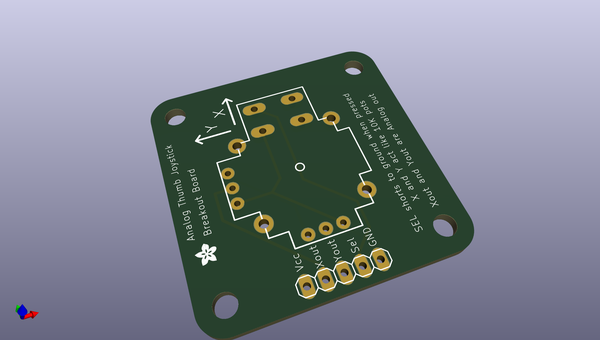
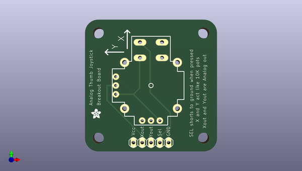
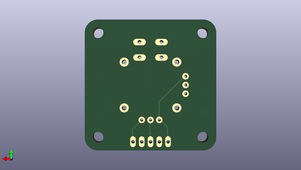

# 2_axis_joystick_breakout_board_with_mounting_holes
 
## summary 
* id: adafruit_2_axis_joystick_breakout_board_with_mounting_holes_joystick
* user: adafruit
* name: 2_axis_joystick_breakout_board_with_mounting_holes
* board: joystick
* repo: https://github.com/adafruit/2-axis-joystick-breakout-board-with-mounting-holes

* src_file_repo_sch: 
* src_file_repo_sch_link: https://github.com/adafruit/2-axis-joystick-breakout-board-with-mounting-holes/tree/master/

## schematic  
  
[schematic (pdf)](working_schematic.pdf)  

## pcb  
 
  
  
  
[board (pdf)](working.pdf)  

## working_bom
| Id | Designator | Footprint | Quantity | Designation | Supplier and ref |  | None | 
| --- | --- | --- | --- | --- | --- | --- | --- | 
| 1 | @HOLE2,@HOLE1,@HOLE3,@HOLE0 |  | 4 |  |  |  | [''] | 
| 2 | JP1 | 1X05 | 1 |  |  |  | [''] | 
| 3 | U1 | JOYSTICK | 1 | JOYSTICKPTH |  |  | [''] | 
| 4 | U$1 | ADAFRUIT200MIL | 1 |  |  |  | [''] | 

## bom_schematic
| Ref | Qnty | Value | Cmp name | Footprint | Description | Vendor | DNP | 
| --- | --- | --- | --- | --- | --- | --- | --- | 
| JP1 | 1 | PINHD-1X5 | PINHD-1X5 | working:1X05 |  |  |  | 
| U1 | 1 | JOYSTICKPTH | JOYSTICKPTH | working:JOYSTICK |  |  |  | 

## positions
### top
| # Ref | Val | Package | PosX | PosY | Rot | Side | 
| --- | --- | --- | --- | --- | --- | --- | 
| @HOLE0 | nan | nan | 133.2611 | -120.2436 | 0.0 | top | 
| @HOLE1 | nan | nan | 133.2611 | -89.7636 | 0.0 | top | 
| @HOLE2 | nan | nan | 163.7411 | -89.7636 | 0.0 | top | 
| @HOLE3 | nan | nan | 163.7411 | -120.2436 | 0.0 | top | 
| JP1 | nan | 1X05 | 148.5011 | -121.5136 | 180.0 | top | 
| U$1 | nan | ADAFRUIT200MIL | 132.4991 | -113.1316 | 0.0 | top | 
| U1 | JOYSTICKPTH | JOYSTICK | 148.5011 | -105.0036 | 0.0 | top | 

### bottom
no data
