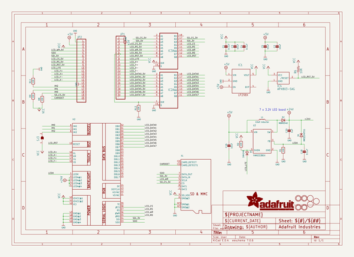
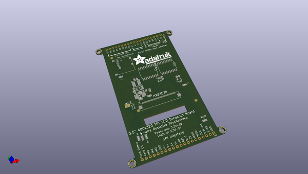
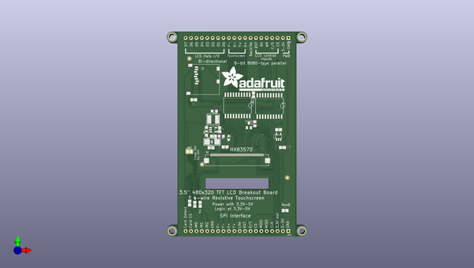
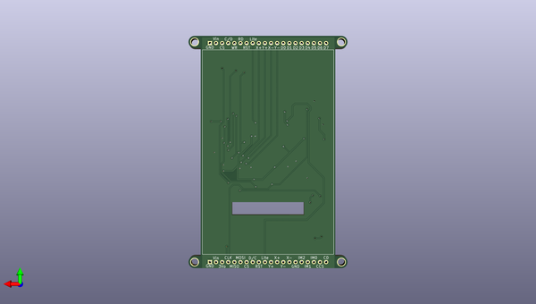

# 3_5inch_tft_breakout_pcb
 
## summary 
* id: adafruit_3_5inch_tft_breakout_pcb_adafruit_3_5in_480x320
* user: adafruit
* name: 3_5inch_tft_breakout_pcb
* board: adafruit_3_5in_480x320
* repo: https://github.com/adafruit/3.5inch-TFT-Breakout-PCB

* src_file_repo_sch: 
* src_file_repo_sch_link: https://github.com/adafruit/3.5inch-TFT-Breakout-PCB/tree/master/

## schematic  
  
[schematic (pdf)](working_schematic.pdf)  

## pcb  
 
  
  
  
[board (pdf)](working.pdf)  

## working_bom
| Id | Designator | Footprint | Quantity | Designation | Supplier and ref |  | None | 
| --- | --- | --- | --- | --- | --- | --- | --- | 
| 1 | U$17,U$7,U$15,U$16 | MOUNTINGHOLE_3.0_PLATEDTHIN | 4 | MOUNTINGHOLE3.0THIN |  |  | [''] | 
| 2 | IC1 | SOT23-5L | 1 | MIC5225-3.3 |  |  | [''] | 
| 3 | U$23,U$11,U$9 | FIDUCIAL_1MM | 3 | FIDUCIAL |  |  | [''] | 
| 4 | R8,R2,R11,R12,R9 | 0805-NO | 5 | 10K |  |  | [''] | 
| 5 | D2 | SOD-123 | 1 | MBR0540 |  |  | [''] | 
| 6 | D1 | SMADIODE | 1 | MM3Z24VT1G |  |  | [''] | 
| 7 | C5,C3,C2 | 0805-NO | 3 | 10uF |  |  | [''] | 
| 8 | L1 | INDUCTOR_5X5MM_NR5040_NOTHERMALS | 1 | 10uH inductor |  |  | [''] | 
| 9 | D4 | SOD-323F | 1 | 1N4148 |  |  | [''] | 
| 10 | IC2,IC3 | SO20W | 2 | 74LVC245 |  |  | [''] | 
| 11 | C20 | 0805-NO | 1 | 1uF |  |  | [''] | 
| 12 | U$19 | ADAFRUIT_TEXT_30MM | 1 |  |  |  | [''] | 
| 13 | C18,C4,C1 | 0805-NO | 3 | 0.1uF |  |  | [''] | 
| 14 | C16 | _0805MP | 1 | 10uF |  |  | [''] | 
| 15 | JP2,JP1 | 1X20_ROUND | 2 |  |  |  | [''] | 
| 16 | IC4 | SOT23 | 1 | APX803-SAG |  |  | [''] | 
| 17 | R6 | R0805 | 1 | 10K |  |  | [''] | 
| 18 | SJ3 | SOLDERJUMPER_ARROW_NOPASTE | 1 |  |  |  | [''] | 
| 19 | X1 | MICROSD | 1 |  |  |  | [''] | 
| 20 | U3 | SOT23-5@1 | 1 | FAN5333BSX |  |  | [''] | 
| 21 | R1 | _0805MP | 1 | 12Ω |  |  | [''] | 
| 22 | X2 | TFT_3.5IN_320X480_50PIN | 1 |  |  |  | [''] | 

## bom_schematic
| Ref | Qnty | Value | Cmp name | Footprint | Description | Vendor | DNP | 
| --- | --- | --- | --- | --- | --- | --- | --- | 
| C1, C4, C18 | 3 | 0.1uF | CAP_CERAMIC0805-NOOUTLINE | working:0805-NO |  |  |  | 
| C2, C3, C5 | 3 | 10uF | CAP_CERAMIC0805-NOOUTLINE | working:0805-NO |  |  |  | 
| C16 | 1 | 10uF | CAP_CERAMIC_0805MP | working:_0805MP |  |  |  | 
| C20 | 1 | 1uF | CAP_CERAMIC0805-NOOUTLINE | working:0805-NO |  |  |  | 
| D1 | 1 | MM3Z24VT1G | DIODESMA | working:SMADIODE |  |  |  | 
| D2 | 1 | MBR0540 | DIODESOD-123 | working:SOD-123 |  |  |  | 
| D4 | 1 | 1N4148 | DIODESOD-323F | working:SOD-323F |  |  |  | 
| IC1 | 1 | LP298XS | LP298XS | working:SOT23-5L |  |  |  | 
| IC2, IC3 | 2 | 74245DW | 74245DW | working:SO20W |  |  |  | 
| IC4 | 1 | APX803-SAG | AXP083-SAG | working:SOT23 |  |  |  | 
| JP1, JP2 | 2 | HEADER-1X20ROUND | HEADER-1X20ROUND | working:1X20_ROUND |  |  |  | 
| L1 | 1 | 10uH inductor | INDUCTORNR5040 | working:INDUCTOR_5X5MM_NR5040_NOTHERMALS |  |  |  | 
| R1 | 1 | 12Ω | RESISTOR_0805MP | working:_0805MP |  |  |  | 
| R2, R8, R9, R11, R12 | 5 | 10K | RESISTOR0805_NOOUTLINE | working:0805-NO |  |  |  | 
| R6 | 1 | 10K | R-US_R0805 | working:R0805 |  |  |  | 
| SJ3 | 1 | SOLDERJUMPER | SOLDERJUMPER | working:SOLDERJUMPER_ARROW_NOPASTE |  |  |  | 
| U3 | 1 | FAN5333BSX | FAN5331 | working:SOT23-5@1 |  |  |  | 
| U$7, U$15, U$16, U$17 | 4 | MOUNTINGHOLE3.0THIN | MOUNTINGHOLE3.0THIN | working:MOUNTINGHOLE_3.0_PLATEDTHIN |  |  |  | 
| U$9, U$11, U$23 | 3 | FIDUCIAL | FIDUCIAL | working:FIDUCIAL_1MM |  |  |  | 
| X1 | 1 | MICROSD | MICROSD | working:MICROSD |  |  |  | 
| X2 | 1 | DISP_LCD_3.5IN_320X480_50PIN | DISP_LCD_3.5IN_320X480_50PIN | working:TFT_3.5IN_320X480_50PIN |  |  |  | 

## mounting_holes
| x | y | package | value | ref | size | 
| --- | --- | --- | --- | --- | --- | 
| 118.0211 | -150.7236 | MOUNTINGHOLE_3.0_PLATEDTHIN | MOUNTINGHOLE3.0THIN | U$7 | m3 | 
| 178.9811 | -150.7236 | MOUNTINGHOLE_3.0_PLATEDTHIN | MOUNTINGHOLE3.0THIN | U$15 | m3 | 
| 118.0211 | -59.2836 | MOUNTINGHOLE_3.0_PLATEDTHIN | MOUNTINGHOLE3.0THIN | U$16 | m3 | 
| 178.9811 | -59.2836 | MOUNTINGHOLE_3.0_PLATEDTHIN | MOUNTINGHOLE3.0THIN | U$17 | m3 | 

## positions
### top
| # Ref | Val | Package | PosX | PosY | Rot | Side | 
| --- | --- | --- | --- | --- | --- | --- | 
| C1 | 0.1uF | 0805-NO | 128.1811 | -88.8746 | 0.0 | top | 
| C2 | 10uF | 0805-NO | 171.1071 | -141.0716 | 0.0 | top | 
| C3 | 10uF | 0805-NO | 168.0591 | -102.9716 | 0.0 | top | 
| C4 | 0.1uF | 0805-NO | 142.9131 | -111.0996 | 180.0 | top | 
| C5 | 10uF | 0805-NO | 169.8371 | -111.3536 | 180.0 | top | 
| C16 | 10uF | _0805MP | 137.8331 | -94.2086 | 180.0 | top | 
| C18 | 0.1uF | 0805-NO | 137.4521 | -106.0196 | 180.0 | top | 
| C20 | 1uF | 0805-NO | 136.3091 | -111.4806 | 0.0 | top | 
| D1 | MM3Z24VT1G | SMADIODE | 136.8171 | -108.6866 | 0.0 | top | 
| D2 | MBR0540 | SOD-123 | 134.1501 | -103.7336 | 90.0 | top | 
| D4 | 1N4148 | SOD-323F | 144.5641 | -106.9086 | -90.0 | top | 
| IC1 | MIC5225-3.3 | SOT23-5L | 168.0591 | -106.2736 | 0.0 | top | 
| IC2 | 74LVC245 | SO20W | 148.7551 | -91.5416 | 180.0 | top | 
| IC3 | 74LVC245 | SO20W | 163.7411 | -91.7956 | 180.0 | top | 
| IC4 | APX803-SAG | SOT23 | 154.0891 | -100.9396 | 0.0 | top | 
| JP1 | nan | 1X20_ROUND | 148.5011 | -59.7916 | 180.0 | top | 
| JP2 | nan | 1X20_ROUND | 148.5011 | -150.7236 | 180.0 | top | 
| L1 | 10uH_inductor | INDUCTOR_5X5MM_NR5040_NOTHERMALS | 137.3251 | -98.1456 | 180.0 | top | 
| R1 | 12Ω | _0805MP | 141.1351 | -106.0196 | 180.0 | top | 
| R2 | 10K | 0805-NO | 140.3731 | -102.9716 | 90.0 | top | 
| R6 | 10K | R0805 | 156.8831 | -100.1776 | 90.0 | top | 
| R8 | 10K | 0805-NO | 126.2761 | -137.5156 | 90.0 | top | 
| R9 | 10K | 0805-NO | 128.6891 | -138.1506 | 90.0 | top | 
| R11 | 10K | 0805-NO | 131.2291 | -138.1506 | -90.0 | top | 
| R12 | 10K | 0805-NO | 156.2481 | -86.5886 | -90.0 | top | 
| SJ3 | nan | SOLDERJUMPER_ARROW_NOPASTE | 126.1491 | -113.2586 | 0.0 | top | 
| U$7 | MOUNTINGHOLE3.0THIN | MOUNTINGHOLE_3.0_PLATEDTHIN | 118.0211 | -150.7236 | 0.0 | top | 
| U$9 | FIDUCIAL | FIDUCIAL_1MM | 172.1231 | -125.5776 | 0.0 | top | 
| U$11 | FIDUCIAL | FIDUCIAL_1MM | 126.1491 | -69.4436 | 0.0 | top | 
| U$15 | MOUNTINGHOLE3.0THIN | MOUNTINGHOLE_3.0_PLATEDTHIN | 178.9811 | -150.7236 | 0.0 | top | 
| U$16 | MOUNTINGHOLE3.0THIN | MOUNTINGHOLE_3.0_PLATEDTHIN | 118.0211 | -59.2836 | 0.0 | top | 
| U$17 | MOUNTINGHOLE3.0THIN | MOUNTINGHOLE_3.0_PLATEDTHIN | 178.9811 | -59.2836 | 0.0 | top | 
| U$19 | nan | ADAFRUIT_TEXT_30MM | 141.1351 | -84.6836 | 0.0 | top | 
| U$23 | FIDUCIAL | FIDUCIAL_1MM | 132.1181 | -119.3546 | 0.0 | top | 
| U3 | FAN5333BSX | SOT23-5@1 | 137.3251 | -102.9716 | -90.0 | top | 
| X1 | nan | MICROSD | 140.1191 | -72.2376 | -90.0 | top | 

### bottom
| # Ref | Val | Package | PosX | PosY | Rot | Side | 
| --- | --- | --- | --- | --- | --- | --- | 
| X2 | nan | TFT_3.5IN_320X480_50PIN | 148.5011 | -110.0836 | 180.0 | bottom | 

